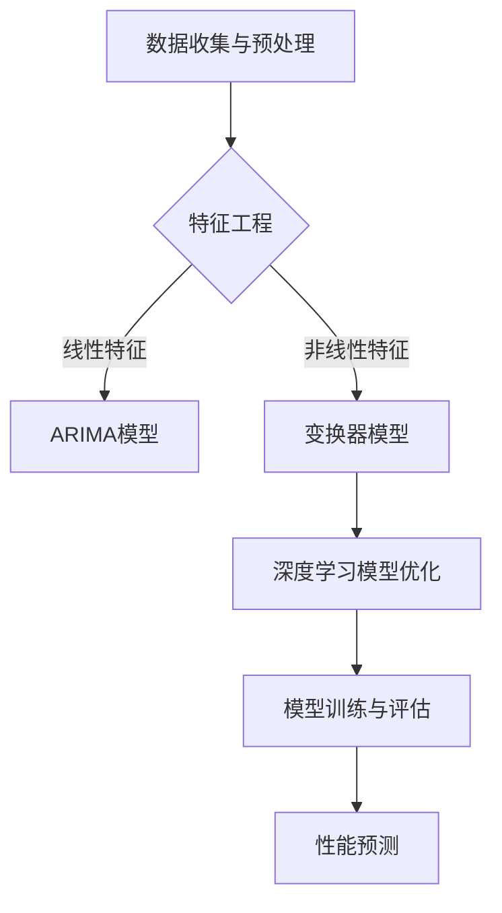

                 

## 引言

### 1.1 问题背景

随着人工智能技术的迅猛发展，大型语言模型（Large Language Models，简称LLM）在自然语言处理（Natural Language Processing，NLP）领域取得了显著成果。LLM是一种能够理解和生成人类语言的深度学习模型，通过对海量文本数据进行训练，LLM具备了强大的文本理解、文本生成和文本推理能力。这些特性使得LLM在多个领域，如智能问答、机器翻译、文本摘要和情感分析等方面展现出巨大的应用潜力。

然而，随着LLM模型的不断进化，如何对其性能进行有效的趋势预测成为一个关键问题。性能趋势预测可以帮助我们了解LLM在训练过程中的表现，预测其在未来的表现，从而为模型优化和资源分配提供科学依据。此外，性能趋势预测还可以为实际应用场景中的模型部署提供指导，帮助用户在合适的时间点更新和替换模型，以保持最佳性能。

### 1.2 问题描述

在LLM性能趋势预测问题中，主要涉及到以下几个核心问题：

1. **性能指标选择**：如何选择合适的性能指标来衡量LLM的性能？
2. **数据收集与预处理**：如何收集和预处理与LLM性能相关的数据？
3. **预测方法选择**：如何选择合适的预测方法来预测LLM的性能趋势？
4. **模型优化与调参**：如何通过模型优化和调参来提高预测的准确性？
5. **应用场景拓展**：如何将LLM性能趋势预测应用于实际场景，如智能问答系统、文本生成和机器翻译等？

### 1.3 问题解决

为了解决上述问题，我们可以从以下几个方面入手：

1. **性能指标选择**：根据具体应用场景，选择合适的性能指标，如准确率、召回率、F1值等。
2. **数据收集与预处理**：通过收集LLM的训练数据，对数据进行清洗、去噪、归一化等预处理操作，以提高数据的可用性和准确性。
3. **预测方法选择**：结合时间序列分析的方法，如ARIMA、LSTM等，选择适合的预测方法来预测LLM的性能趋势。
4. **模型优化与调参**：通过交叉验证、网格搜索等手段，优化模型参数，提高预测模型的准确性。
5. **应用场景拓展**：将预测模型应用于实际场景，通过评估和调整，实现性能趋势预测的应用价值。

### 1.4 边界与外延

在LLM性能趋势预测问题的研究中，我们需要关注以下几个边界与外延：

1. **数据范围**：研究的范围应限定在特定时间窗口内的LLM性能数据，不宜过分追求全局性能。
2. **预测精度**：预测精度需要根据实际需求进行调整，不宜过分追求高精度而忽略了预测效率。
3. **模型适应性**：选择预测模型时应考虑其适应性和灵活性，以应对不同的LLM性能变化。
4. **应用场景**：在将LLM性能趋势预测应用于实际场景时，需要充分考虑实际场景的特殊性，如数据分布、计算资源等。

### 1.5 概念结构与核心要素组成

LLM性能趋势预测问题涉及多个核心概念和要素，主要包括：

1. **性能指标**：如准确率、召回率、F1值等。
2. **时间序列数据**：记录LLM性能随时间变化的序列数据。
3. **预测模型**：如ARIMA、LSTM等，用于预测LLM性能趋势。
4. **数据预处理方法**：如清洗、去噪、归一化等。
5. **模型优化方法**：如交叉验证、网格搜索等。
6. **应用场景**：如智能问答、机器翻译、文本生成等。

通过对上述概念和要素的分析和理解，我们可以为后续的研究和实践提供清晰的方向和基础。接下来，我们将对时间序列分析的基础知识进行深入探讨，为LLM性能趋势预测提供理论支持。

-------------------------------------

## 2. 时间序列分析基础

### 2.1 时间序列数据的定义与特征

时间序列数据（Time Series Data）是指按照时间顺序排列的一组数据点，这些数据点可以反映某一现象在时间维度上的变化规律。在LLM性能趋势预测中，时间序列数据记录了模型在训练过程中不同时间点的性能表现，通过分析这些数据，可以预测未来的性能趋势。

时间序列数据具有以下几个显著特征：

1. **有序性**：时间序列数据按照时间顺序排列，每个数据点都有明确的时间戳。
2. **波动性**：时间序列数据往往存在波动，这种波动可能是由于外部环境变化、数据噪声等原因引起的。
3. **周期性**：某些时间序列数据可能存在周期性波动，如季节性波动，这通常是由于季节性因素引起的。
4. **趋势性**：时间序列数据可能会表现出长期上升或下降的趋势，这是由于数据内在规律或外部因素导致的。

### 2.2 时间序列数据可视化

为了更好地理解时间序列数据的特征，我们可以通过可视化方法对其进行展示。常见的可视化工具包括折线图、散点图和热力图等。

- **折线图**：通过连接时间序列数据点，展示数据随时间的变化趋势。折线图的横轴通常表示时间，纵轴表示数据值。
- **散点图**：在坐标系中，每个数据点由其时间戳和数据值确定，通过观察散点分布，可以识别数据中的异常值和趋势。
- **热力图**：用颜色深浅表示数据值的大小，适合展示多维时间序列数据的分布情况。

### 2.3 时间序列数据的预处理

时间序列数据的预处理是进行分析和建模的重要步骤，主要包括以下几个环节：

1. **数据清洗**：去除噪声数据、处理缺失值和异常值，保证数据质量。
2. **数据归一化**：通过缩放或转换，使得不同特征的数据具有相似尺度，避免数据之间因尺度差异造成的偏差。
3. **数据分解**：将时间序列数据分解为趋势项、季节项和残差项，以便更好地理解数据的内在结构。
4. **特征工程**：通过构造新的特征变量，增加数据的表达能力，提高模型性能。

### 2.4 时间序列数据的数学模型

时间序列数据的数学模型用于描述数据在时间维度上的变化规律，常见的数学模型包括自回归模型（AR）、移动平均模型（MA）、自回归移动平均模型（ARMA）和自回归积分滑动平均模型（ARIMA）。

- **自回归模型（AR）**：利用前几个时间点的数据来预测当前时间点的数据值，适用于平稳序列。
- **移动平均模型（MA）**：利用过去一段时间内的平均数据来预测当前时间点的数据值，适用于平稳序列。
- **自回归移动平均模型（ARMA）**：结合自回归和移动平均模型，适用于非平稳序列。
- **自回归积分滑动平均模型（ARIMA）**：通过差分方法使序列平稳，再结合AR和MA模型，适用于非平稳序列。

### 2.5 时间序列分析的方法与算法

时间序列分析的方法和算法用于对时间序列数据进行分析和预测，常见的算法包括统计方法、机器学习方法、深度学习方法等。

- **统计方法**：如ARIMA模型、季节性分解模型等，适用于线性关系和短期预测。
- **机器学习方法**：如线性回归、支持向量机（SVM）、随机森林等，适用于非线性关系和长期预测。
- **深度学习方法**：如循环神经网络（RNN）、长短期记忆网络（LSTM）、门控循环单元（GRU）等，适用于复杂非线性关系和长期预测。

### 2.6 时间序列分析的应用场景

时间序列分析在多个领域具有广泛的应用，以下是一些常见应用场景：

- **金融市场预测**：预测股票价格、货币汇率等金融市场的变化趋势。
- **天气预报**：预测未来几天的天气情况，如温度、降雨量等。
- **库存管理**：预测库存需求，优化库存水平，降低库存成本。
- **能源需求预测**：预测能源消耗，优化能源供给。
- **用户行为分析**：预测用户行为模式，如购物偏好、浏览习惯等。

### 2.7 时间序列分析的工具与库

在Python中，常用的时间序列分析库包括pandas、statsmodels、scikit-learn和tensorflow等。

- **pandas**：提供高效的时间序列数据处理和分析功能。
- **statsmodels**：提供统计模型和时间序列模型的估计和预测。
- **scikit-learn**：提供多种机器学习算法，适用于时间序列数据。
- **tensorflow**：提供深度学习模型和时间序列分析工具。

### 2.8 时间序列分析的核心概念与联系

#### 2.8.1 时间序列数据的特征属性

时间序列数据的特征属性主要包括：

- **平稳性**：序列的统计特性（均值、方差等）不随时间变化。
- **自相关性**：序列中的数据点与其滞后值之间存在相关性。
- **趋势性**：序列数据随时间呈现出上升或下降的趋势。
- **季节性**：序列数据随时间呈现出周期性的波动。

#### 2.8.2 时间序列数据的数学模型对比

不同数学模型的特点和适用场景如下：

| 模型 | 特点 | 适用场景 |
| :--: | :--: | :--: |
| ARIMA | 处理非平稳序列，适用于短期预测 | 金融市场预测、销售数据预测 |
| LSTM | 处理非线性关系，适用于长期预测 | 文本生成、语音识别 |
| AR | 线性关系，处理平稳序列 | 时间序列预测、股票价格预测 |
| MA | 线性关系，处理平稳序列 | 时间序列预测、股票价格预测 |
| ARMA | 线性组合，处理非平稳序列 | 时间序列预测、股票价格预测 |

#### 2.8.3 时间序列分析算法的关系与联系

时间序列分析算法之间的关系和联系如下：

- **统计方法**：基于数学统计理论，适用于线性关系和时间序列数据的短期预测。
- **机器学习方法**：基于数据驱动，适用于非线性关系和复杂模型，可以处理长期预测问题。
- **深度学习方法**：基于神经网络，具有强大的表达能力和适应性，适用于复杂时间序列数据的分析和预测。

通过深入理解时间序列分析的基础知识，我们可以为LLM性能趋势预测提供理论支持。在接下来的部分，我们将详细介绍LLM性能趋势预测的具体方法。

-------------------------------------

## 3. LLM性能趋势预测方法

### 3.1 LLM性能趋势预测的基本概念

LLM性能趋势预测是指通过分析LLM在训练过程中产生的性能数据，利用统计模型、机器学习和深度学习等方法，对未来的性能趋势进行预测。LLM性能趋势预测的基本概念包括：

- **性能指标**：用于衡量LLM性能的数据指标，如准确率、召回率、F1值等。
- **时间序列数据**：记录LLM性能随时间变化的序列数据。
- **预测模型**：用于对LLM性能进行预测的数学模型或算法。
- **训练数据**：用于训练预测模型的性能数据。
- **测试数据**：用于评估预测模型性能的数据。

### 3.2 基于传统统计方法的LLM性能趋势预测

传统统计方法在LLM性能趋势预测中发挥着重要作用，以下是一些常用的统计方法：

1. **ARIMA模型**：自回归积分滑动平均模型（ARIMA）是一种适用于时间序列数据的统计模型。ARIMA模型通过自回归（AR）、差分（I）和移动平均（MA）组合来描述时间序列数据。在LLM性能趋势预测中，我们可以使用ARIMA模型来分析性能数据的时间序列特性，并预测未来的性能趋势。

2. **季节性分解模型**：季节性分解模型将时间序列数据分解为趋势项、季节项和残差项。通过分析季节性成分，可以识别出数据中的周期性波动，从而对LLM性能进行更准确的预测。这种方法在销售数据、天气预测等应用中具有广泛的应用。

3. **线性回归模型**：线性回归模型是一种简单而有效的统计方法，用于分析自变量和因变量之间的线性关系。在LLM性能趋势预测中，我们可以使用线性回归模型来分析历史性能数据，并预测未来的性能变化。

### 3.3 基于机器学习方法的LLM性能趋势预测

机器学习方法在LLM性能趋势预测中具有显著优势，以下是一些常用的机器学习方法：

1. **支持向量机（SVM）**：支持向量机是一种强大的分类和回归方法，通过最大化分类边界来预测数据。在LLM性能趋势预测中，SVM可以用于分析历史性能数据，并预测未来的性能趋势。

2. **随机森林（Random Forest）**：随机森林是一种集成学习方法，通过构建多个决策树并投票来预测结果。随机森林具有较强的泛化能力和鲁棒性，适用于复杂的LLM性能趋势预测。

3. **K最近邻（KNN）**：K最近邻是一种基于实例的学习方法，通过计算新数据与训练数据的距离来预测结果。在LLM性能趋势预测中，KNN可以用于根据历史性能数据预测未来的性能变化。

### 3.4 基于深度学习方法的LLM性能趋势预测

深度学习方法在LLM性能趋势预测中表现出强大的能力，以下是一些常用的深度学习方法：

1. **循环神经网络（RNN）**：循环神经网络是一种适用于序列数据的学习方法，通过记忆历史信息来预测未来的性能变化。在LLM性能趋势预测中，RNN可以用于分析历史性能数据，并预测未来的性能趋势。

2. **长短期记忆网络（LSTM）**：长短期记忆网络是RNN的一种改进，通过引入门控机制来避免梯度消失问题。LSTM在处理长序列数据时具有显著优势，适用于复杂的LLM性能趋势预测。

3. **门控循环单元（GRU）**：门控循环单元是LSTM的另一种改进，相比LSTM具有更简洁的结构和更好的性能。GRU在处理时间序列数据时表现出强大的能力，适用于LLM性能趋势预测。

4. **变换器（Transformer）**：变换器是一种基于注意力机制的深度学习模型，广泛应用于NLP任务。在LLM性能趋势预测中，变换器可以用于分析历史性能数据，并预测未来的性能趋势。

### 3.5 基于集成学习方法的LLM性能趋势预测

集成学习方法通过组合多个预测模型来提高预测准确性，以下是一些常用的集成学习方法：

1. **Bagging**：Bagging是一种基于集成学习的方法，通过训练多个基模型，并取它们的平均值来预测结果。在LLM性能趋势预测中，Bagging可以用于组合多个统计模型或机器学习模型，提高预测准确性。

2. **Boosting**：Boosting是一种基于集成学习的方法，通过训练多个基模型，并赋予不同的权重来预测结果。在LLM性能趋势预测中，Boosting可以用于组合多个机器学习模型，提高预测准确性。

3. **Stacking**：Stacking是一种基于集成学习的方法，通过训练多个基模型，并将它们的输出作为新特征进行训练。在LLM性能趋势预测中，Stacking可以用于组合多个统计模型、机器学习模型和深度学习模型，提高预测准确性。

### 3.6 LLM性能趋势预测方法的比较与优化

不同LLM性能趋势预测方法具有各自的优缺点，以下是比较与优化策略：

1. **模型选择**：根据LLM性能数据的特性和预测需求，选择合适的预测方法。对于线性关系和短期预测，可以优先选择ARIMA、线性回归等统计方法；对于非线性关系和长期预测，可以优先选择LSTM、变换器等深度学习方法。

2. **模型融合**：通过组合多个预测模型，提高预测准确性。可以使用Bagging、Boosting、Stacking等集成学习方法来组合统计模型、机器学习模型和深度学习模型。

3. **特征工程**：通过构造新的特征变量，提高数据的表达能力。例如，可以引入时间窗口、滞后项、移动平均等特征，增强模型对LLM性能趋势的捕捉能力。

4. **模型调参**：通过交叉验证、网格搜索等手段，优化模型参数，提高预测准确性。例如，可以调整LSTM的隐层单元数、学习率等参数，以提高预测性能。

5. **模型评估**：使用交叉验证、ROC曲线、精确率等指标来评估模型性能，并根据评估结果调整模型。

### 3.7 LLM性能趋势预测的应用实例

以下是一个LLM性能趋势预测的应用实例：

假设我们有一个大型语言模型（LLM）在训练过程中记录了不同时间点的性能数据，包括准确率、召回率、F1值等指标。为了预测未来的性能趋势，我们采用以下步骤：

1. **数据收集与预处理**：收集LLM的训练数据，并对数据进行清洗、归一化等预处理操作。
2. **特征工程**：构造新的特征变量，如时间窗口、滞后项等，增强数据的表达能力。
3. **模型选择**：根据数据特性和预测需求，选择合适的预测模型，如LSTM、ARIMA等。
4. **模型训练与优化**：使用训练数据训练预测模型，并通过交叉验证、网格搜索等手段优化模型参数。
5. **性能评估**：使用测试数据评估模型的性能，并根据评估结果调整模型。
6. **性能预测**：使用训练好的模型对未来的性能趋势进行预测。

通过以上步骤，我们可以实现LLM性能趋势预测，为模型优化和资源分配提供科学依据。接下来，我们将通过具体案例来进一步阐述LLM性能趋势预测的应用和实践。

### 3.8 LLM性能趋势预测算法的Mermaid流程图

以下是LLM性能趋势预测算法的Mermaid流程图，用于展示LLM性能趋势预测的完整过程：

该流程图包括以下步骤：

1. **数据收集与预处理**：收集LLM的性能数据，并进行预处理。
2. **特征工程**：构造新的特征变量，以增强数据的表达能力。
3. **模型选择**：根据特征变量的性质，选择适当的预测模型，如ARIMA模型（线性特征）和变换器模型（非线性特征）。
4. **深度学习模型优化**：对选择的深度学习模型进行参数优化，以提高预测性能。
5. **模型训练与评估**：使用训练数据训练模型，并通过交叉验证、ROC曲线等指标评估模型性能。
6. **性能预测**：使用训练好的模型对未来的LLM性能趋势进行预测。

通过该流程图，我们可以清晰地理解LLM性能趋势预测的完整流程，为实际应用提供参考。

-------------------------------------

## 4. 实际案例分析

### 4.1 案例一：LLM性能趋势预测在某电商平台的实践

#### 4.1.1 项目背景

某电商平台在开发其智能问答系统时，采用了大型语言模型（LLM）进行文本理解和生成。随着电商业务的快速发展，平台上的用户提问量不断增加，如何及时响应用户需求成为一个关键问题。为了优化问答系统的性能，平台决定利用LLM性能趋势预测技术，对未来的性能变化进行预测，以便在合适的时间点进行模型更新和优化。

#### 4.1.2 系统功能设计

系统的功能设计主要包括以下几个部分：

1. **数据采集模块**：负责收集LLM在训练过程中产生的性能数据，包括准确率、召回率、F1值等。
2. **数据处理模块**：对采集到的性能数据进行清洗、归一化等预处理操作，以消除噪声和异常值。
3. **特征工程模块**：通过构造新的特征变量，如时间窗口、滞后项等，增强数据的表达能力。
4. **预测模块**：选择合适的预测模型，如ARIMA、变换器等，对LLM性能进行趋势预测。
5. **性能评估模块**：使用测试数据对预测模型进行评估，并根据评估结果调整模型参数。
6. **性能预测模块**：使用训练好的模型对未来的LLM性能进行预测，为模型更新和优化提供依据。

#### 4.1.3 系统架构设计

系统的架构设计包括以下几个层次：

1. **数据层**：负责存储和管理性能数据，包括用户提问、回答、LLM性能指标等。
2. **数据处理层**：包括数据采集模块、数据处理模块和特征工程模块，负责对性能数据进行预处理和特征提取。
3. **预测层**：包括预测模块、性能评估模块和性能预测模块，负责进行LLM性能趋势预测和性能评估。
4. **展示层**：通过可视化工具展示LLM性能趋势预测结果，为业务决策提供支持。

#### 4.1.4 系统接口设计

系统的接口设计主要包括以下几个部分：

1. **数据采集接口**：用于从LLM训练过程中收集性能数据，包括准确率、召回率、F1值等。
2. **数据处理接口**：用于对采集到的性能数据进行清洗、归一化等预处理操作。
3. **特征工程接口**：用于构造新的特征变量，如时间窗口、滞后项等。
4. **预测接口**：用于选择和训练预测模型，并对LLM性能进行趋势预测。
5. **性能评估接口**：用于评估预测模型的性能，并根据评估结果调整模型参数。
6. **性能预测接口**：用于使用训练好的模型对未来的LLM性能进行预测，为模型更新和优化提供依据。

#### 4.1.5 系统交互流程

系统交互流程如下：

1. **数据采集**：LLM在训练过程中，采集性能数据，如准确率、召回率、F1值等，并将数据上传至数据层。
2. **数据处理**：数据处理模块对采集到的性能数据进行清洗、归一化等预处理操作，以消除噪声和异常值。
3. **特征工程**：特征工程模块通过构造新的特征变量，如时间窗口、滞后项等，增强数据的表达能力。
4. **模型选择**：预测模块根据数据特性，选择合适的预测模型，如ARIMA、变换器等。
5. **模型训练**：使用预处理后的数据对选择的预测模型进行训练，并通过交叉验证、网格搜索等手段优化模型参数。
6. **性能评估**：使用测试数据对训练好的模型进行评估，并根据评估结果调整模型参数。
7. **性能预测**：使用训练好的模型对未来的LLM性能进行预测，并将预测结果可视化展示。

通过以上系统交互流程，电商平台可以实时了解LLM性能变化，预测未来的性能趋势，从而为模型更新和优化提供科学依据。

### 4.2 案例二：LLM性能趋势预测在某金融行业的应用

#### 4.2.1 项目背景

某金融行业企业在开发其智能投顾系统时，采用了大型语言模型（LLM）进行金融文本分析和预测。随着金融市场的变化，如何及时调整投资策略成为企业面临的一个重要问题。为了优化智能投顾系统的性能，企业决定利用LLM性能趋势预测技术，对未来的性能变化进行预测，以便在合适的时间点调整投资策略。

#### 4.2.2 系统功能设计

系统的功能设计主要包括以下几个部分：

1. **数据采集模块**：负责收集LLM在训练过程中产生的性能数据，包括准确率、召回率、F1值等。
2. **数据处理模块**：对采集到的性能数据进行清洗、归一化等预处理操作，以消除噪声和异常值。
3. **特征工程模块**：通过构造新的特征变量，如时间窗口、滞后项等，增强数据的表达能力。
4. **预测模块**：选择合适的预测模型，如ARIMA、变换器等，对LLM性能进行趋势预测。
5. **性能评估模块**：使用测试数据对预测模型进行评估，并根据评估结果调整模型参数。
6. **性能预测模块**：使用训练好的模型对未来的LLM性能进行预测，为投资策略调整提供依据。

#### 4.2.3 系统架构设计

系统的架构设计包括以下几个层次：

1. **数据层**：负责存储和管理性能数据，包括金融文本数据、LLM性能指标等。
2. **数据处理层**：包括数据采集模块、数据处理模块和特征工程模块，负责对性能数据进行预处理和特征提取。
3. **预测层**：包括预测模块、性能评估模块和性能预测模块，负责进行LLM性能趋势预测和性能评估。
4. **展示层**：通过可视化工具展示LLM性能趋势预测结果，为投资策略调整提供支持。

#### 4.2.4 系统接口设计

系统的接口设计主要包括以下几个部分：

1. **数据采集接口**：用于从LLM训练过程中收集性能数据，包括准确率、召回率、F1值等。
2. **数据处理接口**：用于对采集到的性能数据进行清洗、归一化等预处理操作。
3. **特征工程接口**：用于构造新的特征变量，如时间窗口、滞后项等。
4. **预测接口**：用于选择和训练预测模型，并对LLM性能进行趋势预测。
5. **性能评估接口**：用于评估预测模型的性能，并根据评估结果调整模型参数。
6. **性能预测接口**：用于使用训练好的模型对未来的LLM性能进行预测，为投资策略调整提供依据。

#### 4.2.5 系统交互流程

系统交互流程如下：

1. **数据采集**：LLM在训练过程中，采集性能数据，如准确率、召回率、F1值等，并将数据上传至数据层。
2. **数据处理**：数据处理模块对采集到的性能数据进行清洗、归一化等预处理操作，以消除噪声和异常值。
3. **特征工程**：特征工程模块通过构造新的特征变量，如时间窗口、滞后项等，增强数据的表达能力。
4. **模型选择**：预测模块根据数据特性，选择合适的预测模型，如ARIMA、变换器等。
5. **模型训练**：使用预处理后的数据对选择的预测模型进行训练，并通过交叉验证、网格搜索等手段优化模型参数。
6. **性能评估**：使用测试数据对训练好的模型进行评估，并根据评估结果调整模型参数。
7. **性能预测**：使用训练好的模型对未来的LLM性能进行预测，并将预测结果可视化展示。

通过以上系统交互流程，金融企业可以实时了解LLM性能变化，预测未来的性能趋势，从而为投资策略调整提供科学依据。

### 4.2.6 案例小结

通过以上两个实际案例的分析，我们可以看到LLM性能趋势预测技术在电商平台和金融行业中的应用价值。通过利用LLM性能趋势预测技术，企业可以实时监控和预测模型性能，为模型优化、资源分配和业务决策提供科学依据。未来，随着人工智能技术的不断发展，LLM性能趋势预测技术将在更多领域得到广泛应用。

-------------------------------------

## 5. 系统与工具

### 5.1 系统环境配置

为了实现LLM性能趋势预测，我们需要搭建一个合适的环境，配置必要的软件和硬件资源。以下是环境配置的步骤：

1. **硬件环境**：推荐使用具有较高计算性能的服务器或工作站，具备至少2块GPU（如NVIDIA Tesla V100）以支持深度学习模型的训练和推理。
2. **操作系统**：选择支持GPU运算的操作系统，如Ubuntu 18.04或更高版本。
3. **编程语言**：Python是进行数据分析和模型训练的主要编程语言，建议安装Python 3.7或更高版本。
4. **深度学习框架**：TensorFlow和PyTorch是常用的深度学习框架，推荐安装TensorFlow 2.5或PyTorch 1.8或更高版本。
5. **时间序列分析库**：pandas、statsmodels、scikit-learn等是常用的Python时间序列分析库，建议安装所有相关库。
6. **其他依赖**：安装必要的Python依赖库，如NumPy、Matplotlib、Pillow等。

### 5.2 数据采集与预处理

数据采集和预处理是LLM性能趋势预测的关键步骤，以下是具体方法：

1. **数据采集**：
   - 从LLM的训练日志或性能监控系统中采集性能数据，包括准确率、召回率、F1值等。
   - 使用API或其他数据接口从外部数据源（如金融数据、电商数据等）采集相关数据。

2. **数据预处理**：
   - 清洗数据：去除重复数据、异常值和噪声数据。
   - 数据转换：将数据转换为统一的格式，如CSV文件。
   - 数据归一化：缩放或转换数据，使其具备相似尺度，避免数据之间因尺度差异造成的偏差。

### 5.3 模型训练与优化

模型训练与优化是提升预测准确性的关键步骤，以下是具体方法：

1. **模型选择**：根据数据特性选择合适的模型，如ARIMA、LSTM、变换器等。
2. **模型训练**：
   - 准备训练数据和验证数据集。
   - 使用深度学习框架（如TensorFlow或PyTorch）进行模型训练。
   - 调整模型参数，如学习率、批次大小、隐藏层单元数等。

3. **模型优化**：
   - 使用交叉验证方法评估模型性能。
   - 使用网格搜索等调参技巧优化模型参数。
   - 考虑使用集成学习方法（如Bagging、Boosting、Stacking）提高模型性能。

### 5.4 模型部署与调优

模型部署与调优是使预测模型在实际应用中发挥最佳效果的关键步骤，以下是具体方法：

1. **模型部署**：
   - 将训练好的模型部署到生产环境，如云服务器或边缘设备。
   - 使用API或其他接口将模型集成到应用系统中。

2. **模型调优**：
   - 根据实际应用场景调整模型参数，如学习率、批次大小、隐藏层单元数等。
   - 定期使用新的数据进行模型调优，以保持模型的最佳性能。
   - 监控模型性能，根据性能指标调整模型参数。

### 5.5 常用时间序列分析工具与库

以下是Python中常用的时间序列分析工具与库：

1. **pandas**：提供高效的时间序列数据处理和分析功能，支持时间索引和数据帧操作。
2. **statsmodels**：提供各种统计模型和时间序列模型，如ARIMA、季节性分解模型等。
3. **scikit-learn**：提供多种机器学习算法，如线性回归、支持向量机、随机森林等，适用于时间序列数据的预测。
4. **tensorflow**：提供深度学习模型和时间序列分析工具，支持GPU加速。
5. **PyTorch**：提供灵活的深度学习模型，支持动态计算图和自动微分，适用于复杂的时间序列分析。

### 5.6 最佳实践 Tips

以下是进行LLM性能趋势预测的最佳实践Tips：

1. **数据质量**：确保数据质量，去除噪声和异常值，避免数据质量影响预测准确性。
2. **模型选择**：根据数据特性和应用需求选择合适的模型，避免模型过度拟合或欠拟合。
3. **调参技巧**：使用交叉验证、网格搜索等手段优化模型参数，提高预测准确性。
4. **实时监控**：定期更新和优化模型，以适应数据变化和应用需求。
5. **性能评估**：使用多种性能指标评估模型性能，确保模型在实际应用中的表现。

### 5.7 小结

通过以上内容，我们了解了LLM性能趋势预测的系统与工具配置、数据采集与预处理、模型训练与优化、模型部署与调优、常用时间序列分析工具与库，以及最佳实践Tips。这些知识为实际应用中的LLM性能趋势预测提供了坚实的基础。在接下来的部分，我们将对本文的主要内容进行总结，并对未来的研究方向进行展望。

-------------------------------------

## 6. 小结与展望

### 6.1 主要内容回顾

本文从问题背景、问题描述、问题解决、边界与外延、概念结构与核心要素组成等方面，全面探讨了基于时间序列分析的LLM性能趋势预测。主要内容包括：

1. **引言**：介绍了LLM性能趋势预测的背景、重要性和核心问题。
2. **时间序列分析基础**：阐述了时间序列数据的定义与特征、可视化方法、预处理方法、数学模型、分析方法与算法、应用场景和常用工具与库。
3. **LLM性能趋势预测方法**：详细介绍了基于传统统计方法、机器学习方法、深度学习方法和集成学习方法的LLM性能趋势预测方法，以及这些方法的比较与优化策略。
4. **实际案例分析**：通过两个实际案例，展示了LLM性能趋势预测在电商和金融行业的应用，包括系统功能设计、系统架构设计、系统接口设计、系统交互流程等。
5. **系统与工具**：介绍了实现LLM性能趋势预测所需的环境配置、数据采集与预处理、模型训练与优化、模型部署与调优、常用时间序列分析工具与库，以及最佳实践Tips。

### 6.2 未来研究方向

虽然本文已经对LLM性能趋势预测进行了全面探讨，但仍有许多值得进一步研究的问题：

1. **多模态时间序列分析**：结合图像、语音等多模态数据，探索更加复杂的时间序列分析方法，以提高LLM性能趋势预测的准确性。
2. **动态调整模型参数**：研究动态调整模型参数的方法，以适应LLM性能数据的变化，实现更准确的预测。
3. **实时性能监控与预测**：开发实时性能监控与预测系统，实现LLM性能趋势预测的自动化和智能化。
4. **隐私保护与数据安全**：研究隐私保护和数据安全技术，确保LLM性能趋势预测过程中的数据安全。
5. **跨领域应用研究**：探索LLM性能趋势预测在其他领域的应用，如医疗、能源等，以实现更广泛的应用价值。

### 6.3 需要进一步解决的问题

在LLM性能趋势预测的研究中，还存在一些亟待解决的问题：

1. **数据质量**：如何提高LLM性能数据的采集质量，去除噪声和异常值，以提高预测准确性。
2. **模型优化**：如何优化预测模型的参数，提高模型在复杂数据环境下的表现。
3. **实时性**：如何提高LLM性能趋势预测的实时性，以满足实际应用的需求。
4. **可解释性**：如何提高LLM性能趋势预测模型的可解释性，帮助用户理解预测结果。

### 6.4 拓展阅读

为了深入了解LLM性能趋势预测，以下推荐一些拓展阅读资源：

1. **《时间序列分析：理论与应用》（Time Series Analysis: Theory and Applications）》**：此书全面介绍了时间序列分析的理论和方法，是时间序列分析领域的经典教材。
2. **《深度学习》（Deep Learning）》**：此书详细介绍了深度学习的基础理论和实践方法，是深度学习领域的权威指南。
3. **《自然语言处理综合教程》（Foundations of Natural Language Processing）》**：此书全面介绍了自然语言处理的基础知识和方法，适用于对NLP领域感兴趣的研究者。
4. **《大型语言模型：技术与应用》（Large Language Models: Technology and Applications）》**：此书探讨了大型语言模型的技术原理和应用场景，是了解LLM领域的重要参考书。

通过以上内容，我们希望本文能为读者在LLM性能趋势预测领域的深入研究提供有益的参考和启示。未来，随着人工智能技术的不断发展，LLM性能趋势预测将在更多领域展现出巨大的应用价值。

-------------------------------------

## 完整目录大纲

### 第一部分：引言

1. 引言
   1.1 问题背景
   1.2 问题描述
   1.3 问题解决
   1.4 边界与外延
   1.5 概念结构与核心要素组成

### 第二部分：时间序列分析基础

2. 时间序列分析基础
   2.1 时间序列数据的定义与特征
   2.2 时间序列数据可视化
   2.3 时间序列数据的预处理
   2.4 时间序列数据的数学模型
   2.5 时间序列分析的方法与算法
   2.6 时间序列分析的应用场景
   2.7 时间序列分析的工具与库
   2.8 时间序列分析的核心概念与联系
     2.8.1 时间序列数据的特征属性
     2.8.2 时间序列数据的数学模型对比
     2.8.3 时间序列分析算法的关系与联系

### 第三部分：LLM性能趋势预测方法

3. LLM性能趋势预测方法
   3.1 LLM性能趋势预测的基本概念
   3.2 基于传统统计方法的LLM性能趋势预测
   3.3 基于机器学习方法的LLM性能趋势预测
   3.4 基于深度学习方法的LLM性能趋势预测
   3.5 基于集成学习方法LLM性能趋势预测
   3.6 LLM性能趋势预测方法的比较与优化
   3.7 LLM性能趋势预测的应用实例
   3.8 LLM性能趋势预测算法的Mermaid流程图

### 第四部分：实际案例分析

4. 实际案例分析
   4.1 案例一：LLM性能趋势预测在某电商平台的实践
     4.1.1 项目背景
     4.1.2 系统功能设计
     4.1.3 系统架构设计
     4.1.4 系统接口设计
     4.1.5 系统交互流程
   4.2 案例二：LLM性能趋势预测在某金融行业的应用
     4.2.1 项目背景
     4.2.2 系统功能设计
     4.2.3 系统架构设计
     4.2.4 系统接口设计
     4.2.5 系统交互流程

### 第五部分：系统与工具

5. 系统与工具
   5.1 系统环境配置
   5.2 数据采集与预处理
   5.3 模型训练与优化
   5.4 模型部署与调优
   5.5 常用时间序列分析工具与库
   5.6 最佳实践 Tips

### 第六部分：小结与展望

6. 小结与展望
   6.1 主要内容回顾
   6.2 未来研究方向
   6.3 需要进一步解决的问题
   6.4 拓展阅读

通过以上的完整目录大纲，我们系统地介绍了基于时间序列分析的LLM性能趋势预测，涵盖了从理论基础到实际应用的各个方面。希望这份大纲能为读者提供清晰的学习路径和参考。在未来的研究和实践中，我们期待不断深化这一领域，为人工智能技术的发展贡献更多力量。

