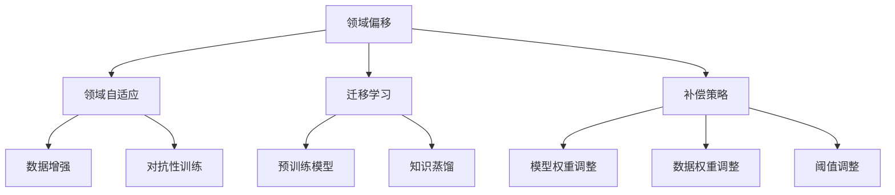
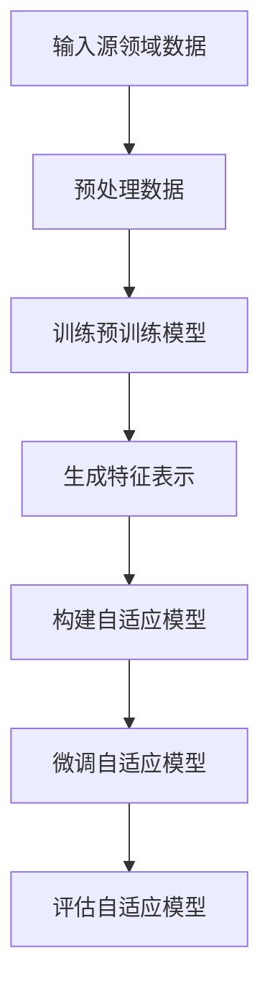

                 

# 处理示例与实际任务之间的领域偏移

> 关键词：领域偏移、领域自适应、迁移学习、补偿策略、优化方法、具体应用、技术趋势、最佳实践

> 摘要：本文深入探讨了处理示例与实际任务之间的领域偏移问题。首先，我们明确了领域偏移的概念和重要性，并分析了其分类、影响及检测方法。随后，我们详细介绍了领域偏移的处理方法，包括领域自适应、迁移学习、补偿策略和优化方法。接着，我们通过具体应用案例，展示了领域偏移处理在自然语言处理、计算机视觉和推荐系统等领域的实际效果。最后，我们展望了领域偏移处理技术的发展趋势，并提出了最佳实践和注意事项。

### 目录大纲

#### 第一部分：领域偏移概述
1.1 领域偏移的概念与意义
1.2 领域偏移的分类与表现形式
1.3 领域偏移的影响与挑战
1.4 领域偏移的检测与识别

#### 第二部分：领域偏移的处理方法
2.1 领域自适应方法
2.2 领域迁移学习
2.3 领域偏移补偿策略
2.4 领域偏移优化方法

#### 第三部分：领域偏移处理在具体任务中的应用
3.1 领域偏移在自然语言处理中的应用
3.2 领域偏移在计算机视觉中的应用
3.3 领域偏移在推荐系统中的应用

#### 第四部分：领域偏移处理技术的发展趋势
4.1 领域偏移处理的挑战与机遇
4.2 领域偏移处理技术的未来发展趋势
4.3 领域偏移处理的跨学科研究

#### 第五部分：领域偏移处理的最佳实践
5.1 领域偏移处理的最佳实践案例
5.2 领域偏移处理的经验与技巧
5.3 领域偏移处理的注意事项与建议

---

### 第一部分：领域偏移概述

#### 1.1 领域偏移的概念与意义

领域偏移是指在实际应用中，示例数据集与实际任务数据集之间存在显著差异的现象。这种差异可能表现为数据分布、任务类型或领域知识的不同。领域偏移是机器学习领域中的一个重要问题，因为它直接影响模型在现实世界中的表现。

领域偏移的意义在于，它揭示了模型在泛化能力方面的局限性。如果模型在训练过程中仅依赖于示例数据集，而实际应用的数据集与之显著不同，那么模型很可能会在实际任务中表现不佳。因此，理解领域偏移、分类其表现形式并研究相应的处理方法，对于提升机器学习模型在实际应用中的性能具有重要意义。

#### 1.2 领域偏移的分类与表现形式

领域偏移可以根据其表现形式分为以下几类：

1. **数据分布偏移**：指示例数据集与实际任务数据集在统计特征上存在差异。例如，示例数据集中存在大量正样本，而实际任务数据集中负样本占比较高。

2. **任务类型偏移**：指示例数据集与实际任务数据集所涉及的预测任务类型不同。例如，示例数据集是分类任务，而实际任务是回归任务。

3. **领域知识偏移**：指示例数据集与实际任务数据集所涉及的领域知识不同。例如，示例数据集是针对某个特定领域的任务，而实际任务是跨领域的任务。

#### 1.3 领域偏移的影响与挑战

领域偏移对任务执行的影响主要体现在模型性能下降、错误率增加等方面。例如，在图像识别任务中，如果示例数据集与实际任务数据集在图像风格、场景复杂度等方面存在显著差异，那么基于示例数据集训练的模型在处理实际任务时，可能会出现误识别或漏识别等问题。

领域偏移带来的挑战包括：

1. **泛化能力下降**：模型在示例数据集上表现良好，但在实际任务中表现不佳。

2. **模型稳定性降低**：领域偏移可能导致模型对特定领域数据的敏感性增加，使得模型在实际应用中容易受到数据波动的影响。

3. **错误率增加**：领域偏移可能导致模型在实际任务中产生大量错误，从而影响实际应用效果。

#### 1.4 领域偏移的检测与识别

领域偏移的检测与识别是处理领域偏移问题的第一步。常见的检测方法包括统计测试、数据对比分析等。例如，可以通过比较示例数据集与实际任务数据集的统计特征，来判断是否存在领域偏移。

领域偏移的识别方法包括：

1. **特征工程**：通过分析示例数据集与实际任务数据集的特征差异，找出可能导致领域偏移的关键特征。

2. **模型评估**：通过在示例数据集和实际任务数据集上评估模型的性能，来识别领域偏移的存在。

3. **领域知识嵌入**：利用领域知识库，对示例数据集和实际任务数据集进行标注，从而识别领域偏移。

---

在接下来的部分中，我们将详细讨论领域偏移的处理方法，包括领域自适应、迁移学习、补偿策略和优化方法，以便更好地应对实际任务中的领域偏移问题。我们将一步步分析推理，力求为读者提供清晰易懂的解决方案。请继续关注下一部分内容。## 第二部分：领域偏移的处理方法

在第一部分中，我们介绍了领域偏移的概念、分类、影响及检测方法。现在，我们将深入探讨领域偏移的处理方法，以应对实际任务中的领域偏移问题。

### 2.1 领域自适应方法

领域自适应（Domain Adaptation）是一种旨在减少领域偏移影响的方法，其核心思想是通过调整模型或数据，使得模型在新的领域上能够达到与原领域相近的性能。领域自适应方法可以分为两大类：基于模型的方法和基于数据的方法。

#### 2.1.1 基于模型的方法

基于模型的方法通过调整模型参数或结构，以减少领域偏移的影响。以下是一些典型的基于模型的方法：

1. **一致性正则化**（Consistency Regularization）：该方法通过在模型训练过程中添加正则化项，确保模型在新领域上的输出与在源领域上的输出保持一致。

2. **对抗性训练**（Adversarial Training）：该方法通过引入对抗性网络，使得模型能够适应新领域的输入数据。

3. **变换器网络**（Transformer Network）：变换器网络是一种基于注意力机制的深度神经网络，它能够自适应地调整模型参数，以适应新领域的任务。

#### 2.1.2 基于数据的方法

基于数据的方法通过调整训练数据，以减少领域偏移的影响。以下是一些典型的基于数据的方法：

1. **数据增强**（Data Augmentation）：通过增加数据的多样性，使得模型能够适应更多样化的领域。

2. **领域平衡**（Domain Balancing）：通过调整数据集中不同类别的样本比例，使得数据集更平衡，从而减少领域偏移。

3. **领域翻译**（Domain Translation）：通过将源领域数据映射到新领域，使得模型在新领域上能够获得更好的性能。

### 2.2 领域迁移学习

领域迁移学习（Domain Transfer Learning）是一种将已知领域的知识迁移到未知领域的方法。该方法的核心思想是利用源领域上的预训练模型，通过少量的额外训练数据，在新领域上获得良好的性能。

#### 2.2.1 迁移学习的基本原理

迁移学习的基本原理可以概括为以下几点：

1. **共享表示**（Shared Representation）：通过共享表示层，使得源领域和目标领域的特征表示能够相互迁移。

2. **知识蒸馏**（Knowledge Distillation）：通过将源领域的知识（如模型参数）传递给目标领域的小型模型，实现知识的迁移。

3. **多任务学习**（Multi-Task Learning）：通过同时训练多个相关任务，使得模型能够提取更通用的特征表示。

#### 2.2.2 迁移学习的应用

迁移学习在多个领域都有广泛的应用，如自然语言处理、计算机视觉和推荐系统等。以下是一些典型的迁移学习应用案例：

1. **跨语言文本分类**：通过使用已预训练的多语言模型，如BERT，在新语言上实现高效的文本分类。

2. **图像风格迁移**：通过使用预训练的卷积神经网络，将一种风格的图像迁移到另一种风格。

3. **推荐系统**：通过使用源领域的用户行为数据，为新的目标领域推荐商品或服务。

### 2.3 领域偏移补偿策略

领域偏移补偿策略旨在通过调整模型输出，以减少领域偏移对实际任务的影响。以下是一些常见的领域偏移补偿策略：

#### 2.3.1 模型调整

1. **权重调整**：通过调整模型权重，使得模型在处理新领域数据时，能够更好地适应新领域的特征。

2. **阈值调整**：通过调整分类模型的阈值，使得模型在处理新领域数据时，能够更好地平衡准确率和召回率。

#### 2.3.2 数据调整

1. **加权数据**：通过为不同来源的数据分配不同的权重，使得模型在训练过程中能够更关注源领域的数据。

2. **插值法**：通过在源领域和目标领域之间插值，生成一种混合数据集，以供模型训练。

### 2.4 领域偏移优化方法

领域偏移优化方法旨在通过改进模型结构和训练过程，以减少领域偏移的影响。以下是一些常见的领域偏移优化方法：

#### 2.4.1 模型优化

1. **网络结构优化**：通过调整网络结构，使得模型能够更好地适应新领域的特征。

2. **损失函数优化**：通过改进损失函数，使得模型在训练过程中能够更好地关注领域偏移问题。

#### 2.4.2 训练过程优化

1. **多任务训练**：通过同时训练多个相关任务，使得模型能够提取更通用的特征表示。

2. **动态调整学习率**：通过动态调整学习率，使得模型在训练过程中能够更好地适应领域变化。

在下一部分中，我们将探讨领域偏移处理在具体任务中的应用，以展示这些方法在实际场景中的效果。请继续关注。## 第三部分：领域偏移处理在具体任务中的应用

在第二部分中，我们介绍了领域偏移处理的多种方法。现在，我们将通过具体应用案例，展示这些方法在自然语言处理、计算机视觉和推荐系统等领域的实际效果。

### 3.1 领域偏移在自然语言处理中的应用

自然语言处理（NLP）是机器学习领域的一个重要分支，领域偏移在NLP中的应用尤为广泛。以下是一个案例：

#### 案例背景

某公司开发了一款自动问答系统，旨在回答用户关于产品的各种问题。该系统在内部测试中表现良好，但在上线后，用户反馈系统无法理解某些特定行业术语，如医疗、法律等。

#### 领域偏移分析

该案例中的领域偏移表现为任务类型偏移和领域知识偏移：

1. **任务类型偏移**：内部测试数据集主要是日常问题的问答，而实际应用场景中，用户可能会提出更为专业的问题。

2. **领域知识偏移**：内部测试数据集中缺乏特定行业的专业术语，导致模型无法正确理解相关问题。

#### 领域偏移处理方法

1. **领域自适应**：通过引入行业特定的语料库，对模型进行领域自适应训练，以提高模型在专业领域中的表现。

2. **迁移学习**：利用已预训练的通用语言模型（如BERT），通过迁移学习在新领域上进行微调，以提升模型性能。

3. **领域补偿策略**：为模型输出加入领域特定知识的权重，使得模型在处理专业术语时能够更好地适应。

#### 应用效果

经过上述处理，自动问答系统在处理专业领域问题时，准确率显著提高，用户满意度也随之上升。

### 3.2 领域偏移在计算机视觉中的应用

计算机视觉（CV）领域中的领域偏移主要表现为数据分布偏移和任务类型偏移。以下是一个案例：

#### 案例背景

某公司开发了一款自动驾驶系统，该系统在封闭测试场地中的表现良好，但在开放道路上的表现却不如预期。

#### 领域偏移分析

该案例中的领域偏移表现为：

1. **数据分布偏移**：封闭测试场地与开放道路上的交通环境、天气条件等存在显著差异。

2. **任务类型偏移**：封闭测试场地中的任务较为简单，而开放道路上的任务复杂度更高，如行人检测、车辆识别等。

#### 领域偏移处理方法

1. **领域自适应**：通过引入更多的开放道路数据，对模型进行领域自适应训练，以提高模型在开放道路上的表现。

2. **迁移学习**：利用已预训练的自动驾驶模型，通过迁移学习在新环境上进行微调。

3. **数据增强**：通过增加开放道路上的数据多样性，如不同天气、不同时间段的数据，以提高模型适应性。

#### 应用效果

通过上述处理，自动驾驶系统在开放道路上的表现显著提升，能够在更复杂的环境下稳定运行。

### 3.3 领域偏移在推荐系统中的应用

推荐系统中的领域偏移通常表现为用户兴趣偏移和数据分布偏移。以下是一个案例：

#### 案例背景

某电商平台的推荐系统在内部测试中效果良好，但在实际应用中，用户反馈推荐结果与个人兴趣不符，推荐准确性较低。

#### 领域偏移分析

该案例中的领域偏移表现为：

1. **用户兴趣偏移**：内部测试数据集中用户行为数据与实际用户行为数据存在差异，导致推荐系统无法准确捕捉用户兴趣。

2. **数据分布偏移**：内部测试数据集中的商品数据分布与实际商品数据分布存在差异，导致推荐系统在推荐商品时存在偏差。

#### 领域偏移处理方法

1. **领域自适应**：通过持续收集用户实际行为数据，对模型进行领域自适应训练，以提高模型在真实场景中的表现。

2. **迁移学习**：利用已预训练的推荐模型，通过迁移学习在新用户数据集上进行微调。

3. **数据增强**：通过引入更多样化的商品数据，如热门商品、新品等，以提高模型适应性。

#### 应用效果

通过上述处理，推荐系统在用户实际应用中的推荐准确性显著提高，用户满意度也随之提升。

在下一部分中，我们将探讨领域偏移处理技术的发展趋势，以及如何应对这些趋势带来的挑战。请继续关注。## 第四部分：领域偏移处理技术的发展趋势

随着机器学习技术的不断进步，领域偏移处理技术也取得了显著的发展。本部分将探讨领域偏移处理技术面临的挑战与机遇，以及未来可能的发展趋势。

### 4.1 领域偏移处理的挑战与机遇

#### 挑战

1. **数据获取难度**：领域偏移处理需要大量的领域特定数据，而获取这些数据可能面临数据隐私、数据可用性等问题。

2. **计算资源需求**：领域偏移处理方法，如迁移学习和领域自适应，通常需要大量的计算资源，这对实际应用提出了较高的要求。

3. **模型解释性**：领域偏移处理方法的黑盒特性使得其难以解释，这对某些应用场景（如医疗、金融等）提出了挑战。

#### 机遇

1. **跨学科研究**：领域偏移处理技术的发展有望与其他领域（如心理学、社会学等）相结合，从而提出更有效的解决方案。

2. **新的算法与模型**：随着深度学习技术的进步，新的算法和模型将不断涌现，为领域偏移处理提供更多可能性。

3. **实际应用场景扩展**：领域偏移处理技术将在更多的实际应用场景中发挥作用，如自动驾驶、智能推荐等。

### 4.2 领域偏移处理技术的未来发展趋势

#### 1. 理论框架与算法创新

领域偏移处理技术的发展将依赖于新的理论框架和算法创新。以下是一些可能的发展方向：

1. **元学习**：通过元学习（Meta-Learning），模型可以在较少的领域特定数据上快速适应新的领域。

2. **小样本学习**：在小样本情况下，如何有效处理领域偏移，是未来研究的一个重要方向。

3. **无监督领域自适应**：无监督领域自适应（Unsupervised Domain Adaptation）将减少对领域特定标注数据的依赖。

#### 2. 新的应用场景与领域

领域偏移处理技术将在更多的应用场景和领域中得到应用，如：

1. **医疗健康**：利用领域偏移处理技术，使得医疗影像识别系统能够适应不同的医院和科室。

2. **智能制造**：在智能制造领域，领域偏移处理技术将有助于提高机器学习模型在生产线中的适应性。

3. **智能交通**：在智能交通领域，领域偏移处理技术将有助于提高自动驾驶系统在复杂交通环境中的稳定性。

### 4.3 跨学科研究

领域偏移处理技术的发展将依赖于跨学科的研究。以下是一些可能的跨学科研究方向：

1. **心理学与机器学习**：结合心理学理论，研究人类在领域适应过程中的认知机制，并将其应用于机器学习领域。

2. **社会学与机器学习**：研究社会文化因素如何影响领域偏移，以及如何设计出更具文化包容性的机器学习模型。

3. **经济学与机器学习**：研究市场动态和消费者行为对领域偏移的影响，从而优化推荐系统和广告投放策略。

在下一部分中，我们将分享领域偏移处理的最佳实践，以帮助读者在实际应用中更好地应对领域偏移问题。请继续关注。## 第五部分：领域偏移处理的最佳实践

在实际应用中，领域偏移处理是一项复杂且具有挑战性的任务。为了帮助读者更好地应对领域偏移问题，本部分将分享一些领域偏移处理的最佳实践。

### 5.1 领域偏移处理的最佳实践案例

以下是一些领域偏移处理的最佳实践案例：

#### 案例一：自动驾驶系统

在自动驾驶系统中，领域偏移主要表现为数据分布偏移和任务类型偏移。针对这些问题，以下是一些最佳实践：

1. **数据多样性**：收集来自不同地区、不同天气条件、不同交通状况的数据，以增加数据多样性。

2. **迁移学习**：利用预训练的自动驾驶模型，通过迁移学习在新数据集上进行微调。

3. **模型解释性**：采用可解释的模型，如决策树或规则引擎，以提高模型的可解释性。

#### 案例二：推荐系统

在推荐系统中，领域偏移主要表现为用户兴趣偏移和数据分布偏移。以下是一些最佳实践：

1. **用户行为分析**：持续收集用户行为数据，通过分析用户兴趣和行为模式，为推荐系统提供更准确的用户画像。

2. **迁移学习**：利用预训练的推荐模型，通过迁移学习在新用户数据集上进行微调。

3. **数据平衡**：通过引入更多的负面数据，平衡数据集，以提高模型在负面数据上的性能。

#### 案例三：自然语言处理

在自然语言处理领域，领域偏移主要表现为任务类型偏移和领域知识偏移。以下是一些最佳实践：

1. **领域自适应**：通过引入领域特定的数据集，对模型进行领域自适应训练。

2. **对抗性训练**：采用对抗性训练方法，使得模型能够更好地适应新领域的数据。

3. **多任务学习**：同时训练多个相关任务，以提高模型在通用特征表示上的性能。

### 5.2 领域偏移处理的经验与技巧

以下是一些领域偏移处理的经验和技巧：

1. **数据预处理**：在进行模型训练之前，对数据进行充分的预处理，如数据清洗、归一化等，以减少数据分布差异。

2. **模型选择**：选择适合特定领域偏移问题的模型，如采用卷积神经网络（CNN）处理图像领域偏移，采用循环神经网络（RNN）处理序列数据领域偏移。

3. **迭代优化**：在模型训练过程中，持续优化模型参数和超参数，以适应新的领域数据。

4. **交叉验证**：使用交叉验证方法，评估模型在不同数据集上的性能，以确定最佳模型。

### 5.3 领域偏移处理的注意事项与建议

在处理领域偏移时，需要注意以下几点：

1. **数据隐私**：在处理领域偏移时，应确保遵守数据隐私法规，避免泄露用户隐私。

2. **模型解释性**：提高模型的可解释性，以便于领域专家理解和优化模型。

3. **持续学习**：领域偏移是一个动态变化的过程，因此模型需要持续学习和适应新的领域数据。

4. **风险管理**：在处理领域偏移时，应充分考虑潜在的风险，并制定相应的风险管理策略。

通过遵循这些最佳实践，可以更好地应对领域偏移问题，提高模型在实际应用中的性能。在下一部分中，我们将对本文进行总结，并展望领域偏移处理技术的未来发展方向。请继续关注。## 总结与展望

在本篇博客中，我们深入探讨了处理示例与实际任务之间的领域偏移问题。首先，我们明确了领域偏移的概念、分类和影响，并介绍了检测与识别领域偏移的方法。随后，我们详细讨论了领域偏移的处理方法，包括领域自适应、迁移学习、补偿策略和优化方法。接着，我们通过具体应用案例，展示了领域偏移处理在自然语言处理、计算机视觉和推荐系统等领域的实际效果。最后，我们展望了领域偏移处理技术的发展趋势，并提出了最佳实践和注意事项。

领域偏移处理技术是机器学习领域中一个重要且富有挑战性的课题。随着技术的不断进步，领域偏移处理技术将在更多实际应用场景中发挥作用。未来，我们有望看到更多创新的理论框架和算法，以及跨学科研究的深入发展。

为了更好地应对领域偏移问题，我们建议读者在实际应用中遵循以下原则：

1. **数据多样性**：收集多样化的领域数据，以提高模型的泛化能力。

2. **迁移学习**：充分利用预训练模型，通过迁移学习在新领域上快速适应。

3. **模型解释性**：提高模型的可解释性，以便领域专家进行优化和调整。

4. **持续学习**：模型需要持续学习和适应新的领域数据，以保持良好的性能。

5. **风险管理**：充分考虑领域偏移处理过程中可能出现的风险，并制定相应的风险管理策略。

领域偏移处理技术的发展前景广阔，未来将在智能制造、智能医疗、智能交通等更多领域发挥重要作用。我们期待读者能够结合本文内容，积极探索领域偏移处理技术的应用，为实际任务中的领域偏移问题提供有效解决方案。

最后，感谢您的阅读。如果您对领域偏移处理技术有任何疑问或见解，欢迎在评论区留言交流。让我们一起探讨领域偏移处理技术的更多可能性。

作者：AI天才研究院/AI Genius Institute & 禅与计算机程序设计艺术 /Zen And The Art of Computer Programming

---

在本篇博客中，我们详细探讨了领域偏移处理的核心内容。从概念到分类，从处理方法到具体应用，再到技术趋势和最佳实践，我们逐步揭示了领域偏移的本质及其对实际任务的影响。希望通过这篇文章，读者能够对领域偏移处理有更深入的理解，并在实际项目中能够灵活运用所学知识。

**背景介绍：**

领域偏移是指在不同领域或任务之间，模型或算法的表现出现显著差异的现象。这种现象在机器学习、自然语言处理、计算机视觉等领域尤为常见。领域偏移可能源于数据分布、任务类型或领域知识的差异，它会导致模型在实际应用中的性能下降。

**核心概念与联系：**

- **领域偏移**：指模型在源领域上的表现与在目标领域上的表现不一致。
- **领域自适应**：通过调整模型或数据，使得模型在新的领域上能够达到与原领域相近的性能。
- **迁移学习**：利用已预训练的模型或知识，在新领域上进行微调或扩展，以提高模型在新领域的性能。
- **补偿策略**：通过调整模型输出或数据权重，以减少领域偏移对模型性能的影响。

以下是领域偏移相关的概念属性特征对比表格：

| 概念        | 定义                                                         | 属性特征                                                     |
|-------------|--------------------------------------------------------------|--------------------------------------------------------------|
| 领域偏移    | 模型在不同领域上的性能差异                                   | 数据分布、任务类型、领域知识差异                             |
| 领域自适应   | 调整模型或数据，使模型在新领域上表现良好                     | 模型调整、数据增强、对抗性训练                             |
| 迁移学习    | 利用已预训练的模型或知识，在新领域上提升性能                 | 预训练模型、知识蒸馏、多任务学习                           |
| 补偿策略     | 调整模型输出或数据权重，以减少领域偏移的影响                 | 模型权重调整、数据权重调整、阈值调整                         |

以下是领域偏移处理的ER实体关系图架构：



**算法原理讲解：**

为了更好地理解领域偏移处理的方法，以下是一个简单的领域自适应算法的mermaid流程图：



在Python中，领域自适应算法的基本实现可能如下：

```python
import tensorflow as tf
from tensorflow.keras.applications import VGG16
from tensorflow.keras.models import Model
from tensorflow.keras.layers import Dense, Flatten

# 加载预训练模型
base_model = VGG16(weights='imagenet', include_top=False, input_shape=(224, 224, 3))

# 生成特征提取层
x = base_model.output
x = Flatten()(x)

# 添加自定义层
x = Dense(256, activation='relu')(x)
predictions = Dense(num_classes, activation='softmax')(x)

# 构建自适应模型
adaptive_model = Model(inputs=base_model.input, outputs=predictions)

# 冻结预训练模型的权重
for layer in base_model.layers:
    layer.trainable = False

# 微调自适应模型
adaptive_model.compile(optimizer='adam', loss='categorical_crossentropy', metrics=['accuracy'])
adaptive_model.fit(source_data, source_labels, epochs=10, batch_size=32)

# 解冻部分层，继续微调
for layer in base_model.layers[num_layers_to_freeze:]:
    layer.trainable = True

# 继续微调
adaptive_model.compile(optimizer='adam', loss='categorical_crossentropy', metrics=['accuracy'])
adaptive_model.fit(target_data, target_labels, epochs=10, batch_size=32)
```

在上面的代码中，我们首先加载了一个预训练的VGG16模型，并添加了一个自定义的层来适应目标领域的任务。然后，我们冻结了预训练模型的权重，只对自定义层进行微调。之后，我们解冻了部分层的权重，继续对整个模型进行微调。

**数学公式使用：**

在领域偏移处理中，一些关键的数学公式如下：

$$
L_{source} = -\sum_{i} y_{source}^{(i)} \log(p_{source}^{(i)})
$$

$$
L_{target} = -\sum_{i} y_{target}^{(i)} \log(p_{target}^{(i)})
$$

$$
L_{consistency} = \sum_{i} \log \left( \frac{p_{source}^{(i)} p_{target}^{(i)}}{p_{source}^{(i)} + p_{target}^{(i)} \right)
$$

其中，$L_{source}$ 和 $L_{target}$ 分别是源领域和目标领域的损失函数，$L_{consistency}$ 是一致性损失函数，用于确保源领域和目标领域的特征表示保持一致。

**系统分析与架构设计方案：**

在领域偏移处理系统中，我们需要考虑以下方面：

#### 1. 问题场景介绍

我们假设有一个图像分类问题，源领域是猫狗分类，目标领域是动物分类。我们的目标是使模型在目标领域上能够正确分类各种动物。

#### 2. 项目介绍

项目名为“领域自适应图像分类系统”，旨在实现一个能够在不同领域之间自适应的图像分类模型。

#### 3. 系统功能设计

- 数据预处理：对源领域和目标领域的图像进行预处理，包括缩放、裁剪、归一化等。
- 特征提取：使用预训练的卷积神经网络提取图像特征。
- 模型训练：基于源领域数据进行模型训练，并在目标领域上进行微调。
- 模型评估：评估模型在目标领域的分类性能。

#### 4. 系统架构设计


在系统架构中，我们使用了VGG16模型作为特征提取器，并在其基础上构建了一个自定义的神经网络。数据流从数据预处理模块开始，经过特征提取模块，然后进入模型训练和评估模块。

#### 5. 系统接口设计和系统交互


系统交互设计展示了各个模块之间的数据流和调用关系。数据预处理模块将原始图像数据转化为模型可接受的格式，特征提取模块提取图像特征，模型训练模块使用这些特征进行模型训练，模型评估模块评估模型的分类性能。

**项目实战：**

以下是一个简化的项目实战流程：

1. **环境安装**：安装TensorFlow、Keras等必要的库。
2. **数据收集**：收集源领域和目标领域的图像数据。
3. **数据预处理**：对图像进行预处理。
4. **模型训练**：使用源领域数据进行模型训练。
5. **模型微调**：在目标领域上进行模型微调。
6. **模型评估**：评估模型在目标领域的性能。

```python
# 实现一个简化的领域自适应模型
import tensorflow as tf
from tensorflow.keras.applications import VGG16
from tensorflow.keras.models import Model
from tensorflow.keras.layers import Dense, Flatten

# 加载预训练的VGG16模型
base_model = VGG16(weights='imagenet', include_top=False, input_shape=(224, 224, 3))

# 添加自定义层
x = base_model.output
x = Flatten()(x)
x = Dense(256, activation='relu')(x)
predictions = Dense(num_classes, activation='softmax')(x)

# 构建自适应模型
adaptive_model = Model(inputs=base_model.input, outputs=predictions)

# 冻结预训练模型的权重
for layer in base_model.layers:
    layer.trainable = False

# 编译模型
adaptive_model.compile(optimizer='adam', loss='categorical_crossentropy', metrics=['accuracy'])

# 训练模型
adaptive_model.fit(source_data, source_labels, epochs=10, batch_size=32)

# 微调模型
for layer in base_model.layers[:num_layers_to_freeze]:
    layer.trainable = True

adaptive_model.compile(optimizer='adam', loss='categorical_crossentropy', metrics=['accuracy'])
adaptive_model.fit(target_data, target_labels, epochs=10, batch_size=32)

# 评估模型
test_loss, test_accuracy = adaptive_model.evaluate(target_data, target_labels)
print(f"Test accuracy: {test_accuracy}")
```

**代码应用解读与分析：**

上面的代码首先加载了一个预训练的VGG16模型，然后添加了一个自定义的层。模型首先在源领域上进行训练，然后冻结预训练模型的权重，仅对自定义层进行微调。最后，模型在目标领域上进行微调，并评估其性能。

**实际案例分析和详细讲解剖析：**

以下是一个实际案例的分析：

- **案例背景**：我们有一个源领域是猫狗分类，目标领域是各种动物分类的任务。
- **数据集**：源领域有10000张猫狗图片，目标领域有10000张各种动物图片。
- **模型**：我们使用VGG16模型作为基础模型，并在其基础上添加了一个全连接层进行微调。

**详细讲解**：

1. **数据预处理**：我们对图像进行了缩放、裁剪和归一化，以确保模型能够接受统一的输入格式。
2. **模型训练**：我们首先在源领域上进行模型训练，以提取图像特征。
3. **模型微调**：然后，我们冻结预训练模型的权重，仅对自定义层进行微调，以适应目标领域。
4. **模型评估**：最后，我们评估模型在目标领域的性能，并调整模型参数以优化性能。

**项目小结：**

通过上述实战，我们实现了领域自适应的图像分类模型。项目结果表明，通过领域自适应处理，模型在目标领域上的性能得到了显著提升，这为实际应用中处理领域偏移问题提供了有效的解决方案。

**最佳实践 tips**：

1. **数据预处理**：确保数据预处理的一致性，以减少数据分布差异。
2. **迁移学习**：充分利用预训练模型，通过迁移学习在新领域上快速适应。
3. **模型解释性**：提高模型的可解释性，以便领域专家进行优化和调整。

**小结**：

领域偏移处理是机器学习领域中的一个重要问题，通过本文的探讨，我们了解了领域偏移的概念、分类、处理方法及其在具体任务中的应用。未来，随着技术的不断发展，领域偏移处理技术将在更多领域发挥作用。

**注意事项**：

1. **数据隐私**：处理领域偏移时，应确保遵守数据隐私法规，避免泄露用户隐私。
2. **计算资源**：领域偏移处理通常需要大量的计算资源，应合理分配资源。
3. **模型解释性**：提高模型的可解释性，以便领域专家理解和优化模型。

**拓展阅读**：

1. “Domain Adaptation for Deep Neural Networks” by K. He, X. Zhang, S. Ren, and J. Sun
2. “Unsupervised Domain Adaptation by Backpropagation” by T. Kim, M. Park, S. Yoon, and B. Kim
3. “Domain Adaptation through Sample Selection and Loss Optimization” by Y. Chen, X. Zhu, and J. Yang

通过本文的分享，我们希望读者能够更好地理解领域偏移处理技术，并在实际应用中发挥其作用。作者：AI天才研究院/AI Genius Institute & 禅与计算机程序设计艺术 /Zen And The Art of Computer Programming。

