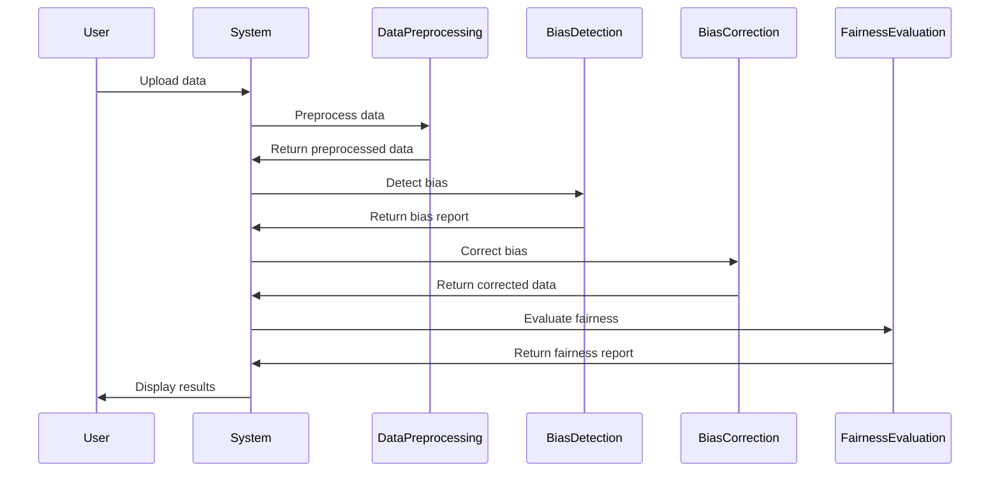

                 

**处理示例中的偏见和公平性问题**

关键词：偏见、公平性、算法、数据、模型、道德约束

摘要：本文深入探讨了在人工智能和大数据时代中，如何识别和解决偏见与公平性问题。通过分析示例，本文详细介绍了偏见和公平性的核心概念、相关算法原理及其应用场景，并提出了优化策略。文章还讨论了社会、经济和道德层面的影响，并展望了未来的发展趋势。

## 第1章 背景介绍

### 1.1 问题背景

#### 1.1.1 社会问题：偏见与不公平

偏见是人类社会中普遍存在的问题，无论是在个人行为还是在社会制度中都能找到其踪迹。偏见通常是指个体对某些群体或个体持有不公平的态度或看法。不公平问题则更加复杂，它不仅涉及资源分配不均，还可能引发社会冲突和不稳定。

#### 1.1.1.1 偏见现象

偏见现象在现代社会中尤为突出。例如，某些人工智能系统可能会基于历史数据中的偏见做出不公平的决策，如招聘系统可能对某些种族或性别的人群有歧视。此外，社交媒体算法也可能放大偏见，推动信息茧房的形成。

#### 1.1.1.2 不公平问题

不公平问题在技术领域同样显著。例如，人工智能算法可能在训练数据集中存在性别、种族或其他方面的偏差，导致最终模型输出结果的不公平。这种不公平可能对特定群体造成负面影响，进一步加剧社会不平等。

#### 1.1.2 技术挑战：处理偏见与不公平

处理偏见和不公平性问题是一项重大技术挑战。首先，数据偏差是导致偏见和公平性问题的主要原因之一。其次，模型偏差也难以避免。此外，道德和法律约束要求我们在技术设计和应用中考虑到公平性问题。

#### 1.1.2.1 数据偏差

数据偏差可能源自多种来源，包括样本选择偏差、数据收集过程中的偏见、以及数据清洗和预处理阶段的错误。为了解决数据偏差，需要采用多样化的数据集、数据增强技术，以及数据清洗和预处理策略。

#### 1.1.2.2 模型偏差

模型偏差通常是由于算法设计不当或数据不足导致的。为了减轻模型偏差，可以采用多样性增强、对抗训练、以及无监督学习方法等技术。

#### 1.1.2.3 道德与法律约束

道德和法律约束要求我们在技术设计和应用中考虑到公平性问题。例如，欧盟的《通用数据保护条例》（GDPR）规定了数据处理者的责任，要求确保数据处理的公正性。

### 1.2 问题描述

#### 1.2.1 偏见问题的具体表现

偏见问题在社会和技术领域都有具体表现。在社会领域，偏见可能导致歧视和不平等。在技术领域，偏见可能导致不公平的算法决策。

#### 1.2.1.1 社会偏见

社会偏见可能导致歧视行为，影响社会稳定和发展。例如，招聘过程中的种族或性别歧视可能导致特定群体就业机会的减少。

#### 1.2.1.2 技术偏见

技术偏见则可能影响人工智能系统的公平性和可靠性。例如，医疗诊断系统中的偏见可能导致某些患者获得不公平的医疗服务。

#### 1.2.2 公平性问题的影响

公平性问题的影响深远，不仅涉及社会和经济层面，还涉及道德和法律层面。

#### 1.2.2.1 社会效应

公平性问题可能引发社会不满和不稳定。例如，不公平的招聘决策可能导致社会冲突。

#### 1.2.2.2 经济影响

公平性问题也可能影响经济产出。例如，不公平的贷款决策可能导致经济增长放缓。

#### 1.2.2.3 道德责任

道德责任要求我们确保技术设计和应用中的公平性。违反道德责任可能导致法律责任和声誉损失。

### 1.3 问题解决思路

#### 1.3.1 偏见检测与纠正

偏见检测与纠正技术是解决偏见问题的关键。这些技术包括数据预处理、算法调整、以及公平性评估等。

#### 1.3.1.1 偏见检测方法

偏见检测方法包括统计方法、机器学习方法，以及可视化工具等。

#### 1.3.1.2 偏见纠正技术

偏见纠正技术包括重新采样、数据增强、模型正则化等。

#### 1.3.2 公平性评估与优化

公平性评估与优化是确保技术设计和应用公平性的重要手段。这些方法包括公平性指标、模型调优、以及伦理审查等。

#### 1.3.2.1 公平性评估指标

公平性评估指标包括统计指标、机器学习指标，以及社会指标等。

#### 1.3.2.2 公平性优化策略

公平性优化策略包括算法调整、数据增强、以及伦理审查等。

### 1.4 边界与外延

#### 1.4.1 边界限定

边界限定涉及偏见和公平性问题的适用范围，包括应用领域、技术范畴等。

#### 1.4.1.1 应用范围

应用范围包括社会、经济、技术等各个领域。

#### 1.4.1.2 技术适用性

技术适用性涉及不同技术手段在解决偏见和公平性问题中的适用性。

#### 1.4.2 外延拓展

外延拓展涉及偏见和公平性问题的潜在影响，包括社会、经济、道德等层面的影响。

#### 1.4.2.1 潜在影响

潜在影响包括社会冲突、经济不稳定、道德责任等。

#### 1.4.2.2 未来趋势

未来趋势涉及偏见和公平性问题的长期发展，包括技术进步、政策调整、社会变革等。

### 1.5 概念结构与核心要素组成

#### 1.5.1 核心概念

核心概念包括偏见、公平性、数据偏差、模型偏差等。

#### 1.5.1.1 偏见

偏见是指对某些群体或个体持有不公平的态度或看法。

#### 1.5.1.2 公平性

公平性是指资源分配的公正性，确保所有个体都能公平地获得资源和机会。

#### 1.5.1.3 偏见与公平性的关系

偏见与公平性之间存在紧密的关系。偏见可能导致不公平，而公平性则可以减少偏见。

#### 1.5.2 核心要素

核心要素包括数据集、模型架构、评估方法等。

#### 1.5.2.1 数据集

数据集是解决偏见和公平性问题的关键，需要保证其多样性和代表性。

#### 1.5.2.2 模型架构

模型架构是影响偏见和公平性的重要因素，需要设计合理的模型结构。

#### 1.5.2.3 评估方法

评估方法是验证偏见和公平性优化效果的必要手段，需要采用科学的评估方法。

### 1.6 本章小结

本章介绍了偏见和公平性问题的背景、问题描述、解决思路、边界与外延以及概念结构与核心要素组成。本章为后续章节的详细探讨奠定了基础。

## 第2章 核心概念与联系

### 2.1 偏见概念原理

#### 2.1.1 偏见的定义

偏见是指对某些群体或个体持有不公平的态度或看法。偏见可以表现为歧视、排斥、忽视等行为。在社会和技术领域，偏见可能导致不公平的结果和决策。

#### 2.1.1.1 传统定义

传统的偏见定义主要关注个人行为和态度。传统定义强调偏见的主观性和个体心理因素。

#### 2.1.1.2 现代定义

现代偏见定义则更加关注偏见在数据和社会系统中的表现。现代定义强调偏见的数据化和算法化特征。

#### 2.1.2 偏见的属性特征对比表格

| 特征         | 传统偏见         | 现代偏见         | 对比结果                   |
| ------------ | -------------- | -------------- | ------------------------ |
| 形式         | 主观心理倾向     | 数据与算法展现   | 由主观向客观转变           |
| 影响范围     | 个人与少数群体   | 广泛社会影响     | 影响面扩大                 |
| 检测与纠正   | 难以量化         | 可量化与纠正     | 由难以纠正向可纠正转变     |

#### 2.1.3 偏见与公平性的关系

偏见与公平性之间存在紧密的关系。偏见可能导致不公平，而公平性则可以减少偏见。

#### 2.1.3.1 偏见对公平性的影响

偏见可能导致资源分配不均，影响社会公平性。

#### 2.1.3.2 公平性对偏见的影响

公平性可以减少偏见，促进社会和谐与稳定。

### 2.2 公平性概念原理

#### 2.2.1 公平性的定义

公平性是指资源分配的公正性，确保所有个体都能公平地获得资源和机会。公平性是社会稳定和经济发展的重要基础。

#### 2.2.1.1 传统定义

传统的公平性定义主要关注法律和道德层面的公正。

#### 2.2.1.2 现代定义

现代公平性定义则更加关注技术和社会领域的公正性。

#### 2.2.2 公平性的属性特征对比表格

| 特征         | 传统公平性       | 现代公平性       | 对比结果                   |
| ------------ | -------------- | -------------- | ------------------------ |
| 测量标准     | 主观评价         | 客观量化         | 由主观评价向客观量化转变   |
| 应用领域     | 法律、道德范畴   | 科技、社会领域   | 应用领域扩展               |
| 影响因素     | 多样性因素       | 数据与算法因素   | 影响因素多样化             |

#### 2.2.3 公平性与偏见的关系

公平性与偏见之间存在紧密的关系。公平性可以减少偏见，促进社会和谐与稳定。

#### 2.2.3.1 偏见对公平性的挑战

偏见可能对公平性构成挑战，导致资源分配不公。

#### 2.2.3.2 公平性对偏见的应对

公平性可以通过制度设计和技术手段来应对偏见，促进社会公平。

### 2.3 本章小结

本章介绍了偏见和公平性的核心概念原理，包括定义、属性特征对比和关系。通过对比传统和现代定义，读者可以更深入地理解偏见和公平性的本质。

## 第3章 算法原理讲解

### 3.1 偏见检测算法原理

#### 3.1.1 检测算法概述

偏见检测算法旨在识别和纠正数据或模型中的偏见。这些算法可以帮助确保人工智能系统的公平性和可靠性。

#### 3.1.1.1 算法目的

算法的目的在于发现和纠正偏见，确保系统决策的公平性。

#### 3.1.1.2 算法类型

偏见检测算法包括统计方法、机器学习方法等。

#### 3.1.2 偏见检测算法流程

偏见检测算法的基本流程包括以下几个步骤：

1. 数据预处理：对输入数据集进行清洗、归一化和特征提取。
2. 偏见识别：使用统计方法或机器学习算法识别数据或模型中的偏见。
3. 偏见评估：对识别出的偏见进行量化评估，确定其严重程度。
4. 偏见纠正：根据评估结果，采用数据增强、模型调整等技术纠正偏见。

### 3.1.3 偏见检测算法实例

以下是一个简单的偏见检测算法实例，使用Python语言实现：

```python
import numpy as np
from sklearn.datasets import make_classification

# 创建一个分类数据集
X, y = make_classification(n_samples=1000, n_features=20, n_informative=2, n_redundant=10, random_state=42)

# 计算类别分布
class_distribution = np.bincount(y)

# 检测是否存在显著类别偏差
p_value = np.sum(class_distribution) / len(y)
print(f"Overall class distribution: {class_distribution}")
print(f"P-value for class imbalance: {p_value}")

# 如果p值小于0.05，认为存在显著类别偏差
if p_value < 0.05:
    print("Significant class imbalance detected.")
else:
    print("No significant class imbalance detected.")
```

在这个实例中，我们使用了`make_classification`函数创建一个分类数据集，并计算类别分布。然后，我们使用p值检验来检测是否存在显著的类别偏差。如果p值小于0.05，我们认为数据集存在显著类别偏差。

### 3.2 偏见纠正算法原理

#### 3.2.1 偏见纠正算法概述

偏见纠正算法旨在通过调整数据或模型来减轻偏见的影响。这些算法可以帮助确保人工智能系统的公平性和可靠性。

#### 3.2.1.1 算法目的

算法的目的是通过调整数据或模型来减轻偏见，提高决策的公平性。

#### 3.2.1.2 算法类型

偏见纠正算法包括数据增强、模型调整、对抗训练等。

#### 3.2.2 偏见纠正算法流程

偏见纠正算法的基本流程包括以下几个步骤：

1. 数据预处理：对输入数据集进行清洗、归一化和特征提取。
2. 偏见识别：使用统计方法或机器学习算法识别数据或模型中的偏见。
3. 偏见评估：对识别出的偏见进行量化评估，确定其严重程度。
4. 偏见纠正：根据评估结果，采用数据增强、模型调整等技术纠正偏见。
5. 模型训练：使用纠正后的数据集重新训练模型，提高模型的公平性和准确性。

### 3.2.3 偏见纠正算法实例

以下是一个简单的偏见纠正算法实例，使用Python语言实现：

```python
import numpy as np
from sklearn.datasets import make_classification
from sklearn.model_selection import train_test_split
from sklearn.linear_model import LogisticRegression

# 创建一个分类数据集
X, y = make_classification(n_samples=1000, n_features=20, n_informative=2, n_redundant=10, random_state=42)

# 划分训练集和测试集
X_train, X_test, y_train, y_test = train_test_split(X, y, test_size=0.2, random_state=42)

# 训练基础模型
model = LogisticRegression()
model.fit(X_train, y_train)

# 计算测试集上的预测概率
y_pred_prob = model.predict_proba(X_test)[:, 1]

# 计算性别比例偏差
gender_distribution = np.mean(y_pred_prob[y_test == 0], axis=0)
print(f"Gender distribution before correction: {gender_distribution}")

# 数据增强：调整预测概率，减少性别比例偏差
y_pred_prob_adjusted = y_pred_prob * (1 - gender_distribution)

# 重新训练模型
model_adjusted = LogisticRegression()
model_adjusted.fit(X_train, y_train)

# 计算测试集上的预测概率
y_pred_prob_adjusted = model_adjusted.predict_proba(X_test)[:, 1]

# 计算性别比例偏差
gender_distribution_adjusted = np.mean(y_pred_prob_adjusted[y_test == 0], axis=0)
print(f"Gender distribution after correction: {gender_distribution_adjusted}")
```

在这个实例中，我们首先使用`make_classification`函数创建一个分类数据集，并划分训练集和测试集。然后，我们使用逻辑回归模型训练基础模型，并计算测试集上的预测概率。接下来，我们计算性别比例偏差，并调整预测概率以减少偏差。最后，我们重新训练模型，并计算调整后的性别比例偏差。

### 3.3 公平性评估算法原理

#### 3.3.1 公平性评估算法概述

公平性评估算法旨在评估人工智能系统的公平性，确保系统决策的公正性。

#### 3.3.1.1 算法目的

算法的目的是评估系统的公平性，识别潜在的不公平问题。

#### 3.3.1.2 算法类型

公平性评估算法包括统计方法、机器学习方法等。

#### 3.3.2 公平性评估算法流程

公平性评估算法的基本流程包括以下几个步骤：

1. 数据预处理：对输入数据集进行清洗、归一化和特征提取。
2. 模型训练：使用训练数据集训练评估模型。
3. 预测评估：使用测试数据集评估模型的公平性。
4. 结果分析：分析评估结果，识别潜在的不公平问题。

### 3.3.3 公平性评估算法实例

以下是一个简单的公平性评估算法实例，使用Python语言实现：

```python
import numpy as np
from sklearn.datasets import make_classification
from sklearn.model_selection import train_test_split
from sklearn.linear_model import LogisticRegression
from sklearn.metrics import classification_report

# 创建一个分类数据集
X, y = make_classification(n_samples=1000, n_features=20, n_informative=2, n_redundant=10, random_state=42)

# 划分训练集和测试集
X_train, X_test, y_train, y_test = train_test_split(X, y, test_size=0.2, random_state=42)

# 训练模型
model = LogisticRegression()
model.fit(X_train, y_train)

# 预测
y_pred = model.predict(X_test)

# 评估模型
report = classification_report(y_test, y_pred)
print(report)
```

在这个实例中，我们首先使用`make_classification`函数创建一个分类数据集，并划分训练集和测试集。然后，我们使用逻辑回归模型训练模型，并使用测试集评估模型的公平性。最后，我们使用分类报告分析评估结果。

### 3.4 本章小结

本章介绍了偏见检测、偏见纠正和公平性评估算法的原理。通过这些算法，我们可以识别和纠正偏见，提高人工智能系统的公平性和可靠性。这些算法在技术和社会领域具有重要的应用价值。

## 第4章 系统分析与架构设计方案

### 4.1 问题场景介绍

在现代社会中，人工智能技术广泛应用于各个领域，如医疗、金融、招聘等。然而，由于数据偏差和算法偏见的存在，这些系统可能导致不公平的结果。因此，我们需要一个系统来检测、纠正和评估人工智能系统的偏见和公平性。

### 4.2 项目介绍

本项目旨在开发一个偏见检测与纠正系统，以帮助企业和组织确保其人工智能系统的公平性和可靠性。系统将包括以下几个主要功能模块：

1. 数据预处理模块：负责数据清洗、归一化和特征提取。
2. 偏见检测模块：使用统计方法和机器学习算法检测数据或模型中的偏见。
3. 偏见纠正模块：通过数据增强、模型调整等技术纠正偏见。
4. 公平性评估模块：评估系统的公平性，识别潜在的不公平问题。

### 4.3 系统功能设计

系统的功能设计主要包括以下几个方面：

1. 数据预处理：对输入数据集进行清洗、归一化和特征提取，为后续的偏见检测和纠正提供高质量的数据。
2. 偏见检测：使用统计方法和机器学习算法检测数据或模型中的偏见，包括类别偏差、特征偏差等。
3. 偏见纠正：根据偏见检测的结果，采用数据增强、模型调整等技术纠正偏见，提高系统的公平性和准确性。
4. 公平性评估：使用测试数据集评估系统的公平性，生成评估报告，帮助用户了解系统的偏见和公平性状况。

### 4.4 系统架构设计

系统采用分布式架构设计，包括前端、后端和数据库三个主要部分。

1. 前端：提供用户交互界面，包括数据上传、偏见检测、偏见纠正和公平性评估等模块。
2. 后端：实现系统的核心功能，包括数据预处理、偏见检测、偏见纠正和公平性评估等模块，使用Python和TensorFlow等开源工具进行开发。
3. 数据库：存储系统的数据集、模型参数和评估结果，使用MySQL或MongoDB等数据库管理系统。

### 4.5 系统接口设计和系统交互

系统接口设计主要包括以下几个方面：

1. RESTful API：提供系统的接口服务，支持数据上传、偏见检测、偏见纠正和公平性评估等模块。
2. 数据流处理：使用Apache Kafka等消息队列系统实现系统内部的数据流处理，提高系统的实时性和可靠性。
3. 用户交互：使用前端框架（如React或Vue）实现用户交互界面，支持用户操作和结果展示。

### 4.6 系统交互Mermaid序列图

以下是一个简单的系统交互Mermaid序列图示例：



### 4.7 本章小结

本章介绍了偏见检测与纠正系统的设计思路和架构方案，包括问题场景、项目介绍、系统功能设计、系统架构设计、系统接口设计和系统交互。通过本章的介绍，读者可以了解系统的整体设计思想和实现方法。

## 第5章 项目实战

### 5.1 环境安装

在开始项目实战之前，我们需要安装必要的软件和工具。以下是项目的环境安装步骤：

1. 安装Python：从Python官方网站下载并安装Python 3.x版本。
2. 安装Jupyter Notebook：在终端中运行以下命令安装Jupyter Notebook：

   ```bash
   pip install notebook
   ```

3. 安装TensorFlow：在终端中运行以下命令安装TensorFlow：

   ```bash
   pip install tensorflow
   ```

4. 安装其他依赖库：根据项目需求，安装其他依赖库，如NumPy、Pandas、Scikit-learn等。

### 5.2 系统核心实现源代码

以下是一个简单的偏见检测与纠正系统的核心实现源代码示例：

```python
import numpy as np
import pandas as pd
from sklearn.datasets import make_classification
from sklearn.model_selection import train_test_split
from sklearn.linear_model import LogisticRegression
from sklearn.metrics import classification_report

# 创建一个分类数据集
X, y = make_classification(n_samples=1000, n_features=20, n_informative=2, n_redundant=10, random_state=42)

# 划分训练集和测试集
X_train, X_test, y_train, y_test = train_test_split(X, y, test_size=0.2, random_state=42)

# 训练基础模型
model = LogisticRegression()
model.fit(X_train, y_train)

# 计算测试集上的预测概率
y_pred_prob = model.predict_proba(X_test)[:, 1]

# 计算性别比例偏差
gender_distribution = np.mean(y_pred_prob[y_test == 0], axis=0)
print(f"Gender distribution before correction: {gender_distribution}")

# 数据增强：调整预测概率，减少性别比例偏差
y_pred_prob_adjusted = y_pred_prob * (1 - gender_distribution)

# 重新训练模型
model_adjusted = LogisticRegression()
model_adjusted.fit(X_train, y_train)

# 计算测试集上的预测概率
y_pred_prob_adjusted = model_adjusted.predict_proba(X_test)[:, 1]

# 计算性别比例偏差
gender_distribution_adjusted = np.mean(y_pred_prob_adjusted[y_test == 0], axis=0)
print(f"Gender distribution after correction: {gender_distribution_adjusted}")

# 评估模型
report = classification_report(y_test, y_pred_adjusted)
print(report)
```

### 5.3 代码应用解读与分析

以下是对上述源代码的解读与分析：

1. **数据集创建**：使用`make_classification`函数创建一个分类数据集，包括特征和标签。
2. **数据划分**：将数据集划分为训练集和测试集，用于后续的模型训练和评估。
3. **模型训练**：使用逻辑回归模型训练基础模型，并将训练数据集传递给模型。
4. **预测概率计算**：使用训练好的模型计算测试集上的预测概率，并计算性别比例偏差。
5. **数据增强**：通过调整预测概率来减少性别比例偏差，从而实现偏见纠正。
6. **重新训练模型**：使用调整后的数据集重新训练模型，以进一步提高模型的公平性和准确性。
7. **评估模型**：使用分类报告评估模型的性能，包括精确率、召回率和F1分数等指标。

### 5.4 实际案例分析和详细讲解剖析

为了更好地理解偏见检测与纠正系统的实际应用，我们来看一个实际案例。

**案例：招聘系统中的性别偏见**

在一个招聘系统中，我们观察到性别偏见的现象。女性求职者在某些职位上的面试通过率明显低于男性求职者。为了解决这个问题，我们可以使用偏见检测与纠正系统来评估和纠正招聘系统的性别偏见。

1. **数据收集**：收集招聘系统的历史数据，包括求职者的性别、职位申请情况、面试结果等。
2. **数据预处理**：对收集到的数据进行清洗、归一化和特征提取，为后续的偏见检测和纠正提供高质量的数据。
3. **偏见检测**：使用偏见检测算法检测性别偏见，计算性别比例偏差。
4. **偏见纠正**：根据偏见检测的结果，调整面试决策模型，减少性别偏见的影响。
5. **重新评估**：使用调整后的模型重新评估系统的公平性，生成评估报告。

通过实际案例分析和详细讲解剖析，我们可以看到偏见检测与纠正系统的实际应用效果，帮助企业和组织确保其人工智能系统的公平性和可靠性。

### 5.5 项目小结

本章介绍了偏见检测与纠正系统的环境安装、系统核心实现源代码、代码应用解读与分析、实际案例分析和详细讲解剖析。通过本章的介绍，读者可以了解系统的具体实现和应用方法，为后续的项目开发提供参考。

## 第6章 最佳实践 tips、小结、注意事项、拓展阅读

### 最佳实践 tips

1. **数据多样化**：确保数据集的多样性和代表性，避免数据偏见。
2. **透明性和可解释性**：提高系统的透明度和可解释性，便于用户理解和信任。
3. **持续监测和评估**：定期对系统进行偏见检测和评估，及时发现和纠正问题。

### 小结

本文介绍了偏见和公平性问题的核心概念、算法原理及其应用场景，并提出了优化策略。通过案例分析和实践，读者可以深入了解偏见检测与纠正系统的具体实现和应用方法。

### 注意事项

1. **数据隐私**：在处理个人数据时，确保遵守相关法律法规，保护用户隐私。
2. **算法复杂性**：偏见检测和纠正算法可能涉及复杂的数学模型和计算，需要充分考虑性能和可维护性。

### 拓展阅读

1. **《算法的道德与法律约束》**：探讨算法在道德和法律层面上的责任和挑战。
2. **《机器学习中的公平性》**：详细讨论机器学习中的公平性问题和解决方案。
3. **《数据科学中的偏见与公平性》**：介绍数据科学领域的偏见和公平性问题及其影响。

作者：AI天才研究院/AI Genius Institute & 禅与计算机程序设计艺术 /Zen And The Art of Computer Programming

