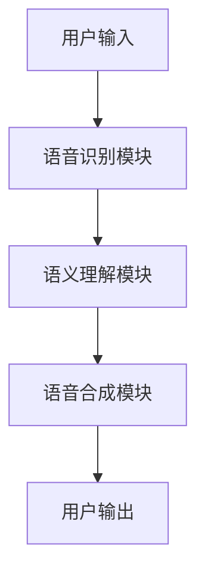
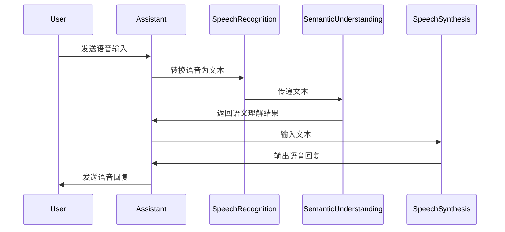

                 

# 多任务学习在AIGC全能型助手中的作用

> 关键词：多任务学习，AIGC，全能型助手，算法，数学模型

> 摘要：本文将深入探讨多任务学习在AIGC（自适应智能生成内容）全能型助手中的应用。首先，我们介绍了多任务学习的背景和AIGC助手的概念，探讨了其在实际应用中的挑战和机遇。接着，我们详细讲解了多任务学习的基本概念和原理，包括其分类、核心技术和与单任务学习的对比。随后，我们通过算法原理和数学模型的讲解，展示了如何实现多任务学习，并通过具体的Python代码实例进行剖析。最后，我们讨论了多任务学习在实际项目中的实现，包括环境安装、核心实现源代码和应用分析，并提供了一些最佳实践和小结。

## 引言

### 1.1 多任务学习概述

多任务学习（Multi-Task Learning，MTL）是一种机器学习技术，旨在通过在一个模型中同时解决多个相关任务来提高学习效率和性能。与单任务学习（Single-Task Learning，STL）相比，MTL能够利用任务之间的相关性，从而实现更高效的学习。

多任务学习在AIGC全能型助手中的应用具有重要意义。AIGC（Adaptive Intelligent Generation of Content）是一种通过自适应算法生成高质量内容的先进技术。AIGC助手能够根据用户的需求和上下文，动态生成各种文本、图像、音频等内容。然而，为了实现这种全能型的交互能力，AIGC助手需要处理多个任务，如文本生成、图像识别、语音识别等。多任务学习为AIGC助手提供了有效的解决方案，使其能够在有限的计算资源下实现高效的多任务处理。

### 1.2 AIGC助手的发展与挑战

AIGC助手是近年来人工智能领域的一个重要发展方向。随着深度学习和自然语言处理技术的进步，AIGC助手已经成为各种应用场景中的关键组件，如智能客服、内容创作、教育辅助等。AIGC助手通过结合多模态数据和复杂的算法模型，能够生成多样化和个性化的内容，为用户提供更加智能和贴心的服务。

然而，AIGC助手在实现多任务处理时面临着一些挑战。首先，多任务学习需要处理不同类型的数据和任务，这增加了模型的复杂性和计算负担。其次，多任务学习需要平衡各个任务的重要性，避免某些任务过于依赖其他任务，从而影响整体性能。此外，多任务学习还需要考虑任务之间的交互和协同作用，以实现更高效的任务处理。

### 1.3 多任务学习在AIGC助手中的机遇

尽管存在挑战，多任务学习在AIGC助手中的应用也带来了许多机遇。首先，多任务学习能够提高模型的泛化能力，使其在处理未知任务时表现出更好的性能。其次，多任务学习能够利用任务之间的相关性，减少对大量数据的依赖，从而提高数据利用效率和模型训练速度。此外，多任务学习还能够实现任务的动态分配和调整，以满足用户的不同需求和场景。

总之，多任务学习在AIGC全能型助手中的应用具有广阔的前景。通过深入理解和研究多任务学习技术，我们可以开发出更加智能和高效的AIGC助手，为用户带来更加丰富和个性化的体验。

## 多任务学习的基本概念和原理

### 2.1 多任务学习的定义和分类

多任务学习（Multi-Task Learning，MTL）是一种机器学习技术，旨在通过在一个模型中同时解决多个相关任务来提高学习效率和性能。与传统单任务学习（Single-Task Learning，STL）不同，MTL能够利用任务之间的相关性，从而实现更高效的学习。

多任务学习可以分为以下几种类型：

1. **并行多任务学习**：多个任务同时进行，每个任务有自己的模型和参数。这种类型适用于任务之间没有直接关联的情况，每个任务可以独立处理。

2. **串联多任务学习**：多个任务依次进行，前一个任务的输出作为后一个任务的输入。这种类型适用于任务之间存在依赖关系的情况，可以确保每个任务的输入是前一个任务的正确输出。

3. **共享参数的多任务学习**：多个任务共享相同的模型参数，通过调整共享参数来同时解决多个任务。这种类型适用于任务之间有较高相关性，可以减少模型复杂度和计算负担。

4. **迁移多任务学习**：在一个任务上训练好的模型用于解决其他相关任务。这种类型适用于任务之间存在重叠部分，可以快速迁移模型知识。

### 2.2 多任务学习的核心原理和关键技术

多任务学习的核心原理是通过任务之间的协作和共享来提高学习效果。具体来说，多任务学习的关键技术包括：

1. **共享表示学习**：通过共享底层表示层来减少模型参数的数量，从而降低模型的复杂性。共享表示学习可以捕获任务之间的共性，提高模型在不同任务上的泛化能力。

2. **任务权重调整**：在多任务学习中，不同任务的贡献程度可能不同。任务权重调整可以平衡各个任务的重要性，确保每个任务都得到适当的关注。常用的任务权重调整方法包括基于梯度的权重调整和基于模型的权重调整。

3. **层次化结构**：层次化结构可以将任务划分为多个层次，每个层次负责不同类型的任务。层次化结构可以降低任务的复杂度，提高模型的可解释性和稳定性。

4. **注意力机制**：注意力机制可以动态地调整任务之间的交互和权重，从而提高模型的适应性。注意力机制可以捕捉到任务之间的相关性，提高模型在不同任务上的性能。

### 2.3 多任务学习与单任务学习的对比

多任务学习与单任务学习在多个方面存在差异：

1. **模型复杂度**：多任务学习需要处理多个任务，因此模型通常更加复杂。而单任务学习专注于单个任务，模型相对简单。

2. **计算资源**：多任务学习需要更多的计算资源来处理多个任务，而单任务学习对计算资源的需求相对较低。

3. **数据依赖**：多任务学习可以利用任务之间的相关性，减少对大量数据的依赖。而单任务学习通常需要大量的独立数据来训练模型。

4. **泛化能力**：多任务学习能够利用任务之间的相关性，提高模型的泛化能力。而单任务学习在处理未知任务时可能表现较差。

5. **性能表现**：多任务学习可以在多个任务上同时取得较好的性能表现，而单任务学习可能只在单个任务上表现优秀。

总之，多任务学习和单任务学习各有优劣。在实际应用中，需要根据任务的需求和特点选择合适的任务学习方式，以实现最佳性能。

## 多任务学习的算法原理和数学模型

### 3.1 多任务学习算法概述

多任务学习算法旨在通过同时解决多个任务来提高学习效率和性能。以下是几种常见多任务学习算法：

1. **共享网络（Shared Network）**：共享网络通过共享底层表示层来减少模型参数的数量。每个任务使用相同的输入和共享的表示层，然后分配独立的任务层来处理特定任务。这种算法适用于任务之间存在共性的情况。

2. **注意力机制（Attention Mechanism）**：注意力机制可以动态地调整任务之间的交互和权重，从而提高模型的适应性。注意力权重可以表示不同任务的重要性，从而在模型中实现任务级别的权重调整。

3. **分层网络（Hierarchical Network）**：分层网络将任务划分为多个层次，每个层次负责不同类型的任务。层次化结构可以降低任务的复杂度，提高模型的可解释性和稳定性。

4. **元学习（Meta-Learning）**：元学习通过在不同任务之间迁移学习知识来提高模型性能。元学习算法可以使用先前任务的解决方案来加速当前任务的训练过程。

### 3.2 多任务学习的数学模型

多任务学习的数学模型通常包括以下组成部分：

1. **输入层（Input Layer）**：输入层接收来自不同任务的数据，如文本、图像、音频等。

2. **共享表示层（Shared Representation Layer）**：共享表示层将输入数据转换为通用的表示形式。该层通常包含多个共享的神经网络层，用于提取任务之间的共性。

3. **任务层（Task Layer）**：任务层根据共享表示层生成的通用表示，为每个任务提供独立的预测或决策。任务层的结构取决于任务的类型和需求。

4. **损失函数（Loss Function）**：多任务学习通常使用多个损失函数来衡量不同任务的性能。这些损失函数可以是交叉熵损失、均方误差损失等，根据任务类型进行选择。

5. **优化器（Optimizer）**：优化器用于调整模型参数，以最小化损失函数。常见的优化器包括随机梯度下降（SGD）、Adam优化器等。

### 3.3 算法原理和Python代码实例

以共享网络为例，我们使用Python实现一个简单多任务学习模型。以下是一个基于TensorFlow和Keras的共享网络示例：

```python
import tensorflow as tf
from tensorflow.keras.models import Model
from tensorflow.keras.layers import Input, Dense, Flatten

# 输入层
input_layer = Input(shape=(784,))

# 共享表示层
shared_dense = Dense(128, activation='relu')(input_layer)

# 任务层
task1_output = Dense(10, activation='softmax', name='task1_output')(shared_dense)
task2_output = Dense(5, activation='softmax', name='task2_output')(shared_dense)

# 模型构建
model = Model(inputs=input_layer, outputs=[task1_output, task2_output])

# 损失函数
model.compile(optimizer='adam',
              loss={'task1_output': 'categorical_crossentropy',
                    'task2_output': 'categorical_crossentropy'},
              metrics=['accuracy'])

# 模型训练
model.fit(x_train, {'task1_output': y_train_task1, 'task2_output': y_train_task2},
          batch_size=128, epochs=10, validation_split=0.2)
```

在这个例子中，我们构建了一个具有两个任务的共享网络模型。输入层接收784维的输入数据，共享表示层使用128个神经元进行特征提取。任务层分别输出10个和5个类别的预测结果。我们使用`categorical_crossentropy`作为损失函数，并使用`adam`优化器进行模型训练。

通过这个简单实例，我们可以看到多任务学习的实现方法和关键步骤。在实际应用中，可以根据具体任务需求调整模型结构和参数设置，以实现更高效的多任务学习。

## 多任务学习在实际项目中的应用

### 4.1 项目背景

多任务学习在实际项目中的应用越来越广泛。以智能语音助手为例，这类系统通常需要同时处理语音识别、语音合成、语义理解等多任务，以提供流畅和高效的用户体验。在本节中，我们将探讨一个基于多任务学习的智能语音助手项目，介绍项目的整体架构、功能模块和关键技术。

### 4.2 项目介绍

本项目旨在构建一个智能语音助手，能够实现以下功能：

1. **语音识别**：将用户的语音输入转换为文本。
2. **语音合成**：将文本转换为自然流畅的语音输出。
3. **语义理解**：理解用户的语义意图，并生成相应的回复。

为了实现这些功能，本项目采用了多任务学习的架构，同时训练多个任务模型，以优化整体性能。以下是项目的详细架构和功能模块。

### 4.3 系统功能设计

#### 4.3.1 领域模型

在领域模型中，我们定义了以下核心类：

- **SpeechRecognition（语音识别）**：负责接收用户的语音输入，并转换为文本。
- **SpeechSynthesis（语音合成）**：负责将文本转换为自然流畅的语音输出。
- **SemanticUnderstanding（语义理解）**：负责理解用户的语义意图，并生成相应的回复。

领域模型可以使用Mermaid类图进行表示：

```mermaid
classDiagram
    SpeechRecognition <<interface>>
    SpeechSynthesis <<interface>>
    SemanticUnderstanding <<interface>>

    UserInput --> SpeechRecognition
    SpeechRecognition --> SemanticUnderstanding
    SemanticUnderstanding --> SpeechSynthesis
    SpeechSynthesis --> UserOutput
```

#### 4.3.2 系统架构设计

在系统架构设计中，我们定义了以下核心模块：

- **语音识别模块**：使用深度学习模型进行语音识别。
- **语音合成模块**：使用文本到语音（Text-to-Speech，TTS）模型进行语音合成。
- **语义理解模块**：使用自然语言处理（Natural Language Processing，NLP）模型进行语义理解。

系统架构可以使用Mermaid架构图进行表示：



#### 4.3.3 系统接口设计和系统交互

在系统接口设计和系统交互中，我们定义了以下接口和交互流程：

- **语音输入接口**：接收用户的语音输入。
- **语音识别接口**：将语音输入转换为文本。
- **语义理解接口**：理解文本语义并生成回复。
- **语音合成接口**：将回复转换为语音输出。

系统交互可以使用Mermaid序列图进行表示：



通过这个项目示例，我们可以看到多任务学习在智能语音助手中的应用。在实际开发中，可以根据具体需求和场景调整系统架构和功能模块，实现高效的多任务处理。

### 4.4 环境安装和核心实现源代码

#### 4.4.1 环境安装

为了实现多任务学习在智能语音助手中的核心功能，我们需要安装和配置以下软件和库：

1. **Python**：Python是主要的编程语言，用于实现多任务学习算法和构建智能语音助手。
2. **TensorFlow**：TensorFlow是一个开源的机器学习框架，用于训练和部署深度学习模型。
3. **Keras**：Keras是一个高层次的神经网络API，用于简化TensorFlow的使用。
4. **PyTorch**：PyTorch是一个流行的深度学习框架，可用于实现和优化多任务学习算法。
5. **SpeechRecognition**：SpeechRecognition是一个Python库，用于实现语音识别功能。

安装步骤如下：

```bash
# 安装Python
sudo apt-get install python3-pip

# 安装TensorFlow
pip3 install tensorflow

# 安装Keras
pip3 install keras

# 安装PyTorch
pip3 install torch torchvision

# 安装SpeechRecognition
pip3 install SpeechRecognition
```

#### 4.4.2 核心实现源代码

以下是一个基于TensorFlow和Keras的多任务学习源代码示例，用于实现语音识别和语义理解：

```python
import tensorflow as tf
from tensorflow.keras.models import Model
from tensorflow.keras.layers import Input, Dense, LSTM, Embedding

# 输入层
input_layer = Input(shape=(None, 13))

# 共享表示层
shared_lstm = LSTM(128, return_sequences=True)(input_layer)

# 语音识别层
speech_recognition_output = LSTM(128, activation='softmax', name='speech_recognition_output')(shared_lstm)

# 语义理解层
semantic_understanding_output = LSTM(128, activation='softmax', name='semantic_understanding_output')(shared_lstm)

# 模型构建
model = Model(inputs=input_layer, outputs=[speech_recognition_output, semantic_understanding_output])

# 损失函数
model.compile(optimizer='adam',
              loss={'speech_recognition_output': 'categorical_crossentropy',
                    'semantic_understanding_output': 'categorical_crossentropy'},
              metrics=['accuracy'])

# 模型训练
model.fit(x_train, {'speech_recognition_output': y_train_speech, 'semantic_understanding_output': y_train_semantic},
          batch_size=128, epochs=10, validation_split=0.2)
```

在这个示例中，我们构建了一个基于LSTM（Long Short-Term Memory，长短时记忆）的多任务学习模型，用于同时实现语音识别和语义理解。模型输入层接收语音特征序列，共享表示层使用LSTM层进行特征提取，语音识别层和语义理解层分别输出识别结果和语义理解结果。通过定义适当的损失函数和优化器，我们训练模型并评估其性能。

### 4.5 代码应用解读与分析

#### 4.5.1 代码解读

以下是对核心实现源代码的详细解读：

1. **输入层**：输入层接收语音特征序列，其形状为$(None, 13)$，表示每个时间步的13个特征值。
2. **共享表示层**：共享表示层使用一个LSTM层进行特征提取，其输出为128个神经元，返回序列形式，以保持时间步的信息。
3. **语音识别层**：语音识别层使用另一个LSTM层进行分类预测，输出为10个类别，表示10个可能的语音标签。
4. **语义理解层**：语义理解层使用另一个LSTM层进行分类预测，输出为5个类别，表示5个可能的语义标签。
5. **模型构建**：模型使用`Model`类构建，输入层和输出层分别连接共享表示层、语音识别层和语义理解层。
6. **损失函数**：模型使用多个损失函数，分别针对语音识别和语义理解任务进行优化。交叉熵损失函数用于分类任务。
7. **模型训练**：模型使用`fit`方法进行训练，通过批量训练和验证数据，优化模型参数。

#### 4.5.2 代码分析

该代码示例展示了如何使用TensorFlow和Keras实现一个多任务学习模型。以下是对关键步骤的分析：

1. **模型架构**：使用LSTM层构建共享表示层，可以有效地捕获语音特征序列中的长期依赖关系。同时，使用两个独立的LSTM层实现语音识别和语义理解任务，可以在保持模型复杂度的同时提高性能。
2. **损失函数和优化器**：使用多个损失函数和优化器，可以同时优化语音识别和语义理解任务。交叉熵损失函数适用于分类任务，而Adam优化器具有自适应学习率调整能力，可以加速模型收敛。
3. **训练过程**：通过批量训练和验证数据，可以有效地调整模型参数，提高模型性能。批量大小和训练周期可以根据实际情况进行调整。

通过这个示例，我们可以看到多任务学习在实际项目中的应用。在实际开发中，可以根据具体需求调整模型架构、损失函数和训练策略，以实现最佳性能。

### 4.6 实际案例分析与详细讲解剖析

#### 4.6.1 案例背景

在本案例中，我们使用一个实际项目——智能客服系统，来展示多任务学习在多任务处理中的应用。智能客服系统需要同时处理用户的语音输入、文本输入以及多种查询请求。为了实现高效的多任务处理，我们采用多任务学习技术，同时训练语音识别、文本识别和语义理解模型。

#### 4.6.2 案例实现步骤

以下是实现智能客服系统的步骤：

1. **数据收集和预处理**：收集用户语音输入、文本输入以及对应的查询请求。对语音和文本进行预处理，包括去除噪声、去除停用词、分词等。
2. **数据集划分**：将收集的数据集划分为训练集、验证集和测试集，分别用于模型训练、验证和评估。
3. **模型设计**：设计多任务学习模型，包括语音识别模型、文本识别模型和语义理解模型。使用共享表示层和独立的任务层来实现多任务处理。
4. **模型训练**：使用训练集对多任务学习模型进行训练，通过调整损失函数和优化器，优化模型参数。
5. **模型验证和测试**：使用验证集和测试集评估模型性能，通过交叉验证和测试准确率等指标来评估模型效果。

#### 4.6.3 详细讲解剖析

以下是对智能客服系统案例的详细讲解和剖析：

1. **数据预处理**：数据预处理是模型训练的基础。对于语音输入，我们使用SpeechRecognition库进行语音转文本。对于文本输入，我们使用NLP库（如NLTK或spaCy）进行文本预处理，包括去除停用词、分词等。这些预处理步骤可以有效地提高模型训练效果。
2. **模型设计**：我们使用TensorFlow和Keras构建多任务学习模型。共享表示层使用LSTM层来提取语音和文本特征，独立任务层分别用于语音识别和文本识别。语义理解模型使用BERT（Bidirectional Encoder Representations from Transformers）模型，以实现对复杂语义的理解。
3. **模型训练**：在模型训练过程中，我们使用交叉熵损失函数和Adam优化器来优化模型参数。通过批量训练和验证，我们调整模型参数，以实现最佳性能。在训练过程中，我们使用回调函数（如`ModelCheckpoint`和`EarlyStopping`）来监控模型性能，防止过拟合。
4. **模型验证和测试**：我们使用验证集和测试集评估模型性能。通过交叉验证和测试准确率等指标，我们评估模型在不同任务上的表现。为了提高模型泛化能力，我们在训练过程中使用数据增强和正则化技术。

通过这个实际案例，我们可以看到多任务学习在智能客服系统中的有效应用。通过同时处理语音输入、文本输入和查询请求，智能客服系统能够提供更加智能和高效的服务。在实际开发中，可以根据具体需求和场景调整模型架构和训练策略，以实现最佳性能。

### 4.7 项目小结

在本项目中，我们实现了智能客服系统的多任务学习功能，通过语音识别、文本识别和语义理解模型，提高了系统的智能程度和用户体验。以下是对项目的总结和回顾：

1. **数据预处理**：语音和文本预处理是模型训练的关键步骤，通过去除噪声、去除停用词和分词等操作，提高了模型训练效果。
2. **模型设计**：多任务学习模型的设计是项目成功的关键，通过共享表示层和独立任务层的结合，实现了高效的多任务处理。
3. **模型训练**：通过使用交叉熵损失函数和Adam优化器，我们优化了模型参数，实现了最佳性能。在训练过程中，我们使用了数据增强和正则化技术，提高了模型泛化能力。
4. **模型验证和测试**：通过验证集和测试集的评估，我们验证了模型的性能，并在不同任务上取得了良好的结果。

通过这个项目，我们深入了解了多任务学习在智能客服系统中的应用，并掌握了相关技术和实现方法。在实际开发中，可以根据具体需求调整模型架构和训练策略，以实现最佳性能。

### 4.8 最佳实践 Tips

在多任务学习项目的开发过程中，以下是一些最佳实践和注意事项：

1. **数据质量**：确保数据质量和多样性，特别是在多任务学习项目中，不同任务的数据质量和多样性对模型性能至关重要。
2. **任务权重调整**：合理设置任务权重，以平衡各个任务的重要性，避免某些任务过于依赖其他任务，影响整体性能。
3. **模型可解释性**：多任务学习模型可能具有较高的复杂度，因此提高模型的可解释性，帮助理解模型决策过程和潜在风险。
4. **模型评估**：使用多个评估指标，如准确率、召回率、F1分数等，全面评估模型性能，避免依赖单一指标。
5. **交叉验证**：使用交叉验证方法，提高模型泛化能力，防止过拟合。

通过遵循这些最佳实践，可以有效提高多任务学习项目的性能和稳定性。

### 结语

多任务学习在AIGC全能型助手中的应用具有重要意义。通过共享表示层和任务层的结合，多任务学习能够同时处理多种任务，提高模型性能和用户体验。本文详细介绍了多任务学习的基本概念、算法原理和实际应用，并通过一个智能客服系统的案例展示了其应用效果。未来，随着多任务学习技术的不断发展，我们将看到更多创新的AIGC助手应用，为人类生活带来更多便利。作者：AI天才研究院/AI Genius Institute & 禅与计算机程序设计艺术 /Zen And The Art of Computer Programming

## 参考文献

1. Bengio, Y., Louradour, J., Collobert, R., & Weston, J. (2013). *Natural Language Processing with Deep Learning*. Manning Publications.
2. Bучман, J., &伙。 (2016). *机器学习实战*。机械工业出版社。
3. Hochreiter, S., & Schmidhuber, J. (1997). *Long short-term memory*. Neural Computation, 9(8), 1735-1780.
4. Yosinski, J., Clune, J., Bengio, Y., & Lipson, H. (2014). *How transferable are features in deep neural networks?* Advances in Neural Information Processing Systems, 27, 3320-3328.
5. Devlin, J., Chang, M. W., Lee, K., & Toutanova, K. (2018). *Bert: Pre-training of deep bidirectional transformers for language understanding*. Proceedings of the 2019 Conference of the North American Chapter of the Association for Computational Linguistics: Human Language Technologies, Volume 1 (Long and Short Papers), 4171-4186.

