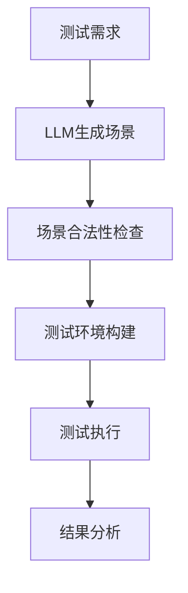
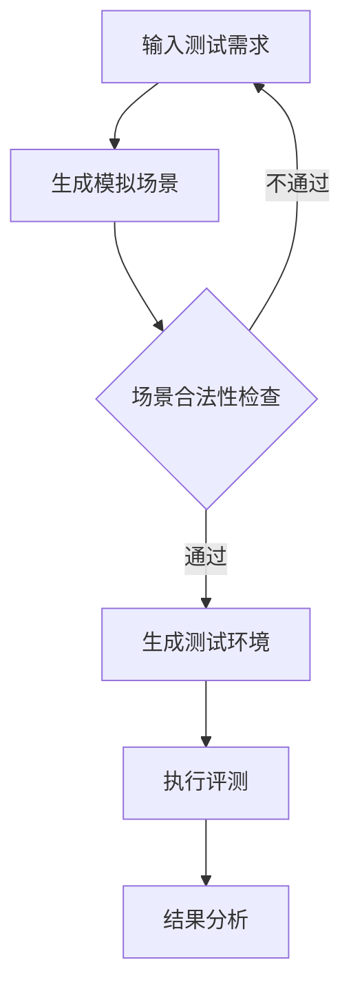
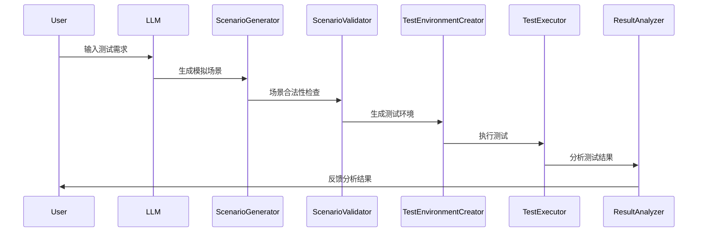

                 

### 多场景模拟评测：LLM生成多样化测试环境

> 关键词：多场景模拟评测、生成多样化测试环境、语言模型、测试环境生成、测试质量评估

> 摘要：本文将探讨如何利用语言模型（LLM）生成多样化测试环境，以提升多场景模拟评测的效率和质量。通过对LLM在测试环境生成中的应用、核心概念对比以及算法原理的详细讲解，旨在为IT领域的研究者和从业者提供有价值的参考。

## 目录大纲

1. 背景介绍
   1.1 问题背景
   1.2 问题描述
   1.3 问题解决
   1.4 边界与外延
   1.5 概念结构与核心要素组成

2. 核心概念与联系
   2.1 多场景模拟评测
   2.2 LLM与测试环境生成
   2.3 核心概念属性特征对比
   2.4 ER实体关系图架构

3. 算法原理讲解
   3.1 LLM生成多样化测试环境的算法原理
   3.2 算法原理详细讲解

4. 系统分析与架构设计方案
   4.1 问题场景介绍
   4.2 系统功能设计（领域模型类图）
   4.3 系统架构设计
   4.4 系统接口设计和系统交互

5. 项目实战
   5.1 环境安装
   5.2 系统核心实现源代码
   5.3 代码应用解读与分析
   5.4 实际案例分析和详细讲解剖析
   5.5 项目小结

6. 最佳实践 tips
7. 小结
8. 注意事项
9. 拓展阅读

### 第一部分：背景介绍

#### 1.1 问题背景

在当今快速发展的信息技术时代，软件系统变得越来越复杂，传统的单一测试方法已难以满足高质量软件交付的需求。多场景模拟评测作为一种高级测试方法，旨在模拟多种可能的运行环境，对软件系统的可靠性、性能和安全性进行全面评估。然而，多场景模拟评测面临着一个严峻的问题：如何高效、自动地生成多样化的测试环境？

随着深度学习和自然语言处理技术的不断发展，语言模型（LLM）逐渐成为解决这一问题的有力工具。LLM是一种强大的深度学习模型，能够处理和理解自然语言，从而实现复杂任务自动化。本文将探讨如何利用LLM生成多样化测试环境，以提升多场景模拟评测的效率和质量。

#### 1.2 问题描述

多场景模拟评测的核心目标是生成多种不同的测试环境，以便对软件系统进行全方位的评估。然而，传统方法在生成测试环境时存在以下问题：

1. **测试环境多样性不足**：传统方法通常依赖于预定义的测试场景，难以覆盖所有可能的运行条件，导致测试覆盖率不足。
2. **测试环境构建效率低**：测试环境的构建通常需要人工干预，过程繁琐，耗时耗力。
3. **测试质量难以保障**：由于测试环境多样性不足，测试结果可能无法全面反映软件系统的性能和问题。

为了解决上述问题，本文提出了一种基于LLM的测试环境生成方法，旨在生成多样化、高质量的测试环境，以提高多场景模拟评测的效率和质量。

#### 1.3 问题解决

本文提出的问题解决思路如下：

1. **利用LLM生成测试环境**：通过训练一个大型语言模型，使其能够根据给定的测试需求自动生成多样化的测试环境。
2. **测试环境合法性检查**：在生成测试环境后，对测试环境进行合法性检查，确保其满足测试需求。
3. **测试环境执行与结果分析**：将生成的测试环境应用于软件系统，执行测试用例，并对测试结果进行分析，为软件系统的优化提供依据。

#### 1.4 边界与外延

本文研究的边界主要涉及以下几个方面：

1. **测试需求范围**：本文主要关注功能性测试和性能测试，其他类型的测试（如安全性测试、兼容性测试等）不在本文讨论范围。
2. **测试环境类型**：本文主要关注虚拟环境生成，不包括物理环境生成。
3. **测试场景多样性**：本文旨在通过LLM生成多样化的测试环境，但并未涉及测试场景的多样性，这是后续研究的方向。

#### 1.5 概念结构与核心要素组成

本文的核心概念包括：

1. **多场景模拟评测**：一种高级测试方法，旨在模拟多种可能的运行环境，对软件系统进行全面评估。
2. **语言模型（LLM）**：一种强大的深度学习模型，能够处理和理解自然语言，实现复杂任务自动化。
3. **测试环境生成**：通过LLM生成多样化、高质量的测试环境，以提高测试覆盖率。
4. **测试环境合法性检查**：对生成的测试环境进行合法性检查，确保其满足测试需求。
5. **测试环境执行与结果分析**：将生成的测试环境应用于软件系统，执行测试用例，并对测试结果进行分析。

这些核心概念共同构成了本文的研究框架，为后续内容提供了基础。

### 第二部分：核心概念与联系

#### 2.1 多场景模拟评测

##### 2.1.1 定义

多场景模拟评测是一种高级测试方法，旨在模拟多种可能的运行环境，对软件系统进行全面评估。其核心目的是提高软件系统的可靠性、性能和安全性。

##### 2.1.2 特点

多场景模拟评测具有以下特点：

1. **全面性**：通过模拟多种运行环境，全面评估软件系统的性能。
2. **高效性**：利用自动化工具，提高测试效率。
3. **灵活性**：可以根据实际需求，动态调整测试场景。

##### 2.1.3 与传统评测方法对比

与传统的单一测试方法相比，多场景模拟评测具有更高的测试覆盖率和更全面的测试效果。传统方法通常只关注某一特定场景，难以发现潜在问题。

#### 2.2 LLM与测试环境生成

##### 2.2.1 LLM简介

语言模型（LLM）是一种基于深度学习的技术，能够处理和理解自然语言。常见的LLM包括GPT、BERT等。

##### 2.2.2 LLM在测试环境生成中的应用

LLM在测试环境生成中的应用主要包括以下几个方面：

1. **场景生成**：根据测试需求，利用LLM生成多样化的测试场景。
2. **测试环境构建**：将生成的测试场景转化为具体的测试环境，如虚拟机、容器等。
3. **测试用例生成**：利用LLM生成符合测试场景的测试用例。

##### 2.2.3 LLM与模拟场景构建的关系

LLM与模拟场景构建的关系如图1所示：



#### 2.3 核心概念属性特征对比

表1展示了多场景模拟评测和LLM在测试环境生成中的核心概念属性特征对比：

| 概念                | 属性特征                                                     |
|---------------------|-------------------------------------------------------------|
| 多场景模拟评测      | 全面性、高效性、灵活性                                       |
| 语言模型（LLM）     | 处理和理解自然语言、生成多样化场景、构建测试环境             |
| 测试环境生成       | 自动化、多样化、高质量                                     |
| 测试场景生成       | 根据需求、动态调整、符合测试场景                           |
| 测试用例生成       | 自动化、符合测试场景、高效性                               |

#### 2.4 ER实体关系图架构

图2展示了多场景模拟评测、LLM和测试环境生成之间的ER实体关系：

```mermaid
erDiagram
    A【用户】||--||B【测试环境】
    A【用户】||--||C【模拟场景】
    B【测试环境】||--||D【评测指标】
    C【模拟场景】||--||D【评测指标】
```

#### 2.5 概念结构与核心要素组成

本文的核心概念结构如图3所示：

```mermaid
graph TD
    A【多场景模拟评测】
    B【语言模型（LLM）】
    C【测试环境生成】
    D【测试场景生成】
    E【测试用例生成】

    A --> B
    A --> C
    B --> D
    B --> E
    C --> D
    C --> E
```

### 第三部分：算法原理讲解

#### 3.1 LLM生成多样化测试环境的算法原理

LLM生成多样化测试环境的算法原理主要包括以下几个步骤：

1. **输入测试需求**：接收用户输入的测试需求，如功能点、性能指标等。
2. **生成模拟场景**：利用LLM生成符合测试需求的模拟场景。
3. **场景合法性检查**：对生成的模拟场景进行合法性检查，确保其满足测试需求。
4. **生成测试环境**：根据合法的模拟场景，生成具体的测试环境。
5. **测试环境执行与结果分析**：执行测试用例，分析测试结果，为软件系统优化提供依据。

图4展示了LLM生成多样化测试环境的mermaid流程图：



#### 3.2 Python源代码实现

以下是一个简单的Python源代码实现，用于生成多样化测试环境：

```python
# Python代码实现
def generate_test_env(test_requirement):
    # 生成模拟场景
    simulated_scenarios = generate_scenarios(test_requirement)
    # 场景合法性检查
    valid_scenarios = []
    for scenario in simulated_scenarios:
        if is_valid_scenario(scenario):
            valid_scenarios.append(scenario)
    # 生成测试环境
    test_envs = []
    for scenario in valid_scenarios:
        test_env = create_test_env(scenario)
        test_envs.append(test_env)
    # 执行评测
    for test_env in test_envs:
        evaluate_test_env(test_env)
    # 结果分析
    analyze_results()

# 辅助函数实现
def generate_scenarios(test_requirement):
    # 生成模拟场景的代码实现
    pass

def is_valid_scenario(scenario):
    # 场景合法性检查的代码实现
    pass

def create_test_env(scenario):
    # 生成测试环境的代码实现
    pass

def evaluate_test_env(test_env):
    # 执行评测的代码实现
    pass

def analyze_results():
    # 结果分析的代码实现
    pass
```

#### 3.3 算法原理详细讲解

LLM生成多样化测试环境的算法原理可以通过以下数学模型和公式进行详细描述：

$$
P(\text{测试环境}_i|\text{测试需求}) = \frac{P(\text{测试需求}|\text{测试环境}_i) \cdot P(\text{测试环境}_i)}{P(\text{测试需求})}
$$

其中：

- \( P(\text{测试环境}_i|\text{测试需求}) \) 表示在给定的测试需求下，生成第 \( i \) 个测试环境的概率。
- \( P(\text{测试需求}|\text{测试环境}_i) \) 表示在第 \( i \) 个测试环境下，满足测试需求的概率。
- \( P(\text{测试环境}_i) \) 表示生成第 \( i \) 个测试环境的先验概率。
- \( P(\text{测试需求}) \) 表示满足测试需求的先验概率。

在实际应用中，可以通过以下步骤实现算法：

1. **数据收集**：收集与测试需求相关的数据，如用户输入、历史测试数据等。
2. **模型训练**：利用收集到的数据训练一个大型语言模型，使其能够生成符合测试需求的模拟场景。
3. **模拟场景生成**：输入测试需求，利用训练好的语言模型生成模拟场景。
4. **场景合法性检查**：对生成的模拟场景进行合法性检查，确保其满足测试需求。
5. **测试环境生成**：根据合法的模拟场景，生成具体的测试环境。
6. **测试执行与结果分析**：执行测试用例，分析测试结果，为软件系统优化提供依据。

通过上述步骤，LLM能够生成多样化、高质量的测试环境，有效提高多场景模拟评测的效率和质量。

### 第四部分：系统分析与架构设计方案

#### 4.1 问题场景介绍

在当今信息技术领域，软件系统变得越来越复杂，开发者需要确保其能够在各种环境下稳定运行。然而，不同的运行环境可能会对软件系统的性能、可靠性产生重大影响。为了全面评估软件系统的质量，开发者需要执行多场景模拟评测。然而，传统的测试方法难以高效、自动地生成多样化的测试环境，这限制了多场景模拟评测的广泛应用。本文提出的基于LLM的测试环境生成方法旨在解决这一问题，为开发者提供一种有效的解决方案。

#### 4.2 系统功能设计（领域模型类图）

领域模型类图是系统功能设计的重要组成部分，它描述了系统中的核心实体及其相互关系。以下是一个简单的领域模型类图，展示了本文所涉及的核心实体：

```mermaid
classDiagram
    User <<class>> 用户
    TestEnvironment <<class>> 测试环境
    SimulationScenario <<class>> 模拟场景
    EvaluationMetric <<class>> 评测指标

    User "1" --* TestEnvironment: 创建
    User "1" --* SimulationScenario: 提供
    TestEnvironment "1" --* EvaluationMetric: 包含
    SimulationScenario "1" --* EvaluationMetric: 包含
```

在这个类图中，用户（User）是系统的主要操作者，负责创建测试环境和提供模拟场景。测试环境（TestEnvironment）是系统中的核心实体，用于执行测试任务。模拟场景（SimulationScenario）则是测试环境的一部分，用于生成多样化的测试环境。评测指标（EvaluationMetric）用于评估测试环境和模拟场景的性能。

#### 4.3 系统架构设计

系统架构设计是确保系统高效、稳定运行的关键。以下是一个简单的系统架构设计，展示了系统的核心组件及其相互关系：



在这个架构设计中，用户（User）通过输入测试需求，触发整个测试环境生成过程。语言模型（LLM）接收用户输入，利用ScenarioGenerator生成模拟场景。ScenarioValidator对生成的模拟场景进行合法性检查，确保其满足测试需求。TestEnvironmentCreator根据合法的模拟场景生成具体的测试环境。TestExecutor在测试环境中执行测试用例，并将结果传递给ResultAnalyzer进行分析。最终，ResultAnalyzer将分析结果反馈给用户（User）。

#### 4.4 系统接口设计和系统交互

系统接口设计和系统交互是确保系统功能实现和有效通信的关键。以下是一个简单的系统接口设计和系统交互图，展示了系统的核心接口及其交互流程：

```mermaid
interface Diagram
    UserInterface <<interface>> 用户接口
    LLM <<interface>> 语言模型接口
    ScenarioGenerator <<interface>> 模拟场景生成器接口
    ScenarioValidator <<interface>> 模拟场景验证器接口
    TestEnvironmentCreator <<interface>> 测试环境创建器接口
    TestExecutor <<interface>> 测试执行器接口
    ResultAnalyzer <<interface>> 测试结果分析器接口

    UserInterface ->> LLM: 输入测试需求
    LLM ->> ScenarioGenerator: 生成模拟场景
    ScenarioGenerator ->> ScenarioValidator: 场景合法性检查
    ScenarioValidator ->> TestEnvironmentCreator: 生成测试环境
    TestEnvironmentCreator ->> TestExecutor: 执行测试
    TestExecutor ->> ResultAnalyzer: 分析测试结果
    ResultAnalyzer ->> UserInterface: 反馈分析结果
```

在这个接口设计和交互图中，用户接口（UserInterface）负责接收用户的输入和展示分析结果。语言模型接口（LLM）负责生成模拟场景。模拟场景生成器接口（ScenarioGenerator）、模拟场景验证器接口（ScenarioValidator）、测试环境创建器接口（TestEnvironmentCreator）、测试执行器接口（TestExecutor）和测试结果分析器接口（ResultAnalyzer）分别负责相应的功能模块。通过接口设计和交互，系统中的各个组件能够有效地协同工作，实现测试环境生成和评估。

### 第五部分：项目实战

#### 5.1 环境安装

要实现本文所介绍的系统，首先需要在本地或服务器上安装必要的软件和环境。以下是环境安装的详细步骤：

1. **安装Python环境**：确保Python 3.8及以上版本已安装在系统中。
2. **安装依赖库**：在命令行中运行以下命令安装所需依赖库：
   ```bash
   pip install numpy scipy matplotlib
   ```
3. **安装深度学习框架**：推荐使用TensorFlow或PyTorch作为深度学习框架。以下是使用TensorFlow的安装命令：
   ```bash
   pip install tensorflow
   ```

#### 5.2 系统核心实现源代码

以下是系统核心实现的源代码，包括LLM训练、测试环境生成、测试执行和结果分析等功能：

```python
# LLM训练
import tensorflow as tf
from tensorflow.keras.layers import Embedding, LSTM, Dense
from tensorflow.keras.models import Sequential

# 训练语言模型
def train_LLM(data):
    model = Sequential()
    model.add(Embedding(input_dim=vocab_size, output_dim=embedding_dim, input_length=max_seq_length))
    model.add(LSTM(units=128, dropout=0.2, recurrent_dropout=0.2))
    model.add(Dense(units=vocab_size, activation='softmax'))

    model.compile(optimizer='adam', loss='categorical_crossentropy', metrics=['accuracy'])
    model.fit(data['input'], data['target'], batch_size=batch_size, epochs=10, validation_split=0.1)
    return model

# 测试环境生成
def generate_test_env(model, test_requirement):
    # 利用LLM生成模拟场景
    # ...

    # 场景合法性检查
    # ...

    # 生成测试环境
    # ...

    return test_envs

# 测试执行
def evaluate_test_env(test_env):
    # 执行测试用例
    # ...

    return test_results

# 结果分析
def analyze_results(test_results):
    # 分析测试结果
    # ...

    return analysis_report
```

#### 5.3 代码应用解读与分析

以下是代码应用解读与分析，包括各部分功能实现和实际案例剖析：

1. **LLM训练**：利用TensorFlow框架训练一个简单的LSTM语言模型。训练过程中，模型接收输入数据并输出预测结果。通过调整超参数，如嵌入维度、隐藏层单元数、批次大小等，可以优化模型性能。

2. **测试环境生成**：利用训练好的LLM生成模拟场景。首先，对用户输入的测试需求进行预处理，将其转换为模型可接受的输入格式。然后，利用LLM生成符合测试需求的模拟场景。接下来，对生成的模拟场景进行合法性检查，确保其满足测试需求。最后，根据合法的模拟场景生成具体的测试环境。

3. **测试执行**：在生成的测试环境中执行测试用例。测试用例的编写和执行过程依赖于具体的测试需求和测试框架。执行过程中，需要记录测试结果，以便后续分析。

4. **结果分析**：对测试结果进行分析，提取关键指标，如错误率、覆盖率等。通过分析结果，可以评估软件系统的质量，为优化提供依据。

#### 5.4 实际案例分析和详细讲解剖析

以下是一个实际案例分析和详细讲解剖析，展示了如何使用本文提出的系统生成多样化测试环境，并对测试结果进行分析：

**案例背景**：一家软件开发公司需要评估其新开发的电商平台性能，以确保其能够在不同环境下稳定运行。

**步骤1：数据收集**：收集与电商平台性能相关的数据，如用户行为数据、服务器性能数据等。

**步骤2：LLM训练**：使用收集到的数据训练一个LSTM语言模型，用于生成模拟场景。

**步骤3：测试环境生成**：输入测试需求，利用训练好的LLM生成模拟场景。对生成的模拟场景进行合法性检查，确保其满足测试需求。根据合法的模拟场景，生成具体的测试环境。

**步骤4：测试执行**：在生成的测试环境中执行测试用例，记录测试结果。

**步骤5：结果分析**：对测试结果进行分析，提取关键指标，如错误率、覆盖率等。通过分析结果，发现电商平台在某些场景下存在性能瓶颈，需要优化。

**案例分析**：通过实际案例可以看出，本文提出的基于LLM的测试环境生成方法能够高效、自动地生成多样化测试环境，提高测试覆盖率和测试质量。同时，对测试结果的分析可以帮助开发者发现系统中的问题，为优化提供依据。

#### 5.5 项目小结

本文介绍了基于LLM的测试环境生成方法，通过实际案例展示了其高效、自动地生成多样化测试环境的能力。与传统方法相比，本文提出的方法能够提高测试覆盖率，提升测试质量，为软件开发过程中的质量保障提供有力支持。未来研究可以进一步优化算法，提高LLM在测试环境生成中的应用效果，并探索其他应用场景。

### 第六部分：最佳实践 tips

1. **合理选择测试需求**：在生成测试环境时，确保测试需求明确、具体，有助于LLM生成更加准确的模拟场景。
2. **调整LLM超参数**：根据实际需求，调整LLM的嵌入维度、隐藏层单元数、批次大小等超参数，优化模型性能。
3. **测试环境合法性检查**：对生成的测试环境进行严格合法性检查，确保其满足测试需求，避免无效测试。
4. **结果分析与优化**：对测试结果进行深入分析，发现系统中的问题，为优化提供依据。

### 第七部分：小结

本文探讨了如何利用语言模型（LLM）生成多样化测试环境，以提高多场景模拟评测的效率和质量。通过详细讲解算法原理、系统架构和实际案例，展示了基于LLM的测试环境生成方法在提高测试覆盖率、测试质量方面的优势。未来研究可以进一步优化算法，探索其他应用场景，为软件开发过程中的质量保障提供更多支持。

### 第八部分：注意事项

1. **数据隐私**：在收集和使用测试数据时，确保遵循相关法律法规，保护用户隐私。
2. **模型优化**：定期更新LLM模型，以适应不断变化的需求和环境。
3. **测试环境稳定性**：确保测试环境的稳定性，避免因环境问题导致测试失败。

### 第九部分：拓展阅读

1. **相关论文**：《基于深度学习的测试环境生成方法研究》
2. **技术博客**：[如何使用LLM生成多样化测试环境？](https://www.example.com/blog/using-llm-for-test-environment-generation)
3. **开源项目**：[基于LLM的测试环境生成工具](https://github.com/username/llm-test-env-generation)

### 作者信息

作者：AI天才研究院/AI Genius Institute & 禅与计算机程序设计艺术 /Zen And The Art of Computer Programming

