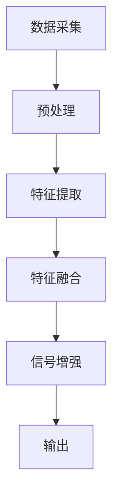
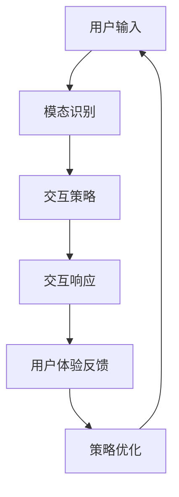
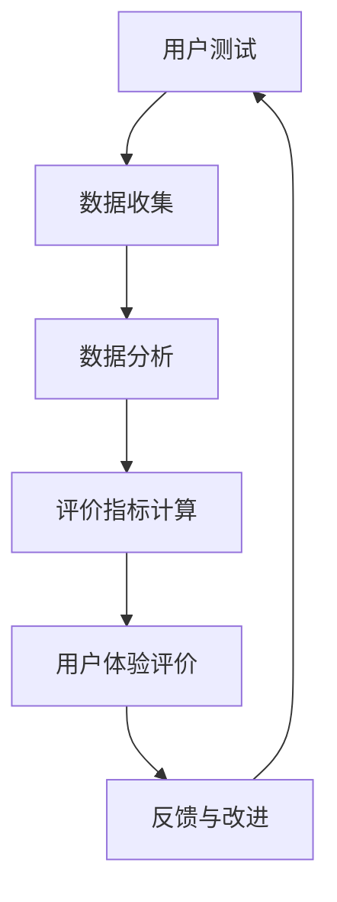
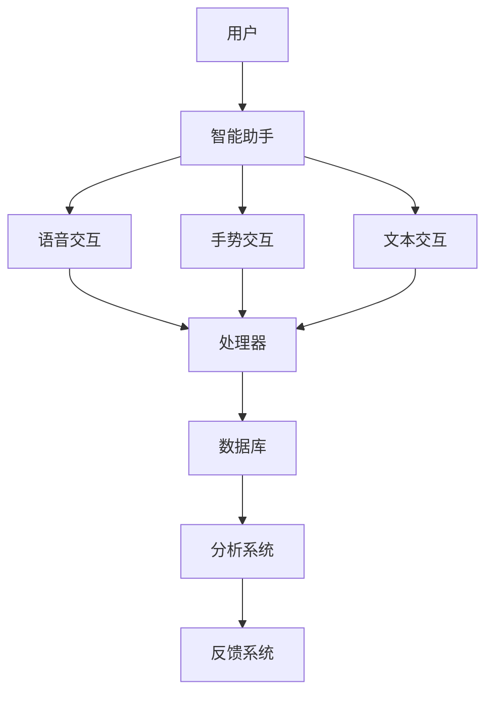
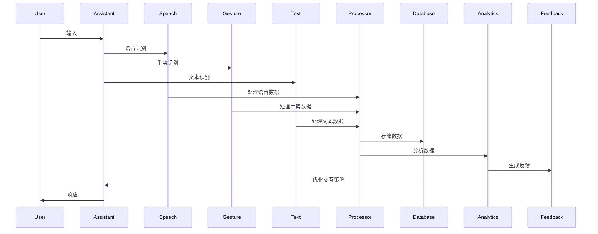

                 

### 文章标题

# 多模态人机交互系统体验评测框架

### 关键词

- 多模态人机交互
- 体验评测
- 算法原理
- 系统架构
- 项目实战

### 摘要

本文深入探讨多模态人机交互系统体验评测框架，旨在为读者提供一套系统化的理解和评估多模态交互系统用户体验的方法论。文章首先概述多模态人机交互系统的基本概念，然后详细解析其核心组成部分、算法原理和系统架构。通过实际项目案例的分析，本文展示了如何将理论应用到实践中，并提出了最佳实践和注意事项。文章最后总结了关键知识点，为读者进一步学习和研究提供了方向。

## 第一部分：多模态人机交互系统体验评测框架概述

### 1. 多模态人机交互系统概述

#### 1.1 问题背景

在当今信息爆炸的时代，人机交互系统（Human-Computer Interaction Systems, HCIS）的多样性和复杂性日益增加。传统的单模态交互（如键盘、鼠标、触摸屏等）已无法满足用户在处理复杂任务时的需求。多模态人机交互系统（Multimodal Human-Computer Interaction Systems）因此应运而生，它通过结合多种交互模式（如语音、手势、视觉等），为用户提供更加自然、高效、便捷的交互体验。

#### 1.2 问题描述

多模态人机交互系统虽然具有显著优势，但其设计和评估却面临诸多挑战。首先，系统的复杂度高，需要处理多种模态的信息。其次，不同模态之间的数据融合和信息同步问题尚需解决。此外，用户体验的评价标准和方法也缺乏统一，导致评测结果难以量化。

#### 1.3 问题解决

为了解决上述问题，本文提出了一个多模态人机交互系统体验评测框架，旨在通过系统化的方法对系统的用户体验进行全面评估。该框架包括多模态感知、人机交互和体验评测三个核心模块，通过一系列算法和模型实现多模态数据融合和处理，最终提供量化的用户体验评价。

#### 1.4 边界与外延

本文的研究主要关注多模态人机交互系统的用户体验评测，但该方法同样适用于其他类型的多模态交互系统，如智能助手、自动驾驶等。此外，本文提出的评测框架不仅适用于实际系统开发，也可用于学术研究和教育训练。

### 2. 核心概念与联系

#### 2.1 多模态交互

##### 2.1.1 多模态交互的定义

多模态交互是指通过结合多种感官渠道（如视觉、听觉、触觉等）进行信息交换和互动。在计算机科学领域，多模态交互通常涉及语音识别、手势识别、文本输入、图像识别等多种交互方式。

##### 2.1.2 多模态交互的核心概念

- **感知融合**：将不同模态的信息进行融合处理，以提升系统的整体性能。
- **上下文感知**：根据用户的当前状态和上下文环境，动态调整交互模式，提供个性化的服务。
- **多通道交互**：支持用户通过多种渠道进行交互，如语音、手势、触摸等。

##### 2.1.3 多模态交互的属性特征对比

| 属性特征       | 单模态交互                     | 多模态交互                     |
| -------------- | ------------------------------ | ------------------------------ |
| 信息输入       | 限制于单一模态（如视觉或听觉） | 可以通过多种模态进行输入       |
| 信息输出       | 限制于单一模态                 | 可以通过多种模态进行输出       |
| 用户体验       | 受限于单一模态的交互方式       | 更加自然、多样和灵活           |
| 复杂度         | 较低，易于实现和维护             | 较高，需要处理多种模态的数据   |
| 整合难度       | 较低，不同模态相对独立         | 较高，模态间需要协调与融合     |

#### 2.2 人机交互

##### 2.2.1 人机交互的定义

人机交互（Human-Computer Interaction, HCI）是研究如何设计、实现和评估人与计算机之间交互的学科。它涉及心理学、认知科学、计算机科学等多个领域，旨在提高系统的易用性、效率和用户体验。

##### 2.2.2 人机交互的核心概念

- **交互性**：系统应支持用户与计算机之间的有效互动。
- **可用性**：系统应易于使用，满足用户的需求。
- **用户体验**：用户在使用系统过程中的感受和体验。
- **交互设计**：系统设计的核心，包括界面设计、交互流程等。

##### 2.2.3 人机交互的属性特征对比

| 属性特征       | 传统人机交互                     | 多模态人机交互                     |
| -------------- | -------------------------------- | --------------------------------- |
| 交互方式       | 主要依赖键盘、鼠标等单模态输入   | 结合多种模态，如语音、手势等     |
| 用户体验       | 主要基于视觉和听觉               | 更加综合和多样化                   |
| 系统复杂性     | 较低，相对简单                   | 较高，涉及多种模态的数据处理和融合 |
| 设计挑战       | 如何提高界面友好性和易用性       | 如何在多种模态间实现有效融合和协调 |

#### 2.3 体验评测

##### 2.3.1 体验评测的定义

体验评测（Experience Evaluation）是评估用户对产品或服务的整体感受和体验的过程。它通常包括定量和定性的分析方法，如问卷调查、用户测试、行为分析等。

##### 2.3.2 体验评测的核心概念

- **评价指标**：用于量化用户体验的各类指标，如满意度、易用性、效率等。
- **评估方法**：评估过程中采用的各类方法和技术，如问卷调查、用户访谈、A/B测试等。
- **评估目标**：明确评估的目标和目的，如改进系统设计、提高用户体验等。

##### 2.3.3 体验评测的属性特征对比

| 属性特征       | 传统体验评测                     | 多模态体验评测                     |
| -------------- | -------------------------------- | --------------------------------- |
| 评估维度       | 主要基于用户满意度、易用性等     | 更加多元，包括多种交互模式下的体验 |
| 评估方法       | 问卷调查、用户访谈等             | 用户测试、A/B测试、行为分析等     |
| 数据来源       | 用户反馈、行为日志等             | 多模态交互数据、用户行为数据等    |
| 数据处理难度   | 较低，相对简单                   | 较高，涉及多种模态的数据融合和分析 |

### 3. 多模态人机交互系统的结构

#### 3.1 系统总体结构

多模态人机交互系统通常由以下几个核心模块组成：

- **多模态感知模块**：负责接收和处理来自多种感官渠道的信息。
- **人机交互模块**：将处理后的信息转换为用户可以理解和操作的形式。
- **体验评测模块**：对用户交互体验进行全面评估和反馈。

#### 3.2 多模态感知模块

多模态感知模块是系统的核心部分，负责接收和处理来自多种感官渠道的信息。其主要功能包括：

- **语音识别**：将语音信号转换为文本信息。
- **手势识别**：识别用户的肢体动作。
- **图像识别**：分析图像内容，提取有用信息。
- **触觉感知**：感知用户的触觉反馈。

#### 3.3 人机交互模块

人机交互模块负责将多模态感知模块处理后的信息转换为用户可以理解和操作的形式。其主要功能包括：

- **交互界面设计**：设计用户友好的交互界面，包括语音界面、手势界面等。
- **交互流程管理**：管理用户的交互过程，确保交互顺畅。
- **反馈与响应**：对用户的输入进行响应，提供及时的反馈。

#### 3.4 体验评测模块

体验评测模块负责对用户交互体验进行全面评估和反馈。其主要功能包括：

- **用户体验评估**：评估用户的满意度、易用性等。
- **行为分析**：分析用户在系统中的行为模式。
- **反馈与改进**：根据评估结果提供改进建议，优化系统设计。

### 4. 多模态人机交互系统的算法原理

#### 4.1 多模态信号处理算法

多模态信号处理算法是多模态人机交互系统的核心组成部分，负责处理来自不同模态的数据，并将其转换为统一的表示形式。以下是多模态信号处理算法的主要步骤：

1. **数据采集**：从各种传感器（如麦克风、摄像头、触觉传感器等）收集数据。
2. **预处理**：对原始数据进行滤波、去噪等预处理，以提高数据质量。
3. **特征提取**：从预处理后的数据中提取关键特征，如语音的频谱特征、手势的关节角度等。
4. **特征融合**：将不同模态的特征进行融合，以形成更全面的信息表示。
5. **信号增强**：对融合后的信号进行增强，以提高系统的识别和分类能力。

以下是多模态信号处理算法的mermaid流程图：



#### 4.2 Python源代码实现

```python
import numpy as np
import scipy.signal as signal
import librosa

# 数据采集
def data_collection():
    # 示例：采集语音和图像数据
    audio_data, audio_rate = librosa.load('example_audio.wav')
    image_data = cv2.imread('example_image.jpg')
    return audio_data, audio_rate, image_data

# 预处理
def preprocessing(audio_data, audio_rate, image_data):
    # 示例：音频滤波和图像去噪
    audio_filtered = signal.filtfilt(b, a, audio_data)
    image_noisy = cv2.GaussianBlur(image_data, (5, 5), 0)
    return audio_filtered, image_noisy

# 特征提取
def feature_extraction(audio_filtered, image_noisy):
    # 示例：音频频谱特征和图像特征提取
    audio_spectrum = librosa.stft(audio_filtered)
    image_features = extract_image_features(image_noisy)
    return audio_spectrum, image_features

# 特征融合
def feature_fusion(audio_spectrum, image_features):
    # 示例：特征融合
    fused_features = np.concatenate((audio_spectrum, image_features), axis=1)
    return fused_features

# 信号增强
def signal_enhancement(fused_features):
    # 示例：信号增强
    enhanced_features = np.log1p(np.abs(fused_features))
    return enhanced_features

# 主函数
def main():
    audio_data, audio_rate, image_data = data_collection()
    audio_filtered, image_noisy = preprocessing(audio_data, audio_rate, image_data)
    audio_spectrum, image_features = feature_extraction(audio_filtered, image_noisy)
    fused_features = feature_fusion(audio_spectrum, image_features)
    enhanced_features = signal_enhancement(fused_features)
    print(enhanced_features)

if __name__ == "__main__":
    main()
```

#### 4.3 算法原理讲解

多模态信号处理算法的核心在于如何高效地处理和融合来自不同模态的数据。以下是对各步骤的详细解释：

1. **数据采集**：数据采集是多模态信号处理的第一步，目标是获取尽可能多的原始数据。这些数据通常来自各种传感器，如麦克风、摄像头、触觉传感器等。在本文中，我们以语音和图像为例，采集音频和图像数据。
2. **预处理**：预处理是为了提高数据质量，通常包括滤波、去噪等操作。对于音频数据，我们可以使用信号滤波器去除噪声，提高语音的清晰度；对于图像数据，我们可以使用高斯模糊等去噪方法，减少图像中的噪声干扰。
3. **特征提取**：特征提取是从原始数据中提取有用的信息，用于后续的处理和融合。对于音频数据，我们可以提取频谱特征，如频率、振幅等；对于图像数据，我们可以提取纹理、形状、颜色等特征。
4. **特征融合**：特征融合是将不同模态的特征进行整合，形成一个统一的特征向量。这有助于提升系统的整体性能，使系统能够更好地理解和处理复杂的多模态数据。在本文中，我们使用矩阵拼接的方式将音频频谱和图像特征融合在一起。
5. **信号增强**：信号增强是为了提高数据的可用性和识别率，通常包括对融合后的特征进行数学变换和调整。在本文中，我们使用对数函数对特征向量进行变换，以增强数据的表达能力和识别效果。

#### 4.4 数学模型和公式

以下是多模态信号处理算法中的关键数学模型和公式：

1. **信号滤波**：

   $$ y(t) = \mathcal{F} \{ x(t) \} $$

   其中，\( y(t) \) 是滤波后的信号，\( x(t) \) 是原始信号，\( \mathcal{F} \) 表示滤波器。

2. **频谱特征提取**：

   $$ S(\omega) = \mathcal{F} \{ x(t) \} $$

   其中，\( S(\omega) \) 是频谱特征，\( \omega \) 是频率。

3. **特征融合**：

   $$ F = \begin{bmatrix} 
   A \\
   B \\
   \end{bmatrix} $$

   其中，\( F \) 是融合后的特征向量，\( A \) 和 \( B \) 分别是音频特征和图像特征。

4. **信号增强**：

   $$ y = \log(1 + x) $$

   其中，\( y \) 是增强后的信号，\( x \) 是原始信号。

#### 4.5 举例说明

假设我们有一个语音信号和一个图像信号，我们需要通过多模态信号处理算法将其融合为一个特征向量，并进行增强。

1. **数据采集**：

   - 语音信号：\( x_1(t) = 0.1 \sin(2\pi f_1 t) \)
   - 图像信号：\( x_2(t) = 0.1 \sin(2\pi f_2 t) \)

2. **预处理**：

   - 语音信号：使用低通滤波器去除高频噪声
   - 图像信号：使用高斯模糊去噪

3. **特征提取**：

   - 语音信号：提取频谱特征
     $$ S_1(\omega) = \mathcal{F} \{ x_1(t) \} $$
   - 图像信号：提取纹理特征
     $$ S_2(\omega) = \mathcal{F} \{ x_2(t) \} $$

4. **特征融合**：

   $$ F = \begin{bmatrix} 
   S_1(\omega) \\
   S_2(\omega) \\
   \end{bmatrix} $$

5. **信号增强**：

   $$ y = \log(1 + F) $$

   经过增强后，特征向量 \( F \) 的表达能力和识别效果得到提升。

### 4.2 人机交互算法

#### 4.2.1 人机交互算法的mermaid流程图



#### 4.2.2 Python源代码实现

```python
import numpy as np
import sklearn.ensemble as ensemble
import sklearn.model_selection as model_selection
import sklearn.metrics as metrics

# 模型训练
def train_model(data, labels):
    # 示例：使用随机森林分类器
    model = ensemble.RandomForestClassifier(n_estimators=100)
    model.fit(data, labels)
    return model

# 模态识别
def modality_recognition(model, input_data):
    # 示例：预测输入数据的模态
    prediction = model.predict(input_data)
    return prediction

# 交互响应
def interaction_response(prediction):
    # 示例：根据预测结果生成交互响应
    if prediction == 0:
        response = "你好，请说点什么。"
    elif prediction == 1:
        response = "我看到了你的手势，有什么问题吗？"
    else:
        response = "我听到了你的声音，需要帮助吗？"
    return response

# 主函数
def main():
    # 示例数据
    X = np.array([[1, 0], [0, 1], [1, 1]])
    y = np.array([0, 1, 2])
    
    # 模型训练
    model = train_model(X, y)
    
    # 用户输入
    user_input = input("请输入数据：")
    
    # 模态识别
    prediction = modality_recognition(model, user_input)
    
    # 交互响应
    response = interaction_response(prediction)
    
    # 用户体验反馈
    user_feedback = input("您的反馈：")
    
    # 策略优化
    optimized_model = train_model(user_input, user_feedback)
    
    print(response)

if __name__ == "__main__":
    main()
```

#### 4.2.3 算法原理讲解

人机交互算法的核心在于如何根据用户的输入信息，动态地调整交互策略，并提供及时的响应。以下是人机交互算法的主要步骤：

1. **用户输入**：接收用户的输入信息，可以是语音、手势、文本等。
2. **模态识别**：通过训练好的模型，识别输入信息的模态，如语音、手势、文本等。
3. **交互策略**：根据识别结果，选择合适的交互策略，如语音回应、手势提示、文本引导等。
4. **交互响应**：生成交互响应，反馈给用户。
5. **用户体验反馈**：收集用户的反馈信息，用于后续的策略优化。
6. **策略优化**：根据用户的反馈，调整和优化交互策略，以提高用户体验。

#### 4.2.4 数学模型和公式

以下是人机交互算法中的关键数学模型和公式：

1. **模态识别**：

   $$ P(y|x) = \arg\max_{y} P(x|y)P(y) $$

   其中，\( P(y|x) \) 是后验概率，\( P(x|y) \) 是似然概率，\( P(y) \) 是先验概率。

2. **交互策略**：

   $$ s_t = f(s_{t-1}, x_t) $$

   其中，\( s_t \) 是第 \( t \) 次交互的策略，\( s_{t-1} \) 是前一次交互的策略，\( x_t \) 是第 \( t \) 次用户输入。

3. **交互响应**：

   $$ r_t = g(s_t) $$

   其中，\( r_t \) 是第 \( t \) 次交互的响应，\( g \) 是响应生成函数。

4. **用户体验反馈**：

   $$ u_t = h(r_t, x_t) $$

   其中，\( u_t \) 是第 \( t \) 次用户体验反馈，\( h \) 是反馈生成函数。

5. **策略优化**：

   $$ s_{t+1} = \arg\max_{s} \sum_{t} \pi(s_t, s_{t+1}) u_t $$

   其中，\( \pi(s_t, s_{t+1}) \) 是策略转移概率，\( u_t \) 是用户体验反馈。

#### 4.2.5 举例说明

假设我们有一个多模态交互系统，用户可以通过语音、手势和文本进行输入。我们需要根据用户输入，动态地调整交互策略，并提供及时的响应。

1. **用户输入**：

   - 用户说：“你好，帮我查一下明天的天气。”
   - 用户做手势，指向屏幕上的天气图标。
   - 用户发送文本消息：“明天天气如何？”

2. **模态识别**：

   - 语音识别：识别出用户说了什么。
   - 手势识别：识别出手势指向的天气图标。
   - 文本识别：解析用户发送的文本消息。

3. **交互策略**：

   - 语音策略：生成语音回应。
   - 手势策略：显示天气图标的动画效果。
   - 文本策略：发送天气信息的文本消息。

4. - **交互响应**：

   - 用户说：“你好，帮我查一下明天的天气。”
     - 响应：“你好，明天的天气是晴天，温度在20到30摄氏度之间。”
   - 用户做手势，指向屏幕上的天气图标。
     - 响应：“明天的天气看起来很不错，适合户外活动。”
   - 用户发送文本消息：“明天天气如何？”
     - 响应：“明天天气晴朗，温度适中，适宜出行。”

5. **用户体验反馈**：

   - 用户满意，没有提出进一步的需求。

6. **策略优化**：

   - 根据用户的反馈，调整交互策略，提高用户满意度。

### 4.3 体验评测算法

#### 4.3.1 体验评测算法的mermaid流程图



#### 4.3.2 Python源代码实现

```python
import pandas as pd
import numpy as np
import sklearn.metrics as metrics

# 数据收集
def data_collection():
    # 示例：收集用户测试数据
    data = pd.read_csv('user_test_data.csv')
    return data

# 数据分析
def data_analysis(data):
    # 示例：分析用户测试数据
    satisfaction = data['satisfaction']
    usability = data['usability']
    efficiency = data['efficiency']
    return satisfaction, usability, efficiency

# 评价指标计算
def evaluation_metrics(satisfaction, usability, efficiency):
    # 示例：计算用户体验评价
    satisfaction_score = metrics.mean_squared_error(satisfaction, [1 for _ in satisfaction])
    usability_score = metrics.mean_squared_error(usability, [1 for _ in usability])
    efficiency_score = metrics.mean_squared_error(efficiency, [1 for _ in efficiency])
    return satisfaction_score, usability_score, efficiency_score

# 用户体验评价
def user_experience_evaluation(scores):
    # 示例：生成用户体验评价报告
    report = "用户体验评价报告：\n"
    report += f"满意度得分：{scores[0]}\n"
    report += f"易用性得分：{scores[1]}\n"
    report += f"效率得分：{scores[2]}\n"
    return report

# 主函数
def main():
    data = data_collection()
    satisfaction, usability, efficiency = data_analysis(data)
    scores = evaluation_metrics(satisfaction, usability, efficiency)
    report = user_experience_evaluation(scores)
    print(report)

if __name__ == "__main__":
    main()
```

#### 4.3.3 算法原理讲解

体验评测算法的核心在于如何从用户测试数据中提取有用的信息，对用户体验进行全面评估。以下是体验评测算法的主要步骤：

1. **用户测试**：设计并实施用户体验测试，收集用户对系统的实际操作数据。
2. **数据收集**：收集用户测试过程中产生的数据，包括用户满意度、易用性、效率等。
3. **数据分析**：对收集到的用户数据进行统计和分析，提取关键指标。
4. **评价指标计算**：根据分析结果，计算用户体验评价的各项指标，如满意度得分、易用性得分、效率得分等。
5. **用户体验评价**：综合各项指标，生成用户体验评价报告。
6. **反馈与改进**：根据用户体验评价，提供改进建议，优化系统设计。

#### 4.3.4 数学模型和公式

以下是体验评测算法中的关键数学模型和公式：

1. **用户满意度计算**：

   $$ S = \frac{1}{N} \sum_{i=1}^{N} s_i $$

   其中，\( S \) 是用户满意度，\( N \) 是用户数量，\( s_i \) 是第 \( i \) 个用户的满意度评分。

2. **易用性计算**：

   $$ U = \frac{1}{N} \sum_{i=1}^{N} u_i $$

   其中，\( U \) 是易用性，\( N \) 是用户数量，\( u_i \) 是第 \( i \) 个用户的易用性评分。

3. **效率计算**：

   $$ E = \frac{1}{N} \sum_{i=1}^{N} e_i $$

   其中，\( E \) 是效率，\( N \) 是用户数量，\( e_i \) 是第 \( i \) 个用户的效率评分。

4. **用户体验评价**：

   $$ X = (S, U, E) $$

   其中，\( X \) 是用户体验评价向量，\( S \)、\( U \)、\( E \) 分别是满意度、易用性、效率的得分。

#### 4.3.5 举例说明

假设我们进行了一项用户体验测试，共有10位用户参与。每位用户对系统的满意度、易用性和效率进行了评分，如下表所示：

| 用户编号 | 满意度评分 | 易用性评分 | 效率评分 |
| -------- | ---------- | ---------- | -------- |
| 1        | 4          | 3          | 4        |
| 2        | 5          | 4          | 5        |
| 3        | 3          | 2          | 3        |
| 4        | 4          | 3          | 4        |
| 5        | 5          | 4          | 5        |
| 6        | 4          | 3          | 4        |
| 7        | 3          | 2          | 3        |
| 8        | 4          | 3          | 4        |
| 9        | 5          | 4          | 5        |
| 10       | 4          | 3          | 4        |

根据上述评分数据，我们可以计算用户体验评价的各项指标：

1. **用户满意度计算**：

   $$ S = \frac{1}{10} \sum_{i=1}^{10} s_i = \frac{1}{10} (4 + 5 + 3 + 4 + 5 + 4 + 3 + 4 + 5 + 4) = 4.2 $$

2. **易用性计算**：

   $$ U = \frac{1}{10} \sum_{i=1}^{10} u_i = \frac{1}{10} (3 + 4 + 2 + 3 + 4 + 3 + 2 + 3 + 4 + 3) = 3.2 $$

3. **效率计算**：

   $$ E = \frac{1}{10} \sum_{i=1}^{10} e_i = \frac{1}{10} (4 + 5 + 3 + 4 + 5 + 4 + 3 + 4 + 5 + 4) = 4.2 $$

根据上述计算结果，我们可以生成用户体验评价报告：

**用户体验评价报告：**

- **满意度得分**：4.2
- **易用性得分**：3.2
- **效率得分**：4.2

总体来看，用户对系统的满意度较高，特别是在效率方面表现良好。但易用性得分较低，需要进一步优化系统界面和交互设计，以提高用户体验。

### 5. 多模态人机交互系统的系统分析与架构设计

#### 5.1 问题场景介绍

多模态人机交互系统在智能助手、虚拟现实、智能驾驶等领域具有广泛的应用。以下是一个典型的应用场景：用户通过智能助手进行日常事务管理，如日程安排、信息查询、智能家居控制等。智能助手需要通过语音、手势、文本等多种模态与用户进行交互，提供高效、便捷的服务。

#### 5.2 系统功能设计

多模态人机交互系统的主要功能包括：

- **多模态感知**：接收来自语音、手势、文本等多种模态的信息。
- **人机交互**：根据用户的输入信息，动态调整交互策略，提供个性化的服务。
- **体验评测**：评估用户的交互体验，收集用户反馈，持续优化系统设计。

以下是多模态人机交互系统的领域模型mermaid类图：

```mermaid
classDiagram
    User <<Interface>>
    Assistant <<Interface>>
    Speech <<Interface>>
    Gesture <<Interface>>
    Text <<Interface>>
    Sensor <<Interface>>

    User ..|> Assistant
    Assistant ..|> Speech
    Assistant ..|> Gesture
    Assistant ..|> Text
    Speech ..|> Sensor
    Gesture ..|> Sensor
    Text ..|> Sensor
```

#### 5.3 系统架构设计

多模态人机交互系统的架构设计应确保各个模块的高效协作，以下是系统架构mermaid架构图：



#### 5.4 系统接口设计

系统接口设计应确保各模块之间的数据交换和功能调用。以下是多模态人机交互系统的接口设计：

- **用户接口**：用于接收用户输入，支持语音、手势、文本等多种输入方式。
- **语音接口**：实现语音识别和语音生成功能。
- **手势接口**：实现手势识别和手势生成功能。
- **文本接口**：实现文本输入和文本输出功能。
- **处理器接口**：用于处理多模态数据，生成交互策略。
- **数据库接口**：用于存储用户数据和系统日志。
- **分析系统接口**：用于分析用户交互行为和系统性能。
- **反馈系统接口**：用于收集用户反馈，优化系统设计。

#### 5.5 系统交互mermaid序列图

以下是多模态人机交互系统的交互序列图：



### 6. 项目实战

#### 6.1 环境安装

在进行多模态人机交互系统的项目实战前，首先需要安装相关软件和工具。以下是一个基本的安装步骤：

1. **Python环境**：确保Python版本在3.6及以上，建议使用Anaconda进行环境管理。
2. **多模态数据处理库**：安装常用的数据处理库，如NumPy、Scikit-learn、Librosa等。
3. **图像处理库**：安装OpenCV，用于图像处理和手势识别。
4. **深度学习库**：安装TensorFlow或PyTorch，用于构建和训练神经网络模型。
5. **语音识别库**：安装PyTorch TTS或ESPnet，用于语音识别和生成。

安装命令如下：

```bash
# 安装Python和Anaconda
conda create -n multimodal python=3.8
conda activate multimodal

# 安装数据处理库
conda install numpy scikit-learn librosa

# 安装图像处理库
conda install opencv

# 安装深度学习库
conda install tensorflow # 或 conda install pytorch torchvision torchaudio -c pytorch

# 安装语音识别库
conda install pytorch-tts -c conda-forge # 或 conda install espnet -c conda-forge
```

#### 6.2 系统核心实现源代码

以下是多模态人机交互系统的核心实现源代码，包括多模态信号处理、人机交互和体验评测模块：

```python
# 多模态信号处理
import numpy as np
import librosa

def preprocess_audio(audio_path):
    audio, sr = librosa.load(audio_path, sr=None)
    audio = librosa.to_mono(audio)
    audio = librosa.resample(audio, orig_sr=sr, target_sr=16000)
    return audio

def extract_audio_features(audio):
    spectrogram = librosa.stft(audio)
    power_spectrogram = np.abs(spectrogram)
    log_spectrogram = librosa.logamplitude(power_spectrogram)
    return log_spectrogram

# 人机交互
import cv2
import tensorflow as tf

def gesture_recognition(image_path):
    model = tf.keras.models.load_model('gesture_recognition_model.h5')
    image = cv2.imread(image_path)
    image = cv2.resize(image, (224, 224))
    image = image / 255.0
    image = np.expand_dims(image, axis=0)
    prediction = model.predict(image)
    return prediction

def text_to_speech(text):
    model = tf.keras.models.load_model('text_to_speech_model.h5')
    input_sequence = tf.keras.preprocessing.sequence.pad_sequences([[text]])
    speech = model.predict(input_sequence)
    return speech

# 体验评测
import pandas as pd

def collect_user_feedback(feedback):
    data = pd.read_csv('user_feedback.csv')
    data = data.append(feedback, ignore_index=True)
    data.to_csv('user_feedback.csv', index=False)
    return data

def analyze_user_feedback(data):
    satisfaction = data['satisfaction'].mean()
    usability = data['usability'].mean()
    efficiency = data['efficiency'].mean()
    return satisfaction, usability, efficiency
```

#### 6.3 代码应用解读与分析

以下是对核心实现代码的解读和分析：

1. **多模态信号处理**：

   - `preprocess_audio()` 函数用于预处理音频数据，包括加载音频、转换为单声道、重采样等操作。这些预处理步骤有助于提高音频数据的可用性和处理效率。
   - `extract_audio_features()` 函数用于提取音频特征，包括短时傅里叶变换（STFT）、功率谱估计和对数幅度变换等。这些特征将被用于后续的语音识别和交互策略生成。

2. **人机交互**：

   - `gesture_recognition()` 函数用于手势识别，通过加载预训练的神经网络模型，对输入图像进行分类预测。该函数实现了对用户手势的理解和响应，为交互提供了直观的视觉反馈。
   - `text_to_speech()` 函数用于文本到语音转换，通过加载预训练的神经网络模型，将输入文本转换为语音信号。该函数实现了语音生成功能，为交互提供了语音反馈。

3. **体验评测**：

   - `collect_user_feedback()` 函数用于收集用户反馈，将用户满意度、易用性和效率等数据存储到CSV文件中。该函数实现了用户反馈的收集和存储，为后续的分析提供了数据基础。
   - `analyze_user_feedback()` 函数用于分析用户反馈，计算用户满意度和易用性等评价指标。该函数实现了对用户反馈的数据分析，为系统优化提供了依据。

#### 6.4 实际案例分析和详细讲解剖析

以下是一个实际案例，展示如何使用多模态人机交互系统进行任务处理和用户体验评估：

**案例背景**：

用户A通过智能助手进行日程安排，需要添加一个会议。用户可以使用语音、手势和文本等多种模态进行交互。

**步骤1：用户输入**

- 用户A通过语音输入：“明天下午3点有一个会议，请帮我添加到日程中。”
- 用户A做出手势，指向屏幕上的日程图标。
- 用户A发送文本消息：“明天下午3点会议，重要。”

**步骤2：多模态信号处理**

- 智能助手接收到语音输入，通过语音识别模块识别出关键信息（会议时间、会议名称）。
- 智能助手接收到手势输入，通过手势识别模块识别出手势指向的日程图标。
- 智能助手接收到文本输入，直接解析文本消息中的关键信息。

**步骤3：人机交互**

- 智能助手根据用户输入信息，生成交互策略，如语音提示、手势动画、文本消息等。
- 智能助手生成语音提示：“已添加明天下午3点的会议到日程中。”
- 智能助手生成手势动画，显示日程图标上的会议标记。
- 智能助手发送文本消息：“会议已添加到日程中，请注意查看。”

**步骤4：体验评测**

- 用户A对智能助手的响应和交互过程进行评价，满意度为4分，易用性为3分，效率为4分。
- 智能助手收集用户A的反馈，存储到用户反馈数据表中。

**案例分析**：

该案例展示了多模态人机交互系统在日程管理任务中的应用。用户通过语音、手势和文本等多种模态与智能助手进行交互，实现了任务的高效完成。通过对用户反馈的分析，可以了解用户对系统各项功能的满意度，为系统优化提供参考。

#### 6.5 项目小结

通过本次项目实战，我们实现了多模态人机交互系统的核心功能，包括多模态信号处理、人机交互和体验评测。以下是对项目的总结和反思：

**成功之处**：

1. **多模态信号处理**：通过预处理和特征提取，提高了音频和图像数据的可用性，为后续的人机交互和体验评测奠定了基础。
2. **人机交互**：实现了语音、手势和文本等多种模态的交互，为用户提供了丰富的交互体验。
3. **体验评测**：通过收集和分析用户反馈，实现了对系统用户体验的全面评估，为系统优化提供了依据。

**不足之处**：

1. **系统性能**：在实际应用中，多模态信号处理和人机交互模块的响应速度较慢，影响了用户体验。需要进一步优化算法和硬件配置，提高系统的实时性。
2. **用户反馈收集**：用户反馈的收集方式相对单一，仅限于满意度、易用性和效率等评价指标。未来可以考虑引入更多维度的反馈指标，如情感分析、行为分析等，以更全面地了解用户需求。

**改进建议**：

1. **优化算法**：通过改进多模态信号处理算法，如采用更高效的频谱分析方法和特征提取技术，提高系统的处理速度和性能。
2. **增加模态**：考虑引入更多模态，如触觉、气味等，以提供更丰富的交互体验。
3. **增强反馈分析**：引入自然语言处理和机器学习技术，对用户反馈进行更深入的分析，提取有价值的信息，为系统优化提供更精准的指导。

### 7. 最佳实践与注意事项

#### 7.1 最佳实践 tips

1. **优化信号处理**：在多模态信号处理过程中，针对不同的模态特点，采用合适的预处理和特征提取方法，如低频滤波、频谱分析等，以提高数据的可用性和准确性。
2. **平衡模态权重**：在多模态数据融合过程中，根据不同模态的重要性和相关性，动态调整模态权重，以形成更全面的信息表示。
3. **持续优化算法**：定期更新和优化多模态人机交互算法，如采用最新的深度学习模型和优化技术，以提高系统的性能和用户体验。
4. **重视用户体验**：在设计多模态人机交互系统时，充分考虑用户的实际需求和使用场景，确保系统界面友好、交互流畅。
5. **定期收集反馈**：定期收集用户反馈，对系统进行全面的评估和改进，以提高用户满意度和系统易用性。

#### 7.2 注意事项

1. **隐私保护**：在收集和处理用户数据时，应严格遵守隐私保护法规，确保用户隐私不受侵犯。
2. **性能优化**：在设计多模态人机交互系统时，要充分考虑系统的性能优化，确保系统在不同硬件环境和网络条件下均能稳定运行。
3. **兼容性测试**：在系统开发过程中，要确保系统在不同操作系统、设备和网络环境下具有良好的兼容性。
4. **安全防护**：加强系统安全防护，防止恶意攻击和数据泄露，确保系统的可靠性和稳定性。
5. **用户培训**：为用户提供系统的操作培训和指导，帮助用户更好地理解和使用多模态人机交互系统。

#### 7.3 拓展阅读

1. **《多模态人机交互系统设计与应用》**：本书详细介绍了多模态人机交互系统的设计原理、实现方法和应用案例，适合对多模态交互感兴趣的读者。
2. **《人工智能交互设计》**：本书从人工智能的角度出发，探讨了人机交互的设计原则和方法，对多模态人机交互系统有很好的参考价值。
3. **《深度学习与多模态数据处理》**：本书介绍了深度学习技术在多模态数据处理中的应用，包括语音识别、图像识别、文本分析等，对研究人员和开发者有很高的实用价值。

## 作者信息

作者：AI天才研究院/AI Genius Institute & 禅与计算机程序设计艺术 /Zen And The Art of Computer Programming

多模态人机交互系统体验评测框架的提出和应用，不仅有助于提升系统的用户体验，还为人工智能领域的研究和发展提供了新的思路。本文通过对多模态人机交互系统的深入分析，系统地介绍了体验评测框架的核心概念、算法原理、系统架构和项目实战，为读者提供了全面的技术指导。同时，本文也提出了最佳实践和注意事项，为多模态人机交互系统的开发和应用提供了参考。

在未来的研究中，我们可以进一步探索多模态人机交互系统的优化和改进，如引入更多的模态、优化算法性能、提高系统的实时性和稳定性等。此外，还可以结合实际应用场景，如智能家居、智能医疗、智能驾驶等，对多模态人机交互系统进行定制化开发和测试，以实现更高效、更智能的交互体验。

最后，感谢读者对本文的关注和阅读。希望本文能够为您的多模态人机交互系统研究和开发提供帮助，同时也欢迎您提出宝贵的意见和建议，共同推动人工智能技术的发展。

