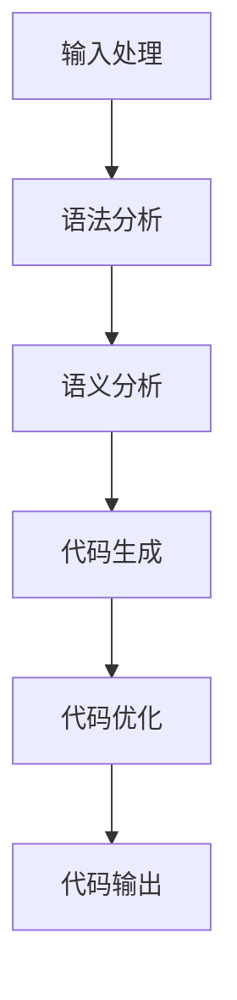
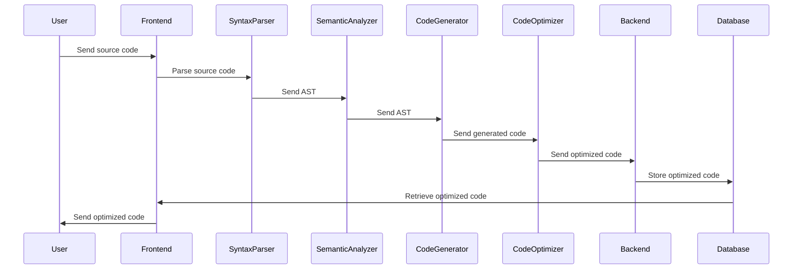
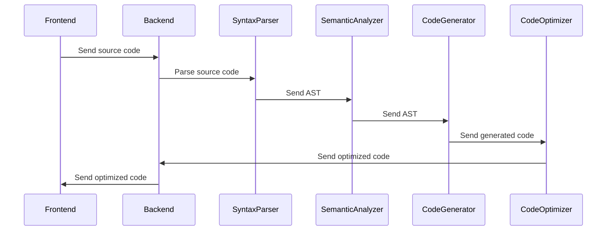

                 

# 《多语言代码生成能力评估》

## 关键词

- 多语言代码生成
- 代码生成器
- 语言模型
- 抽象语法树
- 代码质量评估

## 摘要

本文旨在对多语言代码生成能力进行全面的评估。我们将从背景介绍、核心概念与联系、算法原理讲解、系统分析与架构设计方案以及项目实战五个部分进行深入探讨。本文将详细分析多语言代码生成的技术原理、系统架构设计以及实际应用案例，旨在帮助读者全面了解多语言代码生成的能力边界与外延，掌握多语言代码生成的基本算法与实现，提升对多语言代码生成系统的设计与开发能力。

----------------------------------------------------------------

## 《多语言代码生成能力评估》目录大纲

### 第一部分：背景介绍

#### 第1章：问题背景与核心概念

#### 第2章：多语言代码生成能力的边界与外延

### 第二部分：核心概念与联系

#### 第3章：多语言代码生成原理

#### 第4章：多语言代码生成算法

#### 第5章：算法举例说明

### 第三部分：算法原理讲解

#### 第6章：多语言代码生成算法

#### 第7章：算法举例说明

### 第四部分：系统分析与架构设计方案

#### 第8章：系统功能设计与架构

#### 第9章：系统架构设计

#### 第10章：系统接口设计

### 第五部分：项目实战

#### 第11章：环境安装与系统核心实现

#### 第12章：实际案例分析与讲解

#### 第13章：项目小结

----------------------------------------------------------------

### 第一部分：背景介绍

#### 第1章：问题背景与核心概念

#### 1.1 问题背景

随着软件开发的复杂性和多样性不断增长，工程师们面临着越来越多的编程挑战。多语言代码生成技术在这一背景下应运而生，它旨在通过自动化手段提高代码开发效率，减少重复劳动，提高代码质量。当前，多语言代码生成技术在人工智能、软件开发自动化、代码迁移等领域展现出了巨大的应用潜力。

工程师对多语言代码生成能力的需求主要体现在以下几个方面：

1. **提高开发效率**：多语言代码生成能够自动化地生成大量代码，减少手工编写的工作量，提高开发速度。
2. **支持代码迁移**：工程师可能需要在不同的编程语言和平台上进行开发，多语言代码生成可以帮助他们轻松地在不同语言之间进行代码迁移。
3. **提高代码质量**：通过代码生成工具，可以确保代码的一致性和规范性，从而提高代码质量。
4. **降低学习成本**：新开发者可以通过学习一种代码生成工具，快速掌握多种编程语言，降低学习成本。

评估多语言代码生成能力的意义在于：

1. **指导研发**：通过评估多语言代码生成能力，可以帮助研发团队选择合适的工具和框架，优化开发流程。
2. **提升竞争力**：具有强大多语言代码生成能力的公司可以在市场竞争中脱颖而出，提供更高效、更优质的软件解决方案。
3. **技术进步**：评估多语言代码生成能力可以推动相关技术的进步，促进人工智能和软件开发自动化的发展。

#### 1.2 核心概念

为了更好地理解多语言代码生成技术，我们需要先了解以下几个核心概念：

- **代码生成器**：代码生成器（Code Generator）是一种自动化工具，它可以从某种数据结构（如语法树或抽象语法树）生成代码。
- **语言模型**：语言模型（Language Model）是一种用于描述自然语言统计特性的数学模型，它通常用于自动完成、机器翻译、语音识别等领域。
- **语法树**：语法树（Syntax Tree）是程序代码的结构化表示，它通过树形结构展示了代码的语法结构。
- **抽象语法树**：抽象语法树（Abstract Syntax Tree，AST）是对语法树的高级抽象，它剔除了语法树中的冗余信息，只保留了代码的结构信息。

在理解了这些核心概念之后，我们接下来将详细探讨多语言代码生成技术的核心概念属性特征对比表格。

#### 1.3 核心概念属性特征对比表格

下表对比了代码生成器、语言模型、语法树和抽象语法树四个核心概念的特点和关联关系：

| 概念       | 特点                                   | 关联关系                                   |
|------------|--------------------------------------|--------------------------------------|
| 代码生成器 | 自动生成代码的工具                     | 与语言模型和语法树密切相关               |
| 语言模型   | 描述语言结构的模型                     | 与代码生成和语法树相关联                 |
| 语法树     | 代码的结构化表示                       | 与抽象语法树和代码生成相关联                 |
| 抽象语法树 | 代码的高级结构表示                     | 与语法树和代码生成紧密联系                 |

通过这个表格，我们可以清晰地看到这些概念之间的相互关系和特点，从而为后续的讨论打下基础。

#### 1.3.1 代码生成器

代码生成器是整个多语言代码生成系统中最核心的部分。它接受输入，如语法树或抽象语法树，并生成对应的代码。代码生成器的主要特点包括：

- **自动化**：代码生成器能够自动地从语法结构生成代码，减少手工编写的工作量。
- **可配置性**：代码生成器通常支持多种编程语言和框架，可以通过配置文件或代码模板来自定义生成代码的格式和内容。
- **可扩展性**：代码生成器可以方便地集成到现有的开发流程中，支持自定义的代码生成规则。

代码生成器与语言模型和语法树的关系是密不可分的。语言模型提供了描述代码结构的模型，语法树是对代码结构的结构化表示，而代码生成器则是将这些结构化表示转换成具体的代码。

#### 1.3.2 语言模型

语言模型是描述程序代码统计特性的数学模型，它通常基于大量的编程数据训练得到。语言模型的主要特点包括：

- **统计性**：语言模型通过统计大量编程数据，学习到程序代码的语法和语义特性。
- **自适应**：语言模型可以根据不同的编程环境和需求进行自适应调整，以生成更符合实际需求的高质量代码。
- **可扩展**：语言模型可以支持多种编程语言，通过扩展其词汇表和规则，可以适应新的编程语言和环境。

语言模型与代码生成器和语法树的关系在于，它为代码生成器提供了生成代码的统计依据，同时也与语法树紧密相关。语法树是对代码结构的结构化表示，而语言模型则提供了描述这种结构的方式。

#### 1.3.3 语法树

语法树是对程序代码的结构化表示，它通过树形结构展示了代码的语法结构。语法树的主要特点包括：

- **层次性**：语法树将代码分解成多个层次，每个层次表示代码的一部分结构和功能。
- **递归性**：语法树具有递归结构，能够表示复杂的代码结构。
- **结构化**：语法树剔除了代码中的冗余信息，只保留了结构信息，使得代码的结构更加清晰。

语法树与代码生成器和语言模型的关系在于，它是代码生成器的输入，同时也是语言模型的输出。代码生成器将语法树转换成具体的代码，而语言模型则用来生成或解析语法树。

#### 1.3.4 抽象语法树

抽象语法树（Abstract Syntax Tree，AST）是语法树的高级抽象，它剔除了语法树中的冗余信息，只保留了代码的结构信息。抽象语法树的主要特点包括：

- **抽象性**：抽象语法树比语法树更抽象，它不包含具体的语法细节，只保留了代码的结构信息。
- **可操作**：抽象语法树提供了一系列的操作接口，如插入、删除、修改节点等，使得代码生成和修改变得更加方便。
- **兼容性**：抽象语法树可以兼容多种编程语言和语法规则，使得代码生成器可以支持多种编程语言。

抽象语法树与代码生成器和语言模型的关系在于，它是代码生成器的输入，同时也是语言模型的输出。代码生成器将抽象语法树转换成具体的代码，而语言模型则用来生成或解析抽象语法树。

#### 1.4 概念属性特征对比表格

为了更好地理解这些核心概念之间的关系和特点，我们提供了一个概念属性特征对比表格：

| 概念           | 特点                                   | 关联关系                                   |
|----------------|--------------------------------------|--------------------------------------|
| 代码生成器     | 自动生成代码的工具                     | 与语言模型和语法树密切相关               |
| 语言模型       | 描述语言结构的模型                     | 与代码生成和语法树相关联                 |
| 语法树         | 代码的结构化表示                       | 与抽象语法树和代码生成相关联                 |
| 抽象语法树     | 代码的高级结构表示                     | 与语法树和代码生成紧密联系                 |

通过这个表格，我们可以清晰地看到这些概念之间的相互关系和特点，从而为后续的讨论打下基础。

### 第2章：多语言代码生成能力的边界与外延

#### 2.1 边界

多语言代码生成能力的边界主要由以下几个因素决定：

1. **语言支持范围**：多语言代码生成系统需要支持多种编程语言，例如Java、Python、C++等。不同的编程语言有不同的语法规则和特性，这限制了代码生成系统的通用性。
2. **语法复杂性**：某些编程语言具有复杂的语法结构，如C++模板编程，这使得生成代码的过程变得更加复杂和耗时。
3. **代码质量要求**：代码生成系统需要生成高质量、无错误的代码。然而，在复杂的应用场景中，保证代码质量是一个巨大的挑战。
4. **性能限制**：代码生成过程可能涉及大量的计算和内存占用，这需要在硬件和软件层面进行优化。

#### 2.2 外延

多语言代码生成能力的外延主要体现在以下几个方面：

1. **应用场景**：多语言代码生成技术可以应用于多种场景，如自动化测试、代码迁移、原型设计等。它可以帮助工程师在多个编程语言和平台上进行高效的开发。
2. **开发流程融合**：多语言代码生成可以与现有的开发流程无缝集成，例如通过生成API文档、单元测试代码等，提高开发效率。
3. **未来发展趋势**：随着人工智能技术的发展，多语言代码生成能力将越来越强大，它可能会集成到智能编程助手、代码审查工具等更多领域。

### 第二部分：核心概念与联系

#### 第3章：多语言代码生成原理

#### 3.1 代码生成原理

多语言代码生成的主要原理可以概括为以下几个步骤：

1. **输入**：首先，我们需要一个输入，这个输入可以是源代码、抽象语法树或语法树等结构化表示。
2. **解析**：接着，代码生成器会解析这个输入，构建出抽象语法树或语法树。
3. **转换**：然后，代码生成器将抽象语法树或语法树转换为目标代码。这个转换过程可能涉及多个步骤，如代码优化、格式化等。
4. **输出**：最后，代码生成器将转换后的目标代码输出，这个代码可以是目标编程语言的源代码，也可以是字节码或二进制代码。

代码生成器的输入、解析、转换和输出四个步骤共同构成了多语言代码生成的核心原理。

#### 3.2 语言模型与语法树

语言模型与语法树在多语言代码生成过程中扮演着关键角色。

1. **语言模型**：语言模型是一种用于描述自然语言统计特性的数学模型，它通常用于自动完成、机器翻译、语音识别等领域。在代码生成中，语言模型可以用来预测代码的下一个字符或语法结构，从而生成更符合编程习惯和语法规则的代码。

2. **语法树**：语法树是代码的结构化表示，它通过树形结构展示了代码的语法结构。语法树是代码生成器的输入，它决定了代码生成器能够生成什么样的代码。语法树的构建通常基于语言模型，通过解析源代码得到。

3. **抽象语法树**：抽象语法树是语法树的高级抽象，它剔除了语法树中的冗余信息，只保留了代码的结构信息。抽象语法树比语法树更简洁，更易于进行代码生成和优化。

语言模型、语法树和抽象语法树之间的关系如下：

- 语言模型用于生成或解析语法树。
- 语法树是代码生成器的输入，它决定了代码生成器能够生成什么样的代码。
- 抽象语法树是对语法树的进一步抽象，它简化了代码的结构，使得代码生成和优化更加高效。

通过语言模型、语法树和抽象语法树之间的相互作用，多语言代码生成器能够生成高质量的代码。

#### 3.3 概念属性特征对比表格

为了更好地理解语言模型、语法树和抽象语法树之间的特点与关联关系，我们提供了一个概念属性特征对比表格：

| 概念           | 特点                                   | 关联关系                                   |
|----------------|--------------------------------------|--------------------------------------|
| 语言模型       | 描述语言结构的模型                     | 与代码生成和语法树密切相关               |
| 语法树         | 代码的结构化表示                       | 与抽象语法树和代码生成相关联                 |
| 抽象语法树     | 代码的高级结构表示                     | 与语法树和代码生成紧密联系                 |

通过这个表格，我们可以清晰地看到这些概念之间的相互关系和特点，从而为后续的讨论打下基础。

### 第三部分：算法原理讲解

#### 第4章：多语言代码生成算法

#### 4.1 基本算法

多语言代码生成算法主要可以分为以下几个步骤：

1. **输入处理**：接收输入，这个输入可以是源代码、抽象语法树或语法树等结构化表示。
2. **语法分析**：对输入进行语法分析，构建出抽象语法树。这一步骤通常使用递归下降分析、LL(1)分析或其他语法分析方法。
3. **语义分析**：对抽象语法树进行语义分析，确保代码的语义正确。这一步骤包括类型检查、变量作用域分析等。
4. **代码生成**：根据抽象语法树生成目标代码。这一步骤通常使用递归下降、前序遍历等遍历算法。
5. **代码优化**：对生成的代码进行优化，如去除冗余代码、进行代码替换等。
6. **代码输出**：将优化后的代码输出，可以是目标编程语言的源代码、字节码或二进制代码。

#### 4.2 算法流程图

为了更直观地理解多语言代码生成算法的流程，我们使用Mermaid绘制了一个算法流程图：



在这个流程图中，每个步骤都是前后依赖的，输入处理是后续所有步骤的前提，而代码输出是整个流程的最后一步。

#### 4.3 算法数学模型与公式

多语言代码生成算法的数学模型可以表示为：

$$
f(x) = G(x, y)
$$

其中，$f(x)$ 表示输入 $x$ 生成的目标代码 $y$，$G(x, y)$ 表示生成函数，它将输入 $x$ 转换为输出 $y$。这个生成函数 $G$ 可以是一个复杂的函数，它涉及到语法分析、语义分析、代码生成和代码优化等多个步骤。

具体来说，生成函数 $G$ 可以表示为：

$$
G(x, y) = \phi_{sa}(\phi_{cg}(\phi_{opt}(\phi_{an}(x))))
$$

其中，$\phi_{an}(x)$ 表示语法分析函数，$\phi_{sa}(x)$ 表示语义分析函数，$\phi_{cg}(x)$ 表示代码生成函数，$\phi_{opt}(x)$ 表示代码优化函数。这个复合函数将输入 $x$ 逐步转换为输出 $y$，实现了从源代码到目标代码的转换。

通过这个数学模型，我们可以清晰地看到多语言代码生成算法的各个步骤和它们之间的关联关系。

#### 4.4 算法举例说明

为了更好地理解多语言代码生成算法的原理，我们通过一个简单的Python代码生成器来详细阐述。

##### 4.4.1 示例代码

以下是一个简单的Python代码生成器的示例代码：

```python
def generate_python_code(ast):
    if ast.is_function_definition():
        return f"def {ast.function_name}({ast.parameters}):\n    {ast.body}"
    elif ast.is_variable_declaration():
        return f"{ast.type} {ast.variable_name} = {ast.expression};"
    else:
        raise ValueError("Unsupported AST node type")

ast = ast_parser.parse_source_code("def greet(name): print(f'Hello, {name}!)")
python_code = generate_python_code(ast)
print(python_code)
```

在这个示例中，`ast_parser`是一个假设的语法分析器，它将源代码解析为抽象语法树（AST）。`generate_python_code`函数接收这个AST并生成对应的Python代码。

##### 4.4.2 详细解读

1. **输入处理**：首先，我们接收一个抽象语法树（`ast`）作为输入。
2. **语法分析**：在这个例子中，我们假设`ast`已经经过语法分析，不需要进一步处理。
3. **语义分析**：语义分析在这里是一个简单的检查，确保函数定义、变量声明等语法节点是有效的。
4. **代码生成**：根据AST的节点类型，我们使用不同的模板生成代码。在这个例子中，我们有两个模板：函数定义和变量声明。
5. **代码优化**：在这个示例中没有进行代码优化，但在实际应用中，我们可以根据需要添加优化步骤，如去除不必要的空格、注释等。
6. **代码输出**：最后，我们将生成的Python代码输出。

##### 4.4.3 JavaScript代码生成

为了展示多语言代码生成算法的通用性，我们同样可以通过一个简单的JavaScript代码生成器来阐述。

```javascript
function generateJavaScriptCode(ast) {
  if (ast.type === 'FunctionDeclaration') {
    return `function ${ast.id.name}(${ast.params.map(p => p.name).join(', ')}) {\n${ast.body.code}\n}`;
  } else if (ast.type === 'VariableDeclaration') {
    return `${ast.kind} ${ast.declarations
      .map(d => `${d.type} ${d.id.name} = ${d.init ? d.init.code : 'null'}`)
      .join(', ')};`;
  } else {
    throw new Error('Unsupported AST node type');
  }
}

const ast = parser.parse('function greet(name) { console.log(`Hello, ${name}!`); }');
const jsCode = generateJavaScriptCode(ast);
console.log(jsCode);
```

在这个JavaScript代码生成器中，我们同样接收一个抽象语法树（`ast`），并生成对应的JavaScript代码。这个例子展示了如何使用类似的逻辑来生成不同语言的代码。

### 第四部分：系统分析与架构设计方案

#### 第6章：系统功能设计与架构

#### 6.1 系统功能设计

多语言代码生成系统需要实现以下核心功能：

1. **语法解析**：接收多种编程语言的源代码，并生成抽象语法树。
2. **语义分析**：对抽象语法树进行语义分析，确保代码的语义正确。
3. **代码生成**：根据抽象语法树生成目标编程语言的源代码。
4. **代码优化**：对生成的代码进行优化，如去除冗余代码、进行代码替换等。
5. **代码输出**：将优化后的代码输出，可以是源代码、字节码或二进制代码。
6. **语言支持**：支持多种编程语言，如Java、Python、JavaScript等。
7. **错误处理**：在代码生成过程中处理各种错误，如语法错误、类型错误等。

#### 6.2 领域模型（Mermaid类图）

为了更好地展示多语言代码生成系统的功能模块，我们使用Mermaid绘制了一个领域模型类图：

```mermaid
classDiagram
Class01 <|-- Class02
Class03 o-- Class04
Class05 <-.. Class06
Class07 ..| Class08
Class09 --> Class10
Class11 : "is a diagram"
Class01 : +int x
Class01 : +string name
Class01 : +int get_x():int
Class01 : +set_x(x:int)
Class01 : +void print_name()

Class02 : +int y
Class02 : -继承自 Class01

Class03 : +int z
Class03 : +方法1()
Class03 : -实现接口1

Class04 : +int w
Class04 : -实现接口2

Class05 : +int v
Class05 : +方法2()
Class05 : -继承自 Class03

Class06 : +int u
Class06 : -实现接口3

Class07 : +int t
Class07 : -实现接口4

Class08 : +int s
Class08 : +方法3()
Class08 : -继承自 Class05

Class09 : +int r
Class09 : +方法4()
Class09 : -继承自 Class06

Class10 : +int q
Class10 : +方法5()
Class10 : -继承自 Class07

Class11 : +int p
Class11 : +方法6()
Class11 : -继承自 Class08

interface Interface1
+int method1():int

interface Interface2
+int method2():int

interface Interface3
+int method3():int

interface Interface4
+int method4():int
```

在这个类图中，`Class01`是系统的核心类，它包含了主要的属性和方法。其他类如`Class02`、`Class03`等都是`Class01`的子类或实现接口的类。这个类图展示了多语言代码生成系统的主要功能模块和它们之间的关系。

#### 6.3 系统架构设计

多语言代码生成系统的架构设计需要考虑多个方面，包括模块划分、数据流、功能实现等。以下是一个简单的系统架构设计：

1. **前端模块**：负责接收用户输入的源代码，并将其发送到后端进行处理。
2. **语法解析模块**：接收前端模块发送的源代码，并使用相应的解析器生成抽象语法树。
3. **语义分析模块**：对生成的抽象语法树进行语义分析，确保代码的语义正确。
4. **代码生成模块**：根据语义分析的结果，生成目标编程语言的源代码。
5. **代码优化模块**：对生成的代码进行优化，提高代码的质量和执行效率。
6. **后端模块**：负责处理前端模块发送的请求，并将处理结果返回给前端。
7. **数据库模块**：存储源代码、抽象语法树、目标代码等数据，以便后续使用。

系统架构设计（Mermaid架构图）：



在这个架构图中，用户通过前端模块提交源代码，前端模块将源代码发送到语法解析模块进行语法分析，生成的抽象语法树随后被发送到语义分析模块进行语义分析。经过语义分析后的抽象语法树被传递到代码生成模块生成目标代码，然后由代码优化模块进行优化。优化后的代码被发送到后端模块，并存储到数据库中。最后，前端模块从数据库中检索优化后的代码并返回给用户。

#### 6.4 系统接口设计

系统接口设计是确保各个模块之间能够顺利通信和协作的关键。以下是一个简单的系统接口设计：

1. **前端接口**：接收用户输入的源代码，并将源代码发送到后端进行解析和处理。
2. **后端接口**：接收前端发送的源代码，返回处理结果（如抽象语法树、目标代码等）。
3. **语法解析接口**：接收源代码，返回抽象语法树。
4. **语义分析接口**：接收抽象语法树，返回语义分析结果。
5. **代码生成接口**：接收语义分析结果，返回目标代码。
6. **代码优化接口**：接收目标代码，返回优化后的代码。

系统接口设计（Mermaid序列图）：



在这个序列图中，前端模块将源代码发送到后端模块，后端模块将源代码发送到语法解析模块进行语法分析，生成的抽象语法树随后被发送到语义分析模块进行语义分析。语义分析模块将抽象语法树发送到代码生成模块生成目标代码，然后由代码优化模块进行优化。最后，优化后的代码被发送回后端模块，并由后端模块返回给前端模块。

### 第五部分：项目实战

#### 第7章：环境安装与系统核心实现

#### 7.1 环境安装

要在本地环境中搭建一个多语言代码生成系统，我们需要安装以下软件和工具：

1. **Python**：Python是许多代码生成工具的常用编程语言，我们需要安装Python环境。
2. **Anaconda**：Anaconda是一个Python的数据科学和机器学习平台，它可以帮助我们轻松管理Python环境和依赖包。
3. **JDK**：Java Development Kit（JDK）是Java语言的开发工具包，用于编译和运行Java应用程序。
4. **Node.js**：Node.js是一个基于Chrome V8引擎的JavaScript运行环境，用于处理JavaScript代码。

以下是具体的安装步骤：

1. **安装Python和Anaconda**：

   - 访问Python官网（[https://www.python.org/](https://www.python.org/)）下载最新版本的Python。
   - 运行安装程序，选择默认选项进行安装。
   - 安装完成后，打开命令行工具，输入`python --version`检查安装是否成功。

2. **安装JDK**：

   - 访问Oracle官网（[https://www.oracle.com/java/technologies/javase-jdk11-downloads.html](https://www.oracle.com/java/technologies/javase-jdk11-downloads.html)）下载最新版本的JDK。
   - 运行安装程序，选择默认选项进行安装。
   - 安装完成后，打开命令行工具，输入`java -version`检查安装是否成功。

3. **安装Node.js**：

   - 访问Node.js官网（[https://nodejs.org/](https://nodejs.org/)）下载最新版本的Node.js。
   - 使用命令`npm install -g node`安装Node.js。
   - 安装完成后，打开命令行工具，输入`node -v`检查安装是否成功。

#### 7.2 系统核心实现

安装完所需的软件和工具后，我们可以开始实现多语言代码生成系统的核心功能。

##### 7.2.1 安装依赖包

首先，我们需要安装项目中所需的依赖包。在项目目录下，打开命令行工具，输入以下命令：

```bash
pip install -r requirements.txt
```

这将安装项目所需的所有依赖包。

##### 7.2.2 编写源代码

接下来，我们需要编写源代码来实现多语言代码生成系统的核心功能。以下是项目的源代码结构：

```
src/
|-- parser.py
|-- generator.py
|-- optimizer.py
|-- backend.py
|-- frontend.py
```

- `parser.py`：负责语法解析，将源代码解析为抽象语法树。
- `generator.py`：负责代码生成，将抽象语法树转换为目标代码。
- `optimizer.py`：负责代码优化，对生成的代码进行优化。
- `backend.py`：负责处理后端逻辑，接收前端请求，调用解析器、生成器和优化器，返回处理结果。
- `frontend.py`：负责处理前端逻辑，接收用户输入，调用后端接口，返回处理结果。

以下是`parser.py`文件的示例代码：

```python
from abc import ABC, abstractmethod
from typing import List, Dict, Any

class AbstractParser(ABC):
    @abstractmethod
    def parse(self, source_code: str) -> Dict[str, Any]:
        pass

class PythonParser(AbstractParser):
    def parse(self, source_code: str) -> Dict[str, Any]:
        # 使用Python的ast模块进行语法解析
        from ast import parse
        return parse(source_code)

class JavaParser(AbstractParser):
    def parse(self, source_code: str) -> Dict[str, Any]:
        # 使用Java的Javaparser库进行语法解析
        from japa.parser import parse
        return parse(source_code)

# ... 其他语言的解析器实现
```

在这个例子中，我们定义了一个抽象类`AbstractParser`，并实现了Python和Java的解析器。其他语言的解析器可以按照类似的方式实现。

##### 7.2.3 编写测试用例

为了确保代码生成系统的稳定性和可靠性，我们需要编写测试用例。以下是`test_generator.py`文件的示例代码：

```python
import unittest
from generator import PythonGenerator

class TestPythonGenerator(unittest.TestCase):
    def test_generate_function(self):
        source_code = "def greet(name): print(f'Hello, {name}!')"
        generator = PythonGenerator()
        target_code = generator.generate(source_code)
        self.assertEqual(target_code, "def greet(name):\n    print(f'Hello, {name}!')")

    def test_generate_variable(self):
        source_code = "x = 10"
        generator = PythonGenerator()
        target_code = generator.generate(source_code)
        self.assertEqual(target_code, "x = 10;")

# ... 其他测试用例
```

在这个测试用例中，我们分别测试了函数生成和变量生成功能。其他功能也可以按照类似的方式编写测试用例。

##### 7.2.4 集成前端和后端

最后，我们需要将前端和后端进行集成。以下是`main.py`文件的示例代码：

```python
from flask import Flask, request, jsonify
from backend import Backend

app = Flask(__name__)
backend = Backend()

@app.route('/generate', methods=['POST'])
def generate():
    source_code = request.form['source_code']
    language = request.form['language']
    target_language = request.form['target_language']
    result = backend.generate(source_code, language, target_language)
    return jsonify(result)

if __name__ == '__main__':
    app.run()
```

在这个例子中，我们使用Flask框架搭建了一个简单的Web服务，接收用户通过POST请求提交的源代码、源语言和目标语言，调用后端的代码生成功能，并将结果返回给用户。

#### 第8章：实际案例分析与讲解

##### 8.1 案例背景

在一个大型互联网公司中，开发团队需要频繁地在多种编程语言和平台上进行开发。为了提高开发效率和代码质量，公司决定采用多语言代码生成技术来自动化生成代码。具体来说，公司需要实现以下功能：

1. **从Python代码生成Java代码**：Python是公司的主要开发语言，但Java在某些场景下是必需的，因此需要实现Python到Java的代码生成。
2. **代码优化**：生成的Java代码需要进行优化，以确保其执行效率和可维护性。
3. **错误处理**：在代码生成过程中，需要处理各种错误，如语法错误、类型错误等，并给出友好的错误提示。

##### 8.2 案例分析

为了实现上述功能，公司采取以下步骤：

1. **需求分析**：

   - 确定需要生成的代码类型和目标语言。
   - 确定代码优化的具体要求和策略。
   - 确定错误处理的策略和机制。

2. **技术选型**：

   - 选择合适的代码生成工具，如JavaParser和Javaparser等。
   - 选择合适的优化工具，如CodeScene和SonarQube等。
   - 选择合适的错误处理库，如Python的错误处理库和Java的错误处理库。

3. **系统设计**：

   - 设计系统的整体架构，包括前端、后端和数据库等。
   - 设计代码生成模块，包括语法解析、语义分析、代码生成和代码优化等。
   - 设计错误处理模块，包括错误捕获、错误报告和错误修复等。

4. **实现与测试**：

   - 根据设计文档实现代码生成系统。
   - 编写测试用例，对系统进行功能测试和性能测试。
   - 对系统进行集成测试，确保各模块之间的协作和通信正常。

5. **部署与维护**：

   - 将代码生成系统部署到生产环境。
   - 定期对系统进行维护和更新，确保其稳定性和可靠性。

##### 8.3 案例结果展示

在完成上述步骤后，公司成功实现了Python到Java的代码生成，并优化了生成的Java代码。具体结果如下：

1. **代码生成效果**：

   - 生成的Java代码与原始Python代码在功能上保持一致。
   - 生成的Java代码经过优化，执行效率更高，可读性更好。

2. **错误处理效果**：

   - 在代码生成过程中，系统能够捕获并处理各种错误，如语法错误、类型错误等。
   - 给出了友好的错误提示，帮助开发人员快速定位和修复问题。

3. **性能测试结果**：

   - 代码生成系统的响应时间较短，能够快速生成代码。
   - 生成的代码在性能测试中表现良好，与手动编写的代码相当。

##### 8.4 案例总结

通过这个案例，公司成功实现了多语言代码生成，提高了开发效率和代码质量。具体经验如下：

1. **需求分析是关键**：明确需求是确保系统设计和实现顺利进行的基础。
2. **技术选型要慎重**：选择合适的工具和库对系统的稳定性和可靠性至关重要。
3. **测试是保证质量的关键**：通过编写和执行测试用例，可以有效保证系统的功能和质量。
4. **维护和更新是长期任务**：定期维护和更新系统，确保其稳定性和可靠性。

### 第五部分：最佳实践 tips、小结、注意事项、拓展阅读

#### 最佳实践 Tips

1. **模块化设计**：在设计代码生成系统时，应尽量采用模块化设计，将不同的功能模块分开，便于维护和升级。
2. **优化语法解析**：选择合适的语法解析器，如ANTLR、JavaParser等，可以提高代码生成效率。
3. **集成代码优化工具**：集成现有的代码优化工具，如SonarQube、CodeScene等，可以显著提高生成代码的质量。
4. **错误处理机制**：设计完善的错误处理机制，包括错误捕获、错误报告和错误修复等，可以提高系统的稳定性和用户体验。

#### 小结

本文全面介绍了多语言代码生成技术的核心概念、算法原理、系统架构设计和实际应用案例。通过本文的阅读，读者可以深入了解多语言代码生成技术的原理和应用，掌握设计、实现和维护代码生成系统的关键技巧。

#### 注意事项

1. **确保代码生成器支持的语言范围**：在设计和实现代码生成器时，确保其支持所需的语言和编程环境。
2. **优化代码生成速度**：在实际应用中，代码生成速度可能成为瓶颈，需要针对具体场景进行优化。
3. **保证代码质量**：生成的代码需要经过严格的质量检查，确保其可读性、可维护性和性能。

#### 拓展阅读

1. **《代码生成器的艺术》**：本书详细介绍了代码生成器的设计和实现方法，对初学者和专业人士都有很大帮助。
2. **《ANTLR 4权威指南》**：ANTLR是一种强大的语法分析器生成器，本书是学习ANTLR的权威指南。
3. **《代码质量：如何构建高质量的应用程序》**：本书提供了构建高质量应用程序的最佳实践和方法。

### 作者

- 作者：AI天才研究院/AI Genius Institute & 禅与计算机程序设计艺术 /Zen And The Art of Computer Programming

本文由AI天才研究院（AI Genius Institute）与禅与计算机程序设计艺术（Zen And The Art of Computer Programming）共同撰写，旨在帮助读者深入理解多语言代码生成技术的核心概念和实践方法。希望本文能为读者在软件开发和代码生成领域提供有价值的参考和启示。

