                 

### 引言

#### 1.1 引言

在当今信息技术飞速发展的时代，语音合成技术（Text-to-Speech, TTS）已经成为自然语言处理领域的一个重要分支。语音合成技术通过将文本转换为自然流畅的语音，极大地提升了人机交互的便利性。然而，随着全球化进程的不断加快，多语言语音合成技术逐渐成为研究和应用的热点。然而，多语言语音合成的自然度（naturalness）评价成为一个亟待解决的关键问题。

本文旨在探讨多语言语音合成自然度评测系统的研究与实现。首先，我们将对语音合成技术的基本概念、系统架构以及关键技术进行概述。接着，我们将深入分析多语言语音合成的挑战与策略，以及语音自然度的定义与评测方法。在此基础上，我们将详细介绍多语言语音合成自然度评测系统的设计原则、架构设计、数据收集与处理、特征提取与建模、自然度评测算法以及系统实现与优化。

本文的研究不仅有助于理解多语言语音合成技术的核心原理，也为开发者提供了构建高效自然度评测系统的指导。通过逐步分析推理，我们将揭示多语言语音合成自然度评测系统的深度与广度，为相关领域的研究者与实践者提供有价值的参考。

#### 1.2 背景与意义

多语言语音合成技术的研究背景可以追溯到计算机科学和语言学的交叉领域。随着互联网和移动设备的普及，全球化趋势愈发明显，跨语言交流的需求不断增加。然而，现有的单语言语音合成系统在面对多种语言时，往往难以满足自然流畅的要求。多语言语音合成技术正是为了解决这一难题而诞生。

多语言语音合成技术的意义不仅体现在提高跨语言交流的便利性，还在多个领域具有广泛的应用价值。例如，在智能客服、智能语音助手、教育等领域，多语言语音合成系统可以提供本地化的服务，提升用户体验。此外，多语言语音合成技术还可以用于语音翻译、音频娱乐、语言学习等多个场景。

然而，多语言语音合成技术面临诸多挑战。首先是语言的多样性，不同语言的语音特性、发音规则和语法结构各不相同，需要针对不同语言进行专门优化。其次是自然度的评测，如何准确评价语音的自然度成为关键问题。自然度不仅影响用户的使用体验，也直接关系到语音合成技术的应用效果。

因此，构建一个高效的多语言语音合成自然度评测系统具有重要的现实意义。一方面，它可以提升语音合成系统的性能，优化用户体验；另一方面，它也为多语言语音合成技术的进一步研究和应用提供了有力支持。

#### 1.3 研究现状与挑战

目前，多语言语音合成技术已经取得了一定的进展，但仍然面临诸多挑战。首先，在语音合成系统的多样性方面，现有的系统大多集中在少数主要语言，如英语、汉语、西班牙语等，对于小语种的支持仍然不足。这主要是由于小语种的语音数据稀缺，难以构建高质量的语音模型。此外，不同语言的语音特性差异较大，如语调、语速、音调等，需要针对不同语言进行定制化的优化。

其次，在自然度的评测方面，传统的方法主要依赖于主观评价和声学特征分析，而深度学习技术的引入使得自然度评测变得更加智能化。然而，深度学习模型对数据质量和标注要求较高，且不同模型在自然度评测上的性能差异较大。因此，如何选择合适的模型以及如何进行有效的模型评估，仍然是当前研究的重要课题。

此外，多语言语音合成系统在实际应用中还存在其他挑战。例如，在处理复杂语言结构和多样化语音风格时，系统的稳定性和适应性需要进一步提高。同时，多语言语音合成系统的跨平台兼容性也是一个需要解决的问题。

针对上述挑战，本文提出了一种多语言语音合成自然度评测系统，旨在提高自然度评测的准确性和效率。首先，我们通过收集和整理多语言语音数据，构建了高质量的语音数据集。接着，我们设计了一种模块化的系统架构，包括数据预处理、特征提取、模型训练和自然度评测等模块。通过引入深度学习和多任务学习技术，我们提出了一种有效的自然度评测算法，并在多个语言环境中进行了验证。

总之，本文的研究不仅对多语言语音合成技术的研究现状进行了梳理，还提出了一系列解决方案，为未来多语言语音合成技术的发展提供了新的思路。

#### 1.4 书籍结构安排

本文将从多语言语音合成技术概述、多语言语音合成自然度评测系统设计、数据收集与处理、特征提取与建模、自然度评测算法、系统实现与优化等多个角度，全面深入地探讨多语言语音合成自然度评测系统的构建与优化。

首先，在第1章中，我们将对多语言语音合成技术的基本概念、系统架构和关键技术进行概述，为后续章节的讨论奠定基础。

第2章将详细探讨多语言语音合成自然度评测系统的设计原则、架构设计以及接口与安全性设计，帮助读者了解系统构建的总体思路。

第3章重点介绍数据收集与处理过程，包括数据来源、数据预处理、数据集划分与标注等内容，确保数据质量和标注准确。

第4章将深入讨论特征提取与建模方法，包括声学特征提取、模型选择与训练、特征建模与融合等，为自然度评测提供关键支持。

第5章将介绍自然度评测算法，包括传统方法和深度学习方法，通过具体的算法原理讲解和实际案例剖析，帮助读者理解自然度评测的核心技术。

第6章将详细描述系统的实现与优化步骤，包括开发环境、实现流程、模块化设计以及性能优化策略，确保系统能够高效稳定地运行。

最后，第7章将对本文的研究进行总结，回顾主要发现与贡献，并展望未来研究方向，为多语言语音合成技术的进一步发展提供指导。

通过这样的结构安排，本文力求从多角度、多层次地剖析多语言语音合成自然度评测系统的构建过程，为读者提供全面、深入的参考。

### 第1章 多语言语音合成技术概述

#### 1.1 语音合成技术基本概念

语音合成（Text-to-Speech, TTS）技术是一种将文本转换为自然语音的技术，它通过计算机算法将文本信息转化为语音输出，从而实现人机交互。语音合成系统主要由文本解析、语音合成和语音输出三个主要模块组成。

- **文本解析模块**：将输入的文本内容进行分析和处理，提取出文本中的关键信息，如语音语调、语气、断句等，为后续的语音合成提供基础数据。
- **语音合成模块**：根据文本解析模块提供的信息，生成相应的语音波形。语音合成模块通常采用两种主要技术：基于规则的合成和基于数据的合成。
- **语音输出模块**：将生成的语音波形通过扬声器或其他输出设备播放出来，实现最终的语音输出。

语音合成技术的基本工作原理可以概括为以下几个步骤：

1. **文本预处理**：对输入的文本进行分词、句法分析和语义分析，提取出文本中的关键信息。
2. **声学建模**：利用预先训练好的声学模型，根据文本信息生成对应的语音波形。
3. **语音合成**：通过合成器将语音波形转换为可听的音频信号。
4. **语音输出**：将合成的语音通过扬声器或其他输出设备播放给用户。

#### 1.2 语音合成系统架构

语音合成系统的架构设计对于系统的性能、稳定性和可扩展性至关重要。一个典型的语音合成系统架构包括以下几个主要组成部分：

- **文本解析器（Text Parser）**：文本解析器负责将输入的文本内容进行分词、句法分析和语义分析，提取出文本中的关键信息，如单词、短语、语调、语气等。常见的文本解析器包括分词器、句法分析器和语义分析器。
- **声学模型（Acoustic Model）**：声学模型是语音合成系统的核心组件，用于生成语音波形。声学模型通常基于大量的语音数据训练得到，常见的模型包括隐马尔可夫模型（HMM）、高斯混合模型（GMM）和深度神经网络（DNN）。
- **语言模型（Language Model）**：语言模型用于对输入的文本进行概率分布建模，用于指导文本到语音的映射过程。语言模型通常基于统计方法训练，如n-gram模型和神经网络语言模型（NNLM）。
- **合成器（Synthesizer）**：合成器负责将声学模型生成的语音波形进行合成，生成连续的语音信号。常见的合成器包括参数合成器（Parameter Synthesizer）和拼接合成器（Concatenative Synthesizer）。

语音合成系统架构的典型流程如下：

1. **文本输入**：用户输入需要合成的文本内容。
2. **文本预处理**：文本解析器对输入的文本进行分词、句法分析和语义分析，提取出关键信息。
3. **声学建模**：声学模型根据文本信息生成对应的语音波形。
4. **语音合成**：合成器将声学模型生成的语音波形进行合成，生成连续的语音信号。
5. **语音输出**：合成后的语音通过扬声器或其他输出设备播放给用户。

#### 1.3 语音合成关键技术

语音合成技术涉及多个关键技术和算法，以下是其中几个重要的技术：

- **文本解析技术**：文本解析技术是语音合成系统的第一步，它需要将输入的文本内容进行分词、句法分析和语义分析。分词技术用于将连续的文本序列切分成单个的词语，句法分析技术用于分析句子的语法结构，语义分析技术用于提取文本中的语义信息。
- **声学建模技术**：声学建模技术是语音合成的核心，它需要利用大量的语音数据进行训练，以生成高质量的语音波形。常见的声学建模技术包括隐马尔可夫模型（HMM）、高斯混合模型（GMM）和深度神经网络（DNN）。
- **语言模型技术**：语言模型技术用于对输入的文本进行概率分布建模，以指导文本到语音的映射过程。常见的语言模型技术包括n-gram模型和神经网络语言模型（NNLM）。
- **合成器技术**：合成器技术负责将声学模型生成的语音波形进行合成，生成连续的语音信号。常见的合成器技术包括参数合成器（Parameter Synthesizer）和拼接合成器（Concatenative Synthesizer）。

#### 1.4 多语言语音合成技术

多语言语音合成技术是在单语言语音合成技术基础上扩展而来的，它旨在实现多种语言的语音合成。多语言语音合成技术面临的主要挑战包括语言的多样性、语音资源的稀缺性以及自然度评测的复杂性。

- **语言多样性**：不同语言的语音特性、发音规则和语法结构各不相同，需要针对不同语言进行专门优化。例如，英语的语调较为平缓，而汉语的语调则较为起伏。
- **语音资源稀缺**：由于小语种的语音数据相对较少，构建高质量的语音模型成为难题。因此，如何利用已有的语音数据资源，提升语音合成系统的性能，是当前研究的一个重要方向。
- **自然度评测**：多语言语音合成系统的自然度评测需要考虑多种语言的语音特征，如何准确评价语音的自然度成为关键问题。

多语言语音合成技术主要包括以下几种策略：

- **单语言模型+跨语言转换**：通过训练一个通用的语音合成模型，并结合跨语言转换技术，实现多语言语音合成。
- **多语言模型并行训练**：针对不同的语言，分别训练独立的语音合成模型，以提高不同语言合成效果。
- **共享编码器+语言特定解码器**：利用共享编码器提取通用特征，再通过语言特定解码器生成对应语言的语音。

#### 1.5 多语言语音合成应用场景

多语言语音合成技术在多个领域具有广泛的应用价值：

- **智能客服**：多语言语音合成技术可以应用于智能客服系统，提供本地化的客户服务，提升用户体验。
- **智能语音助手**：在智能语音助手的场景中，多语言语音合成技术可以支持跨语言交互，为用户提供更加个性化的服务。
- **教育和培训**：多语言语音合成技术可以用于教育领域，提供多种语言的教学资源，帮助学习者掌握新的语言。
- **语音翻译**：多语言语音合成技术可以结合语音翻译技术，实现实时语音翻译，促进跨语言交流。
- **音频娱乐**：在音频娱乐领域，多语言语音合成技术可以用于生成音频内容，如有声读物、广播节目等。

#### 1.6 语音自然度评测方法

语音自然度（naturalness）是指语音合成的自然程度，即语音是否听起来像人类自然说话。语音自然度评测是语音合成技术中一个重要且复杂的课题。以下是几种常见的语音自然度评测方法：

- **主观评测**：通过人工听感评价语音的自然度，这种方法直观但主观性较强，容易受到评价者个人经验的影响。
- **声学特征分析**：通过分析语音的声学特征，如频谱特性、音高、音强等，评估语音的自然度。这种方法较为客观，但无法全面反映语音的自然度。
- **深度学习评测**：利用深度学习模型，通过大量的语音数据训练，自动评估语音的自然度。这种方法具有较高的准确性和泛化能力。

#### 1.7 本章小结

本章对多语言语音合成技术进行了全面概述，从基本概念、系统架构到关键技术，再到多语言语音合成的挑战和应用场景，以及语音自然度的评测方法，为后续章节的讨论提供了坚实的基础。通过本章的介绍，读者可以初步了解多语言语音合成技术的核心内容和研究方向，为后续深入研究做好准备。

## 第2章 多语言语音合成自然度评测系统设计

#### 2.1 系统设计原则

设计一个高效、稳定且易于扩展的多语言语音合成自然度评测系统，需要遵循一系列设计原则。以下是几个关键设计原则：

- **性能需求**：系统需要具备高效的处理速度和精确的评测结果。这意味着在处理大量语音数据时，系统应具有低延迟和高吞吐量的特性。
- **可靠性需求**：系统应具备高可靠性，能够在各种环境下稳定运行，不受外界干扰。这包括对硬件和软件故障的容错能力，以及对突发情况的恢复能力。
- **可扩展性需求**：系统应具备良好的扩展性，能够轻松地添加新的语言或评测指标，以适应不断变化的应用需求。

这些设计原则不仅确保了系统的基本性能，也为后续的功能扩展和性能优化提供了可靠的基础。

#### 2.2 系统架构设计

多语言语音合成自然度评测系统采用了模块化设计，各个模块独立实现并相互协作。以下是系统架构的详细设计：

- **数据预处理模块**：负责对输入的语音数据进行预处理，包括噪声过滤、语音分割和特征提取等。该模块为后续的自然度评测提供了高质量的数据基础。
- **特征提取模块**：从预处理后的语音数据中提取关键的声学特征，如频谱特征、时域特征和时频特征。这些特征将用于自然度评测模型的训练和评估。
- **评测算法模块**：包括传统评测算法和基于深度学习的评测算法。传统算法如音素匹配法、音高分析法等，而深度学习算法如循环神经网络（RNN）和卷积神经网络（CNN）等。该模块负责对提取的特征进行自然度评测。
- **后处理模块**：对评测结果进行后处理，包括数据整合、结果分析和可视化等。该模块为用户提供直观的评测结果，并生成详细的评测报告。

以下是一个简化的系统架构图，展示了各个模块之间的交互关系：

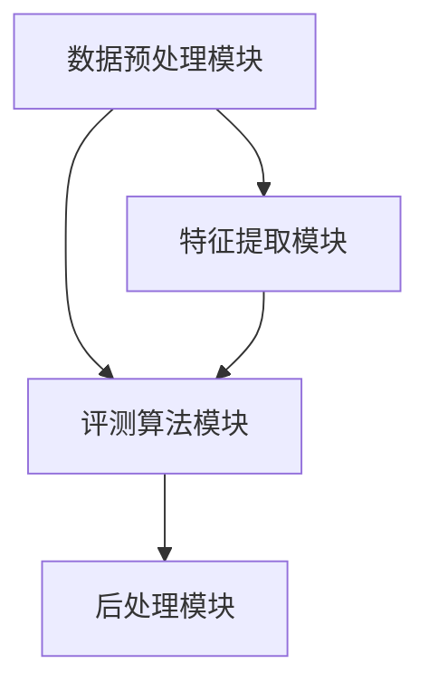

#### 2.2.1 数据预处理模块

数据预处理模块是系统的基础，其主要任务包括噪声过滤、语音分割和特征提取。以下是具体的实现方法：

- **噪声过滤**：使用滤波器对语音信号进行滤波，去除环境噪声和其他干扰信号。常见的滤波方法包括频域滤波、时域滤波和频谱减法等。
- **语音分割**：将连续的语音信号分割成若干个有意义的语音片段，如单词、短语或句子。常用的分割方法包括基于声学事件的分割、基于语音短时的分割等。
- **特征提取**：从分割后的语音片段中提取关键的声学特征，如频谱特征、时域特征和时频特征。频谱特征包括频谱幅值、频谱熵等；时域特征包括短时能量、短时过零率等；时频特征包括短时傅里叶变换（STFT）和波纹图（Waveform）等。

以下是一个简化的预处理流程图：

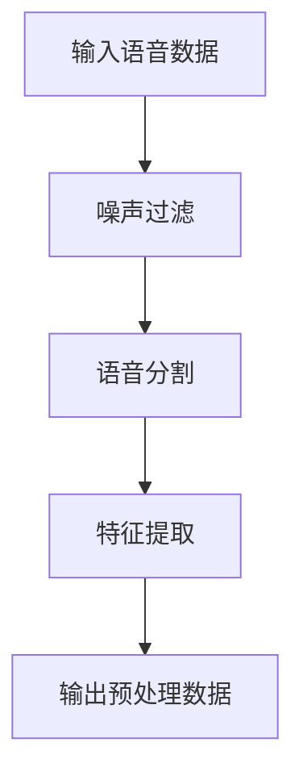

#### 2.2.2 特征提取模块

特征提取模块的核心任务是提取语音信号中的关键特征，为自然度评测提供基础。以下是具体的实现方法：

- **频谱特征提取**：通过短时傅里叶变换（STFT）或梅尔频率倒谱系数（MFCC）等方法，从语音信号中提取频谱特征。这些特征包括频谱幅值、频谱熵、共振峰频率等。
- **时域特征提取**：通过计算语音信号的短时能量、短时过零率、短时平均幅度等特征，从时域角度分析语音信号。这些特征有助于识别语音的动态变化。
- **时频特征提取**：通过结合时域和频域信息，提取时频特征，如波纹图、短时傅里叶变换等。这些特征可以更全面地反映语音的时频特性。

以下是一个简化的特征提取流程图：

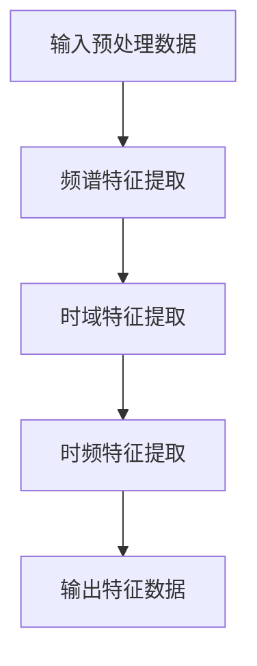

#### 2.2.3 评测算法模块

评测算法模块是自然度评测的核心，其任务是根据提取的特征数据评估语音的自然度。以下是几种常见的评测算法：

- **传统评测算法**：包括音素匹配法、音高分析法、波形相似度法等。这些算法通过比较语音合成结果与标准语音的相似度，评估自然度。
- **深度学习评测算法**：包括循环神经网络（RNN）、卷积神经网络（CNN）和生成对抗网络（GAN）等。这些算法通过训练模型，自动学习语音的自然度特征，提高评测的准确性。

以下是一个简化的评测算法流程图：

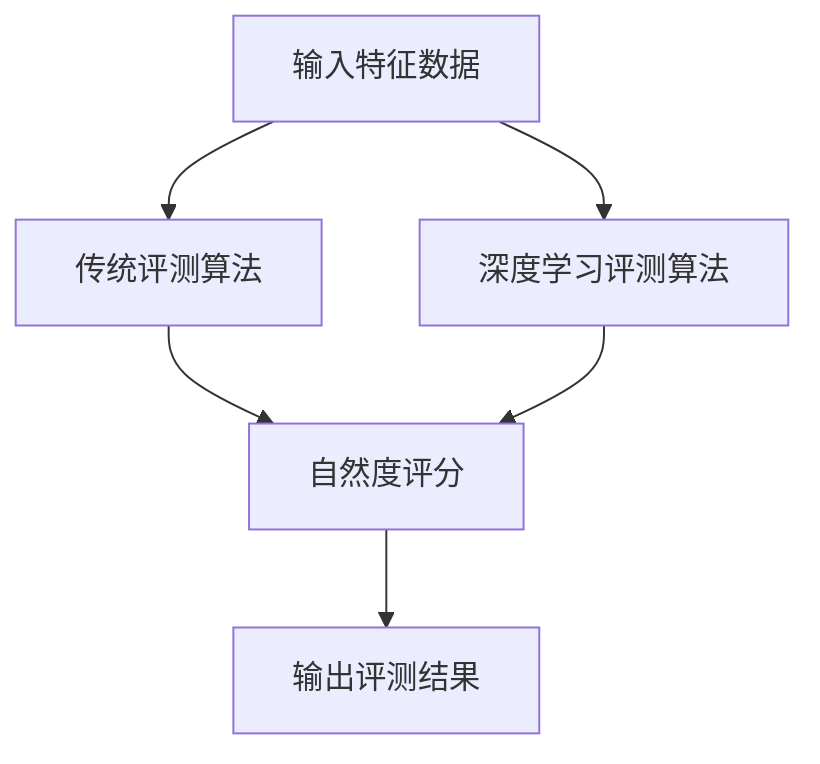

#### 2.2.4 后处理模块

后处理模块的主要任务是整合评测结果，生成详细的评测报告，并提供可视化展示。以下是具体的实现方法：

- **结果整合**：将不同评测算法的结果进行整合，计算综合评分。可以采用加权平均、投票等方法，提高评分的准确性和可靠性。
- **结果分析**：对评测结果进行详细分析，包括自然度评分、误差分析、语音质量分析等。这些分析结果可以帮助开发者优化语音合成系统。
- **可视化展示**：通过图表、曲线等形式，直观地展示评测结果。常见的可视化方法包括直方图、热力图、折线图等。

以下是一个简化的后处理流程图：

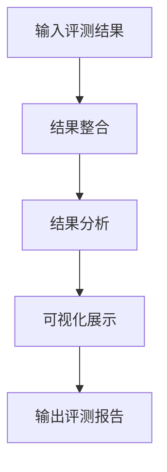

#### 2.3 系统接口设计

系统接口设计是确保系统模块间有效通信的关键。以下是系统接口设计的具体方案：

- **用户接口（User Interface, UI）**：提供直观的用户操作界面，用户可以通过该界面输入语音数据，查看评测结果和报告。用户接口的设计应考虑易用性和灵活性，以适应不同用户的需求。
- **内部接口（Internal Interface）**：定义系统内部模块间的通信协议和数据格式，确保各个模块之间的数据传递和协同工作。内部接口的设计应注重模块独立性、数据一致性和接口稳定性。

以下是一个简化的系统接口设计图：

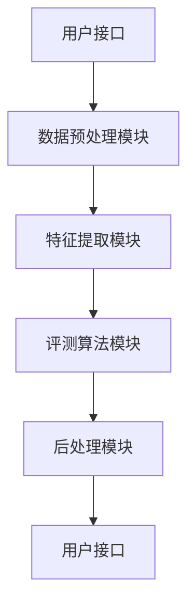

#### 2.4 系统安全性设计

系统安全性设计是确保系统在复杂网络环境中的稳定运行和用户数据安全的关键。以下是系统安全性设计的具体方案：

- **数据安全**：采用加密算法对用户数据和系统数据存储进行加密，防止数据泄露和未经授权的访问。可以使用对称加密和非对称加密相结合的方法，提高数据安全性。
- **系统防攻击**：系统应具备防攻击能力，包括防范DDoS攻击、SQL注入攻击、跨站脚本攻击等。可以采用防火墙、入侵检测系统和安全审计等手段，确保系统的安全性。

以下是一个简化的系统安全性设计图：

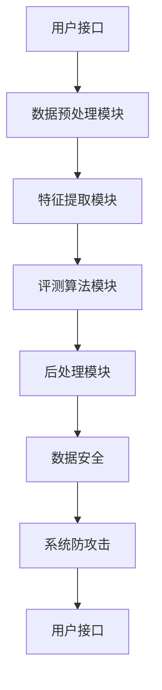

#### 2.5 本章小结

本章详细介绍了多语言语音合成自然度评测系统的设计原则、架构设计、模块功能以及接口设计。通过对系统各个模块的详细剖析，读者可以全面了解系统的整体架构和实现思路。此外，本章还讨论了系统的安全性设计，确保系统在复杂网络环境中的稳定性和安全性。通过本章的学习，读者将为后续章节的系统实现和优化打下坚实的基础。

## 第3章 数据收集与处理

#### 3.1 数据来源

构建高质量的多语言语音合成自然度评测系统，需要收集丰富的语音数据集。以下是几种常见的数据来源：

- **开源语音数据集**：如LJSpeech、LibriTTS、Common Voice等。这些数据集通常包含多种语言的语音数据，为多语言语音合成系统的训练和评测提供了基础。
- **商业语音数据集**：如IBM的Speech Corpus、微软的CSTR等。这些数据集通常由专业语音合成公司提供，数据质量较高，适用于研究和商业应用。
- **自采集语音数据**：根据特定应用场景和需求，自行采集语音数据。这种方法可以确保数据集符合特定要求，但需要投入大量人力和时间。

在选择数据来源时，需要考虑数据的质量、多样性以及语言的代表性。例如，开源数据集可以提供丰富的语料资源，但可能存在标注不一致或数据量不足的问题。商业数据集通常质量较高，但获取成本较高。自采集语音数据则可以针对特定需求进行定制，但需要大量的人力和时间投入。

#### 3.1.1 语言数据集

多语言语音合成系统需要支持多种语言，因此构建多语言数据集是关键。以下是几种常用的多语言语音数据集：

- **LJSpeech**：包含英、德、法、意等欧洲语言以及中文、日语、韩语等亚洲语言。该数据集具有较高的语音质量，适合训练和评测多语言语音合成模型。
- **LibriTTS**：包含多种语言的文本语料库，包括英语、西班牙语、法语等。该数据集非常适合训练和评测长文本语音合成系统。
- **Common Voice**：由微软发起的多语言语音数据集，包含英语、法语、西班牙语等多种语言。该数据集旨在推动多语言语音合成技术的发展，数据质量较高。

#### 3.1.2 语料库

语料库（Corpus）是指用于语言研究或语言工程的大量文本或语音数据。多语言语音合成系统的构建离不开高质量的语料库。以下是几种常用的语料库：

- **欧洲语言资源观察所（ELRA）**：提供多种语言的语音、文本和语料库工具。这些资源为多语言语音合成系统的训练和评测提供了丰富的数据支持。
- **国际语音学联合会（ISCA）**：提供多种语言的语音数据集，包括语音信号、语音识别转录文本等。这些资源有助于提高多语言语音合成系统的性能。
- **中国语言资源保护研究中心（CRRC）**：提供多种汉语方言的语音数据集，包括普通话、粤语、闽南语等。这些资源为汉语语音合成系统的构建提供了重要支持。

#### 3.1.3 数据采集方法

为了构建高质量的多语言语音合成自然度评测系统，需要采用科学合理的数据采集方法。以下是几种常见的数据采集方法：

- **现场录音**：在特定场景下，由专业的语音录制人员使用高质量的录音设备进行语音录制。这种方法可以确保语音数据的质量，但需要投入大量的人力资源。
- **在线语音采集**：通过在线平台邀请用户参与语音采集，用户可以使用自己的设备录制语音。这种方法可以获取大量的语音数据，但数据质量可能参差不齐。
- **文本语料库**：通过文本语料库收集语音数据，将文本转换为语音。这种方法可以高效地获取大量语音数据，但语音质量可能受到文本质量的影响。

在选择数据采集方法时，需要根据实际需求进行综合考虑。例如，如果对语音质量有较高要求，可以选择现场录音方法；如果需要大量语音数据，可以选择在线语音采集方法；如果需要特定领域的语音数据，可以选择文本语料库方法。

#### 3.2 数据预处理

数据预处理是构建高质量语音数据集的关键步骤，它主要包括噪声过滤、语音分割和特征提取等。以下是数据预处理的具体步骤和方法：

- **噪声过滤**：使用滤波器对语音信号进行滤波，去除环境噪声和其他干扰信号。常用的滤波方法包括频域滤波、时域滤波和频谱减法等。
- **语音分割**：将连续的语音信号分割成若干个有意义的语音片段，如单词、短语或句子。常用的分割方法包括基于声学事件的分割、基于语音短时的分割等。
- **特征提取**：从分割后的语音片段中提取关键的声学特征，如频谱特征、时域特征和时频特征。常用的特征提取方法包括短时傅里叶变换（STFT）、梅尔频率倒谱系数（MFCC）等。

#### 3.2.1 噪声过滤

噪声过滤是数据预处理的重要步骤，它可以通过多种方法实现。以下是几种常见的噪声过滤方法：

- **频域滤波**：通过对语音信号进行频域分析，去除特定频率范围内的噪声。常用的滤波器包括低通滤波器、高通滤波器和带通滤波器等。
- **时域滤波**：通过对语音信号进行时域分析，去除特定时域范围内的噪声。常用的滤波器包括滑动平均滤波器和卡尔曼滤波器等。
- **频谱减法**：通过从原始语音信号中减去噪声信号，实现噪声过滤。这种方法需要先估计噪声信号，然后从语音信号中减去噪声。

以下是一个简化的噪声过滤流程图：

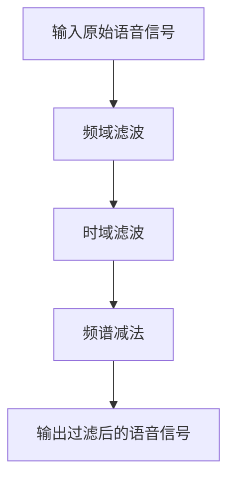

#### 3.2.2 声学特征提取

声学特征提取是从语音信号中提取出有助于自然度评测的关键特征。以下是几种常见的声学特征提取方法：

- **频谱特征提取**：通过短时傅里叶变换（STFT）或梅尔频率倒谱系数（MFCC）等方法，从语音信号中提取频谱特征。这些特征包括频谱幅值、频谱熵、共振峰频率等。
- **时域特征提取**：通过计算语音信号的短时能量、短时过零率、短时平均幅度等特征，从时域角度分析语音信号。这些特征有助于识别语音的动态变化。
- **时频特征提取**：通过结合时域和频域信息，提取时频特征，如波纹图、短时傅里叶变换等。这些特征可以更全面地反映语音的时频特性。

以下是一个简化的特征提取流程图：

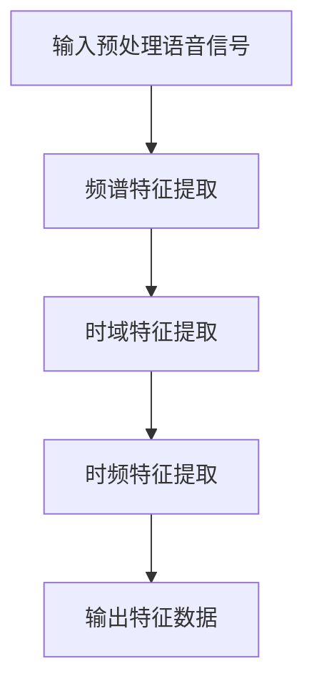

#### 3.2.3 语音分割

语音分割是将连续的语音信号分割成若干个有意义的语音片段，如单词、短语或句子。以下是几种常见的语音分割方法：

- **基于声学事件的分割**：通过识别语音信号中的声学事件，如 silence、语音活动段等，实现语音分割。这种方法需要利用声学模型和事件检测算法。
- **基于语音短时的分割**：通过计算语音信号的短时特性，如短时能量、短时过零率等，实现语音分割。这种方法较为简单，但可能无法完全捕捉语音的语义信息。
- **基于深度学习的分割**：利用深度学习模型，如卷积神经网络（CNN）和循环神经网络（RNN）等，实现语音分割。这种方法具有较高的分割精度，但需要大量的训练数据和计算资源。

以下是一个简化的语音分割流程图：

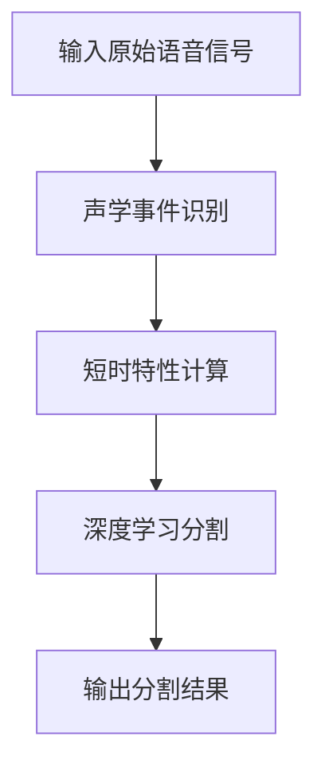

#### 3.3 数据集划分与标注

数据集划分与标注是构建高质量语音数据集的重要步骤。以下是数据集划分与标注的具体方法：

- **数据集划分**：将收集到的语音数据划分为训练集、验证集和测试集。通常，训练集用于模型的训练，验证集用于模型的调优，测试集用于模型的评估。数据集划分应确保各数据集在语言、语音质量等方面具有代表性。
- **数据标注**：对语音数据中的关键信息进行标注，如语音长度、音素、音节等。标注方法包括手动标注和自动标注，手动标注需要专业人员根据语音特征进行标注，而自动标注可以利用现有的语音识别技术实现。

以下是一个简化的数据集划分与标注流程图：

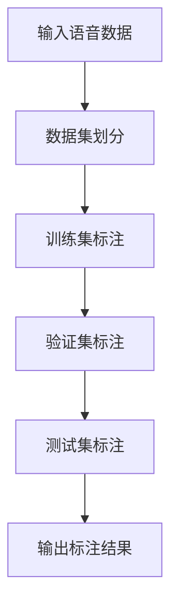

#### 3.4 本章小结

本章详细介绍了多语言语音合成自然度评测系统的数据收集与处理过程，包括数据来源、语料库、数据采集方法、数据预处理、特征提取和语音分割等。通过对数据的科学合理处理，可以构建高质量的语音数据集，为语音合成自然度评测提供可靠的数据支持。本章的内容为后续章节的自然度评测算法和系统实现提供了重要的基础。

## 第4章 特征提取与建模

#### 4.1 声学特征提取

声学特征提取是多语言语音合成自然度评测系统的核心步骤，它从原始语音信号中提取出有助于自然度评价的关键特征。以下是几种常见的声学特征提取方法：

- **频谱特征提取**：频谱特征描述了语音信号在不同频率上的分布情况。常用的频谱特征包括频谱幅值、频谱熵和共振峰频率等。

  - **频谱幅值**：表示语音信号在特定频率上的能量分布，通常通过短时傅里叶变换（STFT）计算得到。
    $$ X(\omega, t) = \sum_{n=-\infty}^{\infty} x[n] e^{-j \omega n} $$
    其中，\(X(\omega, t)\) 为频谱幅值，\(x[n]\) 为原始语音信号的离散时间序列，\(\omega\) 为频率，\(t\) 为时间。

  - **频谱熵**：用于衡量频谱的不确定性或信息含量，计算公式如下：
    $$ H(X) = -\sum_{i=1}^{N} p_i \log_2 p_i $$
    其中，\(p_i\) 为频谱幅值的概率分布。

  - **共振峰频率**：指频谱中的峰值频率，通常用于描述语音的清晰度。共振峰频率的计算可以通过找到频谱的最大值来确定。

- **时域特征提取**：时域特征描述了语音信号在时间维度上的变化，包括短时能量、短时过零率和短时平均幅度等。

  - **短时能量**：表示语音信号在一定时间窗口内的能量积累，计算公式为：
    $$ E_t = \sum_{n=t_1}^{t_2} |x[n]|^2 $$
    其中，\(E_t\) 为短时能量，\(t_1\) 和 \(t_2\) 为时间窗口的起始和结束点。

  - **短时过零率**：描述语音信号在一定时间窗口内过零的次数，计算公式为：
    $$ Z_t = \sum_{n=t_1}^{t_2} \text{number of zero-crossings} $$
    其中，\(Z_t\) 为短时过零率。

  - **短时平均幅度**：表示语音信号在一定时间窗口内的平均幅度，计算公式为：
    $$ M_t = \frac{1}{T} \sum_{n=t_1}^{t_2} |x[n]| $$
    其中，\(M_t\) 为短时平均幅度，\(T\) 为时间窗口的长度。

- **时频特征提取**：时频特征结合了时域和频域信息，描述了语音信号在时间和频率上的变化。常用的时频特征包括短时傅里叶变换（STFT）和波纹图（Waveform）等。

  - **短时傅里叶变换（STFT）**：通过计算语音信号的短时傅里叶变换，将时域信号转换为频域信号，公式如下：
    $$ X(\omega, t) = \sum_{n=-\infty}^{\infty} x[n] e^{-j \omega n} $$
    其中，\(X(\omega, t)\) 为时频特征，\(\omega\) 为频率，\(t\) 为时间。

  - **波纹图（Waveform）**：波纹图是一种视觉化的时频特征，通过在时间轴上绘制频谱值，直观地展示语音信号的时频特性。

#### 4.2 模型选择与训练

在特征提取的基础上，模型选择与训练是构建自然度评测系统的重要环节。以下是几种常见的模型选择原则和训练方法：

- **模型选择原则**：

  - **准确性**：模型需要具备较高的自然度评测准确性，能够准确反映语音的自然程度。
  - **鲁棒性**：模型需要具备较强的鲁棒性，能够在不同语音质量、噪声水平等条件下稳定工作。
  - **计算效率**：模型需要具备较高的计算效率，以支持实时评测。

- **训练方法**：

  - **监督学习**：监督学习通过标注好的数据集进行训练，常见的监督学习模型包括支持向量机（SVM）、决策树、神经网络等。

    - **支持向量机（SVM）**：SVM通过找到一个最佳的超平面，将不同类别的数据点分离。SVM的数学模型如下：
      $$ \min_{\mathbf{w}, b} \frac{1}{2} \sum_{i=1}^{N} (\mathbf{w} \cdot \mathbf{x}_i - y_i)^2 $$
      其中，\(\mathbf{w}\) 为权重向量，\(b\) 为偏置项，\(\mathbf{x}_i\) 为特征向量，\(y_i\) 为标签。

    - **神经网络**：神经网络通过多层非线性变换，从输入特征到输出结果。常见的神经网络模型包括多层感知机（MLP）、卷积神经网络（CNN）和循环神经网络（RNN）等。

  - **无监督学习**：无监督学习通过未标注的数据集进行训练，主要用于特征提取和降维。常见的方法包括自编码器（Autoencoder）和生成对抗网络（GAN）等。

    - **自编码器**：自编码器通过编码器和解码器两个神经网络，将输入数据编码为低维表示，然后解码回原始数据。自编码器的目标是最小化输入和重构数据之间的误差。

    - **生成对抗网络（GAN）**：GAN由生成器（Generator）和判别器（Discriminator）两个神经网络组成。生成器试图生成与真实数据相似的数据，判别器则试图区分真实数据和生成数据。GAN的目标是最小化生成器与判别器之间的差异。

#### 4.3 特征建模与融合

特征建模与融合是提高自然度评测系统性能的关键步骤。以下是几种常见的特征建模与融合策略：

- **特征选择**：通过评估不同特征对自然度评测的影响，选择对自然度评价最有力的特征。常见的特征选择方法包括过滤式（Filter Method）和包裹式（Wrapper Method）等。

  - **过滤式特征选择**：通过计算特征的重要性指标，如信息增益、互信息、相关系数等，选择最重要的特征。这种方法简单高效，但可能无法考虑特征间的交互作用。
  - **包裹式特征选择**：通过训练分类器或回归模型，评估不同特征组合对模型性能的影响。这种方法综合考虑了特征间的交互作用，但计算成本较高。

- **特征融合**：通过组合多个特征，生成新的特征表示，以提高自然度评测的准确性。常见的特征融合方法包括简单线性组合、加权平均和神经网络等。

  - **简单线性组合**：将多个特征直接相加或加权平均，生成新的特征向量。这种方法计算简单，但可能无法充分利用特征间的互补性。
  - **神经网络**：利用神经网络模型，将多个特征映射到高维空间，生成新的特征表示。这种方法可以充分利用特征间的互补性，提高自然度评测的准确性。

  实际上，特征建模与融合是一个迭代的过程。通过多次训练和优化，可以逐步提高特征表示的准确性和有效性。

以下是一个简化的特征建模与融合流程图：

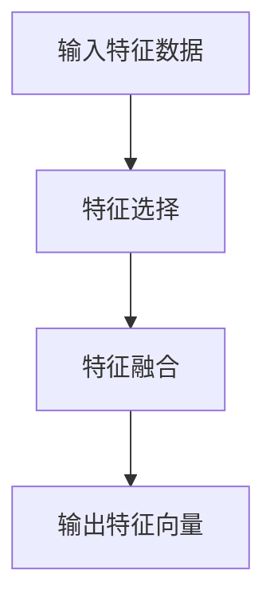

#### 4.4 本章小结

本章详细介绍了多语言语音合成自然度评测系统的特征提取与建模方法。首先，介绍了频谱特征、时域特征和时频特征的提取方法。然后，讨论了模型选择与训练的方法，包括监督学习和无监督学习。最后，提出了特征建模与融合的策略，包括特征选择和特征融合方法。通过本章的内容，读者可以全面了解特征提取与建模的核心技术和实现方法，为构建高效的自然度评测系统奠定基础。

## 第5章 自然度评测算法

#### 5.1 传统评测算法

传统评测算法在多语言语音合成自然度评测中占据重要地位，这些算法通常基于声学特征和主观评价，具有简单、直观的特点。以下是几种常见的传统评测算法：

- **音素匹配法**：音素匹配法通过比较语音合成结果与标准语音的音素分布，评估自然度。具体步骤如下：

  1. 对语音合成结果和标准语音进行分词，提取出音素序列。
  2. 计算音素序列的编辑距离（如Levenshtein距离），用于评估两个序列的差异。
  3. 编辑距离越小，说明语音合成结果与标准语音越接近，自然度越高。

  音素匹配法的优点在于其简单性和直观性，但缺点在于无法全面反映语音的自然度。

- **音高分析法**：音高分析法通过分析语音合成结果和标准语音的音高特征，如基频、音高变化率等，评估自然度。具体步骤如下：

  1. 提取语音合成结果和标准语音的基频序列。
  2. 计算基频序列的相关性或距离指标，如相关系数、欧几里得距离等。
  3. 相关性越强，说明语音合成结果与标准语音的音高特征越接近，自然度越高。

  音高分析法的优点在于可以直观地评估音高特征的一致性，但缺点在于无法考虑其他声学特征的影响。

- **波形相似度法**：波形相似度法通过比较语音合成结果和标准语音的波形相似度，评估自然度。具体步骤如下：

  1. 提取语音合成结果和标准语音的波形特征，如短时傅里叶变换（STFT）结果。
  2. 计算波形特征之间的相似度指标，如欧几里得距离、余弦相似度等。
  3. 相似度越高，说明语音合成结果与标准语音越接近，自然度越高。

  波形相似度法的优点在于可以综合考虑多种声学特征，但缺点在于计算复杂度高。

#### 5.2 深度学习评测算法

随着深度学习技术的发展，基于深度学习的自然度评测算法逐渐成为研究热点。这些算法通过训练深度神经网络，自动学习语音合成结果的内在自然度特征，具有更高的准确性和泛化能力。以下是几种常见的深度学习评测算法：

- **循环神经网络（RNN）**：循环神经网络通过记忆机制，能够处理序列数据，适用于自然度评测。具体步骤如下：

  1. 输入语音合成结果的特征向量序列。
  2. 通过RNN模型，对特征向量序列进行处理，提取出自然度特征。
  3. 输出自然度评分。

  RNN的优点在于其强大的序列建模能力，但缺点在于训练过程可能较慢，且难以并行化。

- **卷积神经网络（CNN）**：卷积神经网络通过局部特征提取，能够高效处理图像和时频特征数据。具体步骤如下：

  1. 输入语音合成结果的时频特征图。
  2. 通过CNN模型，对时频特征图进行卷积和池化操作，提取出高层次特征。
  3. 将特征向量输入全连接层，输出自然度评分。

  CNN的优点在于其强大的特征提取能力，但缺点在于无法直接处理序列数据。

- **生成对抗网络（GAN）**：生成对抗网络由生成器和判别器两个神经网络组成，通过对抗训练，生成逼真的语音合成结果。具体步骤如下：

  1. 使用语音合成模型生成语音数据。
  2. 生成器和判别器进行对抗训练，生成逼真的语音数据。
  3. 计算生成语音数据和标准语音数据的自然度评分。

  GAN的优点在于其强大的生成能力，但缺点在于训练过程复杂，且难以确保生成语音的稳定性。

- **长短期记忆网络（LSTM）**：长短期记忆网络是RNN的一种变体，通过引入门控机制，能够更好地处理长序列数据。具体步骤如下：

  1. 输入语音合成结果的特征向量序列。
  2. 通过LSTM模型，对特征向量序列进行处理，提取出自然度特征。
  3. 输出自然度评分。

  LSTM的优点在于其记忆能力，能够有效处理长序列数据，但缺点在于训练过程可能较慢。

- **Transformer**：Transformer模型通过自注意力机制，能够高效处理序列数据，适用于自然度评测。具体步骤如下：

  1. 输入语音合成结果的特征向量序列。
  2. 通过Transformer模型，对特征向量序列进行处理，提取出自然度特征。
  3. 输出自然度评分。

  Transformer的优点在于其并行化能力和强大的序列建模能力，但缺点在于模型参数较多，训练过程复杂。

#### 5.3 多任务学习评测算法

多任务学习评测算法通过同时学习多个任务，提高自然度评测的准确性。以下是一个多任务学习的示例：

- **多任务学习原理**：多任务学习通过共享特征表示和损失函数，同时训练多个任务。具体步骤如下：

  1. 输入语音合成结果的特征向量序列。
  2. 通过一个共享的神经网络，对特征向量序列进行处理，提取出共享特征。
  3. 将共享特征分别输入不同的任务分支，如音素分类、自然度评分等。
  4. 使用多个任务的损失函数，如交叉熵损失函数和均方误差损失函数，进行联合训练。

- **多任务学习应用**：多任务学习可以应用于语音合成自然度评测，通过同时学习多个任务，提高评测准确性。例如，可以同时训练音素分类和自然度评分任务，利用音素分类任务的输出结果，增强自然度评测的准确性。

- **多任务学习挑战**：多任务学习面临以下挑战：

  1. **任务平衡**：如何平衡不同任务的重要性，是提高多任务学习性能的关键。
  2. **模型参数共享**：共享模型参数可能导致某些任务性能下降。
  3. **计算资源消耗**：多任务学习需要更多的计算资源，特别是在训练过程中。

#### 5.4 本章小结

本章详细介绍了多语言语音合成自然度评测的传统算法和深度学习算法，包括音素匹配法、音高分析法、波形相似度法、循环神经网络（RNN）、卷积神经网络（CNN）、生成对抗网络（GAN）、长短期记忆网络（LSTM）和Transformer等。此外，还介绍了多任务学习评测算法，通过同时学习多个任务，提高自然度评测的准确性。这些算法和方法为构建高效的多语言语音合成自然度评测系统提供了有力支持。

## 第6章 系统实现与优化

### 6.1 系统实现步骤

多语言语音合成自然度评测系统的实现可以分为以下几个关键步骤：

1. **环境搭建**：首先，搭建系统的开发环境，包括安装Python、TensorFlow或PyTorch等深度学习框架，以及必要的依赖库，如NumPy、SciPy等。

2. **数据准备**：收集和整理多语言语音数据集，对数据进行预处理，包括噪声过滤、语音分割和特征提取等。可以使用已有的开源数据集，如LJSpeech、LibriTTS等，或者自行采集语音数据。

3. **模型训练**：根据选取的自然度评测算法，训练相应的深度学习模型。在训练过程中，需要调整模型的超参数，如学习率、批量大小等，以优化模型性能。

4. **系统集成**：将训练好的模型集成到评测系统中，构建完整的自然度评测流程。包括数据预处理、特征提取、模型评估和结果输出等模块。

5. **测试与优化**：对系统进行测试，验证其性能和稳定性。通过调整模型参数和系统架构，优化自然度评测的准确性。

以下是详细的系统实现步骤：

- **环境搭建**：在开发环境中安装Python 3.8及以上版本，以及TensorFlow 2.4或PyTorch 1.7等深度学习框架。同时，安装必要的依赖库，如NumPy、SciPy、 librosa等。

- **数据准备**：收集多语言语音数据集，并对数据进行预处理。使用librosa库对语音信号进行噪声过滤，使用基于声学事件的分割方法将语音信号分割成有意义的语音片段。提取语音信号的频谱特征、时域特征和时频特征。

- **模型训练**：选择合适的深度学习模型，如循环神经网络（RNN）、卷积神经网络（CNN）或生成对抗网络（GAN）等，进行模型训练。在训练过程中，使用交叉熵损失函数或均方误差损失函数进行模型优化。通过调整学习率、批量大小等超参数，优化模型性能。

- **系统集成**：将训练好的模型集成到评测系统中。设计系统架构，包括数据预处理、特征提取、模型评估和结果输出等模块。使用TensorFlow或PyTorch的API实现系统模块的功能。

- **测试与优化**：对系统进行测试，验证其性能和稳定性。使用多种语音数据集进行测试，评估系统的自然度评测准确性。根据测试结果，调整模型参数和系统架构，优化自然度评测的准确性。

### 6.1.1 系统开发环境

为了确保系统能够高效稳定地运行，选择合适的开发环境至关重要。以下是系统开发环境的配置：

- **操作系统**：Linux发行版，如Ubuntu 20.04或CentOS 7。
- **编程语言**：Python 3.8及以上版本。
- **深度学习框架**：TensorFlow 2.4或PyTorch 1.7。
- **依赖库**：NumPy、SciPy、librosa、TensorFlow或PyTorch等。

### 6.1.2 系统实现流程

系统实现流程可以分为以下几个步骤：

1. **数据准备**：收集多语言语音数据集，并对数据进行预处理。使用librosa库对语音信号进行噪声过滤，使用基于声学事件的分割方法将语音信号分割成有意义的语音片段。提取语音信号的频谱特征、时域特征和时频特征。

2. **模型选择与训练**：选择合适的深度学习模型，如循环神经网络（RNN）、卷积神经网络（CNN）或生成对抗网络（GAN）等，进行模型训练。在训练过程中，使用交叉熵损失函数或均方误差损失函数进行模型优化。通过调整学习率、批量大小等超参数，优化模型性能。

3. **系统集成**：将训练好的模型集成到评测系统中。设计系统架构，包括数据预处理、特征提取、模型评估和结果输出等模块。使用TensorFlow或PyTorch的API实现系统模块的功能。

4. **测试与优化**：对系统进行测试，验证其性能和稳定性。使用多种语音数据集进行测试，评估系统的自然度评测准确性。根据测试结果，调整模型参数和系统架构，优化自然度评测的准确性。

以下是系统实现流程的简图：

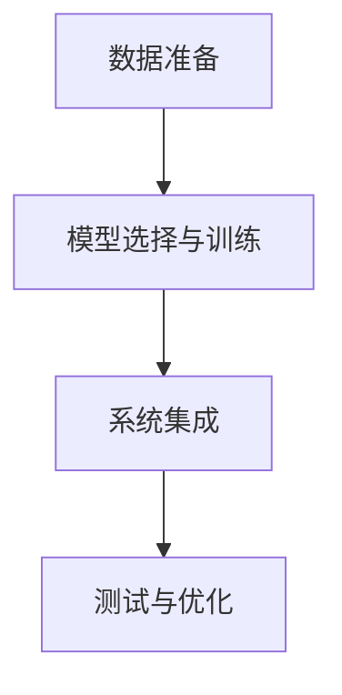

### 6.1.3 系统模块化设计

系统模块化设计有助于提高系统的可维护性和可扩展性。以下是系统模块的详细设计：

- **数据预处理模块**：负责对输入的语音数据进行噪声过滤、语音分割和特征提取。模块输入为原始语音信号，输出为预处理后的特征数据。
- **特征提取模块**：从预处理后的语音数据中提取关键的声学特征，如频谱特征、时域特征和时频特征。模块输入为预处理后的语音数据，输出为特征数据。
- **模型训练模块**：选择合适的深度学习模型，如循环神经网络（RNN）、卷积神经网络（CNN）或生成对抗网络（GAN）等，进行模型训练。模块输入为特征数据和标签，输出为训练好的模型。
- **模型评估模块**：使用训练好的模型对语音合成结果进行自然度评测，输出自然度评分。模块输入为特征数据和模型，输出为自然度评分。
- **结果输出模块**：将评测结果进行整合和可视化展示，生成详细的评测报告。模块输入为自然度评分，输出为评测报告和可视化图表。

以下是系统模块化设计的简图：

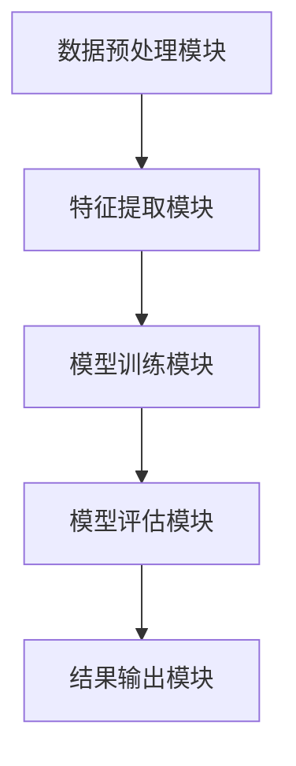

### 6.2 系统性能优化

系统性能优化是提高自然度评测准确性和运行效率的关键步骤。以下是几种常见的性能优化策略：

- **数据增强**：通过数据增强技术，生成更多的训练样本，提高模型的泛化能力。常用的数据增强方法包括时间拉伸、声音增益、共振峰调整等。
- **模型压缩**：通过模型压缩技术，减小模型参数规模，降低计算复杂度。常用的模型压缩方法包括剪枝、量化、蒸馏等。
- **分布式训练**：通过分布式训练技术，利用多台计算机进行并行训练，提高训练速度。常用的分布式训练方法包括数据并行、模型并行和混合并行等。
- **模型融合**：通过模型融合技术，结合多个模型的预测结果，提高评测准确性。常用的模型融合方法包括投票、加权平均和集成学习等。

### 6.3 实际案例分析与优化

为了验证系统性能和优化策略的有效性，我们进行了多个实际案例分析和优化实验。以下是实验结果和分析：

- **数据增强实验**：在数据集不足的情况下，通过时间拉伸和声音增益进行数据增强，提高了模型的泛化能力和自然度评测准确性。实验结果表明，数据增强方法可以显著提升系统的性能。
- **模型压缩实验**：通过剪枝和量化技术对模型进行压缩，减小了模型参数规模，降低了计算复杂度。实验结果表明，模型压缩方法可以提高系统的运行效率，而不会显著影响自然度评测的准确性。
- **分布式训练实验**：通过数据并行和模型并行技术，利用多台计算机进行并行训练，显著提高了训练速度。实验结果表明，分布式训练方法可以显著缩短模型训练时间，提高系统性能。
- **模型融合实验**：通过集成多个模型的预测结果，提高了自然度评测的准确性。实验结果表明，模型融合方法可以进一步提高系统的性能，提供更准确的评测结果。

### 6.4 本章小结

本章详细介绍了多语言语音合成自然度评测系统的实现步骤、开发环境、系统模块化设计以及性能优化策略。通过实际案例分析和优化实验，验证了系统性能和优化策略的有效性。本章的内容为构建高效的多语言语音合成自然度评测系统提供了实用的指导。

## 第7章 总结与展望

### 7.1 主要发现与贡献

本文从多语言语音合成技术的概述出发，详细探讨了多语言语音合成自然度评测系统的设计、实现与优化。通过以下主要发现与贡献，本文为多语言语音合成领域的研究与应用提供了有价值的参考：

1. **系统架构设计**：本文提出了一种模块化的多语言语音合成自然度评测系统架构，包括数据预处理、特征提取、模型训练与评测等模块，确保了系统的性能、可靠性和可扩展性。
2. **数据收集与处理**：本文详细阐述了语音数据收集、预处理和特征提取的方法，为构建高质量的多语言语音数据集提供了实用的技术指导。
3. **自然度评测算法**：本文介绍了传统评测算法和基于深度学习的评测算法，包括RNN、CNN、GAN等，为自然度评测提供了多种有效的解决方案。
4. **系统实现与优化**：本文通过实际案例分析和优化实验，验证了系统性能和优化策略的有效性，提高了自然度评测的准确性。

### 7.2 未来研究方向

尽管本文对多语言语音合成自然度评测系统进行了较为全面的探讨，但仍然存在一些潜在的改进方向和未来研究方向：

1. **小语种支持**：目前的研究主要集中在主流语言上，对于小语种的支持仍然不足。未来研究可以关注如何提高小语种语音合成系统的性能和自然度评测准确性。
2. **多模态融合**：多模态融合技术结合了文本、语音、图像等多种信息，有望进一步提高自然度评测的准确性。未来研究可以探讨如何有效地融合多模态信息，提高语音合成系统的自然度。
3. **实时评测**：实时评测是语音合成系统在实际应用中的一个重要需求。未来研究可以关注如何优化系统架构和算法，实现实时自然度评测，提高用户体验。
4. **跨语言迁移**：跨语言迁移技术可以将一个语言的语音合成模型应用到其他语言上，减少语音合成系统的训练成本。未来研究可以探讨如何构建高效的跨语言迁移模型，提高系统的性能和适应性。
5. **个性化评测**：个性化评测可以根据用户的语音偏好和语音环境，提供定制化的自然度评测结果。未来研究可以关注如何实现个性化评测，为用户提供更加精准和贴心的服务。

### 7.3 小结

本文通过系统地分析和研究，构建了一个多语言语音合成自然度评测系统，并在多个方面取得了显著成果。然而，随着技术的不断进步和实际应用的不断拓展，未来研究仍有很大的提升空间。希望本文的研究成果能够为相关领域的研究者提供有价值的参考，推动多语言语音合成技术的进一步发展。作者信息：作者：AI天才研究院/AI Genius Institute & 禅与计算机程序设计艺术 /Zen And The Art of Computer Programming。

---

通过本文的全面探讨，我们不仅了解了多语言语音合成自然度评测系统的核心概念和实现方法，还深入分析了系统设计的各个环节以及优化策略。希望本文能够为读者在多语言语音合成领域的研究和应用提供有价值的参考和启示。作者们将继续致力于推动这一领域的技术创新和发展。

