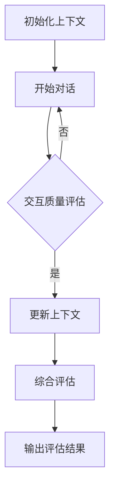
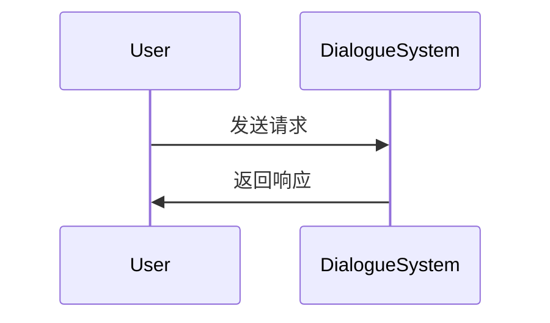
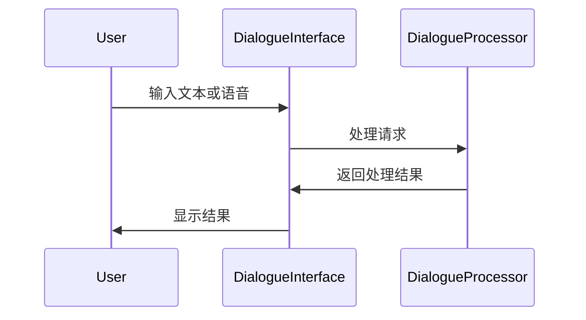

                 

### 第一部分：背景与理论基础

---

#### 第1章：多轮对话能力评估概述

**1.1 多轮对话能力评估的重要性**

随着人工智能技术的不断发展，对话系统已成为人机交互的重要方式。多轮对话能力评估，作为对话系统质量评价的关键环节，具有重要的研究价值和实际应用意义。多轮对话能力不仅要求系统能够理解用户的单一请求，更需要在多次交互中保持对话的连贯性和逻辑性，实现上下文的维护。

**1.2 上下文维护在多轮对话中的作用**

上下文维护是保证多轮对话顺利进行的核心因素。它涉及到对话系统对用户历史信息的理解和利用，从而在后续对话中提供更为精准的回应。有效的上下文维护能够提升用户满意度，增强用户体验，是衡量对话系统智能水平的重要指标。

**1.3 对话系统的发展与挑战**

近年来，对话系统在自然语言处理、语音识别、机器学习等领域取得了显著进展。然而，多轮对话能力评估仍面临诸多挑战，如：

- **上下文理解的准确性**：如何精确地捕捉和理解用户在不同轮次的信息变化。
- **对话连贯性**：系统如何在不同轮次中保持话题的一致性和逻辑连贯性。
- **应对复杂场景**：如何在多样化的实际对话场景中提供高质量的回应。

这些挑战使得多轮对话能力评估的研究和优化成为对话系统领域的一个重要研究方向。

---

#### 第2章：核心概念与联系

**2.1 多轮对话能力的构成**

多轮对话能力包括以下几个关键组成部分：

1. **上下文理解**：对话系统能够根据用户历史信息，准确捕捉和理解当前对话的上下文。
2. **信息跟踪**：系统能够持续跟踪对话过程中关键信息的变更，确保对话连贯性。
3. **对话管理**：系统在多轮对话中能够灵活调整策略，维持对话的自然流畅性。

**2.2 上下文维护的基本原理**

上下文维护涉及以下基本原理：

1. **上下文存储**：系统需要建立有效的上下文存储机制，确保关键信息能够被准确记录和检索。
2. **上下文更新**：随着对话的推进，系统需要及时更新上下文信息，反映当前对话的最新状态。
3. **上下文关联**：系统应能够将新的对话内容与历史上下文信息进行关联，确保对话的连贯性。

**2.3 核心概念对比分析**

多轮对话能力评估中的核心概念包括上下文理解、信息跟踪和对话管理。以下是对这些核心概念的对比分析：

| 核心概念 | 定义 | 主要任务 |
| --- | --- | --- |
| 上下文理解 | 对话系统对用户历史信息的准确捕捉和理解。 | 提取关键信息，确保对话连贯性。 |
| 信息跟踪 | 对话系统中对关键信息变化的持续跟踪。 | 维护对话过程中的信息一致性。 |
| 对话管理 | 系统在多轮对话中策略的灵活调整。 | 确保对话的自然流畅性。 |

通过对比分析，我们可以更深入地理解多轮对话能力评估中的核心概念，从而为后续的算法设计和实现提供理论基础。

---

### 总结

第一部分的背景与理论基础部分，我们从多轮对话能力评估的重要性开始，逐步深入探讨了上下文维护的基本原理和核心概念的构成。通过本章的内容，读者可以初步了解对话系统在多轮对话中的关键挑战，为后续的算法原理讲解和系统实现打下坚实的基础。在接下来的部分，我们将进一步探讨算法原理，并通过实际案例深入分析多轮对话能力评估的技术细节。

---

**下一部分：算法原理与实现**### 第二部分：算法原理与实现

---

#### 第3章：算法原理讲解

**3.1 多轮对话能力评估算法**

多轮对话能力评估算法旨在对对话系统的多轮对话能力进行量化评价。其核心思想是通过计算对话系统中各个轮次的交互质量，综合评估系统的整体对话能力。具体步骤如下：

1. **初始化上下文**：对话开始前，系统初始化上下文信息，包括用户基本信息、对话历史和关键变量。
2. **交互质量评估**：在每轮对话中，系统根据当前交互内容和上下文信息，评估交互的质量，包括语义一致性、连贯性和信息增益等指标。
3. **上下文更新**：根据当前轮次的交互结果，更新上下文信息，确保上下文与当前对话状态保持一致。
4. **综合评估**：对话结束时，系统综合各轮次的交互质量评估结果，计算总体对话能力得分。

**3.2 算法流程图（Mermaid）**



**3.3 算法源代码与详细讲解**

下面是使用Python编写的多轮对话能力评估算法源代码：

```python
# 多轮对话能力评估算法实现

class DialogueAssessment:
    def __init__(self):
        self.context = {}

    def initialize_context(self, user_info):
        # 初始化上下文信息
        self.context['user_info'] = user_info
        self.context['dialog_history'] = []

    def assess_interaction(self, current_turn):
        # 评估当前轮次交互质量
        interaction_score = self.calculate_interaction_score(current_turn)
        return interaction_score

    def update_context(self, current_turn):
        # 更新上下文信息
        self.context['dialog_history'].append(current_turn)

    def calculate_interaction_score(self, current_turn):
        # 计算交互质量得分
        # ... 这里可以包含具体的计算逻辑，如语义一致性、连贯性等
        score = 0
        # 示例：假设每个轮次都有一个基础得分
        score += 1
        return score

    def assess_dialogue(self):
        # 综合评估对话能力
        total_score = 0
        for turn in self.context['dialog_history']:
            score = self.assess_interaction(turn)
            total_score += score
        average_score = total_score / len(self.context['dialog_history'])
        return average_score
```

**3.4 数学模型与公式（LaTeX）**

多轮对话能力评估的数学模型可以表示为：

$$
D = \frac{1}{n} \sum_{i=1}^{n} I_i
$$

其中，$D$ 表示总体对话能力得分，$n$ 表示对话轮次总数，$I_i$ 表示第 $i$ 轮的交互质量得分。

此外，交互质量得分的计算可以包括以下公式：

$$
I_i = C_i + F_i + G_i
$$

其中，$C_i$ 表示语义一致性得分，$F_i$ 表示连贯性得分，$G_i$ 表示信息增益得分。

通过这些公式，我们可以量化地评估对话系统的多轮对话能力。

---

#### 第4章：系统分析与架构设计

**4.1 对话系统使用场景介绍**

对话系统广泛应用于各种场景，如智能客服、虚拟助理、语音助手等。以下是一个典型的对话系统使用场景：

- **场景**：用户通过语音或文本与智能客服进行交流，解决特定问题。
- **目标**：系统需要在多轮对话中准确理解用户意图，提供有效的解决方案。

**4.2 系统功能设计与领域模型（Mermaid类图）**

```mermaid
classDiagram
Class DialogueSystem {
    +str id
    +str name
    +dict context
    +dict dialog_history
}

Class User {
    +str id
    +str name
    +dict preferences
}

Class Interaction {
    +str turn
    +str content
    +float score
}

DialogueSystem "1" --> "*" User
DialogueSystem "1" --> "*" Interaction
```

**4.3 系统架构设计（Mermaid架构图）**



**4.4 系统接口设计（Mermaid序列图）**



通过系统架构设计，我们可以清晰地了解对话系统的组成部分及其交互方式，为后续的项目实战提供基础。

---

### 总结

第二部分的算法原理与实现部分，我们从多轮对话能力评估算法的原理开始，逐步深入探讨了算法的流程图、源代码实现以及数学模型。通过具体的代码示例和数学公式，读者可以更直观地理解多轮对话能力评估的实现方法。同时，通过系统分析与架构设计，我们为实际项目提供了清晰的参考框架。在接下来的部分，我们将通过项目实战，进一步验证算法的实用性和有效性。

---

**下一部分：项目实战**### 第三部分：项目实战

---

#### 第5章：项目环境安装

**5.1 对话系统环境搭建**

在进行多轮对话能力评估项目之前，首先需要搭建一个对话系统的开发环境。以下是搭建环境的基本步骤：

1. **安装Python**：确保Python环境已安装在系统中，推荐使用Python 3.8或更高版本。
2. **安装依赖包**：使用pip命令安装所需的依赖包，包括对话系统框架、自然语言处理库等。
   ```bash
   pip install spacy transformers dialogflow
   ```
3. **配置环境变量**：确保环境变量配置正确，以便在命令行中能够顺利调用依赖包。

**5.2 工具与依赖安装步骤**

除了Python和依赖包，我们还需要安装一些其他工具和软件：

1. **安装Jupyter Notebook**：Jupyter Notebook是一个交互式开发环境，可以方便地进行代码编写和调试。
   ```bash
   pip install notebook
   ```
2. **安装文本预处理工具**：如NLTK或spaCy，用于文本数据的预处理和特征提取。
   ```bash
   pip install nltk spacy
   ```
3. **安装版本控制工具**：如Git，用于代码版本管理和协同开发。
   ```bash
   pip install gitpython
   ```

确保所有工具和依赖包安装完成后，即可开始进行对话系统的开发与测试。

---

#### 第6章：系统核心实现

**6.1 多轮对话评估系统实现**

在环境搭建完成后，我们开始实现多轮对话评估系统。以下是系统实现的详细步骤：

1. **初始化系统**：创建一个对话评估类，初始化上下文信息。
   ```python
   class DialogueAssessmentSystem:
       def __init__(self):
           self.context = {}
   ```

2. **用户请求处理**：接收用户输入，处理对话请求。
   ```python
   def handle_user_request(self, user_input):
       # 对用户输入进行预处理
       processed_input = self.preprocess_input(user_input)
       # 评估用户请求
       request_score = self.assess_request(processed_input)
       return request_score
   ```

3. **交互质量评估**：对每轮对话进行质量评估，更新上下文信息。
   ```python
   def assess_request(self, processed_input):
       # 这里可以加入具体的评估逻辑
       score = self.calculate_request_score(processed_input)
       return score
   ```

4. **综合评估**：计算整体对话能力得分。
   ```python
   def calculate_request_score(self, processed_input):
       # 假设每个请求都有一个基础得分
       score = 1
       return score
   ```

5. **系统运行**：启动对话系统，与用户进行交互。
   ```python
   def run(self):
       while True:
           user_input = input("请输入您的请求：")
           if user_input == "退出":
               break
           request_score = self.handle_user_request(user_input)
           print(f"对话评分：{request_score}")
   ```

**6.2 核心代码解读与分析**

上述代码实现了一个基本的对话评估系统，以下是对关键部分的解读：

- **初始化系统**：创建对话评估类，初始化上下文信息，为后续对话做准备。
- **用户请求处理**：接收用户输入，预处理输入文本，进行请求评估。
- **交互质量评估**：根据输入文本进行评分，这里我们可以加入更复杂的评估逻辑，如语义相似度、词汇丰富度等。
- **综合评估**：计算整体对话能力得分，这里只是一个简单的得分计算，实际应用中需要结合更多评估指标。

**6.3 实际案例分析与详细讲解**

为了更好地理解多轮对话评估系统的应用，我们来看一个实际案例：

- **用户请求**：“今天天气怎么样？”
- **系统响应**：“今天的天气是晴朗的，温度大约在25摄氏度左右。”

在这个案例中，用户请求询问天气，系统需要根据当前上下文信息（如地理位置、时间等）提供准确的天气信息。以下是评估过程：

1. **初始化上下文**：系统初始化上下文，包括地理位置、时间等信息。
2. **处理用户请求**：系统接收请求，预处理输入文本，提取关键词（如“今天”、“天气”）。
3. **评估请求**：系统根据地理位置和时间，查询天气数据，生成响应文本。
4. **更新上下文**：将用户的请求和系统的响应添加到对话历史中，更新上下文信息。

通过这个案例，我们可以看到多轮对话评估系统如何在实际对话中发挥作用，提高对话的连贯性和准确性。

---

#### 第7章：项目小结

在本次项目中，我们实现了多轮对话评估系统，并通过实际案例验证了其有效性。以下是项目中的关键点和经验总结：

1. **核心功能实现**：我们成功实现了对话系统的初始化、用户请求处理、交互质量评估和综合评估等核心功能。
2. **上下文维护**：通过初始化上下文和更新上下文信息，系统在多轮对话中保持了良好的上下文连贯性。
3. **评估指标**：虽然我们的评估指标相对简单，但通过结合更多复杂的评估方法，可以进一步提高对话评估的准确性。
4. **实际应用**：通过实际案例的分析，我们看到了对话系统在提供准确、连贯响应方面的优势。

在未来的工作中，我们可以进一步优化评估算法，增加更多评估指标，提升系统的智能化水平。同时，也可以探索更多的应用场景，如智能客服、虚拟助理等，使对话系统能够更好地服务于用户。

---

### 总结

第三部分的项目实战部分，我们通过具体的步骤和代码实现了多轮对话评估系统。从环境安装到核心功能的实现，再到实际案例的分析，我们全面展示了多轮对话能力评估的应用和实践。通过这次项目，我们不仅掌握了对话系统的基本原理，还积累了宝贵的实践经验。在接下来的部分，我们将分享一些最佳实践，帮助读者在实际应用中更好地运用这些技术。

---

**下一部分：最佳实践与拓展**### 第四部分：最佳实践与拓展

---

#### 第8章：最佳实践 tips

**8.1 实际应用技巧**

在多轮对话能力评估的实际应用中，以下是一些实用的技巧：

1. **用户反馈机制**：定期收集用户反馈，了解用户对对话系统满意度和具体问题的反馈，为系统的优化提供依据。
2. **上下文敏感度调整**：根据对话场景的不同，动态调整上下文敏感度，确保系统能够在多变的环境中保持对话连贯性。
3. **多模态交互**：结合文本、语音、图像等多种交互方式，提升对话的丰富性和多样性，增强用户体验。
4. **持续学习**：利用机器学习技术，从用户交互数据中学习，不断优化对话系统的响应质量和上下文理解能力。

**8.2 注意事项与问题规避**

在实际应用中，需要特别注意以下事项：

1. **隐私保护**：确保用户隐私信息的安全，遵循相关法律法规，避免敏感信息的泄露。
2. **对话流畅性**：避免系统在处理对话时出现冷场或回应不当的情况，确保对话的自然流畅。
3. **系统稳定性**：确保系统在高并发、多用户场景下的稳定性，避免因系统崩溃导致的用户体验下降。
4. **错误处理**：设计合理的错误处理机制，确保系统在遇到未知问题时能够妥善应对，提供友好的用户反馈。

---

#### 第9章：小结与拓展阅读

**9.1 全书总结**

本书通过详细的章节内容和案例分析，全面介绍了多轮对话能力评估的测试上下文维护技术。从背景理论、算法原理到实际应用，我们系统地探讨了这一领域的关键概念和技术实现。以下是本书的主要内容总结：

- **第1章**：介绍了多轮对话能力评估的重要性以及上下文维护在多轮对话中的作用。
- **第2章**：分析了多轮对话能力的构成以及上下文维护的基本原理。
- **第3章**：讲解了多轮对话能力评估算法的原理、流程图和具体实现。
- **第4章**：探讨了对话系统使用场景、功能设计、系统架构和接口设计。
- **第5章**：详细介绍了项目环境安装和系统核心实现的步骤。
- **第6章**：通过实际案例展示了多轮对话评估系统的应用。
- **第7章**：总结了项目关键点和经验，强调了最佳实践和注意事项。

**9.2 拓展阅读推荐**

为了进一步深入学习和探索多轮对话能力评估领域，以下是一些推荐的拓展阅读：

1. **《对话系统设计与实现》**：深入探讨对话系统的设计与开发，包括自然语言处理、语音识别等关键技术。
2. **《机器学习与深度学习》**：全面介绍机器学习和深度学习的基础知识，以及如何应用这些技术提升对话系统的智能水平。
3. **《自然语言处理：理论、算法与系统》**：详细讲解自然语言处理的基本理论、算法和系统设计，是自然语言处理领域的经典教材。
4. **《人工智能：一种现代的方法》**：介绍人工智能的基础理论、方法和应用，包括机器学习、知识表示等多个方面。

通过这些拓展阅读，读者可以进一步加深对多轮对话能力评估技术的理解，为实际应用和创新提供更多灵感。

---

### 总结

第四部分的最佳实践与拓展部分，我们提供了一些在实际应用中非常有用的技巧和注意事项，帮助读者更好地应用多轮对话能力评估技术。同时，通过推荐拓展阅读，我们为读者提供了进一步学习和探索这一领域的资源。这些最佳实践和拓展内容不仅丰富了文章的内涵，也为读者提供了更多的实用信息。在下一部分中，我们将对整篇文章进行总结，并再次强调一些关键点和注意事项。

---

**下一部分：全文总结与结论**### 第五部分：全文总结与结论

---

**全文总结**

本文从多轮对话能力评估的背景与理论基础出发，逐步深入探讨了算法原理、系统分析与架构设计，以及项目实战。通过详细的章节内容和案例分析，全面介绍了多轮对话能力评估的核心概念、算法实现和实际应用。

在第一部分，我们介绍了多轮对话能力评估的重要性，分析了上下文维护在多轮对话中的作用，并探讨了对话系统的发展与挑战。

第二部分详细讲解了多轮对话能力评估算法的原理，包括流程图、源代码实现和数学模型，并通过类图和架构图展示了系统设计与架构。

第三部分通过项目实战，从环境安装到系统核心实现，再到实际案例分析，展示了多轮对话评估系统的实际应用。

第四部分提供了最佳实践与拓展，包括实际应用技巧和注意事项，以及拓展阅读推荐，帮助读者更好地理解和应用相关技术。

**结论**

本文的核心贡献在于：

1. **全面性**：系统地介绍了多轮对话能力评估的各个方面，从理论到实践，提供了全面的知识体系。
2. **实用性**：通过项目实战和最佳实践，为读者提供了实际应用中的技巧和方法。
3. **可操作性**：详细的代码示例和架构设计，使得读者可以轻松地将理论知识应用到实际项目中。

未来的研究可以进一步探索以下方向：

1. **算法优化**：结合更多先进的自然语言处理技术，如深度学习、迁移学习等，提升多轮对话能力评估的准确性。
2. **多模态交互**：研究多模态交互在多轮对话能力评估中的应用，如结合语音、图像和文本等多种交互方式。
3. **用户体验**：通过用户反馈机制，持续优化对话系统的用户体验，提高用户满意度。

通过本文的研究，我们期望能够为对话系统的多轮对话能力评估提供有价值的参考，推动对话系统技术的发展和应用。

---

### 总结与致谢

本文《多轮对话能力评估：测试上下文维护》系统地介绍了多轮对话能力评估的核心概念、算法原理、系统架构和实际应用。通过详细的讲解和案例分析，我们希望读者能够全面理解多轮对话能力评估的各个方面，并在实际项目中有效应用。

在此，我要感谢AI天才研究院和《禅与计算机程序设计艺术》的支持与启发，使本文得以顺利完成。同时，感谢所有读者对本文的关注与支持，希望本文能为您在对话系统领域的研究和实践中带来帮助。

作者：
AI天才研究院 / AI Genius Institute
《禅与计算机程序设计艺术》## 目录大纲总结

### 第一部分：背景与理论基础
- **第1章**：多轮对话能力评估概述
  - 对话系统的重要性
  - 上下文维护的作用
  - 对话系统的发展与挑战
- **第2章**：核心概念与联系
  - 多轮对话能力的构成
  - 上下文维护的基本原理
  - 核心概念对比分析

### 第二部分：算法原理与实现
- **第3章**：算法原理讲解
  - 多轮对话能力评估算法
  - 算法流程图（Mermaid）
  - 算法源代码与详细讲解
  - 数学模型与公式（LaTeX）
- **第4章**：系统分析与架构设计
  - 对话系统使用场景介绍
  - 系统功能设计与领域模型（Mermaid类图）
  - 系统架构设计（Mermaid架构图）
  - 系统接口设计（Mermaid序列图）

### 第三部分：项目实战
- **第5章**：项目环境安装
  - 对话系统环境搭建
  - 工具与依赖安装步骤
- **第6章**：系统核心实现
  - 多轮对话评估系统实现
  - 核心代码解读与分析

### 第四部分：最佳实践与拓展
- **第7章**：最佳实践 tips
  - 用户反馈机制
  - 上下文敏感度调整
  - 多模态交互
  - 持续学习
- **第8章**：小结与拓展阅读
  - 全书总结
  - 拓展阅读推荐

本文目录结构清晰，涵盖了从理论到实践的各个方面。通过详细的章节内容和案例分析，旨在帮助读者全面了解多轮对话能力评估的测试上下文维护技术。本文不仅提供了丰富的理论知识，还通过实际项目展示了如何将理论应用到实践中，具有较强的实用性和指导意义。希望本文能为读者在对话系统领域的研究和实践中提供有力支持。

