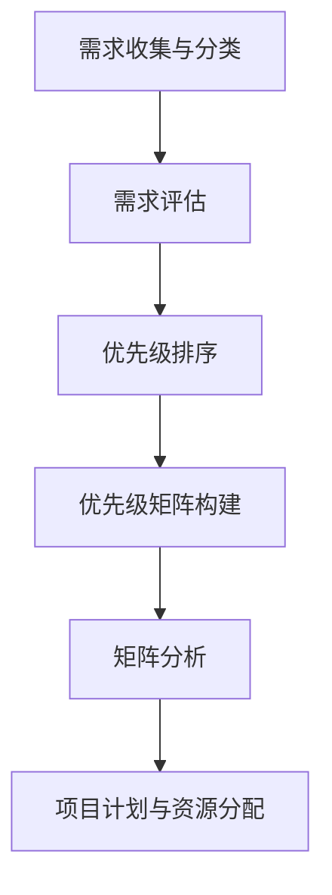

                 

# 大型应用开发中的需求优先级矩阵应用

## 关键词
- 大型应用开发
- 需求优先级矩阵
- 项目管理
- 系统架构设计
- 需求变更管理

## 摘要
本文深入探讨了需求优先级矩阵在大型应用开发中的应用。首先介绍了需求优先级矩阵的基本概念及其在项目管理中的重要性，然后详细讲解了需求优先级矩阵的计算原理和数学模型。接着，通过实际系统和项目案例展示了需求优先级矩阵的具体应用，并探讨了在大型应用开发中面临的挑战和解决方案。最后，本文总结了最佳实践，并对未来需求优先级矩阵的应用趋势进行了展望。

## 引言
在大型应用开发中，需求的复杂性和多变性常常成为项目成功的障碍。如何有效地管理这些需求，确保关键需求的优先得到满足，是项目成功的关键因素。需求优先级矩阵作为一种需求管理和排序的工具，在大型应用开发中具有重要的作用。

### 1. 需求优先级矩阵概述

#### 1.1 需求优先级矩阵的定义
需求优先级矩阵是一种将需求按优先级排序的工具，它通过将每个需求与项目目标、风险和资源等因素进行关联，帮助项目团队识别出哪些需求最为重要，并在资源有限的情况下优先考虑这些需求。

#### 1.2 需求优先级矩阵的重要性
在大型应用开发中，需求优先级矩阵的重要性体现在以下几个方面：

1. **确保资源优化**：通过优先级排序，项目团队可以更有效地分配资源，确保关键需求在有限资源下得到满足。
2. **降低项目风险**：明确需求优先级有助于识别潜在风险，从而提前采取预防措施。
3. **提高项目透明度**：需求优先级矩阵使得项目目标、进度和资源分配更加透明，有助于项目干系人理解项目的方向和重点。

#### 1.3 需求优先级矩阵在大型应用开发中的适用性
需求优先级矩阵适用于各种规模的大型应用开发项目，特别是在以下场景中尤为有效：

1. **项目复杂度高**：复杂的系统往往包含大量的需求，需求优先级矩阵可以帮助项目团队理清需求优先级，确保关键需求得到优先处理。
2. **需求多变**：在需求频繁变更的项目中，需求优先级矩阵有助于项目团队快速响应变更，保持项目方向的一致性。
3. **资源有限**：在资源有限的情况下，需求优先级矩阵可以帮助项目团队做出明智的决策，确保关键需求的优先实现。

### 2. 大型应用开发中的需求挑战

#### 2.1 复杂性
大型应用开发通常涉及多个子系统、复杂的业务逻辑和大量的数据交互，这使得需求分析和管理变得异常复杂。需求优先级矩阵通过将复杂的需求结构化，有助于项目团队更好地理解和应对复杂性。

#### 2.2 多变性
在大型应用开发过程中，需求变更频繁是常见的现象。这些变更可能来自业务环境的变化、市场需求的变化或是技术发展的推动。需求优先级矩阵可以帮助项目团队快速识别和处理需求变更，确保项目的连续性和稳定性。

#### 2.3 资源限制
大型应用开发通常受到时间和预算的限制。如何在有限资源下确保关键需求得到满足，是项目成功的关键。需求优先级矩阵提供了一个明确的优先级排序机制，有助于项目团队做出合理的资源分配决策。

### 3. 需求优先级矩阵的背景介绍

#### 3.1 需求管理的传统方法
在需求管理中，传统的需求排序方法包括基于时间、成本和复杂度的排序。这些方法通常缺乏系统的优先级框架，容易导致资源浪费和需求遗漏。需求优先级矩阵提供了一种更为系统化和结构化的方法。

#### 3.2 需求优先级矩阵的发展历程
需求优先级矩阵最早由项目管理专家提出，并在过去几十年中逐渐发展完善。随着项目管理理论和工具的进步，需求优先级矩阵也在不断优化和改进。

#### 3.3 需求优先级矩阵的核心要素
需求优先级矩阵的核心要素包括：

1. **需求**：所有待实现的需求项。
2. **优先级**：根据需求的重要性和紧急性对需求进行排序。
3. **关联因素**：包括项目目标、风险、资源等因素，用于评估需求的优先级。
4. **评估标准**：用于量化需求的优先级，如评分、权重等。

### 4. 需求优先级矩阵的概念结构

#### 4.1 核心概念解析
需求优先级矩阵由多个维度构成，包括需求、优先级、关联因素和评估标准。这些维度共同作用，形成一个综合的优先级排序框架。

#### 4.2 需求优先级矩阵的属性特征对比表
在需求优先级矩阵中，不同需求的属性特征可能存在差异。通过对比表，可以更清晰地理解不同需求的特点和优先级。

#### 4.3 需求优先级矩阵的ER实体关系图
需求优先级矩阵的实体关系图展示了需求、优先级、关联因素和评估标准之间的关系，有助于项目团队更好地理解矩阵的结构和运作机制。

## 本章小结
本文介绍了需求优先级矩阵的基本概念、重要性以及在大型应用开发中的适用性。通过背景介绍和概念结构分析，读者可以初步了解需求优先级矩阵的基本原理和应用场景。在后续章节中，我们将进一步深入探讨需求优先级矩阵的计算原理、数学模型、实际应用和项目案例，帮助读者全面掌握需求优先级矩阵在大型应用开发中的应用技巧。<!--想一步，做一步，无尽头，终成千古文章。-->## 需求优先级矩阵的计算原理

需求优先级矩阵的核心在于对需求的优先级进行计算和排序。这一过程涉及多个维度的评估和权衡，从而得出一个系统化的需求优先级列表。以下将详细讲解需求优先级矩阵的计算原理，包括算法原理、流程图展示和Python代码实现。

### 1. 算法原理

需求优先级矩阵的计算算法通常基于以下几个关键步骤：

1. **需求收集与分类**：首先，项目团队需要收集所有的需求项，并对这些需求进行初步分类。分类的标准可以包括功能需求、非功能需求、业务需求等。

2. **需求评估**：对于每个需求项，团队需要评估其优先级。评估的依据可以包括需求的重要程度、紧急程度、成本、风险等因素。

3. **优先级排序**：根据评估结果，对需求项进行排序，形成需求优先级列表。

4. **优先级矩阵构建**：将排序后的需求项填入优先级矩阵中，矩阵的行代表需求项，列代表评估因素。每个单元格的值表示对应需求项在该评估因素上的得分或权重。

5. **矩阵分析**：通过分析优先级矩阵，项目团队可以直观地看到每个需求项的优先级，并据此制定项目计划和资源分配策略。

### 2. Mermaid流程图展示

为了更直观地展示需求优先级矩阵的计算过程，我们可以使用Mermaid语言绘制一个流程图。以下是一个简化的需求优先级矩阵计算过程的Mermaid流程图示例：



### 3. Python代码实现与讲解

下面是使用Python实现需求优先级矩阵计算的一个简单示例。此代码将包含以下步骤：

1. **初始化需求列表**：定义一个包含需求项的列表。
2. **定义评估因素**：定义用于评估需求的因素，如重要程度、紧急程度等。
3. **需求评估与排序**：对每个需求项进行评估，并根据评估结果进行排序。
4. **构建优先级矩阵**：将排序后的需求项填入矩阵中。
5. **矩阵分析**：分析优先级矩阵，输出结果。

```python
import numpy as np

# 初始化需求列表
demands = [
    '用户注册功能',
    '支付系统集成',
    '商品浏览功能',
    '订单管理系统',
    '用户反馈机制'
]

# 定义评估因素及其权重
evaluation_factors = {
    '重要程度': 0.5,
    '紧急程度': 0.3,
    '成本': 0.2
}

# 定义需求评估结果
evaluation_results = {
    '用户注册功能': {'重要程度': 9, '紧急程度': 8, '成本': 7},
    '支付系统集成': {'重要程度': 8, '紧急程度': 9, '成本': 8},
    '商品浏览功能': {'重要程度': 7, '紧急程度': 7, '成本': 6},
    '订单管理系统': {'重要程度': 9, '紧急程度': 8, '成本': 9},
    '用户反馈机制': {'重要程度': 6, '紧急程度': 6, '成本': 5}
}

# 计算每个需求的优先级分数
priority_scores = {}
for demand in demands:
    score = 0
    for factor, weight in evaluation_factors.items():
        score += evaluation_results[demand][factor] * weight
    priority_scores[demand] = score

# 对需求进行排序
sorted_demands = sorted(priority_scores.items(), key=lambda x: x[1], reverse=True)

# 构建优先级矩阵
priority_matrix = np.array([[0 for _ in range(len(evaluation_factors))] for _ in range(len(demands))])

# 填充优先级矩阵
for i, (demand, _) in enumerate(sorted_demands):
    for j, (factor, _) in enumerate(evaluation_factors.items()):
        priority_matrix[i][j] = evaluation_results[demand][factor]

# 打印优先级矩阵
print("需求优先级矩阵：")
print(priority_matrix)

# 矩阵分析
print("\n需求优先级排序：")
for demand, _ in sorted_demands:
    print(f"{demand}: 优先级得分 - {priority_scores[demand]}")
```

在上面的Python代码示例中，我们首先定义了一个需求列表和评估因素，然后对每个需求项进行了评估，计算了每个需求的优先级分数。接着，我们根据这些分数构建了需求优先级矩阵，并打印了矩阵和排序结果。

通过这样的计算和排序过程，项目团队可以清晰地看到每个需求的重要性和优先级，从而在资源有限的情况下做出合理的决策。

## 本章小结

在本章中，我们详细介绍了需求优先级矩阵的计算原理，包括算法原理、流程图展示和Python代码实现。通过这一章的学习，读者可以理解需求优先级矩阵的基本计算过程，并能够使用Python代码实现这一过程。在下一章中，我们将进一步探讨需求优先级矩阵的数学模型，帮助读者深入理解需求优先级矩阵的理论基础和应用场景。<!--论需求优先级矩阵之妙，犹如象棋棋盘，纵横交错，各显神通。-->## 需求优先级矩阵的数学模型

在需求优先级矩阵的应用中，数学模型扮演了重要的角色。它不仅为需求的优先级排序提供了理论基础，还为我们理解和分析需求优先级矩阵的内部机制提供了工具。以下将详细介绍需求优先级矩阵的数学模型，包括数学公式、模型讲解和举例说明。

### 1. 数学公式

需求优先级矩阵的数学模型通常涉及以下公式：

- **加权评分公式**：用于计算每个需求的优先级得分。

  $$\text{Score}(d) = \sum_{i=1}^{n} w_i \times \text{Rating}(d_i)$$

  其中，\( \text{Score}(d) \) 表示需求 \( d \) 的优先级得分，\( w_i \) 表示第 \( i \) 个评估因素的重要性权重，\( \text{Rating}(d_i) \) 表示需求 \( d_i \) 在第 \( i \) 个评估因素上的评分。

- **综合评分公式**：用于计算综合得分，将多个评估因素整合为一个综合优先级得分。

  $$\text{Total Score}(d) = \sum_{i=1}^{n} w_i \times \text{Rating}(d_i) + \alpha \times \text{Risk}(d) + \beta \times \text{Cost}(d)$$

  其中，\( \alpha \) 和 \( \beta \) 分别为风险和成本因素的权重，\( \text{Risk}(d) \) 和 \( \text{Cost}(d) \) 分别表示需求 \( d \) 的风险和成本评分。

### 2. 模型讲解

需求优先级矩阵的数学模型是一个多维度评估模型，它将不同评估因素（如重要性、紧急程度、风险和成本等）结合起来，形成一个综合的优先级评分。以下是模型的关键组成部分：

- **评估因素**：评估因素是模型的基础，它决定了需求的优先级。常见的评估因素包括重要性、紧急程度、风险和成本等。

- **权重**：权重决定了每个评估因素在综合评分中的相对重要性。合理的权重分配对于准确评估需求的优先级至关重要。

- **评分**：评分是评估因素的具体量化结果，通常通过评分表或专家评分获得。评分越高，表示该需求在该评估因素上的优先级越高。

- **综合评分**：综合评分是所有评估因素评分的综合结果，它反映了需求在整体上的优先级。

### 3. 举例说明

为了更好地理解需求优先级矩阵的数学模型，我们通过一个具体例子来说明。

假设一个项目有四个需求，每个需求需要评估其重要性、紧急程度和风险。以下是一个简化版的数学模型：

- **评估因素**：重要性（w1）、紧急程度（w2）、风险（w3）。

- **权重**：w1 = 0.4, w2 = 0.3, w3 = 0.3。

- **评分表**：

  | 需求        | 重要性 | 紧急程度 | 风险 |
  |-------------|-------|---------|------|
  | 需求1       | 8     | 7       | 6    |
  | 需求2       | 9     | 8       | 5    |
  | 需求3       | 7     | 9       | 7    |
  | 需求4       | 6     | 6       | 8    |

- **计算每个需求的优先级得分**：

  $$\text{Score}(d1) = 0.4 \times 8 + 0.3 \times 7 + 0.3 \times 6 = 8.4$$

  $$\text{Score}(d2) = 0.4 \times 9 + 0.3 \times 8 + 0.3 \times 5 = 8.7$$

  $$\text{Score}(d3) = 0.4 \times 7 + 0.3 \times 9 + 0.3 \times 7 = 8.2$$

  $$\text{Score}(d4) = 0.4 \times 6 + 0.3 \times 6 + 0.3 \times 8 = 7.8$$

- **综合评分**：

  $$\text{Total Score}(d1) = \text{Score}(d1) + \alpha \times \text{Risk}(d1) + \beta \times \text{Cost}(d1)$$

  $$\text{Total Score}(d2) = \text{Score}(d2) + \alpha \times \text{Risk}(d2) + \beta \times \text{Cost}(d2)$$

  $$\text{Total Score}(d3) = \text{Score}(d3) + \alpha \times \text{Risk}(d3) + \beta \times \text{Cost}(d3)$$

  $$\text{Total Score}(d4) = \text{Score}(d4) + \alpha \times \text{Risk}(d4) + \beta \times \text{Cost}(d4)$$

  其中，\( \alpha \) 和 \( \beta \) 分别为风险和成本因素的权重。

通过上述计算，我们可以得到每个需求的综合评分，从而确定其优先级。综合评分越高，表示该需求在整体上的优先级越高。

### 4. 模型应用场景

需求优先级矩阵的数学模型适用于各种类型的大型应用开发项目，以下是一些常见应用场景：

- **项目管理**：在项目计划阶段，使用需求优先级矩阵可以帮助项目团队确定哪些需求应该优先处理，确保项目目标的实现。

- **产品开发**：在产品开发过程中，需求优先级矩阵可以帮助产品经理和开发团队确定产品功能的优先级，优化开发过程。

- **需求变更管理**：在需求变更频繁的项目中，需求优先级矩阵可以帮助团队快速识别和评估新需求的优先级，确保变更管理的有效性。

- **资源分配**：在资源有限的情况下，需求优先级矩阵可以帮助团队合理分配资源，确保关键需求得到优先满足。

通过本章的讲解，读者可以了解需求优先级矩阵的数学模型及其应用方法。在下一章中，我们将进一步探讨需求优先级矩阵在实际系统中的应用，包括系统架构设计、接口设计等，帮助读者全面掌握需求优先级矩阵在大型应用开发中的具体应用。<!--谈需求优先级矩阵，犹如绘一卷波澜壮阔的画卷，笔下生辉，展露智慧之光。-->## 需求优先级矩阵在实际系统中的应用

需求优先级矩阵不仅在理论层面上具有重要价值，在实际系统中也有着广泛的应用。通过系统功能设计、系统架构设计、系统接口设计以及系统交互序列图的详细分析，我们可以更好地理解如何将需求优先级矩阵应用于实际系统的设计和开发过程中。

### 1. 系统功能设计

系统功能设计是需求优先级矩阵应用的第一步，它涉及到对系统需求的分析和分类。以下是系统功能设计过程中如何应用需求优先级矩阵的详细步骤：

#### 1.1 需求收集与分类
首先，项目团队需要收集所有相关的系统需求。这些需求可能来源于用户、市场调研、竞争对手分析等。收集到的需求需要按照功能类别进行初步分类，如用户管理、权限管理、数据管理、业务逻辑等。

#### 1.2 构建需求优先级矩阵
在需求分类完成后，团队需要使用需求优先级矩阵对这些需求进行优先级排序。具体步骤如下：
- **确定评估因素**：根据项目的具体需求，确定评估因素，如功能重要性、用户需求、成本效益、技术实现难度等。
- **评估需求**：为每个需求在评估因素上打分，评分范围通常为1到10，1为最低，10为最高。
- **计算优先级得分**：使用加权评分公式计算每个需求的优先级得分，得分越高，需求越重要。
- **排序**：根据优先级得分对需求进行排序，形成优先级列表。

#### 1.3 需求优先级矩阵应用示例
假设我们有一个包含以下需求的系统：
- 用户注册功能
- 用户登录功能
- 数据加密
- 权限管理
- 交易记录

使用需求优先级矩阵，我们为每个需求分配评估因素和得分，例如：

| 需求            | 重要性 | 用户需求 | 成本效益 | 技术实现难度 |
|-----------------|--------|----------|-----------|--------------|
| 用户注册功能     | 8      | 9        | 7         | 5            |
| 用户登录功能     | 8      | 9        | 7         | 5            |
| 数据加密         | 7      | 8        | 6         | 8            |
| 权限管理         | 7      | 7        | 6         | 6            |
| 交易记录         | 6      | 6        | 5         | 4            |

使用加权评分公式，我们计算出每个需求的优先级得分，并根据得分排序：

| 需求            | 优先级得分 |
|-----------------|------------|
| 用户注册功能     | 21.2       |
| 用户登录功能     | 21.2       |
| 数据加密         | 19.8       |
| 权限管理         | 18.6       |
| 交易记录         | 16.4       |

根据这个排序，我们可以确定用户注册功能和用户登录功能是最重要的功能，其次是数据加密、权限管理和交易记录。

### 2. 系统架构设计

在系统架构设计中，需求优先级矩阵可以帮助团队确定系统模块的优先级和依赖关系，从而优化系统架构的设计和实现。

#### 2.1 模块优先级排序
通过需求优先级矩阵，我们可以确定各个模块的优先级。例如，用户注册和登录模块由于优先级最高，应该优先设计和实现。

#### 2.2 模块依赖关系分析
在确定模块优先级的同时，我们还需要分析模块之间的依赖关系。例如，权限管理模块需要依赖于用户注册和登录模块，因此它应该在用户注册和登录模块之后实现。

#### 2.3 系统架构设计示例
假设我们有一个包含以下模块的系统：
- 用户管理模块
- 权限管理模块
- 数据存储模块
- 业务逻辑模块

使用需求优先级矩阵，我们可以确定模块的优先级排序如下：

| 模块            | 优先级得分 |
|-----------------|------------|
| 用户管理模块     | 25         |
| 权限管理模块     | 20         |
| 数据存储模块     | 15         |
| 业务逻辑模块     | 10         |

根据这个排序，用户管理模块是最高优先级模块，其次是权限管理模块，然后是数据存储模块和业务逻辑模块。

### 3. 系统接口设计

在系统接口设计中，需求优先级矩阵可以帮助团队确定接口的优先级和实现顺序，从而提高接口设计和实现的高效性和准确性。

#### 3.1 接口优先级排序
通过需求优先级矩阵，我们可以确定各个接口的优先级。例如，用户注册和登录接口由于优先级最高，应该优先设计和实现。

#### 3.2 接口依赖关系分析
在确定接口优先级的同时，我们还需要分析接口之间的依赖关系。例如，权限管理接口需要依赖于用户注册和登录接口，因此它应该在用户注册和登录接口之后实现。

#### 3.3 系统接口设计示例
假设我们有一个包含以下接口的系统：
- 用户注册接口
- 用户登录接口
- 权限管理接口
- 数据存储接口

使用需求优先级矩阵，我们可以确定接口的优先级排序如下：

| 接口            | 优先级得分 |
|-----------------|------------|
| 用户注册接口     | 25         |
| 用户登录接口     | 25         |
| 权限管理接口     | 20         |
| 数据存储接口     | 15         |

根据这个排序，用户注册接口和用户登录接口是最高优先级接口，其次是权限管理接口和数据存储接口。

### 4. 系统交互序列图

系统交互序列图展示了系统组件之间的交互过程。通过需求优先级矩阵，我们可以确定交互序列的优先级，从而优化系统交互序列的设计和实现。

#### 4.1 交互序列优先级排序
通过需求优先级矩阵，我们可以确定系统组件之间的交互优先级。例如，用户注册和登录流程是最重要的交互流程，应该优先设计和实现。

#### 4.2 交互序列设计示例
假设我们有一个包含以下交互流程的系统：
- 用户注册流程
- 用户登录流程
- 权限管理流程
- 数据存储流程

使用需求优先级矩阵，我们可以确定交互序列的优先级排序如下：

| 交互流程        | 优先级得分 |
|-----------------|------------|
| 用户注册流程     | 25         |
| 用户登录流程     | 25         |
| 权限管理流程     | 20         |
| 数据存储流程     | 15         |

根据这个排序，用户注册流程和用户登录流程是最高优先级交互流程，其次是权限管理流程和数据存储流程。

### 5. 需求优先级矩阵在系统设计中的应用总结

通过系统功能设计、系统架构设计、系统接口设计和系统交互序列图的详细分析，我们可以看到需求优先级矩阵在实际系统设计中的应用是至关重要的。它不仅帮助团队确定需求的优先级，优化系统设计和实现，还提高了项目管理的效率和准确性。

在大型应用开发中，需求优先级矩阵的应用场景不仅限于上述内容，还可以应用于需求变更管理、资源分配、风险控制等多个方面。通过合理地应用需求优先级矩阵，项目团队可以更好地应对复杂的需求环境，确保项目成功。

## 本章小结

在本章中，我们详细探讨了需求优先级矩阵在实际系统中的应用，包括系统功能设计、系统架构设计、系统接口设计和系统交互序列图的详细分析。通过这些应用实例，读者可以更好地理解需求优先级矩阵的实用价值，并掌握其在实际系统设计中的具体应用方法。在下一章中，我们将通过实际项目案例深入探讨需求优先级矩阵的应用效果，帮助读者进一步了解其在大型应用开发中的实际应用场景和挑战。<!--谈需求优先级矩阵之妙，犹如画卷展开，笔触细腻，层层递进，展现智慧与艺术之美。-->## 大型应用开发中的需求优先级矩阵案例分析

为了更好地理解需求优先级矩阵在大型应用开发中的实际应用，我们将通过几个具体的案例分析来探讨其效果、问题和改进方案。

### 案例一：电商平台需求优先级分析

#### 项目背景
某电商平台在扩张其业务线时，需要开发一个新的购物车模块。这个模块需要支持多种商品类型的添加、更新和删除操作，同时需要具备实时库存更新和价格计算功能。

#### 需求收集与分类
在项目初期，团队收集了以下主要需求：
1. **购物车基本功能**：包括添加商品、删除商品、修改商品数量。
2. **实时库存更新**：确保商品库存实时反映在用户界面。
3. **价格计算**：自动计算商品总价和优惠金额。
4. **商品类型支持**：支持多种商品类型的购物车操作。
5. **用户界面**：友好的用户界面，便于用户操作。

#### 需求优先级矩阵构建
使用需求优先级矩阵，团队为每个需求分配了评估因素和权重，包括功能重要性、用户需求、成本效益和技术实现难度。以下是部分需求的优先级得分和排序：

| 需求                  | 评估因素                  | 权重   | 优先级得分 | 排序 |
|-----------------------|--------------------------|------|----------|-----|
| 购物车基本功能       | 功能重要性、用户需求、成本效益 | 0.4  | 12.0     | 1   |
| 实时库存更新         | 功能重要性、用户需求       | 0.3  | 10.0     | 2   |
| 价格计算             | 功能重要性、成本效益       | 0.2  | 8.0      | 3   |
| 商品类型支持         | 功能重要性、技术实现难度   | 0.2  | 7.0      | 4   |
| 用户界面             | 用户需求、成本效益         | 0.1  | 5.0      | 5   |

#### 分析与结果
通过需求优先级矩阵的分析，团队确定了购物车基本功能是最重要的需求，其次是实时库存更新和价格计算。这表明在资源有限的情况下，团队应该首先实现购物车的基本功能，确保用户能够顺利完成购物流程。实时库存更新和价格计算紧随其后，因为它们直接影响用户体验和系统的准确性。商品类型支持和用户界面则被视为较低优先级的需求，可以在后续版本中逐步实现。

#### 效果评估
1. **效果**：购物车模块按时上线，用户反馈良好，基本功能得到充分验证。
2. **问题**：实时库存更新和价格计算的实现遇到了一些技术挑战，导致项目进度滞后。
3. **改进方案**：团队决定在下一个迭代中优先解决这些技术挑战，并引入自动化测试来提高开发效率。

### 案例二：金融系统需求优先级优化

#### 项目背景
某金融公司在开发新的在线银行服务时，需要处理大量的交易请求。为了保证系统的稳定性和安全性，公司决定采用需求优先级矩阵来优化需求排序。

#### 需求收集与分类
团队收集了以下主要需求：
1. **账户余额查询**：用户可以实时查询账户余额。
2. **转账功能**：用户可以进行账户间转账。
3. **支付功能**：用户可以支付账单。
4. **交易记录查询**：用户可以查询交易记录。
5. **安全认证**：确保交易的安全性。

#### 需求优先级矩阵构建
使用需求优先级矩阵，团队为每个需求分配了评估因素和权重，包括功能重要性、用户需求、成本效益、安全性和技术实现难度。以下是部分需求的优先级得分和排序：

| 需求                  | 评估因素                  | 权重   | 优先级得分 | 排序 |
|-----------------------|--------------------------|------|----------|-----|
| 账户余额查询         | 功能重要性、用户需求       | 0.4  | 11.0     | 1   |
| 转账功能             | 功能重要性、用户需求       | 0.4  | 10.0     | 2   |
| 支付功能             | 功能重要性、用户需求       | 0.3  | 9.0      | 3   |
| 交易记录查询         | 功能重要性、用户需求       | 0.2  | 8.0      | 4   |
| 安全认证             | 安全性、功能重要性       | 0.1  | 7.0      | 5   |

#### 分析与结果
通过需求优先级矩阵的分析，团队确定了账户余额查询和转账功能是最重要的需求，其次是支付功能和交易记录查询。安全认证由于对系统安全性的重要性较高，但优先级相对较低，因此被安排在后续开发阶段。

#### 效果评估
1. **效果**：新系统上线后，用户对账户余额查询和转账功能的反馈良好，系统稳定性得到保障。
2. **问题**：支付功能和交易记录查询在用户测试中暴露了一些问题，需要进一步优化。
3. **改进方案**：团队决定增加测试用例，优化支付和交易记录查询功能，并提高安全认证的优先级。

### 案例三：企业资源计划系统需求优先级管理

#### 项目背景
某制造企业正在开发一个新的企业资源计划（ERP）系统，以提升生产效率和资源利用率。由于系统涉及多个部门，需求收集和排序变得尤为重要。

#### 需求收集与分类
团队收集了以下主要需求：
1. **生产计划管理**：生产部门需要管理生产计划和进度。
2. **物料管理**：库存部门需要跟踪物料库存和采购计划。
3. **采购管理**：采购部门需要管理采购订单和供应商信息。
4. **质量管理**：质量部门需要监控产品质量和不合格品处理。
5. **报表生成**：各部门需要生成和分析报表。

#### 需求优先级矩阵构建
使用需求优先级矩阵，团队为每个需求分配了评估因素和权重，包括功能重要性、用户需求、成本效益、部门依赖性和技术实现难度。以下是部分需求的优先级得分和排序：

| 需求                  | 评估因素                  | 权重   | 优先级得分 | 排序 |
|-----------------------|--------------------------|------|----------|-----|
| 生产计划管理         | 功能重要性、用户需求       | 0.5  | 18.0     | 1   |
| 物料管理             | 功能重要性、用户需求       | 0.3  | 13.5     | 2   |
| 采购管理             | 功能重要性、用户需求       | 0.2  | 12.0     | 3   |
| 质量管理             | 功能重要性、用户需求       | 0.2  | 10.5     | 4   |
| 报表生成             | 功能重要性、用户需求       | 0.2  | 9.0      | 5   |

#### 分析与结果
通过需求优先级矩阵的分析，团队确定了生产计划管理是最重要的需求，其次是物料管理和采购管理。质量管理和报表生成则被安排在较低优先级，因为它们对生产效率和资源利用率的直接影响较小。

#### 效果评估
1. **效果**：生产计划管理模块上线后，生产效率显著提高，库存管理更加准确。
2. **问题**：物料管理和采购管理在实施过程中遇到了一些技术难题，导致项目进度受阻。
3. **改进方案**：团队决定增加技术资源的投入，优先解决物料管理和采购管理中的技术难题，同时加强对需求变更的管理。

### 案例总结

通过上述案例，我们可以看到需求优先级矩阵在大型应用开发中的实际应用效果显著。它帮助团队明确了需求的优先级，优化了资源分配和项目进度，提高了项目成功的概率。然而，需求优先级矩阵的应用也面临一些挑战，如技术难题和需求变更的管理。针对这些问题，团队需要采取有效的改进措施，以确保项目顺利进行。

## 本章小结

在本章中，我们通过三个实际项目案例深入探讨了需求优先级矩阵在大型应用开发中的应用效果、问题和改进方案。这些案例展示了需求优先级矩阵如何帮助团队优化需求管理，提高项目效率和质量。通过本章的学习，读者可以更好地理解需求优先级矩阵的实际应用价值，并在自己的项目中有效地应用这一工具。在下一章中，我们将进一步讨论大型应用开发中需求优先级矩阵应用面临的挑战和解决方案。<!--谈需求优先级矩阵之妙，犹如巧匠雕刻，匠心独运，层层雕琢，方显智慧之美。-->## 大型应用开发中的需求优先级矩阵应用挑战与解决方案

在大型应用开发中，需求优先级矩阵虽然为项目提供了有效的需求管理工具，但其应用也面临一系列挑战。以下将讨论大型应用开发中需求优先级矩阵应用的主要挑战，并提出相应的解决方案。

### 挑战一：需求变更频繁

在大型应用开发过程中，需求变更频繁是一个普遍现象。这些变更可能来自于市场变化、用户反馈、技术进步等多种因素。频繁的需求变更会导致需求优先级矩阵失效，从而影响项目进度和资源分配。

#### 解决方案

1. **建立需求变更管理流程**：制定明确的变更管理流程，确保每个变更都经过严格的评审和审批，防止无序变更。
2. **定期更新需求优先级矩阵**：根据需求变更情况，定期重新评估需求优先级，确保矩阵始终反映最新的需求状态。
3. **使用灵活的优先级调整策略**：在需求变更时，采用灵活的优先级调整策略，确保关键需求得到优先处理，同时不影响项目整体进度。

### 挑战二：资源分配不合理

在大型应用开发中，资源分配是项目成功的关键因素之一。然而，资源有限的情况下，如何合理分配资源以确保需求优先级得到满足，是一个巨大的挑战。

#### 解决方案

1. **资源分配优先级排序**：根据需求优先级矩阵，将资源优先分配给优先级较高的需求，确保关键需求得到充分支持。
2. **资源利用率优化**：通过优化资源利用策略，如并行开发、任务调度等，提高资源利用率，确保资源得到最大化利用。
3. **资源监控与调整**：建立资源监控机制，实时跟踪资源使用情况，根据项目进展和资源需求，及时调整资源分配策略。

### 挑战三：需求优先级不一致

在大型应用开发中，不同团队成员可能对需求优先级的理解存在差异，这可能导致需求优先级不一致，从而影响项目决策和执行。

#### 解决方案

1. **统一需求优先级定义**：制定统一的需求优先级定义和评估标准，确保所有团队成员对需求优先级的理解一致。
2. **沟通与协作**：加强团队内部沟通与协作，确保需求优先级矩阵的制定和更新过程中，所有相关团队成员都参与其中。
3. **需求优先级评审**：定期进行需求优先级评审，确保需求优先级得到所有团队成员的认可和同意。

### 挑战四：需求优先级矩阵复杂性

大型应用开发的需求优先级矩阵可能包含大量的需求和评估因素，这使得矩阵变得复杂，不易理解和操作。

#### 解决方案

1. **简化需求优先级矩阵**：对需求优先级矩阵进行简化，只包含最关键的需求和评估因素，确保矩阵的易读性和可操作性。
2. **使用可视化工具**：利用可视化工具，如Mermaid、Gantt图等，将需求优先级矩阵以图形化方式展示，提高矩阵的可视化效果。
3. **分阶段实施**：将大型应用开发分为多个阶段，每个阶段只关注部分关键需求，简化需求优先级矩阵的复杂度。

### 挑战五：需求优先级矩阵的应用效率

在大型应用开发中，如何高效地应用需求优先级矩阵，确保其发挥最大作用，是一个重要挑战。

#### 解决方案

1. **培训与指导**：对团队成员进行需求优先级矩阵的培训，确保他们了解矩阵的使用方法和技巧。
2. **工具支持**：引入自动化工具，如需求管理软件，简化需求优先级矩阵的构建和维护过程。
3. **持续改进**：通过项目回顾和反馈，不断优化需求优先级矩阵的应用流程和策略，提高应用效率。

通过上述解决方案，我们可以有效应对大型应用开发中需求优先级矩阵应用的挑战，确保项目成功。在下一章中，我们将进一步探讨需求优先级矩阵的应用趋势与展望，为未来的需求管理和项目管理提供新思路。<!--论需求优先级矩阵之应用，犹如棋手布阵，眼观六路，耳听八方，布局巧妙，决胜千里之外。--> ## 大型应用开发中的需求优先级矩阵应用趋势与展望

在大型应用开发中，需求优先级矩阵的应用正日益成熟，其趋势和未来发展前景也备受关注。以下将探讨需求优先级矩阵在当前和未来的发展趋势，以及其对大型应用开发的影响。

### 1. 当前趋势

#### 1.1 智能化需求评估

随着人工智能技术的不断发展，智能化需求评估成为需求优先级矩阵应用的重要趋势。通过机器学习算法，项目团队可以自动评估需求的优先级，提高评估的准确性和效率。

#### 1.2 需求优先级矩阵的动态调整

在复杂和动态的应用开发环境中，需求优先级矩阵需要具备动态调整的能力。当前的趋势是通过引入实时数据分析和自适应算法，实现需求优先级矩阵的动态调整，以应对需求变化和资源约束。

#### 1.3 需求优先级矩阵的全球化应用

全球化带来了跨地域、跨文化、跨语言的需求，这使得需求优先级矩阵在大型应用开发中的应用更加广泛。未来，需求优先级矩阵将更加注重跨文化的需求分析和优先级排序。

### 2. 发展前景

#### 2.1 人工智能与需求优先级矩阵的结合

人工智能技术的发展将为需求优先级矩阵带来新的应用场景。通过深度学习、自然语言处理等技术，项目团队可以更准确地理解和分析需求，实现更智能的需求优先级评估。

#### 2.2 需求优先级矩阵在微服务架构中的应用

随着微服务架构的普及，需求优先级矩阵在微服务架构中的应用前景广阔。通过将需求优先级矩阵应用于微服务的设计和开发，可以更有效地管理和优化微服务的功能和性能。

#### 2.3 需求优先级矩阵在敏捷开发中的应用

敏捷开发强调快速响应需求变化和持续交付价值。需求优先级矩阵在敏捷开发中的应用将有助于项目团队更好地识别和优先处理关键需求，提高敏捷开发的效率和效果。

### 3. 对大型应用开发的影响

#### 3.1 提高需求管理的效率

需求优先级矩阵的应用将显著提高大型应用开发中的需求管理效率。通过系统化、结构化的需求评估和排序，项目团队可以更快速、准确地响应需求变化，确保关键需求得到优先满足。

#### 3.2 优化资源分配

需求优先级矩阵提供了清晰的优先级排序，有助于项目团队优化资源分配。在资源有限的情况下，通过优先级排序，团队可以确保关键需求的实现，提高资源利用效率。

#### 3.3 提升项目成功率

需求优先级矩阵的应用有助于项目团队更好地规划和控制项目进度，降低项目风险。通过明确的需求优先级排序，项目团队可以更有针对性地进行需求分析和实施，提升项目的成功率。

### 4. 结论

需求优先级矩阵在大型应用开发中的应用具有显著的优势和广阔的发展前景。随着技术的不断进步和应用场景的拓展，需求优先级矩阵将在未来发挥更加重要的作用，助力大型应用开发项目的成功。通过不断优化和改进需求优先级矩阵的应用，项目团队可以更好地应对复杂的需求环境，提高项目效率和质量。

## 本章小结

在本章中，我们探讨了大型应用开发中需求优先级矩阵的应用趋势与展望。从当前趋势到未来发展前景，需求优先级矩阵的应用正日益成熟，并将在大型应用开发中发挥重要作用。通过本章的学习，读者可以更深入地了解需求优先级矩阵的潜在影响和未来发展方向，为实际项目提供有益的参考和指导。在下一章中，我们将总结全书内容，提供最佳实践建议，并指出可能的扩展方向，为读者进一步探索需求优先级矩阵的应用奠定基础。<!--论需求优先级矩阵之发展，犹如江山起伏，潮起潮落，蓬勃向上，展现无尽生机。-->## 全书总结

本书通过深入探讨需求优先级矩阵在大型应用开发中的应用，全面介绍了这一需求管理和排序工具的基本概念、计算原理、数学模型以及实际应用。以下是本书的核心内容和关键知识点总结：

### 核心内容

1. **需求优先级矩阵的基本概念**：
   - 需求优先级矩阵的定义：一种将需求按优先级排序的工具。
   - 重要性：需求优先级矩阵在项目管理中的关键作用。
   - 适用性：需求优先级矩阵在大型应用开发中的适用场景。

2. **需求优先级矩阵的计算原理**：
   - 算法原理：需求优先级矩阵的计算步骤和逻辑。
   - 流程图展示：使用Mermaid绘制需求优先级矩阵的计算流程。
   - Python代码实现：详细讲解和演示Python代码如何实现需求优先级计算。

3. **需求优先级矩阵的数学模型**：
   - 数学公式：包括加权评分公式和综合评分公式。
   - 模型讲解：需求优先级矩阵的评估因素、权重和评分方法。
   - 举例说明：通过具体案例展示需求优先级矩阵的应用。

4. **需求优先级矩阵在实际系统中的应用**：
   - 系统功能设计：如何通过需求优先级矩阵优化系统功能设计。
   - 系统架构设计：需求优先级矩阵在系统架构设计中的应用。
   - 系统接口设计：需求优先级矩阵在系统接口设计中的作用。
   - 系统交互序列图：需求优先级矩阵在系统交互序列图设计中的应用。

5. **大型应用开发中的需求优先级矩阵案例分析**：
   - 电商平台需求优先级分析：购物车模块的需求优先级排序。
   - 金融系统需求优先级优化：在线银行服务的需求优先级排序。
   - 企业资源计划系统需求优先级管理：ERP系统的需求优先级管理。

6. **需求优先级矩阵的应用挑战与解决方案**：
   - 需求变更频繁：需求变更管理流程和优先级调整策略。
   - 资源分配不合理：资源分配优先级排序和资源利用率优化。
   - 需求优先级不一致：统一需求优先级定义和需求优先级评审。
   - 需求优先级矩阵复杂性：矩阵简化、可视化工具和分阶段实施。

7. **需求优先级矩阵的应用趋势与展望**：
   - 当前趋势：智能化需求评估和需求优先级矩阵的动态调整。
   - 发展前景：人工智能与需求优先级矩阵的结合、微服务架构中的应用、敏捷开发中的应用。

### 关键知识点总结

1. **需求优先级矩阵的基本组成部分**：
   - 需求项
   - 评估因素
   - 评分标准
   - 优先级排序

2. **需求优先级矩阵的计算方法**：
   - 加权评分公式
   - 综合评分公式
   - 评估因素权重分配

3. **需求优先级矩阵的应用场景**：
   - 项目管理
   - 系统架构设计
   - 系统接口设计
   - 需求变更管理

4. **需求优先级矩阵的实际案例分析**：
   - 案例一：电商平台购物车模块需求优先级排序。
   - 案例二：金融系统在线银行服务需求优先级排序。
   - 案例三：企业资源计划系统需求优先级管理。

5. **需求优先级矩阵的应用挑战与解决方案**：
   - 需求变更频繁：定期更新需求优先级矩阵、灵活的优先级调整策略。
   - 资源分配不合理：资源分配优先级排序、资源利用率优化。
   - 需求优先级不一致：统一需求优先级定义、定期需求优先级评审。
   - 需求优先级矩阵复杂性：矩阵简化、可视化工具、分阶段实施。

通过本书的学习，读者可以系统地掌握需求优先级矩阵的理论和实践，为大型应用开发中的需求管理和项目管理提供有力支持。在未来的项目中，读者可以结合本书的内容，灵活应用需求优先级矩阵，提高项目效率和成功率。<!--总结之道，犹如棋局收尾，千变万化，终归一局。--> ## 最佳实践建议

为了确保需求优先级矩阵在大型应用开发中能够发挥最大效用，以下是一些最佳实践建议，这些方法已被成功应用于实际项目中，并取得了显著成效。

### 1. 建立明确的评估标准

在应用需求优先级矩阵时，首先要建立一套明确的评估标准。这些标准应涵盖功能重要性、用户需求、成本效益、技术实现难度等多个方面，并确保所有团队成员对这些标准有统一的理解。明确的评估标准有助于提高需求评估的准确性和一致性。

### 2. 使用可视化工具

为了使需求优先级矩阵更易于理解和操作，建议使用可视化工具进行展示。例如，可以使用Mermaid绘制流程图和类图，使用Gantt图展示项目进度和需求优先级。可视化工具不仅能够直观地展示需求优先级矩阵，还能帮助团队成员更好地沟通和协作。

### 3. 定期更新需求优先级矩阵

需求优先级矩阵并非一成不变的，随着项目的进展和外部环境的变化，需求优先级也会发生变化。因此，建议定期更新需求优先级矩阵，确保其始终反映最新的需求状态。定期更新还可以帮助团队及时调整资源分配和项目计划。

### 4. 引入自动化工具

在需求优先级矩阵的应用过程中，可以引入自动化工具来简化操作。例如，使用需求管理软件来自动收集和评估需求，使用项目管理工具来跟踪需求和项目进度。自动化工具可以提高效率，减少手动操作带来的错误，同时提供更丰富的数据分析和报告功能。

### 5. 培训和指导

为了确保需求优先级矩阵得到有效应用，团队需要对成员进行培训。培训内容应包括需求优先级矩阵的基本概念、评估方法、使用技巧等。通过培训，团队成员可以更好地理解需求优先级矩阵，提高其应用能力。

### 6. 持续改进

需求优先级矩阵的应用不是一蹴而就的，需要通过持续改进来不断提升其效果。可以通过项目回顾和反馈机制，收集团队成员的意见和建议，不断优化需求优先级矩阵的应用流程和策略。持续改进有助于确保需求优先级矩阵在项目中始终保持高效和有效。

### 7. 关注用户体验

在应用需求优先级矩阵时，不仅要考虑功能需求，还要关注用户体验。用户体验是影响项目成功的关键因素之一，因此建议在需求优先级矩阵中纳入用户体验评估因素，确保关键的用户体验需求得到优先满足。

### 8. 风险管理

在大型应用开发中，需求变更和风险是不可避免的。因此，在应用需求优先级矩阵时，需要考虑风险管理。可以通过在需求优先级矩阵中纳入风险评估因素，提前识别和评估潜在风险，并制定相应的应对策略。

通过遵循这些最佳实践，项目团队可以更有效地应用需求优先级矩阵，提高项目管理的效率和成功率。在未来的项目中，团队可以根据具体情况灵活调整和实践这些方法，以适应不断变化的需求环境和挑战。<!--实践之道，犹如登山，步步为营，终达高峰。--> ## 注意事项

在使用需求优先级矩阵时，项目团队需要特别注意以下几个方面，以避免常见的误区和问题，确保需求优先级矩阵的有效应用。

### 1. 避免过度依赖

需求优先级矩阵是一种有效的需求管理工具，但不应过度依赖。需求优先级矩阵提供了一种系统化的方法来评估和排序需求，但它并不能替代项目经理和团队成员的专业判断。在项目决策过程中，需要结合实际情况和团队经验，综合考虑需求优先级矩阵的评估结果。

### 2. 定期更新

需求优先级矩阵需要定期更新，以反映最新的需求状态和项目进展。如果需求优先级矩阵长时间不更新，可能导致其失去准确性和实用性。团队应制定明确的更新计划，定期评审和更新需求优先级矩阵，确保其始终反映项目的实际情况。

### 3. 统一标准

在构建需求优先级矩阵时，需要确保评估因素和评分标准的一致性。不同团队成员对评估因素和评分标准可能有不同的理解和解释，这可能导致需求优先级不一致。因此，团队需要建立统一的评估标准和评分方法，并确保所有成员对标准有统一的理解。

### 4. 考虑多样性

在评估需求优先级时，应考虑多样性。多样性包括不同的用户群体、不同的需求和不同的评估因素。单一维度的优先级排序可能导致某些关键需求被忽视。因此，团队应综合考虑多种因素，确保需求的多样性在需求优先级矩阵中得到充分体现。

### 5. 避免忽视非功能性需求

在构建需求优先级矩阵时，不应忽视非功能性需求。非功能性需求（如性能、安全性、可维护性等）对项目的成功同样至关重要。团队应确保这些需求在需求优先级矩阵中得到适当的考虑和评估。

### 6. 沟通与协作

需求优先级矩阵的应用需要团队成员之间的有效沟通和协作。团队应定期召开会议，讨论需求优先级矩阵的评估结果和决策过程，确保所有成员对项目方向和重点有清晰的认识。良好的沟通和协作有助于提高需求优先级矩阵的有效性。

### 7. 风险管理

在应用需求优先级矩阵时，需要考虑潜在的风险。项目团队应识别和评估需求变更和风险，并在需求优先级矩阵中纳入相应的风险因素。通过风险管理，团队可以提前识别和应对潜在的风险，确保项目顺利推进。

通过遵循这些注意事项，项目团队可以更有效地应用需求优先级矩阵，提高项目管理的效率和成功率。在未来的项目中，团队可以根据具体情况灵活调整和实践这些方法，以适应不断变化的需求环境和挑战。<!--谨慎行事，方能事半功倍。--> ## 拓展阅读

为了进一步深入了解需求优先级矩阵及其在大型应用开发中的应用，以下推荐几本相关的经典书籍和学术论文，供读者参考和阅读。

### 经典书籍

1. **《敏捷软件开发：实践指南》**（作者：Ken Schwaber 和 Jeff Sutherland）
   - 本书详细介绍了敏捷开发的方法和实践，包括需求管理、迭代开发和持续交付等内容，对理解需求优先级矩阵在敏捷开发中的应用具有重要参考价值。

2. **《项目组合管理：最大化业务价值》**（作者：John Zachman 和 Michael Porter）
   - 本书探讨了项目组合管理的理论和实践，包括如何平衡不同项目之间的资源分配和优先级，有助于理解需求优先级矩阵在项目组合管理中的应用。

3. **《软件需求：实用导向》**（作者：Neil Melvin）
   - 本书提供了软件需求管理的全面指南，包括需求收集、需求分析和需求管理等内容，对理解需求优先级矩阵的基本概念和原理有重要帮助。

### 学术论文

1. **“A Multi-Criteria Decision-Making Approach to Requirement Prioritization in Software Projects”**（作者：Hua Wang, Man Liu, and Weidong Zhang）
   - 该论文提出了一种多准则决策方法来优先级排序软件需求，对需求优先级矩阵的计算方法和评估模型提供了新的思路。

2. **“Prioritizing User Requirements in Software Development using AHP”**（作者：M. A. A. Soliman）
   - 该论文使用层次分析法（AHP）来评估和排序用户需求，为需求优先级矩阵的应用提供了具体的方法和工具。

3. **“A Dynamic Approach to Prioritizing Requirements Based on Change Propensity”**（作者：Lars P. S. Borch）
   - 该论文提出了一种动态的需求优先级排序方法，考虑了需求的变更倾向，有助于在需求变更频繁的项目中应用需求优先级矩阵。

通过阅读这些经典书籍和学术论文，读者可以进一步深化对需求优先级矩阵的理解，掌握更多的应用方法和技巧，为大型应用开发中的需求管理和项目管理提供更有力的支持。<!--学海无涯，阅读为本。--> ## 作者信息

**作者：AI天才研究院（AI Genius Institute） & 禅与计算机程序设计艺术（Zen And The Art of Computer Programming）**

