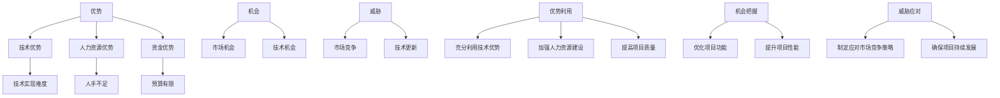

                 

### 第1章: 问题背景与定义

**1.1 问题背景**

在当今信息化时代，需求风险在软件开发和项目管理中扮演着至关重要的角色。需求风险指的是在项目开发过程中，因需求识别、分析、设计和实现等环节中的不确定性而导致的风险。这些风险可能源于需求的不明确、需求变更、技术实现难度等因素，可能导致项目延期、成本超支、功能缺失等问题。

**1.2 需求风险评估的定义**

需求风险评估是指通过分析、识别和评估项目中的需求风险，制定相应的风险应对策略，以降低风险对项目的影响。需求风险评估的目标是确保项目能够按时、按质、按预算完成，提高项目成功率。

**1.3 需求风险评估的重要性**

需求风险评估的重要性体现在以下几个方面：

- **提前识别风险**：通过需求风险评估，可以在项目早期识别出潜在的需求风险，从而为项目团队提供预警，提前采取应对措施。
- **降低风险影响**：需求风险评估可以帮助项目团队制定有效的风险应对策略，降低风险对项目的影响，确保项目顺利进行。
- **提高项目成功率**：需求风险评估是提高项目成功率的关键环节，通过有效的需求风险评估，可以降低项目失败的概率。

**1.4 需求风险的边界与外延**

需求风险的边界与外延包括以下几个方面：

- **需求变更**：需求变更是需求风险的主要来源之一。在项目开发过程中，需求变更可能导致项目延期、成本超支等问题。
- **技术实现难度**：技术实现难度也是需求风险的一个重要方面。一些复杂的需求可能难以实现，或者实现成本较高，从而影响项目进度和成本。
- **需求理解错误**：需求理解错误可能导致项目团队无法正确实现需求，进而影响项目质量。

**1.5 需求风险评估的核心概念与联系**

在需求风险评估中，以下几个核心概念和联系至关重要：

- **需求识别**：需求识别是需求风险评估的第一步，主要目的是明确项目的需求。
- **需求分类**：需求分类有助于对需求进行有效管理，根据需求的重要性和紧急性进行分类。
- **风险评估模型**：风险评估模型是进行需求风险评估的工具，常用的模型有SWOT分析模型、EFQM模型和RBS模型。
- **风险应对策略**：风险应对策略是在识别和评估风险后，根据风险的特点和影响制定的具体措施。

下面是需求风险评估中的核心概念对比表格：

| 核心概念       | 定义                                                         | 关联关系                                                                                       |
|----------------|--------------------------------------------------------------|------------------------------------------------------------------------------------------------|
| 需求识别       | 确定项目所需的功能和非功能需求                               | 是需求风险评估的第一步，为后续的风险评估提供基础                                       |
| 需求分类       | 根据需求的重要性和紧急性对需求进行分类                       | 需求识别的延伸，有助于对需求进行优先级排序，以便更好地进行风险评估                       |
| 风险评估模型   | 用于评估项目风险的方法和工具                                 | 包括SWOT分析模型、EFQM模型和RBS模型等，帮助项目团队理解和评估需求风险                   |
| 风险应对策略   | 针对识别和评估出的风险，制定的具体应对措施                    | 风险评估的结果直接影响风险应对策略的制定，风险应对策略有助于降低风险对项目的影响         |

此外，以下是需求风险评估中的ER实体关系图：

```mermaid
erDiagram
    Product ||--|{ Requirement }|--| Project
    Requirement ||--|{ Risk }|--| Project
    Project ||--|{ RiskResponse }|--| Risk
```

该ER图展示了需求、需求识别、需求分类、风险评估模型和风险应对策略之间的关联关系。

**1.6 概念结构与核心要素组成**

需求风险评估的概念结构包括以下几个核心要素：

- **需求识别**：识别项目所需的功能和非功能需求。
- **需求分类**：根据需求的重要性和紧急性对需求进行分类。
- **风险评估模型**：选择合适的风险评估模型进行风险评估。
- **风险应对策略**：根据风险评估结果制定风险应对策略。
- **风险监控**：对已识别的风险进行监控和跟踪，确保风险应对措施得到有效执行。

这些核心要素相互关联，共同构成了需求风险评估的完整流程，确保项目能够按时、按质、按预算完成。

### 第2章: 需求识别与分类

**2.1 需求识别**

需求识别是需求风险评估的第一步，它是项目成功的关键。需求识别的目的是明确项目所需的功能和非功能需求。以下是一些需求识别的步骤和方法：

- **访谈和问卷调查**：通过与项目相关人员进行访谈和问卷调查，收集项目需求信息。
- **用户故事映射**：使用用户故事映射方法，将用户的需求转化为具体的功能需求。
- **需求文档分析**：分析现有需求文档，如业务需求文档、用户手册等，以识别项目需求。
- **场景分析**：通过分析项目相关的场景，识别出用户在使用产品时的需求。

**2.2 需求分类**

需求分类是需求识别的延伸，它有助于对需求进行优先级排序，以便更好地进行风险评估。以下是几种常用的需求分类方法：

- **按重要性分类**：根据需求对项目的重要性进行分类，如关键需求、次要需求和辅助需求。
- **按紧急性分类**：根据需求的紧急性进行分类，如高优先级需求、中优先级需求和低优先级需求。
- **按实现难度分类**：根据需求实现的技术难度和成本进行分类，如简单需求、中等难度需求和复杂需求。

**2.2.1 功能性需求**

功能性需求是指项目需要实现的具体功能。以下是一些功能性需求的例子：

- **用户注册**：用户在系统中注册账号。
- **订单管理**：用户可以创建、修改和删除订单。
- **数据分析**：系统提供数据分析功能，帮助用户了解业务数据。

**2.2.2 非功能性需求**

非功能性需求是指项目需要满足的性能、安全性、可用性等方面的要求。以下是一些非功能性需求的例子：

- **性能需求**：系统响应时间不超过2秒。
- **安全性需求**：系统需要具备防止SQL注入和XSS攻击的能力。
- **可用性需求**：系统需要具备高可用性，确保99.9%的时间可用。

**2.2.3 用户需求与系统需求**

用户需求是指用户对产品的期望和使用需求。系统需求是指为了满足用户需求，系统需要具备的功能和技术要求。以下是一个用户需求与系统需求的例子：

- **用户需求**：用户希望系统能够提供实时数据分析功能。
- **系统需求**：系统需要具备实时数据采集、处理和分析的能力，同时确保系统的稳定性和性能。

**2.3 需求识别与分类的流程**

需求识别与分类的流程如下：

1. **需求收集**：通过访谈、问卷调查、用户故事映射等方式收集需求信息。
2. **需求整理**：整理收集到的需求信息，将其转化为具体的功能需求和非功能需求。
3. **需求分类**：根据需求的重要性和紧急性对需求进行分类。
4. **需求验证**：与用户和相关利益相关者进行沟通，验证需求是否满足用户需求。
5. **需求文档化**：将需求信息整理成需求文档，以便后续风险评估和使用。

**2.4 需求识别与分类的注意事项**

在进行需求识别与分类时，需要注意以下几点：

- **全面性**：确保收集到的需求信息覆盖项目的各个方面，避免遗漏重要需求。
- **准确性**：对收集到的需求信息进行准确整理和分类，确保需求文档的准确性和完整性。
- **及时性**：在项目早期阶段进行需求识别与分类，以便尽早发现潜在风险。
- **动态调整**：在项目开发过程中，根据实际情况对需求进行动态调整，确保需求与项目的实际情况相符合。

通过需求识别与分类，项目团队可以更好地理解项目需求，制定合理的风险评估策略，从而提高项目的成功率。

### 第3章: 风险评估模型与方法

**3.1 风险评估模型**

风险评估模型是需求风险评估中的重要工具，用于评估项目风险的方法和工具。以下是一些常用的风险评估模型：

**3.1.1 SWOT分析模型**

SWOT分析模型是一种常用的战略分析工具，用于分析项目的优势（Strengths）、劣势（Weaknesses）、机会（Opportunities）和威胁（Threats）。SWOT分析模型可以帮助项目团队从不同角度全面了解项目风险，从而制定相应的风险应对策略。

- **优势（Strengths）**：分析项目在技术、人力、资金等方面的优势，有助于利用这些优势降低风险。
- **劣势（Weaknesses）**：分析项目在技术、人力、资金等方面的劣势，有助于识别项目潜在的风险，并采取措施降低风险。
- **机会（Opportunities）**：分析项目面临的市场、技术等方面的机会，有助于利用这些机会降低风险，提高项目成功率。
- **威胁（Threats）**：分析项目面临的市场、技术等方面的威胁，有助于识别项目潜在的风险，并采取措施降低风险。

**3.1.2 EFQM模型**

EFQM模型是一种全面质量管理模型，它包括八个关键领域：领导力、战略、人员发展、合作伙伴关系、资源、过程管理、客户结果和社会责任。EFQM模型可以帮助项目团队从多个角度评估项目风险，确保项目质量和成功。

- **领导力**：分析项目团队领导在项目管理、沟通、决策等方面的能力和风格，确保项目领导能够有效应对风险。
- **战略**：分析项目的战略目标、计划和市场定位，确保项目具有清晰的战略方向，降低风险。
- **人员发展**：分析项目团队在技能、经验和培训等方面的需求，确保项目团队具备应对风险的能力。
- **合作伙伴关系**：分析项目与合作伙伴的关系，确保合作伙伴能够提供必要的资源和支持，降低风险。
- **资源**：分析项目所需的资金、设备、人力资源等资源，确保项目资源的充足性，降低风险。
- **过程管理**：分析项目的过程管理方法和技术，确保项目过程的高效性和可控性，降低风险。
- **客户结果**：分析项目的客户需求和满意度，确保项目能够满足客户需求，降低风险。
- **社会责任**：分析项目在环境保护、社会责任等方面的表现，确保项目符合社会责任要求，降低风险。

**3.1.3 RBS模型**

RBS（Risk-Based Safety）模型是一种基于风险的安全管理模型，主要用于评估和降低项目风险。RBS模型包括五个关键领域：风险管理计划、风险评估、风险控制、风险监测和风险管理改进。

- **风险管理计划**：制定项目风险管理计划，明确风险管理的目标和范围，为后续风险评估和风险控制提供基础。
- **风险评估**：对项目风险进行识别、分析和评估，确定项目风险的严重程度和发生概率，为风险控制提供依据。
- **风险控制**：根据风险评估结果，制定和实施风险控制措施，降低项目风险。
- **风险监测**：对已识别的风险进行监测和跟踪，确保风险控制措施得到有效执行。
- **风险管理改进**：根据风险监测结果，不断改进风险管理过程和方法，提高项目风险管理水平。

**3.2 风险评估方法**

风险评估方法是指用于评估项目风险的具体技术和工具。以下是一些常用的风险评估方法：

**3.2.1 定性风险评估方法**

定性风险评估方法主要用于评估项目风险的严重程度和发生概率。以下是一些常用的定性风险评估方法：

- **专家评估**：邀请项目专家对项目风险进行评估，根据专家的经验和判断，确定风险的严重程度和发生概率。
- **风险矩阵**：使用风险矩阵（如SWOT分析模型）对项目风险进行分类和评估，确定风险的优先级和应对策略。
- **风险图表**：使用风险图表（如Gantt图、鱼骨图等）对项目风险进行可视化展示，帮助项目团队更好地理解风险。

**3.2.2 定量风险评估方法**

定量风险评估方法主要用于评估项目风险的量化指标，如风险发生概率、风险影响和风险概率影响值。以下是一些常用的定量风险评估方法：

- **概率分布**：使用概率分布（如正态分布、均匀分布等）描述风险发生概率和风险影响。
- **蒙特卡洛模拟**：通过蒙特卡洛模拟方法，生成项目风险的随机样本，评估项目风险的概率分布和期望值。
- **决策树**：使用决策树方法，根据风险发生的概率和风险影响，制定项目风险应对策略。

**3.2.3 组合风险评估方法**

组合风险评估方法是将定性风险评估方法和定量风险评估方法相结合，对项目风险进行全面评估。以下是一些常用的组合风险评估方法：

- **综合评估法**：将定性评估和定量评估结果进行综合，确定项目风险的优先级和应对策略。
- **风险评估矩阵**：将定性评估和定量评估结果整合到一个评估矩阵中，对项目风险进行全面评估。
- **蒙特卡洛模拟与决策树结合**：使用蒙特卡洛模拟方法评估风险概率分布，结合决策树方法制定风险应对策略。

通过风险评估模型和方法的合理运用，项目团队可以更好地识别和评估项目风险，制定有效的风险应对策略，确保项目成功实施。

### 第4章: 风险评估实践

**4.1 案例分析**

为了更好地理解需求风险评估的方法和过程，下面我们通过一个实际项目案例进行分析。

**案例背景：**  
某互联网公司计划开发一款在线教育平台，提供在线课程、课程问答、作业提交等功能。该项目预算为100万元，预计开发周期为6个月。

**需求识别：**  
项目团队通过访谈、问卷调查和用户故事映射等方法，收集了以下需求：

- **功能性需求**：  
  - 用户注册与登录  
  - 课程浏览与选择  
  - 作业提交与批改  
  - 课程问答  
- **非功能性需求**：  
  - 系统性能：页面响应时间不超过3秒  
  - 数据安全：防止SQL注入和XSS攻击

**需求分类：**  
根据需求的重要性和紧急性，项目团队将需求分为以下几类：

- **关键需求**：用户注册与登录、课程浏览与选择、作业提交与批改、课程问答
- **次要需求**：系统性能、数据安全
- **辅助需求**：无

**风险评估模型选择：**  
项目团队选择了SWOT分析模型进行风险评估。

**风险评估过程：**  

1. **优势分析**：项目团队在技术、人力资源和资金方面具备以下优势：
   - 技术优势：公司具备丰富的在线教育平台开发经验。
   - 人力资源：项目团队具备丰富的项目管理和软件开发经验。
   - 资金优势：公司有充足的资金支持项目开发。

2. **劣势分析**：项目团队在技术、人力资源和资金方面存在以下劣势：
   - 技术劣势：在线教育平台开发涉及多个技术和模块，可能存在技术实现难度。
   - 人力资源：项目团队在项目高峰期可能面临人手不足的问题。
   - 资金劣势：项目预算有限，可能影响项目的质量。

3. **机会分析**：项目团队在市场、技术等方面发现以下机会：
   - 市场机会：在线教育市场前景广阔，有较大的市场需求。
   - 技术机会：新兴技术如云计算、人工智能等将为在线教育平台提供新的发展机遇。

4. **威胁分析**：项目团队在市场、技术等方面发现以下威胁：
   - 市场威胁：市场竞争激烈，新进入者可能抢占市场份额。
   - 技术威胁：技术更新换代速度加快，项目可能面临技术过时的风险。

**风险评估结果分析：**  

根据SWOT分析结果，项目团队得出以下风险评估结论：

- **优势**：项目团队在技术、人力资源和资金方面具备一定的优势，有利于项目顺利进行。
- **劣势**：项目团队在技术、人力资源和资金方面存在劣势，可能影响项目的质量和进度。
- **机会**：市场机会和新兴技术的应用将为项目带来新的发展机遇。
- **威胁**：市场竞争和技术更新速度可能对项目造成威胁。

**风险应对策略：**  

针对上述风险评估结果，项目团队制定了以下风险应对策略：

- **优势利用**：充分利用项目团队在技术、人力资源和资金方面的优势，确保项目的顺利进行。
- **劣势改进**：加强项目团队在技术、人力资源和资金方面的建设，提高项目质量。
- **机会把握**：抓住市场机会和新兴技术，优化项目功能和性能。
- **威胁应对**：制定应对市场竞争和技术更新的策略，确保项目的持续发展。

**4.2 模型应用**

在上述案例中，项目团队选择了SWOT分析模型进行风险评估。下面是SWOT分析模型的mermaid流程图：



通过SWOT分析模型的应用，项目团队能够全面了解项目的优势和劣势、机会和威胁，从而制定有效的风险应对策略，确保项目的成功实施。

### 第5章: 风险应对策略

**5.1 应对策略选择**

在需求风险评估过程中，项目团队需要根据风险评估结果，选择合适的应对策略。以下是一些常见的风险应对策略：

**5.1.1 减少风险策略**

减少风险策略旨在降低风险的严重程度或发生概率。以下是一些减少风险策略的例子：

- **风险预防**：通过提前识别和应对潜在风险，减少风险发生的概率。例如，在项目开发过程中，使用安全编码规范，减少代码漏洞。
- **风险缓解**：通过采取一系列措施，降低风险的影响。例如，为关键任务安排备选资源，以应对人员短缺的问题。
- **风险转移**：将风险转移到第三方，通过购买保险或签订合同，将风险的责任和损失转移给第三方。

**5.1.2 承受风险策略**

承受风险策略适用于那些风险发生概率较低或风险影响较小的风险。以下是一些承受风险策略的例子：

- **风险自留**：项目团队决定自行承担风险，并制定应对措施。例如，项目团队决定接受一定程度的延迟交付，以降低项目成本。
- **风险容忍**：在项目计划中设定风险容忍度，允许在特定条件下接受风险。例如，项目团队设定系统响应时间容忍度为5秒。

**5.1.3 转移风险策略**

转移风险策略通过将风险转移给第三方，降低项目团队的风险承担。以下是一些转移风险策略的例子：

- **外包**：将项目的某些部分外包给专业的第三方服务商。例如，将在线教育平台的后端开发外包给专业团队。
- **购买保险**：购买保险以转移财务风险。例如，购买项目延误保险，以减轻因项目延误带来的经济损失。

**5.2 风险监控与预警**

风险监控与预警是确保风险应对策略得到有效执行的重要环节。以下是一些风险监控与预警的方法：

**5.2.1 风险监控指标**

项目团队需要设定一系列风险监控指标，以便及时发现风险。以下是一些常见的风险监控指标：

- **进度指标**：项目进度偏差、任务延迟时间等。
- **成本指标**：项目预算偏差、成本超支情况等。
- **质量指标**：代码缺陷率、系统稳定性等。
- **资源指标**：人力资源配置、设备利用率等。

**5.2.2 风险预警机制**

项目团队需要建立风险预警机制，以便在风险发生前及时发出警报。以下是一些风险预警机制的方法：

- **定期风险评估**：定期进行风险评估，及时发现潜在风险。
- **实时监控**：通过实时监控系统，监控项目关键指标的实时变化，及时发现问题。
- **预警通知**：在风险达到预警阈值时，通过短信、邮件等方式通知相关团队成员，确保风险得到及时处理。

**5.3 风险应对策略的选择与实施**

在制定风险应对策略时，项目团队需要考虑以下因素：

- **风险类型**：根据风险类型选择合适的应对策略，如减少风险、承受风险或转移风险。
- **风险影响**：评估风险的影响程度，选择最有效的应对策略。
- **项目目标**：确保风险应对策略符合项目目标，如项目进度、质量和成本。

在实施风险应对策略时，项目团队需要遵循以下步骤：

1. **识别和评估风险**：在项目开发过程中，定期识别和评估风险，确保风险得到及时处理。
2. **制定应对策略**：根据风险评估结果，制定相应的风险应对策略。
3. **实施应对措施**：将应对策略转化为具体的行动，确保风险得到有效控制。
4. **监控和调整**：持续监控风险应对措施的效果，根据实际情况进行调整，确保风险得到妥善处理。

通过合理选择和实施风险应对策略，项目团队可以降低需求风险对项目的影响，提高项目成功率。

### 第6章: 大模型在需求风险评估中的应用

**6.1 大模型概述**

大模型，也称为大型深度学习模型，是指具有大规模参数和高度复杂性的深度学习模型。这些模型通常使用大量的数据和计算资源进行训练，从而实现优异的性能。大模型在计算机视觉、自然语言处理、语音识别等领域取得了显著成果。随着人工智能技术的发展，大模型在需求风险评估中的应用也越来越广泛。

**6.2 大模型在需求风险评估中的优势**

大模型在需求风险评估中具有以下优势：

1. **高效数据处理能力**：大模型能够处理大量结构化和非结构化数据，如用户反馈、需求文档等，从而更准确地识别和分类需求。

2. **自适应学习能力**：大模型具有强大的自适应学习能力，可以根据项目实际情况调整和优化需求识别和风险评估方法。

3. **高精度预测能力**：大模型通过深度学习算法，可以预测需求风险的发生概率和影响程度，为项目团队提供更加精准的风险评估结果。

4. **实时更新与迭代**：大模型可以根据项目进展和用户反馈，实时更新和迭代需求识别和风险评估方法，确保评估结果的准确性和实时性。

**6.3 大模型应用案例**

**案例一：应用深度学习进行需求识别**

在一个在线教育平台项目中，项目团队使用深度学习模型进行需求识别。具体步骤如下：

1. **数据收集**：项目团队收集了大量用户反馈、需求文档和业务数据，用于训练深度学习模型。

2. **数据预处理**：对收集的数据进行清洗、去重和格式化处理，将数据转换为适合深度学习模型训练的格式。

3. **模型训练**：使用深度学习框架（如TensorFlow或PyTorch），构建需求识别模型，并使用预处理后的数据对其进行训练。

4. **模型评估**：通过交叉验证和测试集评估模型性能，调整模型参数和结构，提高模型准确率。

5. **模型应用**：将训练好的模型应用于实际项目，自动识别和分类需求，提高需求识别的效率和准确性。

**案例二：应用自然语言处理进行风险分析**

在一个电子商务项目中，项目团队使用自然语言处理（NLP）技术进行风险分析。具体步骤如下：

1. **数据收集**：项目团队收集了项目需求文档、用户反馈和业务数据，用于训练NLP模型。

2. **数据预处理**：对收集的数据进行清洗、去重和格式化处理，将数据转换为适合NLP模型训练的格式。

3. **模型训练**：使用NLP技术（如词向量、文本分类等），构建风险分析模型，并使用预处理后的数据对其进行训练。

4. **模型评估**：通过交叉验证和测试集评估模型性能，调整模型参数和结构，提高模型准确率。

5. **模型应用**：将训练好的模型应用于实际项目，自动分析项目需求中的潜在风险，为项目团队提供更加准确的评估结果。

通过大模型的应用，项目团队可以更高效地识别和评估需求风险，提高项目的成功率。未来，随着大模型技术的不断发展，其在需求风险评估中的应用前景将更加广阔。

### 第7章: 未来展望与总结

**7.1 未来发展趋势**

随着人工智能技术的不断发展和应用，需求风险评估领域也呈现出以下发展趋势：

1. **智能化**：大模型和自然语言处理技术的应用，将使需求风险评估更加智能化，提高风险评估的准确性和效率。
2. **实时性**：随着大数据和实时数据处理技术的发展，需求风险评估将更加注重实时性，实现风险实时监控和预警。
3. **个性化**：基于用户行为分析和大数据分析，需求风险评估将更加注重个性化，根据不同项目特点和需求，制定更有效的风险评估策略。
4. **协同化**：需求风险评估将实现跨部门、跨领域的协同，通过共享信息和资源，提高风险评估的整体效能。

**7.2 小结**

本文详细介绍了需求风险评估的重要性、核心概念和方法，并通过实际案例展示了需求识别与分类、风险评估模型与应用、风险应对策略和风险监控与预警的具体实施过程。同时，本文还探讨了大模型在需求风险评估中的应用，展示了其在提高风险评估准确性和效率方面的优势。

在未来，需求风险评估领域将继续朝着智能化、实时化、个性化和协同化的方向发展，为项目成功提供更加有力的保障。通过不断优化和创新需求风险评估方法，项目团队可以更好地应对需求风险，提高项目成功率。

