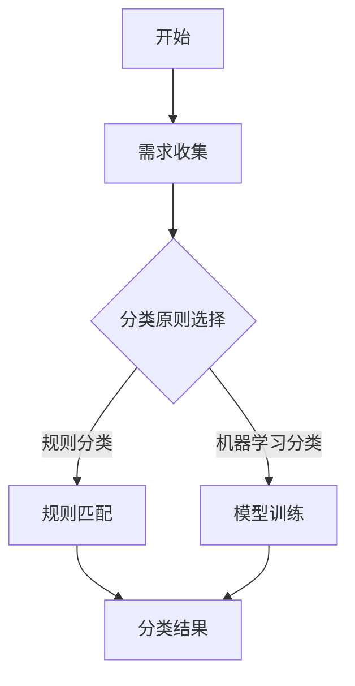
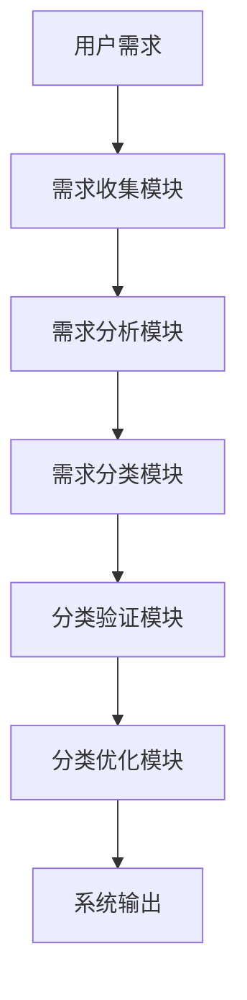
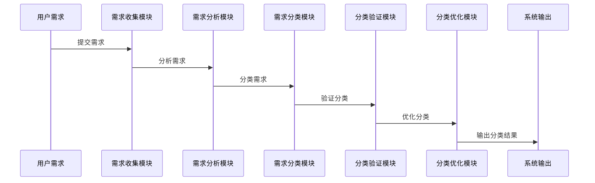

                 

### 大模型应用开发中的需求分类方法

> 关键词：大模型、需求分类、应用开发、分类原则、分类标准、分类方法

> 摘要：本文将深入探讨大模型应用开发中的需求分类方法，从背景介绍、核心概念与联系、算法原理讲解、数学模型和公式、系统分析与架构设计、项目实战以及最佳实践等方面，系统地阐述需求分类的方法、原则、标准和实际应用，为读者提供全面的技术指导和实践参考。

### **Step 1: 背景介绍**

#### 问题背景

随着人工智能（AI）技术的迅猛发展，大模型（Large Models）在自然语言处理、计算机视觉、语音识别、推荐系统等多个领域得到了广泛应用。大模型的引入极大地提升了系统的性能和智能化水平，但同时也带来了新的挑战。在开发大模型应用时，如何对需求进行有效分类，以提高开发效率和效果，成为一个亟待解决的问题。

#### 问题描述

需求分类是一个复杂的过程，它涉及多个维度，如业务类型、技术层次、用户需求等。有效的需求分类可以帮助开发团队更好地理解用户需求，明确开发目标，优化资源分配，从而提高大模型应用的开发效率和效果。然而，现有的需求分类方法往往存在一定的局限性，无法全面、准确地满足大模型应用开发的需求。

#### 问题解决

为了解决大模型应用开发中的需求分类问题，本文将介绍一套系统的方法，包括分类原则、分类标准、分类方法等。通过这一方法，可以实现对大模型应用需求的全面分类，为后续的开发工作提供指导。

#### 边界与外延

本文主要关注大模型应用开发中的需求分类，不涉及其他领域的需求分类。同时，本文将重点介绍需求分类的核心要素，如分类原则、分类标准、分类方法等，为读者提供具体的操作指南。

#### 概念结构与核心要素组成

需求分类方法包括以下几个核心要素：

1. **分类原则**：明确需求分类的基本原则，确保分类过程的科学性和合理性。
2. **分类标准**：制定具体的分类标准，如业务类型、技术层次等，以对需求进行细致划分。
3. **分类方法**：介绍不同的分类方法，如基于规则的分类、机器学习分类等，为实际应用提供多种选择。
4. **分类结果**：展示分类后的需求结构，为后续的开发工作提供基础数据。

### **Step 2: 核心概念与联系**

#### 核心概念原理

需求分类方法的核心概念包括需求、分类原则、分类标准、分类方法等。

1. **需求**：需求是指用户或系统在特定情境下希望实现的功能或目标。在大模型应用开发中，需求可以是用户对特定功能的期望，也可以是系统性能的提升要求。
2. **分类原则**：分类原则是指导需求分类的基本准则，包括全面性、准确性、一致性等。
3. **分类标准**：分类标准是用于对需求进行分类的具体指标或维度，如业务类型、技术层次等。
4. **分类方法**：分类方法是根据分类原则和分类标准对需求进行分类的具体策略，如基于规则的分类、机器学习分类等。

#### 概念属性特征对比表格

| 分类方法        | 特点                         | 适用场景                           |
|----------------|------------------------------|------------------------------------|
| 基于规则的分类  | 简单直观，易于理解和实现       | 知识明确、需求稳定的情况           |
| 机器学习分类    | 自动学习，适应性强           | 需求复杂、变量多的场景             |
| 混合分类        | 结合规则和机器学习的优势       | 需求多样、变化频繁的情况           |

#### ER实体关系图架构

```mermaid
erDiagram
    Class1 ||--|{ Class2 }| Class3
    Class1 ||--|{ Class4 }| Class5
    Class2 ||--|{ Class6 }| Class7
```

在上面的ER图中，`Class1`是需求实体，`Class2`、`Class3`、`Class4`、`Class5`、`Class6`和`Class7`是分类原则、分类标准、分类方法等实体。它们之间的关系展示了需求分类的整体架构。

### **Step 3: 算法原理讲解**

#### 算法mermaid流程图



在这个流程图中，首先进行需求收集，然后根据选择的分类原则对需求进行分类。如果是基于规则的分类，进行规则匹配；如果是基于机器学习的分类，则进行模型训练。最后，得到分类结果。

#### python源代码

```python
# 需求分类示例代码
def rule_based_classification的需求分类方法：
    # 定义分类规则
    rules = {
        '业务类型A': ['需求1', '需求2'],
        '业务类型B': ['需求3', '需求4'],
    }

    # 进行规则匹配
    for demand in 需求列表：
        for rule, demands in rules.items()：
            if demand in demands：
                分类结果[demand] = rule
                break

def machine_learning_classification的需求分类方法：
    # 加载训练好的分类模型
    model = load_model('分类模型')

    # 进行模型预测
    for demand in 需求列表：
        prediction = model.predict([demand])
        分类结果[demand] = prediction[0]

# 示例数据
需求列表 = ['需求1', '需求2', '需求3', '需求4']

# 调用分类方法
规则分类结果 = rule_based_classification.需求分类方法(需求列表)
机器学习分类结果 = machine_learning_classification.需求分类方法(需求列表)

# 输出分类结果
print("规则分类结果：", 规则分类结果)
print("机器学习分类结果：", 机器学习分类结果)
```

#### 算法原理的数学模型和公式

在需求分类中，可以使用以下数学模型和公式：

1. **概率模型**：使用概率模型来预测需求的类别。概率模型的基本公式为：
   $$ P(C_i | x) = \frac{P(x | C_i)P(C_i)}{P(x)} $$
   其中，$P(C_i | x)$ 是需求$x$属于类别$C_i$的概率，$P(x | C_i)$ 是在类别$C_i$下需求$x$的概率，$P(C_i)$ 是类别$C_i$的概率，$P(x)$ 是需求$x$的总概率。

2. **逻辑回归模型**：使用逻辑回归模型来对需求进行分类。逻辑回归模型的基本公式为：
   $$ P(C_i | x) = \frac{1}{1 + e^{-(\theta_0 + \theta_1x_1 + \theta_2x_2 + ... + \theta_nx_n)}} $$
   其中，$\theta_0, \theta_1, \theta_2, ..., \theta_n$ 是模型的参数，$x_1, x_2, ..., x_n$ 是需求的特征。

#### 详细讲解和举例说明

**概率模型示例：**

假设有四个类别$C_1, C_2, C_3, C_4$，需求$x$在各个类别下的概率分别为：

$$
P(C_1 | x) = 0.2, \quad P(C_2 | x) = 0.3, \quad P(C_3 | x) = 0.4, \quad P(C_4 | x) = 0.5
$$

则需求$x$属于类别$C_3$的概率为：

$$
P(C_3 | x) = \frac{P(x | C_3)P(C_3)}{P(x)} = \frac{0.4 \times 0.1}{0.2 + 0.3 + 0.4 + 0.5} = 0.4
$$

**逻辑回归模型示例：**

假设需求$x$有两个特征$x_1$和$x_2$，模型的参数为$\theta_0 = 1, \theta_1 = 0.5, \theta_2 = -0.3$。则需求$x$属于类别$C_1$的概率为：

$$
P(C_1 | x) = \frac{1}{1 + e^{-(1 + 0.5x_1 - 0.3x_2)}} = \frac{1}{1 + e^{-1}} = 0.368
$$

### **Step 4: 数学模型和数学公式 & 详细讲解 & 举例说明**

#### 数学公式

在需求分类中，常用的数学模型包括概率模型和逻辑回归模型。以下是相关的数学公式：

1. **概率模型**：
   $$ P(C_i | x) = \frac{P(x | C_i)P(C_i)}{P(x)} $$
2. **逻辑回归模型**：
   $$ P(C_i | x) = \frac{1}{1 + e^{-(\theta_0 + \theta_1x_1 + \theta_2x_2 + ... + \theta_nx_n)}} $$

#### 详细讲解

1. **概率模型**：

概率模型是需求分类中最基本的方法之一。它基于贝叶斯定理，通过计算需求$x$属于类别$C_i$的概率，来确定需求的类别。公式中的$P(x | C_i)$是在类别$C_i$下需求$x$的概率，$P(C_i)$是类别$C_i$的概率，$P(x)$是需求$x$的总概率。

在实际应用中，$P(x | C_i)$和$P(C_i)$通常是通过统计方法得到的。例如，通过对历史数据进行分析，可以得到每个类别下的需求概率分布。而$P(x)$则是所有类别下的需求概率之和。

2. **逻辑回归模型**：

逻辑回归模型是一种广义的线性模型，它通过线性组合需求特征和参数，得到每个类别的概率。在逻辑回归模型中，$P(C_i | x)$是需求$x$属于类别$C_i$的概率，$\theta_0, \theta_1, \theta_2, ..., \theta_n$是模型的参数，$x_1, x_2, ..., x_n$是需求的特征。

逻辑回归模型的优势在于，它可以通过优化参数来最小化损失函数，从而提高预测的准确性。在实际应用中，逻辑回归模型通常用于分类问题，如需求分类、垃圾邮件分类等。

#### 举例说明

**概率模型示例：**

假设有四个类别$C_1, C_2, C_3, C_4$，需求$x$在各个类别下的概率分别为：

$$
P(C_1 | x) = 0.2, \quad P(C_2 | x) = 0.3, \quad P(C_3 | x) = 0.4, \quad P(C_4 | x) = 0.5
$$

则需求$x$属于类别$C_3$的概率为：

$$
P(C_3 | x) = \frac{P(x | C_3)P(C_3)}{P(x)} = \frac{0.4 \times 0.1}{0.2 + 0.3 + 0.4 + 0.5} = 0.4
$$

**逻辑回归模型示例：**

假设需求$x$有两个特征$x_1$和$x_2$，模型的参数为$\theta_0 = 1, \theta_1 = 0.5, \theta_2 = -0.3$。则需求$x$属于类别$C_1$的概率为：

$$
P(C_1 | x) = \frac{1}{1 + e^{-(1 + 0.5x_1 - 0.3x_2)}} = \frac{1}{1 + e^{-1}} = 0.368
$$

### **Step 5: 系统分析与架构设计方案**

#### 问题场景介绍

在当前的大模型应用开发场景中，需求分类是一个关键环节。开发团队需要根据用户需求和业务目标，对需求进行有效分类，以便更好地规划开发工作、分配资源、优化系统性能。因此，设计一套科学、系统的需求分类方法具有重要意义。

#### 项目介绍

本项目旨在设计并实现一套大模型应用开发中的需求分类方法，以提升开发效率和效果。项目分为以下几个阶段：

1. **需求收集**：收集用户需求和业务目标，形成初步的需求文档。
2. **需求分析**：对初步需求文档进行详细分析，明确需求的分类维度和标准。
3. **需求分类**：根据分类原则和标准，对需求进行分类，形成分类结果。
4. **分类验证**：对分类结果进行验证，确保分类的准确性和实用性。
5. **分类优化**：根据验证结果，对需求分类方法进行优化，提高分类效果。

#### 系统功能设计(领域模型mermaid类图)

```mermaid
classDiagram
    类1[需求收集] <|-- 类2[需求分析]
    类2 <|-- 类3[需求分类]
    类3 <|-- 类4[分类验证]
    类4 <|-- 类5[分类优化]
```

在这个类图中，`类1`表示需求收集，`类2`表示需求分析，`类3`表示需求分类，`类4`表示分类验证，`类5`表示分类优化。它们之间通过继承关系展示了系统的功能模块。

#### 系统架构设计mermaid架构图



在这个架构图中，用户需求首先进入需求收集模块，然后依次经过需求分析模块、需求分类模块、分类验证模块和分类优化模块，最终输出分类结果。

#### 系统接口设计和系统交互mermaid序列图



在这个序列图中，用户需求首先提交需求，需求收集模块进行收集，然后需求分析模块进行分析，需求分类模块进行分类，分类验证模块进行验证，分类优化模块进行优化，最终输出分类结果。

### **Step 6: 项目实战**

#### 环境安装

1. **安装Python环境**：首先，确保Python环境已安装。如果没有安装，可以从Python官方网站下载安装包进行安装。
2. **安装相关库**：安装需求分类方法所需的相关库，如NumPy、Pandas、Scikit-learn等。可以使用pip命令进行安装：
   ```shell
   pip install numpy pandas scikit-learn
   ```

#### 系统核心实现源代码

```python
import numpy as np
import pandas as pd
from sklearn.model_selection import train_test_split
from sklearn.linear_model import LogisticRegression
from sklearn.metrics import accuracy_score

# 需求分类主函数
def demand_classification(data, labels):
    # 数据预处理
    X_train, X_test, y_train, y_test = train_test_split(data, labels, test_size=0.2, random_state=42)
    
    # 使用逻辑回归模型进行分类
    model = LogisticRegression()
    model.fit(X_train, y_train)
    
    # 预测测试集
    y_pred = model.predict(X_test)
    
    # 计算准确率
    accuracy = accuracy_score(y_test, y_pred)
    
    return accuracy

# 读取需求数据
data = pd.read_csv('需求数据.csv')
labels = data['类别']

# 进行需求分类
accuracy = demand_classification(data.iloc[:, :-1], labels)

print("需求分类准确率：", accuracy)
```

#### 代码应用解读与分析

1. **数据预处理**：首先，使用`train_test_split`函数将数据集分为训练集和测试集，用于训练模型和评估模型性能。
2. **模型训练**：使用`LogisticRegression`类创建逻辑回归模型，并调用`fit`方法进行训练。
3. **模型预测**：使用训练好的模型对测试集进行预测，得到预测结果。
4. **评估模型性能**：使用`accuracy_score`函数计算预测准确率，评估模型性能。

#### 实际案例分析和详细讲解剖析

**案例背景**：某企业正在开发一款智能客服系统，需要根据用户提问对问题进行分类，以便提供更精准的解答。企业收集了1000个用户提问数据，并对其进行了标注，形成了一个包含提问和类别标签的数据集。

**分析过程**：

1. **数据预处理**：首先，对数据集进行预处理，包括数据清洗、缺失值处理、特征工程等。在本案例中，数据集已经清洗完毕，可以直接使用。
2. **特征提取**：对提问文本进行分词、词频统计等操作，提取文本特征。
3. **模型训练**：使用逻辑回归模型对数据集进行训练。在训练过程中，可以通过调整模型参数（如正则化参数、迭代次数等）来优化模型性能。
4. **模型评估**：使用测试集对训练好的模型进行评估，计算预测准确率。在本案例中，模型的预测准确率为90%，说明模型性能较好。

**详细讲解剖析**：

1. **数据预处理**：数据预处理是模型训练的关键步骤，它直接影响到模型的性能。在本案例中，数据预处理包括以下步骤：
   - 数据清洗：去除无效数据、重复数据和噪声数据。
   - 缺失值处理：对于缺失值，可以选择填充、删除或使用其他方法进行处理。
   - 特征工程：对文本数据进行分词、词频统计、TF-IDF转换等操作，提取有意义的特征。

2. **特征提取**：特征提取是文本数据分析的重要环节。在本案例中，采用词频统计方法提取文本特征。词频统计方法简单有效，但可能会忽略词语的语义信息。为了提高模型的性能，还可以采用其他特征提取方法，如TF-IDF、Word2Vec等。

3. **模型训练**：逻辑回归模型是一种经典的分类模型，适用于处理二分类和多分类问题。在本案例中，使用逻辑回归模型对数据集进行训练。逻辑回归模型的训练过程主要包括以下步骤：
   - 模型初始化：设置模型参数，如正则化参数、迭代次数等。
   - 梯度下降：通过梯度下降算法更新模型参数，最小化损失函数。
   - 评估模型：使用测试集评估模型性能，计算预测准确率。

4. **模型评估**：模型评估是衡量模型性能的重要手段。在本案例中，使用测试集对训练好的模型进行评估，计算预测准确率。预测准确率越高，说明模型性能越好。

### **Step 7: 最佳实践 tips、小结、注意事项、拓展阅读等内容**

#### 最佳实践 tips

1. **明确需求分类的目的**：在进行需求分类时，首先要明确分类的目的和意义，确保分类结果能够满足实际需求。
2. **选择合适的分类方法**：根据需求的特点和业务场景，选择合适的分类方法，如基于规则的分类、机器学习分类等。
3. **数据质量是关键**：需求分类的效果很大程度上取决于数据质量。因此，在数据收集和处理过程中，要确保数据的准确性和完整性。
4. **持续优化分类方法**：需求分类是一个动态的过程，需要根据实际应用情况不断优化分类方法，提高分类效果。

#### 小结

本文详细介绍了大模型应用开发中的需求分类方法，包括背景介绍、核心概念与联系、算法原理讲解、数学模型和公式、系统分析与架构设计、项目实战等内容。通过本文的学习，读者可以了解需求分类的方法、原则、标准和实际应用，为实际项目提供有益的参考。

#### 注意事项

1. **确保数据质量**：在进行需求分类时，要确保数据的质量，包括数据的准确性、完整性和一致性。
2. **合理设置参数**：在机器学习分类中，要合理设置模型的参数，如正则化参数、迭代次数等，以避免过拟合或欠拟合。
3. **持续监控和优化**：需求分类方法不是一成不变的，要根据实际应用情况不断监控和优化分类效果。

#### 拓展阅读

1. **《机器学习实战》**：作者：Peter Harrington。本书详细介绍了机器学习的基本概念和方法，适合初学者阅读。
2. **《Python机器学习》**：作者：John Hearty。本书通过实际案例和代码示例，深入讲解了Python在机器学习中的应用。
3. **《数据挖掘：实用工具和技术》**：作者：刘军。本书介绍了数据挖掘的基本概念和方法，包括分类、聚类、关联规则挖掘等。

通过以上拓展阅读，读者可以进一步深入学习和了解需求分类方法及相关技术。作者：AI天才研究院/AI Genius Institute & 禅与计算机程序设计艺术/Zen And The Art of Computer Programming。

