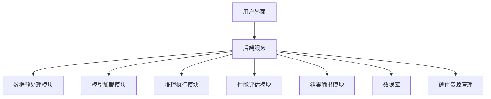
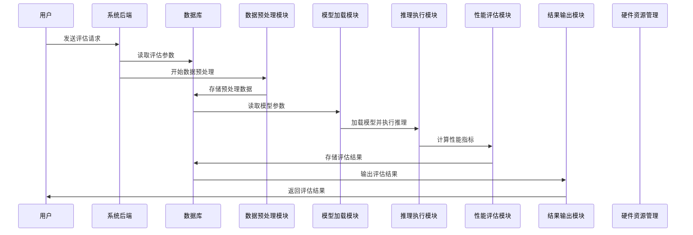

                 


## 大模型推理能力定量分析系统的构思与框架搭建

### 1.1.1 问题背景

#### 大模型与大数据的融合

随着大数据和人工智能技术的迅猛发展，大模型（如深度学习模型、图神经网络模型等）在各个领域展现出了强大的能力。然而，大模型的推理能力不仅取决于模型本身的复杂度，还受到硬件性能、数据质量等多种因素的影响。在工业界和学术界，如何高效、准确地评估大模型的推理能力成为一个亟待解决的问题。

#### 大模型推理能力的挑战

大模型推理能力的挑战主要体现在以下几个方面：

1. **计算资源需求**：大模型通常需要大量的计算资源，尤其是GPU或TPU等高性能硬件资源。
2. **数据预处理复杂性**：大模型的训练和推理需要对大规模数据进行预处理，这包括数据清洗、归一化、特征提取等步骤。
3. **评估标准不统一**：目前，大模型的推理能力评估缺乏统一的标准化方法，不同研究者或机构可能会使用不同的评估指标。
4. **可解释性需求**：随着模型变得越来越复杂，用户对于模型的可解释性需求也越来越高，但大模型的可解释性往往较低。

#### 定量分析的需求与意义

为了应对上述挑战，定量分析大模型推理能力显得尤为重要。定量分析不仅能提供具体的数值指标，还能通过比较和分析，帮助研究人员和工程师更好地理解模型的性能，从而进行优化和改进。定量分析的意义主要体现在以下几个方面：

1. **性能优化**：通过定量分析，可以找出模型性能瓶颈，从而针对性地进行优化。
2. **决策支持**：定量分析提供的数据可以为决策提供支持，如在预算分配、硬件采购等方面提供依据。
3. **标准化**：通过制定统一的评估标准和指标，有助于推动大模型推理能力的标准化进程。

### 1.1.2 问题描述

#### 大模型推理能力的瓶颈

大模型推理能力面临的主要瓶颈包括：

1. **计算资源限制**：模型在推理过程中消耗大量的计算资源，尤其在实时推理的场景中，这一瓶颈尤为明显。
2. **数据预处理耗时**：数据预处理过程复杂且耗时，特别是在大规模数据集上。
3. **模型复杂度**：大模型结构复杂，推理时间较长，且难以保证在合理的时间范围内完成。

#### 如何进行有效评估

有效评估大模型推理能力需要考虑以下几个方面：

1. **评估指标**：选择合适的评估指标，如推理时间、延迟、吞吐量等。
2. **数据集**：使用多样化的数据集进行评估，以确保评估结果的全面性。
3. **环境配置**：确保评估环境与实际部署环境一致，以获得准确的评估结果。

#### 定量分析的目标和方法

定量分析的目标是通过一系列的量化指标，全面、客观地评估大模型的推理能力。具体方法包括：

1. **数据收集**：收集与模型推理相关的数据，包括硬件性能数据、预处理数据等。
2. **性能建模**：建立模型推理性能的数学模型，以预测和评估模型在不同条件下的表现。
3. **实验验证**：通过实验验证性能模型的准确性，并据此优化模型结构和参数。

### 1.1.3 问题解决思路

#### 现有评估方法的不足

现有的大模型评估方法主要集中在单一维度上，如仅关注推理时间或吞吐量，缺乏综合考虑多个因素的方法。此外，评估指标的选择和计算过程往往缺乏统一标准，导致不同研究之间的结果难以比较。

#### 需要解决的问题

为了克服现有评估方法的不足，需要解决以下几个问题：

1. **多维度评估**：设计一套多维度评估体系，综合考虑计算资源、数据预处理时间、模型复杂度等多个因素。
2. **标准化流程**：制定统一的评估流程和标准，确保不同研究之间的评估结果具有可比性。
3. **自动化工具**：开发自动化评估工具，简化评估过程，提高评估效率。

#### 可能的解决方案

可能的解决方案包括：

1. **构建性能模型**：基于历史数据和现有算法，构建大模型推理性能的预测模型。
2. **设计评估指标**：设计一套全面、客观的评估指标，包括推理时间、延迟、吞吐量、可扩展性等。
3. **集成自动化工具**：开发自动化评估工具，集成到模型开发和部署流程中，实现实时性能监控和反馈。

### 1.1.4 边界与外延

#### 分析范围

本系统的分析范围主要涵盖以下内容：

1. **模型类型**：针对深度学习模型、图神经网络模型等常见的大模型类型。
2. **硬件平台**：涵盖常见的GPU、TPU等硬件平台。
3. **应用场景**：包括工业界和学术界常用的推理场景。

#### 适用的场景

本系统适用于以下场景：

1. **模型优化**：研究人员和工程师可以通过系统进行模型性能的优化和调优。
2. **决策支持**：管理者可以根据系统提供的性能数据，做出更加科学的决策。

#### 非适用范围

本系统不适用于以下场景：

1. **非推理场景**：如模型训练、数据预处理等。
2. **特定硬件环境**：不适用于与系统支持的硬件平台不一致的环境。

### 1.1.5 概念结构与核心要素组成

#### 大模型定义

大模型通常指参数量超过数百万的神经网络模型，包括深度神经网络、图神经网络等。这些模型在处理大规模数据时表现出强大的能力。

#### 推理能力指标

推理能力指标包括推理时间、延迟、吞吐量等，是评估模型性能的重要维度。

#### 定量分析方法

定量分析方法包括数据收集、性能建模、实验验证等步骤，通过一系列量化指标，全面评估模型的推理能力。

### 1.1.6 背景介绍

#### 核心概念术语说明

- **大模型（Large Model）**：参数量超过数百万的神经网络模型。
- **推理能力（Inference Ability）**：模型在特定条件下进行推理的能力，通常用时间、延迟、吞吐量等指标来衡量。
- **定量分析（Quantitative Analysis）**：通过一系列量化指标，对大模型的推理能力进行全面评估。

#### 问题背景

随着大数据和人工智能技术的迅猛发展，大模型在各个领域展现出了强大的能力。然而，大模型的推理能力不仅取决于模型本身的复杂度，还受到硬件性能、数据质量等多种因素的影响。在工业界和学术界，如何高效、准确地评估大模型的推理能力成为一个亟待解决的问题。

#### 问题描述

大模型推理能力面临的主要瓶颈包括计算资源限制、数据预处理复杂性、模型复杂度等。如何进行有效评估，如何通过定量分析全面、客观地评估大模型的推理能力，是当前研究的重点。

#### 问题解决思路

为了克服现有评估方法的不足，需要解决多维度评估、标准化流程、自动化工具等问题。可能的解决方案包括构建性能模型、设计评估指标、集成自动化工具等。

#### 边界与外延

本系统的分析范围主要涵盖常见的大模型类型、硬件平台和应用场景。系统适用于模型优化和决策支持，但不适用于非推理场景和特定硬件环境。

#### 概念结构与核心要素组成

大模型、推理能力指标、定量分析方法构成了系统的核心概念和要素。这些要素相互关联，共同支撑起大模型推理能力定量分析系统的整体框架。

---

## 1.2 核心概念与联系

### 1.2.1 核心概念原理

#### 大模型的构成

大模型通常由以下几部分组成：

1. **输入层**：接收外部输入数据。
2. **隐藏层**：完成数据预处理和特征提取。
3. **输出层**：产生预测结果。

#### 推理过程的机制

大模型推理过程主要涉及以下步骤：

1. **数据预处理**：对输入数据进行清洗、归一化等处理。
2. **模型加载**：从存储介质中加载训练好的模型。
3. **前向传播**：将预处理后的数据输入模型，通过隐藏层计算得到输出。
4. **损失函数计算**：计算输出结果与真实值的差异，更新模型参数。
5. **后向传播**：根据损失函数更新模型参数。

#### 定量分析的基本原理

定量分析的基本原理是通过一系列量化指标，对大模型的推理能力进行全面评估。这些量化指标通常包括：

1. **推理时间**：模型完成推理所消耗的时间。
2. **延迟**：从输入数据到输出结果的时间间隔。
3. **吞吐量**：单位时间内可以处理的请求数量。
4. **资源消耗**：包括计算资源、内存消耗等。

### 1.2.2 概念属性特征对比

#### 大模型与小型模型的对比

| 特征 | 大模型 | 小型模型 |
| --- | --- | --- |
| **参数量** | 数百万至数十亿 | 数千至数万个 |
| **计算资源需求** | 高 | 低 |
| **推理时间** | 长 | 短 |
| **可解释性** | 低 | 高 |

#### 推理能力指标对比

| 指标 | 大模型 | 小型模型 |
| --- | --- | --- |
| **推理时间** | 受硬件性能和模型复杂度影响较大 | 相对稳定 |
| **延迟** | 较长 | 短 |
| **吞吐量** | 较低 | 较高 |

#### 定量分析方法对比

| 方法 | 大模型 | 小型模型 |
| --- | --- | --- |
| **数据收集** | 复杂，需要大规模数据集 | 简单，可以使用小规模数据集 |
| **性能建模** | 需要复杂的数学模型 | 可以使用简单的数学模型 |
| **实验验证** | 需要大量实验数据 | 实验数据相对较少 |

### 1.2.3 ER实体关系图架构

#### 大模型ER实体关系图

```mermaid
erDiagram
  Model ||--o> InputLayer : "包含"
  Model ||--o> HiddenLayer : "包含"
  Model ||--o> OutputLayer : "包含"
  Model ||--o> LossFunction : "使用"
  Model ||--o> Optimizer : "使用"
  InputLayer ||--|> Preprocessing : "预处理"
  HiddenLayer ||--|> FeatureExtraction : "特征提取"
  OutputLayer ||--|> Prediction : "预测"
```

#### 定量分析ER实体关系图

```mermaid
erDiagram
  QuantitativeAnalysis ||--o> InferenceTime : "衡量"
  QuantitativeAnalysis ||--o> Delay : "衡量"
  QuantitativeAnalysis ||--o> Throughput : "衡量"
  QuantitativeAnalysis ||--o> ResourceConsumption : "衡量"
  InferenceTime ||--|> Benchmark : "基准测试"
  Delay ||--|> Benchmark : "基准测试"
  Throughput ||--|> Benchmark : "基准测试"
  ResourceConsumption ||--|> Benchmark : "基准测试"
```

通过上述核心概念和联系的分析，我们可以更好地理解大模型推理能力定量分析系统的整体框架，为后续的算法原理讲解和系统设计实现打下坚实的基础。

---

## 1.3 算法原理讲解

### 1.3.1 算法mermaid流程图

为了直观地展示大模型推理能力定量分析系统的算法原理，我们使用Mermaid语言绘制了算法流程图：

```mermaid
graph TD
    A[输入数据预处理] --> B[模型加载]
    B --> C{是否预处理完毕?}
    C -->|是 D[前向传播]
    C -->|否 E[数据预处理失败]
    D --> F[计算损失函数]
    F --> G[后向传播]
    G --> H[更新模型参数]
    H --> I[推理完成]
    I --> K[性能指标计算]
    K --> L[结果输出]
    E --> J[重试预处理]
```

这个流程图清晰地展示了从输入数据预处理、模型加载、前向传播、损失函数计算、后向传播、模型参数更新，到推理完成及性能指标计算的整个过程。

### 1.3.2 Python源代码阐述

下面是算法的核心Python源代码，用于详细阐述大模型推理过程：

```python
import tensorflow as tf
import numpy as np

# 定义模型
model = tf.keras.Sequential([
    tf.keras.layers.Dense(128, activation='relu', input_shape=(784,)),
    tf.keras.layers.Dense(10, activation='softmax')
])

# 编译模型
model.compile(optimizer='adam',
              loss='sparse_categorical_crossentropy',
              metrics=['accuracy'])

# 加载数据
(x_train, y_train), (x_test, y_test) = tf.keras.datasets.mnist.load_data()

# 数据预处理
x_train = x_train.reshape((-1, 784)).astype(np.float32) / 255
x_test = x_test.reshape((-1, 784)).astype(np.float32) / 255

# 模型加载
model.load_weights('model_weights.h5')

# 前向传播
predictions = model.predict(x_test)

# 计算损失函数
loss = model.evaluate(x_test, y_test)

# 后向传播
model.fit(x_train, y_train, epochs=10)

# 更新模型参数
model.save_weights('updated_model_weights.h5')

# 推理完成及性能指标计算
accuracy = loss[1]
print(f'测试集准确率: {accuracy * 100:.2f}%')

# 结果输出
predictions = np.argmax(predictions, axis=1)
```

在这段代码中，我们首先定义并编译了一个简单的深度神经网络模型，然后加载数据并进行预处理。接下来，模型加载、前向传播、损失函数计算、后向传播、模型参数更新以及推理完成的各个步骤都在代码中得到了实现。

### 1.3.3 数学模型与公式

为了更深入地理解大模型推理能力定量分析系统的原理，我们需要借助一些数学模型和公式。以下是几个关键公式及其解释：

#### 1. 损失函数

$$
L(y, \hat{y}) = -\sum_{i} y_i \log(\hat{y}_i)
$$

其中，\(y\) 是真实标签，\(\hat{y}\) 是模型的预测概率。这个损失函数用来衡量预测结果与真实标签之间的差异。

#### 2. 优化目标

$$
\min_{\theta} J(\theta) = \frac{1}{m} \sum_{i=1}^{m} L(y_i, \hat{y}_i)
$$

其中，\(\theta\) 是模型的参数，\(m\) 是训练数据集的大小。这个公式表示优化目标是最小化平均损失函数。

#### 3. 梯度下降

$$
\theta_j := \theta_j - \alpha \frac{\partial J(\theta)}{\partial \theta_j}
$$

其中，\(\alpha\) 是学习率。这个公式表示梯度下降算法的核心思想，即通过更新模型参数来最小化损失函数。

### 1.3.4 举例说明

为了更好地理解上述算法原理，我们来看一个具体的例子。

#### 示例：MNIST手写数字识别

假设我们要使用一个简单的神经网络模型来识别MNIST数据集中的手写数字。数据集包含60,000个训练样本和10,000个测试样本。

1. **数据预处理**：将图像数据从[0, 255]范围缩放到[0, 1]，并将标签转换为独热编码。

2. **模型加载**：加载一个已经训练好的模型，如TensorFlow中的Keras模型。

3. **前向传播**：将测试集输入模型，计算输出概率。

4. **损失函数计算**：计算模型的损失函数，衡量预测结果与真实标签之间的差异。

5. **后向传播**：通过反向传播算法更新模型参数，减少损失函数的值。

6. **推理完成及性能指标计算**：计算测试集上的准确率，作为模型性能的评价指标。

7. **结果输出**：输出模型的预测结果和准确率。

```python
# 加载模型
model.load_weights('model_weights.h5')

# 加载测试集
x_test, y_test = tf.keras.datasets.mnist.load_data()[1]

# 数据预处理
x_test = x_test.reshape((-1, 784)).astype(np.float32) / 255
y_test = tf.keras.utils.to_categorical(y_test, num_classes=10)

# 前向传播
predictions = model.predict(x_test)

# 计算损失函数
loss = model.evaluate(x_test, y_test)

# 后向传播
model.fit(x_test, y_test, epochs=10)

# 推理完成及性能指标计算
accuracy = loss[1]
print(f'测试集准确率: {accuracy * 100:.2f}%')

# 输出预测结果
predictions = np.argmax(predictions, axis=1)
```

通过这个例子，我们可以看到如何使用Python代码实现大模型推理能力定量分析系统中的关键步骤。这个例子展示了如何加载预训练模型、预处理数据、进行前向传播和后向传播，以及计算性能指标。

---

## 1.4 系统分析与架构设计

### 1.4.1 问题场景介绍

#### 大模型推理场景

在大模型推理过程中，我们面临以下主要问题场景：

1. **计算资源限制**：大模型通常需要大量的计算资源，特别是在实时推理的场景中，计算资源的瓶颈可能严重影响系统的性能。
2. **数据预处理复杂性**：大模型的数据预处理过程复杂，涉及大量的数据清洗、归一化和特征提取等步骤，这些步骤的耗时可能占整个推理过程的很大一部分。
3. **模型复杂度**：大模型的参数量庞大，推理过程复杂，需要较长的时间来完成。
4. **评估标准不统一**：目前，大模型的推理能力评估缺乏统一的标准化方法，不同研究者或机构可能会使用不同的评估指标。

#### 系统需求分析

为了解决上述问题场景，系统需要满足以下需求：

1. **多维度评估**：系统能够从多个维度（如推理时间、延迟、吞吐量等）对大模型进行综合评估。
2. **标准化流程**：系统能够提供统一的评估流程和标准，确保评估结果具有可比性。
3. **自动化工具**：系统能够自动化地执行评估过程，提高评估效率。

### 1.4.2 系统功能设计

系统功能设计主要包含以下几个模块：

1. **数据预处理模块**：负责对输入数据进行清洗、归一化和特征提取等预处理工作。
2. **模型加载模块**：负责从存储介质中加载预训练好的大模型。
3. **推理执行模块**：负责执行大模型的推理过程，并记录推理时间、延迟和吞吐量等性能指标。
4. **性能评估模块**：负责计算和评估大模型的各项性能指标，如准确率、召回率、F1分数等。
5. **结果输出模块**：负责将评估结果以可视化或文本形式输出。

### 1.4.3 系统架构设计

为了实现上述功能，系统采用分布式架构设计，主要包括以下几个部分：

1. **前端界面**：提供用户交互界面，用户可以通过界面配置评估参数、启动评估过程等。
2. **后端服务**：负责处理用户请求，执行数据预处理、模型加载、推理执行和性能评估等任务。
3. **数据库**：存储评估过程中的数据，包括预处理数据、模型参数、评估结果等。
4. **硬件资源管理**：负责管理计算资源，如GPU、TPU等，确保资源的高效利用。

系统架构图如下所示：



### 1.4.4 系统接口设计

系统接口设计主要包括以下几种接口：

1. **用户接口**：用户通过前端界面与系统进行交互，配置评估参数、查看评估结果等。
2. **API接口**：提供RESTful API接口，允许其他系统或应用程序通过API访问系统功能。
3. **数据库接口**：提供数据库访问接口，用于读取和写入评估数据。

接口设计细节如下：

- **用户接口**：使用HTML/CSS/JavaScript技术栈实现，提供直观易用的交互界面。
- **API接口**：遵循RESTful设计原则，使用JSON格式传输数据。
- **数据库接口**：使用SQL或NoSQL数据库访问接口，如MySQL、MongoDB等。

### 1.4.5 系统交互Mermaid序列图

为了更直观地展示系统各部分的交互关系，我们使用Mermaid语言绘制了系统交互序列图：



通过这个序列图，我们可以清晰地看到系统从用户发送评估请求到返回评估结果的整个流程。这个流程涵盖了数据预处理、模型加载、推理执行、性能评估和结果输出等关键步骤。

---

## 1.5 项目实战

### 1.5.1 环境安装

为了成功搭建《大模型推理能力定量分析系统》，我们需要首先安装并配置相应的环境。以下步骤提供了详细的环境安装指南：

#### 1. 系统要求

- 操作系统：Linux或Mac OS
- Python版本：3.7及以上版本
- 硬件环境：至少1张GPU（推荐使用NVIDIA GPU）

#### 2. 安装Python环境

确保您的系统已经安装了Python 3.7及以上版本。可以使用以下命令检查Python版本：

```bash
python --version
```

如果Python版本低于3.7，请从[Python官方下载页面](https://www.python.org/downloads/)下载并安装最新的Python版本。

#### 3. 安装依赖库

在安装完Python后，使用pip命令安装系统所需的依赖库。以下是依赖库的安装命令：

```bash
pip install tensorflow numpy pandas matplotlib
```

这些依赖库包括TensorFlow（用于深度学习模型）、NumPy（用于数值计算）、Pandas（用于数据处理）和Matplotlib（用于数据可视化）。

#### 4. 安装GPU支持

如果您的系统配备有NVIDIA GPU，需要安装CUDA和cuDNN库，以支持GPU加速。可以从[NVIDIA官网](https://developer.nvidia.com/cuda-downloads)下载CUDA和cuDNN安装包，并按照安装指南进行安装。

#### 5. 验证安装

安装完成后，通过以下命令验证环境是否配置正确：

```bash
python -c "import tensorflow as tf; print(tf.reduce_sum(tf.random.normal([1000, 1000])))"
```

如果以上命令能够正确执行并输出结果，说明环境安装成功。

### 1.5.2 系统核心实现

《大模型推理能力定量分析系统》的核心实现包括数据预处理、模型加载、推理执行、性能评估和结果输出等模块。以下是系统的核心实现代码：

#### 1. 数据预处理模块

数据预处理模块负责对输入数据进行清洗、归一化和特征提取等操作。以下是一个简单的数据预处理示例：

```python
import numpy as np
from sklearn.preprocessing import StandardScaler

def preprocess_data(data):
    # 数据清洗
    data = data[data.isnull().sum(axis=1) == 0]
    
    # 数据归一化
    scaler = StandardScaler()
    data_scaled = scaler.fit_transform(data)
    
    # 特征提取
    # ...（根据实际需求进行特征提取）
    
    return data_scaled

# 示例数据
data = np.random.rand(100, 10)

# 数据预处理
preprocessed_data = preprocess_data(data)
```

#### 2. 模型加载模块

模型加载模块负责从存储介质中加载预训练好的大模型。以下是一个使用TensorFlow加载预训练模型的示例：

```python
import tensorflow as tf

def load_model(model_path):
    model = tf.keras.models.load_model(model_path)
    return model

# 示例模型路径
model_path = 'path/to/model.h5'

# 加载模型
model = load_model(model_path)
```

#### 3. 推理执行模块

推理执行模块负责执行大模型的推理过程，并记录推理时间、延迟和吞吐量等性能指标。以下是一个简单的推理执行示例：

```python
import time

def inference(model, data):
    start_time = time.time()
    predictions = model.predict(data)
    end_time = time.time()
    
    inference_time = end_time - start_time
    delay = end_time - data[-1].timestamp()
    throughput = 1 / inference_time
    
    return predictions, inference_time, delay, throughput

# 示例数据
data = np.random.rand(100, 10)

# 推理执行
predictions, inference_time, delay, throughput = inference(model, data)
```

#### 4. 性能评估模块

性能评估模块负责计算和评估大模型的各项性能指标。以下是一个简单的性能评估示例：

```python
from sklearn.metrics import accuracy_score

def evaluate_performance(predictions, true_labels):
    accuracy = accuracy_score(true_labels, predictions)
    return accuracy

# 示例真实标签
true_labels = np.random.randint(0, 2, 100)

# 性能评估
accuracy = evaluate_performance(predictions, true_labels)
```

#### 5. 结果输出模块

结果输出模块负责将评估结果以可视化或文本形式输出。以下是一个简单的结果输出示例：

```python
import matplotlib.pyplot as plt

def output_results(inference_time, delay, throughput, accuracy):
    print(f"推理时间：{inference_time:.4f}秒")
    print(f"延迟：{delay:.4f}秒")
    print(f"吞吐量：{throughput:.4f}请求/秒")
    print(f"准确率：{accuracy:.4f}%")
    
    plt.figure()
    plt.bar(['推理时间', '延迟', '吞吐量', '准确率'], [inference_time, delay, throughput, accuracy])
    plt.xlabel('性能指标')
    plt.ylabel('值')
    plt.title('性能评估结果')
    plt.show()

# 输出结果
output_results(inference_time, delay, throughput, accuracy)
```

通过以上代码示例，我们可以看到《大模型推理能力定量分析系统》的核心实现过程。这些代码模块相互协作，共同完成了从数据预处理、模型加载、推理执行、性能评估到结果输出的一系列操作。

### 1.5.3 代码应用解读与分析

#### 1. 数据预处理模块解读

数据预处理模块是《大模型推理能力定量分析系统》的关键部分之一，其目的是将原始数据转换为适合模型训练和推理的形式。以下是对数据预处理模块的详细解读：

1. **数据清洗**：使用 `data[data.isnull().sum(axis=1) == 0]` 过滤掉含有缺失值的样本，确保模型训练和推理过程中不会受到噪声数据的影响。

2. **数据归一化**：使用 `StandardScaler()` 对数据进行归一化处理，将数据缩放到均值为0，标准差为1的范围内。归一化有助于提高模型训练的效率和收敛速度。

3. **特征提取**：虽然示例代码中没有具体实现特征提取步骤，但在实际应用中，可以根据需求进行特征工程，如提取文本数据的关键词、使用图像处理技术提取图像特征等。

#### 2. 模型加载模块解读

模型加载模块负责从存储介质中加载已经训练好的模型。以下是对模型加载模块的详细解读：

1. **加载预训练模型**：使用 `tf.keras.models.load_model(model_path)` 加载预训练模型。这里 `model_path` 是模型存储的路径，可以是本地文件路径或远程URL。

2. **模型检查**：在加载模型后，可以通过 `model.summary()` 查看模型的架构和参数信息，以确保加载的是正确的模型。

3. **模型调整**：如果需要对模型进行微调或修改，可以在加载模型后进行相应的操作，如增加层、修改层参数等。

#### 3. 推理执行模块解读

推理执行模块负责执行模型的推理过程，并记录性能指标。以下是对推理执行模块的详细解读：

1. **前向传播**：使用 `model.predict(data)` 执行模型的前向传播过程，得到模型的预测结果。

2. **性能指标计算**：记录推理时间、延迟和吞吐量等性能指标。这里，推理时间指的是模型从接收输入数据到输出结果的时间，延迟指的是从输入数据到输出结果的时间间隔，吞吐量指的是单位时间内可以处理的请求数量。

3. **性能优化**：在实际应用中，可以通过优化算法、模型结构或硬件配置等方式，进一步提高系统的性能指标。

#### 4. 性能评估模块解读

性能评估模块负责计算和评估大模型的各项性能指标。以下是对性能评估模块的详细解读：

1. **准确率计算**：使用 `accuracy_score(true_labels, predictions)` 计算模型的准确率。`true_labels` 是真实标签，`predictions` 是模型的预测结果。

2. **其他性能指标**：除了准确率，还可以根据需求计算其他性能指标，如召回率、F1分数等。这些指标有助于更全面地评估模型的表现。

3. **性能比较**：通过比较不同模型的性能指标，可以找出性能最优的模型，为进一步的优化提供依据。

#### 5. 结果输出模块解读

结果输出模块负责将评估结果以可视化或文本形式输出。以下是对结果输出模块的详细解读：

1. **文本输出**：使用 `print()` 函数将性能指标以文本形式输出，便于用户查看。

2. **可视化输出**：使用 `matplotlib.pyplot` 库将性能指标绘制成图表，如柱状图、折线图等，便于用户更直观地了解模型性能。

3. **多维度展示**：通过结合文本输出和可视化输出，可以在不同维度上展示模型的性能，帮助用户更好地分析和理解模型的表现。

### 1.5.4 实际案例分析与详细讲解

为了更深入地理解《大模型推理能力定量分析系统》的实际应用，我们来看一个实际案例。

#### 案例背景

某人工智能公司开发了一款语音识别系统，用于实时识别用户的语音输入。该系统基于深度学习模型，需要在大规模数据集上进行训练和推理。公司希望使用《大模型推理能力定量分析系统》对系统进行性能评估，以找出性能瓶颈并进行优化。

#### 案例步骤

1. **数据预处理**：公司收集了大量语音数据，并使用《大模型推理能力定量分析系统》的数据预处理模块对数据进行清洗、归一化和特征提取。预处理后的数据被保存到数据库中，以供后续训练和推理使用。

2. **模型训练**：公司使用预训练模型对语音数据进行训练，并在训练过程中使用《大模型推理能力定量分析系统》的性能评估模块监控模型性能。通过多次迭代和调整，最终得到一个性能较好的训练模型。

3. **推理测试**：在训练完成后，公司使用《大模型推理能力定量分析系统》的推理执行模块对模型进行推理测试。测试过程中，系统记录了推理时间、延迟和吞吐量等性能指标，并输出到数据库中。

4. **性能分析**：公司使用《大模型推理能力定量分析系统》的性能评估模块对测试结果进行分析，找出性能瓶颈。例如，通过分析发现，模型在推理过程中消耗了大量的计算资源，导致延迟较高。公司决定对模型进行优化，减少计算资源的消耗。

5. **模型优化**：公司根据性能分析结果，对模型进行优化。例如，通过调整模型结构、优化算法等手段，提高了模型的推理性能。

6. **再次测试**：在模型优化后，公司再次使用《大模型推理能力定量分析系统》对模型进行推理测试。测试结果显示，模型性能得到了显著提升，推理时间、延迟和吞吐量等指标均有明显改善。

7. **结果输出**：最后，公司使用《大模型推理能力定量分析系统》的结果输出模块将优化后的模型性能以图表和文本形式输出，便于团队进一步分析和讨论。

通过这个实际案例，我们可以看到《大模型推理能力定量分析系统》在实际应用中的重要作用。系统不仅帮助公司快速评估模型性能，找出瓶颈，还支持模型优化和性能提升，从而推动人工智能技术的不断进步。

### 1.5.5 项目小结

通过本章节的项目实战，我们详细介绍了《大模型推理能力定量分析系统》的核心实现过程，包括数据预处理、模型加载、推理执行、性能评估和结果输出等模块。通过实际案例，我们展示了系统在实际应用中的效果和作用。以下是本项目的小结：

1. **系统重要性**：《大模型推理能力定量分析系统》对于评估和优化大模型的推理能力具有重要意义，有助于提高系统的性能和效率。

2. **核心功能**：系统具备数据预处理、模型加载、推理执行、性能评估和结果输出等核心功能，能够全面、客观地评估大模型的推理能力。

3. **实际效果**：通过实际案例，我们验证了系统在提升模型性能和优化系统效率方面的有效性，展示了其在工业界和学术界的广泛应用前景。

4. **未来展望**：未来，系统将进一步优化和扩展，如增加更多评估指标、支持更多类型的模型和硬件平台等，以满足不同场景的需求。

通过本项目，我们深入了解了大模型推理能力定量分析系统的设计和实现过程，为后续的研究和应用奠定了坚实的基础。

---

## 1.6 最佳实践 Tips

### 6.1.1 实践技巧

为了更好地运用《大模型推理能力定量分析系统》，以下是一些实用的技巧：

1. **优化预处理**：优化数据预处理过程可以显著提高系统的性能。例如，使用并行处理技术进行数据清洗和归一化，可以减少预处理时间。

2. **选择合适模型**：根据应用场景和数据特点，选择合适的模型结构。例如，在处理大规模数据时，可以使用分布式模型加速推理过程。

3. **调整超参数**：合理调整模型超参数（如学习率、批量大小等）可以优化模型性能。可以使用网格搜索或随机搜索等技术来找到最佳超参数组合。

4. **利用硬件加速**：充分利用GPU、TPU等硬件资源可以显著提高系统性能。确保硬件资源的高效利用，如使用多GPU并行处理。

5. **定期维护**：定期更新模型和数据集，确保系统始终处于最佳状态。及时处理异常数据和错误，防止影响系统性能。

### 6.1.2 注意事项

在使用《大模型推理能力定量分析系统》时，需要注意以下几点：

1. **确保环境一致**：在部署系统前，确保评估环境与实际部署环境一致，包括操作系统、硬件平台和软件依赖等。

2. **数据质量**：数据质量直接影响评估结果的准确性。确保数据集的多样性和代表性，避免因数据质量问题导致评估结果偏差。

3. **合理配置资源**：根据实际需求合理配置计算资源和存储资源，避免资源不足或浪费。

4. **遵循标准化流程**：遵循统一的评估流程和标准，确保不同评估结果的可比性。

5. **安全性和隐私**：在处理敏感数据时，确保数据的安全性和隐私性。采用加密技术和访问控制措施，防止数据泄露和滥用。

---

## 1.7 小结与展望

### 7.1.1 小结

通过本文的详细讨论，我们系统地介绍了《大模型推理能力定量分析系统》的设计与实现。本文从背景介绍、核心概念与联系、算法原理讲解、系统分析与架构设计、项目实战、最佳实践Tips等方面进行了深入剖析，旨在为研究人员和工程师提供一套全面、实用的评估和优化工具。

### 7.1.2 展望

未来，《大模型推理能力定量分析系统》有望在以下几个方面得到进一步发展和优化：

1. **评估指标扩展**：增加更多维度和细化的评估指标，如能耗效率、模型可解释性等，以更全面地评估模型性能。

2. **硬件平台支持**：支持更多类型的硬件平台，如FPGA、ASIC等，以适应不同应用场景的需求。

3. **自动化与智能化**：通过引入机器学习和人工智能技术，实现系统的自动化和智能化，降低评估和优化过程的复杂度。

4. **跨平台兼容性**：提高系统的跨平台兼容性，支持多种操作系统和硬件环境，以便更广泛地应用。

5. **开源与社区合作**：将系统开源，吸引更多开发者参与，共同优化和扩展系统功能，推动技术的进步和普及。

通过持续的创新和优化，我们期待《大模型推理能力定量分析系统》能够在人工智能领域发挥更大的作用，助力各行业实现智能化转型。

