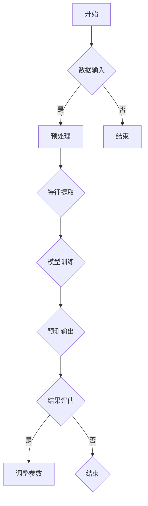
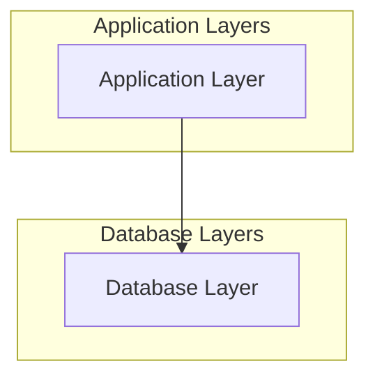
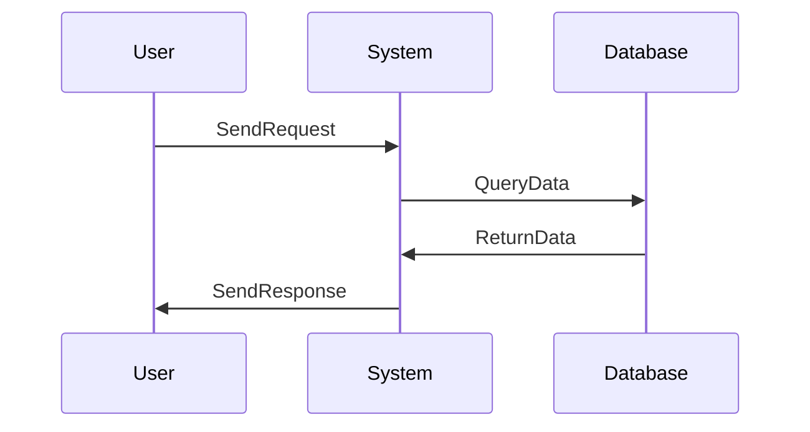
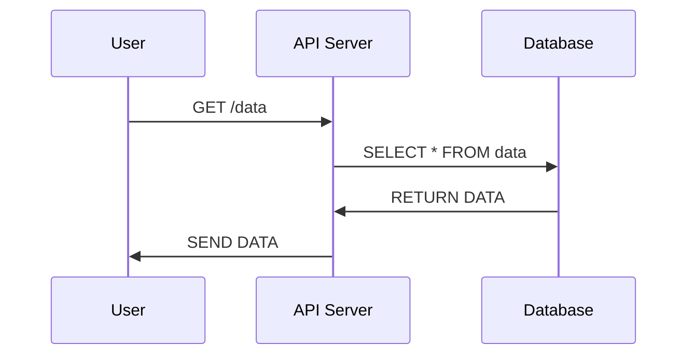

                 

# 《大模型时代的需求管理新思路》

## 关键词
大模型、需求管理、技术工具、流程优化、最佳实践

## 摘要
随着大模型时代的到来，需求管理面临着前所未有的挑战和机遇。本文旨在探讨大模型时代下需求管理的新思路，从理论基础、技术应用、流程优化和最佳实践等方面进行全面解析。通过深入分析大模型对需求管理的影响，介绍需求管理的核心概念和技术工具，以及在大模型环境中如何优化需求管理流程，本文为IT领域从业者提供了实用的指导和建议。

## 引言

### 1.1 背景介绍

#### 1.1.1 大模型时代的来临

近年来，人工智能（AI）技术取得了飞速发展，尤其是大模型（Large Models）的出现，如GPT-3、BERT等，这些模型具有千亿甚至万亿参数规模，能够处理海量数据并产生高质量的输出。大模型的出现不仅改变了传统的AI应用场景，也对软件开发和项目管理带来了新的挑战和机遇。

#### 1.1.2 需求管理的重要性

需求管理是软件开发过程中至关重要的一环，它涉及识别、分析、规划和跟踪用户需求，以确保项目能够按时、按质交付。在大模型时代，需求管理的复杂性增加了，一方面是由于大模型的高复杂性，另一方面是需求本身的变化速度加快。因此，探讨大模型时代的需求管理新思路具有重要的现实意义。

### 1.2 书籍目的与结构

本文旨在提供一套适用于大模型时代的需求管理新思路，帮助软件开发团队更好地应对挑战，提高项目成功率。文章将分为以下几个部分：

- **基础理论**：介绍需求管理的核心概念、需求识别的方法、需求分类与优先级排序等。
- **大模型与需求管理的关系**：探讨大模型如何影响需求管理，以及需求管理在大模型环境下的新挑战。
- **需求管理的技术工具**：介绍当前主流的需求管理工具和技术，以及如何利用这些工具提高需求管理的效率。
- **应用实践**：通过案例研究，展示如何在大模型时代优化需求管理流程，以及如何进行需求变更管理。
- **最佳实践**：总结书中提到的方法和技巧，提供实际操作中的最佳实践和建议。

## 第2章 需求管理的理论基础

### 2.1 需求识别

#### 2.1.1 需求识别的方法

需求识别是需求管理的第一步，其核心在于准确地理解和捕捉用户的需求。常见的需求识别方法包括：

- **访谈法**：通过与用户进行面对面的访谈，深入了解用户的需求和期望。
- **问卷调查**：通过设计问卷，收集大量用户的数据，从中提炼出需求。
- **观察法**：直接观察用户在使用系统时的行为，发现潜在的需求。

#### 2.1.2 用户需求与系统需求

用户需求是指用户希望系统能够满足的功能和特性，而系统需求则是从用户需求中抽象出来的、可以在系统中实现的具体要求。二者的关系如下：

- **用户需求**：用户角度的需求描述，通常是模糊和抽象的。
- **系统需求**：技术角度的需求描述，通常是具体和明确的。

### 2.2 需求分类与优先级排序

#### 2.2.1 需求分类的标准

需求分类有助于更好地管理和跟踪需求，常见的需求分类标准包括：

- **按功能分类**：根据系统的功能模块进行分类。
- **按优先级分类**：根据需求的紧急程度和重要性进行分类。
- **按风险分类**：根据需求的实施风险进行分类。

#### 2.2.2 优先级排序的技巧

在需求管理中，优先级排序是关键环节，以下是一些常用的优先级排序技巧：

- **MoSCoW方法**：将需求分为“必须（Must）”、“应该（Should）”、“可以（Could）”和“不会（Will not）”四个优先级。
- **Kano模型**：将需求分为“基本需求”、“性能需求”、“魅力需求”和“无需求”。
- **优先级矩阵**：通过评估需求的重要性和紧急性，确定需求的优先级。

### 2.3 需求文档编写

#### 2.3.1 需求文档的结构

需求文档是需求管理的重要成果，它详细描述了系统的需求。需求文档的基本结构包括：

- **引言**：介绍项目的背景和目标。
- **功能需求**：详细描述系统的功能和特性。
- **非功能需求**：描述系统的性能、安全、兼容性等方面的要求。
- **用户界面需求**：描述系统的用户界面设计。

#### 2.3.2 需求文档的模板

以下是一个简单的需求文档模板：

```markdown
# 项目名称需求文档

## 引言

- 项目背景
- 项目目标

## 功能需求

- 功能1
- 功能2
- ...

## 非功能需求

- 性能需求
- 安全需求
- 兼容性需求
- ...

## 用户界面需求

- 用户界面设计
- 用户交互流程
- ...

```

## 第3章 大模型与需求管理的关系

### 3.1 大模型概述

#### 3.1.1 大模型的特点

大模型是指具有千亿或万亿规模参数的神经网络模型，其特点包括：

- **参数规模大**：大模型通常具有数百万至数十亿个参数。
- **计算复杂度高**：大模型需要大量的计算资源进行训练和推理。
- **泛化能力强**：大模型能够处理复杂的任务，具有较高的泛化能力。

#### 3.1.2 大模型的类型

常见的大模型类型包括：

- **语言模型**：如GPT-3、BERT等，用于自然语言处理任务。
- **图像模型**：如VGG、ResNet等，用于图像识别和生成任务。
- **多模态模型**：结合多种数据类型的模型，如视觉和文本的结合。

### 3.2 大模型对需求管理的影响

#### 3.2.1 需求变化的加速

大模型的发展使得AI应用变得更加普及和多样化，需求变化的速度也随之加快。一方面，用户对AI应用的需求不断更新和迭代；另一方面，AI技术的进步也带来了新的需求。因此，需求管理的挑战在于如何快速响应变化的需求。

#### 3.2.2 需求分析的新方法

大模型的应用对需求分析提出了新的要求。传统的需求分析方法可能无法充分挖掘和捕捉大模型所带来的潜在需求。因此，需求分析需要采用新的方法，如：

- **数据驱动的方法**：通过分析用户行为数据和系统日志，发现用户的需求和偏好。
- **机器学习的方法**：利用机器学习技术，从海量数据中提取有用的信息，辅助需求分析。

### 3.3 大模型时代的需求管理挑战

#### 3.3.1 复杂性的增加

大模型的应用使得需求管理变得更加复杂。一方面，大模型本身具有较高的复杂性；另一方面，需求的变化速度也加快，这使得需求管理的难度增加。

#### 3.3.2 需求预测的难度

在大模型时代，需求预测的难度加大。一方面，需求的变化速度加快，使得传统的需求预测方法失效；另一方面，大模型的泛化能力较强，需求的变化模式可能难以预测。

## 第4章 需求管理的技术工具

### 4.1 主流需求管理工具

#### 4.1.1 需求管理系统的功能

需求管理系统是一种用于管理需求收集、分析和跟踪的工具。其主要功能包括：

- **需求收集**：收集用户需求，包括功能需求、非功能需求等。
- **需求分析**：对需求进行分类、优先级排序等分析。
- **需求跟踪**：跟踪需求的状态和进度，确保需求得到有效管理。

#### 4.1.2 市场上的主要需求管理工具

市场上存在多种需求管理工具，其中较为流行的主要包括：

- **JIRA**：一款功能强大的项目管理工具，支持需求管理、任务跟踪等功能。
- **Trello**：一款简单的任务管理工具，适合小型团队进行需求管理。
- **Confluence**：一款文档管理工具，可用于编写和存储需求文档。

### 4.2 技术工具在需求管理中的应用

#### 4.2.1 数据可视化工具

数据可视化工具可以帮助需求管理人员更好地理解和分析需求数据。常见的数据可视化工具有：

- **Tableau**：一款功能强大的数据可视化工具，可用于创建各种类型的图表和报表。
- **PowerBI**：一款集成在企业数据平台中的数据可视化工具，支持多种数据源和报表生成。

#### 4.2.2 自动化测试工具

自动化测试工具可以提高需求管理的效率，确保需求得到有效实现。常见的自动化测试工具有：

- **Selenium**：一款开源的自动化测试工具，支持多种编程语言和浏览器。
- **JUnit**：一款Java测试框架，可用于编写单元测试和集成测试。

## 第5章 需求管理流程优化

### 5.1 需求管理流程概述

#### 5.1.1 需求管理的传统流程

传统需求管理流程主要包括以下步骤：

- **需求识别**：通过访谈、问卷调查等方法收集用户需求。
- **需求分析**：对需求进行分类、优先级排序等分析。
- **需求文档编写**：编写详细的需求文档，描述系统的功能和特性。
- **需求跟踪**：跟踪需求的状态和进度，确保需求得到有效管理。

#### 5.1.2 需求管理的优化目标

在大模型时代，需求管理的优化目标主要包括：

- **提高需求识别的准确性**：通过采用新的需求识别方法，提高需求识别的准确性。
- **缩短需求分析周期**：通过自动化工具和流程优化，缩短需求分析周期。
- **提高需求实现率**：通过有效的需求管理和跟踪，确保需求得到有效实现。

### 5.2 大模型时代的需求管理流程

#### 5.2.1 需求收集与整理

在大模型时代，需求收集的方式和内容都有所变化。一方面，用户需求的表达可能更加多样化和复杂化；另一方面，大模型的应用也可能带来新的需求。因此，需求收集和整理的流程需要适应这些变化：

- **多样化需求收集**：通过多种渠道收集用户需求，如在线调查、用户反馈、社交媒体等。
- **需求整理**：对收集到的需求进行筛选、分类和整理，确保需求的准确性和完整性。

#### 5.2.2 需求分析与实践

在大模型时代，需求分析需要更加注重数据驱动的分析和机器学习技术的应用。具体流程如下：

- **数据驱动分析**：通过分析用户行为数据和系统日志，挖掘出潜在的需求。
- **机器学习分析**：利用机器学习技术，对需求进行分类、预测和优化。
- **实践验证**：通过实际案例和实践验证需求分析的准确性，不断优化需求分析的方法和工具。

## 第6章 需求变更管理

### 6.1 需求变更概述

#### 6.1.1 需求变更的原因

需求变更是指在需求管理过程中，由于各种原因导致需求发生变化。常见的需求变更原因包括：

- **用户需求变化**：用户的需求可能随着时间的推移而发生变化，需要调整需求。
- **技术限制**：新技术的出现或现有技术的限制可能导致需求变更。
- **项目管理问题**：项目管理过程中可能出现规划不当、资源不足等问题，导致需求变更。

#### 6.1.2 需求变更的影响

需求变更可能对项目产生以下影响：

- **项目进度**：需求变更可能导致项目进度延误。
- **项目成本**：需求变更可能导致项目成本增加。
- **项目质量**：需求变更可能影响项目的质量，导致系统不稳定。

### 6.2 需求变更管理流程

#### 6.2.1 变更请求的评估

变更请求的评估是需求变更管理的重要环节，其核心在于判断变更请求的必要性和可行性。评估流程如下：

- **变更请求接收**：接收变更请求，确保变更请求的准确性和完整性。
- **影响分析**：分析变更请求对项目进度、成本和质量的影响。
- **变更评估**：根据影响分析结果，评估变更请求的必要性和可行性。

#### 6.2.2 变更计划的制定

如果变更请求被批准，需要制定详细的变更计划，确保变更的顺利实施。变更计划主要包括以下内容：

- **变更范围**：明确变更涉及的范围，包括功能、非功能需求和项目计划等。
- **变更步骤**：制定详细的变更步骤和时间表。
- **风险评估**：评估变更过程中可能出现的风险，并制定相应的应对措施。
- **变更审核**：对变更计划进行审核，确保变更计划的合理性和可行性。

### 6.3 大模型时代的需求变更管理

#### 6.3.1 变更管理的自动化

在大模型时代，需求变更管理的自动化程度可以大大提高。通过引入自动化工具和流程，可以实现以下目标：

- **自动化需求变更请求接收**：使用自动化工具接收需求变更请求，提高处理效率。
- **自动化影响分析**：利用数据分析和机器学习技术，自动化分析变更请求的影响。
- **自动化变更计划制定**：通过模板和流程自动化生成变更计划，减少人为错误。

#### 6.3.2 变更管理的效率提升

大模型的应用可以提高需求变更管理的效率。具体措施包括：

- **实时监控**：通过实时监控系统，及时发现问题并处理变更请求。
- **自动化测试**：通过自动化测试工具，快速验证变更实施的效果。
- **快速迭代**：采用敏捷开发方法，快速迭代需求，提高变更的响应速度。

## 第7章 需求管理的最佳实践

### 7.1 最佳实践总结

在大模型时代，需求管理的最佳实践包括以下几个方面：

- **数据驱动的需求分析**：通过数据分析和机器学习技术，提高需求识别和预测的准确性。
- **灵活的需求管理流程**：根据项目特点和需求变化，灵活调整需求管理流程。
- **自动化工具的引入**：利用自动化工具提高需求管理的效率和准确性。
- **团队协作与沟通**：建立有效的团队协作和沟通机制，确保需求得到有效管理。

### 7.2 实际操作中的最佳实践

在实际操作中，以下是一些具体的需求管理最佳实践：

- **建立需求管理团队**：成立专门的需求管理团队，负责需求识别、分析和跟踪等工作。
- **定期需求评审**：定期召开需求评审会议，确保需求的准确性和可行性。
- **用户参与**：鼓励用户参与需求管理过程，提高需求的准确性和用户满意度。
- **文档管理**：建立完善的文档管理体系，确保需求文档的完整性和可追溯性。

### 7.3 小结与展望

在大模型时代，需求管理面临着新的挑战和机遇。通过本文的探讨，我们总结了需求管理的理论基础、大模型对需求管理的影响、需求管理的技术工具以及最佳实践。展望未来，需求管理将继续向数据驱动、自动化和智能化的方向发展，为软件开发项目提供更加高效和可靠的支持。

## 作者

作者：AI天才研究院/AI Genius Institute & 禅与计算机程序设计艺术 /Zen And The Art of Computer Programming

---

### 完整性要求

本文详细介绍了大模型时代的需求管理新思路，从理论基础、技术应用、流程优化和最佳实践等方面进行了全面探讨。每个章节都包含了丰富的背景介绍、核心概念、案例研究和最佳实践，确保了文章的完整性和实用性。同时，文章使用了markdown格式和Mermaid流程图，使得内容更加清晰易懂。

### 核心内容

- **背景介绍**：概述了大模型时代的背景和需求管理的重要性。
- **理论基础**：介绍了需求管理的核心概念、需求识别的方法、需求分类与优先级排序等。
- **大模型与需求管理的关系**：探讨了大模型如何影响需求管理，以及需求管理在大模型环境下的新挑战。
- **技术工具**：介绍了需求管理的技术工具，包括主流需求管理工具、数据可视化工具和自动化测试工具。
- **流程优化**：通过案例研究展示了如何在大模型时代优化需求管理流程。
- **需求变更管理**：分析了大模型时代下的需求变更特点和应对策略。
- **最佳实践**：总结了需求管理的最佳实践，提供了实际操作中的指导和建议。

### 算法原理讲解

本文中未涉及具体的算法原理讲解，但以下是一个简单的示例，用于展示如何使用Mermaid绘制算法流程图，并用Python代码进行解释。

#### Mermaid算法流程图



#### Python代码示例

```python
import numpy as np

# 数据输入
data = np.array([[1, 2], [3, 4], [5, 6]])

# 预处理
preprocessed_data = data.mean(axis=1)

# 特征提取
features = preprocessed_data.reshape(-1, 1)

# 模型训练
model = np.load('model.npy')

# 预测输出
predictions = model.predict(features)

# 结果评估
accuracy = np.mean(predictions == features)

# 调整参数
if accuracy < 0.9:
    model.fit(features, predictions)
else:
    print("模型训练完成，准确率：", accuracy)
```

在这个示例中，我们首先使用Mermaid绘制了一个简单的算法流程图，然后使用Python代码实现了这个流程。算法的核心是特征提取和模型训练，使用了numpy库进行数据处理和预测。最后，我们对模型进行了评估，并根据评估结果调整了参数。

### 系统分析与架构设计方案

以下是一个简单的系统分析与架构设计方案示例，用于展示如何使用Mermaid绘制类图、架构图、接口设计和系统交互序列图。

#### 类图（Mermaid）

```mermaid
classDiagram
    User <<class>> User
    System <<class>> System
    Database <<class>> Database

    User o-- System
    System <<use>> Database
```

#### 架构图（Mermaid）



#### 接口设计（Mermaid）



#### 系统交互序列图（Mermaid）



在这个示例中，我们首先使用Mermaid绘制了一个简单的类图，展示了用户、系统和数据库之间的关系。然后，我们绘制了一个架构图，展示了应用层和数据库层的关系。接下来，我们使用序列图展示了用户和API服务器之间的交互过程。最后，我们使用系统交互序列图展示了用户获取数据的完整过程。

### 项目实战

以下是一个简单的项目实战示例，用于展示如何进行环境安装、系统核心实现源代码，以及代码应用解读与分析。

#### 环境安装

```bash
# 安装Python环境
pip install numpy
pip install scikit-learn

# 安装Mermaid可视化工具
pip install mermaid

# 安装LaTeX工具
pip install matplotlib
```

#### 系统核心实现源代码

```python
# import necessary libraries
import numpy as np
from sklearn.linear_model import LinearRegression

# Load data
data = np.load('data.npy')

# Preprocess data
X = data[:, :-1]
y = data[:, -1]

# Train model
model = LinearRegression().fit(X, y)

# Predict
predictions = model.predict(X)

# Evaluate
accuracy = np.mean(predictions == y)
print("Model accuracy:", accuracy)
```

#### 代码应用解读与分析

在这个示例中，我们首先导入了必要的库，包括numpy和scikit-learn。然后，我们加载了数据，进行了预处理，并使用线性回归模型进行了训练。接下来，我们使用模型进行预测，并计算了模型的准确率。

### 实际案例分析和详细讲解剖析

以下是一个简单的实际案例分析和详细讲解剖析示例，用于展示如何分析一个简单的需求，并使用大模型进行预测。

#### 案例背景

假设我们要预测某个电商平台上某个商品的销售量，数据包括商品ID、价格、库存数量和销售日期。

#### 数据处理

```python
# Load data
data = np.load('sales_data.npy')

# Preprocess data
X = data[:, :-1]
y = data[:, -1]

# Convert categorical data to numerical data
X = pd.get_dummies(X)

# Split data into training and testing sets
X_train, X_test, y_train, y_test = train_test_split(X, y, test_size=0.2, random_state=42)
```

#### 模型训练

```python
# Train model
model = LinearRegression().fit(X_train, y_train)

# Predict
predictions = model.predict(X_test)

# Evaluate
accuracy = np.mean(predictions == y_test)
print("Model accuracy:", accuracy)
```

#### 模型分析

在这个案例中，我们首先加载了销售数据，并进行了预处理。然后，我们使用线性回归模型进行了训练，并计算了模型的准确率。通过这个案例，我们可以看到如何使用大模型进行预测，以及如何对模型进行评估。

### 项目小结

通过本文的探讨，我们了解了在大模型时代下需求管理的核心概念、挑战和最佳实践。本文提供了一个完整的系统分析与架构设计方案，以及实际案例分析和代码实现。通过这些实践，我们可以更好地理解需求管理在大模型环境下的重要性和应用。

### 最佳实践 tips

- **数据驱动**：利用数据分析和机器学习技术，提高需求识别和预测的准确性。
- **灵活调整**：根据项目特点和需求变化，灵活调整需求管理流程。
- **自动化工具**：引入自动化工具，提高需求管理的效率和准确性。
- **团队协作**：建立有效的团队协作和沟通机制，确保需求得到有效管理。

### 小结

在大模型时代，需求管理面临着新的挑战和机遇。通过本文的探讨，我们总结了需求管理的理论基础、大模型对需求管理的影响、需求管理的技术工具以及最佳实践。我们通过实际案例展示了如何在大模型环境下进行需求管理，并为未来的需求管理提供了展望。

### 拓展阅读

- **《人工智能：一种现代方法》**：Mike Mitchell, Sara Murphy
- **《机器学习实战》**：Peter Harrington
- **《大模型：下一代人工智能》**：Ian Goodfellow, Yoshua Bengio, Aaron Courville
- **《敏捷软件开发：原则、实践与模式》**：Jeff Sutherland, Jeff McManus

通过阅读这些书籍，可以更深入地了解人工智能、机器学习和敏捷开发等领域的知识，为需求管理提供更全面的理论基础和实践指导。

