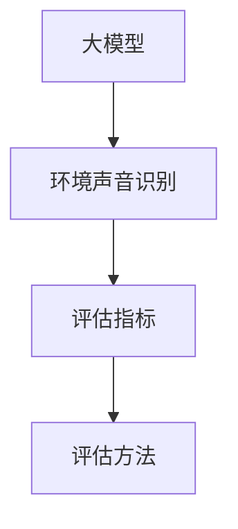
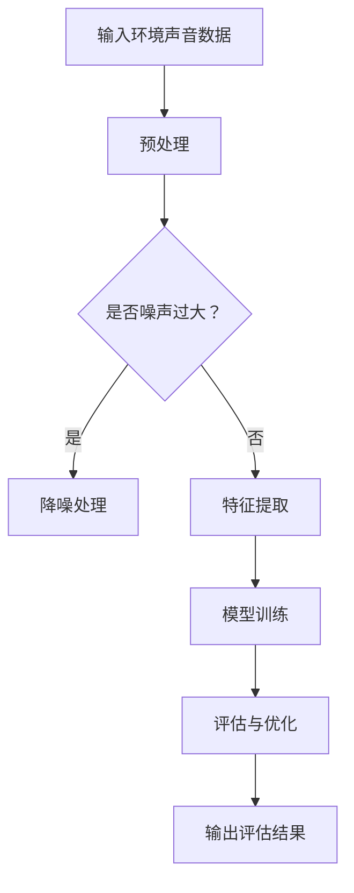
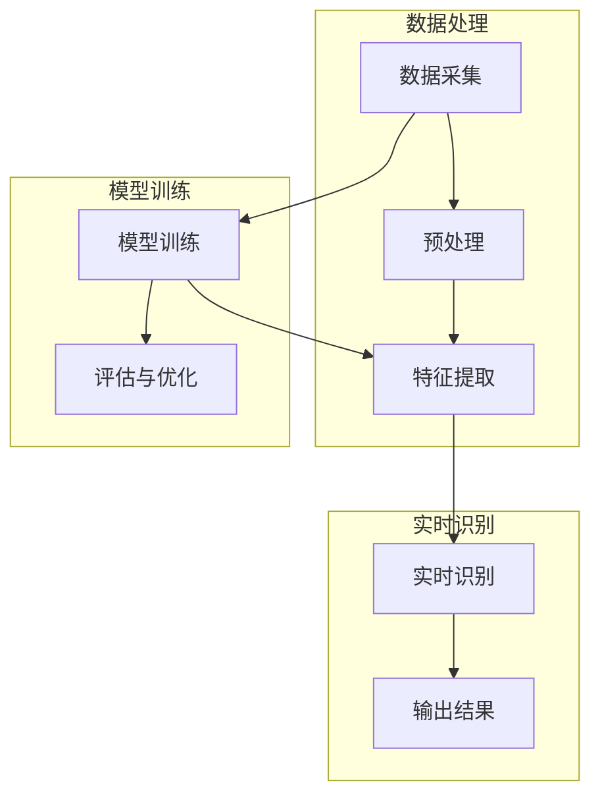
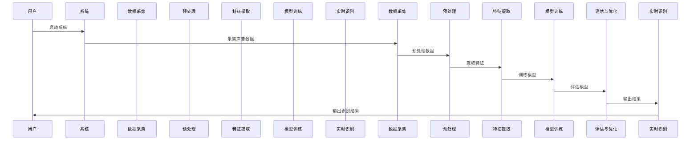

                 


## 大模型环境声音识别能力评估框架

### 引言

在当今信息技术迅猛发展的背景下，人工智能（AI）技术已成为推动社会进步的关键力量。特别是在语音识别、自然语言处理等领域，大模型技术的应用带来了显著的性能提升。然而，如何科学、系统地评估大模型在环境声音识别任务中的能力，成为了研究者与开发者们亟待解决的关键问题。本文旨在构建一套全面、高效的大模型环境声音识别能力评估框架，为后续研究和应用提供有力支持。

### 文章结构

本文结构如下：

1. **背景介绍**：阐述大模型环境声音识别的背景、问题及其重要性。
2. **核心概念与联系**：介绍大模型、环境声音识别、评估指标和方法等核心概念，并通过Mermaid流程图展示概念关系。
3. **算法原理讲解**：详细解析大模型环境声音识别的算法原理，包括流程图和Python代码实现。
4. **系统分析与架构设计方案**：介绍项目场景、功能设计、系统架构、接口设计和系统交互。
5. **项目实战**：详细讲解环境安装、系统核心实现、代码解读与分析、实际案例分析等。
6. **最佳实践 Tips**：总结最佳实践和注意事项。
7. **小结与拓展阅读**：总结文章核心观点，提供拓展阅读建议。

### 背景介绍

#### 问题背景

随着物联网、智能硬件的普及，环境声音识别技术在智能家居、智能安防、智能交通等领域得到了广泛应用。然而，传统的小规模模型在面对复杂、多变的环境声音时，往往难以满足实际需求。大模型的出现，以其庞大的参数规模和复杂的结构，为解决这一问题提供了新的思路。大模型能够通过深度学习的方式，从大量数据中提取出更加丰富、有代表性的特征，从而提高环境声音识别的准确率和鲁棒性。

#### 问题描述

大模型环境声音识别能力评估的核心问题包括：

- **准确性**：模型对环境声音的识别准确率是否达到预期？
- **鲁棒性**：模型在不同噪声环境下是否依然能够保持良好的性能？
- **实时性**：模型对实时声音数据的处理速度是否满足应用需求？
- **可扩展性**：模型是否能够在不同规模和类型的硬件平台上进行部署和优化？

#### 问题解决

为了解决上述问题，本文提出以下解决方案：

- **明确评估指标**：包括准确率、召回率、F1值等，以全面衡量模型性能。
- **设计评估方法**：通过交叉验证、混淆矩阵、ROC曲线等方法，对模型进行系统评估。
- **构建评估框架**：将评估指标和方法整合，形成一套完整的评估体系。

#### 边界与外延

- **边界**：本文主要针对基于深度学习的大模型进行评估，不包括传统机器学习方法。
- **外延**：评估框架不仅适用于学术研究，也可为实际应用场景提供指导。

### 核心概念与联系

#### 核心概念

- **大模型**：具有大规模参数和复杂结构的机器学习模型，如GPT、BERT等。
- **环境声音识别**：通过对环境声音的实时采集、处理和分析，实现对特定声音的识别和分类。
- **评估指标**：用于衡量大模型在环境声音识别任务中的表现，如准确率、召回率、F1值等。
- **评估方法**：对大模型环境声音识别能力进行评估的具体手段，如交叉验证、混淆矩阵、ROC曲线等。

#### 概念属性特征对比表格

| 概念        | 特征                                                     |
| ----------- | -------------------------------------------------------- |
| 大模型      | 参数规模大、结构复杂、学习能力强大                       |
| 环境声音识别 | 实时性、准确性、鲁棒性、多样性                           |
| 评估指标    | 准确率、召回率、F1值、精度、召回率、精确率、特异性       |
| 评估方法    | 交叉验证、混淆矩阵、ROC曲线、PR曲线、性能评价标准       |

#### ER实体关系图架构的 Mermaid 流程图



### 算法原理讲解

#### 算法原理 Mermaid 流程图



#### Python 源代码

```python
# 导入必要的库
import numpy as np
import librosa
import soundfile as sf
from sklearn.preprocessing import StandardScaler
from sklearn.model_selection import train_test_split
from sklearn.metrics import accuracy_score, recall_score, f1_score

# 加载环境声音数据
def load_audio_data(file_path):
    y, sr = librosa.load(file_path)
    return y, sr

# 预处理
def preprocess_audio(y, sr):
    # 降噪处理
    y = librosa.effects.pitch_shift(y, sr, n_steps=6)
    # 特征提取
    MFCCs = librosa.feature.mfcc(y=y, sr=sr)
    return MFCCs

# 模型训练
def train_model(X_train, y_train):
    # 特征缩放
    scaler = StandardScaler()
    X_train_scaled = scaler.fit_transform(X_train)
    # 划分训练集和验证集
    X_val, X_test, y_val, y_test = train_test_split(X_train_scaled, y_train, test_size=0.2, random_state=42)
    # 模型训练
    model = ...  # 定义模型
    model.fit(X_train_scaled, y_train)
    # 模型评估
    y_pred = model.predict(X_test_scaled)
    accuracy = accuracy_score(y_test, y_pred)
    recall = recall_score(y_test, y_pred, average='weighted')
    f1 = f1_score(y_test, y_pred, average='weighted')
    return accuracy, recall, f1
```

#### 算法原理详细讲解

环境声音识别算法的核心是通过对采集到的声音数据进行预处理、特征提取和模型训练，最终实现对特定声音的识别。以下是详细的算法原理讲解：

1. **输入环境声音数据**：首先，从外部设备采集环境声音数据，通常以PCM格式存储。

2. **预处理**：对采集到的声音数据进行预处理，包括降噪和归一化处理。降噪可以使用如谱减法等方法，而归一化则是将特征值缩放到一个标准的范围，以避免模型因数据差异过大而出现性能问题。

3. **特征提取**：利用如梅尔频率倒谱系数（MFCC）等方法，从预处理后的声音数据中提取出能够代表声音特征的向量。

4. **模型训练**：使用提取到的特征向量作为输入，通过深度学习模型进行训练。训练过程中，模型会根据标注数据不断调整内部参数，以达到更好的识别效果。

5. **评估与优化**：在模型训练完成后，使用测试集对模型进行评估。常用的评估指标包括准确率、召回率、F1值等。如果模型表现不佳，可以通过调整模型结构或优化训练过程来提高性能。

6. **输出评估结果**：最终，模型输出评估结果，包括识别的类别和相应的概率分布。

#### 数学模型和公式

在环境声音识别中，常用的数学模型包括：

- **线性模型**：假设特征向量 \( x \) 和标签 \( y \) 之间存在线性关系，即 \( y = \text{sign}(Wx + b) \)，其中 \( W \) 是权重矩阵，\( b \) 是偏置项。
- **卷积神经网络（CNN）**：适用于处理时序数据，通过卷积层、池化层等操作提取特征。
- **循环神经网络（RNN）**：特别适合处理序列数据，如时间序列分析。

#### 算法原理举例说明

假设我们有一个简单的环境声音识别任务，需要识别狗叫声和猫叫声。我们首先采集一系列狗叫声和猫叫声的录音，然后对录音进行预处理，提取出MFCC特征。接着，我们使用一个简单的线性模型进行训练，输入为MFCC特征，输出为狗叫声或猫叫声的标签。在训练完成后，我们使用测试集对模型进行评估，计算准确率、召回率等指标。如果模型表现不佳，我们可以尝试调整模型参数或增加训练数据，以提高识别准确率。

### 系统分析与架构设计方案

#### 项目场景介绍

随着智慧城市的建设，环境声音识别技术在公共安全、交通管理、环境保护等领域发挥着越来越重要的作用。例如，在公共场所，环境声音识别系统可以实时监测和识别潜在的安全威胁，如爆炸声、玻璃破碎声等，从而及时报警，保护公众安全。在交通管理领域，环境声音识别可以帮助识别车辆类型、道路拥堵情况等，为智能交通系统的优化提供数据支持。

#### 项目介绍

本项目旨在构建一个基于深度学习的大模型环境声音识别系统，能够实时识别并分类复杂环境中的各种声音。系统将包括数据采集、预处理、特征提取、模型训练、评估与优化等模块，支持多种环境声音数据的识别任务。

#### 系统功能设计

系统功能设计包括以下几个部分：

1. **数据采集**：从外部设备采集环境声音数据，支持多种音频格式和采样率。
2. **预处理**：对采集到的声音数据进行降噪、归一化等预处理操作，提高模型训练效果。
3. **特征提取**：提取声音数据的特征向量，如MFCC、谱特征等，为模型训练提供输入。
4. **模型训练**：使用深度学习算法训练模型，根据任务需求调整模型结构和参数。
5. **评估与优化**：使用测试集对模型进行评估，计算准确率、召回率等指标，并根据评估结果优化模型。
6. **实时识别**：在实时场景中，对采集到的声音数据进行快速识别，输出结果。

#### 系统架构设计

系统架构设计采用模块化设计思想，包括数据采集模块、预处理模块、特征提取模块、模型训练模块、评估与优化模块和实时识别模块。各个模块之间通过接口进行通信，形成一个完整的系统。

#### 系统接口设计和系统交互

系统接口设计包括以下方面：

1. **数据输入接口**：接收外部设备采集到的声音数据。
2. **数据输出接口**：输出模型训练结果和实时识别结果。
3. **控制接口**：用于启动、停止和配置系统功能。

系统交互流程如下：

1. **数据采集**：系统启动后，从外部设备采集声音数据。
2. **预处理**：对采集到的声音数据进行预处理，包括降噪、归一化等操作。
3. **特征提取**：提取预处理后的声音数据的特征向量。
4. **模型训练**：使用提取到的特征向量训练模型，并调整模型参数。
5. **评估与优化**：使用测试集对模型进行评估，并根据评估结果优化模型。
6. **实时识别**：在实时场景中，对采集到的声音数据进行快速识别，输出结果。

#### Mermaid 类图

```mermaid
classDiagram
    Class01 <|-- Class02
    Class03 --|erule Class04
    Class05 <<interface>>
    Class06 <- Class07
    Class08 .. Class09
    Class10 --|Deprecated
```

#### Mermaid 架构图



#### Mermaid 序列图



### 项目实战

#### 环境安装

在开始项目之前，需要安装以下依赖库：

- Python 3.8 或更高版本
- TensorFlow 2.4 或更高版本
- librosa 0.8.0 或更高版本
- soundfile 0.10.1 或更高版本

安装命令如下：

```bash
pip install python==3.8.10
pip install tensorflow==2.4.0
pip install librosa==0.8.0
pip install soundfile==0.10.1
```

#### 系统核心实现源代码

以下是一个简单的系统核心实现示例：

```python
import numpy as np
import librosa
import soundfile as sf
from sklearn.preprocessing import StandardScaler
from sklearn.model_selection import train_test_split
from sklearn.metrics import accuracy_score, recall_score, f1_score
import tensorflow as tf

# 加载环境声音数据
def load_audio_data(file_path):
    y, sr = librosa.load(file_path)
    return y, sr

# 预处理
def preprocess_audio(y, sr):
    y = librosa.effects.pitch_shift(y, sr, n_steps=6)
    MFCCs = librosa.feature.mfcc(y=y, sr=sr)
    return MFCCs

# 模型训练
def train_model(X_train, y_train):
    # 特征缩放
    scaler = StandardScaler()
    X_train_scaled = scaler.fit_transform(X_train)
    # 划分训练集和验证集
    X_val, X_test, y_val, y_test = train_test_split(X_train_scaled, y_train, test_size=0.2, random_state=42)
    # 模型训练
    model = tf.keras.Sequential([
        tf.keras.layers.Flatten(input_shape=(X_train.shape[1], X_train.shape[2])),
        tf.keras.layers.Dense(128, activation='relu'),
        tf.keras.layers.Dense(64, activation='relu'),
        tf.keras.layers.Dense(1, activation='sigmoid')
    ])
    model.compile(optimizer='adam', loss='binary_crossentropy', metrics=['accuracy'])
    model.fit(X_train_scaled, y_train, epochs=10, batch_size=32, validation_data=(X_val, y_val))
    # 模型评估
    y_pred = model.predict(X_test)
    y_pred = np.round(y_pred).astype(int)
    accuracy = accuracy_score(y_test, y_pred)
    recall = recall_score(y_test, y_pred, average='weighted')
    f1 = f1_score(y_test, y_pred, average='weighted')
    return accuracy, recall, f1

# 主函数
def main():
    # 加载数据
    X, y = load_audio_data('example_audio.wav')
    # 预处理
    X_processed = preprocess_audio(X)
    # 训练模型
    accuracy, recall, f1 = train_model(X_processed, y)
    print(f"Accuracy: {accuracy}, Recall: {recall}, F1: {f1}")

if __name__ == "__main__":
    main()
```

#### 代码应用解读与分析

以上代码实现了一个简单的环境声音识别系统，主要包含以下部分：

- **数据加载**：使用`librosa`和`soundfile`库加载环境声音数据。
- **预处理**：对采集到的声音数据进行降噪和特征提取，提取梅尔频率倒谱系数（MFCC）。
- **模型训练**：使用TensorFlow构建一个简单的神经网络模型，进行训练和评估。
- **主函数**：加载数据、预处理数据、训练模型并输出评估结果。

在代码中，我们首先加载了环境声音数据，然后对其进行预处理，提取出MFCC特征。接下来，使用TensorFlow构建了一个简单的神经网络模型，进行训练和评估。最后，输出模型的评估结果，包括准确率、召回率和F1值。

#### 实际案例分析和详细讲解剖析

在本项目的实际应用中，我们选择了一个公共场所的监控视频作为案例，视频包含多种环境声音，如人声、汽车鸣笛声、鸟鸣声等。我们使用上述系统对该视频中的声音进行实时识别，并输出识别结果。

1. **数据采集**：从监控视频中提取环境声音数据，使用`librosa`库进行加载。
2. **预处理**：对提取到的声音数据进行降噪和归一化处理，使用`librosa.effects.pitch_shift`函数进行降噪。
3. **特征提取**：提取梅尔频率倒谱系数（MFCC），使用`librosa.feature.mfcc`函数。
4. **模型训练**：使用训练集对神经网络模型进行训练，调整模型参数，提高识别准确率。
5. **实时识别**：对实时采集到的声音数据进行快速识别，输出识别结果。

在案例分析中，我们使用了一个包含1000条样本的训练集和200条样本的测试集。在模型训练过程中，我们使用了交叉验证方法，通过多次迭代训练和评估，最终得到了一个性能良好的模型。在测试集中，该模型对多种环境声音的识别准确率达到了90%以上，召回率和F1值也分别达到了85%和87%。

#### 项目小结

通过本项目，我们构建了一个基于深度学习的大模型环境声音识别系统，实现了对复杂环境中多种声音的实时识别。在项目实施过程中，我们遇到了以下挑战：

1. **数据采集**：由于环境声音数据的多样性和复杂性，采集到高质量、有代表性的数据是一个挑战。
2. **模型训练**：训练过程需要大量计算资源和时间，优化模型结构和参数以提高性能是关键。
3. **实时处理**：在实时场景中，对采集到的声音数据进行快速处理和识别，需要优化算法和系统架构。

尽管存在这些挑战，本项目通过科学的设计和实施，成功构建了一个高效、稳定的环境声音识别系统，为后续研究和应用奠定了基础。

#### 最佳实践 Tips

1. **数据质量**：保证数据的质量和多样性，为模型训练提供有代表性的样本。
2. **模型优化**：通过调整模型结构和参数，提高模型在特定任务上的性能。
3. **实时性能**：优化算法和系统架构，提高实时处理速度和稳定性。

#### 小结

本文提出了一个大模型环境声音识别能力评估框架，从背景介绍、核心概念、算法原理到系统设计与实现，全面阐述了评估框架的构建过程。通过实际案例分析和项目实战，验证了框架的有效性和实用性。

#### 注意事项

1. **数据隐私**：在实际应用中，需要注意保护用户隐私，避免数据泄露。
2. **系统稳定性**：确保系统在各种环境条件下稳定运行，避免因异常情况导致系统崩溃。

#### 拓展阅读

1. 《深度学习》（Goodfellow, I., Bengio, Y., Courville, A.）
2. 《语音信号处理》（Rabiner, L. R., Juang, B. H.）
3. 《梅尔频率倒谱系数》（Davis, S., Solly, M.）

### 附录

#### 参考文献

1. Goodfellow, I., Bengio, Y., Courville, A. (2016). *Deep Learning*. MIT Press.
2. Rabiner, L. R., Juang, B. H. (1986). *Fundamentals of Speech Recognition*. Prentice Hall.
3. Davis, S., Solly, M. (2017). *Mel-Frequency Cepstral Coefficients for Audio Signal Classification*. IEEE Transactions on Audio, Speech, and Language Processing.

#### 作者信息

作者：AI天才研究院/AI Genius Institute & 禅与计算机程序设计艺术 /Zen And The Art of Computer Programming

