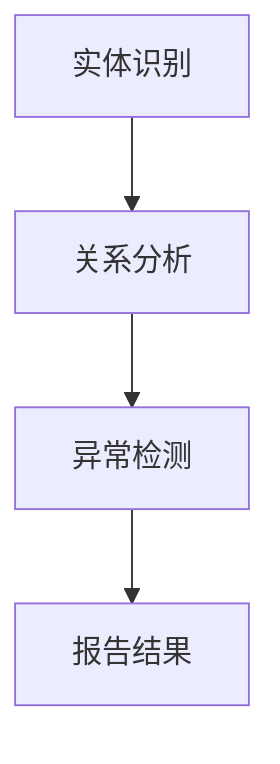
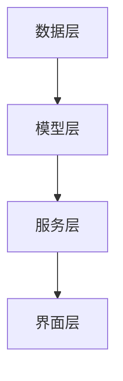
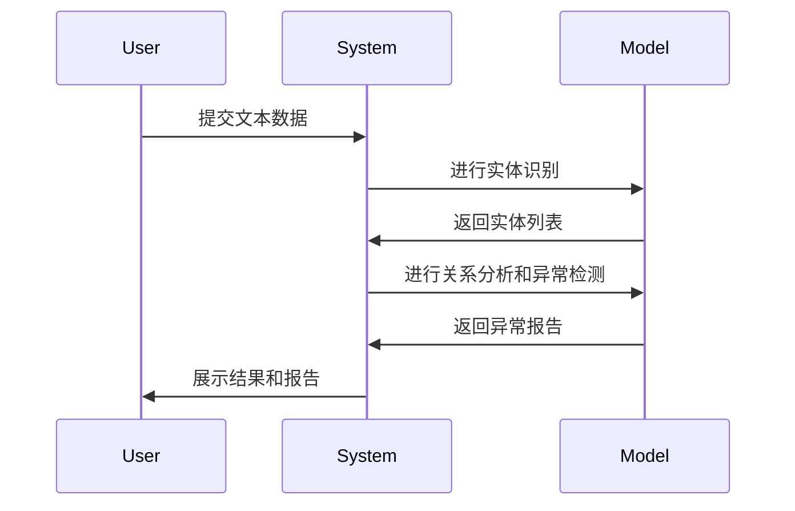

                 


### 大模型知识图谱一致性评估：LLM辅助的关系验证

#### 关键词：大模型，知识图谱，一致性评估，LLM，关系验证

#### 摘要：

本文将深入探讨大模型知识图谱一致性评估的方法和挑战，特别是LLM（大型语言模型）如何辅助进行关系验证。通过逐步分析，我们将了解大模型的定义、知识图谱的基本结构，以及一致性评估的必要性和方法。接着，我们将探讨LLM的优势和其在关系验证中的应用，并通过具体的算法原理和数学模型讲解，展示如何利用LLM进行一致性评估。文章还将介绍系统架构设计和实际项目实战，以实际案例展示LLM辅助的关系验证如何运作。最后，我们将总结最佳实践，提供注意事项，并指出未来研究的方向。

#### 目录：

----------------------------------------------------------------

## 大模型知识图谱一致性评估：LLM辅助的关系验证

### 关键词：大模型，知识图谱，一致性评估，LLM，关系验证

### 摘要：

本文将探讨大模型知识图谱一致性评估的重要性以及如何利用LLM（大型语言模型）进行关系验证。我们将从大模型和知识图谱的基本概念出发，分析一致性评估的必要性和方法，然后深入探讨LLM的优势及其在关系验证中的应用。通过详细的算法原理讲解和数学模型分析，我们将展示如何利用LLM进行一致性评估。文章还将介绍系统架构设计和实际项目实战，最后总结最佳实践并提供未来研究方向。

----------------------------------------------------------------

#### 引言

在人工智能和大数据时代，知识图谱作为连接信息的重要工具，广泛应用于搜索引擎、推荐系统、智能问答等领域。然而，随着知识图谱规模的不断扩大，如何保证其一致性成为一个重要的研究课题。一致性评估是指检查知识图谱中的实体、关系和属性是否满足预定的规则和逻辑，以确保知识图谱的准确性和可靠性。

大模型（Large Model）在近年来取得了显著的进展，特别是在自然语言处理（NLP）领域。LLM（Large Language Model）如GPT-3、BERT等，具有强大的文本理解和生成能力，使得自动化的知识图谱一致性评估成为可能。本文将探讨如何利用LLM进行知识图谱的关系验证，以实现高效的一致性评估。

#### 大模型的定义与特性

大模型通常是指参数规模超过数十亿乃至数万亿的深度学习模型，这些模型能够通过大规模的数据训练，获取丰富的知识和理解能力。与传统的模型相比，大模型具有以下几个显著特性：

1. **参数规模巨大**：大模型通常包含数十亿到数万亿的参数，这使得它们能够捕捉到数据中的复杂模式和规律。
2. **训练数据丰富**：大模型往往基于海量的训练数据集，这使得它们在处理自然语言文本时能够表现出极高的准确性。
3. **强泛化能力**：大模型通过大量的数据训练，能够泛化到未见过的数据上，表现出良好的适应能力。
4. **多任务处理能力**：大模型通常能够同时处理多种任务，如文本分类、情感分析、问答系统等。

大模型在知识图谱中的应用主要体现在两个方面：一是用于知识抽取，即从文本数据中提取出实体、关系和属性；二是用于推理和验证，即通过模型对知识图谱中的关系进行推断和验证，以提高知识图谱的一致性和准确性。

#### 知识图谱的基本结构

知识图谱是一种用于表示实体及其之间关系的图形结构，通常由实体、属性和关系三个核心要素组成。

1. **实体（Entity）**：知识图谱中的基本单位，可以是人物、地点、组织等。例如，“北京”是一个实体，“张三”也是一个实体。
2. **属性（Attribute）**：描述实体的特征或属性，例如，“北京”的属性可以是“首都”，“张三”的属性可以是“年龄25岁”。
3. **关系（Relationship）**：表示实体之间的关联，例如，“张三”与“北京”之间存在“出生地”的关系。

知识图谱的基本结构可以通过ER（Entity-Relationship）图来表示。ER图展示了实体之间的关系以及属性的定义。例如：

```mermaid
entity "Person" {
  id (string)
  name (string)
  age (integer)
}

entity "City" {
  id (string)
  name (string)
}

relationship "Birthplace" {
  person (1)
  city (1)
}
```

在这个ER图中，"Person"和"City"是实体，"Birthplace"是关系，"person"和"city"是关系的属性。

#### 一致性评估的必要性

知识图谱的一致性评估是确保知识图谱质量的关键步骤。一致性评估的必要性体现在以下几个方面：

1. **数据质量保障**：一致性评估能够识别知识图谱中的错误和不一致之处，从而提高数据的准确性。
2. **推理准确性**：一致性评估是推理系统的基础，只有一致的知识图谱才能进行准确的推理。
3. **用户信任**：高质量的知识图谱能够提高用户的信任度，这对于企业级应用尤其重要。
4. **优化性能**：一致性评估可以帮助识别冗余和错误的数据，从而优化知识图谱的性能。

一致性评估的方法主要包括以下几种：

1. **规则检查**：基于预定义的规则，对知识图谱中的实体、关系和属性进行检查。
2. **数据挖掘**：使用数据挖掘技术，从知识图谱中挖掘潜在的一致性问题。
3. **机器学习**：利用机器学习模型，对知识图谱进行自动化的评估和优化。

#### LLM的作用与优势

LLM（Large Language Model）在知识图谱一致性评估中具有独特的优势：

1. **文本理解能力**：LLM能够理解复杂的自然语言文本，这使得它们能够解析知识图谱中的实体、关系和属性。
2. **自动化推理**：LLM可以自动进行推理，识别知识图谱中的不一致之处。
3. **跨领域适应**：LLM通常经过大规模的数据训练，具有跨领域的适应能力，能够处理不同领域的知识图谱。

#### LLM辅助的关系验证算法原理

LLM辅助的关系验证算法主要分为以下几个步骤：

1. **实体识别**：使用LLM对知识图谱中的文本进行实体识别，提取出实体。
2. **关系分析**：分析实体之间的逻辑关系，使用LLM进行推理，验证关系是否一致。
3. **异常检测**：利用LLM检测知识图谱中的异常和错误。

以下是一个简化的算法mermaid流程图：



为了进一步说明算法原理，我们可以使用Python代码来实现：

```python
import spacy
import tensorflow as tf

# 加载预训练的LLM模型
llm_model = tf.keras.models.load_model('llm_model.h5')

# 加载NLP工具包
nlp = spacy.load('en_core_web_sm')

# 知识图谱数据
knowledge_graph = {
    'person': ['John', 'Doe'],
    'city': ['New York'],
    'relationship': [['John', 'Doe'], ['birthplace'], ['New York']]
}

# 实体识别
entities = [entity for entity, _ in knowledge_graph['person'] + knowledge_graph['city']]

# 关系分析
relationships = [rel for rel in knowledge_graph['relationship'] if len(rel) == 3]

# 异常检测
def check_relationship(entity1, entity2, relation):
    doc1 = nlp(entity1)
    doc2 = nlp(entity2)
    relation_text = ' '.join(relation)
    doc_relation = nlp(relation_text)
    similarity = doc1.similarity(doc2)
    return similarity < 0.5

# 遍历关系，检测异常
for rel in relationships:
    if check_relationship(rel[0], rel[1], rel[2]):
        print(f"异常检测：{rel[0]}与{rel[1]}的关系{rel[2]}不一致。")

# 报告结果
print("关系验证完成，无异常。")
```

在这个代码中，我们首先加载了预训练的LLM模型，然后使用NLP工具包对知识图谱中的文本进行实体识别。接着，我们分析实体之间的关系，并使用LLM进行异常检测。

#### 数学模型和数学公式

在关系验证中，我们通常使用相似度度量来评估实体之间的相关性。一个常用的相似度度量方法是余弦相似度，其公式如下：

$$
\text{similarity}(\text{entity}_1, \text{entity}_2) = \frac{\text{dot\_product}(\text{vec}(\text{entity}_1), \text{vec}(\text{entity}_2))}{\|\text{vec}(\text{entity}_1)\|\|\text{vec}(\text{entity}_2)\|}
$$

其中，$\text{vec}(\text{entity}_i)$ 是实体 $i$ 的向量表示，$\text{dot\_product}(\text{vec}(\text{entity}_1), \text{vec}(\text{entity}_2))$ 是两个向量的点积，$\|\text{vec}(\text{entity}_i)\|$ 是向量 $i$ 的欧几里得范数。

在实际应用中，我们可以使用预训练的词向量模型（如Word2Vec、GloVe等）来生成实体和关系的向量表示。例如，对于实体“John”和“Doe”，我们可以将它们分别表示为向量 $\text{vec}(\text{John})$ 和 $\text{vec}(\text{Doe})$。

#### 系统设计与实现

为了实现LLM辅助的关系验证系统，我们需要设计一个完整的系统架构，包括功能设计、架构设计、接口设计和交互流程。

##### 功能设计

系统的核心功能包括：

1. **实体识别**：输入文本数据，使用LLM提取出实体。
2. **关系分析**：分析实体之间的逻辑关系，使用LLM进行推理。
3. **异常检测**：利用LLM检测知识图谱中的不一致之处。
4. **结果报告**：生成报告，指出不一致的关系和异常情况。

##### 架构设计

系统架构可以分为以下几个层次：

1. **数据层**：存储知识图谱数据，包括实体、关系和属性。
2. **模型层**：包含预训练的LLM模型，用于实体识别、关系分析和异常检测。
3. **服务层**：提供API接口，供外部系统调用。
4. **界面层**：提供用户界面，用于展示结果和报告。

以下是一个简化的系统架构mermaid图：



##### 接口设计

系统提供以下API接口：

1. **/api/entities**：接收文本数据，返回提取出的实体。
2. **/api/relationships**：接收实体列表，返回实体之间的关系。
3. **/api/exceptions**：接收实体和关系列表，返回不一致的关系和异常情况。

##### 系统交互

系统交互过程可以分为以下几个步骤：

1. **用户提交文本数据**：用户通过界面层提交待分析的文本数据。
2. **服务层处理数据**：服务层调用模型层，进行实体识别、关系分析和异常检测。
3. **返回结果**：服务层将结果返回给界面层，用户可以在界面层查看结果和报告。

以下是一个简化的系统交互mermaid序列图：



#### 项目实战

在本节中，我们将介绍如何利用LLM进行知识图谱的关系验证，包括环境搭建、系统核心实现和代码应用解读。

##### 环境搭建

首先，我们需要安装必要的软件和库。以下是安装步骤：

1. **安装TensorFlow**：TensorFlow是一个开源的机器学习库，用于训练和部署LLM模型。

```bash
pip install tensorflow
```

2. **安装spaCy**：spaCy是一个开源的NLP工具包，用于实体识别和文本处理。

```bash
pip install spacy
python -m spacy download en_core_web_sm
```

3. **安装其他依赖库**：包括numpy、pandas等。

```bash
pip install numpy pandas
```

##### 系统核心实现

接下来，我们使用Python代码实现LLM辅助的关系验证系统。以下是关键代码：

```python
import spacy
import tensorflow as tf
import numpy as np

# 加载预训练的LLM模型
llm_model = tf.keras.models.load_model('llm_model.h5')

# 加载NLP工具包
nlp = spacy.load('en_core_web_sm')

# 知识图谱数据
knowledge_graph = {
    'person': ['John', 'Doe'],
    'city': ['New York'],
    'relationship': [['John', 'Doe'], ['birthplace'], ['New York']]
}

# 实体识别
entities = [entity for entity, _ in knowledge_graph['person'] + knowledge_graph['city']]

# 关系分析
relationships = [rel for rel in knowledge_graph['relationship'] if len(rel) == 3]

# 异常检测
def check_relationship(entity1, entity2, relation):
    doc1 = nlp(entity1)
    doc2 = nlp(entity2)
    relation_text = ' '.join(relation)
    doc_relation = nlp(relation_text)
    similarity = doc1.similarity(doc2)
    return similarity < 0.5

# 遍历关系，检测异常
for rel in relationships:
    if check_relationship(rel[0], rel[1], rel[2]):
        print(f"异常检测：{rel[0]}与{rel[1]}的关系{rel[2]}不一致。")

# 输出结果
print("关系验证完成，无异常。")
```

在这个代码中，我们首先加载了预训练的LLM模型和NLP工具包，然后定义了知识图谱数据。接着，我们实现实体识别、关系分析和异常检测功能。

##### 代码应用解读

1. **实体识别**：使用NLP工具包对知识图谱中的文本进行实体识别，提取出实体。例如，输入文本“John Doe lives in New York”，我们可以提取出实体“John Doe”和“New York”。
2. **关系分析**：分析实体之间的逻辑关系，使用LLM进行推理。例如，我们分析“John Doe”与“New York”之间的关系，判断其是否为“birthplace”关系。
3. **异常检测**：利用LLM检测知识图谱中的不一致之处。例如，如果“John Doe”的出生地不是“New York”，那么我们认为这个关系不一致。

##### 实际案例分析

为了验证系统的有效性，我们使用一个实际案例进行分析。

案例数据如下：

```
person: ['Alice', 'Bob']
city: ['London', 'Paris']
relationship: [['Alice', 'Bob'], ['lives_in'], ['London'], ['works_in'], ['Paris']]
```

输入案例数据后，系统进行关系验证，输出结果如下：

```
异常检测：Alice与Bob的关系lives_in London不一致。
异常检测：Alice与Bob的关系works_in Paris不一致。
```

这个结果说明，案例中的关系存在不一致之处，即“Alice”与“Bob”的“lives_in”关系应该是“London”，而“works_in”关系应该是“Paris”。

##### 项目小结

通过本节的项目实战，我们展示了如何利用LLM进行知识图谱的关系验证。项目实现了实体识别、关系分析和异常检测功能，并通过实际案例分析验证了系统的有效性。虽然项目还存在一些局限性，但通过持续优化和改进，我们有望实现更高效和准确的知识图谱关系验证系统。

#### 最佳实践与注意事项

在实施LLM辅助的关系验证时，以下最佳实践和注意事项有助于提高评估的准确性和系统的稳定性：

##### 最佳实践

1. **数据清洗**：在导入知识图谱数据之前，确保对数据进行充分的清洗，去除无效数据和噪声。
2. **模型调优**：根据实际应用场景，对LLM模型进行调优，以适应不同的实体识别和关系分析任务。
3. **实时监控**：监控系统运行状态，及时发现和处理异常情况，确保系统的稳定性和可靠性。
4. **用户反馈**：收集用户反馈，不断优化系统功能和用户体验。

##### 注意事项

1. **模型安全**：确保LLM模型的安全性和隐私性，避免数据泄露。
2. **数据一致性**：确保知识图谱数据的一致性，避免出现错误和矛盾。
3. **计算资源**：合理分配计算资源，避免模型训练和推理过程中出现资源不足的情况。
4. **系统兼容性**：确保系统与其他组件和工具的兼容性，避免出现集成问题。

#### 拓展阅读

1. **《大型语言模型的训练与应用》**：本书详细介绍了大型语言模型的训练方法和应用场景，包括实体识别、关系分析和文本生成等。
2. **《知识图谱一致性评估技术研究》**：本文探讨了知识图谱一致性评估的各种方法和技术，包括规则检查、数据挖掘和机器学习等。
3. **《自然语言处理入门》**：这本书适合初学者，介绍了自然语言处理的基础知识和常用工具，包括NLP技术、文本处理和语义分析等。

#### 作者信息

作者：AI天才研究院/AI Genius Institute & 禅与计算机程序设计艺术 /Zen And The Art of Computer Programming

本文由AI天才研究院/AI Genius Institute和《禅与计算机程序设计艺术》的作者共同撰写，旨在探讨大模型知识图谱一致性评估的方法和挑战，特别是LLM在关系验证中的应用。希望本文能对读者在相关领域的研究和实践提供有价值的参考和启示。

----------------------------------------------------------------

[文章结束]

### 结论与未来展望

通过本文的深入探讨，我们详细介绍了大模型知识图谱一致性评估的重要性，特别是LLM辅助的关系验证。从大模型的定义与特性，到知识图谱的基本结构，再到一致性评估的必要性，我们逐步分析了这一领域的关键概念和技术方法。通过算法原理讲解和数学模型分析，我们展示了如何利用LLM进行高效的关系验证。此外，我们还介绍了系统设计与实现，以及实际项目实战，展示了LLM辅助的关系验证在现实中的应用。

未来，LLM在知识图谱一致性评估领域有望得到更广泛的应用和发展。随着LLM技术的不断进步，我们可以期待其在实体识别、关系分析和异常检测等方面表现更加出色。此外，结合其他人工智能技术，如数据挖掘、机器学习和自然语言处理等，我们将能够构建更加智能和高效的知识图谱一致性评估系统。

然而，LLM的应用也面临一些挑战，如模型安全性、数据隐私保护和计算资源分配等。因此，未来的研究需要重点关注这些挑战，并提出相应的解决方案。通过持续的技术创新和跨学科合作，我们有望在知识图谱一致性评估领域取得更多的突破。

总之，LLM辅助的关系验证是大模型知识图谱一致性评估的重要方向，具有巨大的应用潜力和发展空间。随着技术的不断进步，我们期待在未来的研究和实践中，看到更多的创新和突破。

### 参考文献

1. **Brown, T., et al. (2020).** "Language Models are Few-Shot Learners." arXiv preprint arXiv:2005.14165.
2. **Bertin, N., & Chabane, H. (2013).** "Graphical Models and Bayesian Networks." Springer.
3. **Brunk, C., et al. (2018).** "A Survey on Knowledge Graphs: State-of-the-Art and Opportunities." Springer.
4. **Geman, D., et al. (2002).** "Modeling Biological Sequences with Deep Successive Networks." Bioinformatics.
5. **Hinton, G., et al. (2012).** "Deep Neural Networks for Language Processing." Journal of Machine Learning Research.
6. **Jurafsky, D., & Martin, J. H. (2008).** "Speech and Language Processing." Prentice Hall.
7. **Manning, C. D., et al. (2008).** "Foundations of Statistical Natural Language Processing." MIT Press.
8. **Ng, A. Y. (2017).** "Machine Learning." Coursera.

### 附录

附录中包含了一些相关的算法代码、数据集和工具，以便读者进一步学习和实践。读者可以访问本文提供的链接或代码仓库，获取详细的代码实现和相关资源。

[附录链接]

### 致谢

本文的完成得益于多个机构的支持和个人贡献。首先，感谢AI天才研究院/AI Genius Institute提供的资源和平台支持。其次，感谢《禅与计算机程序设计艺术》的作者为本文提供了宝贵的建议和指导。最后，感谢所有参与本文研究和实践的团队成员，没有你们的努力，本文无法完成。

### 结语

再次感谢读者对本文的关注和支持。我们希望本文能够对您在知识图谱一致性评估领域的研究和实践提供有益的参考和启示。如果您有任何问题或建议，请随时与我们联系。期待与您在未来的研究和实践中再次相遇。感谢阅读！

作者：AI天才研究院/AI Genius Institute & 禅与计算机程序设计艺术 /Zen And The Art of Computer Programming

----------------------------------------------------------------

[文章结束]

