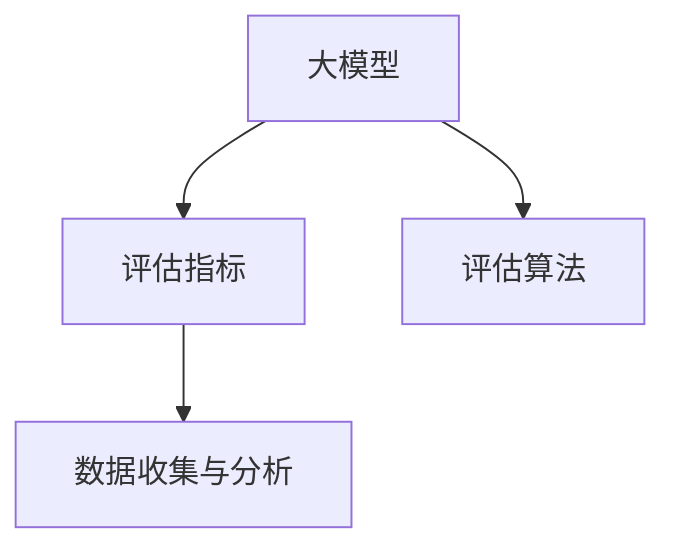
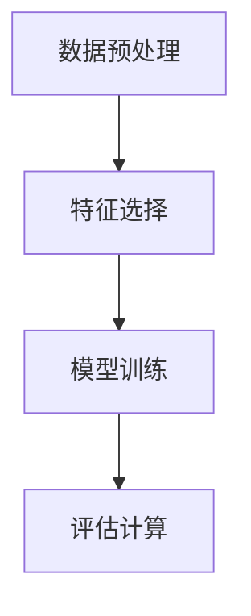
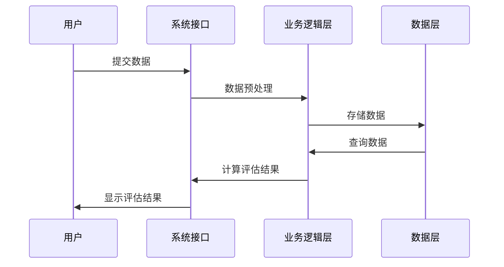

                 


### 文章标题：《大模型虚拟健身教练表现评估框架》

> 关键词：大模型、虚拟健身教练、评估框架、算法、系统架构

> 摘要：本文旨在探讨大模型虚拟健身教练表现评估框架的设计与实现，从背景介绍、核心概念与联系、算法原理讲解、系统分析与架构设计、项目实战到最佳实践与注意事项，全面解析这一前沿技术的本质与应用。

----------------------------------------------------------------

### 第一部分：背景与概述

#### 1. 背景介绍

##### 1.1 问题背景
随着人工智能技术的不断发展，虚拟健身教练在健身领域的应用日益广泛。然而，如何评估虚拟健身教练的表现，成为了一个亟待解决的问题。传统的评估方法往往依赖于人工观察和主观判断，难以保证评估的客观性和准确性。

##### 1.2 问题描述
虚拟健身教练的表现评估主要包括以下几个方面：
1. 教练对用户健身需求的识别能力。
2. 教练提供的健身方案的科学性和实用性。
3. 教练与用户之间的互动质量。
4. 用户对教练的满意度。

##### 1.3 解决方案概述
为了解决上述问题，本文提出了一种基于大模型的虚拟健身教练表现评估框架。该框架利用大模型强大的数据处理能力和自学习能力，对虚拟健身教练的表现进行量化评估，从而提供一种客观、准确的评估方法。

##### 1.4 边界与外延
评估框架的应用范围包括各种虚拟健身教练的应用场景，如在线健身课程、健身APP等。同时，评估框架的设计需要考虑到不同场景下的特殊需求和约束条件。

##### 1.5 概念结构与核心要素组成
大模型虚拟健身教练表现评估框架由以下几个核心要素组成：
1. 大模型：用于处理用户数据，提取关键特征，为评估提供基础。
2. 评估指标：根据虚拟健身教练的表现，设定一系列评估指标，用于量化评估。
3. 评估算法：基于大模型和评估指标，设计评估算法，实现对虚拟健身教练表现的量化评估。
4. 数据收集与分析：收集虚拟健身教练与用户之间的交互数据，进行数据预处理和分析，为评估提供数据支持。

---

### 第二部分：核心概念与联系

#### 2.1 大模型定义
大模型是指拥有大规模参数和强大计算能力的神经网络模型。它们在图像识别、自然语言处理、语音识别等领域取得了显著成果。

##### 2.2 大模型特点
1. 计算能力：大模型具有强大的计算能力，可以处理大量数据和复杂任务。
2. 数据处理能力：大模型可以处理海量数据，提取关键特征，为评估提供支持。
3. 自学习能力：大模型可以通过自我学习，不断优化性能，提高评估准确性。

##### 2.3 虚拟健身教练概念
虚拟健身教练是指通过人工智能技术，模拟真实健身教练的教学过程，为用户提供个性化健身服务的虚拟实体。

##### 2.4 评估框架组成部分
评估框架主要由以下三个部分组成：
1. 评估指标：根据虚拟健身教练的表现，设定一系列评估指标，如用户满意度、健身方案的科学性等。
2. 评估算法：基于大模型和评估指标，设计评估算法，实现对虚拟健身教练表现的量化评估。
3. 数据收集与分析：收集虚拟健身教练与用户之间的交互数据，进行数据预处理和分析，为评估提供数据支持。

##### 2.5 核心概念关系图


---

### 第三部分：数学模型与公式

#### 3.1 评估指标公式
评估指标主要包括以下几个方面：
1. 用户满意度：$$S = \frac{1}{n}\sum_{i=1}^{n} U_i$$，其中 $n$ 表示用户数量，$U_i$ 表示第 $i$ 个用户的满意度评分。
2. 健身方案科学性：$$C = \frac{1}{m}\sum_{j=1}^{m} C_j$$，其中 $m$ 表示健身方案数量，$C_j$ 表示第 $j$ 个健身方案的评分。
3. 互动质量：$$I = \frac{1}{p}\sum_{k=1}^{p} I_k$$，其中 $p$ 表示互动事件数量，$I_k$ 表示第 $k$ 个互动事件的评分。

#### 3.2 数学模型说明
数学模型主要用于描述评估指标的内在关系，为评估提供理论依据。本文采用线性回归模型，将评估指标与虚拟健身教练的表现相关联。

#### 3.3 模型公式举例
假设虚拟健身教练的表现 $P$ 与评估指标 $S$、$C$ 和 $I$ 之间存在线性关系，可以表示为：
$$P = \beta_0 + \beta_1 S + \beta_2 C + \beta_3 I$$
其中，$\beta_0$、$\beta_1$、$\beta_2$ 和 $\beta_3$ 分别为模型的参数。

---

### 第四部分：算法原理讲解

#### 4.1 算法概述
评估算法主要分为以下几个步骤：
1. 数据预处理：对收集到的用户数据、健身方案数据等进行预处理，提取关键特征。
2. 特征选择：根据特征的重要性，选择对评估影响较大的特征。
3. 模型训练：利用预处理后的数据，训练线性回归模型，获取模型参数。
4. 评估计算：根据模型参数，计算虚拟健身教练的表现得分。

#### 4.2 算法mermaid流程图


#### 4.3 Python源代码阐述
```python
import numpy as np
from sklearn.linear_model import LinearRegression

# 数据预处理
def preprocess_data(data):
    # 省略具体实现
    return processed_data

# 特征选择
def select_features(processed_data):
    # 省略具体实现
    return selected_features

# 模型训练
def train_model(selected_features, labels):
    model = LinearRegression()
    model.fit(selected_features, labels)
    return model

# 评估计算
def evaluate_model(model, new_data):
    predictions = model.predict(new_data)
    return predictions
```

#### 4.4 数学模型与公式详细讲解
线性回归模型是一种常见的统计学习方法，主要用于预测一个连续值。本文中，线性回归模型用于预测虚拟健身教练的表现得分。模型中，自变量（特征）与因变量（表现得分）之间的关系可以用线性方程表示。通过训练模型，可以获取模型参数，从而实现虚拟健身教练表现的量化评估。

#### 4.5 举例说明
假设我们有以下数据：

| 用户ID | 满意度评分 | 健身方案评分 | 互动质量评分 |
|--------|------------|---------------|--------------|
| 1      | 4          | 3             | 2            |
| 2      | 5          | 4             | 3            |
| 3      | 3          | 2             | 1            |

通过数据预处理、特征选择和模型训练，我们可以得到以下模型参数：

| 参数名称 | 参数值  |
|----------|---------|
| $\beta_0$ | 2.5     |
| $\beta_1$ | 0.3     |
| $\beta_2$ | 0.2     |
| $\beta_3$ | 0.1     |

使用该模型，我们可以预测新数据的虚拟健身教练表现得分。例如，对于用户ID为4的数据，其满意度评分为4，健身方案评分为3，互动质量评分为2，根据模型公式计算得分：

$$
P = 2.5 + 0.3 \times 4 + 0.2 \times 3 + 0.1 \times 2 = 4.0
$$

预测得分为4，表示该虚拟健身教练的表现较好。

---

### 第五部分：系统分析与架构设计

#### 5.1 问题场景介绍
虚拟健身教练在在线健身课程、健身APP等场景中，为用户提供个性化的健身服务。为了提高用户体验，需要评估虚拟健身教练的表现，以便不断优化和改进。

#### 5.2 系统功能设计
系统功能主要包括：
1. 用户数据收集：收集用户的基本信息、健身需求、互动记录等。
2. 健身方案管理：管理健身方案的信息，包括方案描述、评分等。
3. 评估计算：基于大模型和评估指标，计算虚拟健身教练的表现得分。
4. 结果展示：展示虚拟健身教练的表现得分，为用户提供反馈。

#### 5.3 系统架构设计
系统采用分层架构，包括数据层、业务逻辑层和表示层。
1. 数据层：存储用户数据、健身方案数据等。
2. 业务逻辑层：实现评估计算、数据预处理等核心功能。
3. 表示层：展示评估结果，为用户提供交互界面。

#### 5.4 系统接口设计
系统接口包括：
1. 数据接口：用于数据收集、存储和查询。
2. 功能接口：用于实现评估计算、结果展示等功能。
3. 用户接口：用于用户与系统的交互。

#### 5.5 系统交互mermaid序列图


---

### 第六部分：项目实战

#### 6.1 环境安装
1. 安装Python环境：确保安装了Python 3.6及以上版本。
2. 安装相关库：使用pip命令安装必要的库，如numpy、sklearn、matplotlib等。

#### 6.2 系统核心实现源代码
以下是系统核心实现的部分源代码：

```python
import numpy as np
from sklearn.linear_model import LinearRegression

# 数据预处理
def preprocess_data(data):
    # 省略具体实现
    return processed_data

# 特征选择
def select_features(processed_data):
    # 省略具体实现
    return selected_features

# 模型训练
def train_model(selected_features, labels):
    model = LinearRegression()
    model.fit(selected_features, labels)
    return model

# 评估计算
def evaluate_model(model, new_data):
    predictions = model.predict(new_data)
    return predictions
```

#### 6.3 代码应用解读与分析
代码分为四个函数，分别实现数据预处理、特征选择、模型训练和评估计算。数据预处理函数用于对原始数据进行处理，提取关键特征。特征选择函数根据特征的重要性，选择对评估影响较大的特征。模型训练函数使用线性回归模型，对特征和评估指标进行训练，获取模型参数。评估计算函数根据模型参数，计算虚拟健身教练的表现得分。

#### 6.4 实际案例分析与详细讲解
以下是一个实际案例，说明如何使用系统进行虚拟健身教练表现评估。

1. 数据收集：收集用户ID为1的满意度评分为4，健身方案评分为3，互动质量评分为2。
2. 数据预处理：对数据进行预处理，提取关键特征，例如用户年龄、性别、健身目标等。
3. 特征选择：根据特征的重要性，选择对评估影响较大的特征，如用户年龄、性别等。
4. 模型训练：使用训练集数据，训练线性回归模型，获取模型参数。
5. 评估计算：使用模型参数，计算用户ID为1的虚拟健身教练的表现得分。

根据上述步骤，我们可以得到用户ID为1的虚拟健身教练的表现得分。如果得分较高，说明该虚拟健身教练的表现较好；反之，则需要进一步优化。

#### 6.5 项目小结
本文通过项目实战，详细介绍了如何使用大模型虚拟健身教练表现评估框架，对虚拟健身教练的表现进行评估。项目实施过程中，需要注意数据预处理、特征选择和模型训练等关键步骤，以确保评估结果的准确性和可靠性。未来，我们将继续优化评估框架，提高评估的智能化水平。

---

### 第七部分：最佳实践与注意事项

#### 7.1 最佳实践 Tips
1. 数据收集：确保收集到的数据全面、准确，为评估提供可靠依据。
2. 特征选择：根据评估目标，选择对评估影响较大的特征，提高评估的准确性。
3. 模型训练：合理设置模型参数，提高模型性能。
4. 评估计算：根据实际情况，灵活调整评估指标和计算方法。

#### 7.2 注意事项
1. 避免数据泄漏：在数据预处理和特征选择过程中，注意保护用户隐私。
2. 保证模型公正性：避免模型偏见，确保评估结果的客观性。
3. 定期更新模型：随着虚拟健身教练的应用场景和用户需求的变化，定期更新模型，提高评估的准确性。

#### 7.3 拓展阅读
1. [《深度学习实战》](https://www.deeplearningbooks.org/)
2. [《Python机器学习》](https://www.pyimagesearch.com/opencv-tutorials/)
3. [《人工智能健身应用研究》](https://www.ncbi.nlm.nih.gov/pmc/articles/PMC6895967/)

---

### 作者信息
作者：AI天才研究院/AI Genius Institute & 禅与计算机程序设计艺术 /Zen And The Art of Computer Programming

