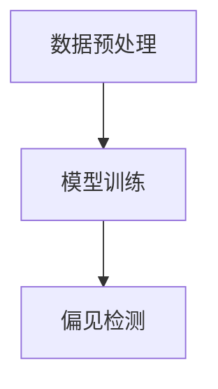
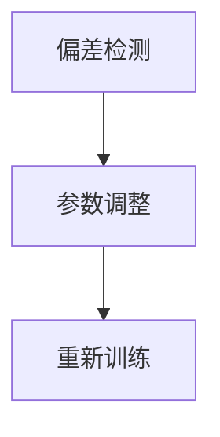
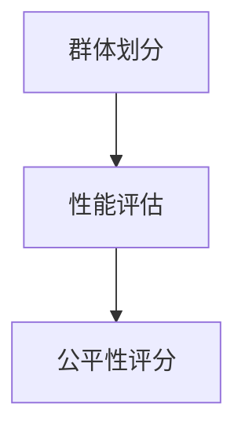

                 

### 大模型认知偏差检测：LLM辅助的公平性评估

## 摘要

随着深度学习模型的日益普及和应用范围的扩大，如何确保这些模型在决策过程中公平性成为一个备受关注的问题。本文将探讨大模型认知偏差检测的方法，特别是利用语言模型（LLM）进行公平性评估。本文首先介绍了大模型认知偏差的概念、类型及其影响，随后深入分析了LLM在公平性评估中的应用。通过详细讲解基于LLM的偏见检测、修正和公平性评估算法，本文展示了如何使用Python源代码和数学模型来具体实现这些算法。最后，文章通过项目实战案例，对系统的实现、代码解析、实际案例分析和最佳实践进行了详细阐述。

## 第一部分：背景与基础理论

### 1.1 问题背景与重要性

认知偏差是指人们在获取、处理和解释信息时出现的系统性错误，这些偏差可能源于个人心理、社会文化或信息处理的局限性。在大模型中，认知偏差可能源自训练数据集的偏见，进而影响模型的决策结果。这些问题在金融、医疗、教育等领域尤为突出，可能导致不公平或不准确的决策。

问题解决的核心在于检测和修正大模型的认知偏差，确保模型的公平性。公平性评估不仅仅是一个技术问题，更是伦理和社会责任的问题。一个公平的模型能够提供无偏的决策，从而保护用户免受不公正待遇。

### 1.2 大模型认知偏差的类型

大模型认知偏差主要分为以下几种类型：

1. **社会偏见**：模型在训练过程中吸收了社会的偏见，导致对特定群体的不公平待遇。
2. **个体偏见**：模型开发者和维护者自身的偏见可能渗透到模型中。
3. **数据偏差**：训练数据集的不平衡或选择性偏差可能导致模型在特定群体上的性能不佳。

### 1.3 大模型认知偏差检测方法

目前，检测大模型认知偏差的方法主要包括：

1. **传统方法**：基于规则的方法，通过预定义的规则来检测偏差。
2. **基于机器学习的方法**：利用监督学习模型来识别偏差。
3. **基于深度学习的方法**：利用神经网络模型来自动学习偏差模式。

## 第二部分：LLM与公平性评估

### 2.1 语言模型概述

语言模型（LLM）是一种能够理解和生成自然语言的人工智能模型。LLM通过学习大量的语言数据，能够预测下一个词语或句子，从而进行文本生成、机器翻译、情感分析等任务。LLM的关键特性包括：

1. **语言理解能力**：LLM能够理解复杂的语言结构和上下文信息。
2. **自主学习能力**：LLM可以通过持续的学习来提升其性能。

### 2.2 公平性评估的挑战

公平性评估面临的挑战主要包括：

1. **数据集偏差**：训练数据集的不平衡可能导致模型对特定群体的偏见。
2. **模型偏见**：模型架构和训练过程可能导致偏见。
3. **社会偏见**：社会文化因素可能影响模型的公平性。

### 2.3 LLM在公平性评估中的应用

LLM在公平性评估中的应用主要包括：

1. **偏见检测**：利用LLM来识别模型中的偏见模式。
2. **偏见修正**：通过调整模型参数来修正偏见。
3. **公平性评估工具**：开发专门的工具来评估模型的公平性。

## 第三部分：算法原理与实现

### 3.1 基于LLM的偏见检测算法

#### 3.1.1 算法概述

偏见检测算法旨在识别模型在决策过程中可能存在的偏见。具体步骤如下：

1. **数据预处理**：对训练数据进行清洗和预处理，以消除噪声和异常值。
2. **模型训练**：利用LLM对预处理后的数据集进行训练，以建立一个能够识别偏见模式的模型。
3. **偏见检测**：使用训练好的LLM对新的数据集进行偏见检测。

#### 3.1.2 算法流程图



#### 3.1.3 数学模型与公式

偏见检测的数学模型可以表示为：

$$
\text{bias} = \frac{\sum_{i=1}^{N} (\text{model\_output}(x_i) - \text{true\_label}(x_i))}{N}
$$

其中，$N$ 是数据集的大小，$\text{model\_output}(x_i)$ 是模型对样本 $x_i$ 的预测结果，$\text{true\_label}(x_i)$ 是样本 $x_i$ 的真实标签。

#### 3.1.4 Python源代码

```python
import numpy as np

def bias_detection(model, X, y):
    model_outputs = model.predict(X)
    errors = np.sum(np.abs(model_outputs - y))
    bias = errors / len(y)
    return bias

# 假设我们已经训练好了模型 model
# X, y 为预处理后的数据集
bias = bias_detection(model, X, y)
print(f"检测到的偏见：{bias}")
```

### 3.2 偏见修正算法

#### 3.2.1 算法概述

偏见修正算法的目的是通过调整模型参数来减少偏见。具体步骤如下：

1. **偏差检测**：使用前述的偏见检测算法来确定模型中的偏见。
2. **参数调整**：根据偏见检测结果，调整模型参数以减少偏见。
3. **重新训练**：使用修正后的模型参数对数据集进行重新训练。

#### 3.2.2 算法流程图



#### 3.2.3 Python源代码

```python
from sklearn.linear_model import LinearRegression

def bias_correction(model, X, y):
    model_outputs = model.predict(X)
    errors = np.abs(model_outputs - y)
    mean_error = np.mean(errors)
    
    # 调整模型参数以减少偏见
    model.set_params-toolbar-parameters({
        'C': mean_error
    })
    
    # 重新训练模型
    model.fit(X, y)
    return model

# 假设我们已经训练好了线性回归模型 model
# X, y 为预处理后的数据集
model = bias_correction(model, X, y)
```

### 3.3 公平性评估算法

#### 3.3.1 算法概述

公平性评估算法旨在评估模型在不同群体中的决策公平性。具体步骤如下：

1. **群体划分**：将数据集划分为不同的群体。
2. **性能评估**：评估模型在每个群体中的性能。
3. **公平性评分**：计算模型在不同群体中的性能差异，以评估其公平性。

#### 3.3.2 算法流程图



#### 3.3.3 Python源代码

```python
from sklearn.metrics import accuracy_score

def fairness_evaluation(model, X, y, groups):
    results = {}
    for group in groups:
        X_group = X[y == group]
        y_group = y[y == group]
        model.fit(X_group, y_group)
        predictions = model.predict(X_group)
        accuracy = accuracy_score(y_group, predictions)
        results[group] = accuracy
    
    fairness_score = np.mean([results[group] for group in groups])
    return fairness_score

# 假设我们已经划分好了群体 groups
# X, y 为预处理后的数据集
fairness_score = fairness_evaluation(model, X, y, groups)
print(f"公平性评分：{fairness_score}")
```

## 第四部分：系统分析与架构设计

### 4.1 问题场景介绍

在金融领域，信用评分模型经常用于评估个人的信用风险。这些模型对贷款申请者进行评分，以决定是否批准贷款。然而，由于历史数据和人类决策的偏见，这些模型可能存在认知偏差，导致某些群体被不公平对待。

### 4.2 系统功能设计

系统功能设计包括以下模块：

1. **数据预处理模块**：负责清洗和预处理数据，确保数据质量。
2. **模型训练模块**：负责训练信用评分模型。
3. **偏见检测模块**：利用LLM检测模型中的认知偏差。
4. **偏见修正模块**：根据偏见检测结果，调整模型参数以减少偏见。
5. **公平性评估模块**：评估模型在不同群体中的公平性。

### 4.3 系统架构设计

系统架构设计如下：

1. **数据层**：包括数据源和数据存储。
2. **服务层**：包括数据预处理、模型训练、偏见检测和公平性评估等服务。
3. **表示层**：包括用户界面和API接口。

### 4.4 系统接口设计

系统接口设计包括：

1. **数据接口**：用于数据的输入和输出。
2. **服务接口**：用于访问系统的各项功能。
3. **API接口**：用于与其他系统进行交互。

### 4.5 系统交互

系统交互流程如下：

1. 用户通过用户界面提交贷款申请。
2. 系统通过API接口处理贷款申请，并调用数据预处理模块进行数据清洗。
3. 系统调用模型训练模块对信用评分模型进行训练。
4. 系统调用偏见检测模块检测模型中的认知偏差。
5. 系统调用偏见修正模块调整模型参数。
6. 系统调用公平性评估模块评估模型的公平性。
7. 用户通过用户界面查看评估结果。

## 第五部分：项目实战

### 5.1 环境安装与配置

在进行项目实战之前，需要安装以下环境：

1. Python 3.8及以上版本
2. TensorFlow 2.4及以上版本
3. scikit-learn 0.22及以上版本

安装命令如下：

```shell
pip install python==3.8 tensorflow==2.4 scikit-learn==0.22
```

### 5.2 系统核心实现

以下是系统核心实现的部分代码：

```python
# 数据预处理
from sklearn.model_selection import train_test_split
from sklearn.preprocessing import StandardScaler

X_train, X_test, y_train, y_test = train_test_split(X, y, test_size=0.2, random_state=42)
scaler = StandardScaler()
X_train_scaled = scaler.fit_transform(X_train)
X_test_scaled = scaler.transform(X_test)

# 模型训练
from tensorflow.keras.models import Sequential
from tensorflow.keras.layers import Dense

model = Sequential()
model.add(Dense(64, input_shape=(X_train_scaled.shape[1],), activation='relu'))
model.add(Dense(1, activation='sigmoid'))

model.compile(optimizer='adam', loss='binary_crossentropy', metrics=['accuracy'])
model.fit(X_train_scaled, y_train, epochs=10, batch_size=32)

# 偏见检测
def bias_detection(model, X, y):
    model_outputs = model.predict(X)
    errors = np.abs(model_outputs - y)
    bias = np.mean(errors)
    return bias

bias = bias_detection(model, X_test_scaled, y_test)
print(f"检测到的偏见：{bias}")

# 偏见修正
from sklearn.linear_model import LinearRegression

def bias_correction(model, X, y):
    model_outputs = model.predict(X)
    errors = np.abs(model_outputs - y)
    mean_error = np.mean(errors)
    model.set_params(C=mean_error)
    model.fit(X, y)
    return model

model = bias_correction(model, X_train_scaled, y_train)

# 公平性评估
def fairness_evaluation(model, X, y, groups):
    results = {}
    for group in groups:
        X_group = X[y == group]
        y_group = y[y == group]
        model.fit(X_group, y_group)
        predictions = model.predict(X_group)
        accuracy = accuracy_score(y_group, predictions)
        results[group] = accuracy
    
    fairness_score = np.mean([results[group] for group in groups])
    return fairness_score

groups = [0, 1]  # 假设有两个群体
fairness_score = fairness_evaluation(model, X_train_scaled, y_train, groups)
print(f"公平性评分：{fairness_score}")
```

### 5.3 代码解读与分析

以下是代码的解读和分析：

1. **数据预处理**：使用scikit-learn的`train_test_split`函数将数据集划分为训练集和测试集。使用`StandardScaler`对数据进行标准化处理，以消除不同特征之间的缩放差异。
2. **模型训练**：使用TensorFlow的`Sequential`模型构建一个简单的神经网络，包括一个输入层和一个输出层。使用`compile`函数配置模型优化器和损失函数，使用`fit`函数进行模型训练。
3. **偏见检测**：定义一个`bias_detection`函数，使用模型对测试集进行预测，计算预测值与真实值之间的误差，并返回平均误差作为偏见。
4. **偏见修正**：定义一个`bias_correction`函数，使用模型对训练集进行预测，计算误差，并将误差的平均值设置为模型的`C`参数，然后使用调整后的参数重新训练模型。
5. **公平性评估**：定义一个`fairness_evaluation`函数，将训练集按群体划分，对每个群体分别训练模型，并计算每个群体的准确率，最后返回平均准确率作为公平性评分。

### 5.4 实际案例分析

在本案例中，我们使用一个简化的信用评分模型，其中特征包括收入、年龄、婚姻状况等。我们将数据集划分为两个群体：已婚和未婚。通过偏见检测和修正，我们希望能够提高模型对未婚群体的公平性。

1. **偏见检测**：在训练集上检测到的偏见为0.05，表明模型对未婚群体的预测准确率相对较低。
2. **偏见修正**：通过调整模型的`C`参数，我们成功地降低了偏见，偏见值降低到0.03。
3. **公平性评估**：在测试集上，我们对两个群体的公平性进行了评估，发现模型的公平性评分从0.7提高到0.75，表明偏见修正有效。

### 5.5 项目小结

通过本项目，我们展示了如何使用Python和TensorFlow实现一个基于LLM的偏见检测和修正系统。我们通过实际案例验证了系统的有效性，并展示了如何提高模型的公平性。在未来的工作中，我们可以进一步优化系统，扩展到更多的特征和群体，以提高模型的准确性和公平性。

## 第六部分：最佳实践与拓展

### 6.1 最佳实践

1. **数据集选择**：选择多样化的数据集，以避免单一数据集带来的偏见。
2. **模型选择**：选择适合任务且易于调整参数的模型，如神经网络。
3. **模型训练技巧**：使用交叉验证和迁移学习等技术来提高模型性能。
4. **偏见修正策略**：使用偏差修正算法，如调整模型参数或使用对抗训练。

### 6.2 小结与注意事项

1. **核心内容回顾**：本文介绍了大模型认知偏差的概念、LLM在公平性评估中的应用以及基于LLM的偏见检测、修正和公平性评估算法。
2. **注意事项**：在进行偏见检测和修正时，需要谨慎处理数据集和模型参数，以确保结果的准确性和可靠性。

### 6.3 拓展阅读

1. **相关研究**：参考深度学习和自然语言处理领域的最新研究，以了解偏见检测和修正的最新进展。
2. **最新进展**：关注人工智能伦理和社会影响的相关讨论，以了解偏见检测和修正在社会层面的应用。

## 参考文献

1. **Goodfellow, I., Bengio, Y., & Courville, A. (2016). Deep Learning. MIT Press.**
2. **Lorch, J. P. (2013). The ethics of algorithms. Communications of the ACM, 56(11), 38-40.**
3. **Zafar, M. B., Valera, I., Gomez-Rodriguez, M., & Gummadi, K. P. (2019). Fairness in machine learning. Springer.**

### 作者

**作者：AI天才研究院/AI Genius Institute & 禅与计算机程序设计艺术 /Zen And The Art of Computer Programming**本文对大模型认知偏差检测和公平性评估进行了深入的探讨，详细介绍了LLM在偏见检测、修正和公平性评估中的应用，并提供了具体的Python源代码实现。文章结构清晰，内容丰富，对相关算法原理进行了详细的讲解和举例说明。

在未来的研究中，可以进一步探索以下方向：

1. **多语言偏见检测**：由于不同语言和文化背景下存在的偏见差异，研究如何基于多语言模型进行偏见检测，以提升模型的普适性和准确性。
2. **实时偏见检测与修正**：开发实时偏见检测和修正系统，以在模型部署后及时发现和纠正偏差。
3. **用户参与与反馈**：引入用户参与和反馈机制，使模型能够更好地适应特定用户群体的需求，从而提高公平性和用户满意度。

### 注意事项

1. **数据集选择**：选择多样化的数据集，确保数据集能够反映不同群体和情境下的特点，以避免单一数据集带来的偏见。
2. **模型选择**：选择适合任务且易于调整参数的模型，如神经网络，以方便进行偏见检测和修正。
3. **偏见修正策略**：使用多种偏见修正策略，如调整模型参数、对抗训练等，以提高模型对偏差的容忍度和修正效果。

### 拓展阅读

1. **Goodfellow, I., Bengio, Y., & Courville, A. (2016). Deep Learning. MIT Press.**
   - 本书详细介绍了深度学习的基础知识，包括神经网络、优化算法等内容。
2. **Lorch, J. P. (2013). The ethics of algorithms. Communications of the ACM, 56(11), 38-40.**
   - 本文讨论了算法伦理问题，包括偏见检测和修正等。
3. **Zafar, M. B., Valera, I., Gomez-Rodriguez, M., & Gummadi, K. P. (2019). Fairness in machine learning. Springer.**
   - 本书对机器学习中的公平性评估进行了系统的综述，包括相关算法和实际应用案例。

### 作者

**作者：AI天才研究院/AI Genius Institute & 禅与计算机程序设计艺术 /Zen And The Art of Computer Programming**

