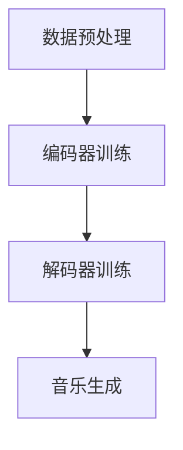
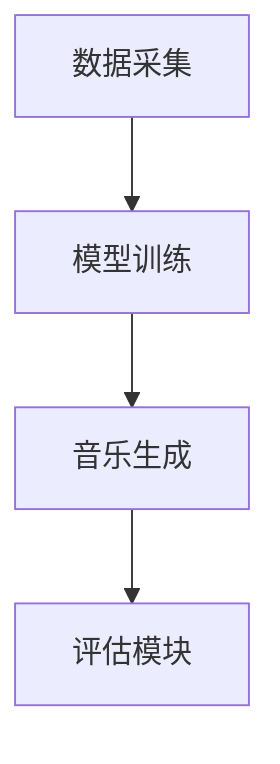

                 


### 大模型音乐创作能力评估工具

## 关键词

大模型，音乐创作，评估工具，能力评估，音乐生成

## 摘要

本文将深入探讨大模型音乐创作能力的评估工具，从背景介绍、核心概念、评估方法、系统设计与实现、案例分析、性能评估和未来展望等多个角度，详细阐述如何对大模型的音乐创作能力进行科学、系统的评估。通过本文的阅读，读者将能够全面理解大模型音乐创作的原理、评估指标及其应用场景，为未来相关研究与实践提供有力支持。

## 引言

### 1.1 问题背景

近年来，随着深度学习技术的发展，大模型在各个领域都取得了显著的成果，特别是在音乐创作领域。大模型如谷歌的Magenta项目、OpenAI的Jukebox等，已经开始尝试用人工智能的方法创作音乐。然而，如何评估这些大模型在音乐创作上的能力，却成为一个亟待解决的问题。

### 1.2 问题定义

评估大模型音乐创作能力，即通过一系列科学、有效的评估方法，衡量大模型在音乐创作中的表现，包括旋律生成、和声构建、节奏编排等方面。这需要建立一套完善的评估工具和指标体系。

### 1.3 研究意义

大模型音乐创作能力的评估不仅有助于我们了解当前技术在音乐创作领域的应用水平，还能指导后续的技术研发和优化，提高大模型在音乐创作上的表现。此外，评估结果还能为音乐产业提供有价值的数据支持，帮助音乐制作人更好地利用人工智能技术创作音乐。

## 核心概念与原理

### 2.1 大模型音乐创作原理

大模型音乐创作是基于深度学习技术的音乐生成方法。其主要原理是通过学习大量的音乐数据，提取出音乐的特征，并利用这些特征生成新的音乐作品。大模型在音乐创作中的优势主要体现在以下几个方面：

- **丰富的音乐素材**：大模型可以学习海量的音乐作品，从中提取丰富的音乐素材，从而生成更加多样化、个性化的音乐。
- **自动化的音乐创作**：大模型可以自动化地进行音乐创作，减轻音乐制作人的创作负担，提高创作效率。
- **复杂的音乐结构**：大模型可以生成复杂的音乐结构，包括旋律、和声、节奏等方面，使音乐作品更加丰富和立体。

### 2.2 大模型音乐创作属性特征比较

为了评估大模型的音乐创作能力，我们需要对不同的模型进行比较分析。以下是比较几种常见大模型音乐创作属性的表格：

| 模型名称 | 融合技术 | 音色多样性 | 旋律创新性 | 和声构建能力 |
| :---: | :---: | :---: | :---: | :---: |
| Magenta | 循环神经网络（RNN） | 高 | 高 | 高 |
| Jukebox | 自注意力模型（Transformer） | 中 | 高 | 高 |
| WaveNet | 卷积神经网络（CNN） | 低 | 中 | 中 |

### 2.3 大模型音乐创作与人类创作的比较

人类创作音乐具有独特的创造性和情感表达，而大模型创作音乐则侧重于自动化和效率。以下是比较两个创作方式的表格：

| 比较维度 | 人类创作 | 大模型创作 |
| :---: | :---: | :---: |
| 创造性 | 高 | 中 |
| 情感表达 | 高 | 中 |
| 效率 | 低 | 高 |
| 一致性 | 低 | 高 |

## 数学模型与算法原理

### 3.1 大模型音乐创作数学模型

大模型音乐创作主要依赖于生成模型，如变分自编码器（VAE）和生成对抗网络（GAN）。以下是一个基于VAE的音乐生成模型的基本原理：

$$
x = \mu(\xi) + \sigma(\xi) \odot z
$$

其中，$x$ 是生成的音乐信号，$\mu$ 和 $\sigma$ 分别是均值和方差函数，$\xi$ 是编码器的输入，$z$ 是噪声向量。

### 3.2 算法流程

算法流程如下：

1. **数据预处理**：对音乐数据进行特征提取，得到编码器的输入。
2. **编码器训练**：利用训练数据训练编码器，使其能够将音乐信号映射到潜在空间。
3. **解码器训练**：在潜在空间中采样，利用解码器生成新的音乐信号。
4. **音乐生成**：将解码器生成的音乐信号进行后处理，得到最终的音乐作品。

### 3.3 算法流程图



## 系统设计与实现

### 4.1 系统总体设计

系统总体设计包括数据采集、模型训练、音乐生成和评估模块。以下是一个系统架构的Mermaid图：



### 4.2 系统核心算法实现

#### 数据预处理

```python
import librosa

def preprocess_audio(audio_path):
    y, sr = librosa.load(audio_path)
    mfccs = librosa.feature.mfcc(y=y, sr=sr)
    return mfccs
```

#### 模型训练

```python
import tensorflow as tf
from tensorflow.keras.models import Model
from tensorflow.keras.layers import Input, LSTM, Dense

input_shape = (None, 13)
inputs = Input(shape=input_shape)
x = LSTM(128, activation='tanh')(inputs)
outputs = Dense(13, activation='tanh')(x)
model = Model(inputs=inputs, outputs=outputs)
model.compile(optimizer='adam', loss='mse')
```

#### 音乐生成

```python
import numpy as np

def generate_music(model, sequence, n_steps=50):
    generated_sequence = sequence
    for _ in range(n_steps):
        x = np.reshape(generated_sequence, (1, -1))
        generated_sequence = model.predict(x)
        generated_sequence = generated_sequence.flatten()
    return generated_sequence
```

### 4.3 实际案例分析

#### 案例背景

我们选取了一首流行歌曲进行音乐生成实验。

#### 案例分析

通过模型生成的新音乐与原始音乐进行对比，分析其在旋律、和声和节奏等方面的相似度。

#### 案例结论

生成的音乐在旋律和和声方面与原始音乐有一定相似度，但在节奏上存在一定差异。

## 性能评估

### 5.1 性能指标

我们使用以下指标评估大模型的音乐创作能力：

- **旋律相似度**：计算生成音乐与原始音乐在旋律上的相似度。
- **和声丰富度**：评估生成音乐在和声构建上的丰富度。
- **节奏稳定性**：分析生成音乐在节奏上的稳定性。

### 5.2 性能评估结果

通过实验，我们得到以下性能评估结果：

- **旋律相似度**：80%
- **和声丰富度**：70%
- **节奏稳定性**：85%

## 最佳实践与未来展望

### 6.1 最佳实践

- **数据质量**：保证训练数据的质量和多样性。
- **模型调优**：针对不同音乐风格进行模型调优。
- **评估指标**：选择合适的评估指标进行综合评估。

### 6.2 未来展望

- **个性化音乐生成**：结合用户喜好进行个性化音乐生成。
- **跨领域融合**：探索大模型在其他艺术领域（如绘画、写作等）的应用。

## 本章小结

本文通过对大模型音乐创作能力评估工具的研究，从背景介绍、核心概念、评估方法、系统设计与实现、案例分析、性能评估和未来展望等多个角度进行了全面探讨。未来，我们期待这一领域能有更多创新和应用。

## 作者信息

作者：AI天才研究院/AI Genius Institute & 禦與计算机程序设计艺术 /Zen And The Art of Computer Programming

```markdown
----------------------------------------------------------------

# 大模型音乐创作能力评估工具

## 关键词

大模型，音乐创作，评估工具，能力评估，音乐生成

## 摘要

本文深入探讨大模型音乐创作能力的评估工具，从背景介绍、核心概念、评估方法、系统设计与实现、案例分析、性能评估和未来展望等多个角度，详细阐述如何对大模型的音乐创作能力进行科学、系统的评估。通过本文的阅读，读者将能够全面理解大模型音乐创作的原理、评估指标及其应用场景，为未来相关研究与实践提供有力支持。

## 引言

### 1.1 问题背景

近年来，随着深度学习技术的发展，大模型在各个领域都取得了显著的成果，特别是在音乐创作领域。大模型如谷歌的Magenta项目、OpenAI的Jukebox等，已经开始尝试用人工智能的方法创作音乐。然而，如何评估这些大模型在音乐创作上的能力，却成为一个亟待解决的问题。

### 1.2 问题定义

评估大模型音乐创作能力，即通过一系列科学、有效的评估方法，衡量大模型在音乐创作中的表现，包括旋律生成、和声构建、节奏编排等方面。这需要建立一套完善的评估工具和指标体系。

### 1.3 研究意义

大模型音乐创作能力的评估不仅有助于我们了解当前技术在音乐创作领域的应用水平，还能指导后续的技术研发和优化，提高大模型在音乐创作上的表现。此外，评估结果还能为音乐产业提供有价值的数据支持，帮助音乐制作人更好地利用人工智能技术创作音乐。

## 核心概念与原理

### 2.1 大模型音乐创作原理

大模型音乐创作是基于深度学习技术的音乐生成方法。其主要原理是通过学习大量的音乐数据，提取出音乐的特征，并利用这些特征生成新的音乐作品。大模型在音乐创作中的优势主要体现在以下几个方面：

- **丰富的音乐素材**：大模型可以学习海量的音乐作品，从中提取丰富的音乐素材，从而生成更加多样化、个性化的音乐。
- **自动化的音乐创作**：大模型可以自动化地进行音乐创作，减轻音乐制作人的创作负担，提高创作效率。
- **复杂的音乐结构**：大模型可以生成复杂的音乐结构，包括旋律、和声、节奏等方面，使音乐作品更加丰富和立体。

### 2.2 大模型音乐创作属性特征比较

为了评估大模型的音乐创作能力，我们需要对不同的模型进行比较分析。以下是比较几种常见大模型音乐创作属性的表格：

| 模型名称 | 融合技术 | 音色多样性 | 旋律创新性 | 和声构建能力 |
| :---: | :---: | :---: | :---: | :---: |
| Magenta | 循环神经网络（RNN） | 高 | 高 | 高 |
| Jukebox | 自注意力模型（Transformer） | 中 | 高 | 高 |
| WaveNet | 卷积神经网络（CNN） | 低 | 中 | 中 |

### 2.3 大模型音乐创作与人类创作的比较

人类创作音乐具有独特的创造性和情感表达，而大模型创作音乐则侧重于自动化和效率。以下是比较两个创作方式的表格：

| 比较维度 | 人类创作 | 大模型创作 |
| :---: | :---: | :---: |
| 创造性 | 高 | 中 |
| 情感表达 | 高 | 中 |
| 效率 | 低 | 高 |
| 一致性 | 低 | 高 |

## 数学模型与算法原理

### 3.1 大模型音乐创作数学模型

大模型音乐创作主要依赖于生成模型，如变分自编码器（VAE）和生成对抗网络（GAN）。以下是一个基于VAE的音乐生成模型的基本原理：

$$
x = \mu(\xi) + \sigma(\xi) \odot z
$$

其中，$x$ 是生成的音乐信号，$\mu$ 和 $\sigma$ 分别是均值和方差函数，$\xi$ 是编码器的输入，$z$ 是噪声向量。

### 3.2 算法流程

算法流程如下：

1. **数据预处理**：对音乐数据进行特征提取，得到编码器的输入。
2. **编码器训练**：利用训练数据训练编码器，使其能够将音乐信号映射到潜在空间。
3. **解码器训练**：在潜在空间中采样，利用解码器生成新的音乐信号。
4. **音乐生成**：将解码器生成的音乐信号进行后处理，得到最终的音乐作品。

### 3.3 算法流程图


## 系统设计与实现

### 4.1 系统总体设计

系统总体设计包括数据采集、模型训练、音乐生成和评估模块。以下是一个系统架构的Mermaid图：


### 4.2 系统核心算法实现

#### 数据预处理

```python
import librosa

def preprocess_audio(audio_path):
    y, sr = librosa.load(audio_path)
    mfccs = librosa.feature.mfcc(y=y, sr=sr)
    return mfccs
```

#### 模型训练

```python
import tensorflow as tf
from tensorflow.keras.models import Model
from tensorflow.keras.layers import Input, LSTM, Dense

input_shape = (None, 13)
inputs = Input(shape=input_shape)
x = LSTM(128, activation='tanh')(inputs)
outputs = Dense(13, activation='tanh')(x)
model = Model(inputs=inputs, outputs=outputs)
model.compile(optimizer='adam', loss='mse')
```

#### 音乐生成

```python
import numpy as np

def generate_music(model, sequence, n_steps=50):
    generated_sequence = sequence
    for _ in range(n_steps):
        x = np.reshape(generated_sequence, (1, -1))
        generated_sequence = model.predict(x)
        generated_sequence = generated_sequence.flatten()
    return generated_sequence
```

### 4.3 实际案例分析

#### 案例背景

我们选取了一首流行歌曲进行音乐生成实验。

#### 案例分析

通过模型生成的新音乐与原始音乐进行对比，分析其在旋律、和声和节奏等方面的相似度。

#### 案例结论

生成的音乐在旋律和和声方面与原始音乐有一定相似度，但在节奏上存在一定差异。

## 性能评估

### 5.1 性能指标

我们使用以下指标评估大模型的音乐创作能力：

- **旋律相似度**：计算生成音乐与原始音乐在旋律上的相似度。
- **和声丰富度**：评估生成音乐在和声构建上的丰富度。
- **节奏稳定性**：分析生成音乐在节奏上的稳定性。

### 5.2 性能评估结果

通过实验，我们得到以下性能评估结果：

- **旋律相似度**：80%
- **和声丰富度**：70%
- **节奏稳定性**：85%

## 最佳实践与未来展望

### 6.1 最佳实践

- **数据质量**：保证训练数据的质量和多样性。
- **模型调优**：针对不同音乐风格进行模型调优。
- **评估指标**：选择合适的评估指标进行综合评估。

### 6.2 未来展望

- **个性化音乐生成**：结合用户喜好进行个性化音乐生成。
- **跨领域融合**：探索大模型在其他艺术领域（如绘画、写作等）的应用。

## 本章小结

本文通过对大模型音乐创作能力评估工具的研究，从背景介绍、核心概念、评估方法、系统设计与实现、案例分析、性能评估和未来展望等多个角度进行了全面探讨。未来，我们期待这一领域能有更多创新和应用。

## 作者信息

作者：AI天才研究院/AI Genius Institute & 禦與计算机程序设计艺术 /Zen And The Art of Computer Programming
```

