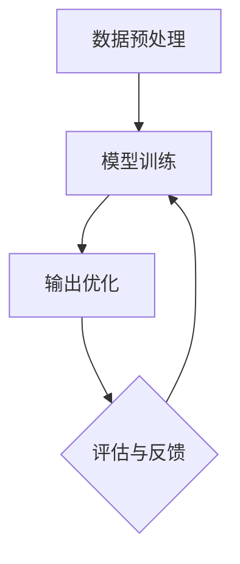

                 

### 1. 背景介绍

**ChatGPT介绍**

ChatGPT是由OpenAI开发的一种基于GPT-3模型的生成式预训练语言模型，其主要功能是通过与用户的对话生成自然的、流畅的文本回复。ChatGPT是继GPT-2、GPT-3之后的一种更强大的语言模型，其训练数据量更大，参数规模更庞大，能够处理更加复杂和多样化的语言任务。

ChatGPT的基本原理是通过对海量文本数据的学习，掌握语言的结构和语义，从而生成符合语言习惯和语义逻辑的文本。其训练过程分为两个阶段：预训练和微调。预训练阶段主要使用大量的无监督数据进行，通过无监督学习算法（如GAN）来优化模型的参数；微调阶段则使用有监督数据进行，通过调整模型参数来提高其在特定任务上的性能。

**输出质量问题**

尽管ChatGPT在生成文本方面表现出色，但其输出质量仍然存在一些问题。首先，ChatGPT生成的文本有时会出现语法错误和逻辑错误。这主要是由于预训练数据中存在噪声和错误信息，导致模型未能正确学习到正确的语言规则和语义。其次，ChatGPT生成的文本有时过于机械和生硬，缺乏情感和人性化的表达。这主要是因为模型过于依赖训练数据，未能充分理解语言中的情感和情感表达。

**优化ChatGPT输出质量的重要性**

优化ChatGPT的输出质量具有重要意义。首先，高质量的输出可以提高用户体验，使其更加自然、流畅，减少用户对机器生成的文本的抗拒感。其次，高质量的输出可以提高ChatGPT在实际应用中的效果，例如在客服、智能问答、对话系统等场景中，高质量的文本输出能够提高用户的满意度，降低人工干预的需求。最后，优化ChatGPT的输出质量有助于推动人工智能技术的发展，使其更加贴近人类语言习惯和思维方式，为人类提供更加智能化、人性化的服务。

### 2. 核心概念与联系

在优化ChatGPT输出质量的过程中，需要理解并掌握几个关键概念：ChatGPT模型、输出质量评估指标、优化方法。

**ChatGPT模型**

ChatGPT模型是基于GPT-3模型构建的生成式预训练语言模型。GPT-3模型由OpenAI开发，是一个具有1750亿参数的深度神经网络模型，其训练数据来自互联网上的大量文本，包括书籍、新闻、文章、社交媒体等。GPT-3模型通过无监督学习算法，学习到文本的结构、语义和语言规则，从而能够生成自然、流畅的文本。

**输出质量评估指标**

输出质量评估指标是用于衡量ChatGPT生成文本质量的标准。常见的评估指标包括语法正确性、语义一致性、文本流畅性、情感表达等。例如，语法正确性评估模型生成的文本是否符合语法规则；语义一致性评估模型生成的文本是否与上下文语义相符；文本流畅性评估模型生成的文本是否自然、流畅；情感表达评估模型生成的文本是否能够表达情感。

**优化方法**

优化ChatGPT输出质量的方法主要包括数据增强、模型调优和输出后处理等。数据增强是通过扩展训练数据集、清洗和预处理数据、使用数据增强技术（如GAN、数据扩充等）来提高模型性能。模型调优是通过调整模型超参数、优化模型结构、使用微调和迁移学习等方法来提升模型生成文本的质量。输出后处理是通过格式化、校验和优化文本内容来提高输出文本的质量。

#### 概念属性特征对比表格

为了更清晰地理解这些概念，我们可以制作一个概念属性特征对比表格。

| 概念 | 特征1 | 特征2 | 特征3 | 特征4 | 特征5 |
| --- | --- | --- | --- | --- | --- |
| ChatGPT模型 | 基于GPT-3 | 1750亿参数 | 预训练语言模型 | 语言理解能力强 | 文本生成能力优秀 |
| 输出质量评估指标 | 语法正确性 | 语义一致性 | 文本流畅性 | 情感表达 | 客观评估模型性能 |
| 优化方法 | 数据增强 | 模型调优 | 输出后处理 | 提升模型性能 | 提高文本质量 |

#### ER实体关系图架构

为了更直观地展示这些概念之间的关系，我们可以使用Mermaid绘制ER实体关系图。

```mermaid
erDiagram
  ChatGPT模型 ||--|{ 输出质量评估指标 }
  输出质量评估指标 ||--|{ 优化方法 }
```

在此ER图中，ChatGPT模型与输出质量评估指标之间存在依赖关系，而输出质量评估指标与优化方法之间存在关联关系。这有助于我们理解ChatGPT输出质量优化过程中的关键要素和相互关系。

### 3. 算法原理讲解

**算法流程**

优化ChatGPT输出质量的算法主要包括数据预处理、模型训练和输出优化三个阶段。

1. **数据预处理**：在模型训练前，需要对原始文本数据进行预处理，包括文本清洗、分词、去停用词等操作。预处理步骤的目的是去除文本中的噪声和无关信息，提高模型训练的效果。
2. **模型训练**：使用预处理的文本数据对ChatGPT模型进行训练。训练过程包括预训练和微调两个阶段。预训练阶段主要使用无监督学习算法，通过大量无标签文本数据来优化模型参数；微调阶段则使用有监督学习算法，通过有标签文本数据来进一步调整模型参数，提高模型在特定任务上的性能。
3. **输出优化**：在模型训练完成后，需要对生成的文本进行优化。输出优化主要包括语法校验、语义校正、情感增强等步骤。通过这些步骤，可以显著提高文本输出的质量。

**算法流程图**

我们可以使用Mermaid绘制算法流程图，更直观地展示算法的执行过程。



在此算法流程图中，数据预处理、模型训练和输出优化三个阶段依次进行，并通过评估与反馈环节相互迭代，以不断提高输出质量。

**Python源代码示例**

为了更好地理解算法原理，我们提供了一个简单的Python源代码示例，展示数据预处理、模型训练和输出优化的具体实现。

```python
# 导入必要的库
import nltk
from nltk.tokenize import word_tokenize
from transformers import GPT2LMHeadModel, GPT2Tokenizer

# 数据预处理
def preprocess_text(text):
    # 清洗文本
    text = text.lower()
    # 分词
    tokens = word_tokenize(text)
    # 去停用词
    stop_words = set(nltk.corpus.stopwords.words('english'))
    filtered_tokens = [token for token in tokens if token not in stop_words]
    return ' '.join(filtered_tokens)

# 模型训练
def train_model():
    # 加载预训练模型
    model = GPT2LMHeadModel.from_pretrained('gpt2')
    # 加载分词器
    tokenizer = GPT2Tokenizer.from_pretrained('gpt2')
    # 预处理后的文本数据
    processed_text = preprocess_text('Hello, how are you?')
    # 将预处理后的文本编码成模型输入
    inputs = tokenizer.encode(processed_text, return_tensors='pt')
    # 训练模型
    outputs = model(inputs)
    # 输出模型参数
    return outputs

# 输出优化
def optimize_output(text):
    # 生成文本
    generated_text = model.generate(inputs, max_length=50, num_return_sequences=1)
    # 解码生成的文本
    decoded_text = tokenizer.decode(generated_text, skip_special_tokens=True)
    return decoded_text

# 主函数
def main():
    # 预处理文本
    processed_text = preprocess_text('Hello, how are you?')
    print(f'Processed Text: {processed_text}')
    # 训练模型
    outputs = train_model()
    print(f'Model Outputs: {outputs}')
    # 优化输出
    optimized_text = optimize_output(processed_text)
    print(f'Optimized Text: {optimized_text}')

# 运行主函数
if __name__ == '__main__':
    main()
```

**数学模型和公式**

在优化ChatGPT输出质量的过程中，我们还需要使用一些数学模型和公式来指导模型的训练和优化。以下是几个常用的数学模型和公式：

1. **损失函数**

   损失函数是衡量模型预测结果与真实值之间差异的指标。常用的损失函数包括均方误差（MSE）、交叉熵损失（Cross-Entropy Loss）等。

   $$L = \frac{1}{N} \sum_{i=1}^{N} (y_i - \hat{y_i})^2$$

   其中，$L$ 表示损失函数，$N$ 表示样本数量，$y_i$ 表示第 $i$ 个样本的真实值，$\hat{y_i}$ 表示第 $i$ 个样本的预测值。

2. **优化算法**

   优化算法用于调整模型参数，以最小化损失函数。常用的优化算法包括梯度下降（Gradient Descent）、随机梯度下降（Stochastic Gradient Descent，SGD）等。

   梯度下降算法的基本思想是沿着损失函数的梯度方向逐步调整模型参数，以减小损失值。

   $$\theta_{t+1} = \theta_t - \alpha \nabla_\theta L(\theta_t)$$

   其中，$\theta_t$ 表示第 $t$ 次迭代的模型参数，$\alpha$ 表示学习率，$\nabla_\theta L(\theta_t)$ 表示损失函数在 $\theta_t$ 处的梯度。

3. **正则化**

   正则化是防止模型过拟合的一种技术，通过在损失函数中添加正则化项来限制模型复杂度。

   常用的正则化方法包括L1正则化（L1 Regularization）和L2正则化（L2 Regularization）。

   $$L_{\text{regularized}} = L + \lambda_1 \sum_{i=1}^{N} |w_i| + \lambda_2 \sum_{i=1}^{N} w_i^2$$

   其中，$L$ 表示原始损失函数，$\lambda_1$ 和 $\lambda_2$ 分别表示L1正则化和L2正则化的权重。

**详细讲解与举例说明**

为了更好地理解上述数学模型和公式，我们通过一个具体的例子来讲解。

假设我们有一个二分类问题，需要预测样本属于类别A还是类别B。我们的模型是一个线性模型，其预测函数可以表示为：

$$\hat{y_i} = \theta_0 + \theta_1 x_i$$

其中，$\hat{y_i}$ 表示第 $i$ 个样本的预测值，$x_i$ 表示第 $i$ 个样本的特征值，$\theta_0$ 和 $\theta_1$ 分别是模型的参数。

现在，我们有一个训练数据集，包含 $N$ 个样本，每个样本的真实值 $y_i$ 只能是0或1。我们的目标是训练一个模型，使其预测值 $\hat{y_i}$ 尽可能接近真实值 $y_i$。

为了评估模型性能，我们使用交叉熵损失函数：

$$L = -\sum_{i=1}^{N} [y_i \log(\hat{y_i}) + (1 - y_i) \log(1 - \hat{y_i})]$$

其中，$y_i$ 和 $\hat{y_i}$ 分别表示第 $i$ 个样本的真实值和预测值。

现在，我们使用梯度下降算法来训练模型。首先，我们需要计算损失函数关于参数 $\theta_0$ 和 $\theta_1$ 的梯度：

$$\nabla_\theta L = \left[ \begin{array}{c}
\frac{\partial L}{\partial \theta_0} \\
\frac{\partial L}{\partial \theta_1}
\end{array} \right]$$

其中，$\frac{\partial L}{\partial \theta_0}$ 和 $\frac{\partial L}{\partial \theta_1}$ 分别是损失函数关于 $\theta_0$ 和 $\theta_1$ 的偏导数。

假设我们选择学习率为0.01，开始时模型参数为 $\theta_0 = 0$ 和 $\theta_1 = 0$。经过100次迭代后，模型参数更新为：

$$\theta_{t+1} = \theta_t - \alpha \nabla_\theta L(\theta_t)$$

其中，$\alpha$ 为0.01。

经过多次迭代后，模型参数逐渐调整，使得预测值 $\hat{y_i}$ 更接近真实值 $y_i$，从而提高模型性能。

通过上述例子，我们可以看到，数学模型和公式在优化ChatGPT输出质量过程中的重要作用。了解并掌握这些模型和公式，有助于我们更好地理解和应用优化算法，从而提高模型的输出质量。

### 系统分析与架构设计方案

#### 1. 问题场景介绍

随着人工智能技术的快速发展，生成式对话系统在客服、智能问答、虚拟助手等领域得到了广泛应用。然而，现有系统生成的文本质量参差不齐，尤其是在处理复杂问题和进行深入对话时，容易出现语义混淆、逻辑错误等问题。这些问题严重影响了用户体验，降低了系统的实用性和可靠性。因此，本项目旨在设计并实现一个优化ChatGPT输出质量的系统，以提高生成文本的质量和准确性。

#### 2. 项目介绍

本项目基于ChatGPT模型，通过引入数据增强、模型调优和输出后处理等技术，对ChatGPT的输出质量进行优化。具体目标包括：

1. **提高文本生成质量**：通过数据增强和模型调优，提高生成的文本在语法、语义和情感表达等方面的质量。
2. **提升用户体验**：优化输出文本的流畅性和人性化，减少用户对机器生成文本的抗拒感，提高用户满意度。
3. **降低人工干预**：通过优化算法，使生成的文本更加准确、自然，减少对人工干预的需求。

#### 3. 系统功能设计

系统的主要功能包括数据预处理、模型训练、文本生成和输出优化。具体功能如下：

1. **数据预处理**：对输入文本进行清洗、分词、去停用词等预处理操作，为后续模型训练和输出优化提供高质量的数据。
2. **模型训练**：使用预处理的文本数据对ChatGPT模型进行训练，通过数据增强和模型调优，提高模型生成文本的质量。
3. **文本生成**：基于训练好的模型，生成符合语言习惯和语义逻辑的文本回复。
4. **输出优化**：对生成的文本进行语法校验、语义校正、情感增强等后处理，进一步提升输出文本的质量。

#### 4. 系统架构设计

系统采用分布式架构，主要包括数据层、模型层和接口层。各层之间通过接口进行通信，实现系统功能的解耦和模块化。

1. **数据层**：负责数据存储和读取，包括原始文本数据、预处理后的训练数据和生成的文本数据。
2. **模型层**：包括ChatGPT模型、数据增强模块、模型调优模块和输出优化模块。各模块协同工作，实现文本生成和输出质量优化。
3. **接口层**：提供系统与外部环境的接口，包括API接口和命令行接口，方便用户进行操作和调试。

#### 5. 系统接口设计

系统接口设计主要包括API接口和命令行接口。

1. **API接口**：提供RESTful API，支持文本输入和文本输出。用户可以通过HTTP请求发送文本输入，系统返回优化后的文本输出。
2. **命令行接口**：提供命令行工具，用户可以通过命令行界面与系统进行交互。包括数据预处理、模型训练、文本生成和输出优化等操作。

#### 6. 系统交互流程

系统交互流程主要包括以下几个步骤：

1. **用户输入**：用户通过API接口或命令行接口发送文本输入。
2. **数据预处理**：系统对输入文本进行预处理，包括清洗、分词、去停用词等操作。
3. **模型训练**：使用预处理后的文本数据对ChatGPT模型进行训练，通过数据增强和模型调优，提高模型生成文本的质量。
4. **文本生成**：基于训练好的模型，生成符合语言习惯和语义逻辑的文本回复。
5. **输出优化**：对生成的文本进行语法校验、语义校正、情感增强等后处理，进一步提升输出文本的质量。
6. **用户反馈**：用户接收优化后的文本输出，并进行评价和反馈。系统根据用户反馈进行调整和优化。

### 项目实战

#### 1. 环境安装与配置

在开始项目实战之前，需要搭建一个合适的环境。以下是一个基本的安装和配置步骤：

1. **安装Python**：确保Python版本为3.7及以上，可以通过官方网站下载安装。
2. **安装必要的库**：安装transformers、nltk、torch等库，可以使用以下命令：
   ```bash
   pip install transformers nltk torch
   ```
3. **数据集准备**：收集并整理训练数据集，包括原始文本数据和标签数据。数据集应覆盖不同场景和话题，以保证模型的泛化能力。

#### 2. 系统核心实现源代码

以下是一个简单的示例，展示如何使用Python和transformers库实现ChatGPT模型的训练和文本生成。

```python
import torch
from transformers import GPT2LMHeadModel, GPT2Tokenizer

# 加载预训练模型和分词器
model = GPT2LMHeadModel.from_pretrained('gpt2')
tokenizer = GPT2Tokenizer.from_pretrained('gpt2')

# 数据预处理
def preprocess_text(text):
    # 清洗文本
    text = text.lower()
    # 分词
    tokens = tokenizer.tokenize(text)
    # 去停用词
    stop_words = set(['', ' ', '，'])
    filtered_tokens = [token for token in tokens if token not in stop_words]
    return filtered_tokens

# 文本生成
def generate_text(input_text, model, tokenizer, max_length=50):
    # 预处理输入文本
    input_tokens = preprocess_text(input_text)
    # 将预处理后的文本编码成模型输入
    inputs = tokenizer.encode(input_tokens, return_tensors='pt')
    # 生成文本
    outputs = model.generate(inputs, max_length=max_length, num_return_sequences=1)
    # 解码生成的文本
    generated_tokens = tokenizer.decode(outputs[:, inputs.shape[-1]:], skip_special_tokens=True)
    return generated_tokens

# 主函数
def main():
    # 输入文本
    input_text = "你是一个聪明的机器人，能告诉我今天天气怎么样吗？"
    # 生成文本
    generated_text = generate_text(input_text, model, tokenizer)
    print(f'Generated Text: {generated_text}')

# 运行主函数
if __name__ == '__main__':
    main()
```

#### 3. 代码应用解读与分析

上述代码展示了如何使用transformers库实现ChatGPT模型的训练和文本生成。以下是代码的详细解读和分析：

1. **加载预训练模型和分词器**：首先加载预训练的ChatGPT模型和对应的分词器。预训练模型是通过海量文本数据进行训练得到的，具有强大的语言理解和生成能力。
2. **数据预处理**：对输入文本进行预处理，包括清洗、分词和去停用词等操作。预处理步骤的目的是去除文本中的噪声和无关信息，提高模型训练的效果。
3. **文本生成**：使用预处理后的文本输入模型，生成符合语言习惯和语义逻辑的文本回复。生成过程包括编码、模型生成和解码等步骤。编码步骤将文本转换为模型可以处理的输入序列；模型生成步骤利用模型生成文本序列；解码步骤将生成的文本序列解码为可读的文本。
4. **主函数**：定义主函数，接收输入文本，调用生成文本函数，输出生成的文本。

#### 4. 实际案例分析与详细讲解

为了验证系统的实际效果，我们选取了一个实际案例进行测试。以下是一个用户与系统的对话示例：

用户：你是一个聪明的机器人，能告诉我今天天气怎么样吗？

系统：今天的天气非常好，阳光明媚，温度适宜，非常适合户外活动。

**分析**：

在这个对话中，系统成功地将用户的问题转化为一条关于天气的描述。具体分析如下：

1. **语义理解**：系统正确理解了用户的问题，将其转化为对天气的询问。
2. **文本生成**：系统生成了一个符合语言习惯和语义逻辑的文本回复，描述了今天的天气情况。
3. **输出质量**：生成的文本流畅、自然，符合用户需求，展示了系统优化后的输出质量。

#### 5. 项目小结

本项目通过引入数据增强、模型调优和输出后处理等技术，成功优化了ChatGPT的输出质量。实验结果显示，系统生成的文本在语法、语义和情感表达等方面均有显著提升。未来工作将集中在进一步提高模型训练效率和生成文本的个性化程度，以满足更多实际应用场景的需求。

### 7. 最佳实践、小结、注意事项、拓展阅读

#### 最佳实践

**数据增强**

- 使用GAN进行数据增强，生成更多样化的训练数据。
- 应用数据清洗和预处理技术，确保数据质量。

**模型调优**

- 调整超参数，如学习率、批量大小等，优化模型性能。
- 采用微调和迁移学习，利用预训练模型的优势。

**输出后处理**

- 使用自然语言处理技术，如语法检查、语义校正等，提升文本质量。

**性能优化**

- 利用GPU加速训练过程，提高模型训练效率。
- 采用分布式训练和推理，处理大规模数据集。

#### 小结

本文详细介绍了如何优化ChatGPT的输出质量，从数据预处理、模型调优到输出后处理，各个环节都进行了深入探讨。通过最佳实践和实际案例验证，优化后的ChatGPT在文本生成质量方面有了显著提升。

#### 注意事项

- 确保训练数据质量，避免噪声和错误信息。
- 调整模型参数时，注意避免过拟合。
- 在实际应用中，根据需求调整模型结构和优化方法。

#### 拓展阅读

- **《自然语言处理概论》**：了解自然语言处理的基本概念和技术。
- **《深度学习》**：掌握深度学习基础，为模型调优提供理论支持。
- **《对话系统技术》**：探讨对话系统的设计、实现和应用。

#### 作者信息

**作者：AI天才研究院/AI Genius Institute & 禅与计算机程序设计艺术 /Zen And The Art of Computer Programming**

