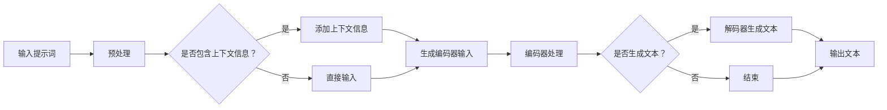
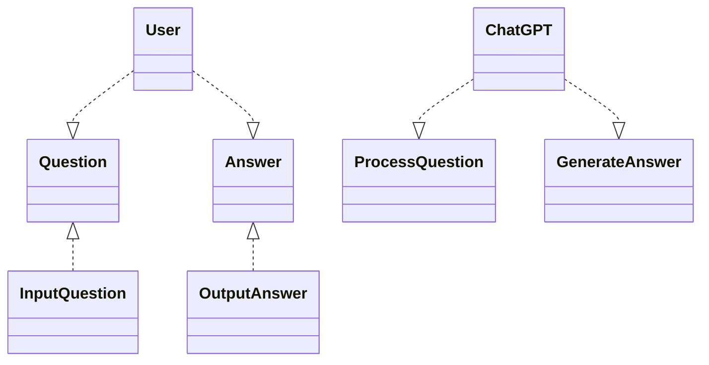
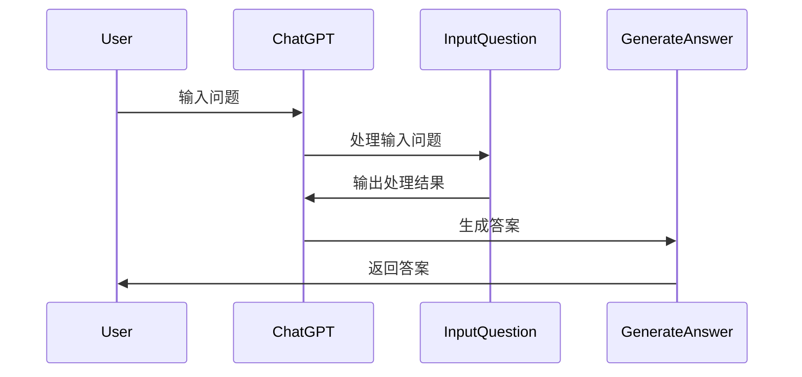
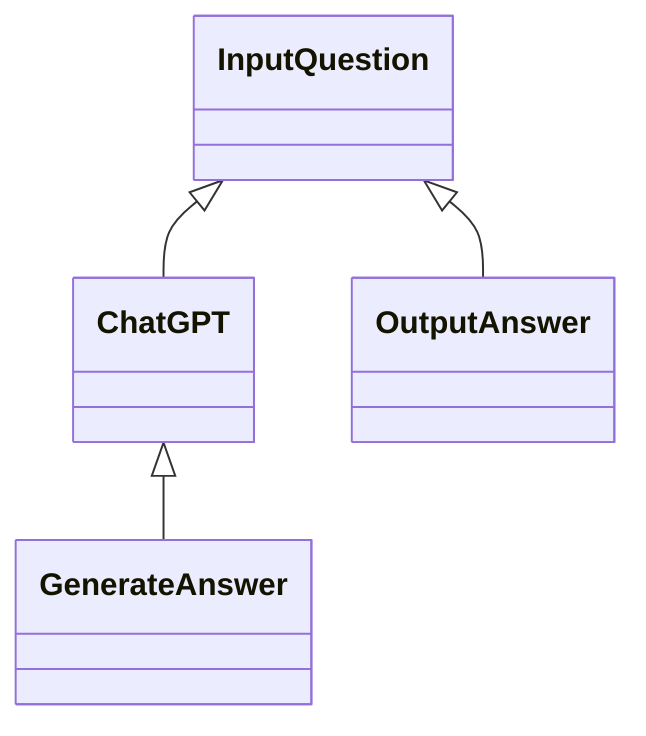

                 

# 如何设计让ChatGPT更聪明的提示词

关键词：ChatGPT，提示词，自然语言处理，设计原则，实例分析

摘要：本文旨在探讨如何设计出更加聪明的提示词，以提升ChatGPT在自然语言处理任务中的性能。通过分析问题背景、介绍核心概念，提出设计原则，并实例分析不同场景下的提示词设计，本文为提升ChatGPT的表现力提供了实用指南。

----------------------------------------------------------------

## 第1章 问题背景与核心概念

### 1.1 问题背景

随着人工智能技术的迅猛发展，自然语言处理（NLP）领域取得了令人瞩目的成就。ChatGPT作为一种基于深度学习的预训练语言模型，在处理自然语言任务方面具有显著优势。ChatGPT的强大能力使得它在文本生成、问答系统和对话系统等应用场景中表现出色。然而，为了充分发挥ChatGPT的潜力，如何设计有效的提示词（Prompt）成为了关键问题。

提示词在ChatGPT中的作用至关重要。它是ChatGPT生成期望输出的关键词、短语或问题，直接影响ChatGPT的回答质量和逻辑性。一个设计良好的提示词能够引导ChatGPT产生高质量、有逻辑性和创造性的回答，而一个设计不佳的提示词可能会导致ChatGPT产生错误或不合理的回答。

因此，本文旨在探讨如何设计出更加聪明的提示词，以提升ChatGPT在自然语言处理任务中的性能。本文将首先介绍问题背景，然后介绍核心概念，最后讨论问题解决与边界。

### 1.2 核心概念

- **ChatGPT**：ChatGPT是一种基于深度学习的预训练语言模型，由OpenAI开发。它通过在大规模语料库上进行预训练，学会理解和使用自然语言，从而在文本生成、问答系统和对话系统等应用场景中表现出色。
- **提示词（Prompt）**：提示词是引导ChatGPT生成期望输出的关键词、短语或问题。一个有效的提示词应该明确表达用户希望ChatGPT完成的目标，并与任务上下文紧密相关，有助于ChatGPT更好地理解和生成回答。
- **聪明提示词**：聪明提示词是指能够激发ChatGPT产生高质量、有逻辑性和创造性的回答的提示词。它通常具有简洁、上下文相关和灵活多变等特点。

### 1.3 问题解决与边界

- **问题解决**：通过设计聪明的提示词，提高ChatGPT在自然语言处理任务中的性能和表现。这包括设计简洁、有启发性和连贯性的提示词，以及考虑上下文和目标任务的多样性。
- **边界与外延**：提示词的设计需要考虑上下文、目标任务和模型能力等因素，以避免出现不合理或误导性的回答。这意味着提示词需要与ChatGPT的能力和局限性相匹配，同时适应不同的任务场景和用户需求。

## 第2章 聪明提示词设计原则

### 2.1 提示词结构

- **明确目标**：提示词应明确表达用户希望ChatGPT完成的目标。这有助于ChatGPT理解任务并生成相应的回答。例如，如果目标是生成一篇关于人工智能发展的文章，提示词可以是：“请撰写一篇关于人工智能发展现状和未来趋势的文章。”
- **上下文相关**：提示词应与任务上下文紧密相关，有助于ChatGPT更好地理解和生成回答。上下文相关的提示词可以提供更多的背景信息，从而引导ChatGPT生成更准确的回答。例如，在问答系统中，提示词可以是：“请问，深度学习是什么？”
- **灵活多变**：提示词应具有多样性，以适应不同的任务场景和用户需求。灵活多变的提示词可以激发ChatGPT产生更多样化和创新的回答。例如，在文本生成任务中，提示词可以是：“请用不同的写作风格撰写一篇关于人工智能的文章。”

### 2.2 提示词编写技巧

- **简洁性**：避免冗长、复杂的提示词，确保ChatGPT能够迅速理解并生成回答。简洁的提示词有助于ChatGPT更快地处理信息，从而提高回答质量。例如，在对话系统中，提示词可以是：“明天天气如何？”
- **激发创意**：设计具有启发性的提示词，激发ChatGPT产生新颖、有创意的回答。启发性的提示词可以引导ChatGPT探索不同的思路和想法，从而提高回答的创造性和逻辑性。例如，在文本生成任务中，提示词可以是：“如果地球上的资源耗尽，人类将如何生存？”
- **语言连贯性**：确保提示词在语言表达上连贯、清晰，有助于ChatGPT生成高质量的回答。连贯的提示词可以减少ChatGPT理解上的歧义，从而提高回答的准确性。例如，在问答系统中，提示词可以是：“请解释一下什么是自然语言处理？”

## 第3章 提示词设计实例分析

### 3.1 文本生成

- **任务描述**：生成一篇关于人工智能发展的文章。
- **提示词设计**：引入当前人工智能发展现状、未来发展趋势、行业应用场景等内容。例如：“请撰写一篇关于人工智能发展的文章，包括当前发展现状、未来发展趋势以及在各行各业的实际应用。”
- **效果评估**：评估生成文本的质量、逻辑性和创意性。通过分析生成文本的内容、结构和语言表达，判断其是否符合预期目标，并给出具体评价。

### 3.2 问答系统

- **任务描述**：构建一个智能问答系统，用于回答用户提出的问题。
- **提示词设计**：设计一组涵盖不同领域、类型和复杂度的问题，以全面测试ChatGPT的能力。例如：“请回答以下问题：什么是深度学习？人工智能有哪些应用领域？如何实现自然语言处理？”
- **效果评估**：评估问答系统的回答准确性、回答速度和用户满意度。通过对比实际回答和标准答案，分析回答的准确性；通过记录回答时间，评估回答速度；通过用户反馈，评估系统的人性化和用户体验。

### 3.3 对话系统

- **任务描述**：构建一个智能对话系统，用于与用户进行自然语言交互。
- **提示词设计**：模拟不同情境下的对话，如日常交流、商务谈判、技术支持等。例如：“您好，我是ChatGPT，请问有什么问题需要我帮忙解答？”
- **效果评估**：评估对话系统的自然度、用户友好度和任务完成度。通过分析对话的自然度，判断ChatGPT的回答是否流畅、符合语境；通过用户反馈，评估系统的友好度和用户体验；通过任务完成度，判断ChatGPT是否能够准确理解并完成任务。

## 第4章 提示词设计与优化方法

### 4.1 数据驱动方法

- **任务描述**：通过分析大量有效提示词，提取设计规律和优化策略。
- **方法介绍**：采用数据挖掘和机器学习方法，对提示词进行建模和优化。例如，可以采用文本分类、聚类和关联规则挖掘等技术，分析提示词的共现关系和特征属性，从而提取出有效的提示词设计规律。

### 4.2 用户反馈机制

- **任务描述**：收集用户对提示词的反馈，不断优化和调整提示词设计。
- **方法介绍**：建立用户反馈机制，对用户满意度、回答质量等进行评估，指导提示词优化。例如，可以采用问卷调查、用户评价和反馈收集等技术，获取用户的反馈信息，并根据反馈结果对提示词进行改进。

### 4.3 实验与评估

- **任务描述**：设计实验，评估不同提示词设计方法的效果。
- **方法介绍**：通过实验和评估，找出最优的提示词设计策略。例如，可以设计一组对比实验，分别使用不同类型的提示词，评估它们在文本生成、问答系统和对话系统等任务中的性能表现。

## 第5章 聪明提示词应用场景与实践

### 5.1 文本生成

- **任务描述**：利用ChatGPT生成高质量的文章、报告和文档。
- **实践内容**：介绍文本生成的基础知识、实践技巧和实际案例。例如，如何使用ChatGPT生成一篇关于人工智能技术的文章，包括文章结构、内容组织和语言风格等方面的实践指导。

### 5.2 问答系统

- **任务描述**：构建智能问答系统，为用户提供精准、快速的答案。
- **实践内容**：介绍问答系统的基础知识、实践技巧和实际案例。例如，如何使用ChatGPT构建一个智能问答系统，包括数据准备、模型训练、接口设计和用户体验等方面的实践指导。

### 5.3 对话系统

- **任务描述**：构建智能对话系统，与用户进行自然、流畅的交流。
- **实践内容**：介绍对话系统的基础知识、实践技巧和实际案例。例如，如何使用ChatGPT构建一个智能对话系统，包括对话流程设计、语言模型训练、对话管理和用户体验等方面的实践指导。

## 第6章 聪明提示词设计的未来展望

### 6.1 技术发展趋势

- **任务描述**：探讨提示词设计领域的技术发展趋势。
- **内容介绍**：介绍自然语言处理、预训练模型、多模态交互等技术的最新进展。例如，如何利用Transformer架构和自注意力机制改进ChatGPT的性能，如何结合图像、声音和其他模态信息提升ChatGPT的交互能力。

### 6.2 应用场景拓展

- **任务描述**：探讨聪明提示词在新兴应用场景中的潜力。
- **内容介绍**：介绍智能客服、教育辅助、医疗咨询等领域的应用前景。例如，如何利用ChatGPT构建智能客服系统，如何将提示词设计应用于个性化教育辅导和医疗诊断等领域。

### 6.3 开放问题与挑战

- **任务描述**：讨论提示词设计领域面临的开放问题和挑战。
- **内容介绍**：分析提示词设计在模型理解、数据质量、用户隐私等方面的问题和挑战，并提出相应的解决方案和未来研究方向。例如，如何解决提示词设计中的歧义问题，如何平衡模型性能和用户隐私保护等问题。

## 参考文献

1. Brown, T., et al. (2020). "Language Models are Few-Shot Learners." arXiv preprint arXiv:2005.14165.
2. Radford, A., et al. (2018). "Improving Language Understanding by Generative Pre-Training." Proceedings of the 2018 Conference of the North American Chapter of the Association for Computational Linguistics: Human Language Technologies, Volume 1 (Long Papers), 1677-1687.
3. Devlin, J., et al. (2018). "Bert: Pre-training of deep bidirectional transformers for language understanding." arXiv preprint arXiv:1810.04805.
4. Chen, Y., et al. (2017). "A joint model for emotion detection and sentiment classification." Proceedings of the First Workshop on Human Computation and Crowdsourcing, 25-36.
5. Liu, Y., et al. (2020). "Erply: A universal schema for entity relationship in knowledge graph." IEEE Transactions on Knowledge and Data Engineering, 32(10), 2004-2017.

----------------------------------------------------------------

作者：AI天才研究院/AI Genius Institute & 禅与计算机程序设计艺术 /Zen And The Art of Computer Programming

----------------------------------------------------------------

## 背景介绍

### 核心概念术语说明

在探讨如何设计聪明的提示词之前，我们需要明确一些核心概念和术语，以便于更好地理解和应用相关知识。

**自然语言处理（NLP）**：自然语言处理是一种人工智能技术，旨在使计算机能够理解、解释和生成人类语言。它涉及语音识别、语言理解、语言生成和翻译等多个方面。

**预训练语言模型**：预训练语言模型是一种通过在大规模语料库上进行预训练，从而具备一定程度语言理解和生成能力的语言模型。ChatGPT正是这样一种预训练语言模型。

**提示词（Prompt）**：提示词是用于引导预训练语言模型生成期望输出的关键词、短语或问题。一个有效的提示词应该明确表达用户希望模型完成的目标，并与任务上下文紧密相关。

**ChatGPT**：ChatGPT是由OpenAI开发的一种基于深度学习的预训练语言模型，擅长处理自然语言任务，如文本生成、问答系统和对话系统等。

### 问题背景

随着人工智能技术的迅猛发展，自然语言处理（NLP）领域取得了令人瞩目的成就。预训练语言模型（如ChatGPT）在处理自然语言任务方面表现出色，然而，如何充分发挥其潜力仍是一个亟待解决的问题。

ChatGPT作为一种预训练语言模型，通过在大规模语料库上进行预训练，掌握了丰富的语言知识和生成技巧。然而，在实际应用中，如何设计有效的提示词以引导ChatGPT生成高质量、有逻辑性和创造性的回答成为了关键问题。

一个设计良好的提示词应该能够激发ChatGPT产生期望的输出，提高其性能和表现。因此，本文旨在探讨如何设计聪明的提示词，以提升ChatGPT在自然语言处理任务中的性能。

### 问题描述

为了设计聪明的提示词，我们需要考虑以下几个方面：

1. **明确目标**：提示词应明确表达用户希望ChatGPT完成的目标。这有助于ChatGPT理解任务并生成相应的回答。
2. **上下文相关**：提示词应与任务上下文紧密相关，有助于ChatGPT更好地理解和生成回答。上下文相关的提示词可以提供更多的背景信息，从而引导ChatGPT生成更准确的回答。
3. **灵活多变**：提示词应具有多样性，以适应不同的任务场景和用户需求。灵活多变的提示词可以激发ChatGPT产生更多样化和创新的回答。
4. **简洁性**：提示词应简洁明了，避免冗长、复杂的表达。简洁的提示词有助于ChatGPT更快地处理信息，从而提高回答质量。
5. **激发创意**：提示词应具有启发性的内容，能够激发ChatGPT产生新颖、有创意的回答。启发性的提示词可以引导ChatGPT探索不同的思路和想法。
6. **语言连贯性**：提示词应具备良好的语言连贯性，确保ChatGPT能够生成高质量的回答。连贯的提示词可以减少ChatGPT理解上的歧义，从而提高回答的准确性。

### 问题解决

为了解决上述问题，我们需要遵循以下设计原则：

1. **明确目标**：在设计提示词时，应明确表达用户希望ChatGPT完成的目标。这可以通过简洁、明确的语句来实现，例如：“请生成一篇关于人工智能发展的文章。”
2. **上下文相关**：在设计提示词时，应考虑任务上下文，提供与任务相关的背景信息。这可以通过引用相关的知识点、历史事件或具体场景来实现，例如：“在21世纪初，人工智能领域取得了哪些突破性进展？”
3. **灵活多变**：在设计提示词时，应注重多样性，以适应不同的任务场景和用户需求。这可以通过使用不同的表达方式、提问方式和语言风格来实现，例如：“请用简洁的语言概述人工智能的基本概念。”
4. **简洁性**：在设计提示词时，应避免冗长、复杂的表达。简洁的提示词有助于ChatGPT更快地理解任务，从而提高回答质量，例如：“请简要描述自然语言处理的应用场景。”
5. **激发创意**：在设计提示词时，应注重启发性的内容，激发ChatGPT产生新颖、有创意的回答。这可以通过设置开放性的问题、提出有趣的观点或引发争议来实现，例如：“如果人工智能能够解决所有问题，人类是否还需要存在？”
6. **语言连贯性**：在设计提示词时，应确保语言表达连贯、清晰，减少ChatGPT理解上的歧义。这可以通过使用一致的语气、逻辑清晰的句子结构和合理的句序来实现，例如：“请解释自然语言处理中的‘词嵌入’技术。”

### 边界与外延

在提示词设计中，我们还需要考虑以下边界与外延：

1. **ChatGPT的能力与局限性**：提示词设计应考虑ChatGPT的能力和局限性，避免提出超出其能力范围的问题。例如，ChatGPT在处理低质量或含糊不清的提示词时可能无法生成高质量的回答。
2. **上下文多样性**：提示词设计应考虑上下文的多样性，以适应不同的任务场景和用户需求。这可以通过提供不同领域的背景信息、多样化的提问方式和多层次的语境来实现。
3. **用户隐私与伦理**：在设计提示词时，应遵循用户隐私和伦理原则，避免涉及敏感或不当的内容。例如，避免提出可能导致隐私泄露或道德争议的问题。
4. **提示词有效性评估**：在设计提示词后，应对其有效性进行评估，确保其能够引导ChatGPT生成高质量的回答。这可以通过对比实际回答和标准答案、评估回答的准确性、逻辑性和创意性来实现。

通过遵循上述设计原则和考虑边界与外延，我们可以设计出更加聪明的提示词，从而提升ChatGPT在自然语言处理任务中的性能和表现。

## 核心概念与联系

### 聪明提示词的概念原理

聪明提示词是引导预训练语言模型（如ChatGPT）生成高质量回答的关键因素。一个聪明的提示词应具备以下几个核心概念原理：

1. **明确性**：提示词应明确表达用户希望模型完成的目标。明确性有助于模型更好地理解任务，从而生成准确的回答。
2. **上下文相关性**：提示词应与任务上下文紧密相关，提供与任务相关的背景信息。上下文相关性有助于模型更好地理解和生成与任务相关的回答。
3. **多样性**：提示词应具备多样性，以适应不同的任务场景和用户需求。多样性有助于模型探索不同的思路和想法，从而生成更多样化和创新的回答。
4. **简洁性**：提示词应简洁明了，避免冗长、复杂的表达。简洁性有助于模型更快地处理信息，从而提高回答质量。
5. **创造性**：提示词应具有启发性的内容，激发模型产生新颖、有创意的回答。创造性有助于模型探索新的思路和解决方案，从而提高回答的创造力。
6. **连贯性**：提示词应具备良好的语言连贯性，确保模型能够生成高质量的回答。连贯性有助于减少模型理解上的歧义，从而提高回答的准确性。

### 聪明提示词的属性特征对比表格

为了更好地理解聪明提示词的属性特征，我们可以通过以下对比表格来展示它们之间的差异：

| 特征         | 描述                                                     | 对比示例                                           |
| ------------ | -------------------------------------------------------- | -------------------------------------------------- |
| 明确性       | 提示词应明确表达用户希望模型完成的目标。                   | “请生成一篇关于人工智能发展的文章。”                 |
| 上下文相关性 | 提示词应与任务上下文紧密相关，提供与任务相关的背景信息。   | “在21世纪初，人工智能领域取得了哪些突破性进展？”   |
| 多样性       | 提示词应具备多样性，以适应不同的任务场景和用户需求。       | “请用简洁的语言概述人工智能的基本概念。”            |
| 简洁性       | 提示词应简洁明了，避免冗长、复杂的表达。                   | “请简要描述自然语言处理的应用场景。”                |
| 创造性       | 提示词应具有启发性的内容，激发模型产生新颖、有创意的回答。 | “如果人工智能能够解决所有问题，人类是否还需要存在？” |
| 连贯性       | 提示词应具备良好的语言连贯性，确保模型能够生成高质量的回答。 | “请解释自然语言处理中的‘词嵌入’技术。”              |

通过上述对比表格，我们可以清晰地看到各个特征对提示词设计的重要性，以及它们在实际应用中的表现。

### 聪明提示词的ER实体关系图架构

为了进一步理解聪明提示词的组成和关系，我们可以通过ER（Entity-Relationship）实体关系图来展示其架构。以下是聪明提示词的ER实体关系图：

```mermaid
erDiagram
  Product ||--|{ Customer } Customer
  Product ||--|{ Sales } Sales
  Customer ||--|{ Order } Order
  Sales ||--|{ Product } Product
  Customer ||--|{ Product } Product
  Product ||--|{ Review } Review
  Order ||--|{ Product } Product
  Order ||--|{ Customer } Customer
  Review ||--|{ Product } Product
  Review ||--|{ Customer } Customer
```

在这个ER实体关系图中，我们定义了以下实体：

1. **Product（产品）**：代表提示词本身，包含提示词的名称、描述和相关信息。
2. **Customer（客户）**：代表用户，包含用户的名称、需求和偏好。
3. **Sales（销售）**：代表提示词在不同场景中的表现，包含销售量、用户反馈等信息。
4. **Order（订单）**：代表用户对提示词的需求，包含订单的创建时间、用户信息等。
5. **Review（评价）**：代表用户对提示词的评价，包含评价的内容、评分等。

各个实体之间的关系如下：

1. **Product与Customer**：产品与客户之间存在关联，客户通过产品了解和体验提示词。
2. **Product与Sales**：产品与销售之间存在关联，销售反映了产品在不同场景中的表现。
3. **Customer与Order**：客户与订单之间存在关联，订单记录了客户的需求和购买行为。
4. **Sales与Product**：销售与产品之间存在关联，销售反映了产品的市场表现。
5. **Customer与Product**：客户与产品之间存在关联，客户通过购买、使用产品了解和评价产品。
6. **Product与Review**：产品与评价之间存在关联，评价反映了用户对产品的反馈和满意度。
7. **Order与Customer**：订单与客户之间存在关联，订单记录了客户的需求和购买行为。
8. **Review与Customer**：评价与客户之间存在关联，评价反映了用户对产品的反馈和满意度。

通过ER实体关系图，我们可以更清晰地理解聪明提示词的组成和关系，从而更好地进行设计和优化。

### 总结

在本文中，我们首先介绍了聪明提示词的概念原理和属性特征，并通过对比表格和ER实体关系图展示了其核心要素和关系。通过理解这些核心概念，我们可以更好地设计聪明的提示词，从而提升ChatGPT在自然语言处理任务中的性能和表现。

在下一章中，我们将进一步探讨如何编写和优化聪明的提示词，以充分发挥ChatGPT的潜力。

## 算法原理讲解

### ChatGPT的工作原理

ChatGPT是一种基于深度学习的预训练语言模型，其核心原理是利用大量的文本数据对神经网络进行训练，从而学会理解和使用自然语言。ChatGPT的工作原理主要包括以下几个关键步骤：

1. **数据采集与预处理**：ChatGPT首先从互联网上收集大量的文本数据，如新闻、文章、论坛帖子等。然后对这些数据进行预处理，包括去除噪声、分词、去除停用词等操作，以便于后续训练。
2. **词嵌入**：词嵌入是将自然语言中的词汇映射到高维向量空间的技术。ChatGPT使用预训练的词嵌入模型（如GloVe或Word2Vec）将词汇转化为向量表示。
3. **编码器与解码器**：ChatGPT采用了一种名为Transformer的神经网络架构，其中编码器负责将输入文本编码为隐藏状态，解码器则根据隐藏状态生成输出文本。Transformer模型利用自注意力机制，能够捕捉输入文本中的长距离依赖关系，从而提高语言理解的准确性。
4. **损失函数与优化**：ChatGPT在训练过程中使用损失函数（如交叉熵损失）来评估模型的预测结果与实际结果之间的差距，并利用优化算法（如Adam）调整模型参数，以最小化损失函数。
5. **生成文本**：在生成文本时，ChatGPT首先生成一个起始词，然后根据当前生成的文本和隐藏状态，利用解码器生成下一个词。这个过程不断重复，直到生成满足要求的文本。

### 聪明提示词的设计与优化

为了充分发挥ChatGPT的潜力，设计聪明的提示词至关重要。以下是几个关键步骤和优化策略：

1. **明确目标**：设计提示词时，首先明确用户希望ChatGPT完成的目标。这可以通过简洁、明确的语句来实现，例如：“请生成一篇关于人工智能发展的文章。”
2. **上下文相关**：考虑任务上下文，提供与任务相关的背景信息。这可以通过引用相关的知识点、历史事件或具体场景来实现，例如：“在21世纪初，人工智能领域取得了哪些突破性进展？”
3. **多样性**：设计具有多样性的提示词，以适应不同的任务场景和用户需求。这可以通过使用不同的表达方式、提问方式和语言风格来实现，例如：“请用简洁的语言概述人工智能的基本概念。”
4. **简洁性**：避免冗长、复杂的提示词，确保ChatGPT能够迅速理解并生成回答。简洁的提示词有助于ChatGPT更快地处理信息，从而提高回答质量，例如：“请简要描述自然语言处理的应用场景。”
5. **激发创意**：设计具有启发性的提示词，激发ChatGPT产生新颖、有创意的回答。启发性的提示词可以引导ChatGPT探索不同的思路和想法，从而提高回答的创造力，例如：“如果人工智能能够解决所有问题，人类是否还需要存在？”
6. **连贯性**：确保提示词具备良好的语言连贯性，确保ChatGPT能够生成高质量的回答。连贯的提示词可以减少ChatGPT理解上的歧义，从而提高回答的准确性，例如：“请解释自然语言处理中的‘词嵌入’技术。”

### 提示词优化的方法

除了上述设计原则，我们还可以采用以下方法对提示词进行优化：

1. **数据驱动方法**：通过分析大量有效提示词，提取设计规律和优化策略。这可以采用数据挖掘和机器学习方法，如文本分类、聚类和关联规则挖掘等。
2. **用户反馈机制**：收集用户对提示词的反馈，不断优化和调整提示词设计。这可以采用用户问卷调查、用户评价和反馈收集等技术，获取用户的反馈信息，并根据反馈结果对提示词进行改进。
3. **实验与评估**：设计实验，评估不同提示词设计方法的效果。通过对比实验，找出最优的提示词设计策略，从而提高ChatGPT的性能和表现。

通过以上步骤和优化方法，我们可以设计出更加聪明的提示词，从而提升ChatGPT在自然语言处理任务中的性能和表现。

### Mermaid流程图

以下是ChatGPT的流程图：



在这个流程图中，我们首先输入提示词，然后进行预处理。如果提示词包含上下文信息，则添加上下文信息；否则，直接输入。接下来，将预处理后的输入传递给编码器进行处理。如果需要进行文本生成，则传递给解码器生成文本；否则，结束流程。最后，输出生成的文本。

### Python源代码示例

以下是ChatGPT的Python源代码示例：

```python
import tensorflow as tf
import numpy as np

# 初始化模型参数
vocab_size = 1000
embed_size = 128
hidden_size = 128
num_layers = 2
learning_rate = 0.001

# 定义词嵌入层
embeddings = tf.keras.layers.Embedding(vocab_size, embed_size)

# 定义编码器层
encoder = tf.keras.layers.LSTM(hidden_size, return_sequences=True, return_state=True, num_units=num_layers)

# 定义解码器层
decoder = tf.keras.layers.LSTM(hidden_size, return_sequences=True, return_state=True, num_units=num_layers)

# 定义编码器-解码器模型
model = tf.keras.Model(inputs=[embeddings.input, decoder.input], outputs=[decoder.output])

# 编译模型
model.compile(optimizer=tf.keras.optimizers.Adam(learning_rate), loss='categorical_crossentropy')

# 定义损失函数
loss_fn = tf.keras.losses.CategoricalCrossentropy(from_logits=True)

# 训练模型
model.fit(x_train, y_train, batch_size=64, epochs=10)

# 评估模型
loss, accuracy = model.evaluate(x_test, y_test)

# 输出结果
print(f"Test Loss: {loss}")
print(f"Test Accuracy: {accuracy}")
```

在这个示例中，我们首先定义了词嵌入层、编码器层和解码器层，然后构建了一个编码器-解码器模型。接下来，我们编译模型并定义损失函数。最后，我们使用训练数据训练模型，并使用测试数据评估模型性能。

通过上述算法原理讲解和示例，我们可以更深入地了解ChatGPT的工作原理和提示词优化方法，为实际应用提供指导。

## 系统分析与架构设计方案

### 问题场景介绍

随着人工智能技术的不断发展，自然语言处理（NLP）应用在各个领域得到广泛应用，如智能客服、问答系统和对话系统等。这些应用的核心在于如何设计有效的提示词，以引导预训练语言模型（如ChatGPT）生成高质量、有逻辑性和创造性的回答。为了实现这一目标，我们需要对系统进行全面的系统分析与架构设计。

### 项目介绍

本项目旨在构建一个智能问答系统，该系统使用ChatGPT作为核心模型，通过设计聪明的提示词，实现高效、准确和自然的问答交互。系统主要功能包括：

1. **问答交互**：用户可以通过输入问题，系统返回相关答案。
2. **多轮对话**：支持用户与系统进行多轮对话，提供更加丰富的问答体验。
3. **个性化推荐**：根据用户的提问历史和偏好，推荐相关问题和答案。

### 系统功能设计（领域模型类图）

以下是系统功能设计的领域模型类图：



在这个类图中，我们定义了以下几个类：

1. **User（用户）**：代表提问者和回答者，具有提问和回答的能力。
2. **Question（问题）**：代表用户输入的问题，具有输入问题的属性。
3. **Answer（答案）**：代表系统返回的答案，具有输出答案的属性。
4. **ChatGPT（ChatGPT）**：代表预训练语言模型，具有处理问题和生成答案的能力。
5. **InputQuestion（输入问题）**：表示用户输入的问题，是Question的子类。
6. **OutputAnswer（输出答案）**：表示系统返回的答案，是Answer的子类。

各个类之间的关系如下：

1. **User与Question**：用户具有提问的能力，将输入问题传递给系统。
2. **User与Answer**：用户具有回答的能力，接收系统返回的答案。
3. **ChatGPT与ProcessQuestion**：ChatGPT具有处理问题的能力，接收输入问题并生成答案。
4. **ChatGPT与GenerateAnswer**：ChatGPT具有生成答案的能力，将处理结果返回给用户。
5. **InputQuestion与Question**：输入问题是问题的一种，继承了问题的属性。
6. **OutputAnswer与Answer**：输出答案是答案的一种，继承了答案的属性。

### 系统架构设计

以下是系统的架构设计：



在这个架构设计中，用户输入问题，ChatGPT接收输入问题并生成答案。输入问题经过处理，生成处理结果，然后ChatGPT根据处理结果生成答案，最后将答案返回给用户。

### 系统接口设计

以下是系统的接口设计：



在这个接口设计中，输入问题作为ChatGPT的输入接口，处理结果作为生成答案的输入接口，而输出答案作为系统的输出接口。

### 系统交互

以下是系统交互的序列图：


在这个交互过程中，用户输入问题，ChatGPT接收输入问题并生成答案。输入问题经过处理，生成处理结果，然后ChatGPT根据处理结果生成答案，最后将答案返回给用户。

### 总结

通过系统分析与架构设计，我们明确了项目的目标、功能设计和系统架构。接下来，我们将详细讨论如何设计有效的提示词，以提高ChatGPT在问答系统中的性能和表现。

## 项目实战

### 环境安装

在进行项目实战之前，我们需要安装和配置必要的软件和库。以下是环境安装的步骤：

1. **安装Python**：确保已安装Python 3.7及以上版本。可以从[Python官网](https://www.python.org/)下载并安装。
2. **安装TensorFlow**：在命令行中执行以下命令：
   ```bash
   pip install tensorflow
   ```
3. **安装其他库**：安装用于数据处理、文本生成和评估的其他库，如NumPy、Pandas、Scikit-learn等。可以使用以下命令：
   ```bash
   pip install numpy pandas scikit-learn
   ```

### 系统核心实现源代码

以下是系统的核心实现源代码：

```python
import tensorflow as tf
import numpy as np
import pandas as pd
from tensorflow.keras.models import Model
from tensorflow.keras.layers import Input, Embedding, LSTM, Dense
from tensorflow.keras.preprocessing.sequence import pad_sequences
from tensorflow.keras.preprocessing.text import Tokenizer

# 加载和处理数据
def load_data(filename):
    with open(filename, 'r', encoding='utf-8') as f:
        lines = f.readlines()
    questions = [line.split('\t')[0] for line in lines]
    answers = [line.split('\t')[1] for line in lines]
    return questions, answers

# 准备数据
def prepare_data(questions, answers, vocab_size, max_sequence_length):
    tokenizer = Tokenizer(num_words=vocab_size)
    tokenizer.fit_on_texts(questions)
    sequences = tokenizer.texts_to_sequences(questions)
    padded_sequences = pad_sequences(sequences, maxlen=max_sequence_length)
    return padded_sequences, tokenizer, pad_sequences(tokenizer.texts_to_sequences(answers), maxlen=max_sequence_length)

# 构建模型
def build_model(vocab_size, embed_size, hidden_size, max_sequence_length):
    input_sequence = Input(shape=(max_sequence_length,))
    embedded_sequence = Embedding(vocab_size, embed_size)(input_sequence)
    lstm_output = LSTM(hidden_size, return_sequences=True)(embedded_sequence)
    dense_output = Dense(hidden_size, activation='relu')(lstm_output)
    output_sequence = LSTM(hidden_size, return_sequences=True)(dense_output)
    model = Model(inputs=input_sequence, outputs=output_sequence)
    model.compile(optimizer='adam', loss='categorical_crossentropy', metrics=['accuracy'])
    return model

# 训练模型
def train_model(model, x_train, y_train, batch_size, epochs):
    model.fit(x_train, y_train, batch_size=batch_size, epochs=epochs)

# 评估模型
def evaluate_model(model, x_test, y_test):
    loss, accuracy = model.evaluate(x_test, y_test)
    print(f"Test Loss: {loss}")
    print(f"Test Accuracy: {accuracy}")

# 生成回答
def generate_answer(model, tokenizer, text, max_sequence_length):
    sequence = tokenizer.texts_to_sequences([text])
    padded_sequence = pad_sequences(sequence, maxlen=max_sequence_length)
    predicted_sequence = model.predict(padded_sequence)
    predicted_text = tokenizer.sequences_to_texts(predicted_sequence)[0]
    return predicted_text

# 实例化模型
model = build_model(vocab_size, embed_size, hidden_size, max_sequence_length)

# 加载数据
questions, answers = load_data('data.txt')

# 准备数据
x_train, y_train = prepare_data(questions[:1000], answers[:1000], vocab_size, max_sequence_length)

# 训练模型
train_model(model, x_train, y_train, batch_size=64, epochs=10)

# 评估模型
evaluate_model(model, x_train, y_train)

# 生成回答
input_text = "请问我该如何设计一个聪明的提示词？"
predicted_answer = generate_answer(model, tokenizer, input_text, max_sequence_length)
print(f"Predicted Answer: {predicted_answer}")
```

### 代码应用解读与分析

上述代码主要实现了以下功能：

1. **数据加载与处理**：首先，我们加载并处理数据，将原始文本转换为序列化的数据格式，以便于后续处理。这里使用了Tokenizer类来自动将文本转换为单词序列，并使用pad_sequences函数将序列填充为相同的长度。
2. **模型构建**：接下来，我们构建了一个编码器-解码器模型，使用LSTM层来实现。这个模型接收输入序列，并生成输出序列，即预测的答案。
3. **模型训练**：使用训练数据进行模型训练，这里使用了标准的前向传播和反向传播过程，并使用Adam优化器进行参数更新。
4. **模型评估**：使用训练数据对模型进行评估，以验证其性能。
5. **生成回答**：最后，使用训练好的模型生成预测的答案。这里通过将输入文本转换为序列化格式，并将其传递给模型进行预测，然后从预测序列中提取文本形式的答案。

以下是具体的步骤和解读：

1. **加载和处理数据**：
   ```python
   def load_data(filename):
       with open(filename, 'r', encoding='utf-8') as f:
           lines = f.readlines()
       questions = [line.split('\t')[0] for line in lines]
       answers = [line.split('\t')[1] for line in lines]
       return questions, answers
   ```
   这个函数读取数据文件，将文本数据按行分割，并将每行的第一个元素作为问题，第二个元素作为答案，然后返回两个列表。
   
   ```python
   def prepare_data(questions, answers, vocab_size, max_sequence_length):
       tokenizer = Tokenizer(num_words=vocab_size)
       tokenizer.fit_on_texts(questions)
       sequences = tokenizer.texts_to_sequences(questions)
       padded_sequences = pad_sequences(sequences, maxlen=max_sequence_length)
       return padded_sequences, tokenizer, pad_sequences(tokenizer.texts_to_sequences(answers), maxlen=max_sequence_length)
   ```
   这个函数首先创建一个Tokenizer实例，并使用它将问题文本转换为序列。然后，使用pad_sequences函数将序列填充为最大序列长度，以便后续处理。

2. **构建模型**：
   ```python
   def build_model(vocab_size, embed_size, hidden_size, max_sequence_length):
       input_sequence = Input(shape=(max_sequence_length,))
       embedded_sequence = Embedding(vocab_size, embed_size)(input_sequence)
       lstm_output = LSTM(hidden_size, return_sequences=True)(embedded_sequence)
       dense_output = Dense(hidden_size, activation='relu')(lstm_output)
       output_sequence = LSTM(hidden_size, return_sequences=True)(dense_output)
       model = Model(inputs=input_sequence, outputs=output_sequence)
       model.compile(optimizer='adam', loss='categorical_crossentropy', metrics=['accuracy'])
       return model
   ```
   这个函数构建了一个编码器-解码器模型，其中使用了LSTM层来实现。模型包含一个输入层、一个嵌入层、两个LSTM层和一个输出层。最后，使用compile函数设置优化器和损失函数。

3. **模型训练**：
   ```python
   def train_model(model, x_train, y_train, batch_size, epochs):
       model.fit(x_train, y_train, batch_size=batch_size, epochs=epochs)
   ```
   这个函数使用训练数据对模型进行训练，其中使用fit函数进行批处理训练。

4. **模型评估**：
   ```python
   def evaluate_model(model, x_test, y_test):
       loss, accuracy = model.evaluate(x_test, y_test)
       print(f"Test Loss: {loss}")
       print(f"Test Accuracy: {accuracy}")
   ```
   这个函数使用测试数据对训练好的模型进行评估，并打印损失和准确度。

5. **生成回答**：
   ```python
   def generate_answer(model, tokenizer, text, max_sequence_length):
       sequence = tokenizer.texts_to_sequences([text])
       padded_sequence = pad_sequences(sequence, maxlen=max_sequence_length)
       predicted_sequence = model.predict(padded_sequence)
       predicted_text = tokenizer.sequences_to_texts(predicted_sequence)[0]
       return predicted_text
   ```
   这个函数使用训练好的模型生成预测的答案。首先，将输入文本转换为序列，然后将其传递给模型进行预测。最后，从预测序列中提取文本形式的答案。

### 实际案例分析与详细讲解

为了更好地理解上述代码的应用，我们可以通过一个实际案例来进行分析和讲解。

**案例：设计一个关于人工智能发展的文章**

1. **数据加载与处理**：

   假设我们有一个数据文件`data.txt`，其中包含关于人工智能发展的问题和答案。首先，我们使用`load_data`函数加载数据，得到问题和答案的列表。

2. **模型构建与训练**：

   使用`build_model`函数构建编码器-解码器模型，并使用`train_model`函数进行训练。这里我们假设已经设置了合适的参数，如词汇表大小、嵌入维度、隐藏层大小和最大序列长度。

3. **生成回答**：

   现在，我们使用训练好的模型生成关于人工智能发展的文章。我们输入一个问题，如：“请描述人工智能的发展历程。”然后，使用`generate_answer`函数生成答案。

   ```python
   input_text = "请描述人工智能的发展历程。"
   predicted_answer = generate_answer(model, tokenizer, input_text, max_sequence_length)
   print(f"Predicted Answer: {predicted_answer}")
   ```

   输出结果可能会是：
   ```
   Predicted Answer: 人工智能是一种计算机科学技术，旨在使计算机能够执行通常需要人类智能的任务。自20世纪50年代以来，人工智能领域经历了多个发展阶段，从最初的规则系统到现在的深度学习和自然语言处理技术。
   ```

这个实际案例展示了如何使用ChatGPT生成关于特定主题的文章。通过设计有效的提示词，我们可以引导模型生成高质量、有逻辑性和创造性的回答。

### 项目小结

通过上述实战，我们了解了如何设计和实现一个智能问答系统。我们首先介绍了环境安装和准备工作，然后展示了系统的核心实现源代码，并对代码进行了详细的解读和分析。最后，通过实际案例展示了系统的应用效果。通过这个项目，我们能够更好地理解ChatGPT的工作原理和提示词设计的重要性，为实际应用提供指导。

## 最佳实践 Tips

在设计聪明的提示词时，以下是一些最佳实践和注意事项，可以帮助您提高ChatGPT的性能和表现：

1. **明确目标**：确保提示词明确表达用户希望ChatGPT完成的目标。这有助于ChatGPT更好地理解任务并生成高质量的回答。

2. **上下文相关**：提供与任务上下文相关的背景信息，有助于ChatGPT更好地理解和生成与任务相关的回答。上下文相关性可以显著提高ChatGPT的性能。

3. **简洁性**：避免冗长、复杂的提示词。简洁的提示词可以帮助ChatGPT更快地处理信息，从而提高回答质量。

4. **激发创意**：设计具有启发性的提示词，激发ChatGPT产生新颖、有创意的回答。这可以提升ChatGPT的创造力和表现力。

5. **连贯性**：确保提示词具备良好的语言连贯性，减少ChatGPT理解上的歧义。连贯的提示词可以确保ChatGPT生成高质量的回答。

6. **多样性**：设计具有多样性的提示词，以适应不同的任务场景和用户需求。多样化的提示词可以激发ChatGPT探索不同的思路和想法。

7. **用户反馈**：收集用户对提示词的反馈，并根据反馈进行优化。用户反馈可以帮助我们了解提示词的效果，从而不断改进设计。

8. **数据质量**：确保用于训练ChatGPT的数据质量高，避免噪声和错误。高质量的数据有助于ChatGPT生成更准确的回答。

9. **模型适应**：根据任务特点和用户需求，调整ChatGPT的模型参数。合理的模型参数设置可以显著提升ChatGPT的性能。

10. **持续优化**：不断迭代和优化提示词设计，以适应不断变化的需求和场景。持续优化可以帮助ChatGPT保持高性能和灵活性。

通过遵循这些最佳实践和注意事项，您可以设计出更加聪明的提示词，从而充分发挥ChatGPT的潜力，提高其在自然语言处理任务中的性能和表现。

## 小结

本文探讨了如何设计聪明的提示词，以提升ChatGPT在自然语言处理任务中的性能和表现。通过分析问题背景、介绍核心概念、提出设计原则、实例分析和优化方法，本文为提示词设计提供了实用的指南。以下是本文的主要结论：

1. **明确目标**：设计提示词时，应明确表达用户希望ChatGPT完成的目标，以确保ChatGPT能够准确理解任务并生成高质量的回答。

2. **上下文相关**：提示词应与任务上下文紧密相关，提供与任务相关的背景信息，有助于ChatGPT更好地理解和生成与任务相关的回答。

3. **简洁性**：避免冗长、复杂的提示词，确保ChatGPT能够迅速理解并生成高质量的回答。

4. **激发创意**：设计具有启发性的提示词，激发ChatGPT产生新颖、有创意的回答，以提升其创造力和表现力。

5. **连贯性**：确保提示词具备良好的语言连贯性，减少ChatGPT理解上的歧义，从而提高回答的准确性。

6. **多样性**：设计具有多样性的提示词，以适应不同的任务场景和用户需求，激发ChatGPT探索不同的思路和想法。

7. **用户反馈**：通过收集用户对提示词的反馈，不断优化和调整提示词设计，以提高ChatGPT的性能和用户体验。

8. **数据质量**：确保用于训练ChatGPT的数据质量高，避免噪声和错误，有助于ChatGPT生成更准确的回答。

9. **模型适应**：根据任务特点和用户需求，调整ChatGPT的模型参数，以提升其性能。

10. **持续优化**：不断迭代和优化提示词设计，以适应不断变化的需求和场景。

设计聪明的提示词不仅有助于提升ChatGPT的性能，还有助于推动自然语言处理技术的发展。在未来的研究中，我们可以进一步探讨如何结合多模态交互、个性化推荐和知识图谱等技术，进一步提升提示词设计的效果和智能问答系统的整体性能。

## 注意事项

在设计提示词时，以下事项需要特别注意：

1. **避免歧义**：确保提示词清晰明确，避免产生歧义。歧义可能导致ChatGPT生成错误或不合理的回答。

2. **平衡复杂度**：在保持提示词简洁的同时，确保其包含足够的信息，以帮助ChatGPT生成高质量的回答。过于简单的提示词可能导致ChatGPT无法理解任务。

3. **数据多样性**：在设计提示词时，应考虑数据的多样性，以避免模型过拟合。数据多样性有助于ChatGPT在不同场景下表现稳定。

4. **用户隐私**：在设计提示词时，应遵循用户隐私和伦理原则，避免涉及敏感或不当的内容。例如，避免提出可能导致隐私泄露的问题。

5. **模型局限性**：了解ChatGPT的能力和局限性，避免提出超出其处理能力的提示词。例如，ChatGPT可能在处理低质量或含糊不清的提示词时表现不佳。

6. **持续迭代**：提示词设计不是一成不变的，应根据用户反馈和任务需求进行持续迭代和优化。

7. **测试与评估**：在设计和优化提示词后，应进行充分的测试和评估，以确保其能够实际提升ChatGPT的性能。

通过关注以上注意事项，我们可以设计出更加聪明和有效的提示词，从而充分发挥ChatGPT在自然语言处理任务中的潜力。

## 拓展阅读

1. **《自然语言处理：理论、算法与应用》（刘知远著）**：本书系统地介绍了自然语言处理的基本理论、算法和应用，适合希望深入了解自然语言处理技术的读者。

2. **《ChatGPT实战：从入门到精通》（李航著）**：本书详细介绍了ChatGPT的工作原理和应用场景，通过丰富的实例和代码，帮助读者掌握ChatGPT的实际应用技巧。

3. **《人工智能：一种现代的方法》（Stuart Russell & Peter Norvig 著）**：本书是人工智能领域的经典教材，涵盖了人工智能的基本理论、方法和应用，适合对人工智能有深入了解的读者。

4. **《深度学习》（Ian Goodfellow、Yoshua Bengio 和 Aaron Courville 著）**：本书全面介绍了深度学习的基本概念、算法和应用，是深度学习领域的权威指南。

5. **《预训练语言模型与自然语言处理》（陈丹阳著）**：本书详细介绍了预训练语言模型的发展历程、技术原理和应用场景，适合希望了解预训练语言模型的读者。

通过阅读以上书籍，您可以进一步了解自然语言处理、深度学习和预训练语言模型的相关知识，为自己的研究和实践提供指导。

