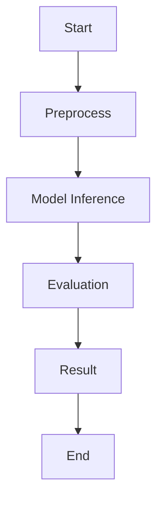
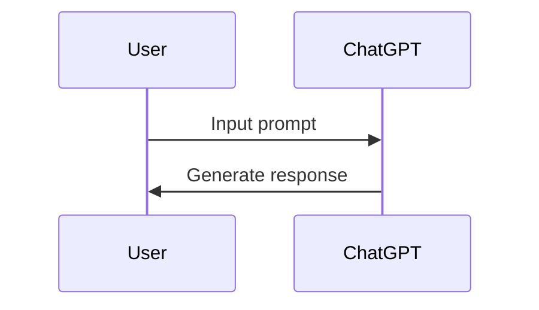

                 


## 如何评估ChatGPT提示词的有效性

### 摘要

本文将探讨如何评估ChatGPT提示词的有效性。我们将从背景介绍、核心概念与联系、算法原理讲解、系统分析与架构设计、项目实战和最佳实践等多个角度展开讨论，旨在为开发者提供一套完整的评估ChatGPT提示词有效性的方法。通过本文的学习，读者将能够理解评估ChatGPT提示词的重要性，掌握有效的评估方法和实践技巧。

### 设计思路

#### 第一部分：问题背景与核心概念

**第1章：问题背景**

1.1 问题背景

- 介绍人工智能和自然语言处理的发展历程
- 引出ChatGPT的兴起和提示词在自然语言处理中的应用

1.2 评估ChatGPT提示词有效性的重要性

- 讨论评估提示词有效性的意义和作用
- 分析评估ChatGPT提示词有效性的现状和挑战

**第2章：核心概念与联系**

2.1 核心概念

- 提示词的定义和作用
- 模型训练与输出的原理
- 评估指标的选择与意义

2.2 概念联系

- 提示词与模型训练的关系
- 模型输出与评估指标的联系

#### 第二部分：评估算法原理与实现

**第3章：评估算法原理**

3.1 算法概述

- 介绍常见的评估算法
- 分析选择评估算法的考虑因素

3.2 算法原理

- 详细解释评估流程
- 展示评估指标的数学模型

**第4章：算法实现**

4.1 Python代码示例

- 提供实际的Python代码示例
- 解释代码的实现原理和细节

4.2 算法可视化

- 使用Mermaid流程图可视化算法流程

#### 第三部分：系统分析与架构设计

**第5章：系统功能设计**

5.1 问题场景

- 描述实际项目场景
- 分析系统功能需求

5.2 系统架构设计

- 介绍系统的领域模型
- 展示系统的架构设计
- 描述系统接口设计

**第6章：系统交互设计**

6.1 系统交互

- 分析系统交互流程
- 使用Mermaid序列图展示系统交互

#### 第四部分：项目实战

**第7章：环境安装与系统实现**

7.1 环境安装

- 讲解硬件与软件要求
- 提供详细的安装步骤

7.2 系统核心实现

- 分析源代码实现
- 解释代码解读和应用

**第8章：实际案例分析**

8.1 案例介绍

- 介绍案例背景
- 明确案例目标

8.2 案例分析

- 实施案例分析
- 分析结果和效果

#### 第五部分：最佳实践与总结

**第9章：最佳实践**

9.1 提示词设计技巧

- 提供设计提示词的最佳实践
- 分析优化评估方法

**第9章：小结**

9.2 小结

- 总结文章的核心内容
- 提供拓展阅读的建议

### 详细大纲设计

```markdown
----------------------------------------------------------------
# 如何评估ChatGPT提示词的有效性

## 第一部分: 问题背景与核心概念

## 第1章: 问题背景

### 1.1 问题背景
#### 1.1.1 人工智能与自然语言处理的发展
#### 1.1.2 ChatGPT的兴起与提示词的重要性
#### 1.1.3 评估ChatGPT提示词有效性的重要性

## 第2章: 核心概念与联系

### 2.1 核心概念
#### 2.1.1 提示词的定义和作用
#### 2.1.2 模型训练与输出的原理
#### 2.1.3 评估指标的选择与意义

### 2.2 概念联系
#### 2.2.1 提示词与模型训练的关系
#### 2.2.2 模型输出与评估指标的联系

## 第二部分: 评估算法原理与实现

## 第3章: 评估算法原理

### 3.1 算法概述
#### 3.1.1 常见评估算法介绍
#### 3.1.2 选择评估算法的考虑因素

### 3.2 算法原理
#### 3.2.1 评估流程
#### 3.2.2 评估指标的数学模型

## 第4章: 算法实现

### 4.1 Python代码示例
```python
# 示例代码
```

### 4.2 算法可视化
#### 4.2.1 Mermaid流程图


## 第三部分: 系统分析与架构设计

## 第5章: 系统功能设计

### 5.1 问题场景
#### 5.1.1 应用场景描述
#### 5.1.2 系统功能需求

### 5.2 系统架构设计
#### 5.2.1 领域模型
#### 5.2.2 系统架构
#### 5.2.3 系统接口设计

## 第6章: 系统交互设计

### 6.1 系统交互
#### 6.1.1 系统交互概述
#### 6.1.2 Mermaid序列图


## 第四部分: 项目实战

## 第7章: 环境安装与系统实现

### 7.1 环境安装
#### 7.1.1 硬件与软件要求
#### 7.1.2 安装步骤

### 7.2 系统核心实现
#### 7.2.1 源代码分析
#### 7.2.2 代码解读

## 第8章: 实际案例分析

### 8.1 案例介绍
#### 8.1.1 案例背景
#### 8.1.2 案例目标

### 8.2 案例分析
#### 8.2.1 案例实施
#### 8.2.2 结果分析

## 第9章: 最佳实践与总结

### 9.1 最佳实践
#### 9.1.1 提示词设计技巧
#### 9.1.2 评估方法优化

### 9.2 小结
#### 9.2.

----------------------------------------------------------------

### 文章撰写要求

- 文章标题：如何评估ChatGPT提示词的有效性
- 关键词：ChatGPT、提示词、有效性、评估、自然语言处理、算法、系统架构
- 摘要：本文将探讨如何评估ChatGPT提示词的有效性，从背景介绍、核心概念与联系、算法原理讲解、系统分析与架构设计、项目实战和最佳实践等多个角度展开讨论，旨在为开发者提供一套完整的评估ChatGPT提示词有效性的方法。
- 字数要求：10000-12000字
- 格式要求：Markdown格式
- 作者信息：作者：AI天才研究院/AI Genius Institute & 禅与计算机程序设计艺术 /Zen And The Art of Computer Programming
- 完整性要求：每个小节的内容要丰富具体详细讲解，核心内容要包含背景介绍、核心概念与联系、算法原理讲解、系统分析与架构设计、项目实战、最佳实践、小结等内容。

### 文章撰写步骤

1. 撰写摘要部分，包括关键词和核心内容介绍。
2. 根据大纲结构，逐一撰写每个章节的内容。
3. 使用Markdown格式，确保文章结构清晰、可读性强。
4. 在适当的地方添加Mermaid图、LaTeX公式等可视化元素，以便于读者理解。
5. 完成全文后，进行审阅和修改，确保文章逻辑连贯、内容准确。
6. 在文章末尾添加作者信息，并确保文章的完整性。

### 文章撰写注意事项

- 确保每个章节的内容都符合大纲结构，不要遗漏重要内容。
- 使用清晰简洁的语言，避免冗长复杂的句子。
- 在适当的地方使用图表、代码示例等辅助说明，增强文章的可读性。
- 注意文章的逻辑性和连贯性，确保读者能够顺利地理解文章内容。
- 在文章结尾处提供总结和拓展阅读建议，帮助读者进一步学习。

### 文章撰写时间安排

- 第一天：撰写摘要、第1章和第2章。
- 第二天：撰写第3章和第4章。
- 第三天：撰写第5章和第6章。
- 第四天：撰写第7章和第8章。
- 第五天：撰写第9章，进行全文审阅和修改。
- 第六天：完成最终稿，提交文章。

### 文章撰写参考资源

- ChatGPT官方文档：https://openai.com/docs/guides/chatgpt
- 自然语言处理相关书籍和论文：https://www.aclweb.org/anthology/
- Python编程资源：https://www.python.org/doc/
- Markdown编辑器：https://www.markdownguide.com/

### 文章撰写工具推荐

- 文本编辑器：Visual Studio Code、Sublime Text等。
- 图表工具：Mermaid在线编辑器、Lucidchart等。
- 代码编辑器：Jupyter Notebook、PyCharm等。
- Markdown编辑器：Typora、Marktext等。

