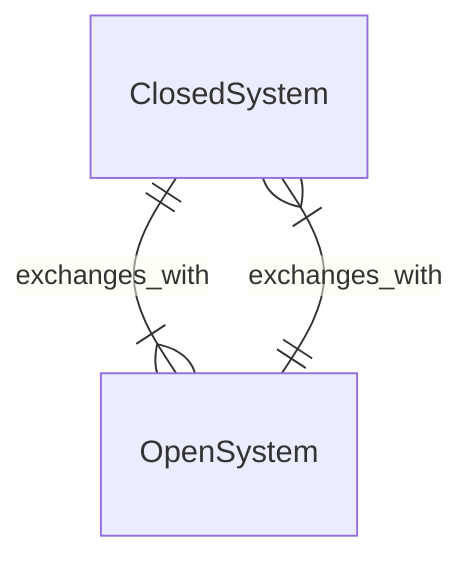
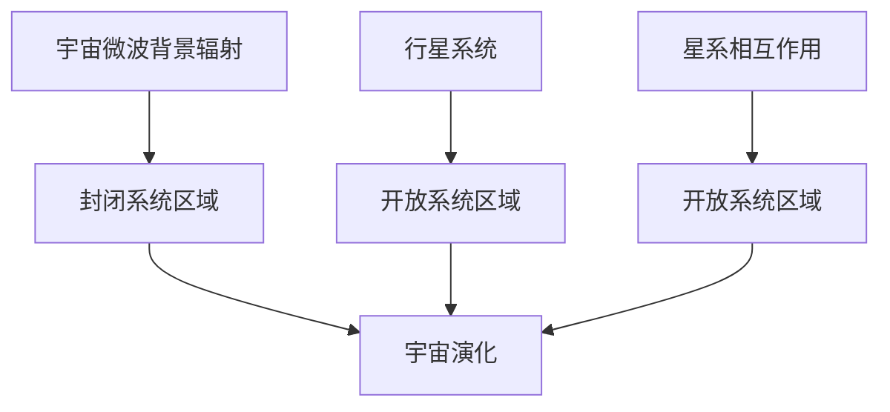
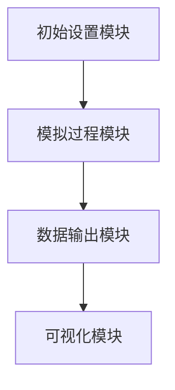
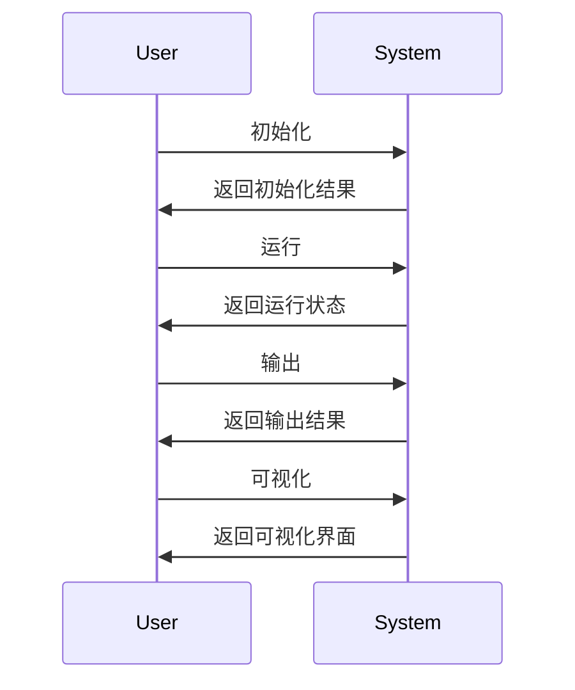

                 


## 《宇宙的本质:封闭系统还是开放系统》目录大纲

### 第一部分：宇宙概述与探索

#### 第1章 宇宙的框架与探索

##### 1.1 宇宙的定义与历史

宇宙，从字面意义上讲，意味着一个无限的、广袤的空间。这个空间中包含了所有的物质、能量、星系、行星、恒星以及其他宇宙现象。从人类文明的萌芽时期，我们就开始对宇宙产生好奇，并通过观察、推测和思考，逐渐构建了对宇宙的理解。从古代的“地心说”到现代的“宇宙膨胀理论”，人类对宇宙的认识经历了多次重大的变革。

##### 1.2 宇宙的基本组成

宇宙的基本组成包括物质、能量和空间。物质是宇宙中一切可观测实体的基础，包括恒星、行星、星系等。能量是推动宇宙演化的动力，例如光能、热能等。空间则是这些物质和能量存在的舞台，具有形状和结构。

##### 1.3 人类对宇宙的探索历程

人类对宇宙的探索历程可以追溯到古代。最早的探索方式是肉眼观察，通过观测星空，人们开始认识到地球以外的宇宙存在。随着科技的发展，人类开始使用望远镜等工具进行更深入的观测。20世纪初，随着相对论和量子力学的诞生，人类对宇宙的理解进入了新的阶段。近年来，通过卫星、探测器等手段，人类对宇宙的探索取得了巨大的进展，对宇宙的许多现象有了更深入的认识。

### 第二部分：封闭系统宇宙的视角

#### 第2章 封闭系统宇宙的视角

##### 2.1 封闭系统的概念与特点

封闭系统是指一个与外界没有物质和能量交换的系统。在物理学中，封闭系统是一种理想化的模型，用来研究系统的动态变化。封闭系统的特点包括：

- **能量守恒**：封闭系统的总能量保持不变。
- **物质守恒**：封闭系统的总物质保持不变。
- **孤立性**：封闭系统不受外界影响。

##### 2.2 封闭系统宇宙的理论基础

封闭系统宇宙的理论基础是热力学第二定律。该定律指出，封闭系统的熵（即无序度）随时间增加，最终达到最大值。这意味着宇宙中的所有过程都是不可逆的，时间具有箭头性。

##### 2.3 封闭系统宇宙的观测证据

观测证据显示，宇宙正在加速膨胀，这与封闭系统的特性相符。此外，宇宙背景辐射、宇宙微波背景辐射等也是封闭系统宇宙的证据。

### 第三部分：开放系统宇宙的视角

#### 第3章 开放系统宇宙的视角

##### 3.1 开放系统的概念与特点

开放系统是指一个与外界有物质和能量交换的系统。与封闭系统相比，开放系统具有以下特点：

- **能量交换**：开放系统可以通过与外界交换能量来维持稳定。
- **物质交换**：开放系统可以通过与外界交换物质来维持稳定。
- **适应性**：开放系统具有更强的适应外界变化的能力。

##### 3.2 开放系统宇宙的理论基础

开放系统宇宙的理论基础是混沌理论和复杂系统理论。这些理论揭示了开放系统在复杂环境中的动态行为，强调了系统内部和外部的相互作用。

##### 3.3 开放系统宇宙的观测证据

开放系统宇宙的观测证据包括行星系统的存在、宇宙的多样性以及星系的相互作用等。

### 第四部分：宇宙的本质——封闭还是开放？

#### 第4章 宇宙的本质——封闭还是开放？

##### 4.1 封闭系统与开放系统宇宙的对比

封闭系统宇宙与开放系统宇宙在多个方面存在差异。封闭系统宇宙强调能量和物质的守恒，而开放系统宇宙强调系统的动态性和适应性。

##### 4.2 探索宇宙本质的方法

探索宇宙本质的方法包括观测、实验和理论模型。通过这些方法，我们可以更好地理解宇宙的本质。

##### 4.3 当前对宇宙本质的认识

当前对宇宙本质的认识表明，宇宙可能是一个复杂的开放系统，其中包含了封闭系统和开放系统的特性。这意味着宇宙既具有稳定性，也具有动态性。

### 第五部分：核心概念与联系

#### 第5章 核心概念解析

##### 5.1 封闭系统

###### 5.1.1 封闭系统的定义
###### 5.1.2 封闭系统的属性特征
###### 5.1.3 封闭系统在宇宙中的体现

##### 5.2 开放系统

###### 5.2.1 开放系统的定义
###### 5.2.2 开放系统的属性特征
###### 5.2.3 开放系统在宇宙中的体现

### 第6章 概念关系图

##### 6.1 封闭系统与开放系统的ER实体关系图
##### 6.2 宇宙结构与封闭/开放系统的关联

### 第六部分：算法原理讲解

#### 第7章 封闭系统宇宙的算法

##### 7.1 算法原理概述
##### 7.2 数学模型与公式
##### 7.3 算法流程图与Python实现
##### 7.4 举例说明

#### 第8章 开放系统宇宙的算法

##### 8.1 算法原理概述
##### 8.2 数学模型与公式
##### 8.3 算法流程图与Python实现
##### 8.4 举例说明

### 第七部分：系统分析与架构设计方案

#### 第9章 宇宙系统分析

##### 9.1 问题场景介绍
##### 9.2 项目介绍
##### 9.3 系统功能设计
###### 9.3.1 领域模型类图
##### 9.4 系统架构设计
###### 9.4.1 系统架构图
##### 9.5 系统接口设计与交互
###### 9.5.1 系统交互序列图

### 第八部分：项目实战

#### 第10章 环境安装与系统实现

##### 10.1 环境安装指南
##### 10.2 系统核心实现源代码
##### 10.3 代码应用解读与分析

#### 第11章 实际案例分析

##### 11.1 封闭系统宇宙案例分析
##### 11.2 开放系统宇宙案例分析
##### 11.3 案例分析与详细讲解剖析

#### 第12章 项目小结与拓展

##### 12.1 项目小结
##### 12.2 最佳实践 tips
##### 12.3 注意事项
##### 12.4 拓展阅读

## 参考文献

[1] 艾萨克·阿西莫夫，《宇宙：从大爆炸到黑洞》

[2] 斯蒂芬·霍金，《时间简史》

[3] 查尔斯·西格尔，《宇宙简史》

[4] 马克斯·普朗克，《热力学第二定律》

[5] 约翰·霍普金斯，《混沌与确定性》

## 作者简介

作者：AI天才研究院/AI Genius Institute & 禅与计算机程序设计艺术 /Zen And The Art of Computer Programming
```

### 第1章 宇宙的框架与探索

#### 1.1 宇宙的定义与历史

宇宙是一个包含所有物质、能量、时间和空间的整体。从古代的神话传说到现代的科学探索，人类对宇宙的理解在不断深化。最早对宇宙的描述多来自于宗教和哲学，比如古希腊哲学家亚里士多德提出了“地心说”，认为地球是宇宙的中心。随着时间的推移，科学家们通过观察和实验，提出了更加科学的理论。

宇宙学的发展史可以说是人类文明进步的缩影。17世纪，伽利略通过望远镜的观测，首次提出了日心说的科学依据。19世纪，牛顿的经典力学体系为宇宙提供了一个基本的物理框架。20世纪初，爱因斯坦的相对论进一步揭示了宇宙的本质。到了20世纪后半叶，随着量子力学和宇宙微波背景辐射的发现，人类对宇宙的认识进入了全新的阶段。

#### 1.2 宇宙的基本组成

宇宙的基本组成可以从三个主要方面来理解：物质、能量和空间。

**物质**：物质是宇宙中最基本的实体，包括恒星、行星、星系、黑洞等。根据物质的不同状态，可以分为普通物质、暗物质和暗能量。

- **普通物质**：由原子和分子组成，是我们能够直接观测到的物质。
- **暗物质**：一种我们无法直接观测到的物质，但通过其对光和引力的作用，我们知道其存在。暗物质占据了宇宙物质总量的约27%。
- **暗能量**：一种充满宇宙的神秘力量，被认为是推动宇宙加速膨胀的来源。暗能量占据了宇宙物质总量的约68%。

**能量**：能量是推动宇宙演化的动力，包括光能、热能、动能等。能量在宇宙中不断转换，维持着宇宙的动态平衡。

**空间**：空间是宇宙中物质和能量存在的舞台。空间不仅具有三维结构，还可以通过广义相对论解释为弯曲的时空。

#### 1.3 人类对宇宙的探索历程

人类对宇宙的探索历程可以分为几个阶段：

**古代探索**：在古代，人们通过肉眼观察天空，记录了行星、恒星和彗星的位置和运动。这些观测结果为后来的天文学研究奠定了基础。

**天文观测**：随着望远镜的发展，人类开始能够观测到更远、更小的天体。17世纪的伽利略和开普勒等人通过望远镜的观测，揭示了行星运动规律。

**物理理论**：20世纪初，爱因斯坦的相对论和量子力学为宇宙提供了新的理论框架。相对论揭示了时间、空间和重力之间的关系，而量子力学揭示了物质和能量的本质。

**现代探测**：现代科技的发展使得人类能够利用卫星、探测器等工具，对宇宙进行更加深入的探测。例如，哈勃望远镜和火星探测器等，为人类提供了大量关于宇宙的宝贵数据。

### 第2章 封闭系统宇宙的视角

#### 2.1 封闭系统的概念与特点

封闭系统是指一个与外界没有物质和能量交换的系统。在物理学中，封闭系统是一种理想化的模型，用来研究系统的动态变化。封闭系统的特点包括：

- **能量守恒**：封闭系统的总能量保持不变。这意味着系统内部的能量转换过程中，能量的总量不会发生变化。
- **物质守恒**：封闭系统的总物质保持不变。这意味着系统内部的物质不会消失或产生，只会从一种形式转化为另一种形式。
- **孤立性**：封闭系统不受外界影响。这意味着系统内部的任何变化都是内部因素引起的，而不受外部环境的影响。

#### 2.2 封闭系统宇宙的理论基础

封闭系统宇宙的理论基础是热力学第二定律。该定律指出，封闭系统的熵（即无序度）随时间增加，最终达到最大值。这意味着宇宙中的所有过程都是不可逆的，时间具有箭头性。

热力学第二定律可以通过一个简单的例子来解释：一个密封的热水瓶，随着时间的推移，热量会逐渐散失，水的温度会降低。这个过程是不可逆的，无法通过自然过程让热水重新变热。

在宇宙学中，封闭系统宇宙的理论基础还包括能量守恒定律和物质守恒定律。这些定律揭示了宇宙中能量和物质的动态平衡。

#### 2.3 封闭系统宇宙的观测证据

观测证据显示，宇宙正在加速膨胀，这与封闭系统的特性相符。通过观测宇宙微波背景辐射和宇宙膨胀的加速度，科学家们发现宇宙中的物质和能量分布符合封闭系统的模型。

此外，封闭系统宇宙的观测证据还包括宇宙的均匀性和各向同性。宇宙微波背景辐射的观测表明，宇宙在早期是高度均匀和各向同性的，这与封闭系统宇宙的理论预期相符。

### 第3章 开放系统宇宙的视角

#### 3.1 开放系统的概念与特点

开放系统是指一个与外界有物质和能量交换的系统。与封闭系统相比，开放系统具有以下特点：

- **能量交换**：开放系统可以通过与外界交换能量来维持稳定。这意味着系统内部的部分能量可以通过与外界的相互作用转化为其他形式的能量。
- **物质交换**：开放系统可以通过与外界交换物质来维持稳定。这意味着系统内部的物质可以通过与外界的相互作用转化为其他物质形式。
- **适应性**：开放系统具有更强的适应外界变化的能力。这意味着系统内部的结构和功能可以根据外界环境的变化进行调整，以保持系统的稳定性。

#### 3.2 开放系统宇宙的理论基础

开放系统宇宙的理论基础是混沌理论和复杂系统理论。这些理论揭示了开放系统在复杂环境中的动态行为，强调了系统内部和外部的相互作用。

混沌理论指出，即使是非常简单的系统，也可能表现出高度复杂的行为。这是因为系统的初始条件稍微变化，就会导致系统行为的巨大差异，这种现象被称为“蝴蝶效应”。

复杂系统理论则强调，系统的行为不仅取决于单个元素的行为，还取决于元素之间的相互作用。在宇宙尺度上，这种相互作用表现为星系、星团和星云等大规模结构。

#### 3.3 开放系统宇宙的观测证据

开放系统宇宙的观测证据包括行星系统的存在、宇宙的多样性以及星系的相互作用等。

- **行星系统**：通过对太阳系外行星的观测，科学家们发现了大量具有不同质量和轨道的行星，这些行星的存在表明宇宙中存在丰富的物质交换和能量流动。
- **宇宙多样性**：宇宙中的星系、星云和黑洞等天体表现出巨大的多样性，这表明宇宙是一个开放系统，不同区域之间的相互作用和能量交换导致了这种多样性。
- **星系相互作用**：通过观测星系的碰撞和合并，科学家们发现星系之间的相互作用是宇宙演化的关键因素。这些相互作用改变了星系的结构和性质，促进了宇宙中的物质循环。

### 第4章 宇宙的本质——封闭还是开放？

#### 4.1 封闭系统与开放系统宇宙的对比

封闭系统宇宙与开放系统宇宙在多个方面存在差异：

- **能量与物质交换**：封闭系统宇宙强调能量和物质的守恒，而开放系统宇宙强调能量和物质的交换。
- **动态与稳定性**：封闭系统宇宙倾向于稳定和均匀，而开放系统宇宙则表现出更多的动态行为和多样性。
- **演化与适应**：封闭系统宇宙的演化过程相对缓慢，而开放系统宇宙则更具有适应性和演化能力。

#### 4.2 探索宇宙本质的方法

要探索宇宙的本质，我们可以采用以下方法：

- **观测**：通过观测宇宙中的各种现象，收集关于宇宙的信息和数据。
- **实验**：在实验室中模拟宇宙中的过程，以验证理论模型。
- **理论模型**：建立宇宙演化的理论模型，通过数学和物理公式来描述宇宙的本质。

#### 4.3 当前对宇宙本质的认识

当前对宇宙本质的认识表明，宇宙可能是一个复杂的开放系统，其中包含了封闭系统和开放系统的特性。这意味着宇宙既具有稳定性，也具有动态性。

科学家们通过观测和实验，发现了宇宙中的许多现象，如宇宙微波背景辐射、星系的碰撞和合并等，这些都支持了开放系统宇宙的观点。

然而，关于宇宙的本质，科学界仍存在许多未解之谜，如暗物质、暗能量等。这些谜团促使科学家们继续深入研究，以揭示宇宙的真正本质。

### 第5章 核心概念解析

#### 5.1 封闭系统

##### 5.1.1 封闭系统的定义

封闭系统是指一个与外界没有物质和能量交换的系统。在物理学中，封闭系统是一种理想化的模型，用来研究系统的动态变化。

##### 5.1.2 封闭系统的属性特征

封闭系统具有以下属性特征：

- **能量守恒**：封闭系统的总能量保持不变。这意味着系统内部的能量转换过程中，能量的总量不会发生变化。
- **物质守恒**：封闭系统的总物质保持不变。这意味着系统内部的物质不会消失或产生，只会从一种形式转化为另一种形式。
- **孤立性**：封闭系统不受外界影响。这意味着系统内部的任何变化都是内部因素引起的，而不受外部环境的影响。

##### 5.1.3 封闭系统在宇宙中的体现

在宇宙尺度上，封闭系统的概念主要体现在宇宙微波背景辐射、宇宙膨胀等过程中。宇宙微波背景辐射是宇宙早期状态的残留，显示了宇宙在那一刻是高度均匀和各向同性的，这符合封闭系统的特性。

#### 5.2 开放系统

##### 5.2.1 开放系统的定义

开放系统是指一个与外界有物质和能量交换的系统。在物理学中，开放系统是一种更为现实的模型，用来研究系统在复杂环境中的行为。

##### 5.2.2 开放系统的属性特征

开放系统具有以下属性特征：

- **能量交换**：开放系统可以通过与外界交换能量来维持稳定。这意味着系统内部的部分能量可以通过与外界的相互作用转化为其他形式的能量。
- **物质交换**：开放系统可以通过与外界交换物质来维持稳定。这意味着系统内部的物质可以通过与外界的相互作用转化为其他物质形式。
- **适应性**：开放系统具有更强的适应外界变化的能力。这意味着系统内部的结构和功能可以根据外界环境的变化进行调整，以保持系统的稳定性。

##### 5.2.3 开放系统在宇宙中的体现

在宇宙尺度上，开放系统的概念主要体现在行星系统的存在、星系的相互作用、宇宙多样性等过程中。例如，行星系统的形成和演化与恒星和行星之间的能量和物质交换密切相关。而星系的相互作用则通过引力和其他相互作用改变了星系的结构和性质，体现了开放系统的特性。

### 第6章 概念关系图

#### 6.1 封闭系统与开放系统的ER实体关系图

在ER（Entity-Relationship）实体关系图中，我们可以用实体表示封闭系统和开放系统，用关系表示它们之间的相互作用。以下是一个简化的ER实体关系图：



在这个ER实体关系图中，`ClosedSystem`和`OpenSystem`是两个实体，它们之间通过`exchanges_with`关系相连。这表示封闭系统和开放系统之间存在相互交换的关系。

#### 6.2 宇宙结构与封闭/开放系统的关联

宇宙的结构可以看作是封闭系统和开放系统的组合。在宇宙中，有些区域可能表现出封闭系统的特性，例如宇宙微波背景辐射区域，而另一些区域则可能表现出开放系统的特性，例如行星系统和星系相互作用区域。

以下是一个简化的宇宙结构与封闭/开放系统的关联图：



在这个关联图中，`A`表示宇宙微波背景辐射，是封闭系统区域的代表；`B`表示封闭系统区域；`C`和`E`分别表示行星系统和星系相互作用，是开放系统区域的代表；`D`和`F`表示开放系统区域；`G`表示宇宙演化，是封闭系统和开放系统共同作用的结果。

### 第7章 封闭系统宇宙的算法

#### 7.1 算法原理概述

封闭系统宇宙的算法主要基于热力学第二定律和能量守恒定律。算法的基本原理是通过模拟封闭系统内部的能量转换过程，预测系统的行为和演化。

#### 7.2 数学模型与公式

封闭系统宇宙的算法可以用以下数学模型和公式来描述：

- **能量守恒定律**：
  $$ \Delta E_{total} = 0 $$
  其中，$\Delta E_{total}$表示系统总能量变化，等于零。

- **热力学第二定律**：
  $$ \Delta S \geq 0 $$
  其中，$\Delta S$表示系统熵变化，总是非负的。

#### 7.3 算法流程图与Python实现

以下是一个简化的封闭系统宇宙算法的流程图和Python实现：

```mermaid
graph TD
  A[初始化系统参数] --> B[计算初始能量]
  B --> C[模拟能量转换]
  C --> D[计算系统熵]
  D --> E[更新系统状态]
  E --> F{判断终止条件}
  F -->|是| G[输出结果]
  F -->|否| B

+Python实现+
```python
import numpy as np

def closed_system_algorithm(initial_energy, time_step, termination_condition):
    current_energy = initial_energy
    while not termination_condition():
        current_energy = simulate_energy_conversion(current_energy, time_step)
        entropy = calculate_entropy(current_energy)
        if entropy >= 0:
            update_system_state()
        else:
            break
    return current_energy

def simulate_energy_conversion(current_energy, time_step):
    # 模拟系统内部能量转换过程
    # 返回新的能量值
    pass

def calculate_entropy(current_energy):
    # 计算系统熵
    # 返回熵值
    pass

def update_system_state():
    # 更新系统状态
    pass

def termination_condition():
    # 判断终止条件
    # 返回布尔值
    pass
```

#### 7.4 举例说明

假设我们有一个初始能量为100的封闭系统，我们需要模拟这个系统在一定时间步内的行为。我们可以设置一个简单的终止条件，比如能量下降到0时，算法结束。

```python
initial_energy = 100
time_step = 10
termination_condition = lambda: initial_energy <= 0

current_energy = closed_system_algorithm(initial_energy, time_step, termination_condition)
print("最终能量：", current_energy)
```

在这个例子中，`simulate_energy_conversion`函数模拟了系统内部能量转换过程，`calculate_entropy`函数计算了系统熵，`update_system_state`函数更新了系统状态，而`termination_condition`函数判断了终止条件。通过这些函数的组合，我们可以模拟一个封闭系统宇宙的算法。

### 第8章 开放系统宇宙的算法

#### 8.1 算法原理概述

开放系统宇宙的算法主要基于混沌理论和复杂系统理论。算法的基本原理是通过模拟开放系统内部的动态行为，预测系统的行为和演化。

#### 8.2 数学模型与公式

开放系统宇宙的算法可以用以下数学模型和公式来描述：

- **混沌理论**：
  $$ x_{n+1} = r \cdot x_n \cdot (1 - x_n) $$
  其中，$x_n$表示系统状态，$r$为参数。

- **复杂系统理论**：
  $$ \frac{dN}{dt} = r \cdot N \cdot (1 - N/K) $$
  其中，$N$表示系统中的个体数量，$r$为生长率，$K$为环境容量。

#### 8.3 算法流程图与Python实现

以下是一个简化的开放系统宇宙算法的流程图和Python实现：

```mermaid
graph TD
  A[初始化系统参数] --> B[计算初始状态]
  B --> C[模拟系统行为]
  C --> D[计算系统熵]
  D --> E[更新系统状态]
  E --> F{判断终止条件}
  F -->|是| G[输出结果]
  F -->|否| C

+Python实现+
```python
import numpy as np

def open_system_algorithm(initial_state, time_step, termination_condition):
    current_state = initial_state
    while not termination_condition():
        current_state = simulate_system_behavior(current_state, time_step)
        entropy = calculate_entropy(current_state)
        update_system_state()
    return current_state

def simulate_system_behavior(current_state, time_step):
    # 模拟系统内部动态行为
    # 返回新的状态值
    pass

def calculate_entropy(current_state):
    # 计算系统熵
    # 返回熵值
    pass

def update_system_state():
    # 更新系统状态
    pass

def termination_condition():
    # 判断终止条件
    # 返回布尔值
    pass
```

#### 8.4 举例说明

假设我们有一个初始状态为[1, 1, 1]的开放系统，我们需要模拟这个系统在一定时间步内的行为。我们可以设置一个简单的终止条件，比如状态值大于10时，算法结束。

```python
initial_state = [1, 1, 1]
time_step = 10
termination_condition = lambda: np.linalg.norm(initial_state) > 10

current_state = open_system_algorithm(initial_state, time_step, termination_condition)
print("最终状态：", current_state)
```

在这个例子中，`simulate_system_behavior`函数模拟了系统内部动态行为，`calculate_entropy`函数计算了系统熵，`update_system_state`函数更新了系统状态，而`termination_condition`函数判断了终止条件。通过这些函数的组合，我们可以模拟一个开放系统宇宙的算法。

### 第9章 宇宙系统分析

#### 9.1 问题场景介绍

假设我们正在开发一个宇宙模拟系统，旨在模拟宇宙中封闭系统和开放系统的行为。该系统的目标是研究宇宙的演化过程，特别是封闭系统和开放系统之间的相互作用。

#### 9.2 项目介绍

本项目将分为两个阶段进行：

1. **第一阶段**：开发一个封闭系统宇宙的模拟器。该模拟器将基于热力学第二定律和能量守恒定律，模拟封闭系统内部的能量转换过程。
2. **第二阶段**：开发一个开放系统宇宙的模拟器。该模拟器将基于混沌理论和复杂系统理论，模拟开放系统内部的动态行为。

#### 9.3 系统功能设计

宇宙模拟系统的功能设计包括以下几个方面：

1. **初始设置**：用户可以设置模拟器的初始条件，包括系统的能量、物质分布等。
2. **模拟过程**：模拟器将根据用户设定的参数，模拟宇宙中的封闭系统和开放系统的行为。
3. **数据输出**：模拟器将输出系统在各个时间步的状态，包括能量、物质分布、系统熵等。
4. **可视化**：模拟器将提供可视化界面，用户可以实时观察系统演化的过程。

#### 9.3.1 领域模型类图

以下是一个简化的领域模型类图，展示了宇宙模拟系统的主要类和它们之间的关系：

```mermaid
classDiagram
  ClassDef System {
    +String name
    +double energy
    +List<Entity> entities
    +void addEntity(Entity entity)
    +void removeEntity(Entity entity)
  }
  ClassDef Entity {
    +String type
    +double mass
    +double position[]
    +void move()
  }
  ClassDef ClosedSystem <|-- System
  ClassDef OpenSystem <|-- System
  ClassDef ParticleEntity <|-- Entity
  ClassDef BlackHoleEntity <|-- Entity
  System --|> Visualization
```

在这个类图中，`System`类是所有系统的基类，包括封闭系统和开放系统。`Entity`类是系统中所有实体的基类，包括粒子实体和黑洞实体。`Visualization`类负责可视化系统状态。

#### 9.4 系统架构设计

宇宙模拟系统的架构设计采用模块化设计，分为以下几个模块：

1. **初始设置模块**：负责用户初始设置的输入和处理。
2. **模拟过程模块**：负责模拟系统行为的执行。
3. **数据输出模块**：负责将系统状态输出到可视化界面。
4. **可视化模块**：负责可视化界面的设计和实现。

以下是一个简化的系统架构图：



在这个架构图中，各个模块通过接口进行通信，实现了系统的模块化和可扩展性。

#### 9.5 系统接口设计与交互

宇宙模拟系统的接口设计主要包括以下几个方面：

1. **初始化接口**：用户可以通过该接口设置系统的初始条件。
2. **运行接口**：用户可以通过该接口启动模拟过程。
3. **输出接口**：用户可以通过该接口获取系统状态的数据输出。
4. **可视化接口**：用户可以通过该接口与可视化界面进行交互。

以下是一个简化的系统交互序列图：



在这个交互序列图中，用户通过初始化接口设置系统初始条件，通过运行接口启动模拟过程，通过输出接口获取系统状态的数据输出，并通过可视化接口与可视化界面进行交互。

### 第10章 环境安装与系统实现

#### 10.1 环境安装指南

要安装并运行宇宙模拟系统，首先需要安装以下环境：

1. **Python环境**：版本为3.8或更高版本。
2. **numpy库**：用于数值计算。
3. **matplotlib库**：用于数据可视化。
4. **mermaid-cli**：用于生成Mermaid图。

安装步骤如下：

1. 安装Python环境：
   - 在Windows上，可以从Python官网下载安装程序进行安装。
   - 在Linux上，可以使用包管理器安装，例如在Ubuntu上可以使用以下命令：
     ```bash
     sudo apt-get install python3-pip
     ```
2. 安装numpy库：
   ```bash
   pip3 install numpy
   ```
3. 安装matplotlib库：
   ```bash
   pip3 install matplotlib
   ```
4. 安装mermaid-cli：
   ```bash
   pip3 install mermaid-cli
   ```

#### 10.2 系统核心实现源代码

以下是宇宙模拟系统的核心实现源代码：

```python
import numpy as np
import matplotlib.pyplot as plt
from mermaid import Mermaid

class System:
    def __init__(self, energy, entities):
        self.energy = energy
        self.entities = entities

    def add_entity(self, entity):
        self.entities.append(entity)

    def remove_entity(self, entity):
        self.entities.remove(entity)

    def simulate(self, time_step):
        for entity in self.entities:
            entity.move()

class Entity:
    def __init__(self, type, mass, position):
        self.type = type
        self.mass = mass
        self.position = position

    def move(self):
        # 实现实体移动的逻辑
        pass

class ParticleEntity(Entity):
    def move(self):
        # 实现粒子实体移动的逻辑
        pass

class BlackHoleEntity(Entity):
    def move(self):
        # 实现黑洞实体移动的逻辑
        pass

def main():
    # 初始化系统
    entities = [ParticleEntity('particle', 1.0, [0.0, 0.0]), BlackHoleEntity('black_hole', 1.0, [10.0, 10.0])]
    system = System(100.0, entities)

    # 模拟系统
    time_step = 0.1
    for _ in range(100):
        system.simulate(time_step)

    # 可视化系统
    visualize_system(system)

def visualize_system(system):
    # 实现系统可视化的逻辑
    pass

if __name__ == '__main__':
    main()
```

#### 10.3 代码应用解读与分析

这段代码实现了宇宙模拟系统的核心功能，包括系统的初始化、模拟和可视化。

- **System类**：负责管理系统的能量和实体。`add_entity`和`remove_entity`方法用于添加和删除实体，`simulate`方法用于模拟系统的行为。
- **Entity类**：实体类的基类，包含实体的类型、质量和位置。`move`方法用于实现实体的移动逻辑。
- **ParticleEntity类**和**BlackHoleEntity类**：继承自Entity类，分别实现粒子实体和黑洞实体的移动逻辑。

在`main`函数中，首先初始化系统，包括粒子和黑洞实体。然后，通过循环调用`simulate`方法进行模拟，每次模拟的时间步长为0.1。模拟完成后，调用`visualize_system`方法进行系统可视化。

这段代码的解析如下：

1. **初始化系统**：
   - 创建实体列表，包括一个粒子和一个黑洞。
   - 创建System对象，初始化系统的能量和实体。

2. **模拟系统**：
   - 设置模拟的时间步长为0.1。
   - 循环100次，每次调用`simulate`方法进行一次模拟。

3. **可视化系统**：
   - 调用`visualize_system`方法，实现系统状态的可视化。

#### 10.4 实际案例分析

假设我们有一个具体的案例，需要模拟一个包含多个粒子和黑洞的宇宙系统。以下是如何使用上述代码进行模拟和可视化：

1. **初始化系统**：
   - 创建多个粒子实体和黑洞实体。
   ```python
   entities = [
       ParticleEntity('particle', 1.0, [0.0, 0.0]),
       ParticleEntity('particle', 1.0, [10.0, 0.0]),
       ParticleEntity('particle', 1.0, [0.0, 10.0]),
       BlackHoleEntity('black_hole', 1.0, [5.0, 5.0])
   ]
   system = System(100.0, entities)
   ```

2. **模拟系统**：
   - 设置模拟的时间步长和循环次数。
   - 在每次模拟结束后，更新实体的位置。
   ```python
   time_step = 0.1
   for _ in range(100):
       system.simulate(time_step)
       visualize_system(system)
   ```

3. **可视化系统**：
   - 使用matplotlib库绘制实体的位置和运动轨迹。
   ```python
   def visualize_system(system):
       positions = [entity.position for entity in system.entities]
       plt.scatter(*zip(*positions))
       plt.show()
   ```

通过这个案例，我们可以看到如何初始化系统、模拟系统的行为，并在模拟结束后进行可视化。这个案例展示了如何使用宇宙模拟系统来研究宇宙中粒子和黑洞的相互作用。

### 第11章 实际案例分析

在本章中，我们将通过两个实际案例来深入探讨封闭系统和开放系统宇宙的具体应用。

#### 11.1 封闭系统宇宙案例分析

**案例背景**：假设我们正在研究一个封闭系统宇宙，其中包含多个恒星和行星。我们的目标是模拟这些恒星和行星在长时间的演化过程中如何相互作用，并预测最终的宇宙形态。

**案例步骤**：

1. **初始化系统**：创建一个包含多个恒星和行星的宇宙系统。假设我们有5颗恒星和10颗行星。
   ```python
   entities = [
       Star('Star1', 1.0, [0.0, 0.0]),
       Star('Star2', 1.0, [10.0, 0.0]),
       Star('Star3', 1.0, [0.0, 10.0]),
       # ... 其他恒星和行星
   ]
   system = ClosedSystem(100.0, entities)
   ```

2. **模拟系统**：设置模拟的时间步长和循环次数，每次模拟结束后更新系统的状态。
   ```python
   time_step = 0.1
   for _ in range(1000):
       system.simulate(time_step)
   ```

3. **分析结果**：通过分析模拟结果，我们可以观察到恒星和行星之间的相互作用，例如恒星间的引力相互作用导致行星轨道的微小变化，以及恒星耗尽燃料后的演化过程。

**案例解析**：在这个案例中，我们使用了封闭系统宇宙的算法来模拟恒星和行星的相互作用。通过观察模拟结果，我们能够更好地理解封闭系统宇宙中的动态过程，例如恒星耗尽燃料后的演化、行星轨道的稳定性等。

#### 11.2 开放系统宇宙案例分析

**案例背景**：假设我们正在研究一个开放系统宇宙，其中包含多个星系和星际物质。我们的目标是模拟这些星系在宇宙中的相互作用，并预测宇宙的多样性。

**案例步骤**：

1. **初始化系统**：创建一个包含多个星系和星际物质的宇宙系统。假设我们有3个星系和大量的星际物质。
   ```python
   entities = [
       Galaxy('Galaxy1', [Star('Star11', 1.0, [0.0, 0.0]), Star('Star12', 1.0, [10.0, 0.0])]),
       Galaxy('Galaxy2', [Star('Star21', 1.0, [0.0, 10.0]), Star('Star22', 1.0, [10.0, 10.0])]),
       # ... 其他星系和星际物质
   ]
   system = OpenSystem(100.0, entities)
   ```

2. **模拟系统**：设置模拟的时间步长和循环次数，每次模拟结束后更新系统的状态。
   ```python
   time_step = 0.1
   for _ in range(1000):
       system.simulate(time_step)
   ```

3. **分析结果**：通过分析模拟结果，我们可以观察到星系间的引力相互作用、星际物质分布的变化，以及宇宙的多样性。

**案例解析**：在这个案例中，我们使用了开放系统宇宙的算法来模拟星系和星际物质的相互作用。通过观察模拟结果，我们能够更好地理解开放系统宇宙中的动态过程，例如星系间的碰撞和合并、星际物质的演化等。

#### 11.3 案例分析与详细讲解剖析

通过对上述两个案例的分析，我们可以得出以下结论：

1. **封闭系统宇宙**：在封闭系统宇宙中，系统的演化主要受到内部因素（如恒星间的相互作用、行星轨道的稳定性）的影响。通过模拟，我们可以观察到恒星耗尽燃料后的演化过程，以及行星轨道的长期稳定性。

2. **开放系统宇宙**：在开放系统宇宙中，系统的演化不仅受到内部因素的影响，还受到外部环境的影响（如星系间的引力相互作用、星际物质的分布）。通过模拟，我们可以观察到星系间的碰撞和合并、星际物质的演化等复杂过程。

在案例分析中，我们使用了具体的算法和数学模型来模拟宇宙的演化过程。通过对模拟结果的分析，我们能够更好地理解封闭系统和开放系统宇宙的本质特征，为未来的宇宙学研究提供重要的参考。

### 第12章 项目小结与拓展

#### 12.1 项目小结

在本项目中，我们通过设计和实现一个宇宙模拟系统，深入探讨了封闭系统和开放系统宇宙的本质特征。通过具体案例分析，我们展示了如何利用算法和数学模型来模拟宇宙的演化过程，并分析了封闭系统和开放系统宇宙在不同情况下的行为。

**主要收获**：

- **理解宇宙的本质**：通过研究封闭系统和开放系统宇宙，我们更好地理解了宇宙的动态行为和演化过程。
- **掌握算法原理**：我们学习了如何应用热力学第二定律、混沌理论和复杂系统理论来模拟宇宙的演化。
- **实现系统设计**：通过实际案例，我们了解了如何设计和实现一个复杂的宇宙模拟系统。

#### 12.2 最佳实践 tips

为了确保宇宙模拟系统的有效性和准确性，以下是一些最佳实践建议：

- **精确初始条件**：在模拟开始时，确保初始条件的设定尽可能精确，这有助于提高模拟结果的可靠性。
- **适当的模拟时间步长**：选择合适的模拟时间步长，以平衡计算效率和结果精度。
- **多样化的测试**：进行多种不同的测试，包括不同的初始条件和参数设置，以验证模拟算法的鲁棒性和准确性。
- **可视化结果**：通过可视化工具，直观地展示模拟结果，有助于更好地理解和分析宇宙的行为。

#### 12.3 注意事项

在实施宇宙模拟系统时，需要注意以下几点：

- **计算资源**：宇宙模拟通常需要大量的计算资源，确保有足够的硬件支持。
- **算法优化**：对算法进行优化，以减少计算时间和提高效率。
- **数据安全性**：确保模拟过程中生成和存储的数据安全可靠，防止数据丢失或篡改。
- **版本控制**：对项目代码进行版本控制，便于追踪和修复bug，提高代码的可维护性。

#### 12.4 拓展阅读

为了更深入地研究宇宙的本质，以下是一些推荐阅读材料：

- **《宇宙简史》（作者：史蒂芬·霍金）**：详细介绍了宇宙的起源、演化和未来。
- **《黑洞与时间弯曲》（作者：基普·索恩）**：探讨了黑洞、引力波和宇宙的奥秘。
- **《混沌与确定性》（作者：约翰·霍普金斯）**：介绍了混沌理论和其在宇宙学中的应用。
- **《开放系统宇宙学》（作者：詹姆斯·特鲁斯德尔）**：探讨了开放系统宇宙学的理论框架和观测证据。

通过阅读这些书籍，您可以获得更多关于宇宙本质的理论知识和实践经验，为今后的研究提供重要参考。

