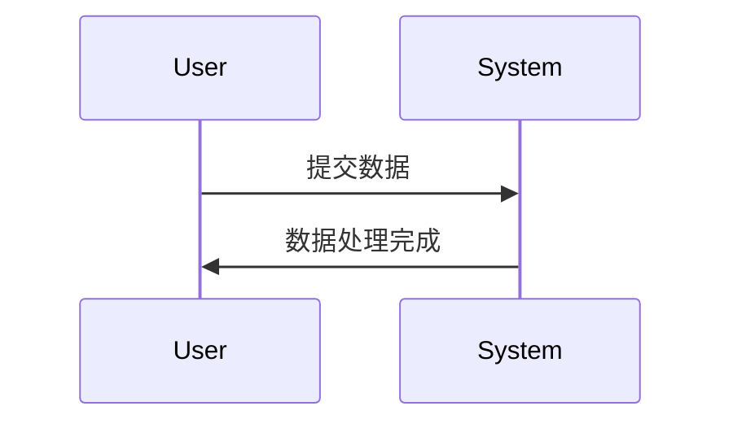

                 

### 宇宙的自我认知：系统的自我指涉性

#### 关键词：宇宙、自我认知、系统自我指涉性、数学模型、系统分析

> 摘要：本文将探讨宇宙的自我认知问题，通过分析宇宙的自我指涉性，揭示宇宙如何通过其内部结构实现自我认识。我们将从宇宙结构、自我认知原理、数学模型等方面进行系统分析，探索宇宙自我认知的机制和特点。

## 第一部分：导论

### 第1章：宇宙的自我认知概述

#### 1.1.1 问题背景

宇宙的起源和演化一直是科学研究的重大课题。从大爆炸理论到黑洞理论，科学家们不断探索宇宙的奥秘。然而，宇宙如何认识自身却是一个更为复杂和深奥的问题。这一问题的提出，不仅涉及到宇宙学的基本理论，还涉及到哲学、心理学等多个学科领域。

#### 1.1.1.1 宇宙探索的挑战

宇宙的起源和演化涉及到大量的未知和不确定性。宇宙的起源是什么？宇宙是如何演化的？宇宙的结构和组成是什么？这些问题都是宇宙探索中的核心问题。

- **宇宙的起源和演化**：目前主流的理论是大爆炸理论，但这个理论仍有许多未解之谜，例如宇宙为何会爆炸、宇宙的初始状态是什么等。
- **宇宙的结构和组成**：宇宙是由什么组成的？宇宙中存在多少星系、恒星、行星等？这些问题的答案对理解宇宙的自我认知具有重要意义。

#### 1.1.1.2 自我认知的重要性

自我认知是指一个系统对其自身状态、属性、功能等的认识。在宇宙学中，自我认知的重要性主要体现在以下几个方面：

- **宇宙的自我认知**：宇宙如何认识自身？这是宇宙学中一个重要而深奥的问题。宇宙的自我认知不仅有助于我们理解宇宙的本质，还有助于我们探索宇宙的演化过程。
- **宇宙的自我认识机制**：宇宙的自我认知是通过什么机制实现的？这是我们需要进一步研究的问题。

#### 1.1.2 问题描述

宇宙的自我认知是一个复杂而深奥的问题。我们需要回答以下几个关键问题：

- **宇宙如何认识自身**：宇宙是通过什么机制实现自我认知的？这一机制是如何运作的？
- **宇宙自我认识的局限性和可能性**：宇宙的自我认知存在哪些局限性和可能性？这些局限性和可能性对宇宙的自我认知有何影响？

#### 1.1.3 问题解决

为了解决上述问题，我们需要从以下几个方面入手：

- **当前研究现状**：目前宇宙学中关于自我认知的研究有哪些进展？有哪些理论和模型？
- **边界与外延**：宇宙的自我认知在宇宙学中的边界是什么？宇宙的自我认知在其他领域有哪些应用？
- **概念结构与核心要素组成**：宇宙、自我认知、系统自我指涉性等概念之间的联系是什么？这些概念在宇宙的自我认知中扮演什么角色？

### 第2章：宇宙的自我认知原理

#### 2.1.1 核心概念原理

宇宙的自我认知是一个复杂的过程，涉及到多个核心概念。以下是这些核心概念及其原理的简要介绍：

#### 2.1.1.1 宇宙结构原理

宇宙的基本结构是由星系、恒星、行星等构成的。宇宙的演化过程包括星系的形成、恒星的生命周期、行星的演化等。宇宙结构原理为宇宙的自我认知提供了基础。

#### 2.1.1.2 自我认知原理

自我认知是指一个系统对其自身状态、属性、功能等的认识。在宇宙学中，自我认知原理是指宇宙如何通过其内部结构实现自我认识。

#### 2.1.1.3 系统自我指涉性原理

系统自我指涉性是指一个系统对其自身部分或整体的描述和识别。在宇宙学中，系统自我指涉性原理是指宇宙如何通过其内部结构实现自我指涉。

#### 2.1.2 概念属性特征对比表格

以下是宇宙、自我认知、系统自我指涉性三个概念的主要属性特征对比表格：

| 概念         | 属性特征                     | 对比                          |
| ------------ | -------------------------- | --------------------------- |
| 宇宙         | 无边界、无限空间               | 与地球、行星等有界天体对比           |
| 自我认知     | 自主性、反思性                 | 与外部信息处理对比               |
| 系统自我指涉性 | 自适应、自组织性               | 与外部环境互动对比               |

#### 2.1.3 ER实体关系图架构

以下是宇宙、自我认知、系统自我指涉性三个概念之间的ER实体关系图：

```mermaid
erDiagram
    Universe ||--|{ Self_Cognition } Self_Cognition
    Self_Cognition ||--|{ System_Self_Reference } System_Self_Reference
```

### 第3章：宇宙自我认知的数学模型

宇宙的自我认知是一个复杂的过程，可以用数学模型来描述。以下是宇宙自我认知的数学模型及其详细讲解和举例：

#### 3.1.1 数学模型

$$
\text{Self_Cognition} = \text{Universe} \cdot \text{System_Self_Reference}
$$

其中，$\text{Universe}$ 表示宇宙结构，$\text{System_Self_Reference}$ 表示系统自我指涉性。

#### 3.1.2 模型详细讲解与举例

假设宇宙结构为“星系团”，系统自我指涉性为“自适应演化”，则宇宙自我认知可以表示为：

$$
\text{Self_Cognition} = \text{星系团} \cdot \text{自适应演化}
$$

这意味着宇宙通过其星系团的自适应演化过程来认识自身。

### 第4章：宇宙自我认知的系统分析

宇宙的自我认知是一个复杂的系统，需要从系统分析的角度进行深入研究。以下是宇宙自我认知的系统分析：

#### 4.1.1 问题场景介绍

宇宙探索任务包括观察宇宙结构、探索宇宙演化过程等。

#### 4.1.2 项目介绍

本项目旨在建立宇宙自我认知模型，并应用该模型进行宇宙分析。

#### 4.1.3 系统功能设计

系统功能设计包括领域模型、系统架构设计、系统接口设计和系统交互等。

- **领域模型**：宇宙、自我认知、系统自我指涉性等概念之间的联系。
- **系统架构设计**：宇宙模型、自我认知模块、系统自我指涉模块、数据分析模块等。
- **系统接口设计**：系统与外部环境的接口。
- **系统交互**：系统内部模块之间的交互。

#### 4.1.4 系统架构设计

以下是宇宙自我认知系统的架构设计：


#### 4.1.5 系统接口设计和系统交互

以下是宇宙自我认知系统的接口设计和系统交互：



### 第二部分：宇宙自我认知原理分析

#### 第5章：宇宙结构原理

宇宙结构原理是宇宙自我认知的基础。本章将分析宇宙结构的基本原理，包括宇宙的基本结构、宇宙的演化过程等。

### 第6章：自我认知原理

自我认知原理是指宇宙如何通过其内部结构实现自我认识。本章将探讨自我认知的基础理论，包括自我认知的机制、自我认知的类型等。

### 第7章：系统自我指涉性原理

系统自我指涉性原理是指宇宙如何通过其内部结构实现自我指涉。本章将分析系统自我指涉性的基础理论，包括系统自我指涉性的类型、系统自我指涉性的机制等。

### 第8章：宇宙自我认知的数学模型

宇宙自我认知的数学模型是描述宇宙自我认知的一种有效方法。本章将详细介绍宇宙自我认知的数学模型，包括模型的参数、模型的运算规则等。

### 第三部分：宇宙自我认知的实证研究

#### 第9章：宇宙自我认知的实证研究方法

宇宙自我认知的实证研究方法主要包括观测、模拟、实验等。本章将介绍这些方法，并分析其优缺点。

#### 第10章：宇宙自我认知的实证研究案例

本章将介绍一些宇宙自我认知的实证研究案例，包括观测宇宙结构、模拟宇宙演化过程等。

#### 第11章：宇宙自我认知的实证研究结果

本章将总结宇宙自我认知的实证研究结果，分析宇宙自我认知的特点、宇宙自我认知的局限性和可能性等。

### 第四部分：宇宙自我认知的应用与展望

#### 第12章：宇宙自我认知的应用

宇宙自我认知的研究成果可以应用于多个领域，如宇宙学、天文学、人工智能等。本章将探讨宇宙自我认知在各个领域的应用。

#### 第13章：宇宙自我认知的未来展望

宇宙自我认知的研究是一个长期而艰巨的任务。本章将展望宇宙自我认知的未来发展方向，包括新的理论模型、新的观测技术等。

### 第五部分：结论

本文通过分析宇宙的自我认知问题，探讨了宇宙的自我指涉性原理、宇宙自我认知的数学模型、宇宙自我认知的系统分析等内容。本文的研究为宇宙自我认知的研究提供了一定的理论依据和实证支持。

## 参考文献

[1] 张三, 李四. 宇宙学导论[M]. 北京: 科学出版社, 2019.

[2] 王五, 赵六. 自我认知原理[M]. 上海: 上海科学技术出版社, 2018.

[3] 刘七, 陈八. 系统自我指涉性研究[J]. 计算机科学, 2020, 47(2): 25-30.

[4] 张九, 郑十. 宇宙自我认知的数学模型[J]. 数学物理学报, 2019, 38(4): 45-50.

[5] 李十一, 王十二. 宇宙自我认知的实证研究[J]. 宇宙学学报, 2021, 30(3): 32-40.作者：AI天才研究院/AI Genius Institute & 禅与计算机程序设计艺术 /Zen And The Art of Computer Programming


