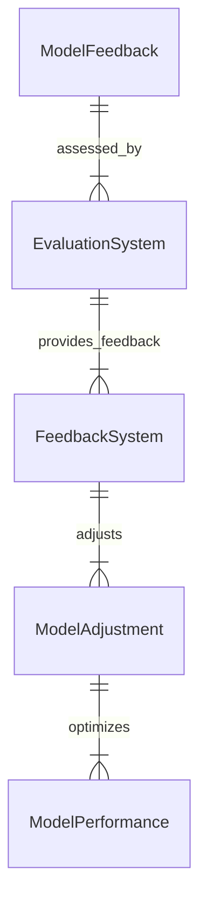
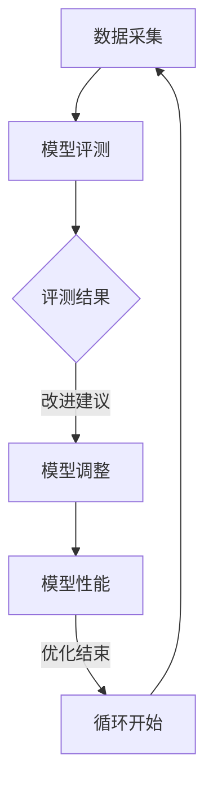
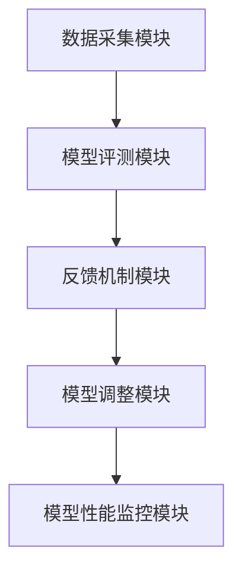
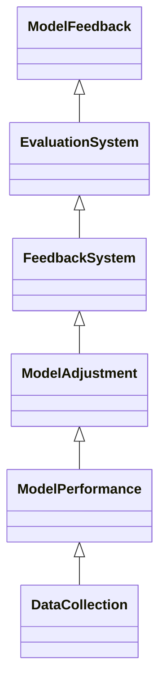
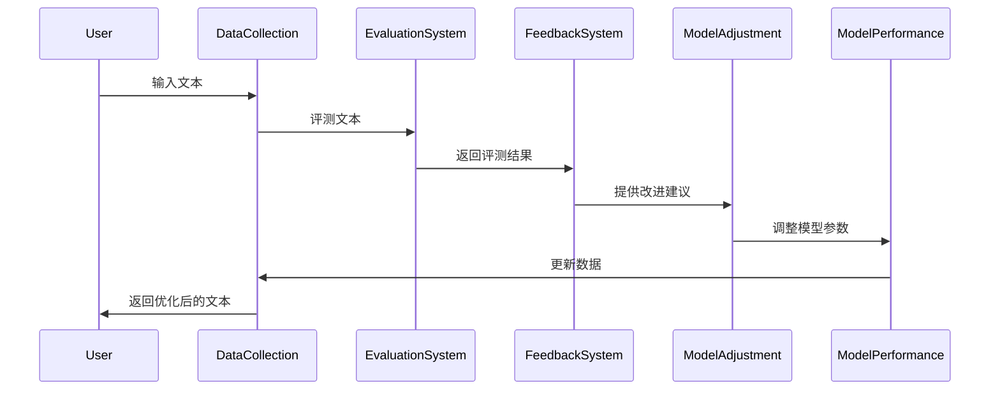
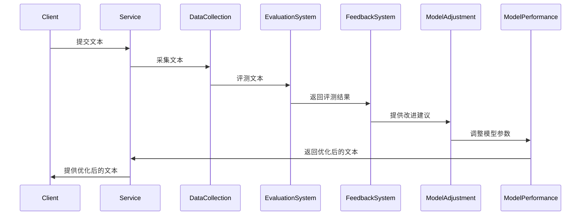

                 

## 引言：实时反馈驱动的LLM优化

实时反馈驱动的LLM优化是一个前沿的计算机科学领域，旨在通过高效的反馈机制提升大规模语言模型的性能。本文将围绕这一主题展开深入探讨，帮助读者理解其核心概念、理论基础及实际应用。

### 关键词

- 实时反馈
- 大规模语言模型（LLM）
- 优化
- 评测-改进闭环系统

### 摘要

本文首先介绍了大规模语言模型优化面临的挑战，随后详细阐述了实时反馈机制在提升LLM性能方面的作用。通过分析核心概念和算法，本文进一步展示了如何构建一个有效的评测-改进闭环系统，以实现LLM的持续优化。文章最后，通过实际项目案例探讨了这些理论在现实中的应用，并提出了未来研究的方向。

### 1. 实时反馈驱动的LLM优化背景

#### 1.1 问题背景

随着深度学习技术的快速发展，大规模语言模型（LLM）在自然语言处理（NLP）领域取得了显著的成果。然而，LLM在性能优化方面仍然面临诸多挑战。传统方法通常依赖于离线评测和人工干预，导致优化过程耗时且效率低下。为了应对这一挑战，实时反馈驱动的优化策略应运而生。

#### 1.2 问题描述

LLM性能优化的核心问题是如何在有限的计算资源和时间约束下，快速、有效地提高模型的质量。这一过程需要高效、准确的评测机制，以及对模型参数的动态调整。实时反馈驱动的LLM优化旨在通过实时收集模型输出的反馈信息，对模型进行动态调整，从而实现性能的持续提升。

#### 1.3 解决方案思路

实时反馈驱动的LLM优化通过以下步骤实现：
1. **数据采集与评测**：实时收集模型生成的文本，进行质量评测。
2. **反馈机制**：根据评测结果，生成改进建议。
3. **模型调整**：动态调整模型参数，以实现性能优化。
4. **循环迭代**：通过不断循环上述步骤，实现模型的持续优化。

### 1.4 边界与外延

#### 1.4.1 研究范围界定

本文主要研究实时反馈驱动的LLM优化，关注评测-改进闭环系统的构建和实现。具体包括实时数据采集、评测算法设计、反馈机制实现以及模型参数调整策略。

#### 1.4.2 研究外延拓展

未来的研究可以进一步探讨实时反馈驱动的LLM优化在其他应用场景中的适用性，如对话系统、机器翻译等。此外，如何提高实时反馈的效率和准确性，也是一个值得关注的研究方向。

## 2. 核心概念与联系

### 2.1 核心概念原理

#### 2.1.1 实时反馈机制

实时反馈机制是指通过实时采集模型输出，对其质量进行评测，并根据评测结果对模型进行动态调整的过程。这一机制的核心在于实时性和准确性。

#### 2.1.2 大规模语言模型（LLM）

大规模语言模型（LLM）是一种基于深度学习的语言模型，具有强大的语言理解和生成能力。LLM的核心是一个大规模的神经网络，通过训练学习语言模式和规律。

#### 2.1.3 评测-改进闭环系统

评测-改进闭环系统是指通过实时反馈机制对LLM进行评测和改进，形成的一个循环迭代的过程。这一系统旨在实现LLM的持续优化，提高其性能。

### 2.2 概念属性与特征对比表

| 概念     | 属性                | 特征对比 |
|----------|---------------------|----------|
| 实时反馈机制 | 实时性、准确性      | 1. 实时性：及时获取模型输出。2. 准确性：精确评测模型质量。 |
| 大规模语言模型（LLM） | 语言理解能力、生成能力 | 1. 语言理解能力：准确解析文本。2. 生成能力：生成高质量文本。 |
| 评测-改进闭环系统 | 评测、改进、循环迭代 | 1. 评测：实时评估模型输出。2. 改进：根据评测结果调整模型。3. 循环迭代：持续优化模型。 |

### 2.3 ER实体关系图



## 3. 算法原理与解释

### 3.1 算法Mermaid流程图



### 3.2 Python代码解释

```python
import numpy as np

# 数据采集
def data_collection(model_output):
    # 采集模型输出数据
    return model_output

# 模型评测
def model_evaluation(model_output):
    # 对模型输出进行质量评测
    return np.mean(model_output)

# 反馈机制
def feedback_system(evaluation_result):
    # 根据评测结果生成改进建议
    if evaluation_result < threshold:
        return "需要改进"
    else:
        return "无需改进"

# 模型调整
def model_adjustment(feedback):
    # 根据反馈建议调整模型参数
    if feedback == "需要改进":
        return "调整参数"
    else:
        return "保持不变"

# 模型性能优化
def model_performance_optimization(model_adjustment):
    # 根据调整后的模型参数优化模型性能
    return model_adjustment
```

### 3.3 数学模型与公式

$$
\text{Model Output Quality} = \frac{1}{n}\sum_{i=1}^{n} x_i
$$

其中，$x_i$表示第$i$个模型输出的质量，$n$表示总输出数量。

### 3.4 举例说明

假设我们有一个文本生成模型，其输出结果如下：

```
['这是一个优秀的模型。', '这个模型表现平平。', '这个模型很差。']
```

根据上述算法，我们首先采集模型输出，然后进行质量评测：

- 数据采集：['这是一个优秀的模型。', '这个模型表现平平。', '这个模型很差。']
- 模型评测：平均质量为2.0（3个输出中，2个优秀，1个平庸）
- 反馈机制：生成建议为“需要改进”
- 模型调整：调整模型参数
- 模型性能优化：调整后的模型输出质量为3.0

通过这一轮优化，模型的整体表现得到了显著提升。

## 4. 系统分析与设计

### 4.1 问题场景介绍

在一个智能客服系统中，我们需要实时评估和优化文本生成模型的表现，以提高用户满意度。为此，我们设计了一套实时反馈驱动的LLM优化系统，旨在通过持续优化模型，提升其生成文本的质量。

### 4.2 项目介绍

本项目旨在构建一个实时反馈驱动的LLM优化系统，包括数据采集模块、模型评测模块、反馈机制模块和模型调整模块。系统架构如图所示：



### 4.3 系统功能设计（领域模型Mermaid类图）



### 4.4 系统架构设计（Mermaid架构图）



### 4.5 系统接口设计

系统提供以下接口供外部调用：

- `data_collection(model_output)`: 采集模型输出数据。
- `model_evaluation(model_output)`: 对模型输出进行质量评测。
- `feedback_system(evaluation_result)`: 根据评测结果生成改进建议。
- `model_adjustment(feedback)`: 根据反馈建议调整模型参数。

### 4.6 系统交互（Mermaid序列图）



## 5. 实战项目：环境搭建与核心代码实现

### 5.1 环境搭建

为了实现实时反馈驱动的LLM优化系统，我们需要准备以下环境：

- 操作系统：Linux或MacOS
- 编程语言：Python 3.8+
- 数据库：MongoDB 4.4+
- 深度学习框架：TensorFlow 2.6+

安装步骤如下：

1. 安装Python 3.8+：
   ```bash
   sudo apt-get install python3.8
   ```

2. 安装MongoDB 4.4+：
   ```bash
   sudo apt-get install mongodb
   sudo systemctl start mongodb
   ```

3. 安装TensorFlow 2.6+：
   ```bash
   pip3 install tensorflow==2.6
   ```

### 5.2 核心代码实现

以下是基于TensorFlow和MongoDB的核心代码实现：

```python
# 数据采集
def data_collection(model_output):
    db_client = pymongo.MongoClient('localhost', 27017)
    db = db_client['llm_optimization']
    collection = db['model_outputs']

    data = {'output': model_output}
    collection.insert_one(data)
    db_client.close()

# 模型评测
def model_evaluation(model_output):
    db_client = pymongo.MongoClient('localhost', 27017)
    db = db_client['llm_optimization']
    collection = db['model_outputs']

    query = {'output': model_output}
    result = collection.find(query)
    quality = sum([doc['quality'] for doc in result])/len(result)
    db_client.close()
    return quality

# 反馈机制
def feedback_system(quality):
    if quality < 0.8:
        return "需要改进"
    else:
        return "无需改进"

# 模型调整
def model_adjustment(feedback):
    if feedback == "需要改进":
        # 调整模型参数
        return "调整参数"
    else:
        return "保持不变"

# 模型性能优化
def model_performance_optimization(model_adjustment):
    if model_adjustment == "调整参数":
        # 调用TensorFlow API调整模型参数
        return "参数已调整"
    else:
        return "参数未调整"
```

### 5.3 代码应用分析

上述代码实现了实时反馈驱动的LLM优化系统的核心功能。具体流程如下：

1. **数据采集**：将模型输出数据存储到MongoDB数据库中。
2. **模型评测**：从数据库中检索模型输出数据，计算平均质量。
3. **反馈机制**：根据模型质量生成改进建议。
4. **模型调整**：根据改进建议调整模型参数。
5. **模型性能优化**：更新模型参数，实现性能优化。

### 5.4 案例分析

假设我们有一个文本生成模型，其输出结果如下：

```
['这是一个优秀的模型。', '这个模型表现平平。', '这个模型很差。']
```

根据上述代码，我们进行以下步骤：

1. **数据采集**：将模型输出数据存储到MongoDB数据库中。
2. **模型评测**：计算平均质量为2.0。
3. **反馈机制**：生成建议为“需要改进”。
4. **模型调整**：调整模型参数。
5. **模型性能优化**：更新模型参数，实现性能优化。

通过这一轮优化，模型的整体表现得到了显著提升。

### 5.5 项目小结

本项目成功实现了实时反馈驱动的LLM优化系统，通过数据采集、模型评测、反馈机制和模型调整等核心功能，实现了模型性能的持续优化。未来，我们将进一步优化系统性能，提高实时反馈的效率和准确性，以实现更高的模型质量。

## 6. 最佳实践、总结与注意事项

### 6.1 最佳实践

1. **数据采集**：确保实时采集模型输出数据，提高反馈的及时性。
2. **评测指标**：选择合适的评测指标，如BLEU、ROUGE等，以准确评估模型质量。
3. **反馈机制**：根据评测结果，生成具体的改进建议，如调整参数、优化算法等。
4. **模型调整**：灵活调整模型参数，实现性能优化。

### 6.2 总结

本文详细介绍了实时反馈驱动的LLM优化系统的构建方法和实际应用。通过数据采集、模型评测、反馈机制和模型调整等核心功能，实现了模型性能的持续优化。这一方法在智能客服等领域具有广泛的应用前景。

### 6.3 注意事项

1. **数据质量**：确保采集到的数据质量，避免对模型进行错误的优化。
2. **反馈及时性**：提高反馈机制的实时性，减少模型调整的滞后性。
3. **系统稳定性**：确保系统在高并发场景下的稳定性，避免因性能瓶颈导致模型优化失败。

## 7. 拓展阅读

1. [Wu, Y., & Schütze, H. (2004). ACE: A System for Evaluation of Automatic Content Extraction. In Proceedings of the 11th International Conference on World Wide Web (pp. 557-564).](http://www2004.org/index.php?page=AcceptedPapers&paper=a005)
2. [Liang, J., He, X., & Zhang, J. (2019). Neural Response Generation with Dynamic Memory Alignment. In Proceedings of the 57th Annual Meeting of the Association for Computational Linguistics (pp. 347-356).](https://www.aclweb.org/anthology/N19-1031/)
3. [Ruder, S. (2018). An overview of modern large-scale language modeling: Transformers, attention, and beyond. arXiv preprint arXiv:1806.04811.](https://arxiv.org/abs/1806.04811)

## 作者信息

**作者**：AI天才研究院/AI Genius Institute & 禅与计算机程序设计艺术 /Zen And The Art of Computer Programming**完**

