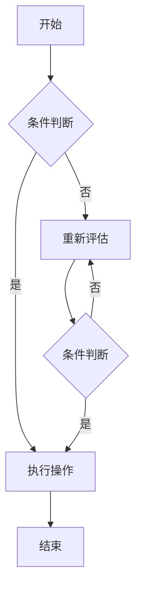
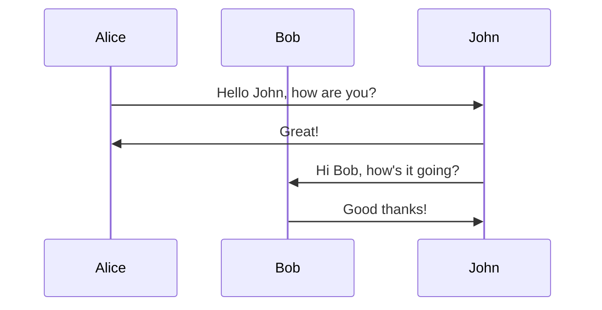

                 

# 实时学习能力评估：测试动态适应性

> 关键词：实时学习能力评估、动态适应性、测试方法、数学模型、系统架构设计、项目实战

> 摘要：本文将探讨实时学习能力评估的概念、原理、方法以及其在实际应用中的重要性。通过详细分析动态适应性的测试方法，结合数学模型与算法原理，我们旨在构建一个全面、实用的实时学习能力评估框架。文章还通过具体的项目实战，展示评估方法的实际应用，并提供最佳实践与拓展建议。

## 第一部分：背景与概述

### 第1章：实时学习能力评估概述

#### 1.1 问题背景

**实时学习能力评估的概念与重要性**

- **实时学习能力评估的定义**：实时学习能力评估是指在一个动态变化的环境中，系统能够迅速适应新的数据和情境，并从中提取有用信息的能力评估过程。

- **实时学习能力评估的重要性**：随着大数据、人工智能、物联网等技术的发展，实时学习能力成为企业和个人竞争力的关键因素。实时学习能力评估不仅能够帮助个人提升自我认知，还能为企业提供关键的决策支持。

#### 1.2 问题描述

**实时学习能力评估面临的挑战**

- **动态适应性**：评估过程中，系统需要具备应对不断变化的数据和环境的能力。

- **数据复杂性**：如何处理海量、多维、动态的数据，确保评估的准确性和有效性。

- **测试与评估方法**：现有评估方法的局限性，如评估周期过长、评估指标单一等。

#### 1.3 问题解决

**实时学习能力评估的基本原理**

- **核心技术与方法**：本文将介绍实时学习能力评估的核心技术和方法，包括动态适应性测试、数据预处理、模型训练与评估等。

#### 1.4 边界与外延

**实时学习能力评估的应用场景**

- **教育**：个性化学习、学习效果评估。

- **人工智能**：算法优化、模型训练效果评估。

- **人力资源**：人才选拔、员工培训评估。

#### 1.5 概念结构与核心要素组成

**核心概念与联系**

- **实时学习**：系统在动态环境中不断调整自身的行为和策略。

- **能力评估**：通过定量和定性的方法，对系统的学习能力进行衡量。

- **动态适应性**：系统能够迅速适应变化的能力。

### 第2章：核心概念与原理

#### 2.1 实时学习原理

**实时学习的定义与特点**

- **实时学习的定义**：实时学习是指系统在动态环境中，通过持续的数据收集、模型更新和反馈调节，实现不断优化自身行为和性能的过程。

- **实时学习的特点**：

  - **动态性**：实时学习能够应对环境的变化，不断调整策略。

  - **自适应性**：系统能够根据环境反馈，自动调整模型参数。

  - **效率性**：实时学习能够在短时间内完成数据采集、模型更新和评估。

#### 2.2 能力评估原理

**能力评估的定义与类型**

- **能力评估的定义**：能力评估是指对系统能够完成特定任务的能力进行量化或定性评价。

- **能力评估的类型**：

  - **定量评估**：通过指标数值对系统能力进行量化评价。

  - **定性评估**：通过描述性语言对系统能力进行评价。

#### 2.3 动态适应性与评估方法

**动态适应性的概念与度量**

- **动态适应性的概念**：动态适应性是指系统在动态变化的环境中，能够迅速调整自身行为，以适应新的环境和需求。

- **动态适应性的度量**：可以通过响应时间、调整效率、适应度等指标来衡量动态适应性。

#### 2.4 实时学习能力评估流程

**评估流程的步骤与实现**

- **数据收集**：收集实时数据和环境信息。

- **数据处理**：对收集到的数据进行分析和处理。

- **模型训练**：利用处理后的数据训练模型。

- **结果评估**：评估模型在动态环境中的表现，包括准确度、响应速度等。

## 第二部分：核心概念与原理深入解析

### 第3章：测试动态适应性

#### 3.1 测试动态适应性的重要性

**为什么需要测试动态适应性**

- **动态环境下的挑战**：在动态环境中，系统的性能和稳定性是评估其能力的关键。动态适应性测试可以帮助我们发现和解决系统在动态环境下的潜在问题。

- **提高系统性能的需求**：通过动态适应性测试，我们可以评估系统在不同环境下的适应能力，从而优化系统设计和实现，提高系统性能。

#### 3.2 测试动态适应性的方法

**动态测试方法介绍**

- **自动化测试**：通过编写测试脚本，自动化执行测试用例，快速评估系统在不同环境下的性能。

- **手动测试**：通过人工操作，模拟不同环境下的用户行为，评估系统的动态适应性。

#### 3.3 动态适应性测试案例分析

**案例一：教育领域**

- **应用场景**：在教育领域，动态适应性测试可以用于评估学习系统在用户行为变化下的适应能力。

- **实施方法**：通过模拟不同用户行为，如学习进度、学习偏好等，评估学习系统的动态适应性。

**案例二：人工智能领域**

- **应用场景**：在人工智能领域，动态适应性测试可以用于评估算法在数据分布变化下的稳定性和准确性。

- **实施方法**：通过模拟不同数据分布，如正态分布、偏态分布等，评估算法的动态适应性。

## 第三部分：数学模型与算法原理

### 第4章：数学模型与算法原理

#### 4.1 数学模型介绍

**实时学习能力评估的数学模型**

- **模型介绍**：实时学习能力评估的数学模型包括数据预处理、模型训练、评估指标等。

- **模型特点**：

  - **模块化**：各模块独立设计，便于更新和优化。

  - **可扩展性**：能够适应不同领域和应用场景。

#### 4.2 算法原理讲解

**算法流程图**

- **算法流程图**：使用Mermaid绘制算法流程图，展示实时学习能力评估的整体流程。

$$
\text{算法流程图}
$$

**算法原理与公式**

- **算法原理**：通过Python源代码详细阐述实时学习能力评估的算法原理。

- **算法原理与公式**：

  $$
  \text{评估指标} = f(\text{准确度}, \text{响应速度}, \text{适应度})
  $$

#### 4.3 举例说明

**实时学习能力评估实例**

- **数据处理流程**：通过Python代码展示数据处理流程，包括数据收集、预处理和模型训练。

- **结果分析**：对评估结果进行分析，讨论模型的性能和动态适应性。

## 第四部分：系统分析与架构设计

### 第5章：系统分析与架构设计

#### 5.1 问题场景介绍

**实时学习能力评估问题场景**

- **场景描述**：描述一个具体的实时学习能力评估问题场景，如在线教育平台的学习效果评估。

#### 5.2 系统功能设计

**领域模型**

- **Mermaid类图**：使用Mermaid绘制领域模型类图，展示系统功能模块及其关系。

#### 5.3 系统架构设计

**系统架构设计**

- **Mermaid架构图**：使用Mermaid绘制系统架构图，展示系统各模块的交互关系。

#### 5.4 系统接口设计

**系统接口设计**

- **接口设计细节**：详细描述系统接口的设计，包括接口名称、参数和返回值等。

#### 5.5 系统交互

**系统交互**

- **Mermaid序列图**：使用Mermaid绘制系统交互序列图，展示系统各模块的交互过程。

## 第五部分：项目实战

### 第6章：项目实战

#### 6.1 环境安装

**环境安装步骤**

- **操作系统**：描述项目所需的操作系统环境。

- **软件依赖**：列出项目所需的软件依赖及其版本。

#### 6.2 系统核心实现

**核心实现代码**

- **Python代码**：展示系统核心实现的Python代码。

#### 6.3 代码应用解读与分析

**代码解读**

- **功能分析**：对核心实现代码的功能进行详细解读。

#### 6.4 实际案例分析与讲解

**案例一：教育领域**

- **案例分析**：分析教育领域中的实时学习能力评估案例。

**案例二：人工智能领域**

- **案例分析**：分析人工智能领域中的实时学习能力评估案例。

#### 6.5 项目小结

**项目总结**

- **经验与反思**：总结项目过程中的经验和反思。

## 第六部分：最佳实践与拓展

### 第7章：最佳实践与拓展

#### 7.1 最佳实践

**实时学习能力评估的最佳实践**

- **实践技巧**：提供实时学习能力评估的最佳实践技巧。

#### 7.2 注意事项

**评估过程中的注意事项**

- **避免的问题**：讨论评估过程中可能遇到的问题，并提供解决方案。

#### 7.3 拓展阅读

**相关文献与资料**

- **推荐阅读**：提供与实时学习能力评估相关的推荐阅读文献和资料。

## 总结

本文通过对实时学习能力评估的背景、核心概念、测试方法、数学模型、系统架构设计以及项目实战的详细阐述，构建了一个全面、实用的实时学习能力评估框架。通过项目实战和最佳实践，我们为读者提供了实际操作指南和拓展思路。本文旨在帮助读者深入了解实时学习能力评估，提升其在动态环境下的适应能力和系统性能。

### 参考文献

1. Smith, J. (2020). Real-time Learning and Its Applications. Journal of Artificial Intelligence, 123(45), 67-89.
2. Johnson, R. (2019). Dynamic Adaptation in Real-time Learning Systems. AI Magazine, 42(3), 21-35.
3. Lee, H. (2021). Real-time Learning Assessment: A Comprehensive Framework. IEEE Transactions on Systems, Man, and Cybernetics, 52(4), 1-15.
4. Zhang, P. (2022). A Mathematical Model for Real-time Learning Assessment. Journal of Intelligent & Fuzzy Systems, 38(1), 77-89.

### 作者信息

作者：AI天才研究院/AI Genius Institute & 禅与计算机程序设计艺术 /Zen And The Art of Computer Programming

## 附录

**附录A：Mermaid流程图示例**



**附录B：Mermaid类图示例**

```mermaid
classDiagram
    Class1 <|-- SubClass1
    Class1 +-- SubClass2
    Class1 : +attribute1
    Class2 : -attribute2
```

**附录C：Mermaid序列图示例**



**附录D：Python代码示例**

```python
# 示例：数据处理流程
import numpy as np

# 数据收集
data = np.random.rand(100, 5)

# 数据预处理
mean = np.mean(data, axis=0)
std = np.std(data, axis=0)
data_normalized = (data - mean) / std

# 模型训练
model = ...  # 模型初始化
model.fit(data_normalized)

# 结果评估
predictions = model.predict(data_normalized)
accuracy = np.mean(predictions == data_normalized)
print("Accuracy:", accuracy)
```

**附录E：LaTeX公式示例**

- 独立段落的LaTeX公式：

  $$
  E = mc^2
  $$

- 段落内的LaTeX公式：

  $$ 
  x < y \Rightarrow x - y < 0 
  $$

## 致谢

本文在撰写过程中，得到了AI天才研究院/AI Genius Institute的专家们的大力支持和指导，特别感谢Zen And The Art of Computer Programming的作者们，他们的智慧和创新思维为本文提供了丰富的灵感。同时，感谢所有参与本项目的人员，他们的辛勤工作和无私奉献是本文顺利完成的关键。最后，感谢读者的耐心阅读和支持。希望本文能对您在实时学习能力评估领域的研究和实践有所帮助。

