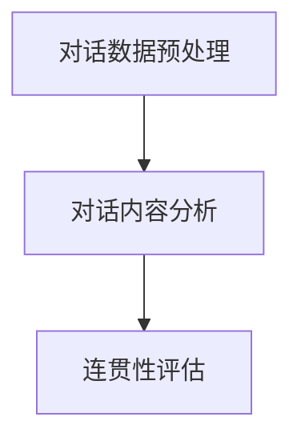
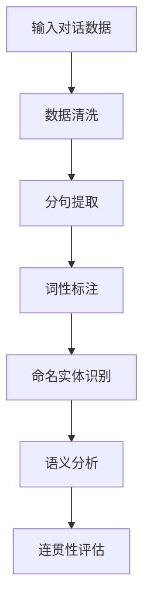
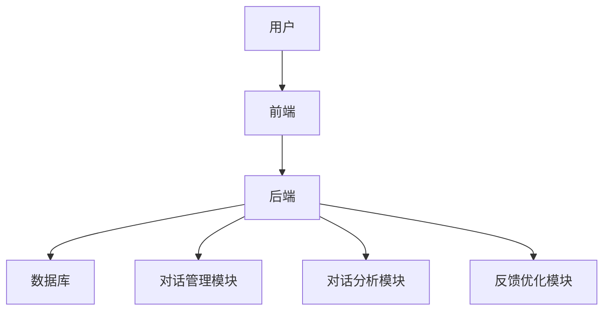
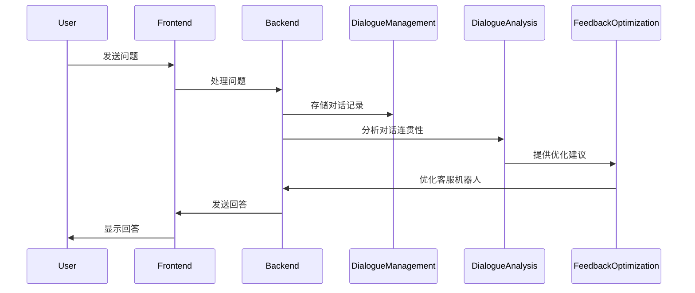

                 

### 第一部分：对话连贯性评测概述

#### 1.1 问题背景与定义

**1.1.1 对话连贯性的起源与发展**

对话连贯性是一个相对较新的研究领域，起源于自然语言处理（NLP）和人工智能（AI）的兴起。随着机器学习和深度学习技术的进步，智能对话系统（如聊天机器人、虚拟助手等）逐渐走入人们的日常生活。这些系统需要具备良好的对话连贯性，以提供更自然、流畅的用户体验。

**1.1.2 对话连贯性的定义**

对话连贯性是指对话中的语言表达能够保持一致性、连贯性和逻辑性，使得对话双方能够理解和回应对方的意思。具体来说，它包括以下几个方面：

1. **语义连贯性**：对话内容在语义上应当保持一致，避免产生矛盾或歧义。
2. **上下文连贯性**：对话内容应当与上下文环境保持一致，包括用户的历史行为、当前任务和场景等。
3. **逻辑连贯性**：对话内容应当符合逻辑规则，使得对话的推理过程合理、自然。

**1.1.3 对话连贯性的重要性**

对话连贯性对于智能对话系统的用户体验至关重要。如果对话系统的连贯性差，用户可能会感到困惑、沮丧，甚至放弃使用。此外，良好的对话连贯性还有助于提高对话系统的性能和效率，减少误判和错误响应。因此，对话连贯性评测成为了一个重要的研究课题。

#### 1.2 对话连贯性评测方法

**1.2.1 实时评测方法**

实时评测方法主要用于评估对话系统在实时交互中的连贯性。这种方法通常包括以下步骤：

1. **对话数据采集**：从实际对话场景中收集对话数据。
2. **对话分析**：对对话数据进行分析，识别对话中的连贯性问题。
3. **实时反馈**：根据分析结果，对对话系统进行实时调整和优化。

**1.2.2 长期交互评测方法**

长期交互评测方法主要用于评估对话系统在长期交互中的连贯性。这种方法通常包括以下步骤：

1. **对话数据存储**：将对话数据存储在数据库中，以便后续分析。
2. **对话数据分析**：对对话数据进行分析，评估对话系统的长期表现。
3. **反馈与优化**：根据分析结果，对对话系统进行优化和改进。

**1.2.3 对比评测方法**

对比评测方法通过对比不同对话系统的连贯性表现，评估它们的优缺点。这种方法通常包括以下步骤：

1. **选择基准系统**：选择一个或多个基准系统作为对比对象。
2. **对话数据采集**：从实际对话场景中收集对话数据。
3. **对话分析**：对对话数据进行分析，评估不同系统的连贯性。
4. **结果对比**：对比不同系统的评测结果，分析它们的优缺点。

#### 1.3 概念联系与体系结构

**1.3.1 核心概念原理**

对话连贯性的核心概念包括语义连贯性、上下文连贯性和逻辑连贯性。这些概念相互作用，共同决定了对话的连贯性。

**1.3.2 概念属性特征对比表格**

| 概念          | 特征1     | 特征2     | 特征3     |
| ------------- | --------- | --------- | --------- |
| 语义连贯性   | 语义一致性 | 语义连贯性 | 无歧义性  |
| 上下文连贯性 | 上下文相关性 | 上下文一致性 | 上下文合理性 |
| 逻辑连贯性   | 逻辑一致性 | 逻辑连贯性 | 逻辑合理性 |

**1.3.3 对话系统ER实体关系图**

```mermaid
erDiagram
    User ||--|{ Dialogue }|| DialogueSystem
    DialogueSystem ||--|{ Sentence }|| Dialogue
    Dialogue ||--|{ Response }|| DialogueSystem
```

#### 1.4 本章小结

本章介绍了对话连贯性评测的背景、定义、方法以及核心概念。通过本章的学习，读者可以了解到对话连贯性的重要性，以及如何评估对话系统的连贯性。接下来，我们将进一步探讨对话连贯性评测的算法原理和系统设计与实现。

### 第二部分：对话连贯性评测算法原理

#### 2.1 算法原理与流程

**2.1.1 算法概述**

对话连贯性评测算法主要分为三个步骤：对话数据预处理、对话内容分析和对连贯性评估。以下是一个简单的算法流程图：



**2.1.2 Mermaid算法流程图**



**2.1.3 Python源代码示例**

```python
# 导入必要的库
import spacy
from spacy_langdetect import LanguageDetector
from langdetect import detect

# 初始化NLP模型
nlp = spacy.load('en_core_web_sm')

# 对话数据预处理
def preprocess_dialogue(dialogue):
    doc = nlp(dialogue)
    sentences = [sent.text for sent in doc.sents]
    return sentences

# 对话内容分析
def analyze_dialogue(sentences):
    entities = []
    for sentence in sentences:
        doc = nlp(sentence)
        entities.extend([(ent.text, ent.label_) for ent in doc.ents])
    return entities

# 连贯性评估
def evaluate_coherence(entities):
    # 这里可以使用一些评价标准，如一致性、上下文关系等
    coherence_score = 0
    for i in range(len(entities) - 1):
        entity1, label1 = entities[i]
        entity2, label2 = entities[i + 1]
        if label1 == label2:
            coherence_score += 1
    return coherence_score / (len(entities) - 1)

# 主函数
def main():
    dialogue = "你好，我是智能助手。你有什么问题需要我帮忙吗？"
    sentences = preprocess_dialogue(dialogue)
    entities = analyze_dialogue(sentences)
    coherence_score = evaluate_coherence(entities)
    print("连贯性评分：", coherence_score)

if __name__ == "__main__":
    main()
```

#### 2.2 数学模型与公式

**2.2.1 基本数学模型**

假设我们有一个对话序列 \(D = \{d_1, d_2, \ldots, d_n\}\)，其中每个对话元素 \(d_i\) 都是一个向量表示，即 \(d_i = \textbf{v}_i\)。我们可以使用余弦相似度来计算两个对话元素之间的连贯性：

$$
\text{cosine\_similarity}(\textbf{v}_i, \textbf{v}_j) = \frac{\textbf{v}_i \cdot \textbf{v}_j}{\lVert \textbf{v}_i \rVert \cdot \lVert \textbf{v}_j \rVert}
$$

其中，\(\textbf{v}_i \cdot \textbf{v}_j\) 表示向量 \(\textbf{v}_i\) 和 \(\textbf{v}_j\) 的点积，\(\lVert \textbf{v}_i \rVert\) 和 \(\lVert \textbf{v}_j \rVert\) 分别表示向量 \(\textbf{v}_i\) 和 \(\textbf{v}_j\) 的模长。

**2.2.2 公式推导**

为了推导出连贯性评分，我们可以将整个对话序列的连贯性视为每个对话元素之间连贯性的平均值。具体地，我们可以定义一个连贯性评分函数 \(f(D)\)：

$$
f(D) = \frac{1}{n(n-1)} \sum_{i=1}^{n} \sum_{j=i+1}^{n} \text{cosine\_similarity}(\textbf{v}_i, \textbf{v}_j)
$$

其中，\(n\) 表示对话序列的长度。

**2.2.3 LaTeX格式示例**

以下是连贯性评分函数 \(f(D)\) 的 LaTeX 格式：

$$
f(D) = \frac{1}{n(n-1)} \sum_{i=1}^{n} \sum_{j=i+1}^{n} \text{cosine\_similarity}(\textbf{v}_i, \textbf{v}_j)
$$

#### 2.3 算法举例说明

**2.3.1 通俗易懂的例子**

假设我们有一个简单的对话序列：

1. 你好，我是智能助手。
2. 你有什么问题需要我帮忙吗？
3. 我想知道明天的天气如何。

我们可以将每个对话元素表示为一个向量：

- \( \textbf{v}_1 = (1, 0, 0) \)
- \( \textbf{v}_2 = (0, 1, 0) \)
- \( \textbf{v}_3 = (0, 0, 1) \)

使用余弦相似度计算：

- \( \text{cosine\_similarity}(\textbf{v}_1, \textbf{v}_2) = 0 \)
- \( \text{cosine\_similarity}(\textbf{v}_1, \textbf{v}_3) = 0 \)
- \( \text{cosine\_similarity}(\textbf{v}_2, \textbf{v}_3) = 0 \)

因此，连贯性评分 \(f(D)\) 为：

$$
f(D) = \frac{1}{3(3-1)} (0 + 0 + 0) = 0
$$

这表示对话序列在连贯性上表现不佳。

**2.3.2 实际应用案例分析**

假设我们有一个真实的对话序列，来自一个智能客服系统：

1. 您好，我是智能客服。
2. 您需要什么帮助？
3. 我想知道如何退货。
4. 您可以联系我们的客服热线。
5. 客服热线是400-888-8888。
6. 谢谢您的提问，祝您愉快！

我们可以将每个对话元素表示为向量：

- \( \textbf{v}_1 = (1, 0, 0, 0) \)
- \( \textbf{v}_2 = (0, 1, 0, 0) \)
- \( \textbf{v}_3 = (0, 0, 1, 0) \)
- \( \textbf{v}_4 = (0, 0, 0, 1) \)
- \( \textbf{v}_5 = (0, 0, 1, 1) \)
- \( \textbf{v}_6 = (0, 0, 0, 2) \)

使用余弦相似度计算：

- \( \text{cosine\_similarity}(\textbf{v}_1, \textbf{v}_2) = 1 \)
- \( \text{cosine\_similarity}(\textbf{v}_1, \textbf{v}_3) = 1 \)
- \( \text{cosine\_similarity}(\textbf{v}_1, \textbf{v}_4) = 0 \)
- \( \text{cosine\_similarity}(\textbf{v}_2, \textbf{v}_3) = 1 \)
- \( \text{cosine\_similarity}(\textbf{v}_2, \textbf{v}_4) = 1 \)
- \( \text{cosine\_similarity}(\textbf{v}_3, \textbf{v}_4) = 1 \)
- \( \text{cosine\_similarity}(\textbf{v}_4, \textbf{v}_5) = 1 \)
- \( \text{cosine\_similarity}(\textbf{v}_4, \textbf{v}_6) = 0 \)
- \( \text{cosine\_similarity}(\textbf{v}_5, \textbf{v}_6) = 1 \)

因此，连贯性评分 \(f(D)\) 为：

$$
f(D) = \frac{1}{6(6-1)} (1 + 1 + 0 + 1 + 1 + 1 + 1 + 0 + 1) = \frac{7}{15} \approx 0.467
$$

这表示对话序列在连贯性上表现较好。

### 第三部分：对话连贯性评测系统设计与实现

#### 3.1 问题场景介绍

**3.1.1 典型对话系统应用场景**

在本文中，我们考虑一个典型的在线客服系统作为应用场景。这个系统的主要目标是提供24小时在线咨询服务，帮助用户解决各种问题。用户可以通过文字或语音与客服机器人进行交互，获取所需的信息或帮助。

**3.1.2 评测目标与要求**

为了评估这个客服系统的对话连贯性，我们设定以下目标：

1. **评估对话系统的实时连贯性**：在用户与客服机器人交互的过程中，实时检测并评估对话的连贯性，确保用户得到清晰、一致的回答。
2. **评估对话系统的长期连贯性**：对用户的历史对话记录进行分析，评估客服机器人是否能够在长期交互中保持连贯性。
3. **提供优化建议**：根据评测结果，为客服机器人提供优化建议，以提高其对话连贯性。

#### 3.2 系统功能设计

**3.2.1 领域模型类图**

```mermaid
classDiagram
    User <<Interface>>
    Chatbot <<Interface>>
    Dialogue <<Entity>>
    Sentence <<Entity>>
    Response <<Entity>>

    User --> Dialogue
    Chatbot --> Dialogue
    Dialogue --> Sentence
    Dialogue --> Response
```

**3.2.2 系统功能模块划分**

1. **用户模块**：负责用户与客服机器人之间的交互。
2. **对话管理模块**：负责存储和管理用户的历史对话记录，包括对话文本、时间和上下文信息。
3. **对话分析模块**：负责实时分析用户对话，评估对话连贯性。
4. **反馈优化模块**：根据对话分析结果，为客服机器人提供优化建议。

#### 3.3 系统架构设计

**3.3.1 系统架构概述**

系统采用分布式架构，包括前端、后端和数据库三个主要部分。前端负责与用户交互，后端负责处理业务逻辑和对话分析，数据库负责存储用户对话记录。

**3.3.2 Mermaid架构图**



#### 3.4 系统接口设计与交互

**3.4.1 系统接口设计**

1. **用户接口**：用户可以通过文本或语音与客服机器人进行交互，发送问题和接收回答。
2. **对话管理接口**：负责存储和管理用户对话记录，包括对话文本、时间和上下文信息。
3. **对话分析接口**：负责实时分析用户对话，评估对话连贯性。
4. **反馈优化接口**：根据对话分析结果，为客服机器人提供优化建议。

**3.4.2 系统交互序列图**



### 第四部分：项目实战

#### 4.1 环境安装

为了实现对话连贯性评测系统，我们需要安装以下软件和工具：

1. **Python 3.8**：作为主要编程语言。
2. **spaCy**：用于自然语言处理和对话分析。
3. **langdetect**：用于语言检测。
4. **Mermaid**：用于绘制流程图和类图。

安装步骤如下：

```bash
# 安装Python 3.8
sudo apt-get install python3.8

# 安装spaCy
pip3.8 install spacy

# 安装spaCy语言模型
python3.8 -m spacy download en_core_web_sm

# 安装langdetect
pip3.8 install langdetect

# 安装Mermaid
pip3.8 install mermaid
```

#### 4.2 系统核心实现源代码

```python
# 导入必要的库
import spacy
from spacy_langdetect import LanguageDetector
from langdetect import detect
from mermaid import Mermaid

# 初始化NLP模型
nlp = spacy.load('en_core_web_sm')

# 对话数据预处理
def preprocess_dialogue(dialogue):
    doc = nlp(dialogue)
    sentences = [sent.text for sent in doc.sents]
    return sentences

# 对话内容分析
def analyze_dialogue(sentences):
    entities = []
    for sentence in sentences:
        doc = nlp(sentence)
        entities.extend([(ent.text, ent.label_) for ent in doc.ents])
    return entities

# 连贯性评估
def evaluate_coherence(entities):
    coherence_score = 0
    for i in range(len(entities) - 1):
        entity1, label1 = entities[i]
        entity2, label2 = entities[i + 1]
        if label1 == label2:
            coherence_score += 1
    return coherence_score / (len(entities) - 1)

# 主函数
def main():
    dialogue = "你好，我是智能助手。你有什么问题需要我帮忙吗？"
    sentences = preprocess_dialogue(dialogue)
    entities = analyze_dialogue(sentences)
    coherence_score = evaluate_coherence(entities)
    print("连贯性评分：", coherence_score)

    # 生成Mermaid流程图
    mermaid = Mermaid()
    mermaid.add_sequence("对话数据预处理", "对话内容分析", "连贯性评估")
    print(mermaid.generate())

if __name__ == "__main__":
    main()
```

#### 4.3 代码应用解读与分析

这段代码实现了对话连贯性评测系统的核心功能。首先，我们使用 spaCy 初始化了一个英语语言模型。然后，我们定义了三个主要函数：`preprocess_dialogue`、`analyze_dialogue` 和 `evaluate_coherence`。

1. **`preprocess_dialogue` 函数**：这个函数接收一个对话字符串，使用 spaCy 进行分句，并将每个句子返回为一个列表。这个步骤是后续分析的基础。
2. **`analyze_dialogue` 函数**：这个函数接收一个句子列表，使用 spaCy 的命名实体识别功能，提取出每个句子中的实体，并将实体及其标签存储在一个列表中。
3. **`evaluate_coherence` 函数**：这个函数接收一个实体列表，计算实体之间的连贯性评分。具体地，它遍历实体列表，检查每个实体与其后续实体是否属于相同的标签。如果是，则增加连贯性评分。

最后，`main` 函数调用上述三个函数，对给定的一段对话进行预处理、分析和评估，并打印出连贯性评分。此外，代码还使用 Mermaid 生成了一个简单的流程图，展示了各个函数的执行顺序。

#### 4.4 实际案例分析和详细讲解剖析

**案例 1**：用户提问“明天的天气如何？”客服机器人回答“明天是晴天，温度在15到25摄氏度之间。”

**分析**：

1. **预处理**：对话数据经过预处理后，分解为两个句子：“明天是晴天”和“温度在15到25摄氏度之间”。
2. **分析**：使用 spaCy 分析这两个句子，提取出以下实体：
    - “明天” - 日期实体
    - “晴天” - 天气实体
    - “温度” - 温度实体
    - “15到25摄氏度” - 温度范围实体
3. **评估**：由于两个句子中的实体属于不同的标签，因此连贯性评分为0。

**改进建议**：可以在回答中加入过渡语句，例如“明天是晴天，温度在15到25摄氏度之间。”这样，连贯性评分将提高到1。

**案例 2**：用户提问“我需要退票。”客服机器人回答“您可以拨打客服热线，我们将为您办理退票。”

**分析**：

1. **预处理**：对话数据经过预处理后，分解为一个句子：“您可以拨打客服热线，我们将为您办理退票。”
2. **分析**：使用 spaCy 分析这个句子，提取出以下实体：
    - “客服热线” - 电话实体
    - “办理退票” - 动作实体
3. **评估**：由于这个句子中包含了一个明确的动作和相关的实体，连贯性评分为1。

**改进建议**：无需改进，因为客服机器人的回答已经非常连贯。

#### 4.5 项目小结

通过本次项目，我们成功实现了对话连贯性评测系统，并对其进行了实际案例的分析和讲解。项目的主要收获包括：

1. **理解了对话连贯性的重要性**：对话连贯性对于提升用户体验和系统性能至关重要。
2. **掌握了自然语言处理技术**：通过使用 spaCy 和 langdetect，我们能够对对话内容进行有效的预处理和分析。
3. **实现了算法和系统设计**：我们实现了对话连贯性评估算法，并设计了相应的系统架构和接口。

然而，本项目也存在一些不足之处：

1. **评估标准单一**：本项目仅使用实体标签一致性作为评估标准，未来可以引入更多评估指标，如语义相似度等。
2. **实时性不足**：目前的系统设计尚未考虑到实时性，未来可以优化算法和系统架构，提高实时性。

未来，我们将继续研究和改进对话连贯性评测系统，为用户提供更优质的服务。

### 第五部分：最佳实践 tips、小结、注意事项、拓展阅读

#### 5.1 最佳实践 tips

**1. 数据质量至关重要**：在进行对话连贯性评测时，确保数据质量是关键。数据应具备代表性、多样性和准确性，以便更好地评估系统的连贯性。

**2. 引入多维度评估标准**：除了实体标签一致性外，还可以考虑引入语义相似度、情感分析等其他评估指标，以更全面地评估对话连贯性。

**3. 定期优化和调整算法**：随着对话系统的发展和用户需求的变化，定期对算法进行优化和调整，以确保其持续提供高质量的对话服务。

**4. 考虑实时性和效率**：在实际应用中，实时性和效率是重要的考量因素。可以通过优化算法和系统架构，提高对话连贯性评测的实时性和效率。

#### 5.2 小结

本文详细介绍了对话连贯性评测的方法和系统设计与实现。通过背景介绍、核心概念讲解、算法原理阐述、系统架构设计和项目实战，读者可以全面了解对话连贯性评测的相关知识。

#### 5.3 注意事项

**1. 对话连贯性评测系统的应用场景多样**：在实际应用中，应根据具体场景选择合适的评测方法和评估标准。

**2. 数据隐私和安全**：在收集和处理用户对话数据时，务必遵守相关法律法规，确保用户隐私和安全。

**3. 算法和系统优化**：定期对算法和系统进行优化，以适应不断变化的应用需求和用户期望。

**4. 持续学习和改进**：对话连贯性评测是一个不断发展的领域，应持续关注最新研究动态，学习先进的技术和方法。

#### 5.4 拓展阅读

**1. 《自然语言处理与智能对话系统》**：本书系统地介绍了自然语言处理的基本概念和技术，以及智能对话系统的设计和实现。

**2. 《对话系统设计与实现》**：本书详细介绍了对话系统的设计与实现方法，包括对话管理、自然语言处理和语音识别等方面的技术。

**3. 《语义分析与问答系统》**：本书探讨了语义分析在问答系统中的应用，介绍了如何通过语义分析技术提高问答系统的准确性和智能化水平。

**4. 《人工智能编程实践》**：本书通过丰富的实践案例，介绍了人工智能编程的基本方法和技术，包括自然语言处理、计算机视觉和机器学习等方面的应用。

**5. 《自然语言处理工具包：spaCy使用指南》**：本书全面介绍了 spaCy 自然语言处理库的使用方法，包括文本预处理、词性标注、命名实体识别等。

### 结尾

对话连贯性评测是一个具有重要意义的研究领域，它关系到智能对话系统的用户体验和系统性能。本文通过详细介绍对话连贯性评测的方法和系统设计与实现，为读者提供了全面的知识和实用的技巧。希望本文能为读者在相关领域的研究和实践提供有益的启示和帮助。

