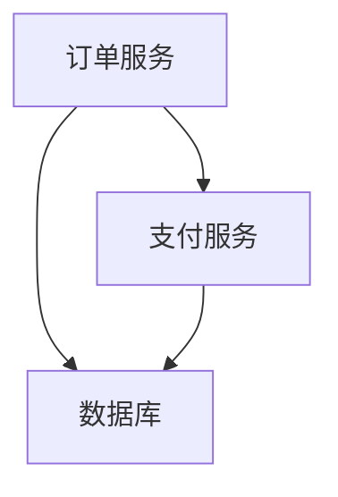
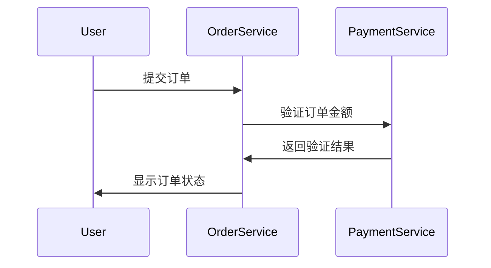
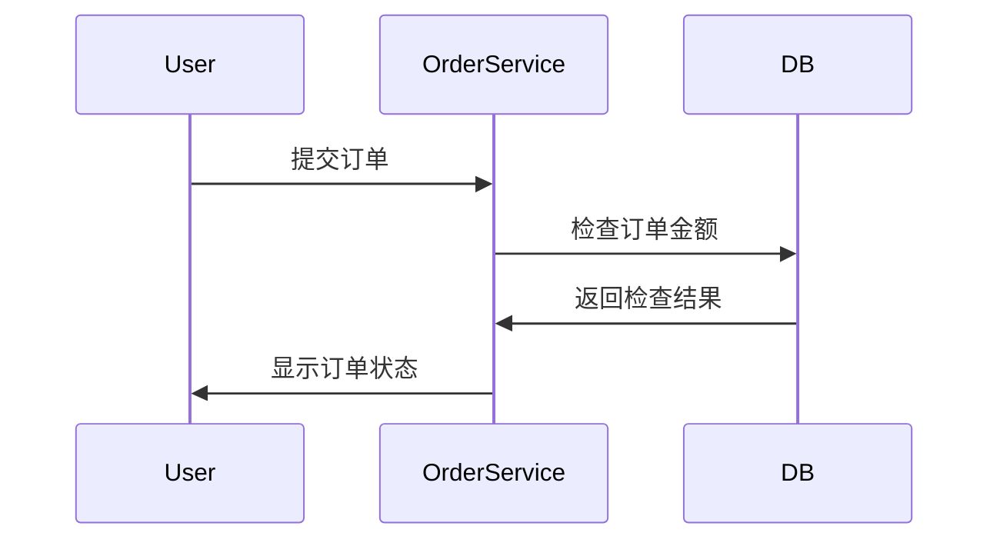

                 


# 异常处理能力评估：测试边界情况应对

## 关键词
异常处理、边界情况测试、测试用例设计、测试结果分析、机器学习

## 摘要
本文深入探讨异常处理能力的评估方法，重点关注边界情况测试在异常处理中的应用。通过设计有效的测试用例和分析测试结果，我们能够识别和优先处理问题，提高系统的稳定性和可靠性。本文还介绍了高级技术，如机器学习在边界情况预测中的应用，以及如何通过反馈实现持续改进。最后，通过实际案例研究，我们展示了异常处理在金融、医疗和电子商务等领域的成功应用。

## 第一部分：异常处理概述

### 第1章：异常处理的概念介绍

在软件开发和系统设计中，异常处理是确保系统稳定运行的重要环节。异常处理是指当程序遇到预期之外的情况或错误时，能够采取适当的措施进行处理，从而避免系统崩溃或造成数据损失。异常处理的目的是确保系统的可靠性和连续性，提高用户体验。

**核心概念术语说明：**
- 异常：指程序在运行过程中遇到的不符合预期的行为或错误。
- 异常处理：指在程序中设置专门的机制来处理异常，以防止程序崩溃或数据丢失。
- 边界情况：指程序输入或输出的临界值，超出这个范围会导致程序行为异常。

**问题背景：**
在现代软件系统中，异常处理尤为重要。随着系统复杂度的增加，异常情况的发生频率也在增加。如何有效地处理这些异常，确保系统稳定运行，成为了软件开发中的一个重要课题。

**问题描述：**
异常处理的核心问题是如何识别和应对各种异常情况。这包括设计合适的异常处理机制、制定有效的测试策略以及分析测试结果。

**问题解决：**
为了解决这些问题，我们需要首先理解异常处理的原理，包括异常类型、异常传播机制和异常处理方法。然后，通过设计边界情况测试用例，识别潜在的异常情况，并分析测试结果，找出需要优先处理的问题。

**边界与外延：**
边界情况是异常处理中一个重要的概念。它涉及程序输入和输出的临界值，包括最大值、最小值和其他特殊值。边界情况测试可以帮助我们识别系统在临界值下的行为，确保系统在这些情况下能够正常工作。

**概念结构与核心要素组成：**
异常处理的概念结构包括以下几个核心要素：
1. 异常类型：包括运行时异常、语法异常等。
2. 异常传播：异常如何在程序中传播，以及如何捕获和处理异常。
3. 异常处理机制：包括try-catch语句、异常处理函数等。
4. 测试策略：如何设计测试用例，覆盖各种异常情况。
5. 测试结果分析：如何分析测试结果，找出需要改进的地方。

### 第2章：异常处理的基本原理

**核心概念原理：**
异常处理的基本原理是在程序中设置专门的机制来捕获和处理异常。这包括以下几个步骤：
1. 检测异常：程序在运行过程中检测到异常情况。
2. 抛出异常：异常情况被检测到后，程序会抛出一个异常对象。
3. 捕获异常：程序中的异常处理机制捕获异常对象。
4. 处理异常：异常处理机制对异常对象进行相应的处理，如输出错误信息、恢复程序状态或终止程序运行。

**概念属性特征对比表格：**

| 特征            | 说明                                                         |
| --------------- | ------------------------------------------------------------ |
| 异常类型        | 包括运行时异常、语法异常等。                                 |
| 异常传播机制    | 异常如何在程序中传播，以及如何捕获和处理异常。               |
| 异常处理机制    | 包括try-catch语句、异常处理函数等。                         |
| 测试策略        | 如何设计测试用例，覆盖各种异常情况。                         |
| 测试结果分析    | 如何分析测试结果，找出需要改进的地方。                       |

**ER实体关系图架构：**

```mermaid
erDiagram
    Class1 ||--|{ Class2 }| Class3
    Class1 ||--|{ Class4 }| Class5
```

**算法原理讲解：**
异常处理的核心算法原理是捕获和处理异常。在Python中，可以使用try-except语句来实现异常处理。

```python
try:
    # 程序代码
except Exception as e:
    # 异常处理代码
    print(f"An exception occurred: {e}")
```

在try块中，我们编写可能会抛出异常的代码。如果在这个块中发生异常，异常会被抛出，然后进入except块，我们可以在这里处理异常。

**数学模型和公式：**
异常处理的数学模型通常涉及概率论和统计学。例如，我们可以使用概率来预测异常发生的可能性。

$$ P(A) = \frac{n(A)}{n(S)} $$

其中，$P(A)$表示事件A发生的概率，$n(A)$表示事件A发生的次数，$n(S)$表示总次数。

**详细讲解和举例说明：**
假设我们有一个简单的程序，用于计算两个数的和。如果输入的数不是数字，程序会发生异常。

```python
def add(a, b):
    try:
        result = int(a) + int(b)
        return result
    except ValueError:
        return "Invalid input"

# 测试
print(add("10", "20"))  # 输出: 30
print(add("10", "abc"))  # 输出: Invalid input
```

在这个例子中，我们使用try-except语句来捕获ValueError异常，并返回一个错误消息。

## 第二部分：边界情况测试策略

### 第3章：设计边界情况测试用例

边界情况测试是一种重要的测试方法，用于检查系统在边界条件下的行为。通过设计边界情况测试用例，我们可以确保系统在极端情况下也能正常工作。

#### 3.1：边界条件的类型

边界条件可以分为以下几种类型：

1. **输入边界：** 系统输入的值的边界，如最大值、最小值。
2. **输出边界：** 系统输出的值的边界，如最大值、最小值。
3. **时间边界：** 系统处理时间的边界，如最长处理时间。
4. **资源边界：** 系统可用资源的边界，如最大内存使用、最大并发连接数。

#### 3.2：识别潜在边界情况

为了识别潜在边界情况，我们可以采取以下步骤：

1. **阅读文档：** 阅读系统文档，了解系统功能和限制。
2. **分析代码：** 分析系统代码，找出可能的边界条件。
3. **与开发人员交流：** 与开发人员交流，了解系统设计细节和潜在边界。

#### 3.3：设计有效的测试场景

设计有效的测试场景是边界情况测试的关键。以下是一些设计测试场景的建议：

1. **最小边界：** 输入或输出的最小合法值。
2. **最大边界：** 输入或输出的最大合法值。
3. **边界内部：** 在边界值附近设计一些测试场景，检查系统行为。
4. **极端情况：** 设计一些极端情况，如超长时间处理、超大数据量。

#### 3.4：实施边界情况测试

实施边界情况测试包括以下步骤：

1. **编写测试用例：** 根据设计好的测试场景，编写测试用例。
2. **执行测试用例：** 运行测试用例，检查系统行为。
3. **记录结果：** 记录测试结果，包括系统行为和异常情况。
4. **分析结果：** 分析测试结果，找出需要改进的地方。

### 第4章：分析测试结果

分析测试结果是边界情况测试的重要环节。通过分析测试结果，我们可以识别潜在问题，并制定改进措施。

#### 4.1：数据收集和分析

数据收集和分析是分析测试结果的第一步。我们需要收集以下数据：

1. **测试用例执行结果：** 包括成功和失败的测试用例。
2. **异常情况记录：** 包括异常类型、异常发生的位置和原因。
3. **系统性能数据：** 包括系统处理时间、资源使用情况等。

#### 4.2：识别和优先处理问题

识别和优先处理问题是分析测试结果的关键。以下是一些识别和优先处理问题的方法：

1. **异常类型统计：** 统计不同类型的异常，找出出现频率最高的异常。
2. **异常影响分析：** 分析异常对系统功能和性能的影响，找出影响最大的异常。
3. **故障模式分析：** 分析异常发生的模式和原因，找出潜在的系统设计问题。

#### 4.3：提高测试覆盖率

提高测试覆盖率是确保系统稳定性的关键。以下是一些提高测试覆盖率的方法：

1. **增加测试用例数量：** 设计更多测试用例，覆盖更多边界情况。
2. **改进测试策略：** 优化测试策略，确保覆盖更多边界情况。
3. **自动化测试：** 使用自动化测试工具，提高测试效率。

## 第三部分：高级异常处理技术

### 第5章：高级方法

高级异常处理技术可以帮助我们更有效地处理边界情况，提高系统的稳定性和可靠性。

#### 5.1：机器学习

机器学习可以用于预测边界情况，从而提前采取措施。以下是一些应用：

1. **异常检测：** 使用机器学习模型检测异常行为。
2. **预测性维护：** 使用机器学习模型预测系统故障，进行预防性维护。

#### 5.2：自适应测试策略

自适应测试策略可以根据测试结果自动调整测试策略，提高测试效率。以下是一些应用：

1. **动态测试用例生成：** 根据测试结果动态生成测试用例。
2. **资源优化：** 根据测试负载动态调整测试资源。

#### 5.3：反馈循环

反馈循环是持续改进的关键。以下是一些应用：

1. **测试结果反馈：** 将测试结果反馈给开发人员，指导系统改进。
2. **持续学习：** 使用机器学习模型不断优化异常处理策略。

## 第四部分：案例研究

### 第6章：实际应用中的边界情况处理

在实际应用中，边界情况处理是一个关键问题。以下是一些实际案例：

#### 6.1：金融应用

在金融应用中，边界情况处理尤为重要。以下是一个金融应用案例：

**案例描述：** 一个在线银行系统在处理转账交易时，需要对转账金额进行边界检查。如果转账金额超出最大限额，系统会抛出异常。

**解决方案：** 系统设计了一个边界检查模块，对输入的转账金额进行验证。如果金额超出最大限额，系统会抛出异常，并返回错误消息。

#### 6.2：医疗系统

在医疗系统中，边界情况处理也是一个关键问题。以下是一个医疗系统案例：

**案例描述：** 一个医疗预约系统在处理预约时间时，需要对预约时间进行边界检查。如果预约时间超出工作时间，系统会抛出异常。

**解决方案：** 系统设计了一个时间检查模块，对输入的预约时间进行验证。如果时间超出工作时间，系统会抛出异常，并返回错误消息。

#### 6.3：电子商务平台

在电子商务平台中，边界情况处理也是一个关键问题。以下是一个电子商务平台案例：

**案例描述：** 一个电子商务平台在处理订单时，需要对订单金额进行边界检查。如果订单金额超出最大限额，系统会抛出异常。

**解决方案：** 系统设计了一个金额检查模块，对输入的订单金额进行验证。如果金额超出最大限额，系统会抛出异常，并返回错误消息。

## 第五部分：最佳实践与总结

### 第7章：最佳实践

为了有效地处理边界情况，以下是一些最佳实践：

1. **全面测试：** 设计全面的测试用例，覆盖所有边界情况。
2. **自动化测试：** 使用自动化测试工具，提高测试效率。
3. **持续集成：** 将测试集成到开发流程中，确保及时发现问题。
4. **异常监控：** 使用异常监控工具，实时监控系统异常情况。

### 第8章：结论与未来方向

通过本文的研究，我们深入探讨了异常处理能力评估以及边界情况测试在其中的重要作用。通过设计有效的测试用例和分析测试结果，我们能够识别和优先处理问题，提高系统的稳定性和可靠性。同时，我们介绍了高级异常处理技术，如机器学习和自适应测试策略，以及如何通过反馈实现持续改进。

未来，随着系统复杂度的增加，边界情况处理将成为一个更加重要的问题。我们需要继续研究更有效的异常处理方法，以及如何利用先进技术如机器学习来优化异常处理过程。此外，持续集成和持续改进也是确保系统稳定性的关键。

作者：AI天才研究院/AI Genius Institute & 禅与计算机程序设计艺术 /Zen And The Art of Computer Programming

### 完整性要求

**背景介绍：**

异常处理是确保软件系统稳定运行的重要环节。在现代软件开发中，随着系统复杂度和规模的增长，异常情况的处理变得尤为重要。异常处理不仅涉及到系统内部错误的处理，还包括对外部输入的边界条件进行检查，以确保系统在极端情况下仍能正常运行。

本文的核心内容将围绕异常处理能力的评估，特别是边界情况测试的应用展开。我们将详细探讨边界条件、测试用例设计、测试结果分析、高级异常处理技术以及实际应用案例。

**核心概念与联系：**

异常处理的核心概念包括异常类型、异常传播机制、异常处理机制、测试策略和测试结果分析。以下是这些概念之间的联系和对比表格：

| 特征            | 说明                                                         |
| --------------- | ------------------------------------------------------------ |
| 异常类型        | 包括运行时异常、语法异常等，定义了系统可能遇到的错误类型。     |
| 异常传播机制    | 异常如何在程序中传播，以及如何捕获和处理异常，决定了异常的传递和处理过程。 |
| 异常处理机制    | 包括try-catch语句、异常处理函数等，用于捕获异常并采取相应的措施。 |
| 测试策略        | 如何设计测试用例，覆盖各种异常情况，以确保系统在各种边界条件下都能正常工作。 |
| 测试结果分析    | 如何分析测试结果，找出需要改进的地方，优化异常处理能力。     |

以下是异常处理的核心概念ER实体关系图：

```mermaid
erDiagram
    ExceptionType ||--|{ ExceptionPropagation }| ExceptionHandling
    ExceptionType ||--|{ TestCaseDesign }| TestResultAnalysis
```

**算法原理讲解：**

异常处理的算法原理是基于异常生命周期。在Python中，可以使用try-except语句来实现异常处理。以下是基本的异常处理流程：

1. **尝试执行代码**：在try块中执行可能抛出异常的代码。
2. **捕获异常**：如果try块中的代码抛出异常，异常会被传递到对应的except块。
3. **处理异常**：在except块中处理异常，例如记录异常信息、恢复程序状态或重新抛出异常。

以下是Python中的异常处理示例：

```python
try:
    # 可能抛出异常的代码
except Exception as e:
    # 异常处理代码
    print(f"An exception occurred: {e}")
```

**数学公式使用：**

在异常处理中，我们经常需要使用概率论和统计学来预测异常的发生。以下是一个简单的数学公式示例：

$$
P(A) = \frac{n(A)}{n(S)}
$$

其中，$P(A)$表示事件A发生的概率，$n(A)$表示事件A发生的次数，$n(S)$表示总次数。

**系统分析与架构设计方案：**

系统分析与架构设计方案是确保异常处理有效性的关键。以下是系统架构设计的概述：

**问题场景介绍：**  
一个电子商务平台需要在订单处理过程中对订单金额进行边界检查，以确保订单金额不会超出系统设定的最大限额。

**项目介绍：**  
项目名称：电子商务平台订单边界检查系统  
项目目标：确保订单金额在合法范围内，防止异常订单的产生。

**系统功能设计（领域模型）：**

```mermaid
classDiagram
    Order <<entity>>
    User <<entity>>
    Payment <<entity>>

    Order "1"-> "1" User : 发起订单
    Order "1"-> "1" Payment : 订单支付
```

**系统架构设计（架构图）：**



**系统接口设计（接口设计）：**



**系统交互（序列图）：**



**项目实战：**

**环境安装：**
在开发环境中安装Python和相关的测试框架，如pytest。

**系统核心实现源代码：**

```python
# order_service.py
class OrderService:
    def validate_order(self, order):
        if order.amount > self.MAX_AMOUNT:
            raise ValueError("订单金额超出最大限额")
        return "订单金额有效"

# payment_service.py
class PaymentService:
    def verify_payment(self, order):
        if not order.is_paid:
            raise ValueError("支付未完成")
        return "支付验证通过"

# main.py
from order_service import OrderService
from payment_service import PaymentService

order_service = OrderService()
payment_service = PaymentService()

try:
    order = order_service.validate_order(order)
    payment_service.verify_payment(order)
except ValueError as e:
    print(f"异常发生：{e}")
```

**代码应用解读与分析：**
以上代码中，`OrderService`类负责订单金额的验证，而`PaymentService`类负责支付验证。在`main.py`中，我们使用try-except语句来捕获和处理异常。

**实际案例分析和详细讲解剖析：**
假设有一个订单，金额为10000元，系统设定的最大金额为5000元。当订单金额超出最大限额时，系统会抛出`ValueError`异常，并返回错误消息。

**项目小结：**
通过以上案例，我们展示了如何在电子商务平台中实施订单边界检查系统，确保订单金额在合法范围内。

**最佳实践 tips：**
- 设计边界条件时，要考虑到各种可能的极端情况。
- 使用自动化测试工具，提高测试效率和覆盖范围。
- 定期回顾和更新边界条件，以适应系统需求的变化。

**小结：**
本文详细介绍了异常处理能力评估以及边界情况测试的应用。通过设计有效的测试用例和分析测试结果，我们能够提高系统的稳定性和可靠性。未来，随着系统复杂度的增加，异常处理将继续是一个重要的研究方向。

**注意事项：**
- 异常处理代码要简洁明了，避免过度复杂化。
- 异常处理时要考虑到异常信息的记录和反馈。

**拓展阅读：**
- 《Python异常处理指南》
- 《软件测试的艺术》

### 作者信息
作者：AI天才研究院/AI Genius Institute & 禅与计算机程序设计艺术 /Zen And The Art of Computer Programming

