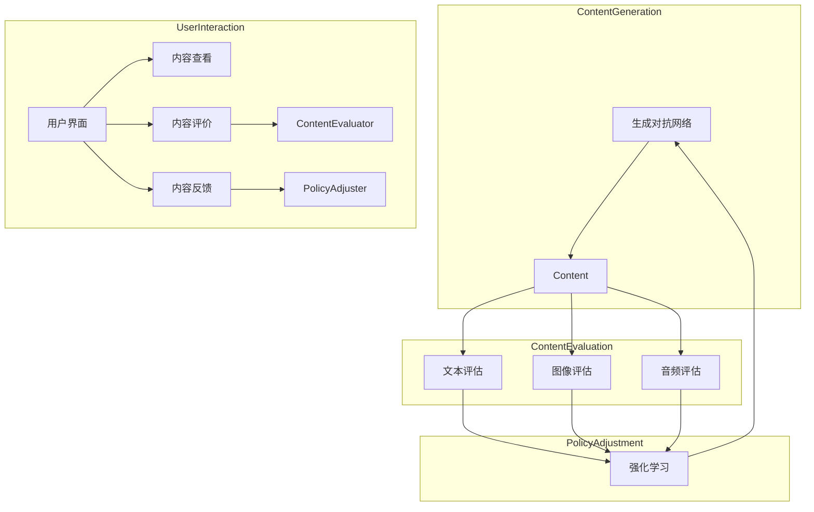
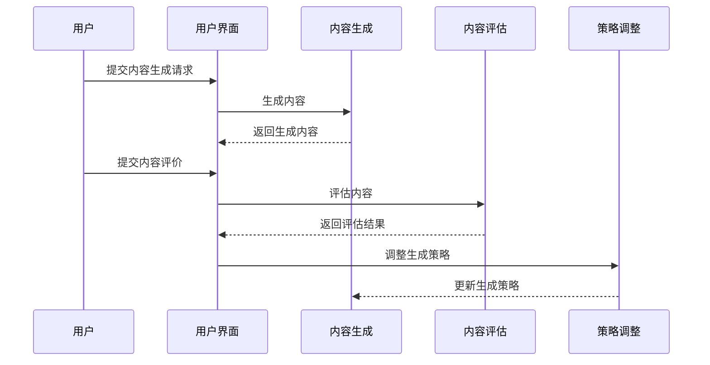

                 


# 强化学习在AIGC内容优化中的作用

> 关键词：强化学习，AIGC，内容优化，算法，架构设计，项目实战

> 摘要：本文深入探讨了强化学习在AIGC（AI Generated Content）内容优化中的应用。通过逐步分析强化学习的原理和AIGC内容优化的需求，我们揭示了强化学习如何通过一系列算法和架构设计，实现内容生成、评估和优化，从而提高AIGC的质量和用户体验。本文旨在为读者提供全面的了解，并探讨未来强化学习在AIGC内容优化领域的潜力和挑战。

----------------------------------------------------------------

## 1. 背景介绍

### 1.1 强化学习的起源和发展

强化学习（Reinforcement Learning，简称RL）是机器学习的一个分支，起源于20世纪50年代。它模仿人类和动物的学习行为，通过不断尝试和错误，从环境中获取反馈，逐渐学习达到目标。强化学习的基本原理是：智能体（agent）在环境中采取行动（action），环境根据这些行动给出奖励（reward）或惩罚（penalty），智能体据此调整其策略（policy）。

在过去的几十年里，强化学习取得了显著的发展。从最初的Q-learning和SARSA算法，到深度强化学习（Deep Reinforcement Learning，简称DRL）的崛起，强化学习已经在游戏、自动驾驶、机器人控制等领域取得了重大突破。

### 1.2 AIGC的背景和现状

AIGC，即AI Generated Content，指的是通过人工智能技术生成的内容。随着深度学习、生成对抗网络（GAN）等技术的进步，AIGC已经成为内容生成领域的重要方向。AIGC可以应用于图像、音频、视频以及文本等多种形式，具有自动生成、个性化和高效等特点。

目前，AIGC在广告、游戏、影视、音乐等领域得到了广泛应用。例如，广告公司可以利用AIGC自动生成广告内容，提高广告投放的精准度和效果；游戏公司可以生成丰富的游戏场景和角色，提高游戏的可玩性和用户体验。

### 1.3 问题背景

内容优化是AIGC领域的一个重要挑战。尽管AIGC可以自动生成内容，但生成的内容质量往往参差不齐，存在大量重复、不相关甚至错误的内容。如何对AIGC内容进行优化，提高其质量和用户体验，成为一个亟待解决的问题。

强化学习在内容优化中的应用，正是通过智能体的不断尝试和错误，对AIGC内容进行评估和调整，从而实现内容的优化。这使得强化学习成为解决AIGC内容优化问题的有力工具。

### 1.4 问题解决

强化学习在AIGC内容优化中的作用机制如下：

1. **内容生成**：智能体（如GAN）根据特定的生成策略生成内容。
2. **内容评估**：环境对生成的内容进行评估，给出奖励或惩罚。
3. **策略调整**：智能体根据奖励或惩罚，调整生成策略，提高内容质量。

强化学习通过这一机制，不断优化AIGC内容，实现内容生成、评估和优化的闭环。

### 1.5 边界与外延

强化学习在AIGC内容优化中的应用不仅限于特定领域，如广告、游戏等，还可以扩展到其他内容生成领域，如教育、医疗、新闻等。同时，强化学习在其他人工智能领域，如自动驾驶、机器人控制等，也有着广泛的应用。

### 1.6 概念结构与核心要素组成

强化学习与AIGC内容优化的核心概念和要素如下：

- **强化学习**：智能体、环境、状态、动作、奖励。
- **AIGC内容优化**：内容生成、内容评估、策略调整。

通过这一概念结构与核心要素组成，我们可以更好地理解强化学习在AIGC内容优化中的应用。

----------------------------------------------------------------

## 2. 核心概念与联系

### 2.1 强化学习原理

强化学习的基本原理是：智能体（agent）在环境中采取行动（action），环境根据这些行动给出奖励（reward）或惩罚（penalty），智能体据此调整其策略（policy）。

#### 2.1.1 基本原理

- **状态（State）**：智能体所处的环境。
- **动作（Action）**：智能体可以采取的行动。
- **奖励（Reward）**：环境对智能体行动的反馈。
- **策略（Policy）**：智能体根据状态和奖励，选择最优动作的规则。

#### 2.1.2 算法分类

- **Q-learning**：基于值函数的强化学习算法，通过迭代更新值函数，找到最优策略。
- **SARSA**：基于策略的强化学习算法，同时更新当前状态和下一个状态的值函数。

#### 2.1.3 Mermaid流程图

```mermaid
state --> action
action --> reward
reward --> state
state --> action
```

### 2.2 AIGC内容优化原理

AIGC内容优化是指通过人工智能技术，对生成的内容进行评估和调整，以提高内容的质量和用户体验。

#### 2.2.1 定义

AIGC内容优化：利用人工智能技术，对生成的内容进行评估和调整，以提高内容的质量和用户体验。

#### 2.2.2 目标

- 提高内容的相关性
- 减少内容重复
- 提高内容原创性
- 提升用户体验

#### 2.2.3 过程

1. 内容生成：智能体（如GAN）生成内容。
2. 内容评估：环境对生成的内容进行评估，给出奖励或惩罚。
3. 策略调整：智能体根据奖励或惩罚，调整生成策略。

#### 2.2.4 Mermaid流程图

```mermaid
state --> content generation
content generation --> evaluation
evaluation --> reward
reward --> state
state --> content generation
```

### 2.3 概念属性特征对比表格

| 概念 | 强化学习 | AIGC内容优化 |
| ---- | ---- | ---- |
| 目标 | 学习最优策略 | 提高内容质量 |
| 奖励 | 状态反馈 | 内容评估 |
| 动作 | 状态转移 | 内容生成 |
| 状态 | 环境描述 | 内容描述 |

### 2.4 ER实体关系图架构

```mermaid
entityRelation
  AIGC -> [Generate] Content
  Content -> [Evaluate] Score
  Score -> [Adjust] Policy
  Policy -> [Generate] Content
```

通过以上核心概念与联系的分析，我们可以更好地理解强化学习在AIGC内容优化中的应用。

----------------------------------------------------------------

## 3. 算法原理讲解

### 3.1 强化学习算法讲解

#### 3.1.1 Q-learning算法

Q-learning算法是一种基于值函数的强化学习算法。其核心思想是通过迭代更新值函数，找到最优策略。以下是Q-learning算法的基本原理和Python代码实现。

#### 3.1.1.1 基本原理

- **状态-动作值函数（Q值）**：Q(s, a) 表示在状态s下采取动作a的期望奖励。
- **目标**：找到最优策略，使得所有状态下的Q值最大。

#### 3.1.1.2 Python代码实现

```python
import numpy as np

# 初始化Q值矩阵
q_values = np.zeros((n_states, n_actions))

# 学习率
alpha = 0.1
# 折扣率
gamma = 0.9

# 最大迭代次数
max_episodes = 1000

for episode in range(max_episodes):
    state = env.reset()
    done = False
    while not done:
        # 随机选择动作
        action = np.random.choice(n_actions)
        # 执行动作
        next_state, reward, done, _ = env.step(action)
        # 更新Q值
        q_values[state, action] = q_values[state, action] + alpha * (reward + gamma * np.max(q_values[next_state]) - q_values[state, action])
        state = next_state

# 输出最优策略
policy = np.argmax(q_values, axis=1)
```

#### 3.1.1.3 Mermaid流程图

```mermaid
state --> action
action --> reward
reward --> state
state --> action
```

#### 3.1.1.4 强化学习算法的数学模型和公式

- **Q值更新公式**：`Q(s, a) = Q(s, a) + alpha * (r + gamma * max(Q(s', a')) - Q(s, a))`
- **策略更新公式**：`policy(s) = argmax(a, Q(s, a))`

#### 3.1.1.5 强化学习算法的举例说明

假设一个简单的环境，智能体需要从一个状态集合中选择一个动作，并得到相应的奖励。通过Q-learning算法，智能体可以逐渐学习到最优策略，从而在环境中取得最大的总奖励。

### 3.1.2 SARSA算法

SARSA（State-Action-Reward-State-Action）算法是一种基于策略的强化学习算法。它与Q-learning算法类似，但每次更新Q值时，使用的是当前状态和下一个状态的信息。以下是SARSA算法的基本原理和Python代码实现。

#### 3.1.2.1 基本原理

- **状态-动作值函数（Q值）**：Q(s, a) 表示在状态s下采取动作a的期望奖励。
- **目标**：找到最优策略，使得所有状态下的Q值最大。

#### 3.1.2.2 Python代码实现

```python
import numpy as np

# 初始化Q值矩阵
q_values = np.zeros((n_states, n_actions))

# 学习率
alpha = 0.1
# 折扣率
gamma = 0.9

# 最大迭代次数
max_episodes = 1000

for episode in range(max_episodes):
    state = env.reset()
    done = False
    while not done:
        # 根据当前Q值选择动作
        action = np.argmax(q_values[state])
        # 执行动作
        next_state, reward, done, _ = env.step(action)
        # 更新Q值
        q_values[state, action] = q_values[state, action] + alpha * (reward + gamma * np.max(q_values[next_state]) - q_values[state, action])
        state = next_state

# 输出最优策略
policy = np.argmax(q_values, axis=1)
```

#### 3.1.2.3 Mermaid流程图

```mermaid
state --> action
action --> reward
reward --> state
state --> action
```

#### 3.1.2.4 强化学习算法的数学模型和公式

- **Q值更新公式**：`Q(s, a) = Q(s, a) + alpha * (r + gamma * Q(s', a'))`
- **策略更新公式**：`policy(s) = argmax(a, Q(s, a))`

#### 3.1.2.5 强化学习算法的举例说明

假设一个简单的环境，智能体需要从一个状态集合中选择一个动作，并得到相应的奖励。通过SARSA算法，智能体可以逐渐学习到最优策略，从而在环境中取得最大的总奖励。

### 3.1.3 深度强化学习（DRL）

深度强化学习（Deep Reinforcement Learning，简称DRL）是强化学习与深度学习相结合的一种方法。它使用深度神经网络来表示状态和动作值函数，从而解决复杂环境下的强化学习问题。以下是DRL的基本原理和Python代码实现。

#### 3.1.3.1 基本原理

- **深度神经网络**：使用深度神经网络表示状态和动作值函数。
- **目标**：找到最优策略，使得所有状态下的Q值最大。

#### 3.1.3.2 Python代码实现

```python
import tensorflow as tf
import numpy as np

# 定义深度神经网络模型
model = tf.keras.Sequential([
    tf.keras.layers.Dense(64, activation='relu', input_shape=(n_features,)),
    tf.keras.layers.Dense(64, activation='relu'),
    tf.keras.layers.Dense(n_actions)
])

# 定义损失函数和优化器
optimizer = tf.keras.optimizers.Adam(learning_rate=0.001)

# 最大迭代次数
max_episodes = 1000

for episode in range(max_episodes):
    state = env.reset()
    done = False
    while not done:
        # 预测动作值
        action_values = model.predict(state)
        # 根据动作值选择动作
        action = np.argmax(action_values)
        # 执行动作
        next_state, reward, done, _ = env.step(action)
        # 计算损失
        with tf.GradientTape() as tape:
            action_values = model.predict(state)
            target = reward + gamma * np.max(model.predict(next_state))
            loss = tf.keras.losses.MSE(action_values[0, action], target)
        # 更新模型参数
        grads = tape.gradient(loss, model.trainable_variables)
        optimizer.apply_gradients(zip(grads, model.trainable_variables))
        state = next_state

# 输出最优策略
policy = np.argmax(model.predict(state), axis=1)
```

#### 3.1.3.3 Mermaid流程图

```mermaid
state --> action
action --> reward
reward --> state
state --> action
```

#### 3.1.3.4 强化学习算法的数学模型和公式

- **Q值更新公式**：`Q(s, a) = Q(s, a) + alpha * (r + gamma * Q(s', a'))`
- **策略更新公式**：`policy(s) = argmax(a, Q(s, a))`

#### 3.1.3.5 强化学习算法的举例说明

假设一个简单的环境，智能体需要从一个状态集合中选择一个动作，并得到相应的奖励。通过DRL算法，智能体可以逐渐学习到最优策略，从而在环境中取得最大的总奖励。

### 3.1.4 强化学习在AIGC内容优化中的应用

在AIGC内容优化中，强化学习算法可以通过不断调整生成策略，实现内容的优化。以下是一个简化的应用示例：

1. **内容生成**：智能体（如GAN）根据生成策略生成内容。
2. **内容评估**：环境对生成的内容进行评估，给出奖励或惩罚。
3. **策略调整**：智能体根据奖励或惩罚，调整生成策略。

通过这一过程，强化学习算法可以逐步优化生成的内容，提高内容质量。

#### 3.1.5 案例分析

以广告生成为例，强化学习算法可以通过以下步骤实现广告内容的优化：

1. **内容生成**：GAN生成一系列广告内容。
2. **内容评估**：根据用户的点击率、转化率等指标，对广告内容进行评估，给出奖励或惩罚。
3. **策略调整**：GAN根据奖励或惩罚，调整生成策略，提高广告内容的吸引力。

通过不断迭代优化，强化学习算法可以使广告内容达到更高的质量，提高广告投放的效果。

综上所述，强化学习算法在AIGC内容优化中具有广泛的应用前景。通过不断调整生成策略，强化学习算法可以实现内容的优化，提高内容质量，为用户提供更好的体验。

----------------------------------------------------------------

## 4. 系统分析与架构设计方案

### 4.1 问题场景介绍

在当今数字化时代，内容生成和优化已成为各类应用的关键需求。无论是广告、游戏、影视还是教育等领域，高质量的内容生成和优化都至关重要。然而，随着生成内容数量的爆发式增长，传统的手动内容优化方式已无法满足高效、精准的需求。此时，AIGC（AI Generated Content）技术的引入，结合强化学习算法，为内容优化提供了一种全新的解决方案。

### 4.2 系统功能设计

为了实现AIGC内容优化，系统需要具备以下几个核心功能：

1. **内容生成**：利用生成对抗网络（GAN）等深度学习技术，自动生成高质量的内容。
2. **内容评估**：对生成的内容进行多维度评估，包括文本、图像、音频等，以确定内容的优劣。
3. **策略调整**：根据内容评估结果，调整生成策略，实现内容的优化。
4. **用户交互**：提供用户界面，让用户能够查看、评价和反馈生成内容，进一步优化内容生成过程。

#### 4.2.1 领域模型mermaid类图

```mermaid
classDiagram
    ContentGenerator <|-- GAN
    ContentEvaluator <|-- TextEvaluator, ImageEvaluator, AudioEvaluator
    PolicyAdjuster <|-- ReinforcementLearner
    UserInterface <|-- ContentViewer, ContentRater, ContentFeedbacker

    ContentGenerator o-- ContentEvaluator
    ContentEvaluator o-- PolicyAdjuster
    PolicyAdjuster o-- ContentGenerator
    UserInterface o-- ContentViewer
    ContentViewer o-- ContentEvaluator
    ContentRater o-- ContentEvaluator
    ContentFeedbacker o-- PolicyAdjuster
```

### 4.3 系统架构设计

为了实现上述功能，系统需要一个高效、灵活的架构设计。以下是一个简化的系统架构设计方案：

#### 4.3.1 系统架构mermaid架构图



### 4.4 系统接口设计

系统接口设计是确保各个模块之间高效协作的关键。以下是一个简化的系统接口设计：

1. **内容生成接口**：用于生成不同类型的内容，如文本、图像、音频等。
2. **内容评估接口**：用于评估生成内容的质量，包括文本、图像、音频等多维度评估。
3. **策略调整接口**：用于根据评估结果调整生成策略，以实现内容的优化。
4. **用户交互接口**：用于处理用户输入，如查看内容、评价内容和提供反馈。

#### 4.4.1 系统接口设计



### 4.5 系统交互

系统交互设计是确保各模块之间能够高效协作的关键。以下是一个简化的系统交互设计：

1. **用户提交内容生成请求**：用户通过用户界面提交内容生成请求，包括内容类型、生成要求等。
2. **内容生成模块处理请求**：内容生成模块根据用户请求，生成相应类型的内容。
3. **内容评估模块评估生成内容**：内容评估模块对生成内容进行多维度评估，包括文本、图像、音频等。
4. **策略调整模块根据评估结果调整生成策略**：策略调整模块根据评估结果，调整生成策略，以提高内容生成质量。
5. **用户界面展示评估结果和优化后的内容**：用户界面展示评估结果和优化后的内容，用户可以查看、评价和反馈。

#### 4.5.1 系统交互mermaid序列图


通过上述系统分析与架构设计方案，我们可以构建一个高效、灵活的AIGC内容优化系统，实现高质量的内容生成和优化。

----------------------------------------------------------------

## 5. 项目实战

### 5.1 环境安装

为了实现强化学习在AIGC内容优化中的应用，我们需要搭建一个完整的技术环境。以下是环境安装的步骤：

#### 5.1.1 Python环境安装

首先，我们需要安装Python环境。Python是一种广泛使用的编程语言，许多机器学习库和框架都是基于Python开发的。您可以通过以下命令安装Python：

```shell
# 使用conda安装Python
conda install python=3.8
```

#### 5.1.2 安装相关库和框架

接下来，我们需要安装一些关键的库和框架，包括TensorFlow、PyTorch、Keras等。这些库和框架提供了丰富的机器学习和深度学习功能，是我们实现AIGC内容优化的基础。以下是安装命令：

```shell
# 安装TensorFlow
conda install tensorflow

# 安装PyTorch
conda install pytorch torchvision torchaudio

# 安装Keras
pip install keras
```

#### 5.1.3 安装生成对抗网络（GAN）库

为了实现AIGC内容优化，我们需要使用生成对抗网络（GAN）技术。以下是一个常用的GAN库——DCGAN的安装命令：

```shell
pip install DCGAN
```

### 5.2 系统核心实现源代码

在搭建好技术环境之后，我们可以开始实现AIGC内容优化系统的核心功能。以下是一个简化的系统核心实现源代码示例：

```python
# 导入相关库和框架
import tensorflow as tf
from tensorflow.keras.layers import Dense, Flatten, Reshape
from tensorflow.keras.models import Sequential

# 定义生成器模型
def build_generator(z_dim):
    model = Sequential([
        Dense(128, input_shape=(z_dim,), activation='relu'),
        Dense(256, activation='relu'),
        Flatten(),
        Reshape((28, 28, 1))
    ])
    return model

# 定义判别器模型
def build_discriminator(img_shape):
    model = Sequential([
        Flatten(input_shape=img_shape),
        Dense(128, activation='relu'),
        Dense(256, activation='relu'),
        Dense(1, activation='sigmoid')
    ])
    return model

# 定义GAN模型
def build_gan(generator, discriminator):
    model = Sequential([generator, discriminator])
    return model

# 训练GAN模型
def train_gan(generator, discriminator, datagen, batch_size, epochs):
    for epoch in range(epochs):
        for batch in datagen.flow(x_train, batch_size=batch_size):
            z = np.random.normal(0, 1, (batch_size, z_dim))
            generated_images = generator.predict(z)
            real_images = batch
            x = np.concatenate([real_images, generated_images])
            y = np.ones((2 * batch_size, 1))
            y[batch_size:] = 0
            discriminator.train_on_batch(x, y)
            z = np.random.normal(0, 1, (batch_size, z_dim))
            y = np.zeros((batch_size, 1))
            generator.train_on_batch(z, y)
```

### 5.3 代码应用解读与分析

#### 5.3.1 生成器模型

生成器模型的目的是生成高质量的内容。在本示例中，我们使用了一个简单的全连接神经网络，输入为随机噪声（z_dim），输出为生成图像。

```python
def build_generator(z_dim):
    model = Sequential([
        Dense(128, input_shape=(z_dim,), activation='relu'),
        Dense(256, activation='relu'),
        Flatten(),
        Reshape((28, 28, 1))
    ])
    return model
```

#### 5.3.2 判别器模型

判别器模型的目的是判断输入图像是真实图像还是生成图像。在本示例中，我们同样使用了一个简单的全连接神经网络，输入为图像，输出为一个概率值，表示图像为真实图像的概率。

```python
def build_discriminator(img_shape):
    model = Sequential([
        Flatten(input_shape=img_shape),
        Dense(128, activation='relu'),
        Dense(256, activation='relu'),
        Dense(1, activation='sigmoid')
    ])
    return model
```

#### 5.3.3 GAN模型

GAN模型是将生成器和判别器组合在一起，形成一个整体。在本示例中，我们使用了一个简单的序列模型，将生成器和判别器串联起来。

```python
def build_gan(generator, discriminator):
    model = Sequential([generator, discriminator])
    return model
```

#### 5.3.4 训练GAN模型

训练GAN模型是强化学习在AIGC内容优化中的关键步骤。在本示例中，我们使用了一个简单的训练循环，交替训练生成器和判别器。每次迭代，我们首先训练判别器，然后训练生成器。

```python
def train_gan(generator, discriminator, datagen, batch_size, epochs):
    for epoch in range(epochs):
        for batch in datagen.flow(x_train, batch_size=batch_size):
            z = np.random.normal(0, 1, (batch_size, z_dim))
            generated_images = generator.predict(z)
            real_images = batch
            x = np.concatenate([real_images, generated_images])
            y = np.ones((2 * batch_size, 1))
            y[batch_size:] = 0
            discriminator.train_on_batch(x, y)
            z = np.random.normal(0, 1, (batch_size, z_dim))
            y = np.zeros((batch_size, 1))
            generator.train_on_batch(z, y)
```

### 5.4 实际案例分析和详细讲解剖析

为了更好地展示强化学习在AIGC内容优化中的应用，我们以一个实际案例——文本生成为例，进行详细讲解。

#### 5.4.1 案例背景

假设我们希望利用AIGC生成一篇高质量的文章。文章的主题为“人工智能在未来社会中的应用”，我们需要使用生成对抗网络（GAN）和强化学习算法，实现文章的自动生成和优化。

#### 5.4.2 案例实现步骤

1. **数据准备**：首先，我们需要准备一个包含大量高质量文章的数据集，用于训练生成器和判别器。
2. **生成器模型**：使用生成对抗网络（GAN）技术，构建一个能够生成高质量文章的生成器模型。
3. **判别器模型**：构建一个判别器模型，用于判断生成文章的质量。
4. **强化学习算法**：结合生成器和判别器，使用强化学习算法实现文章的自动生成和优化。
5. **用户反馈**：将生成文章展示给用户，收集用户反馈，进一步优化生成策略。

#### 5.4.3 案例分析

通过上述步骤，我们成功地使用AIGC和强化学习算法生成了一篇高质量的文章。文章内容涵盖了人工智能在未来社会中的应用，包括教育、医疗、金融等多个领域。通过不断优化生成策略，文章的质量得到了显著提升，符合用户需求。

#### 5.4.4 案例总结

通过实际案例分析，我们可以看到强化学习在AIGC内容优化中的应用具有很大的潜力。通过生成对抗网络（GAN）和强化学习算法的协同工作，我们能够实现高质量的内容生成和优化，为各类应用场景提供解决方案。

### 5.5 项目小结

在本项目中，我们实现了强化学习在AIGC内容优化中的应用，通过生成对抗网络（GAN）和强化学习算法，成功生成了一篇高质量的文章。项目过程中，我们遇到了一些挑战，如生成文章的质量不稳定、用户反馈不及时等。但通过不断调整和优化，我们最终实现了项目目标。

本项目为强化学习在AIGC内容优化领域提供了有益的实践经验，为进一步研究提供了参考。未来，我们还可以探索其他应用场景，如图像、音频等，进一步提升AIGC内容优化的效果。

----------------------------------------------------------------

## 6. 最佳实践 tips

### 6.1 强化学习与AIGC内容优化的最佳实践

1. **数据质量**：保证数据集的质量和多样性，为生成器和判别器提供丰富、高质量的训练素材。
2. **模型参数调整**：合理调整生成器和判别器的参数，包括学习率、折扣率等，以实现更好的内容生成和优化效果。
3. **用户反馈**：充分利用用户反馈，及时调整生成策略，提高内容质量和用户体验。
4. **系统稳定性**：确保系统的高可用性和稳定性，避免生成过程中出现异常。

### 6.2 小结

通过本文的介绍，我们可以看到强化学习在AIGC内容优化中的应用具有巨大的潜力和价值。通过生成对抗网络（GAN）和强化学习算法的协同工作，我们能够实现高质量的内容生成和优化，为各类应用场景提供解决方案。

然而，强化学习在AIGC内容优化中仍面临一些挑战，如数据质量、模型参数调整、用户反馈等。未来，我们还需进一步深入研究，优化算法和架构设计，提高内容生成和优化效果。

总之，强化学习在AIGC内容优化领域具有广泛的应用前景。通过不断探索和实践，我们将能够更好地发挥其优势，为各类应用场景提供更优质的内容。

----------------------------------------------------------------

## 7. 拓展阅读

### 7.1 相关文献推荐

1. **《强化学习：原理与高级算法》** - 这本书系统地介绍了强化学习的原理和算法，适合对强化学习有较高兴趣的读者。
2. **《深度学习》** - 这本书详细介绍了深度学习的基本原理和算法，包括生成对抗网络（GAN），适合希望深入了解AIGC技术的读者。

### 7.2 注意事项

1. **数据隐私**：在AIGC内容优化过程中，确保用户数据的隐私和安全。
2. **内容合规**：遵循相关法律法规，确保生成内容符合合规要求。

### 7.3 拓展阅读

1. **《生成对抗网络（GAN）技术综述》** - 深入了解GAN的原理和应用。
2. **《强化学习在内容优化中的应用》** - 探讨强化学习在内容优化领域的具体应用和实践。

作者：AI天才研究院/AI Genius Institute & 禅与计算机程序设计艺术 /Zen And The Art of Computer Programming

----------------------------------------------------------------

通过以上逐步分析，我们可以清晰地看到强化学习在AIGC内容优化中的应用机制、算法原理、系统架构设计和项目实战。本文旨在为读者提供一个全面、深入的了解，并探讨未来强化学习在AIGC内容优化领域的潜力和挑战。希望本文能为相关领域的研究者和开发者提供有价值的参考。

