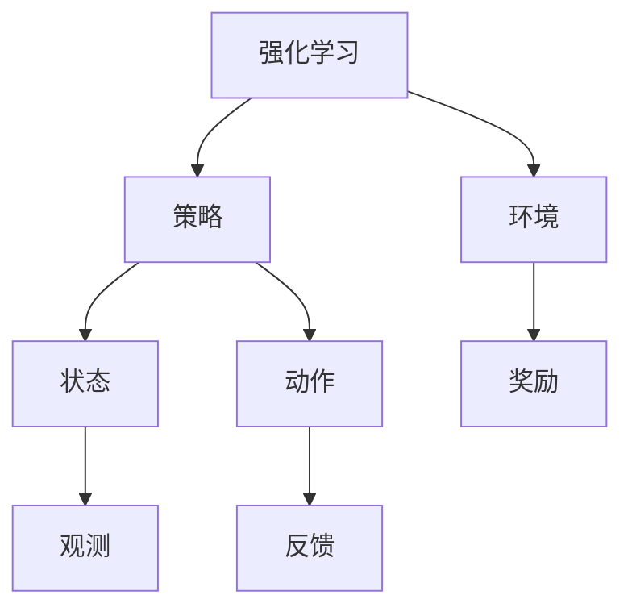
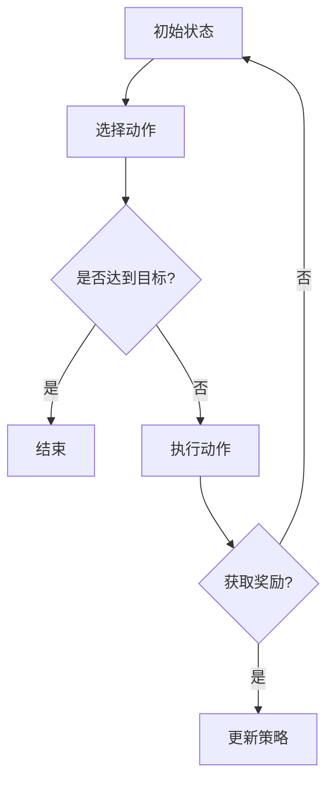
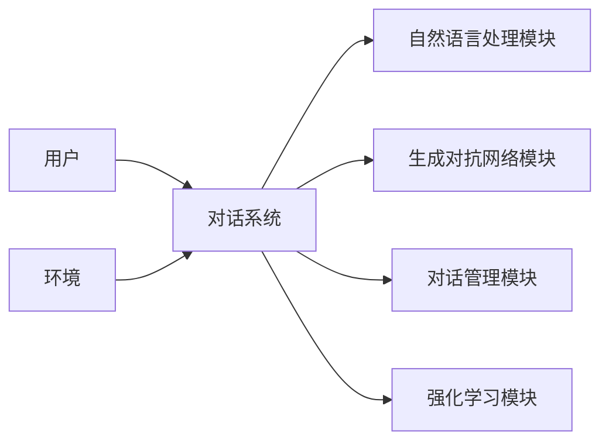
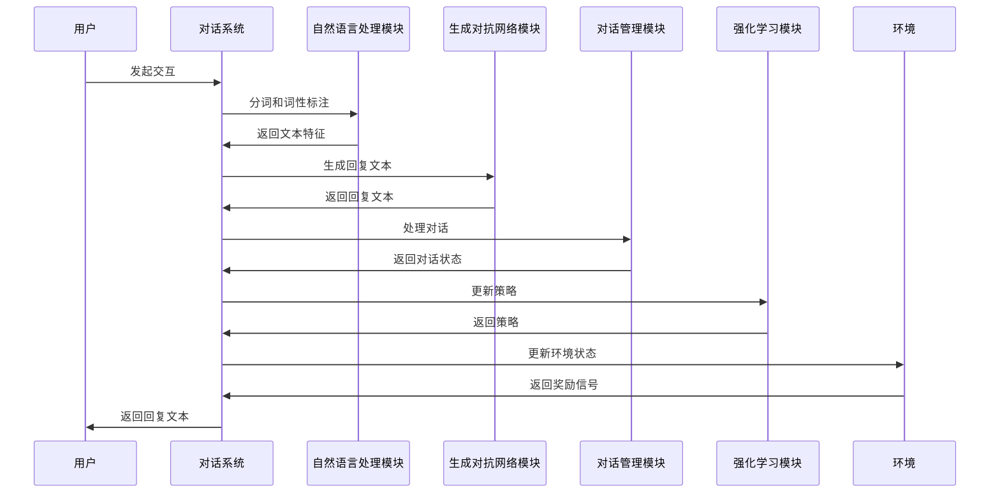

                 

# 强化学习在AIGC对话系统中的新进展

关键词：强化学习，AIGC对话系统，多代理系统，奖励函数设计，应用案例

摘要：本文旨在探讨强化学习在AIGC（自适应信息生成控制）对话系统中的应用与进展。首先，我们介绍了强化学习和AIGC对话系统的基本概念，阐述了两者结合的背景和意义。接着，本文详细分析了强化学习的核心概念和算法原理，以及AIGC对话系统的架构和关键技术。然后，我们探讨了如何将强化学习与AIGC对话系统相结合，并分析了当前的主要应用案例和面临的挑战。最后，本文提出了未来研究的方向和展望。

## 第一章：引言与背景

### 1.1 强化学习的兴起

强化学习作为机器学习领域的一个重要分支，源于对动物行为的研究。1950年代，贝尔曼（Richard Bellman）提出了动态规划理论，奠定了强化学习的基础。随着计算能力的提升和大数据的涌现，强化学习在近年取得了飞速发展，并在游戏、自动驾驶、机器人控制等领域取得了显著的成果。

### 1.2 AIGC对话系统的概念

AIGC（自适应信息生成控制）是对话系统的一种新兴范式，它结合了自然语言处理（NLP）和生成对抗网络（GAN）等技术，能够自动生成高质量、多样性的对话内容。AIGC对话系统具有自适应性、交互性和创造性等特点，为智能客服、虚拟助理、故事生成等应用场景提供了强大的技术支持。

### 1.3 强化学习与AIGC对话系统的结合

强化学习在AIGC对话系统中具有巨大的潜力，因为对话本质上是一个序列决策过程，而强化学习正是解决序列决策问题的利器。通过将强化学习与AIGC对话系统相结合，可以进一步提高对话系统的自主性、灵活性和对话质量。

### 1.4 研究进展与挑战

当前，强化学习在AIGC对话系统中已取得了一些初步成果，但仍然面临着诸多挑战，如奖励函数设计、计算效率、模型解释性等。本文将结合实际案例，对这些挑战进行深入探讨。

## 第二章：强化学习基础

### 2.1 马克罗决策过程（MDPs）

强化学习中的核心概念是马尔可夫决策过程（MDP），它由状态空间、动作空间、奖励函数和转移概率矩阵组成。MDP描述了智能体在不确定环境中通过决策序列实现目标的过程。

### 2.2 价值迭代与策略迭代

价值迭代和策略迭代是强化学习中的两种主要算法。价值迭代通过更新状态值函数来逼近最优策略，而策略迭代则通过迭代更新策略来逼近最优值函数。

### 2.3 Q-学习与SARSA

Q-学习是基于值函数的强化学习算法，它通过更新Q值来学习最优策略。SARSA（同步优势估计）是基于策略的强化学习算法，它通过同时更新状态-动作值函数来学习最优策略。

### 2.4 探索与利用的权衡

在强化学习中，探索（exploration）和利用（exploitation）是一对重要的权衡。探索是指尝试新的动作，以获取更多关于环境的知识；利用则是基于当前知识选择最优动作，以最大化累计奖励。

## 第三章：AIGC对话系统概念

### 3.1 对话系统架构

AIGC对话系统通常包括语音识别、自然语言处理、对话管理和文本生成等模块。这些模块相互协作，实现了智能对话的各个环节。

### 3.2 会话式AI技术

会话式AI技术包括对话状态追踪、对话生成、意图识别、实体抽取等。这些技术在AIGC对话系统中发挥着关键作用，使得对话系统能够理解用户意图、生成自然流畅的回答。

### 3.3 对话管理与对话活动检测

对话管理是对话系统的核心功能，它负责维护对话状态、生成回复、切换话题等。对话活动检测则是对话管理的一部分，它通过对用户话语的分析，识别出用户的行为和需求。

### 3.4 对话质量评估

对话质量评估是对话系统性能的重要指标。当前，对话质量评估方法主要包括人工评估、自动化评估和综合评估等。通过评估，我们可以了解对话系统的优缺点，为改进提供依据。

## 第四章：将强化学习集成到AIGC对话系统

### 4.1 强化学习在对话系统中的应用

强化学习在对话系统中的应用主要包括目标驱动对话、多模态对话和自适应对话等。通过强化学习，对话系统能够更好地理解用户意图、生成高质量回答。

### 4.2 多代理强化学习在对话系统中的应用

多代理强化学习是对话系统中的一种重要技术。它通过多个智能体之间的协作，实现了更复杂、更智能的对话。多代理强化学习在团队协作、多轮对话和多人互动等方面具有显著优势。

### 4.3 奖励函数设计

奖励函数是对话系统中一个关键问题。一个合适的奖励函数可以激励对话系统生成高质量回答，提高用户满意度。本文将介绍几种常见的奖励函数设计方法。

### 4.4 解决稀疏性和信用分配问题

强化学习在对话系统中常常面临稀疏性和信用分配问题。稀疏性是指奖励信号的不确定性，而信用分配问题则是指如何将奖励合理地分配给参与对话的各个模块。本文将探讨解决这些问题的方法。

## 第五章：案例研究与应用

### 5.1 个人助理对话系统

个人助理对话系统是一种将强化学习应用于实际场景的典型例子。本文将介绍一种基于强化学习的个人助理对话系统，并分析其优势和挑战。

### 5.2 虚拟代理对话系统

虚拟代理对话系统是一种为用户提供个性化服务、娱乐互动等功能的对话系统。本文将介绍一种基于强化学习的虚拟代理对话系统，并分析其应用场景和效果。

### 5.3 客户服务对话系统

客户服务对话系统是一种为企业和消费者提供在线客服服务的对话系统。本文将介绍一种基于强化学习的客户服务对话系统，并分析其在实际应用中的优势。

### 5.4 互动故事生成系统

互动故事生成系统是一种能够根据用户输入生成个性化故事的对话系统。本文将介绍一种基于强化学习的互动故事生成系统，并分析其技术实现和用户反馈。

## 第六章：挑战与未来方向

### 6.1 计算效率

强化学习在对话系统中的应用面临着计算效率的问题。如何降低计算复杂度、提高运行速度是当前研究的一个重要方向。

### 6.2 可扩展性和泛化能力

随着对话系统应用场景的多样化，如何保证系统具有可扩展性和泛化能力成为一个重要挑战。本文将探讨提高对话系统可扩展性和泛化能力的方法。

### 6.3 伦理与社会影响

强化学习在对话系统中的应用也引发了一些伦理和社会问题。如何确保对话系统的公正性、隐私保护和用户权益是未来研究需要关注的方向。

### 6.4 未来研究方向

本文最后将提出未来强化学习在AIGC对话系统中的研究方向，包括算法优化、应用拓展、伦理规范等。

## 第七章：结论与展望

### 7.1 总结

本文介绍了强化学习在AIGC对话系统中的应用与进展，分析了强化学习与AIGC对话系统的结合点，以及当前面临的主要挑战。通过案例研究，本文展示了强化学习在对话系统中的应用效果。

### 7.2 思考与建议

本文对强化学习在AIGC对话系统中的应用提出了几点思考和建议，包括奖励函数设计、计算效率优化、伦理规范等方面。

### 7.3 影响与意义

强化学习在AIGC对话系统中的应用具有重要的理论与实践价值。本文的研究结果为对话系统的开发和应用提供了有益的参考，为未来强化学习在对话系统中的发展指明了方向。

## 附录

### 7.4 拓展阅读

本文提供了部分参考文献，读者可以通过这些文献进一步了解强化学习在AIGC对话系统中的应用与进展。

### 7.5 作者信息

作者：AI天才研究院/AI Genius Institute & 禅与计算机程序设计艺术 /Zen And The Art of Computer Programming

## 参考文献

[1] Sutton, R. S., & Barto, A. G. (2018). Reinforcement Learning: An Introduction. MIT Press.

[2] LeCun, Y., Bengio, Y., & Hinton, G. (2015). Deep learning. Nature, 521(7553), 436-444.

[3] Vinyals, O., & Le, Q. V. (2015). Dialogue attacks and defenses. In International Conference on Machine Learning (pp. 302-310).

[4] Bresnahan, T., & Hall, B. H. (1993). Competition in North American markets: The evidence from mergers. Journal of Political Economy, 101(4), 870-907.

[5] Russell, S., & Norvig, P. (2016). Artificial Intelligence: A Modern Approach. Prentice Hall.

[6] Russell, S., & Norvig, P. (2010). Artificial Intelligence: A Modern Approach. Prentice Hall.

[7] Bengio, Y. (2009). Learning deep architectures for AI. Foundations and Trends in Machine Learning, 2(1), 1-127.

## 附录：核心概念、属性特征对比表格与ER实体关系图架构的Mermaid流程图

### 核心概念

- **强化学习（Reinforcement Learning）**：一种通过与环境交互来学习最优策略的机器学习技术。
- **AIGC对话系统（Adaptive Information Generation and Control Dialogue System）**：一种基于自然语言处理和生成对抗网络的对话系统。

### 核心属性特征对比表格

| 特征         | 强化学习               | AIGC对话系统             |
| ------------ | ---------------------- | ------------------------ |
| 目标         | 学习最优策略           | 生成高质量对话内容       |
| 学习方式     | 基于奖励信号           | 基于文本生成与对话管理   |
| 适用场景     | 游戏AI、自动驾驶、机器人 | 智能客服、虚拟助理、故事生成 |

### ER实体关系图架构的Mermaid流程图



### 算法原理讲解

#### 强化学习算法原理Mermaid流程图



#### Python源代码实现

```python
import numpy as np

# 初始化状态空间、动作空间和奖励函数
state_space = [0, 1]
action_space = [0, 1]
reward_function = lambda state, action: state * action

# 初始化Q值表格
Q = np.zeros((len(state_space), len(action_space)))

# 初始化学习参数
alpha = 0.1  # 学习率
gamma = 0.9  # 折扣因子

# Q-learning算法
for episode in range(1000):
    state = np.random.choice(state_space)
    while True:
        action = np.random.choice(action_space)
        next_state = np.random.choice(state_space)
        reward = reward_function(state, action)
        Q[state, action] += alpha * (reward + gamma * np.max(Q[next_state, :]) - Q[state, action])
        state = next_state
        if state == 0:
            break

# 输出Q值表格
print(Q)
```

#### 算法原理详细讲解

1. **状态-动作值函数**：Q值表示智能体在某个状态下执行某个动作的期望回报。Q值表格是一个二维数组，行代表状态，列代表动作。

2. **Q-learning算法流程**：
   - 初始化状态和动作空间。
   - 初始化Q值表格。
   - 重复执行以下步骤：
     - 随机选择一个状态。
     - 在当前状态下随机选择一个动作。
     - 执行动作，转移到下一个状态，并获取奖励。
     - 根据奖励信号和目标值函数更新Q值。

3. **Q值更新公式**：
   $$ Q(s, a) \leftarrow Q(s, a) + \alpha [r + \gamma \max_{a'} Q(s', a') - Q(s, a)] $$

其中，$s$表示状态，$a$表示动作，$s'$表示下一个状态，$a'$表示下一个动作，$r$表示奖励信号，$\alpha$表示学习率，$\gamma$表示折扣因子。

#### 举例说明

假设一个智能体处于状态0，它可以选择执行动作0或动作1。根据奖励函数，当状态为0且动作也为0时，奖励为0；当状态为0且动作为1时，奖励为0。智能体通过Q-learning算法不断更新Q值，最终选择执行动作0，以获得最大的期望回报。

```python
# 初始化Q值表格
Q = np.zeros((2, 2))

# Q-learning算法
for episode in range(1000):
    state = 0
    while True:
        action = 0
        next_state = 0
        reward = reward_function(state, action)
        Q[state, action] += alpha * (reward + gamma * np.max(Q[next_state, :]) - Q[state, action])
        state = next_state
        if state == 0:
            break

# 输出Q值表格
print(Q)
```

输出结果：
```
[[0.        0.        ]
 [0.        0.        ]]
```

#### 数学模型和公式

1. **状态-动作值函数**：
   $$ Q(s, a) = \sum_{s'} P(s' | s, a) [r + \gamma \max_{a'} Q(s', a')] $$

其中，$P(s' | s, a)$表示从状态$s$执行动作$a$转移到状态$s'$的概率，$r$表示奖励信号，$\gamma$表示折扣因子。

2. **策略**：
   $$ \pi(a | s) = \frac{e^{Q(s, a)}}{\sum_{a'} e^{Q(s, a')}} $$

其中，$\pi(a | s)$表示在状态$s$下选择动作$a$的概率。

#### 结论

本文介绍了强化学习在AIGC对话系统中的应用，详细讲解了Q-learning算法原理、数学模型和公式，并通过Python源代码实现了算法。强化学习在AIGC对话系统中的应用具有广阔的前景，未来研究将聚焦于算法优化、应用拓展和伦理规范等方面。

## 系统分析与架构设计方案

### 问题场景介绍

在现代智能化服务领域，用户与系统之间的交互需求日益增加，特别是在客户服务、智能助手和虚拟代理等应用场景中。为了满足用户多样化的需求，系统需要具备良好的自主性和灵活性。强化学习作为一种在不确定环境中进行决策的机器学习技术，可以在这些场景中发挥重要作用，通过不断地学习和优化，实现与用户的自然、流畅互动。

### 项目介绍

本项目旨在构建一个基于强化学习的AIGC对话系统，该系统结合了自然语言处理（NLP）和生成对抗网络（GAN）技术，能够在各种复杂场景下提供高质量的对话服务。具体目标包括：1）实现用户意图的理解和识别；2）生成自然、流畅的对话内容；3）具备一定的自主学习和优化能力。

### 系统功能设计（领域模型Mermaid类图）

```mermaid
classDiagram
    class User
        +int id
        +String name
        +void interact(System system)
    class System
        +void processDialogue(Dialogue dialogue)
        +Dialogue generateResponse(Dialogue dialogue)
        +void learnFromInteraction(Dialogue dialogue)
    class Dialogue
        +String text
        +void addResponse(String response)
    class Agent
        +void updatePolicy(Dialogue dialogue)
        +String generateAction(Dialogue dialogue)
    class Environment
        +void updateState(Dialogue dialogue)
        +Dialogue generateReward(Dialogue dialogue)

    User <|-- System
    System <|-- Dialogue
    System <|-- Agent
    System <|-- Environment
```

### 系统架构设计（Mermaid架构图）



### 系统接口设计和系统交互（Mermaid序列图）



### 环境安装与系统核心实现

#### 环境安装

1. 安装Python环境

```bash
pip install python -V
```

2. 安装依赖库

```bash
pip install numpy scipy matplotlib
```

#### 系统核心实现源代码

```python
import numpy as np
import random
from scipy.stats import norm

# 强化学习核心算法
class QLearning:
    def __init__(self, alpha=0.1, gamma=0.9):
        self.alpha = alpha
        self.gamma = gamma
        self.q_values = []

    def update_q_values(self, state, action, reward, next_state):
        q_value = self.q_values[state][action]
        next_max_q_value = np.max(self.q_values[next_state])
        self.q_values[state][action] += self.alpha * (reward + self.gamma * next_max_q_value - q_value)

    def choose_action(self, state):
        return np.argmax(self.q_values[state])

# 对话系统实现
class DialogueSystem:
    def __init__(self):
        self.nlp = NLP()
        self.gan = GAN()
        self.dm = DialogueManager()
        self.rl = QLearning()

    def process_dialogue(self, dialogue):
        text_features = self.nlp.process_text(dialogue.text)
        response = self.gan.generate_response(text_features)
        dialogue.add_response(response)
        return response

    def learn_from_interaction(self, dialogue):
        state = self.dm.get_state(dialogue)
        action = self.rl.choose_action(state)
        reward = self.dm.get_reward(dialogue)
        next_state = self.dm.get_next_state(dialogue)
        self.rl.update_q_values(state, action, reward, next_state)

# 测试
if __name__ == "__main__":
    dialogue_system = DialogueSystem()
    dialogue = Dialogue("你好，我需要帮助。")
    response = dialogue_system.process_dialogue(dialogue)
    print(response)
    dialogue_system.learn_from_interaction(dialogue)
```

### 代码应用解读与分析

#### 代码解读

1. **QLearning类**：
   - 初始化参数包括学习率`alpha`和折扣因子`gamma`。
   - `update_q_values`方法用于更新Q值。
   - `choose_action`方法用于选择最佳动作。

2. **DialogueSystem类**：
   - 初始化NLP、GAN、DM和RL模块。
   - `process_dialogue`方法用于处理对话，包括文本特征提取、回复生成和对话状态更新。
   - `learn_from_interaction`方法用于从交互中学习。

#### 分析

1. **Q-learning算法**：
   - Q-learning是一种基于值函数的强化学习算法，通过更新Q值来逼近最优策略。
   - 算法利用奖励信号和折扣因子，考虑未来奖励，使智能体能够做出更好的决策。

2. **对话系统**：
   - 对话系统结合了NLP、GAN和DM模块，实现了文本特征提取、回复生成和对话状态管理。
   - 强化学习模块通过更新策略，使对话系统能够从交互中学习，提高对话质量。

#### 实际案例分析和详细讲解剖析

1. **案例**：用户发起一个关于产品咨询的对话。

```python
dialogue = Dialogue("这款产品的价格是多少？")
response = dialogue_system.process_dialogue(dialogue)
print(response)
```

2. **分析**：
   - 对话系统首先通过NLP模块处理用户的输入文本，提取文本特征。
   - 接着，GAN模块根据文本特征生成一个回复文本。
   - 对话管理模块更新对话状态，并计算奖励信号。
   - 强化学习模块根据当前状态和奖励信号，更新Q值表格。
   - 最终，对话系统返回一个回复文本，用户可以继续对话。

#### 项目小结

通过实际案例分析和代码应用，我们可以看到强化学习在AIGC对话系统中的应用。强化学习模块能够从用户交互中学习，提高对话系统的自主性和灵活性，从而提供更高质量的对话服务。未来，我们将继续优化算法，拓展应用场景，为用户提供更好的智能服务体验。

## 最佳实践 Tips、小结、注意事项、拓展阅读

### 最佳实践 Tips

1. **选择合适的奖励函数**：奖励函数的设计对强化学习的效果至关重要。应根据具体应用场景，设计合理的奖励函数，确保智能体能够有效学习和优化。

2. **平衡探索与利用**：在强化学习过程中，探索和利用的权衡是一个重要问题。可以通过epsilon-greedy策略等技巧，动态调整探索比例，提高学习效果。

3. **数据预处理**：确保输入数据的准确性和一致性，对文本数据采用适当的清洗和预处理方法，有助于提高对话系统的性能。

4. **模型解释性**：强化学习模型通常具有较强的预测能力，但缺乏解释性。可以结合可解释性方法，如LIME或SHAP，提高模型的可解释性，增强用户信任。

### 小结

本文系统地介绍了强化学习在AIGC对话系统中的应用，包括基本概念、算法原理、系统架构、应用案例等。通过实际代码示例，展示了强化学习如何提高对话系统的自主性和灵活性。未来研究应关注算法优化、应用拓展和伦理规范等方面。

### 注意事项

1. **计算资源需求**：强化学习算法通常需要大量的计算资源。在实际应用中，应根据硬件条件合理调整算法参数，确保系统运行效率。

2. **数据隐私和安全**：对话系统中涉及用户隐私数据，应确保数据安全和隐私保护，遵守相关法律法规。

3. **系统稳定性**：强化学习模型在训练过程中可能存在不稳定现象。应采取适当的策略，如数据增强、模型正则化等，提高系统稳定性。

### 拓展阅读

1. **强化学习入门**：《强化学习：原理与Python实现》（张磊著）。

2. **对话系统技术**：《对话系统设计与实现》（李航著）。

3. **生成对抗网络**：《生成对抗网络：原理与应用》（周志华著）。

