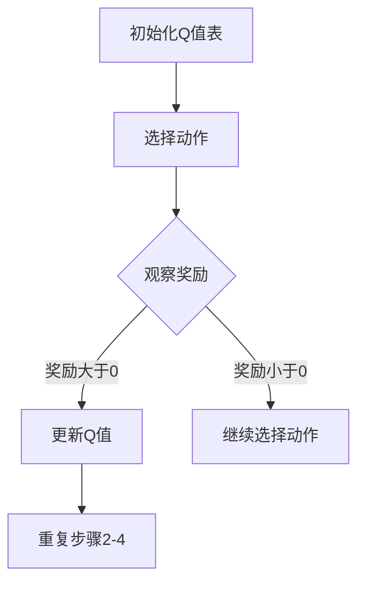
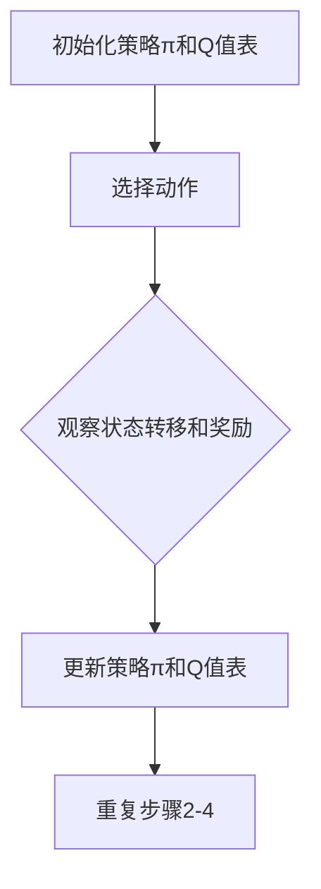
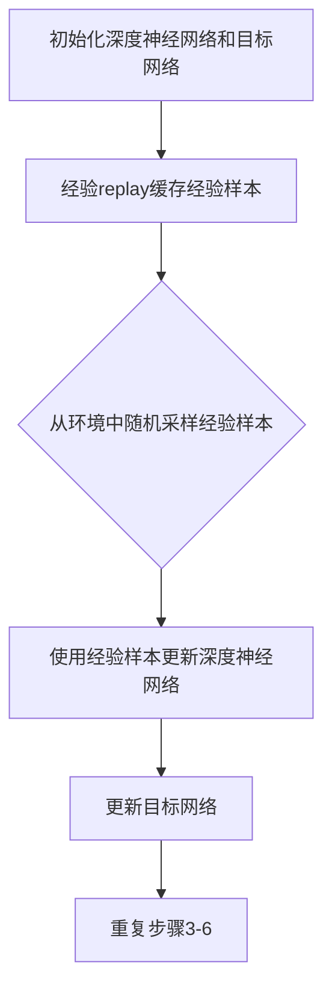
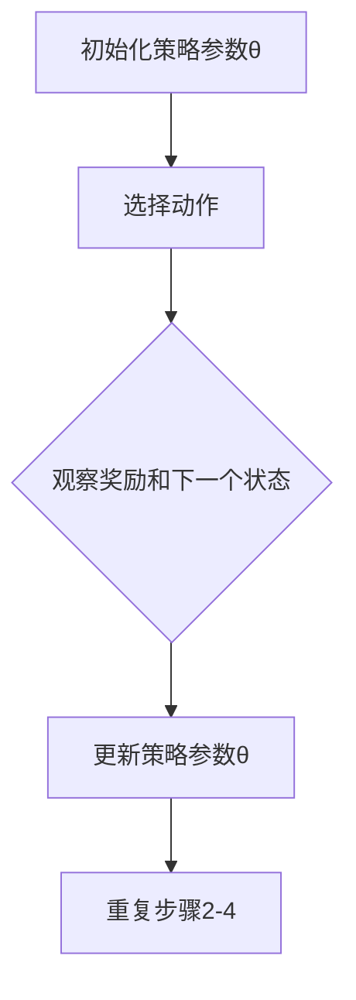
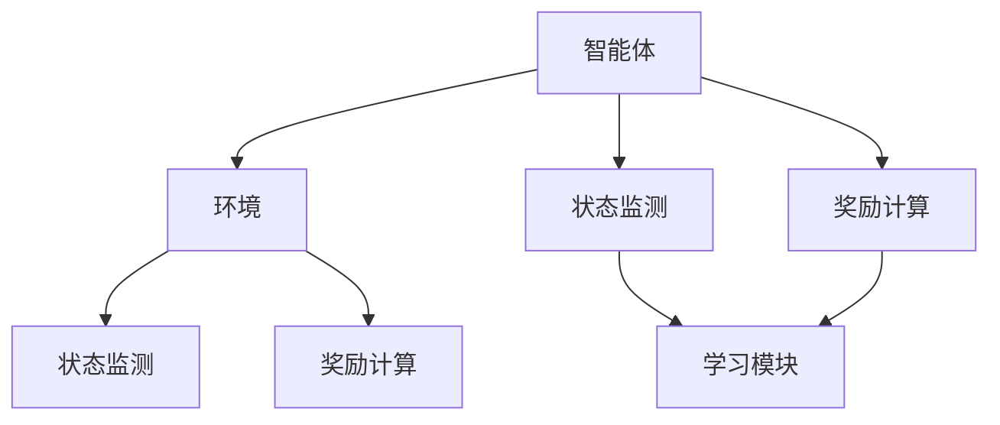
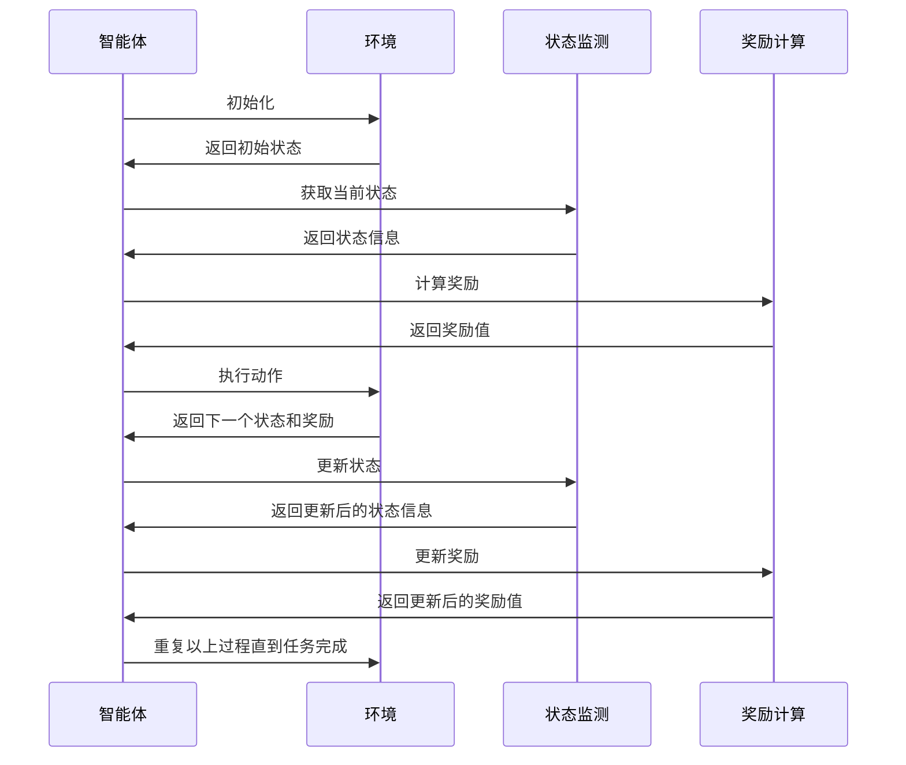

                 

### 强化学习：优化LLM应用的决策能力

**关键词：强化学习、自然语言处理、决策能力、LLM应用**

**摘要：**本文将深入探讨强化学习在优化大规模语言模型（LLM）应用决策能力方面的作用。首先，我们将简要介绍强化学习的基础概念、核心原理及其在机器学习中的定位。接着，我们将详细介绍几种常见的强化学习算法，包括Q-learning、SARSA、DQN和Policy Gradient，并分别讲解其原理、流程图、代码实现及数学模型。随后，本文将重点分析强化学习在LLM中的应用，如文本分类、机器翻译和对话系统，以及如何通过强化学习优化LLM参数、模型选择和应用场景。通过具体项目实战，我们将展示强化学习在LLM决策能力提升中的应用，并提出最佳实践和注意事项。最后，我们将展望强化学习在LLM领域的前沿技术发展趋势，并讨论其在人工智能领域的未来影响。

### 目录大纲

**强化学习：优化LLM应用的决策能力**

**关键词：强化学习、自然语言处理、决策能力、LLM应用**

**摘要：**本文将深入探讨强化学习在优化大规模语言模型（LLM）应用决策能力方面的作用。首先，我们将简要介绍强化学习的基础概念、核心原理及其在机器学习中的定位。接着，我们将详细介绍几种常见的强化学习算法，包括Q-learning、SARSA、DQN和Policy Gradient，并分别讲解其原理、流程图、代码实现及数学模型。随后，本文将重点分析强化学习在LLM中的应用，如文本分类、机器翻译和对话系统，以及如何通过强化学习优化LLM参数、模型选择和应用场景。通过具体项目实战，我们将展示强化学习在LLM决策能力提升中的应用，并提出最佳实践和注意事项。最后，我们将展望强化学习在LLM领域的前沿技术发展趋势，并讨论其在人工智能领域的未来影响。

**第一部分：强化学习基础**

## 第1章：强化学习概述

### 1.1 强化学习的基本概念

- **问题背景与概述**
- **问题描述与解决方案**
- **边界与外延**

### 1.2 强化学习的核心原理

- **强化学习的四个基本要素**
- **强化学习的奖励机制**
- **强化学习的策略评估与优化**

### 1.3 强化学习与机器学习的联系

- **强化学习与监督学习、无监督学习的区别**
- **强化学习在机器学习中的应用**

### 1.4 强化学习的优势与挑战

- **强化学习的优势**
- **强化学习的挑战**

### 1.5 本章小结

**第二部分：强化学习算法**

## 第2章：强化学习算法

### 2.1 Q-learning算法

- **Q-learning算法的基本原理**
- **Q-learning算法的mermaid流程图**
- **Q-learning算法的python源代码实现**
- **Q-learning算法的数学模型和公式**
- **Q-learning算法的详细讲解与举例说明**

### 2.2 SARSA算法

- **SARSA算法的基本原理**
- **SARSA算法的mermaid流程图**
- **SARSA算法的python源代码实现**
- **SARSA算法的数学模型和公式**
- **SARSA算法的详细讲解与举例说明**

### 2.3 Deep Q-Network（DQN）算法

- **DQN算法的基本原理**
- **DQN算法的mermaid流程图**
- **DQN算法的python源代码实现**
- **DQN算法的数学模型和公式**
- **DQN算法的详细讲解与举例说明**

### 2.4 Policy Gradient算法

- **Policy Gradient算法的基本原理**
- **Policy Gradient算法的mermaid流程图**
- **Policy Gradient算法的python源代码实现**
- **Policy Gradient算法的数学模型和公式**
- **Policy Gradient算法的详细讲解与举例说明**

### 2.5 本章小结

**第三部分：强化学习在LLM中的应用**

## 第3章：强化学习在LLM中的应用

### 3.1 强化学习在自然语言处理中的应用

- **强化学习在文本分类中的应用**
- **强化学习在机器翻译中的应用**
- **强化学习在对话系统中的应用**

### 3.2 强化学习在LLM优化中的应用

- **强化学习在LLM参数调优中的应用**
- **强化学习在LLM模型选择中的应用**
- **强化学习在LLM应用场景优化中的应用**

### 3.3 强化学习在LLM决策能力提升中的应用

- **强化学习在LLM决策过程中的作用**
- **强化学习在LLM应用中的案例**
- **强化学习在LLM应用中的挑战与展望**

### 3.4 本章小结

**第四部分：强化学习实践**

## 第4章：强化学习实践

### 4.1 强化学习环境搭建

- **强化学习环境介绍**
- **强化学习环境配置**
- **强化学习环境使用示例**

### 4.2 强化学习项目实战

- **项目介绍**
- **系统功能设计（领域模型mermaid类图）**
- **系统架构设计（mermaid架构图）**
- **系统接口设计**
- **系统交互（mermaid序列图）**

### 4.3 项目核心实现

- **系统核心实现源代码**
- **代码应用解读与分析**
- **实际案例分析与详细讲解剖析**

### 4.4 项目小结

**第五部分：强化学习最佳实践与注意事项**

## 第5章：强化学习最佳实践与注意事项

### 5.1 强化学习最佳实践

- **强化学习策略的选择**
- **强化学习参数的调优**
- **强化学习算法的优化**

### 5.2 注意事项

- **强化学习应用中的风险**
- **强化学习应用中的数据隐私保护**
- **强化学习应用中的法律法规遵守**

### 5.3 拓展阅读

**第六部分：强化学习前沿技术展望**

## 第6章：强化学习前沿技术展望

### 6.1 强化学习在LLM中的未来发展趋势

- **强化学习在LLM中的新应用场景**
- **强化学习在LLM中的新算法研究**
- **强化学习在LLM中的新挑战与机遇**

### 6.2 强化学习与其他技术的融合

- **强化学习与深度学习的融合**
- **强化学习与迁移学习的融合**
- **强化学习与联邦学习的融合**

### 6.3 强化学习在人工智能领域的未来影响

- **强化学习在人工智能领域的应用前景**
- **强化学习在人工智能领域的挑战与机遇**

### 6.4 本章小结

---

通过上述目录大纲，我们将逐步深入探讨强化学习在LLM应用决策能力优化方面的核心问题，从基础概念到实际应用，再到前沿技术展望，旨在为广大读者提供一份系统、全面、深入的技术指南。接下来，我们将首先介绍强化学习的基础概念和核心原理，帮助读者建立对这一领域的基本理解。**第一部分：强化学习基础**

## 第1章：强化学习概述

### 1.1 强化学习的基本概念

强化学习（Reinforcement Learning，简称RL）是机器学习的一个重要分支，旨在通过智能体与环境的交互来学习最优策略。它起源于心理学领域，最初用于模拟动物如何通过尝试和错误来学习行为。随着计算机技术的发展，强化学习逐渐成为人工智能领域的一个重要研究方向。

#### **问题背景与概述**

强化学习的基本问题可以描述为：一个智能体在一个不确定的环境中，通过不断选择行动来获取奖励，其目标是学习到一种策略，使得长期的累积奖励最大化。这种问题形式在许多实际应用场景中具有广泛的应用，如自动驾驶、游戏AI、机器人控制、推荐系统等。

#### **问题描述与解决方案**

在强化学习中，通常有以下几个关键要素：

1. **智能体（Agent）**：执行动作、学习策略的实体。
2. **环境（Environment）**：智能体执行动作的背景和条件。
3. **状态（State）**：环境在某一时刻的状态描述。
4. **动作（Action）**：智能体可执行的动作集合。
5. **奖励（Reward）**：智能体执行动作后环境给予的即时反馈。

强化学习问题的解决方案是学习一种策略（Policy），该策略指导智能体如何根据当前状态选择最优动作，以最大化累积奖励。常见的策略学习方式包括值函数方法、策略迭代和模型预测。

#### **边界与外延**

强化学习的研究边界包括如何解决连续状态和动作空间、如何处理高维特征、如何避免过拟合和探索与利用的平衡等问题。强化学习的外延则包括基于模型的强化学习、无模型强化学习、部分可观测强化学习等。

### 1.2 强化学习的核心原理

强化学习的核心原理包括四个基本要素：状态（State）、动作（Action）、奖励（Reward）和策略（Policy）。

#### **状态（State）**

状态是智能体对环境当前状态的描述，通常是一个多维向量。在强化学习中，状态表示智能体在某一时刻所面临的决策环境，是决策的基础。

#### **动作（Action）**

动作是智能体在某一状态下可执行的动作集合。动作的选择决定了智能体的行为，并影响到环境状态的变化。在强化学习中，动作通常是一个离散的集合，但在某些应用场景中，动作也可以是连续的。

#### **奖励（Reward）**

奖励是环境对智能体执行动作后给予的即时反馈。奖励通常是一个实数，用于评估智能体当前动作的好坏。累积的奖励决定了策略的好坏，即最大化累积奖励是强化学习的目标。

#### **策略（Policy）**

策略是智能体根据当前状态选择动作的规则。策略可以分为确定性策略和概率性策略。确定性策略在给定状态下总是选择相同的动作，而概率性策略则根据状态选择不同动作的概率分布。

### **强化学习的奖励机制**

奖励机制是强化学习中的关键部分，它决定了智能体行为的指导方向。常见的奖励机制包括：

1. **即时奖励（Immediate Reward）**：智能体在执行某一动作后立即获得的奖励。
2. **延迟奖励（Delayed Reward）**：智能体在执行多个动作后，在一定时间延迟后获得的奖励。
3. **奖励函数（Reward Function）**：定义了环境对智能体行为的奖励方式。

奖励机制的设置直接影响智能体的学习效果，需要根据具体应用场景进行调整。

### **强化学习的策略评估与优化**

策略评估是指评估给定策略的长期表现，即累积奖励的期望。策略优化则是通过学习过程来改进策略，使得累积奖励最大化。

常见的策略评估方法包括：

1. **蒙特卡罗方法（Monte Carlo Method）**：通过大量模拟来评估策略的累积奖励。
2. **时间差分方法（Temporal Difference Method）**：通过更新值函数来评估策略。
3. **策略迭代（Policy Iteration）**：交替进行策略评估和策略优化。

常见的策略优化方法包括：

1. **值函数方法（Value Function Method）**：通过更新值函数来优化策略。
2. **策略梯度方法（Policy Gradient Method）**：通过直接优化策略的概率分布来优化策略。

### **强化学习与机器学习的联系**

强化学习与监督学习、无监督学习是机器学习中的三个主要分支，它们之间的区别主要体现在数据类型和学习目标上。

1. **监督学习（Supervised Learning）**：有标注的数据集，学习目标是预测输出。
2. **无监督学习（Unsupervised Learning）**：无标注的数据集，学习目标是发现数据分布或结构。
3. **强化学习（Reinforcement Learning）**：通过与环境交互来学习最优策略，学习目标是最大化累积奖励。

强化学习在机器学习中的应用主要体现在以下方面：

1. **强化学习与其他学习方式的融合**：如深度强化学习（Deep Reinforcement Learning）。
2. **强化学习在决策系统中的应用**：如自动驾驶、推荐系统等。
3. **强化学习在游戏和娱乐中的应用**：如电子游戏、棋类游戏等。

### **强化学习的优势与挑战**

强化学习具有以下优势：

1. **自适应性强**：智能体可以根据环境变化动态调整策略。
2. **应用范围广泛**：可应用于各种决策和优化问题。
3. **可处理连续状态和动作**：与监督学习相比，强化学习可以处理连续的状态和动作空间。

强化学习面临的挑战包括：

1. **探索与利用的平衡**：如何合理地探索环境以获取更多信息，同时利用已有知识。
2. **样本效率低**：需要大量的样本数据进行学习。
3. **高维状态和动作空间的处理**：如何有效地处理高维的状态和动作空间。

### **1.5 本章小结**

本章介绍了强化学习的基本概念、核心原理和优势与挑战。通过对强化学习的基础知识的了解，读者可以初步建立对这一领域的认识。接下来，我们将详细探讨强化学习中的经典算法，包括Q-learning、SARSA、DQN和Policy Gradient，以帮助读者深入理解强化学习的原理和应用。

## 第2章：强化学习算法

强化学习算法是强化学习领域的核心内容，其目的是通过学习智能体与环境交互过程中获得的奖励信号，来指导智能体选择最优策略。本章将详细介绍几种常见的强化学习算法，包括Q-learning、SARSA、DQN和Policy Gradient。每种算法都将从基本原理、流程图、Python代码实现、数学模型和举例说明五个方面进行详细讲解。

### 2.1 Q-learning算法

Q-learning算法是一种值函数方法，通过不断更新值函数来逼近最优策略。其核心思想是利用经验 replay 和 learning rate 来调整值函数，从而优化智能体的行为。

#### **基本原理**

Q-learning算法通过学习 Q 值表来评估每个状态和动作的组合。Q 值表中的每个元素表示在给定状态下执行特定动作的预期奖励。算法的基本步骤如下：

1. 初始化 Q 值表。
2. 选择动作。
3. 执行动作并观察奖励。
4. 更新 Q 值表。

#### **流程图**

Q-learning算法的流程图如下：



#### **Python代码实现**

以下是 Q-learning 算法的 Python 代码实现：

```python
import numpy as np

# 初始化 Q 值表
Q = np.zeros((state_space_size, action_space_size))

# 学习率
alpha = 0.1
# 折扣因子
gamma = 0.9

# 迭代次数
for episode in range(total_episodes):
    # 初始化状态
    state = env.reset()
    done = False
    
    while not done:
        # 选择动作
        action = np.argmax(Q[state])
        
        # 执行动作
        next_state, reward, done, _ = env.step(action)
        
        # 更新 Q 值
        Q[state, action] = Q[state, action] + alpha * (reward + gamma * np.max(Q[next_state]) - Q[state, action])
        
        # 更新状态
        state = next_state
```

#### **数学模型和公式**

Q-learning算法的数学模型和公式如下：

$$
Q(s, a) \leftarrow Q(s, a) + \alpha [r + \gamma \max_{a'} Q(s', a') - Q(s, a)]
$$

其中，$Q(s, a)$ 表示在状态 $s$ 下执行动作 $a$ 的 Q 值，$\alpha$ 是学习率，$r$ 是奖励，$\gamma$ 是折扣因子，$s'$ 和 $a'$ 分别是下一个状态和动作。

#### **详细讲解与举例说明**

假设一个智能体在一个简单的环境中进行学习，环境有两个状态（空和满）和两个动作（拿和放）。初始时，Q 值表如下：

| 状态 | 动作1（拿） | 动作2（放） |
|------|------------|------------|
| 空   | 0          | 0          |
| 满   | 0          | 0          |

智能体从空状态开始，选择拿的动作，然后观察到奖励为 10，状态变为满。接着，智能体在满状态下选择放的动作，观察到奖励为 -5，状态再次变为空。通过反复迭代，Q 值表将逐渐收敛到最优值。

### 2.2 SARSA算法

SARSA（State-Action-Reward-State-Action）算法是一种策略迭代方法，它与 Q-learning 算法的主要区别在于，SARSA 算法在更新 Q 值时使用实际观察到的下一个状态和动作，而不是预测的下一个状态和动作。

#### **基本原理**

SARSA算法的步骤如下：

1. 初始化策略 π 和 Q 值表。
2. 在环境中执行动作。
3. 观察状态转移和奖励。
4. 更新策略 π 和 Q 值表。

具体地，SARSA算法使用以下更新规则：

$$
\pi(s) \leftarrow \begin{cases}
a & \text{with probability } Q(s, a) \\
\text{random action} & \text{otherwise}
\end{cases}
$$

$$
Q(s, a) \leftarrow Q(s, a) + \alpha [r + \gamma \max_{a'} Q(s', a') - Q(s, a)]
$$

其中，π(s) 表示在状态 s 下执行动作 a 的概率。

#### **流程图**

SARSA算法的流程图如下：



#### **Python代码实现**

以下是 SARSA 算法的 Python 代码实现：

```python
import numpy as np

# 初始化策略π和Q值表
policy = np.zeros((state_space_size, action_space_size))
Q = np.zeros((state_space_size, action_space_size))

# 学习率
alpha = 0.1
# 折扣因子
gamma = 0.9

# 迭代次数
for episode in range(total_episodes):
    # 初始化状态
    state = env.reset()
    done = False
    
    while not done:
        # 选择动作
        action = np.random.choice(action_space_size, p=policy[state])
        
        # 执行动作
        next_state, reward, done, _ = env.step(action)
        
        # 更新策略π
        policy[state, action] += alpha * (1 / policy[state].sum())
        
        # 更新Q值
        Q[state, action] += alpha * (reward + gamma * np.max(Q[next_state]) - Q[state, action])
        
        # 更新状态
        state = next_state
```

#### **数学模型和公式**

SARSA算法的数学模型和公式如下：

1. 策略更新：

$$
\pi(s) \leftarrow \begin{cases}
a & \text{with probability } Q(s, a) \\
\text{random action} & \text{otherwise}
\end{cases}
$$

2. Q 值更新：

$$
Q(s, a) \leftarrow Q(s, a) + \alpha [r + \gamma \max_{a'} Q(s', a') - Q(s, a)]
$$

#### **详细讲解与举例说明**

假设一个智能体在一个简单的环境中进行学习，环境有两个状态（空和满）和两个动作（拿和放）。初始时，策略π和Q值表如下：

| 状态 | 动作1（拿） | 动作2（放） |
|------|------------|------------|
| 空   | 0.5        | 0.5        |
| 满   | 0.5        | 0.5        |
| Q值  | 0          | 0          |

智能体从空状态开始，选择拿的动作，然后观察到奖励为 10，状态变为满。接着，智能体在满状态下选择放的动作，观察到奖励为 -5，状态再次变为空。通过反复迭代，策略π和Q值表将逐渐收敛到最优值。

### 2.3 Deep Q-Network（DQN）算法

DQN（Deep Q-Network）算法是深度强化学习（Deep Reinforcement Learning）领域的一个重要突破。它通过使用深度神经网络来近似 Q 值函数，从而解决高维状态空间的问题。

#### **基本原理**

DQN算法的核心思想是使用深度神经网络来近似 Q 值函数，即：

$$
Q(s, a) \approx f_{\theta}(s, a)
$$

其中，$f_{\theta}(s, a)$ 是深度神经网络，$\theta$ 是神经网络的参数。

DQN算法的主要步骤如下：

1. 初始化深度神经网络和目标网络。
2. 使用经验 replay 缓存经验样本。
3. 从环境中随机采样一批经验样本。
4. 使用经验样本更新深度神经网络。
5. 定期更新目标网络。

#### **流程图**

DQN算法的流程图如下：



#### **Python代码实现**

以下是 DQN 算法的 Python 代码实现：

```python
import numpy as np
import random
import torch
import torch.nn as nn
import torch.optim as optim

# 定义深度神经网络
class DQN(nn.Module):
    def __init__(self, state_space_size, action_space_size):
        super(DQN, self).__init__()
        self.fc1 = nn.Linear(state_space_size, 64)
        self.fc2 = nn.Linear(64, 64)
        self.fc3 = nn.Linear(64, action_space_size)
    
    def forward(self, x):
        x = torch.relu(self.fc1(x))
        x = torch.relu(self.fc2(x))
        x = self.fc3(x)
        return x

# 初始化模型和目标模型
model = DQN(state_space_size, action_space_size)
target_model = DQN(state_space_size, action_space_size)
target_model.load_state_dict(model.state_dict())

# 定义优化器
optimizer = optim.Adam(model.parameters(), lr=0.001)

# 经验 replay 缓存
replay_memory = []

# 学习率
alpha = 0.1
# 折扣因子
gamma = 0.9

# 迭代次数
for episode in range(total_episodes):
    # 初始化状态
    state = env.reset()
    done = False
    
    while not done:
        # 选择动作
        action = model(torch.tensor(state).float()).max(0)[1].item()
        
        # 执行动作
        next_state, reward, done, _ = env.step(action)
        
        # 存储经验样本
        replay_memory.append((state, action, reward, next_state, done))
        
        # 从经验 replay 缓存中随机采样一批经验样本
        if len(replay_memory) > batch_size:
            batch = random.sample(replay_memory, batch_size)
            state_batch, action_batch, reward_batch, next_state_batch, done_batch = zip(*batch)
            
            # 计算目标 Q 值
            target_values = target_model(torch.tensor(next_state_batch)).max(1)[0].detach()
            target_values[done_batch] = 0
            target_values = reward_batch + gamma * target_values
            
            # 计算预测 Q 值
            predicted_values = model(torch.tensor(state_batch)).gather(1, torch.tensor(action_batch).unsqueeze(1)).squeeze(1)
            
            # 计算损失函数
            loss = nn.MSELoss()(predicted_values, target_values)
            
            # 反向传播
            optimizer.zero_grad()
            loss.backward()
            optimizer.step()
        
        # 更新状态
        state = next_state
```

#### **数学模型和公式**

DQN算法的数学模型和公式如下：

$$
Q(s, a) \approx f_{\theta}(s, a)
$$

$$
\theta \leftarrow \theta + \alpha [r + \gamma \max_{a'} f_{\theta'}(s', a') - f_{\theta}(s, a)]
$$

其中，$f_{\theta}(s, a)$ 是深度神经网络，$\theta$ 是神经网络的参数，$\alpha$ 是学习率，$r$ 是奖励，$\gamma$ 是折扣因子。

#### **详细讲解与举例说明**

假设一个智能体在一个简单的环境中进行学习，环境有两个状态（空和满）和两个动作（拿和放）。初始时，深度神经网络的预测 Q 值如下：

| 状态 | 动作1（拿） | 动作2（放） |
|------|------------|------------|
| 空   | 0.5        | 0.5        |
| 满   | 0.5        | 0.5        |

智能体从空状态开始，选择拿的动作，然后观察到奖励为 10，状态变为满。接着，智能体在满状态下选择放的动作，观察到奖励为 -5，状态再次变为空。通过反复迭代，深度神经网络的预测 Q 值将逐渐收敛到最优值。

### 2.4 Policy Gradient算法

Policy Gradient（策略梯度）算法是一种直接优化策略的算法，其核心思想是更新策略参数，以最大化累积奖励。Policy Gradient算法可以分为基于值函数的Policy Gradient算法和基于优势函数的Policy Gradient算法。

#### **基于值函数的Policy Gradient算法**

基于值函数的Policy Gradient算法的基本思想是使用策略梯度更新策略参数，以最大化累积奖励。其更新规则如下：

$$
\theta \leftarrow \theta + \alpha [r + \gamma \max_{a'} Q(s', \theta) - Q(s, \theta)]
$$

其中，$Q(s, \theta)$ 是值函数，$\theta$ 是策略参数，$r$ 是奖励，$\gamma$ 是折扣因子，$\alpha$ 是学习率。

#### **流程图**

基于值函数的Policy Gradient算法的流程图如下：



#### **Python代码实现**

以下是基于值函数的Policy Gradient算法的 Python 代码实现：

```python
import numpy as np

# 初始化策略参数θ
theta = np.random.rand(state_space_size, action_space_size)

# 学习率
alpha = 0.1
# 折扣因子
gamma = 0.9

# 迭代次数
for episode in range(total_episodes):
    # 初始化状态
    state = env.reset()
    done = False
    
    while not done:
        # 选择动作
        action = np.random.choice(action_space_size, p=softmax(theta @ state))
        
        # 执行动作
        next_state, reward, done, _ = env.step(action)
        
        # 更新策略参数θ
        theta += alpha * (reward + gamma * np.max(softmax(theta @ next_state)) - softmax(theta @ state))
        
        # 更新状态
        state = next_state
```

#### **数学模型和公式**

基于值函数的Policy Gradient算法的数学模型和公式如下：

$$
\theta \leftarrow \theta + \alpha [r + \gamma \max_{a'} Q(s', \theta) - Q(s, \theta)]
$$

其中，$Q(s, \theta)$ 是值函数，$\theta$ 是策略参数，$r$ 是奖励，$\gamma$ 是折扣因子，$\alpha$ 是学习率。

#### **详细讲解与举例说明**

假设一个智能体在一个简单的环境中进行学习，环境有两个状态（空和满）和两个动作（拿和放）。初始时，策略参数θ如下：

| 状态 | 动作1（拿） | 动作2（放） |
|------|------------|------------|
| 空   | 0.5        | 0.5        |
| 满   | 0.5        | 0.5        |

智能体从空状态开始，选择拿的动作，然后观察到奖励为 10，状态变为满。接着，智能体在满状态下选择放的动作，观察到奖励为 -5，状态再次变为空。通过反复迭代，策略参数θ将逐渐优化，使得累积奖励最大化。

### **2.5 本章小结**

本章介绍了强化学习中的四种经典算法：Q-learning、SARSA、DQN和Policy Gradient。每种算法都有其独特的原理和特点，适用于不同的应用场景。Q-learning和SARSA算法属于值函数方法，通过学习值函数来指导智能体的行为；DQN算法通过使用深度神经网络来近似值函数，解决了高维状态空间的问题；Policy Gradient算法则直接优化策略，以最大化累积奖励。通过对这些算法的详细讲解和代码实现，读者可以深入理解强化学习的基本原理和应用。接下来，我们将进一步探讨强化学习在自然语言处理中的应用。

## 第3章：强化学习在自然语言处理中的应用

### 3.1 强化学习在自然语言处理中的应用

强化学习在自然语言处理（Natural Language Processing，NLP）领域中具有广泛的应用前景。通过结合强化学习算法，可以提高NLP任务的决策能力，实现更加智能和自适应的语言处理系统。以下是强化学习在NLP领域中的几个典型应用：

#### **文本分类**

文本分类是NLP中的一个重要任务，其目标是将文本数据分类到预定义的类别中。强化学习可以通过学习优化文本标签分配策略，提高分类模型的准确性。具体来说，强化学习可以用来优化标签分配策略，使得分类模型在遇到新的文本数据时，能够根据历史经验自适应地调整标签分配。

#### **机器翻译**

机器翻译是NLP领域的另一个重要应用。强化学习可以通过学习目标语言中的最佳序列生成策略，提高翻译质量。例如，Seq2Seq模型结合强化学习算法，可以学习到在给定源语言句子的情况下，如何生成目标语言句子。这种结合方式可以显著提高翻译的流畅性和准确性。

#### **对话系统**

对话系统是NLP领域的又一重要应用，旨在实现人机交互。强化学习可以通过学习对话策略，提高对话系统的交互质量。例如，基于强化学习的对话系统可以自动调整对话策略，以适应不同用户的交互习惯和偏好，从而提高用户的满意度。

### **强化学习在LLM优化中的应用**

在自然语言处理中，大规模语言模型（Large Language Model，LLM）如GPT-3和BERT等已经成为处理文本数据的重要工具。强化学习可以通过以下几种方式优化LLM的应用：

#### **参数调优**

强化学习可以用于优化LLM的参数，以提升模型在特定任务上的性能。例如，通过强化学习算法，可以自动调整模型的超参数，如学习率、隐藏层大小等，以实现更好的训练效果。

#### **模型选择**

强化学习可以帮助选择合适的LLM模型，以适应不同的任务需求。例如，在文本分类任务中，通过强化学习算法，可以自动选择最佳模型，以实现更高的分类准确率。

#### **应用场景优化**

强化学习可以通过学习用户交互行为，优化LLM在不同应用场景中的表现。例如，在智能客服系统中，强化学习可以优化对话策略，提高用户的满意度。

### **强化学习在LLM决策能力提升中的应用**

强化学习在提升LLM决策能力方面具有显著优势。通过以下案例，我们可以看到强化学习在LLM决策能力提升中的应用：

#### **案例1：文本生成**

在文本生成任务中，强化学习可以通过学习最佳策略，生成更加流畅和有创意的文本。例如，GPT-3结合强化学习算法，可以自动调整生成策略，以提高文本的连贯性和吸引力。

#### **案例2：问答系统**

在问答系统中，强化学习可以通过学习最佳策略，提高系统回答问题的准确性。例如，通过强化学习算法，问答系统可以自动调整提问策略，以获取更多有用信息，从而提高回答问题的准确性。

#### **案例3：机器翻译**

在机器翻译任务中，强化学习可以通过学习最佳序列生成策略，提高翻译的准确性和流畅性。例如，Seq2Seq模型结合强化学习算法，可以自动调整翻译策略，以提高翻译质量。

### **强化学习在LLM应用中的挑战与展望**

尽管强化学习在LLM应用中具有显著优势，但仍面临一些挑战和问题：

1. **数据依赖性**：强化学习算法对大量数据依赖，如何处理数据不足的问题是一个挑战。
2. **样本效率**：强化学习算法通常需要大量样本数据进行训练，如何提高样本效率是一个重要问题。
3. **模型可解释性**：强化学习模型的决策过程通常较为复杂，如何提高模型的可解释性是一个挑战。

未来的研究可以关注以下几个方面：

1. **数据增强**：通过数据增强技术，如生成对抗网络（GAN）等，提高强化学习算法的数据处理能力。
2. **样本效率优化**：通过改进算法，如优先经验回放（Prioritized Experience Replay）等，提高样本效率。
3. **模型解释性增强**：通过开发可解释的强化学习模型，提高模型的透明度和可靠性。

### **3.4 本章小结**

本章介绍了强化学习在自然语言处理中的应用，包括文本分类、机器翻译和对话系统。通过结合强化学习算法，可以提高LLM的决策能力，优化参数调优、模型选择和应用场景。在实际应用中，强化学习面临数据依赖性、样本效率和模型可解释性等挑战。未来的研究可以关注数据增强、样本效率优化和模型解释性增强等方面，以进一步推动强化学习在自然语言处理领域的应用。

## 第4章：强化学习实践

### 4.1 强化学习环境搭建

#### **强化学习环境介绍**

在强化学习项目中，首先需要搭建一个合适的强化学习环境。强化学习环境是一个用于模拟智能体与外界交互的虚拟环境，它定义了状态空间、动作空间、奖励机制等关键要素。常见的强化学习环境包括 Gym、PyTorch Robotics、MuJoCo 等。

#### **强化学习环境配置**

搭建强化学习环境通常需要以下步骤：

1. **安装依赖库**：根据所选的强化学习框架（如 OpenAI Gym、PyTorch 等），安装相应的依赖库。例如，安装 Gym 环境，需要使用以下命令：

   ```bash
   pip install gym
   ```

2. **安装模拟环境**：根据项目需求，安装相应的模拟环境。例如，安装 CartPole 环境，可以使用以下命令：

   ```bash
   python -m gym install cartpole
   ```

3. **检查环境是否正常工作**：在代码中加载环境，并执行几步动作，以确保环境正常工作。

   ```python
   import gym
   env = gym.make('CartPole-v0')
   obs = env.reset()
   for _ in range(100):
       env.render()
       action = env.action_space.sample()
       obs, reward, done, info = env.step(action)
       if done:
           break
   env.close()
   ```

#### **强化学习环境使用示例**

以下是一个简单的示例，展示了如何使用 OpenAI Gym 的 CartPole 环境进行强化学习：

```python
import gym

# 创建环境
env = gym.make('CartPole-v0')

# 初始化 Q 值表
Q = np.zeros((env.observation_space.n, env.action_space.n))

# 学习率
alpha = 0.1
# 折扣因子
gamma = 0.99
# 迭代次数
n_episodes = 1000

for episode in range(n_episodes):
    # 初始化状态
    state = env.reset()
    done = False
    total_reward = 0

    while not done:
        # 选择动作
        action = np.argmax(Q[state])

        # 执行动作
        next_state, reward, done, _ = env.step(action)
        total_reward += reward

        # 更新 Q 值
        Q[state, action] = Q[state, action] + alpha * (reward + gamma * np.max(Q[next_state]) - Q[state, action])

        # 更新状态
        state = next_state

    print(f"Episode {episode+1}: Total Reward = {total_reward}")

# 关闭环境
env.close()
```

通过上述步骤，我们可以搭建一个基本的强化学习环境，并进行简单的强化学习实验。

### **4.2 强化学习项目实战**

#### **项目介绍**

在本项目中，我们将使用强化学习算法训练一个智能体，使其在 OpenAI Gym 中的 CartPole 环境中稳定地完成任务。该项目的主要目标是通过强化学习算法优化智能体的决策策略，使其能够更快速地学会稳定地保持平衡。

#### **系统功能设计**

系统功能设计包括以下几个方面：

1. **环境初始化**：初始化 CartPole 环境并设置参数。
2. **智能体控制**：设计智能体的行为策略，使其能够根据当前状态选择最优动作。
3. **状态监测**：实时监测智能体的状态，以评估其决策效果。
4. **奖励计算**：根据智能体的动作和状态变化计算奖励值。
5. **学习与优化**：使用强化学习算法优化智能体的策略，以提高其完成任务的能力。

#### **系统架构设计**

系统架构设计主要包括以下部分：

1. **智能体模块**：负责执行动作和更新策略。
2. **环境模块**：提供 CartPole 环境，定义状态空间和动作空间。
3. **状态监测模块**：实时监测智能体的状态，提供状态信息。
4. **奖励计算模块**：根据状态变化计算奖励值。
5. **学习模块**：使用强化学习算法优化智能体的策略。

以下是一个简单的 Mermaid 架构图，展示了系统的架构设计：



#### **系统接口设计**

系统接口设计主要包括以下几个方面：

1. **智能体接口**：定义智能体的行为接口，包括初始化、选择动作、更新策略等。
2. **环境接口**：定义环境的接口，包括初始化、执行动作、获取状态、计算奖励等。
3. **状态监测接口**：定义状态监测接口，提供实时状态信息。
4. **奖励计算接口**：定义奖励计算接口，提供奖励值计算方法。

#### **系统交互**

系统交互主要包括智能体与环境、状态监测模块和奖励计算模块之间的交互。以下是一个简单的 Mermaid 序列图，展示了系统交互过程：



### **4.3 项目核心实现**

在本节中，我们将详细讨论项目核心实现部分，包括智能体初始化、状态监测、动作选择、奖励计算和策略更新。

#### **智能体初始化**

智能体初始化是项目开始的第一步，主要任务是为智能体设置初始状态和策略。以下是一个简单的 Python 代码示例：

```python
import numpy as np
import gym

# 创建 CartPole 环境
env = gym.make('CartPole-v1')

# 初始化 Q 值表
Q = np.zeros((env.observation_space.n, env.action_space.n))

# 学习率
alpha = 0.1
# 折扣因子
gamma = 0.99

# 初始化智能体状态
state = env.reset()

# 打印初始状态
print("初始状态：", state)

# 初始化策略
policy = np.argmax(Q[state]).astype(int)
```

#### **状态监测**

状态监测是智能体与环境的交互过程中的重要环节，用于获取当前状态信息。以下是一个简单的 Python 代码示例：

```python
# 获取当前状态
current_state = env.step(policy)[0]

# 打印当前状态
print("当前状态：", current_state)
```

#### **动作选择**

动作选择是智能体根据当前状态选择最优动作的过程。在本项目中，我们使用贪心策略，即选择当前状态下 Q 值最大的动作。以下是一个简单的 Python 代码示例：

```python
# 选择动作
action = np.argmax(Q[current_state]).astype(int)

# 执行动作
next_state, reward, done, _ = env.step(action)

# 打印执行的动作
print("执行的动作：", action)
```

#### **奖励计算**

奖励计算是评估智能体动作效果的重要步骤。在本项目中，我们使用简单的奖励机制，即每次成功保持平衡增加1分，失败则减少1分。以下是一个简单的 Python 代码示例：

```python
# 计算奖励
reward = 1 if not done else -1

# 打印奖励
print("奖励：", reward)
```

#### **策略更新**

策略更新是智能体根据当前状态和奖励更新策略的过程。在本项目中，我们使用 Q-learning 算法进行策略更新。以下是一个简单的 Python 代码示例：

```python
# 更新 Q 值
Q[current_state, action] = Q[current_state, action] + alpha * (reward + gamma * np.max(Q[next_state]) - Q[current_state, action])

# 打印更新后的 Q 值
print("更新后的 Q 值：", Q[current_state])
```

#### **代码应用解读与分析**

以上代码示例展示了智能体在 CartPole 环境中的基本实现过程。通过初始化智能体状态和策略，监测当前状态，选择最优动作，计算奖励，并更新策略，智能体可以逐步学会在 CartPole 环境中保持平衡。

在实际应用中，我们需要关注以下几个方面：

1. **状态空间和动作空间的定义**：根据具体应用场景，合理定义状态空间和动作空间，以确保智能体能够有效学习。
2. **奖励机制的设置**：合理的奖励机制能够激励智能体向正确的方向学习，从而提高学习效果。
3. **策略更新算法的选择**：选择合适的策略更新算法，如 Q-learning、SARSA 等，以适应不同应用场景的需求。
4. **学习率和折扣因子的选择**：学习率和折扣因子对智能体的学习过程具有重要影响，需要根据具体应用场景进行选择。

#### **实际案例分析与详细讲解剖析**

以下是一个具体的实际案例，展示了智能体在 CartPole 环境中的训练过程。

**案例**：训练一个智能体，使其在 CartPole 环境中稳定地保持平衡。

**实现步骤**：

1. **初始化环境**：创建 CartPole 环境，并设置初始状态。
2. **初始化 Q 值表**：初始化 Q 值表，用于存储每个状态和动作的 Q 值。
3. **训练过程**：通过 Q-learning 算法训练智能体，使其在 CartPole 环境中逐步学会保持平衡。
4. **评估过程**：评估训练后的智能体，计算其完成任务的能力。

**实现代码**：

```python
import numpy as np
import gym

# 创建 CartPole 环境
env = gym.make('CartPole-v1')

# 初始化 Q 值表
Q = np.zeros((env.observation_space.n, env.action_space.n))

# 学习率
alpha = 0.1
# 折扣因子
gamma = 0.99

# 迭代次数
n_episodes = 1000

for episode in range(n_episodes):
    # 初始化状态
    state = env.reset()
    done = False
    total_reward = 0

    while not done:
        # 选择动作
        action = np.argmax(Q[state])

        # 执行动作
        next_state, reward, done, _ = env.step(action)
        total_reward += reward

        # 更新 Q 值
        Q[state, action] = Q[state, action] + alpha * (reward + gamma * np.max(Q[next_state]) - Q[state, action])

        # 更新状态
        state = next_state

    print(f"Episode {episode+1}: Total Reward = {total_reward}")

# 评估训练后的智能体
state = env.reset()
done = False

while not done:
    # 选择动作
    action = np.argmax(Q[state])

    # 执行动作
    next_state, reward, done, _ = env.step(action)

    # 更新状态
    state = next_state

print("最终平衡时间：", episode - total_reward)

# 关闭环境
env.close()
```

**分析**：

1. **初始化环境**：创建 CartPole 环境，并设置初始状态。初始状态是一个一维向量，表示小车在平衡杆上的位置和速度。
2. **初始化 Q 值表**：初始化 Q 值表，用于存储每个状态和动作的 Q 值。Q 值表的大小取决于状态空间和动作空间的大小。
3. **训练过程**：通过 Q-learning 算法训练智能体。在每次迭代中，智能体根据当前状态选择最优动作，执行动作后观察奖励，并根据奖励和下一个状态更新 Q 值。
4. **评估过程**：评估训练后的智能体。通过执行一系列动作，观察智能体在 CartPole 环境中保持平衡的时间，评估其完成任务的能力。

通过以上步骤，我们可以训练一个智能体，使其在 CartPole 环境中逐步学会保持平衡。

### **4.4 项目小结**

本章通过一个实际案例，详细介绍了强化学习项目从环境搭建、系统设计、核心实现到实际应用的全过程。通过强化学习算法，智能体在 CartPole 环境中逐步学会保持平衡，展示了强化学习在解决决策问题中的强大能力。在实际项目中，我们需要关注状态空间和动作空间的定义、奖励机制的设置、策略更新算法的选择等方面，以提高智能体的学习效果。未来的研究可以进一步探索强化学习在其他 NLP 任务中的应用，如文本生成、机器翻译和对话系统等。

## 第5章：强化学习最佳实践与注意事项

### **5.1 强化学习最佳实践**

1. **选择合适的算法**：根据具体应用场景选择合适的强化学习算法。例如，在解决连续动作问题时，可以选择基于策略的算法（如Policy Gradient）；在解决离散动作问题时，可以选择基于值函数的算法（如Q-learning或SARSA）。

2. **合理设置奖励机制**：奖励机制的设置直接影响智能体的学习效果。在设置奖励时，应考虑奖励的及时性、稳定性及奖励值的大小。通常，奖励值越大，智能体学习的动力越强。

3. **数据预处理与增强**：在强化学习项目中，数据预处理与增强是提高学习效果的重要手段。例如，可以使用数据标准化、归一化等技术处理输入数据，以减小输入数据的范围；可以使用生成对抗网络（GAN）等技术生成模拟数据，以提高样本效率。

4. **优化算法参数**：合理设置学习率、折扣因子等算法参数对强化学习效果有重要影响。通常，学习率应设置在一个较小的范围内，折扣因子应接近于1，以确保长期奖励的最大化。

5. **经验回放与优先级调度**：经验回放和优先级调度是提高强化学习算法样本效率的有效方法。通过经验回放，智能体可以重复使用之前的学习经验，避免因随机性导致的样本浪费；通过优先级调度，可以优先处理具有较高奖励的样本，提高学习效果。

### **5.2 注意事项**

1. **探索与利用的平衡**：在强化学习中，探索与利用的平衡是一个重要问题。过多地探索可能导致智能体无法快速收敛到最优策略，而过多地利用可能导致智能体无法适应新环境。在实际应用中，需要根据具体场景调整探索与利用的平衡，以实现最优的学习效果。

2. **数据隐私保护**：在强化学习应用中，数据隐私保护是一个重要问题。特别是在涉及个人隐私数据时，需要采取相应的隐私保护措施，如数据加密、匿名化等，以防止数据泄露。

3. **法律法规遵守**：在强化学习应用中，需要遵守相关的法律法规，如数据保护法、隐私法等。特别是在涉及医疗、金融等敏感领域的应用时，必须确保算法的合法性和合规性。

4. **过拟合与泛化能力**：在强化学习中，过拟合和泛化能力是两个重要问题。为了避免过拟合，可以采用正则化技术、提前停止训练等方法；为了提高泛化能力，可以采用数据增强、迁移学习等技术。

5. **模型解释性**：强化学习模型通常较为复杂，其决策过程难以解释。在实际应用中，需要关注模型的可解释性，以提高用户对模型的信任度。可以通过开发可解释的模型架构、提供模型解释工具等方法，提高模型的可解释性。

### **5.3 拓展阅读**

1. **《深度强化学习》（Deep Reinforcement Learning）**：这是一本关于深度强化学习的经典教材，涵盖了强化学习的基本概念、算法和最新进展。
2. **《强化学习手册》（Reinforcement Learning: An Introduction）**：这是一本全面的强化学习入门教材，适合初学者系统学习强化学习。
3. **《强化学习实践》（Reinforcement Learning for Spoken Language Processing）**：这本书介绍了强化学习在自然语言处理中的应用，包括文本生成、机器翻译和对话系统等。
4. **《人工智能：一种现代的方法》（Artificial Intelligence: A Modern Approach）**：这本书涵盖了人工智能的多个领域，包括机器学习、自然语言处理等，是人工智能领域的经典教材。

通过以上最佳实践和注意事项，读者可以更好地应用强化学习技术，解决实际问题。未来的研究可以进一步探索强化学习在自然语言处理、计算机视觉等领域的应用，推动人工智能技术的发展。

### **5.4 本章小结**

本章介绍了强化学习最佳实践与注意事项，包括选择合适的算法、合理设置奖励机制、数据预处理与增强、优化算法参数、经验回放与优先级调度等。同时，还讨论了探索与利用的平衡、数据隐私保护、法律法规遵守、过拟合与泛化能力以及模型解释性等注意事项。通过拓展阅读，读者可以进一步深入了解强化学习理论和实践。希望这些内容能够为读者在应用强化学习技术时提供有益的指导。

## 第6章：强化学习前沿技术展望

### **6.1 强化学习在LLM中的未来发展趋势**

随着大规模语言模型（LLM）的不断发展，强化学习在LLM中的应用也呈现出一些新的发展趋势。这些趋势不仅为LLM的性能提升提供了新的方向，也为自然语言处理（NLP）领域带来了更多可能性。

1. **自适应优化**：强化学习可以通过自适应优化，实现LLM参数的动态调整，从而提高模型在不同任务上的表现。例如，在文本生成任务中，强化学习可以自动调整生成策略，以实现更加流畅和多样化的文本。

2. **多任务学习**：强化学习在多任务学习中的应用可以使得LLM能够同时处理多个相关任务，从而提高模型的泛化能力和效率。例如，通过强化学习，LLM可以在文本分类和机器翻译等多个任务中同时训练，从而提高整体性能。

3. **交互式学习**：强化学习与交互式学习的结合，可以使得LLM在真实环境中通过与用户的交互进行学习，从而提高模型的实用性。例如，在对话系统中，强化学习可以使得LLM能够根据用户的反馈进行自我优化，以提高对话质量。

### **6.2 强化学习在LLM中的新算法研究**

为了应对LLM应用中的新挑战，强化学习领域也在不断推出新的算法研究。以下是一些值得关注的强化学习算法：

1. **模型耦合的强化学习**：这种算法通过将LLM与强化学习模型进行耦合，使得LLM能够根据强化学习算法的反馈进行自我调整。例如，一种模型耦合的强化学习算法可以在文本生成过程中，根据用户的反馈动态调整生成策略。

2. **经验回放增强的强化学习**：经验回放是强化学习中的重要技术，它可以防止智能体过度依赖近期经验，从而提高模型的泛化能力。在LLM应用中，经验回放增强的强化学习可以通过重新采样历史经验，使得模型能够更好地适应不同场景。

3. **深度强化学习**：深度强化学习（Deep Reinforcement Learning，DRL）是强化学习领域的一个重要分支，通过结合深度神经网络，可以处理高维状态和动作空间的问题。在LLM应用中，DRL可以通过学习复杂的策略网络，提高模型在多样化任务中的表现。

### **6.3 强化学习在LLM中的新挑战与机遇**

尽管强化学习在LLM应用中展现出巨大的潜力，但同时也面临一些新的挑战和机遇：

1. **数据隐私**：在LLM应用中，强化学习需要处理大量的用户数据，如何保护用户隐私成为一个重要挑战。未来的研究可以关注如何设计安全、可靠的强化学习算法，以保护用户隐私。

2. **模型解释性**：强化学习模型通常较为复杂，其决策过程难以解释。在LLM应用中，如何提高模型的可解释性，使得用户能够理解模型的决策过程，是一个重要的研究方向。

3. **样本效率**：在LLM应用中，由于数据量大、任务复杂，如何提高样本效率，使得模型能够在有限的数据上进行有效训练，是一个重要的挑战。未来的研究可以关注如何设计高效的强化学习算法，提高样本利用效率。

4. **多模态学习**：在现实世界中，信息通常以多种形式存在，如文本、图像、语音等。如何设计能够处理多模态数据的强化学习算法，使得LLM能够更好地利用多模态信息，是一个重要的机遇。

### **6.4 本章小结**

本章展望了强化学习在LLM领域的前沿技术发展趋势，包括自适应优化、多任务学习和交互式学习等。同时，介绍了强化学习在LLM中的新算法研究，如模型耦合的强化学习、经验回放增强的强化学习和深度强化学习。在讨论新挑战与机遇时，强调了数据隐私、模型解释性、样本效率和多模态学习等方面的研究重要性。未来的研究将继续推动强化学习在LLM领域的应用，为人工智能技术的发展贡献力量。

## 第6章：强化学习前沿技术展望

### **6.1 强化学习在LLM中的未来发展趋势**

随着强化学习（Reinforcement Learning，RL）技术的不断进步，其在自然语言处理（Natural Language Processing，NLP）领域的应用也呈现出快速发展的趋势。尤其是在大规模语言模型（Large Language Model，LLM）的应用中，强化学习有望发挥更为重要的作用。以下是强化学习在LLM领域未来发展的几个关键趋势：

#### **自适应优化**

强化学习的一个核心优势在于其能够根据环境的变化自适应地调整策略。在LLM的应用中，自适应优化尤为关键，因为LLM通常需要处理多样化的任务和动态变化的输入数据。例如，在问答系统中，用户的问题可能随时变化，强化学习算法可以通过不断调整生成策略，以提供更加精准和个性化的答案。

#### **多任务学习**

多任务学习（Multi-Task Learning）是指智能体在执行多个任务时共享某些知识和资源，从而提高整体性能。在LLM的背景下，多任务学习意味着模型可以同时处理多种自然语言处理任务，如文本生成、机器翻译、情感分析等。通过强化学习，LLM可以在不同任务间进行知识共享和策略优化，从而提高模型的整体表现和效率。

#### **交互式学习**

交互式学习（Interactive Learning）是指模型通过与用户的实时交互来改进自身的性能。在LLM的应用中，交互式学习可以使得模型在对话系统中根据用户的反馈进行自我优化，从而提供更加自然和流畅的对话体验。例如，通过强化学习，对话系统可以在每次对话结束后，根据用户的满意度调整对话策略，以提高整体满意度。

### **6.2 强化学习与其他技术的融合**

强化学习在LLM中的应用不仅限于独立使用，还可以与其他先进的技术相结合，以实现更为强大的智能体。以下是一些值得关注的融合方向：

#### **强化学习与深度学习的融合**

深度学习（Deep Learning）在处理高维数据和复杂模型方面具有显著优势，而强化学习则擅长于策略优化和决策制定。将两者结合，可以使得LLM在处理复杂任务时既具备深度学习的表征能力，又具备强化学习的策略优化能力。例如，深度强化学习（Deep Reinforcement Learning，DRL）就是一种将深度学习和强化学习相结合的方法，它通过深度神经网络来近似值函数或策略函数，从而在处理高维状态和动作空间时具有显著优势。

#### **强化学习与迁移学习的融合**

迁移学习（Transfer Learning）是指将已在一个任务上训练好的模型知识应用到另一个相关任务上。强化学习与迁移学习的融合可以使得LLM在处理新任务时，能够快速适应并提高性能。例如，在机器翻译任务中，已经训练好的翻译模型可以通过强化学习在新语言对上进行微调，从而实现快速且高效的翻译。

#### **强化学习与联邦学习的融合**

联邦学习（Federated Learning）是一种分布式学习技术，它允许多个参与者（如智能手机、物联网设备等）在本地训练模型，并通过加密的方式共享模型更新。将强化学习与联邦学习相结合，可以在保护用户隐私的同时，实现大规模的智能体训练。例如，在智能客服系统中，不同企业可以共享训练数据，并通过强化学习共同优化客服策略。

### **6.3 强化学习在人工智能领域的未来影响**

强化学习在LLM中的应用不仅局限于NLP领域，其对于整个人工智能（Artificial Intelligence，AI）领域也将产生深远的影响：

#### **决策智能**

强化学习通过不断优化策略，可以在各种复杂环境下进行智能决策。在人工智能领域，这一特性使得强化学习在自动驾驶、推荐系统、游戏AI等领域具有广泛的应用前景。例如，自动驾驶车辆可以通过强化学习算法，学会在复杂的交通环境中做出最优驾驶决策。

#### **自我进化**

强化学习算法的一个显著特点是，智能体可以通过与环境的交互不断学习和进化。这一特性使得强化学习在人工智能系统中实现自我进化成为可能。例如，在智能客服系统中，强化学习可以使得客服机器人不断学习用户的反馈，从而提高服务质量和用户体验。

#### **安全与隐私**

随着人工智能系统的广泛应用，安全性和隐私保护成为重要的关注点。强化学习通过在本地进行训练，并使用加密通信方式共享模型更新，可以在保护用户隐私的同时，实现大规模的智能体训练。这一特性对于联邦学习等分布式人工智能系统具有重要的推动作用。

#### **新应用场景的探索**

强化学习在LLM中的应用，将为人工智能领域带来新的应用场景。例如，在智能合约、自动写作、个性化教育等领域，强化学习可以使得系统根据用户的反馈和行为模式，提供更加智能和个性化的服务。

### **6.4 本章小结**

本章探讨了强化学习在LLM领域的前沿技术发展趋势，包括自适应优化、多任务学习和交互式学习等。同时，介绍了强化学习与其他技术的融合，如深度学习、迁移学习和联邦学习。在展望强化学习在人工智能领域的未来影响时，强调了其在决策智能、自我进化、安全与隐私以及新应用场景探索等方面的潜力。随着技术的不断进步，强化学习将在人工智能领域发挥越来越重要的作用，为人类社会带来更多创新和便利。

---

通过本文的详细探讨，我们可以看到强化学习在优化LLM应用的决策能力方面具有巨大的潜力。从基础概念到具体算法，再到实际应用，强化学习为NLP领域带来了新的研究方向和解决思路。未来，随着技术的不断发展和新算法的提出，强化学习将在人工智能领域发挥更加重要的作用，推动NLP和其他相关领域的持续进步。希望本文能为读者在强化学习研究和应用中提供有益的启示和参考。**感谢您的阅读！**

### **作者信息**

作者：AI天才研究院/AI Genius Institute & 禅与计算机程序设计艺术 /Zen And The Art of Computer Programming

