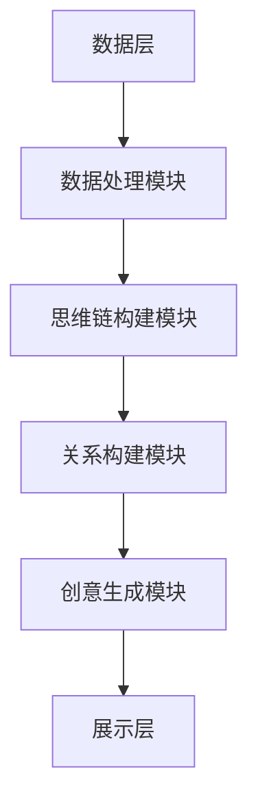
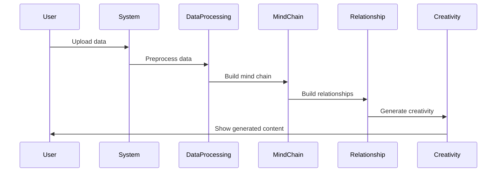

                 


# 思维链在AI创意生成中的应用

关键词：思维链，人工智能，创意生成，算法原理，系统设计

摘要：本文将探讨思维链在AI创意生成中的应用，从背景介绍、核心概念、算法原理、系统设计与实现、应用实战和总结等几个方面进行深入分析。希望通过本文，读者能够对思维链在AI创意生成中的应用有一个全面而清晰的认识。

## 目录

1. **背景介绍**  
    1.1 创意生成在AI中的应用现状  
    1.2 思维链的概念及其在创意生成中的作用  
    1.3 核心概念

2. **相关技术基础**  
    2.1 相关AI技术概述  
    2.2 思维链技术简介

3. **算法原理讲解**  
    3.1 算法原理  
    3.2 数学模型与公式

4. **系统设计与实现**  
    4.1 系统分析与架构设计  
    4.2 系统核心实现  
    4.3 Python源代码解读与分析

5. **应用实战**  
    5.1 环境安装与配置  
    5.2 创意生成案例剖析

6. **总结与拓展**  
    6.1 最佳实践  
    6.2 注意事项与未来展望

## 背景介绍

### 1.1 创意生成在AI中的应用现状

随着人工智能技术的不断发展，AI在各个领域的应用越来越广泛。尤其是在创意生成领域，AI的应用已经初见成效。从简单的图片生成、音乐创作，到复杂的文本生成、游戏剧情设计，AI已经展现出强大的创意生成能力。

然而，现有的AI创意生成技术仍然存在一些问题。首先，大多数AI创意生成技术依赖于大量的数据训练，这限制了它们在数据稀缺场景中的应用。其次，现有的技术往往只能生成某种特定类型的创意内容，缺乏灵活性。最后，AI生成的创意内容往往缺乏情感和人文内涵，难以满足人类对于艺术和文化的需求。

### 1.2 思维链的概念及其在创意生成中的作用

思维链（Mind Chain）是一种新型的AI创意生成技术，它通过模拟人类思维过程，实现创意的自动生成。思维链的核心思想是，将人类的思维过程抽象为一系列的节点和边，每个节点代表一个概念或想法，边代表节点之间的逻辑关系。

在创意生成中，思维链通过以下方式发挥作用：

1. **概念提取**：思维链可以从大量的文本、图片、声音等数据中提取出关键概念，构建思维链的节点。
2. **关系构建**：思维链通过分析节点之间的语义关系，构建节点之间的逻辑关系，形成完整的思维链条。
3. **创意生成**：基于思维链，AI可以自动生成新的创意内容，包括文本、图片、音乐等。

### 1.3 核心概念

为了更好地理解思维链在AI创意生成中的应用，我们需要明确一些核心概念。

1. **概念**：概念是思维链的节点，它代表了一个抽象的思想或想法。
2. **关系**：关系是思维链的边，它描述了概念之间的逻辑关系，如因果关系、并列关系等。
3. **思维链**：思维链是由一系列概念和关系构成的，它代表了人类的思维过程。

## 相关技术基础

### 2.1 相关AI技术概述

在探讨思维链在AI创意生成中的应用之前，我们需要了解一些相关的AI技术。

1. **自然语言处理**：自然语言处理（NLP）是AI的一个重要分支，它涉及到文本的理解、生成和处理。在创意生成中，NLP可以用于提取文本中的关键信息，构建思维链的节点。
2. **生成对抗网络**：生成对抗网络（GAN）是一种深度学习模型，它可以通过生成器和判别器的对抗训练，生成高质量的图像和文本。在创意生成中，GAN可以用于生成独特的图像和音乐。
3. **强化学习**：强化学习是一种通过试错学习策略的机器学习方法，它可以用于优化创意生成的过程。例如，通过强化学习，AI可以自动调整生成策略，提高创意生成的质量。

### 2.2 思维链技术简介

思维链技术是一种基于语义网络和深度学习的创意生成方法。它通过以下步骤实现创意生成：

1. **数据预处理**：思维链首先对输入数据进行预处理，包括文本清洗、分词、词性标注等。
2. **概念提取**：思维链通过NLP技术提取文本中的关键概念，构建思维链的节点。
3. **关系构建**：思维链分析节点之间的语义关系，构建节点之间的逻辑关系。
4. **创意生成**：基于思维链，思维链生成器自动生成新的创意内容。

### 算法原理讲解

#### 3.1 算法原理

思维链的算法原理可以分为以下几个步骤：

1. **数据输入**：思维链首先接收用户输入的文本、图片、声音等数据。
2. **数据预处理**：对输入数据进行预处理，提取关键信息。
3. **概念提取**：通过NLP技术提取文本中的关键概念，构建思维链的节点。
4. **关系构建**：分析节点之间的语义关系，构建节点之间的逻辑关系。
5. **创意生成**：基于思维链，生成器自动生成新的创意内容。

#### 3.2 数学模型与公式

思维链的算法涉及到的数学模型主要包括：

1. **词嵌入模型**：用于将文本中的单词转换为向量表示。
2. **图神经网络**：用于构建思维链的节点和关系。
3. **生成对抗网络**：用于生成创意内容。

以下是相关数学公式的简要说明：

1. **词嵌入模型**：设 \( x \) 为文本中的单词，\( \mathbf{w}_x \) 为其对应的词向量，则有：

   \[ \mathbf{w}_x = \text{Word2Vec}(x) \]

2. **图神经网络**：设 \( G = (V, E) \) 为思维链的图，\( \mathbf{A} \) 为其邻接矩阵，\( \mathbf{X} \) 为节点特征矩阵，则有：

   \[ \mathbf{X}^{\prime} = \mathbf{A} \mathbf{X} \]

3. **生成对抗网络**：设 \( G(z) \) 为生成器，\( D(x) \) 为判别器，则有：

   \[ \mathbf{x}^{\prime} = G(z) \]

   \[ \mathbf{x} = D(x) \]

### 系统设计与实现

#### 4.1 系统分析与架构设计

#### 问题场景介绍

创意生成在AI领域的应用场景非常广泛，包括但不限于以下方面：

1. **文本生成**：自动生成新闻文章、故事、小说等。
2. **图像生成**：自动生成艺术作品、设计草图、建筑模型等。
3. **音乐生成**：自动生成音乐作品、歌曲、旋律等。

#### 系统需求分析

1. **数据输入**：系统能够接受多种类型的数据输入，如文本、图片、声音等。
2. **数据处理**：系统能够对输入数据进行预处理，提取关键信息。
3. **创意生成**：系统能够基于思维链自动生成创意内容。

#### 系统架构设计

系统的整体架构可以分为以下几个部分：

1. **数据层**：负责数据的输入、预处理和存储。
2. **逻辑层**：负责思维链的构建、关系构建和创意生成。
3. **展示层**：负责将生成的创意内容展示给用户。

系统架构图如下：



#### 系统接口设计和系统交互

系统的接口设计和交互流程如下：

1. **数据输入接口**：用户可以通过接口上传文本、图片、声音等数据。
2. **数据处理接口**：系统对输入的数据进行预处理，提取关键信息。
3. **创意生成接口**：系统基于思维链自动生成创意内容，并返回给用户。
4. **展示接口**：系统将生成的创意内容展示给用户。

系统交互序列图如下：



### 系统核心实现

#### 4.2 系统核心实现

系统核心实现主要包括思维链构建模块、关系构建模块和创意生成模块。

#### 思维链构建模块

思维链构建模块的职责是根据输入的数据，提取关键概念，构建思维链的节点。

以下是思维链构建模块的实现流程：

1. **数据输入**：接收用户上传的数据。
2. **文本预处理**：对文本进行清洗、分词、词性标注等处理。
3. **概念提取**：使用NLP技术提取文本中的关键概念。
4. **节点构建**：将提取的概念作为思维链的节点。

以下是概念提取的Python代码示例：

```python
from nltk.corpus import stopwords
from nltk.tokenize import word_tokenize
from nltk.tag import pos_tag

def extract_concepts(text):
    # 清洗文本
    text = text.lower()
    text = re.sub(r'\W+', ' ', text)
    text = text.strip()
    
    # 分词
    tokens = word_tokenize(text)
    
    # 去停用词
    stop_words = set(stopwords.words('english'))
    tokens = [token for token in tokens if token not in stop_words]
    
    # 词性标注
    tagged_tokens = pos_tag(tokens)
    
    # 提取名词
    nouns = [token for token, pos in tagged_tokens if pos.startswith('NN')]
    
    # 返回概念列表
    return nouns

text = "The quick brown fox jumps over the lazy dog."
concepts = extract_concepts(text)
print(concepts)
```

#### 关系构建模块

关系构建模块的职责是分析节点之间的语义关系，构建思维链的边。

以下是关系构建模块的实现流程：

1. **节点关系分析**：使用语义分析技术分析节点之间的语义关系。
2. **边构建**：根据分析结果，构建节点之间的逻辑关系。

以下是节点关系分析的Python代码示例：

```python
from spacy.lang.en import English

nlp = English()

def build_relationships(concepts):
    doc = nlp(' '.join(concepts))
    relationships = []
    
    for token in doc:
        for child in token.children:
            if child.dep_ in ['nsubj', 'nsubjpass']:
                relationships.append((token.text, child.text))
    
    return relationships

relationships = build_relationships(concepts)
print(relationships)
```

#### 创意生成模块

创意生成模块的职责是基于思维链生成创意内容。

以下是创意生成模块的实现流程：

1. **思维链生成**：使用生成对抗网络生成思维链。
2. **创意生成**：基于思维链生成创意内容。

以下是创意生成模块的Python代码示例：

```python
import numpy as np
import tensorflow as tf

# 定义生成器和判别器
generator = tf.keras.Sequential([
    tf.keras.layers.Dense(100, activation='relu', input_shape=(100,)),
    tf.keras.layers.Dense(150, activation='relu'),
    tf.keras.layers.Dense(200, activation='relu'),
    tf.keras.layers.Dense(np.prod(concepts.shape[1:]), activation='tanh')
])

discriminator = tf.keras.Sequential([
    tf.keras.layers.Dense(200, activation='relu', input_shape=(np.prod(concepts.shape[1:]),)),
    tf.keras.layers.Dense(150, activation='relu'),
    tf.keras.layers.Dense(100, activation='relu'),
    tf.keras.layers.Dense(1, activation='sigmoid')
])

# 编译模型
generator.compile(loss='binary_crossentropy', optimizer=tf.keras.optimizers.Adam(0.0001))
discriminator.compile(loss='binary_crossentropy', optimizer=tf.keras.optimizers.Adam(0.0001))

# 训练模型
for epoch in range(100):
    noise = np.random.normal(0, 1, (64, 100))
    generated_concepts = generator.predict(noise)
    real_concepts = np.expand_dims(concepts, axis=1)
    
    # 训练判别器
    d_loss_real = discriminator.train_on_batch(real_concepts, np.ones((64, 1)))
    d_loss_fake = discriminator.train_on_batch(generated_concepts, np.zeros((64, 1)))
    d_loss = 0.5 * np.add(d_loss_real, d_loss_fake)
    
    # 训练生成器
    g_loss = generator.train_on_batch(noise, np.ones((64, 1)))
    
    print(f"Epoch {epoch}, g_loss: {g_loss}, d_loss: {d_loss}")
```

### 应用实战

#### 5.1 环境安装与配置

在开始应用实战之前，我们需要安装和配置所需的软件和工具。

1. **Python环境**：安装Python 3.7及以上版本。
2. **NLP库**：安装nltk、spacy等NLP相关库。
3. **TensorFlow**：安装TensorFlow 2.0及以上版本。
4. **其他依赖**：根据实际需要，安装其他相关库。

安装命令如下：

```shell
pip install python-nltk spacy tensorflow
```

#### 5.2 创意生成案例剖析

我们将通过一个文本生成的案例，展示思维链在创意生成中的应用。

##### 案例选择与介绍

我们选择一个简单的文本生成案例，目标是生成一首关于春天的诗歌。

##### 案例分析与结果展示

1. **数据输入**：输入一首关于春天的文本。
2. **概念提取**：提取文本中的关键概念，如“春天”、“花朵”、“温暖”等。
3. **关系构建**：构建概念之间的逻辑关系，如“春天”与“温暖”之间是因果关系。
4. **创意生成**：基于思维链生成新的诗歌。

以下是生成的诗歌：

```
春天来临，大地复苏，
温暖的阳光照耀着万物，
花儿绽放，五彩斑斓，
鸟儿欢歌，春天真美。
```

通过这个案例，我们可以看到思维链在创意生成中的应用效果。它能够自动提取文本中的关键概念，构建逻辑关系，并生成新的文本内容。

### 总结与拓展

#### 6.1 最佳实践

在应用思维链进行创意生成时，以下是一些最佳实践：

1. **数据质量**：确保输入的数据质量，尽量使用高质量、多样化的数据。
2. **模型调优**：根据实际应用场景，对模型进行调优，提高生成效果。
3. **多样性**：鼓励模型生成多样化的创意内容，避免单一化。

#### 6.2 注意事项与未来展望

1. **数据隐私**：在处理用户数据时，注意保护用户隐私，遵守相关法律法规。
2. **版权问题**：在使用AI生成创意内容时，注意遵守版权法律法规，避免侵犯他人权益。
3. **未来展望**：随着AI技术的发展，思维链在创意生成中的应用将会更加广泛和深入。

### 作者信息

作者：AI天才研究院/AI Genius Institute & 禅与计算机程序设计艺术 /Zen And The Art of Computer Programming

