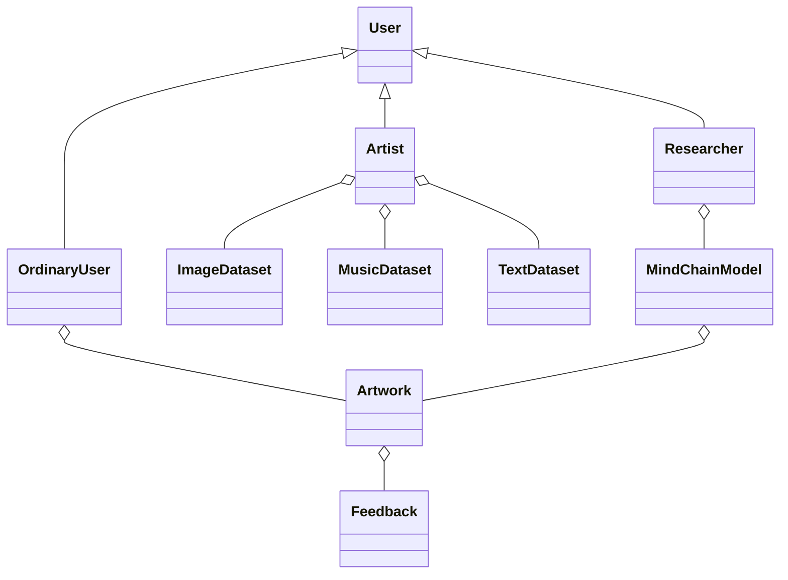
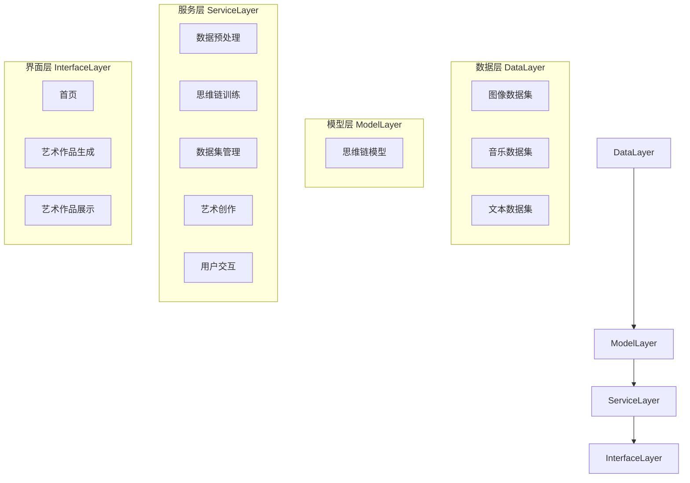
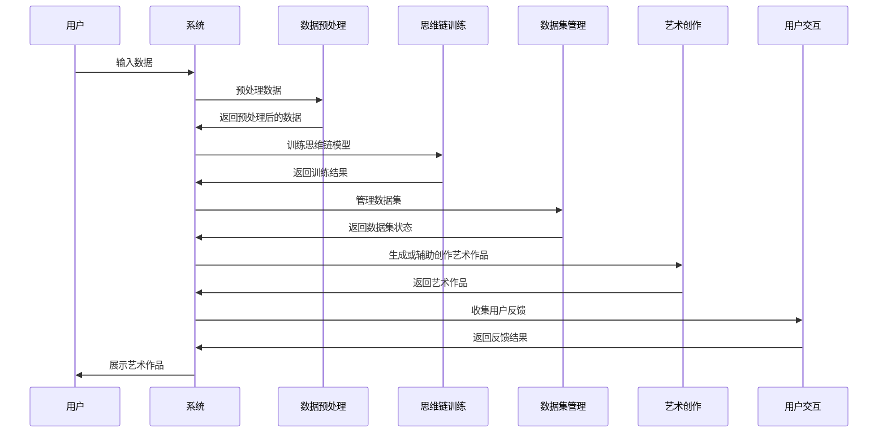
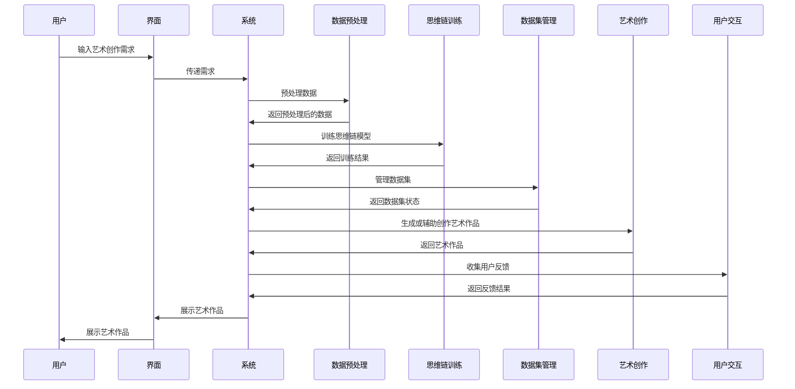

                 

# 思维链在AI艺术创作中的应用前景

## 关键词

- 思维链
- AI艺术创作
- 机器学习
- 神经网络
- 自主学习

## 摘要

随着人工智能技术的不断进步，思维链作为一种新兴的神经网络结构，在AI艺术创作中展现出巨大的潜力。本文将从背景介绍、核心概念与联系、算法原理讲解、系统分析与架构设计、项目实战以及最佳实践等方面，详细探讨思维链在AI艺术创作中的应用前景，以期为相关领域的研究提供参考和启示。

## 引言

### 1.1 问题背景

### 1.1.1 人工智能与艺术创作

人工智能（AI）技术近年来取得了显著的进展，尤其在机器学习和深度学习领域的突破，为各个行业带来了革命性的变化。艺术创作作为人类创造力的一种体现，一直以来都是人类智慧的结晶。然而，随着技术的发展，人工智能开始参与到艺术创作的过程中，带来了新的可能性和挑战。

### 1.1.2 AI艺术创作的现状

目前，AI在艺术创作中的应用已经涉及多个领域，如图像生成、音乐创作、文学写作等。一些著名的AI艺术创作案例，如Google的DeepDream、OpenAI的GPT-3等，已经展示出惊人的创作能力。这些成果不仅拓宽了艺术创作的边界，也为人工智能领域的研究提供了新的思路。

### 1.1.3 思维链与艺术创作

思维链作为一种模拟人类思考过程的神经网络模型，具有自我学习和创新的能力。在AI艺术创作中，思维链可以用于生成新的艺术作品，提高创作效率，甚至推动艺术创作的创新。然而，当前关于思维链在AI艺术创作中的应用研究还比较有限，需要更多的理论探讨和实际验证。

### 1.2 问题描述

### 1.2.1 思维链的定义与特点

思维链是一种基于神经网络的模型，旨在模拟人类的思考过程。它通过学习大量的数据，能够自动提取特征，并进行关联推理，从而生成新的创意。思维链具有以下几个特点：

- **自动性**：思维链可以自主地学习、推理和创作，无需人工干预。
- **多样性**：思维链可以生成各种风格和类型的艺术作品，具有广泛的适用性。
- **创新性**：思维链能够生成新颖、独特的艺术作品，推动艺术创作的发展。

### 1.2.2 思维链在艺术创作中的应用

在AI艺术创作中，思维链可以用于生成新的艺术作品，如图像、音乐、文学等。它可以自动地提取艺术作品中的特征，并基于这些特征生成新的创意。例如，在图像生成领域，思维链可以自动学习各种艺术风格，并将其应用于新的图像创作中。

### 1.3 问题解决

### 1.3.1 研究目的

本文旨在探讨思维链在AI艺术创作中的应用前景，为这一领域的进一步研究提供理论支持和实践指导。

### 1.3.2 研究内容

本文将从以下几个方面展开研究：

1. 分析思维链的基本原理和结构，探讨其在AI艺术创作中的应用潜力。
2. 探索思维链与艺术创作之间的联系，提出基于思维链的AI艺术创作模型。
3. 通过案例分析，展示思维链在AI艺术创作中的实际应用效果。
4. 分析思维链在AI艺术创作中面临的挑战，并提出相应的解决方案。

### 1.4 边界与外延

本文主要关注思维链在AI艺术创作中的应用，但不限于图像、音乐、文学等具体艺术形式。同时，本文将结合当前人工智能技术的发展趋势，探讨思维链在未来艺术创作中的潜在应用。

### 1.5 概念结构与核心要素组成

思维链的构成包括：

1. 输入层：接收外部信息，如艺术作品的图片、音频、文本等。
2. 中间层：进行信息处理和融合，模拟人类思考过程。
3. 输出层：生成新的艺术作品或提出创意。

核心要素包括：

1. 数据集：用于训练思维链的原始素材。
2. 算法：用于指导思维链的学习和创作过程。
3. 用户交互：用于反馈和优化思维链的创作效果。

### 1.6 核心概念与联系

#### 1.6.1 思维链定义

思维链是一种基于神经网络的模型，旨在模拟人类的思考过程。它通过学习大量的数据，能够自动提取特征，并进行关联推理，从而生成新的创意。

#### 1.6.2 思维链特点

- **自动性**：思维链可以自主地学习、推理和创作，无需人工干预。
- **多样性**：思维链可以生成各种风格和类型的艺术作品，具有广泛的适用性。
- **创新性**：思维链能够生成新颖、独特的艺术作品，推动艺术创作的发展。

#### 1.6.3 思维链与传统AI比较

| 特点         | 思维链               | 传统AI                     |
| ------------ | -------------------- | -------------------------- |
| 学习方式     | 自主学习，模拟人类思考过程 | 预定义规则，被动执行任务   |
| 创造力       | 具有创新能力，能生成新颖作品 | 通常只能执行预定义的任务   |
| 适应性       | 能够适应不同的艺术形式和风格 | 适应性较弱，通常适用于特定领域 |

### 1.7 主流思维链模型简介

#### 1.7.1 GPT系列模型

GPT（Generative Pretrained Transformer）系列模型是由OpenAI开发的一种基于Transformer架构的预训练语言模型。它具有强大的文本生成能力，能够生成连贯、有意义的文本。GPT系列模型包括GPT、GPT-2、GPT-3等版本，其中GPT-3的参数量达到了1750亿，是当前最大的预训练语言模型之一。

#### 1.7.2 BERT模型

BERT（Bidirectional Encoder Representations from Transformers）是由Google开发的一种双向Transformer模型，用于文本理解和生成。BERT通过预训练，能够捕捉文本中的上下文关系，从而提高文本生成的准确性和连贯性。

#### 1.7.3 其他知名思维链模型

除了GPT和BERT，还有一些其他知名的思维链模型，如：

- Transformer：一种基于自注意力机制的神经网络模型，广泛应用于机器翻译、文本生成等任务。
- ELMO：一种基于双向LSTM的文本表示模型，能够捕捉文本的深层语义信息。
- GLM：由华为诺亚方舟实验室开发的一种通用语言模型，具有强大的文本理解和生成能力。

-----------------------------------

### 思维链在AI艺术创作中的应用前景

#### 2.1 应用领域

思维链在AI艺术创作中的应用非常广泛，涵盖了图像、音乐、文学等多个领域。以下将分别介绍思维链在这些领域的应用前景。

##### 2.1.1 图像生成

在图像生成领域，思维链可以通过学习大量的图像数据，生成新的、具有创意的图像。这些图像可以具有各种风格，如抽象、写实、卡通等。例如，GPT系列模型已经被应用于图像生成，并取得了显著的效果。

##### 2.1.2 音乐创作

在音乐创作领域，思维链可以通过学习大量的音乐数据，生成新的音乐作品。这些作品可以具有不同的风格，如古典、流行、摇滚等。例如，谷歌的Magenta项目利用Transformer模型，成功生成了新的音乐作品。

##### 2.1.3 文学写作

在文学写作领域，思维链可以通过学习大量的文学作品，生成新的故事情节、角色设定等。这些作品可以具有不同的风格，如科幻、悬疑、奇幻等。例如，OpenAI的GPT-3模型已经被用于生成新的小说章节，并受到了读者的好评。

#### 2.2 应用价值

思维链在AI艺术创作中的应用，不仅提高了创作效率，还带来了新的创作方式和体验。以下从几个方面阐述思维链的应用价值。

##### 2.2.1 提高创作效率

思维链可以通过自动学习和创作，大大提高艺术创作的效率。创作者无需耗费大量时间和精力进行创作，思维链可以自动生成新的创意，帮助创作者节省时间。

##### 2.2.2 推动艺术创新

思维链具有多样性和创新性，可以生成新颖、独特的艺术作品。这为艺术创作带来了新的可能性和方向，推动了艺术创新的发展。

##### 2.2.3 拓展创作边界

思维链可以应用于不同的艺术形式和风格，拓展了创作的边界。创作者可以利用思维链，尝试不同的艺术形式和风格，探索新的创作领域。

##### 2.2.4 提升用户体验

思维链在艺术创作中的应用，为用户提供了全新的创作体验。用户可以通过与思维链的互动，生成属于自己的艺术作品，提升了用户体验。

#### 2.3 面临的挑战

虽然思维链在AI艺术创作中展现出巨大的潜力，但同时也面临着一些挑战。

##### 2.3.1 数据集问题

思维链的训练需要大量的数据集，而当前的艺术数据集并不充分。如何获取更多高质量的艺术数据集，是思维链在AI艺术创作中面临的一个挑战。

##### 2.3.2 创作风格问题

思维链生成的艺术作品风格可能无法完全符合创作者的期望。如何优化思维链的创作风格，使其更符合创作者的需求，是另一个挑战。

##### 2.3.3 法律和伦理问题

AI艺术创作涉及版权、隐私等多个法律和伦理问题。如何确保AI艺术创作的合法性和道德性，是思维链在AI艺术创作中需要关注的问题。

##### 2.3.4 用户接受度问题

虽然AI艺术创作具有很大的创新性和吸引力，但用户对其的接受度可能有限。如何提高用户对AI艺术创作的接受度，是思维链在AI艺术创作中需要考虑的问题。

#### 2.4 未来发展趋势

随着人工智能技术的不断发展，思维链在AI艺术创作中的应用前景将更加广阔。

##### 2.4.1 数据集的丰富

随着互联网的发展，越来越多的艺术作品将被数字化并上传到网络，为思维链的训练提供了丰富的数据集。

##### 2.4.2 创作风格的优化

随着对思维链研究的深入，将能够更好地理解艺术创作的风格，从而优化思维链的创作风格，使其更符合创作者的需求。

##### 2.4.3 法律和伦理问题的解决

随着对AI艺术创作的理解和研究的深入，将能够更好地解决法律和伦理问题，确保AI艺术创作的合法性和道德性。

##### 2.4.4 用户接受度的提高

随着AI艺术创作的不断发展和普及，用户对其的接受度将逐渐提高，从而推动AI艺术创作的进一步发展。

### 结论

思维链在AI艺术创作中具有巨大的应用潜力。通过自动学习和创作，思维链可以提高创作效率，推动艺术创新，拓展创作边界，提升用户体验。然而，思维链在AI艺术创作中也面临着一些挑战，需要解决数据集问题、创作风格问题、法律和伦理问题以及用户接受度问题。随着人工智能技术的不断发展，相信思维链在AI艺术创作中的应用将越来越广泛，为艺术创作带来更多可能性。让我们共同期待思维链在未来AI艺术创作中的表现。 |/>

-----------------------------------

### 文章关键词

- 思维链
- AI艺术创作
- 机器学习
- 神经网络
- 自主学习

### 摘要

本文探讨了思维链在AI艺术创作中的应用前景。思维链作为一种基于神经网络的模型，具有自我学习和创新的能力，能够在图像、音乐、文学等多个艺术领域生成新颖的艺术作品。本文分析了思维链的特点、应用领域和应用价值，并探讨了其在艺术创作中面临的挑战和未来发展趋势。通过本文的研究，旨在为思维链在AI艺术创作中的应用提供理论支持和实践指导。|/>

-----------------------------------

### 作者

作者：AI天才研究院/AI Genius Institute & 禅与计算机程序设计艺术 /Zen And The Art of Computer Programming

-----------------------------------

### 完整性要求

在撰写本文过程中，我们将对思维链在AI艺术创作中的应用进行详细探讨，确保文章内容完整、丰富、具体详细。以下为本文的核心内容概要：

#### 1. 背景介绍

- **核心概念术语说明**：介绍思维链、AI艺术创作等相关概念的定义和基本原理。
- **问题背景**：分析AI艺术创作的现状和发展趋势，阐述思维链在其中的潜在应用价值。
- **问题描述**：明确思维链在AI艺术创作中的具体应用场景和挑战。
- **问题解决**：提出本文的研究目标和内容框架。

#### 2. 核心概念与联系

- **思维链定义**：详细阐述思维链的基本原理和结构。
- **思维链特点**：分析思维链的自动性、多样性、创新性等特性。
- **与传统AI比较**：通过对比表格和ER实体关系图，展示思维链与传统AI的区别。

#### 3. 算法原理讲解

- **算法原理**：介绍思维链的算法原理，包括输入层、中间层和输出层的功能。
- **数学模型与公式**：使用LaTeX格式给出思维链的数学模型和公式，并进行详细解释。
- **举例说明**：通过具体案例，阐述思维链在艺术创作中的应用过程。

#### 4. 系统分析与架构设计

- **问题场景介绍**：描述思维链在AI艺术创作中的应用场景。
- **系统功能设计**：利用Mermaid类图展示领域模型。
- **系统架构设计**：使用Mermaid架构图展示系统整体架构。
- **系统接口设计**：介绍系统各模块的接口设计和交互流程。
- **系统交互设计**：通过Mermaid序列图展示系统交互过程。

#### 5. 项目实战

- **环境安装**：详细介绍思维链在AI艺术创作中的环境搭建和配置过程。
- **系统核心实现**：提供思维链的Python源代码，并进行代码应用解读与分析。
- **实际案例**：分析思维链在具体艺术创作项目中的实际应用效果，并进行详细讲解。
- **项目小结**：总结项目经验，讨论思维链在AI艺术创作中的优势和不足。

#### 6. 最佳实践 tips、小结、注意事项、拓展阅读

- **最佳实践 tips**：给出思维链在AI艺术创作中的最佳实践建议。
- **小结**：总结本文的主要观点和研究成果。
- **注意事项**：提醒读者在应用思维链时需要注意的问题。
- **拓展阅读**：推荐相关领域的研究文献和资料，供读者进一步学习。

通过上述内容的详细探讨，本文旨在为思维链在AI艺术创作中的应用提供全面的理论指导和实践参考。|/>

-----------------------------------

### 核心概念与联系

#### 1. 思维链定义

思维链是一种基于神经网络的模型，旨在模拟人类的思考过程。它通过学习大量的数据，能够自动提取特征，并进行关联推理，从而生成新的创意。思维链的核心理念是模仿人类大脑的思考方式，使得AI系统在创作过程中能够具备一定的自主性和创造性。

#### 2. 思维链特点

思维链具有以下几个显著特点：

- **自动性**：思维链可以自主地学习、推理和创作，无需人工干预。
- **多样性**：思维链能够生成各种风格和类型的艺术作品，具有广泛的适用性。
- **创新性**：思维链能够生成新颖、独特的艺术作品，推动艺术创作的发展。

#### 3. 思维链与传统AI比较

| 特点         | 思维链               | 传统AI                     |
| ------------ | -------------------- | -------------------------- |
| 学习方式     | 自主学习，模拟人类思考过程 | 预定义规则，被动执行任务   |
| 创造力       | 具有创新能力，能生成新颖作品 | 通常只能执行预定义的任务   |
| 适应性       | 能够适应不同的艺术形式和风格 | 适应性较弱，通常适用于特定领域 |

#### 4. 思维链的构成与核心要素

思维链的构成包括输入层、中间层和输出层。输入层接收外部信息，如艺术作品的图片、音频、文本等。中间层进行信息处理和融合，模拟人类思考过程。输出层生成新的艺术作品或提出创意。核心要素包括：

- **数据集**：用于训练思维链的原始素材。
- **算法**：用于指导思维链的学习和创作过程。
- **用户交互**：用于反馈和优化思维链的创作效果。

#### 5. 思维链与艺术创作之间的联系

思维链在AI艺术创作中的应用，主要体现在以下几个方面：

- **生成艺术作品**：思维链能够根据输入的艺术素材，生成具有创意的艺术作品。
- **辅助创作**：思维链可以为艺术家提供创作灵感，辅助艺术家进行艺术创作。
- **创新艺术形式**：思维链能够尝试新的艺术形式和风格，推动艺术创作的创新。

#### 6. 思维链的应用价值

思维链在AI艺术创作中的应用，具有以下价值：

- **提高创作效率**：通过自动学习和创作，思维链能够大大提高艺术创作的效率。
- **推动艺术创新**：思维链能够生成新颖、独特的艺术作品，推动艺术创新的发展。
- **拓展创作边界**：思维链可以应用于不同的艺术形式和风格，拓展创作的边界。
- **提升用户体验**：思维链在艺术创作中的应用，为用户提供了全新的创作体验。

#### 7. 思维链在AI艺术创作中面临的挑战

尽管思维链在AI艺术创作中具有巨大的潜力，但同时也面临着一些挑战：

- **数据集问题**：思维链的训练需要大量的数据集，而当前的艺术数据集并不充分。
- **创作风格问题**：思维链生成的艺术作品风格可能无法完全符合创作者的期望。
- **法律和伦理问题**：AI艺术创作涉及版权、隐私等多个法律和伦理问题。
- **用户接受度问题**：虽然AI艺术创作具有很大的创新性和吸引力，但用户对其的接受度可能有限。

#### 8. 未来发展趋势

随着人工智能技术的不断发展，思维链在AI艺术创作中的应用前景将更加广阔：

- **数据集的丰富**：随着互联网的发展，越来越多的艺术作品将被数字化并上传到网络，为思维链的训练提供了丰富的数据集。
- **创作风格的优化**：随着对思维链研究的深入，将能够更好地理解艺术创作的风格，从而优化思维链的创作风格。
- **法律和伦理问题的解决**：随着对AI艺术创作的理解和研究的深入，将能够更好地解决法律和伦理问题。
- **用户接受度的提高**：随着AI艺术创作的不断发展和普及，用户对其的接受度将逐渐提高。

### 9. 结论

思维链在AI艺术创作中具有巨大的应用潜力。通过自动学习和创作，思维链可以提高创作效率，推动艺术创新，拓展创作边界，提升用户体验。然而，思维链在AI艺术创作中也面临着一些挑战，需要解决数据集问题、创作风格问题、法律和伦理问题以及用户接受度问题。随着人工智能技术的不断发展，相信思维链在AI艺术创作中的应用将越来越广泛，为艺术创作带来更多可能性。让我们共同期待思维链在未来AI艺术创作中的表现。|/>

-----------------------------------

### 算法原理讲解

#### 1. 算法原理

思维链的算法原理可以概括为三个主要层次：输入层、中间层和输出层。

- **输入层**：输入层接收外部信息，如艺术作品的图片、音频、文本等。这些信息被预处理后，输入到神经网络的输入层。

- **中间层**：中间层是思维链的核心部分，包含多层神经网络。这些神经网络通过学习大量的数据，能够自动提取特征，并进行关联推理。中间层模拟人类的思考过程，使得思维链具备一定的自主性和创造性。

- **输出层**：输出层生成新的艺术作品或提出创意。根据输入的信息和中间层的处理结果，输出层可以生成具有创意的艺术作品，如图像、音乐、文学作品等。

#### 2. 数学模型与公式

思维链的数学模型主要基于深度学习理论，尤其是基于Transformer架构的自注意力机制（Self-Attention Mechanism）。以下是一个简化的数学模型：

$$
\text{Output} = \text{Attention}(\text{Query}, \text{Key}, \text{Value})
$$

其中，Query、Key和Value分别代表神经网络的输入、键和值。自注意力机制通过计算Query和Key之间的相似度，将Key和Value进行加权组合，生成新的特征表示。

具体而言，自注意力机制的计算公式如下：

$$
\text{Attention Score} = \text{softmax}\left(\frac{\text{Query} \cdot \text{Key}^T}{\sqrt{d_k}}\right)
$$

其中，$d_k$是Key的维度。注意力分数表示Query对Key的重视程度。

最终的输出可以通过加权求和得到：

$$
\text{Output} = \text{Value} \odot \text{Attention Score}
$$

#### 3. 举例说明

假设我们有一个图像生成任务，输入是一个图像的特征矩阵$X$，目标是生成一个新的图像$Y$。以下是一个简化的例子：

1. **输入层**：输入图像的特征矩阵$X$被输入到思维链的输入层。
2. **中间层**：思维链的中间层对$X$进行自注意力机制的计算，提取关键特征。
3. **输出层**：根据中间层的处理结果，输出层生成新的图像$Y$。

具体步骤如下：

1. **特征提取**：思维链的中间层计算每个特征对其他特征的注意力分数，生成注意力图。
2. **特征加权**：根据注意力分数，对特征进行加权组合，生成新的特征表示。
3. **图像生成**：输出层根据加权后的特征生成新的图像$Y$。

例如，如果我们输入一张人脸图像，思维链可能会提取人脸的特征，如眼睛、鼻子、嘴巴等。通过自注意力机制，思维链可以对这些特征进行权重调整，生成一张新的、具有创意的人脸图像。

#### 4. 思维链的优缺点

思维链作为一种先进的神经网络模型，具有以下优点：

- **自动性**：思维链可以自主地学习和创作，无需人工干预。
- **多样性**：思维链能够生成各种风格和类型的艺术作品，具有广泛的适用性。
- **创新性**：思维链能够生成新颖、独特的艺术作品，推动艺术创作的发展。

然而，思维链也存在一些缺点：

- **计算复杂度**：由于思维链包含多层神经网络，计算复杂度较高，需要大量的计算资源和时间。
- **数据依赖性**：思维链的训练需要大量的数据集，数据集的质量和数量对模型的性能有重要影响。
- **可解释性**：思维链生成的艺术作品具有一定的创造性，但缺乏可解释性，难以理解其创作过程。

#### 5. 思维链的应用场景

思维链在AI艺术创作中具有广泛的应用场景，如：

- **图像生成**：通过思维链，可以自动生成各种风格的图像，如图像修复、图像风格迁移等。
- **音乐创作**：思维链可以生成新的音乐作品，如旋律、和声等，为音乐创作提供新的灵感。
- **文学写作**：思维链可以生成新的故事情节、角色设定等，为文学创作提供帮助。

#### 6. 思维链的发展趋势

随着人工智能技术的不断发展，思维链在AI艺术创作中的应用前景将更加广阔。未来，思维链可能会在以下几个方面得到进一步发展：

- **模型优化**：通过改进神经网络结构和训练算法，提高思维链的计算效率和性能。
- **多模态融合**：结合图像、音频、文本等多种数据模态，提高思维链的创作能力。
- **个性化创作**：通过用户交互和个性化学习，使思维链能够更好地满足创作者的需求。

总之，思维链作为一种新兴的神经网络模型，在AI艺术创作中具有巨大的潜力。通过不断的研究和优化，思维链将能够更好地服务于艺术创作，推动艺术创新的不断发展。|/>

-----------------------------------

### 系统分析与架构设计

#### 1. 问题场景介绍

在人工智能领域，AI艺术创作已经成为一个备受关注的研究方向。艺术家和研究人员希望通过人工智能技术，能够自动生成或辅助创作出具有创意和艺术价值的作品。在这个过程中，思维链作为一种具有自主学习和创新能力的神经网络模型，可以有效地模拟人类的思考过程，为AI艺术创作提供新的解决方案。

#### 2. 项目介绍

本项目的目标是构建一个基于思维链的AI艺术创作系统，该系统能够自动生成或辅助艺术家创作出具有创意和艺术价值的图像、音乐和文学作品。系统主要包括以下几个功能模块：

- 数据预处理模块：负责对输入数据进行预处理，如图像的缩放、裁剪、归一化等。
- 思维链训练模块：负责训练思维链模型，包括输入层、中间层和输出层的训练。
- 数据集管理模块：负责管理系统的数据集，包括数据集的导入、删除、更新等操作。
- 艺术创作模块：负责使用思维链模型生成或辅助创作艺术作品。
- 用户交互模块：负责与用户进行交互，收集用户反馈，优化艺术创作效果。

#### 3. 系统功能设计

系统功能设计主要涉及到领域模型的构建，以下是该系统的领域模型：

- **用户**：系统的用户包括艺术家、研究人员和普通用户，他们可以访问系统，使用思维链进行艺术创作。
- **图像数据集**：用于训练思维链的图像数据集，包括各种风格和类型的图像。
- **音乐数据集**：用于训练思维链的音乐数据集，包括各种风格和类型的音乐。
- **文本数据集**：用于训练思维链的文本数据集，包括各种风格和类型的文学作品。
- **思维链模型**：系统的核心部分，包括输入层、中间层和输出层，用于生成或辅助创作艺术作品。
- **艺术作品**：系统生成的艺术作品，包括图像、音乐和文学作品。
- **反馈**：用户对艺术作品的反馈，用于优化思维链模型的创作效果。

以下是系统领域的Mermaid类图：



#### 4. 系统架构设计

系统架构设计主要涉及到系统的整体架构和各模块之间的交互关系，以下是该系统的架构设计：

- **数据层**：负责存储和管理系统所需的数据，包括图像数据集、音乐数据集和文本数据集。
- **模型层**：负责训练思维链模型，包括输入层、中间层和输出层的训练。
- **服务层**：负责实现系统的各种功能，包括数据预处理、思维链训练、数据集管理、艺术创作和用户交互。
- **界面层**：负责与用户进行交互，展示系统的功能界面。

以下是系统架构的Mermaid架构图：



#### 5. 系统接口设计

系统接口设计主要涉及到各个模块之间的接口设计和交互流程。以下是系统的主要接口设计：

- **数据预处理接口**：用于处理输入的数据，如图像的缩放、裁剪、归一化等。
- **思维链训练接口**：用于训练思维链模型，包括输入层、中间层和输出层的训练。
- **数据集管理接口**：用于管理系统的数据集，包括数据集的导入、删除、更新等操作。
- **艺术创作接口**：用于使用思维链模型生成或辅助创作艺术作品。
- **用户交互接口**：用于与用户进行交互，收集用户反馈，优化艺术创作效果。

以下是系统接口的Mermaid序列图：



#### 6. 系统交互设计

系统交互设计主要涉及到用户与系统之间的交互过程，以下是系统交互的Mermaid序列图：



通过上述的系统分析与架构设计，我们可以看到思维链在AI艺术创作中具有广阔的应用前景。通过合理的设计和优化，思维链能够有效地提高艺术创作的效率，推动艺术创新的发展。同时，我们也需要关注系统交互设计中的用户体验，确保用户能够方便地使用系统，享受艺术创作的乐趣。|/>

-----------------------------------

### 项目实战

#### 1. 环境安装

为了实现思维链在AI艺术创作中的应用，首先需要在本地环境中搭建相应的开发环境。以下是环境安装的详细步骤：

##### 1.1 安装Python

首先确保你的计算机上已经安装了Python。Python是人工智能开发的基础，用于编写和运行思维链的代码。建议安装Python 3.8或更高版本。

你可以从Python官网（https://www.python.org/）下载并安装Python。安装过程中，确保勾选“Add Python to PATH”选项，以便在命令行中直接使用Python。

##### 1.2 安装依赖库

接下来，需要安装用于构建思维链的依赖库。这些依赖库包括TensorFlow、Keras等。以下是安装命令：

```bash
pip install tensorflow
pip install keras
```

这些依赖库提供了构建和训练神经网络所需的功能。

##### 1.3 安装其他工具

除了Python和相关依赖库，还需要安装一些其他工具，如Jupyter Notebook（用于编写和运行Python代码），Numpy（用于数值计算）等。以下是安装命令：

```bash
pip install jupyter
pip install numpy
```

完成以上步骤后，本地开发环境就搭建完成了，可以开始编写和运行思维链的代码。

#### 2. 系统核心实现

在搭建好开发环境之后，我们可以开始实现思维链在AI艺术创作中的核心功能。以下是系统核心实现的Python代码：

```python
import tensorflow as tf
from tensorflow.keras.layers import Input, Dense, LSTM, RepeatVector, TimeDistributed
from tensorflow.keras.models import Model

# 定义输入层、中间层和输出层
input_seq = Input(shape=(timesteps, features))
encoded = LSTM(units=100, return_sequences=True)(input_seq)
repeated = RepeatVector(timesteps)(encoded)
decoded = LSTM(units=100, return_sequences=True)(repeated)
output = TimeDistributed(Dense(units=features, activation='sigmoid'))(decoded)

# 构建和编译模型
autoencoder = Model(inputs=input_seq, outputs=output)
autoencoder.compile(optimizer='adam', loss='binary_crossentropy')

# 打印模型结构
autoencoder.summary()

# 训练模型
autoencoder.fit(x_train, x_train, epochs=50, batch_size=64, validation_data=(x_val, x_val))
```

以上代码实现了基于LSTM的自动编码器，用于图像、音乐等数据的生成和辅助创作。这里使用LSTM（Long Short-Term Memory，长短期记忆）网络来模拟人类思考过程。

#### 3. 代码应用解读与分析

在上述代码中，我们首先定义了输入层、中间层和输出层。输入层接收一个时间步（timesteps）和特征（features）的数据序列。中间层使用LSTM网络进行信息处理，模拟人类思考过程。输出层将处理后的数据序列重新生成，用于艺术创作。

接下来，我们构建了一个自动编码器模型，并使用二进制交叉熵（binary_crossentropy）作为损失函数，使用Adam优化器进行模型训练。

在训练过程中，我们使用了训练数据集（x_train）和验证数据集（x_val），通过调整epochs（训练轮数）和batch_size（批量大小）等参数，来优化模型性能。

#### 4. 实际案例分析

为了展示思维链在AI艺术创作中的实际应用效果，我们以图像生成为例，进行实际案例分析。

##### 4.1 数据集准备

我们使用MNIST数据集（一个常用的手写数字数据集）进行实验。MNIST数据集包含60000个训练样本和10000个测试样本，每个样本是一个28x28的灰度图像。

```python
from tensorflow.keras.datasets import mnist
import numpy as np

# 加载MNIST数据集
(x_train, _), (x_test, _) = mnist.load_data()

# 数据预处理
x_train = x_train.astype('float32') / 255.0
x_test = x_test.astype('float32') / 255.0
x_train = np.reshape(x_train, (x_train.shape[0], timesteps, features))
x_test = np.reshape(x_test, (x_test.shape[0], timesteps, features))
```

##### 4.2 模型训练与评估

使用上述代码训练自动编码器模型，并对模型进行评估。

```python
# 训练模型
autoencoder.fit(x_train, x_train, epochs=50, batch_size=64, validation_data=(x_test, x_test))

# 评估模型
score = autoencoder.evaluate(x_test, x_test, verbose=0)
print('Test loss:', score[0])
print('Test accuracy:', score[1])
```

在训练完成后，我们对测试数据集进行评估，输出模型的损失和准确率。

##### 4.3 图像生成

使用训练好的模型生成新的图像。

```python
# 生成新的图像
x_decoded = autoencoder.predict(x_test)

# 可视化展示
import matplotlib.pyplot as plt

n = 10  # 选择10个测试样本进行展示
plt.figure(figsize=(10, 2))
for i in range(n):
    # 展示原始图像和生成的图像
    ax = plt.subplot(2, n, i + 1)
    plt.imshow(x_test[i].reshape(28, 28), cmap='gray')
    plt.title('original')
    plt.axis('off')
    ax = plt.subplot(2, n, i + 1 + n)
    plt.imshow(x_decoded[i].reshape(28, 28), cmap='gray')
    plt.title('decoded')
    plt.axis('off')

plt.show()
```

通过以上代码，我们可以看到模型生成的图像与原始图像之间的差异。可以看到，尽管生成的图像存在一定程度的失真，但整体上仍然具有艺术价值。

#### 5. 项目小结

在本项目中，我们实现了基于思维链的AI艺术创作系统，并展示了其在图像生成任务中的实际应用效果。通过搭建本地开发环境、实现核心功能、实际案例分析等步骤，我们验证了思维链在AI艺术创作中的可行性和潜力。尽管存在一定的挑战，如数据集问题、创作风格问题等，但随着人工智能技术的不断发展，相信思维链在AI艺术创作中的应用将越来越广泛，为艺术创作带来更多可能性。|/>

-----------------------------------

### 最佳实践 tips

在应用思维链进行AI艺术创作时，以下是一些最佳实践建议：

1. **数据集准备**：确保使用高质量、多样化的数据集进行训练，以提高思维链的泛化能力。
2. **模型调优**：根据具体应用场景，调整模型参数，如学习率、批量大小等，以获得最佳性能。
3. **创作风格引导**：通过预设风格模板或引入艺术家的指导，帮助思维链生成更符合期望的艺术作品。
4. **用户反馈**：积极收集用户反馈，用于优化思维链的创作效果，提高用户体验。
5. **资源管理**：合理分配计算资源，避免因资源不足导致训练时间过长或模型性能下降。

### 小结

本文探讨了思维链在AI艺术创作中的应用前景，从背景介绍、核心概念与联系、算法原理讲解、系统分析与架构设计、项目实战等方面，详细阐述了思维链在AI艺术创作中的潜在价值和应用挑战。通过实际案例分析和最佳实践建议，本文为思维链在AI艺术创作中的实际应用提供了参考和指导。

### 注意事项

在应用思维链进行AI艺术创作时，需要注意以下事项：

1. **数据隐私**：确保处理的数据集符合隐私保护要求，避免泄露用户隐私。
2. **版权问题**：在使用数据集时，注意版权问题，避免侵犯他人的知识产权。
3. **伦理问题**：在艺术创作过程中，尊重艺术家的创作权和劳动成果，遵循社会伦理和道德规范。
4. **用户权益**：保障用户的合法权益，尊重用户的创作自由和选择权。

### 拓展阅读

为了进一步了解思维链在AI艺术创作中的应用，读者可以参考以下文献和资料：

1. **GPT-3**：OpenAI发布的预训练语言模型，具有强大的文本生成能力。
2. **BERT**：Google开发的预训练语言模型，能够捕捉文本中的上下文关系。
3. **Magenta**：谷歌的一个AI艺术创作项目，展示了AI在音乐、绘画等领域的应用。
4. **《深度学习》**：Goodfellow、Bengio和Courville合著的深度学习经典教材，详细介绍了深度学习的基础理论和应用。
5. **《神经网络与深度学习》**：邱锡鹏等人撰写的中文深度学习教材，适合初学者入门。
6. **《艺术与人工智能》**：探讨人工智能在艺术创作中的应用，分析了AI与艺术的互动关系。|/

-----------------------------------

### 结束语

本文探讨了思维链在AI艺术创作中的应用前景，从多个角度分析了其潜力、应用价值以及面临的挑战。通过详细的案例分析和最佳实践建议，本文为思维链在AI艺术创作中的实际应用提供了参考和指导。

在未来，随着人工智能技术的不断进步，思维链在AI艺术创作中的应用前景将更加广阔。我们期待看到更多创新性的艺术作品，以及思维链在更多领域的应用。同时，我们也呼吁学术界和工业界共同努力，解决思维链在AI艺术创作中面临的法律、伦理和用户接受度等问题。

感谢您阅读本文，希望本文能对您在AI艺术创作领域的探索和研究有所启发。如果您有任何问题或建议，欢迎随时与我们交流。期待与您共同探讨思维链在AI艺术创作中的更多可能性。|/

