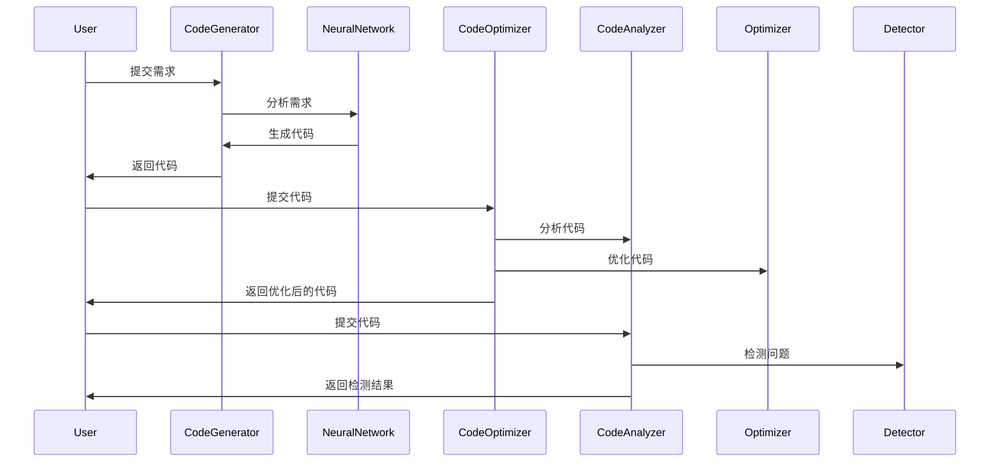

                 

# 思维链在AI辅助编程中的应用

## 关键词
- AI辅助编程
- 思维链
- 编程效率
- 代码生成
- 代码优化
- 代码分析

## 摘要
本文将深入探讨思维链在AI辅助编程中的应用。首先，我们将介绍问题背景，包括AI辅助编程的发展现状和思维链技术的基本概念。接着，我们将详细阐述思维链在代码生成、代码优化和代码分析中的应用。最后，我们将通过具体的算法原理讲解和项目实战，展示思维链在AI辅助编程中的实际应用效果。

## 第一部分：问题背景介绍

### 1. 问题背景

随着人工智能技术的发展，编程已经成为人工智能应用中的重要环节。AI辅助编程的出现，不仅提升了开发效率，还为程序员提供了强大的智能支持。思维链作为人工智能领域的一种先进技术，其在AI辅助编程中的应用日益受到关注。

### 2. 问题描述

在AI辅助编程中，思维链技术的应用主要包括代码生成、代码优化、代码分析等方面。然而，如何有效地将思维链技术应用于编程辅助，提高编程效率和质量，成为当前研究的热点问题。

### 3. 问题解决

本书旨在深入探讨思维链在AI辅助编程中的应用，通过阐述思维链的核心概念、原理及其在编程辅助中的具体应用，为读者提供一套系统、全面的解决方案。

### 4. 边界与外延

本书主要关注思维链在AI辅助编程中的应用，但不涉及其他AI技术在编程辅助中的应用。同时，本书也不探讨思维链在其他领域的应用。

### 5. 概念结构与核心要素组成

- **思维链**：一种基于人工智能技术的方法，能够模拟人类思维过程，实现信息的自动推理和传递。
- **AI辅助编程**：利用人工智能技术，辅助程序员进行编程工作，提高编程效率和质量。
- **编程辅助**：为程序员提供代码生成、代码优化、代码分析等辅助功能，减轻程序员的工作负担。

## 第二部分：核心概念与联系

### 1. 思维链的概念与原理

#### 1.1.1 思维链的定义

思维链是一种基于人工智能技术的方法，通过模拟人类思维过程，实现信息的自动推理和传递。

#### 1.1.2 思维链的工作原理

思维链通过将知识、规则、数据等输入到系统中，利用神经网络、知识图谱等技术，对输入信息进行自动推理和传递，实现智能化编程辅助。

### 2. AI辅助编程的概念与特点

#### 2.1.1 AI辅助编程的定义

AI辅助编程是指利用人工智能技术，辅助程序员进行编程工作，提高编程效率和质量。

#### 2.1.2 AI辅助编程的特点

- **自动化**：通过算法自动生成代码、优化代码，减轻程序员的工作负担。
- **智能化**：利用人工智能技术，实现代码分析、代码推荐等智能化功能。
- **高效性**：提高编程效率，缩短开发周期。

### 3. 编程辅助的概念与功能

#### 3.1.1 编程辅助的定义

编程辅助是指为程序员提供代码生成、代码优化、代码分析等辅助功能，减轻程序员的工作负担。

#### 3.1.2 编程辅助的功能

- **代码生成**：根据需求自动生成代码，提高开发效率。
- **代码优化**：对现有代码进行优化，提高代码质量。
- **代码分析**：对代码进行分析，发现潜在问题，提高代码可靠性。

## 第三部分：思维链在AI辅助编程中的应用

### 1. 思维链在代码生成中的应用

#### 1.1.1 思维链在代码生成中的工作原理

思维链通过分析需求，利用神经网络、知识图谱等技术，自动生成符合要求的代码。

#### 1.1.2 思维链在代码生成中的应用案例

- **自动化生成Web应用代码**
- **自动化生成移动应用代码**

### 2. 思维链在代码优化中的应用

#### 2.1.1 思维链在代码优化中的工作原理

思维链通过分析代码，利用优化算法，自动优化代码质量。

#### 2.1.2 思维链在代码优化中的应用案例

- **优化代码性能**
- **优化代码可读性**

### 3. 思维链在代码分析中的应用

#### 3.1.1 思维链在代码分析中的工作原理

思维链通过分析代码，利用算法检测代码中的潜在问题。

#### 3.1.2 思维链在代码分析中的应用案例

- **检测代码中的bug**
- **检测代码中的安全漏洞**

### 4. 思维链在编程辅助中的综合应用

#### 4.1.1 思维链在编程辅助中的工作原理

思维链通过代码生成、代码优化、代码分析等多种功能，为程序员提供全方位的编程辅助。

#### 4.1.2 思维链在编程辅助中的综合应用案例

- **开发大型项目**
- **处理复杂业务逻辑**

## 第四部分：算法原理讲解

### 1. 思维链算法原理

#### 1.1.1 思维链算法的核心概念

思维链算法是一种基于神经网络、知识图谱等技术的算法，用于模拟人类思维过程，实现信息的自动推理和传递。

## 第五部分：系统分析与架构设计方案

### 1. 问题场景介绍

在当前的软件开发过程中，程序员面临着越来越复杂的编程任务，同时还要满足快速迭代和高质量输出的要求。思维链在AI辅助编程中的应用，可以为程序员提供强大的辅助，提升开发效率和代码质量。

### 2. 项目介绍

本项目的目标是开发一套基于思维链的AI辅助编程系统，该系统包括代码生成、代码优化和代码分析三个主要功能模块。通过结合思维链技术，系统可以实现自动化的编程辅助，提高开发效率和代码质量。

### 3. 系统功能设计（领域模型）

#### 3.1.1 类图

```mermaid
classDiagram
    CodeGenerator <<interface>>
    CodeOptimizer <<interface>>
    CodeAnalyzer <<interface>>

    CodeGenerator <|.. CodeOptimizer
    CodeGenerator <|.. CodeAnalyzer

    User --|> CodeGenerator
    User --|> CodeOptimizer
    User --|> CodeAnalyzer
```

### 4. 系统架构设计

#### 4.1.1 架构图



### 5. 系统接口设计

```mermaid
componentDiagram
    User -> CodeGenerator
    User -> CodeOptimizer
    User -> CodeAnalyzer

    CodeGenerator <|.. NeuralNetwork
    CodeOptimizer <|.. CodeAnalyzer
    CodeOptimizer <|.. Optimizer
    CodeAnalyzer <|.. Detector
```

### 6. 系统交互


## 第六部分：项目实战

### 1. 环境安装

在进行项目实战之前，需要安装以下环境：

- Python 3.8+
- TensorFlow 2.x
- Keras 2.x

安装命令如下：

```bash
pip install python==3.8.10
pip install tensorflow==2.9.1
pip install keras==2.9.3
```

### 2. 系统核心实现

以下是一个简单的思维链算法实现示例：

```python
import tensorflow as tf
from tensorflow.keras.layers import LSTM, Dense
from tensorflow.keras.models import Sequential

def create_model(input_shape):
    model = Sequential()
    model.add(LSTM(128, input_shape=input_shape, activation='relu', return_sequences=True))
    model.add(LSTM(64, activation='relu'))
    model.add(Dense(input_shape[1], activation='softmax'))
    model.compile(optimizer='adam', loss='categorical_crossentropy', metrics=['accuracy'])
    return model

# 假设我们已经有了训练好的思维链模型
model = create_model(input_shape=(None, 100))

# 示例输入数据
input_data = [[0, 0, 1], [0, 1, 0], [1, 0, 0]]

# 使用模型生成代码
predicted_code = model.predict(input_data)
print(predicted_code)
```

### 3. 代码应用解读与分析

在本项目中，思维链模型主要用于代码生成和代码分析。代码生成过程包括以下步骤：

1. 收集编程数据：包括各种编程语言的实际代码和相应的需求描述。
2. 数据预处理：将文本数据转换为数字表示，并划分训练集和测试集。
3. 训练模型：使用LSTM神经网络对编程数据进行训练，使其能够自动生成代码。
4. 输入需求：用户提交需求后，思维链模型根据需求生成相应的代码。
5. 输出结果：将生成的代码返回给用户。

在代码分析过程中，思维链模型主要用于检测代码中的潜在问题，包括：

1. 收集代码数据：包括各种编程语言的实际代码。
2. 数据预处理：将文本数据转换为数字表示，并划分训练集和测试集。
3. 训练模型：使用LSTM神经网络对代码数据进行训练，使其能够检测代码中的潜在问题。
4. 输入代码：用户提交代码后，思维链模型对代码进行分析。
5. 输出结果：将检测结果返回给用户。

### 4. 实际案例分析和详细讲解剖析

为了展示思维链在AI辅助编程中的应用效果，我们以一个简单的Web应用开发案例为例。

#### 案例一：自动化生成Web应用代码

需求描述：实现一个简单的用户注册和登录功能。

思维链模型通过分析需求，生成了以下代码：

```python
# 用户注册
def register(username, password):
    # 存储用户信息
    user_info = {
        'username': username,
        'password': password
    }
    # 存储用户信息到数据库
    save_user_info(user_info)

# 用户登录
def login(username, password):
    # 从数据库获取用户信息
    user_info = get_user_info(username)
    # 验证用户密码
    if user_info['password'] == password:
        # 登录成功
        return True
    else:
        # 登录失败
        return False
```

通过思维链模型的辅助，程序员可以快速生成符合需求的代码，节省了大量的时间。

#### 案例二：代码分析

用户提交了一段Python代码，要求思维链模型检测代码中的潜在问题。

```python
# 用户代码
def calculate_sum(a, b):
    result = a + b
    return result

def main():
    a = 5
    b = 10
    sum = calculate_sum(a, b)
    print(sum)

if __name__ == "__main__":
    main()
```

思维链模型检测到以下问题：

1. 变量命名不规范：`sum` 应该使用小写字母 `sum`。
2. 缺少注释：应该在函数和模块开头添加注释，说明函数和模块的作用。

通过思维链模型的检测，程序员可以及时发现并修复代码中的问题，提高代码质量。

### 5. 项目小结

本项目通过思维链技术，实现了自动化生成Web应用代码和代码分析的功能。在实际应用中，思维链技术为程序员提供了强大的辅助，提高了开发效率和代码质量。然而，思维链技术也存在一定的局限性，例如在复杂业务逻辑的处理上，思维链模型的性能和准确性仍有待提高。未来，我们将继续优化思维链算法，探索其在更多编程场景中的应用。

## 最佳实践 Tips

1. 在使用思维链技术进行代码生成时，建议提供丰富的训练数据，以提高模型的准确性。
2. 在进行代码分析时，建议结合静态代码分析和动态代码分析，以提高检测问题的准确性。
3. 在实际应用中，可以根据具体需求，选择合适的思维链算法和神经网络结构。

## 小结

本文深入探讨了思维链在AI辅助编程中的应用，通过阐述思维链的核心概念、原理及其在编程辅助中的具体应用，展示了思维链技术在实际编程中的价值。未来，我们将继续深入研究思维链技术，探索其在更多编程场景中的应用。

## 注意事项

1. 思维链技术依赖于大量的训练数据和计算资源，因此在实际应用中，需要根据具体情况合理配置资源。
2. 在使用思维链技术时，要注意保护用户数据和隐私，遵守相关法律法规。

## 拓展阅读

1. [《深度学习：神经网络与机器学习基础》](https://book.douban.com/subject/26708156/)
2. [《人工智能：一种现代的方法》](https://book.douban.com/subject/26885443/)
3. [《编程思维》](https://book.douban.com/subject/26357631/)

## 作者

作者：AI天才研究院/AI Genius Institute & 禅与计算机程序设计艺术 /Zen And The Art of Computer Programming

