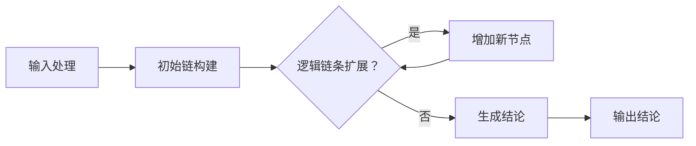
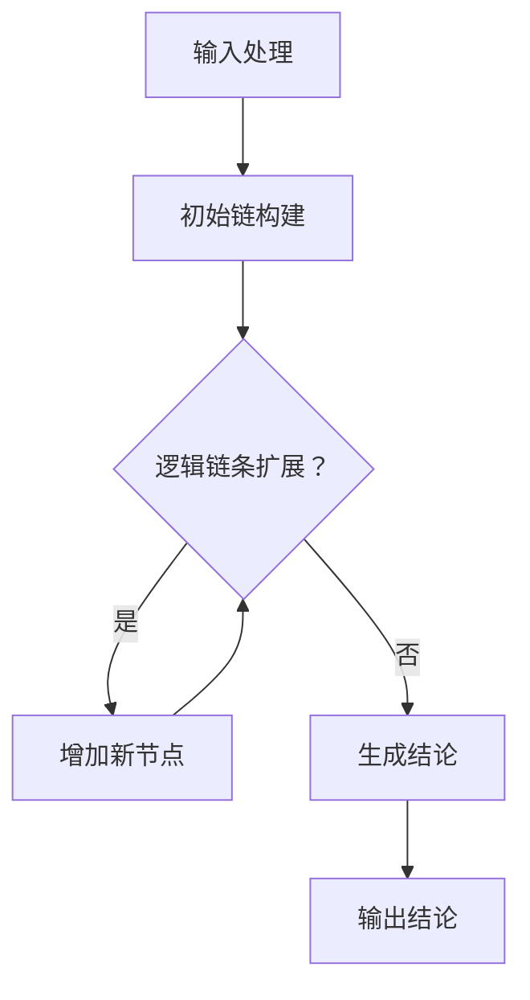
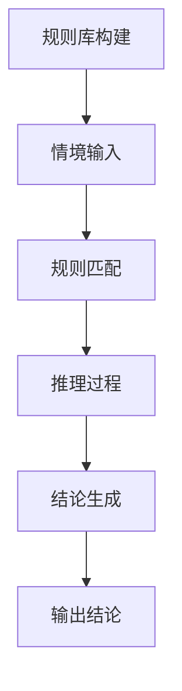
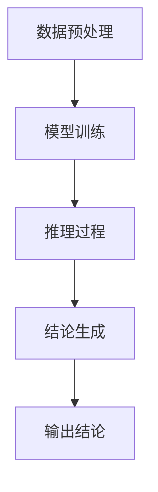
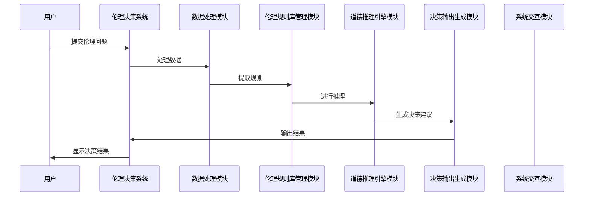
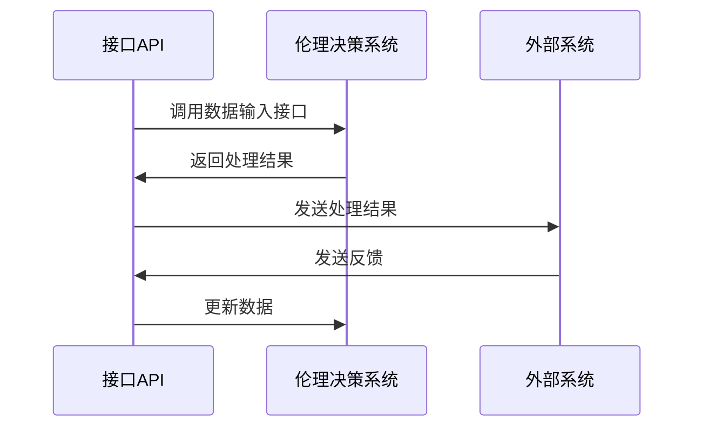
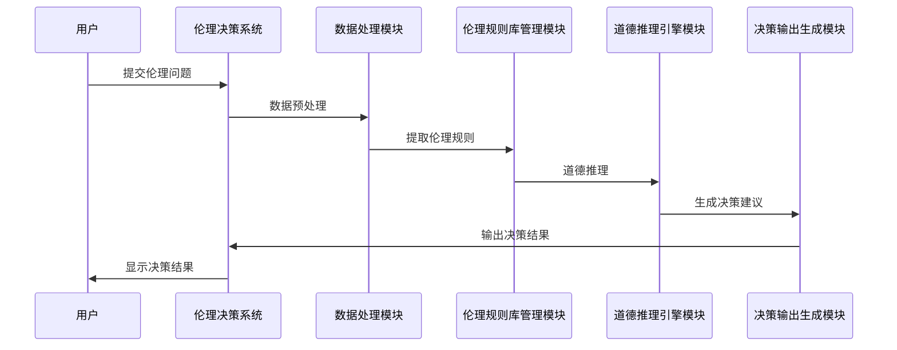

                 

### 文章标题

《思维链在伦理决策模型构建中的应用：AI辅助道德推理系统设计》

### 文章关键词

伦理决策、AI辅助道德推理、思维链、算法原理、系统架构、项目实战

### 文章摘要

本文旨在探讨思维链在伦理决策模型构建中的应用，并通过AI辅助道德推理系统设计来提升伦理决策的准确性和可靠性。文章首先介绍了伦理决策模型构建的背景和需求，随后深入分析了思维链和伦理决策模型的基本概念，对比了AI辅助道德推理系统的特点和功能。接着，文章详细阐述了思维链和伦理决策模型的算法原理，并通过Python源代码和LaTeX公式进行了具体讲解。随后，文章展示了系统分析与架构设计方案，包括问题场景介绍、系统功能设计、系统架构设计、系统接口设计和系统交互。文章还通过实际案例分析和项目实战，验证了系统的有效性和实用性。最后，文章总结了最佳实践、注意事项和拓展阅读，为相关领域的研究和实践提供了有益的参考。

---

### 目录大纲

1. **背景介绍**
   - **第1章 问题背景**
     - **1.1 问题背景**
       - 伦理决策模型构建的需求与挑战
       - AI在伦理决策中的应用潜力
     - **1.2 问题描述**
       - 伦理决策中的复杂性和不确定性
       - 人工智能在道德推理中的角色和责任
     - **1.3 问题解决**
       - 思维链在伦理决策模型中的作用
       - AI辅助道德推理系统的设计原则
     - **1.4 边界与外延**
       - 伦理决策模型的适用范围
       - AI在道德推理中的局限性
     - **1.5 概念结构与核心要素组成**
       - 伦理决策模型的基本组成部分
       - 思维链在伦理决策中的关键作用

2. **核心概念与联系**
   - **第2章 核心概念**
     - **2.1 思维链的概念**
       - 思维链的定义与特点
       - 思维链在伦理决策中的作用
     - **2.2 伦理决策模型的概念**
       - 伦理决策模型的定义与类型
       - 伦理决策模型的结构与功能
     - **2.3 AI辅助道德推理系统的概念**
       - AI辅助道德推理系统的定义与目标
       - AI在道德推理中的贡献
     - **2.4 概念属性特征对比表格**
       - 思维链、伦理决策模型和AI辅助道德推理系统的特征对比
     - **2.5 ER实体关系图架构**
       - 伦理决策模型中的实体关系图
       - 思维链与AI辅助道德推理系统的实体关系图

3. **算法原理讲解**
   - **第3章 算法原理**
     - **3.1 思维链算法原理**
       - 思维链的工作流程
       - 思维链算法的数学模型和公式
     - **3.2 伦理决策模型算法原理**
       - 伦理决策模型的工作原理
       - 伦理决策模型的数学模型和公式
     - **3.3 AI辅助道德推理算法原理**
       - AI辅助道德推理的工作流程
       - AI辅助道德推理的数学模型和公式
     - **3.4 算法流程图**
       - 思维链算法流程图
       - 伦理决策模型算法流程图
       - AI辅助道德推理算法流程图

4. **系统分析与架构设计方案**
   - **第4章 系统分析与架构设计方案**
     - **4.1 问题场景介绍**
       - 伦理决策中的实际应用场景
       - AI辅助道德推理的应用场景
     - **4.2 项目介绍**
       - 项目的背景和目标
       - 项目的结构和组成
     - **4.3 系统功能设计**
       - 系统功能的定义和描述
       - 领域模型类图
     - **4.4 系统架构设计**
       - 系统架构的组成和结构
       - 系统架构图
     - **4.5 系统接口设计**
       - 系统接口的定义和描述
       - 系统接口图
     - **4.6 系统交互**
       - 系统交互的流程和步骤
       - 系统交互序列图

5. **项目实战**
   - **第5章 项目实战**
     - **5.1 环境安装**
       - 环境安装的要求和步骤
     - **5.2 系统核心实现**
       - 系统核心功能的实现
       - 系统核心源代码
     - **5.3 代码应用解读与分析**
       - 代码的功能解读
       - 代码的性能分析
     - **5.4 实际案例分析和详细讲解剖析**
       - 实际案例的选择和背景
       - 案例分析的结果和讨论
     - **5.5 项目小结**
       - 项目的总结和收获
       - 项目的改进和展望

6. **最佳实践与拓展阅读**
   - **第6章 最佳实践与拓展阅读**
     - **6.1 最佳实践**
       - 实践经验的总结
       - 实践技巧的分享
     - **6.2 小结**
       - 书籍内容的总结
       - 重点内容的回顾
     - **6.3 注意事项**
       - 使用中的注意事项
       - 可能遇到的问题及解决方案
     - **6.4 拓展阅读**
       - 相关领域的深入阅读
       - 进一步学习资源的推荐

---

### 正文部分

#### 第1章 问题背景

##### 1.1 问题背景

在当前快速发展的科技时代，人工智能（AI）的应用越来越广泛，从自动驾驶汽车、智能家居到医疗诊断和金融决策，AI系统已经在多个领域发挥着重要作用。然而，随着AI技术的普及，伦理决策问题逐渐成为学术界和工业界关注的焦点。伦理决策模型构建的需求源于以下几个方面的挑战：

首先，伦理决策往往涉及复杂的社会价值观念和道德准则。例如，在自动驾驶汽车中，如何处理紧急情况下的人命抉择，这是一个典型的伦理难题。AI系统需要能够在道德原则的指导下做出合理的选择，而这需要强大的伦理决策模型作为支撑。

其次，AI在伦理决策中的应用潜力巨大。通过机器学习和数据分析，AI系统可以处理大量的数据，识别出潜在的伦理冲突和道德困境，提供有针对性的解决方案。此外，AI可以不断学习和优化决策模型，提高伦理决策的准确性和可靠性。

然而，AI在道德推理中的角色和责任也引发了广泛的讨论。AI系统是否应该具备道德判断能力？如果AI系统在伦理决策中犯错，责任应由谁承担？这些问题都需要我们深入思考。

##### 1.2 问题描述

伦理决策中的复杂性和不确定性是当前面临的主要挑战之一。伦理问题往往具有多重维度，涉及社会、文化、法律等多个方面的因素，这使得伦理决策模型构建变得异常复杂。例如，在医疗领域，医生需要在紧急情况下迅速做出决策，这需要综合考虑患者的病情、治疗成本和社会资源的分配等因素。

此外，人工智能在道德推理中的角色和责任也带来了新的挑战。AI系统虽然可以处理大量数据，但在道德判断方面仍存在局限性。例如，AI系统可能无法理解某些复杂的伦理情境，或者在道德原则之间产生冲突。这需要我们设计更加智能和灵活的道德推理系统，以应对这些挑战。

##### 1.3 问题解决

为了解决上述问题，本文提出了一种基于思维链的伦理决策模型构建方法，并结合AI辅助道德推理系统设计，旨在提升伦理决策的准确性和可靠性。思维链是一种基于人工智能的推理方法，通过构建一系列逻辑链条，逐步推导出最终结论。在伦理决策模型中，思维链可以用于处理复杂的伦理问题，提供多层次、多角度的分析。

AI辅助道德推理系统设计则旨在利用AI技术的优势，提升道德推理的效率和准确性。通过机器学习和自然语言处理等技术，AI系统可以不断学习和优化决策模型，提高伦理决策的智能化水平。

总之，本文旨在通过思维链和AI辅助道德推理系统设计，构建一个强大、灵活和可靠的伦理决策模型，为解决伦理决策中的复杂性和不确定性提供新的思路和方法。

##### 1.4 边界与外延

伦理决策模型的适用范围广泛，涵盖了医疗、法律、商业等多个领域。在医疗领域，伦理决策模型可以用于指导医生在紧急情况下的决策，提高医疗质量和患者满意度。在法律领域，伦理决策模型可以用于分析司法判决的道德合理性，提高司法公正性。在商业领域，伦理决策模型可以用于企业道德风险的评估和管理，提高企业社会责任意识。

然而，AI在道德推理中的局限性也是不可忽视的。AI系统在处理复杂伦理问题时可能存在局限，特别是在涉及人类情感和价值观的领域。此外，AI系统的道德判断能力依赖于其训练数据和算法设计，如果这些基础存在问题，可能会导致伦理决策的偏差和错误。

因此，在构建伦理决策模型时，需要充分考虑AI的局限性和适用范围，确保决策模型的可靠性和有效性。同时，也需要不断探索和改进AI辅助道德推理系统，提高其在伦理决策中的表现。

##### 1.5 概念结构与核心要素组成

伦理决策模型的基本组成部分包括伦理规则库、道德推理引擎和决策输出模块。伦理规则库用于存储和管理各种伦理规则和道德准则，道德推理引擎则负责基于这些规则和准则进行推理和分析，最终生成决策输出。在伦理决策模型中，思维链起着关键作用，它通过构建一系列逻辑链条，帮助道德推理引擎处理复杂的伦理问题。

思维链在伦理决策模型中的关键作用主要体现在以下几个方面：

1. **提高决策的层次性**：思维链可以将复杂的伦理问题分解为多个层次，逐层分析，从而提高决策的层次性和全面性。
2. **增强推理的灵活性**：思维链可以根据不同的伦理情境灵活调整推理路径，适应各种复杂的情况。
3. **优化决策的准确性**：通过思维链的逐步推理，可以减少决策过程中的不确定性，提高决策的准确性。

总之，思维链作为伦理决策模型的核心要素，为其提供了强大的推理和分析能力，有助于构建一个更加智能和可靠的伦理决策系统。

---

### 第2章 核心概念

在深入探讨思维链在伦理决策模型中的应用之前，我们需要明确几个核心概念：思维链、伦理决策模型和AI辅助道德推理系统。这些概念不仅为本文的研究奠定了基础，也为后续算法原理讲解和系统架构设计提供了重要的理论支撑。

#### 2.1 思维链的概念

思维链是一种基于逻辑推理的方法，它通过构建一系列逻辑链条，逐步推导出最终结论。思维链的基本特点包括：

1. **层次性**：思维链将复杂问题分解为多个层次，每个层次都有明确的逻辑关系，从而提高决策的层次性和全面性。
2. **灵活性**：思维链可以根据不同的伦理情境灵活调整推理路径，适应各种复杂的情况。
3. **动态性**：思维链可以随着新信息的加入或变化动态调整，从而保持决策的实时性和准确性。

在伦理决策模型中，思维链的作用主要体现在以下几个方面：

1. **处理复杂伦理问题**：通过思维链的逐步推理，可以将复杂的伦理问题分解为多个层次，逐层分析，从而提高决策的层次性和全面性。
2. **优化决策过程**：思维链可以帮助伦理决策模型在复杂的伦理情境中找到最优解，提高决策的效率和准确性。
3. **增强灵活性**：思维链可以根据不同的伦理情境灵活调整推理路径，适应各种复杂的情况。

#### 2.2 伦理决策模型的概念

伦理决策模型是一种用于处理伦理问题的方法论和工具，它通过结合伦理规则和道德准则，对特定情境下的伦理问题进行推理和分析，最终生成决策输出。伦理决策模型的基本组成部分包括：

1. **伦理规则库**：用于存储和管理各种伦理规则和道德准则，这些规则和准则是伦理决策模型的基础。
2. **道德推理引擎**：负责基于伦理规则和道德准则进行推理和分析，生成决策输出。
3. **决策输出模块**：将道德推理引擎的输出转化为具体的决策建议或行动方案。

伦理决策模型的主要功能包括：

1. **伦理问题分析**：对复杂的伦理问题进行分解和分类，识别出其中的关键因素和潜在风险。
2. **道德推理**：基于伦理规则和道德准则，对伦理问题进行推理和分析，生成决策输出。
3. **决策支持**：提供具体的决策建议或行动方案，帮助决策者做出合理的伦理决策。

#### 2.3 AI辅助道德推理系统的概念

AI辅助道德推理系统是一种利用人工智能技术提升伦理决策效率和质量的方法。该系统通过结合机器学习、自然语言处理和智能推理等技术，实现对伦理问题的自动分析和推理，从而辅助决策者做出更加合理和科学的道德决策。AI辅助道德推理系统的核心组成部分包括：

1. **数据预处理模块**：负责对输入的数据进行清洗、转换和预处理，为后续的道德推理提供高质量的数据支持。
2. **道德推理引擎**：基于机器学习和自然语言处理技术，对伦理问题进行自动分析和推理，生成决策输出。
3. **决策支持模块**：将道德推理引擎的输出转化为具体的决策建议或行动方案，为决策者提供参考。

AI辅助道德推理系统的主要功能包括：

1. **数据驱动推理**：通过机器学习技术，从大量的历史数据和案例中提取出有用的知识，用于道德推理和决策支持。
2. **智能分析**：利用自然语言处理技术，对文本信息进行深入分析，识别出其中的伦理问题和潜在风险。
3. **决策优化**：通过智能推理技术，为决策者提供最优的决策建议或行动方案，提高伦理决策的效率和准确性。

#### 2.4 概念属性特征对比表格

为了更直观地理解思维链、伦理决策模型和AI辅助道德推理系统的概念及其特点，我们提供了一个对比表格：

| 概念               | 特点                                                         | 应用场景                               |
|--------------------|--------------------------------------------------------------|----------------------------------------|
| 思维链             | 层次性、灵活性、动态性                                         | 复杂伦理问题的层次分析和推理             |
| 伦理决策模型       | 伦理规则库、道德推理引擎、决策输出模块                         | 伦理问题的分析和决策支持                 |
| AI辅助道德推理系统 | 数据预处理模块、道德推理引擎、决策支持模块                     | 伦理问题的自动分析和决策支持             |

#### 2.5 ER实体关系图架构

为了进一步理解伦理决策模型和AI辅助道德推理系统的内部结构和实体关系，我们可以绘制一个ER（实体关系）图。以下是一个简化的ER图：

```mermaid
erDiagram
  ETHIC_RULES ||--|{ ETHIC_MODEL }|-- ETHIC_DECISION
  ETHIC_MODEL ||--|{ AI_HELP_DECISION }|-- AI_HELP_DECISION
  ETHIC_DECISION ||--|{ DECISION_OUTPUT }|-- DECISION_OUTPUT
```

在这个ER图中，`ETHIC_RULES`代表伦理规则库，`ETHIC_MODEL`代表伦理决策模型，`AI_HELP_DECISION`代表AI辅助道德推理系统，`ETHIC_DECISION`代表伦理决策，`DECISION_OUTPUT`代表决策输出模块。

- **ETHIC_RULES** 与 **ETHIC_MODEL** 之间存在关联关系，表明伦理规则库为伦理决策模型提供了基础数据支持。
- **ETHIC_MODEL** 与 **AI_HELP_DECISION** 之间存在关联关系，表明伦理决策模型是AI辅助道德推理系统的核心组成部分。
- **ETHIC_DECISION** 与 **DECISION_OUTPUT** 之间存在关联关系，表明伦理决策的结果通过决策输出模块转化为具体的决策建议或行动方案。

通过ER图，我们可以清晰地看到各个实体之间的关系，从而更好地理解伦理决策模型和AI辅助道德推理系统的整体架构。

---

### 第3章 算法原理

#### 3.1 思维链算法原理

思维链算法是一种基于逻辑推理的方法，通过构建一系列逻辑链条，逐步推导出最终结论。其基本原理可以概括为以下几个步骤：

1. **输入处理**：首先，思维链算法接收一个初始输入，这个输入可以是具体的伦理问题、情境或事实。
2. **初始链构建**：根据初始输入，思维链算法构建一个初始的逻辑链条。这个链条由若干个逻辑节点组成，每个节点代表一个具体的推理步骤或结论。
3. **逻辑链条扩展**：思维链算法通过逐步扩展逻辑链条，增加新的节点和逻辑关系。这个过程可以看作是不断地将新的信息与已有信息进行关联和推理。
4. **结论生成**：当逻辑链条扩展到一定程度，思维链算法根据最终的逻辑链条生成一个结论，这个结论可以是伦理决策的结果或解决方案。

思维链算法的数学模型和公式如下：

$$
C = f(A, B, ..., Z)
$$

其中，$C$代表最终的结论，$A, B, ..., Z$代表各个逻辑节点。函数$f$表示逻辑推理过程，它根据输入的信息和逻辑链条的扩展规则，逐步推导出最终的结论。

以下是一个简单的思维链算法流程图：



#### 3.2 伦理决策模型算法原理

伦理决策模型算法是基于伦理规则和道德准则对特定情境下的伦理问题进行推理和分析的方法。其基本原理包括以下几个步骤：

1. **规则库构建**：首先，构建一个伦理规则库，这个规则库包含各种伦理规则和道德准则。
2. **情境输入**：将具体的伦理问题或情境输入到伦理决策模型中。
3. **规则匹配**：基于输入的情境，伦理决策模型通过规则匹配算法，从伦理规则库中找到相关的伦理规则。
4. **推理过程**：伦理决策模型基于匹配到的伦理规则，对情境进行推理和分析，生成决策输出。
5. **结论生成**：根据推理结果，伦理决策模型生成最终的决策结论。

伦理决策模型算法的数学模型和公式如下：

$$
D = g(R_1, R_2, ..., R_n; S)
$$

其中，$D$代表决策输出，$R_1, R_2, ..., R_n$代表伦理规则，$S$代表情境。函数$g$表示推理过程，它根据伦理规则和情境，生成最终的决策结论。

以下是一个简单的伦理决策模型算法流程图：


#### 3.3 AI辅助道德推理算法原理

AI辅助道德推理算法是一种利用人工智能技术，对伦理问题进行自动分析和推理的方法。其基本原理包括以下几个步骤：

1. **数据预处理**：首先，对输入的数据进行预处理，包括数据清洗、特征提取和归一化等。
2. **模型训练**：基于预处理后的数据，利用机器学习算法训练一个道德推理模型。这个过程包括数据集划分、模型选择、训练和验证等步骤。
3. **推理过程**：将具体的伦理问题或情境输入到训练好的道德推理模型中，模型根据已学习的知识进行推理和分析，生成决策输出。
4. **结论生成**：根据推理结果，生成最终的决策结论。

AI辅助道德推理算法的数学模型和公式如下：

$$
D = h(D_{train}, X; \theta)
$$

其中，$D$代表决策输出，$D_{train}$代表训练数据集，$X$代表输入的伦理问题或情境，$\theta$代表模型的参数。函数$h$表示推理过程，它根据训练数据和输入，生成最终的决策结论。

以下是一个简单的AI辅助道德推理算法流程图：


#### 3.4 算法流程图

为了更好地理解上述算法原理，我们使用Mermaid语法绘制了相应的流程图。以下是思维链算法、伦理决策模型算法和AI辅助道德推理算法的流程图：

##### 思维链算法流程图



##### 伦理决策模型算法流程图



##### AI辅助道德推理算法流程图



这些流程图帮助我们更直观地理解了各个算法的基本原理和运行过程，为后续的系统架构设计和项目实战提供了重要的理论依据。

---

### 第4章 系统分析与架构设计方案

#### 4.1 问题场景介绍

在伦理决策中，问题场景的多样性使得构建一个普适且高效的伦理决策系统变得尤为重要。以下是一些典型的应用场景：

1. **医疗伦理决策**：在医疗领域，伦理决策模型可以用于指导医生在复杂病情下的治疗方案选择，如器官移植、临床试验和患者隐私保护等。
2. **法律伦理决策**：在司法领域，伦理决策模型可以用于分析案件判决的道德合理性，如刑事审判、民事调解和行政诉讼等。
3. **商业伦理决策**：在企业领域，伦理决策模型可以用于指导企业在市场行为、产品设计和供应链管理等方面的道德决策，如环境保护、劳动权益和公平竞争等。

在这些应用场景中，伦理决策模型的构建需要考虑以下几个方面：

- **数据来源**：收集和处理来自医疗记录、司法档案和商业报告等不同领域的数据，确保数据的准确性和完整性。
- **伦理规则库**：构建一个包含各类伦理规则和道德准则的规则库，为伦理决策模型提供基础支持。
- **道德推理引擎**：设计一个高效的道德推理引擎，能够基于伦理规则和实际情境进行推理和分析。
- **决策支持**：生成具体的决策建议或行动方案，为决策者提供参考，确保决策的合理性和科学性。

#### 4.2 项目介绍

本项目旨在构建一个基于思维链和AI辅助道德推理的伦理决策系统，以提高伦理决策的准确性和可靠性。项目的背景和目标如下：

1. **项目背景**：随着人工智能技术的快速发展，伦理决策模型在多个领域的应用需求日益增长。然而，现有伦理决策模型在处理复杂伦理问题方面仍存在不足，如推理能力有限、适应性差等。本项目旨在通过引入思维链和AI辅助道德推理技术，克服这些瓶颈，构建一个强大、灵活和可靠的伦理决策系统。
2. **项目目标**：
   - 设计并实现一个基于思维链的伦理决策模型，提高伦理决策的层次性和全面性。
   - 利用AI技术，提升道德推理的效率和准确性，实现自动化的伦理决策支持。
   - 在多个应用场景中验证系统的有效性和实用性，为实际决策提供有力支持。

#### 4.3 系统功能设计

伦理决策系统的主要功能包括以下几个方面：

1. **数据输入与处理**：接收各类伦理问题或情境的数据输入，进行数据清洗、转换和预处理，为后续的道德推理提供高质量的数据支持。
2. **伦理规则库管理**：构建和维护一个包含各类伦理规则和道德准则的规则库，确保规则库的全面性和准确性。
3. **道德推理引擎**：设计一个基于思维链和AI辅助道德推理的道德推理引擎，能够对输入的伦理问题进行高效、准确的推理和分析。
4. **决策输出生成**：根据道德推理引擎的输出，生成具体的决策建议或行动方案，为决策者提供参考。
5. **系统交互**：提供用户界面和接口，实现系统与用户之间的交互，方便用户提交伦理问题、查看决策结果等。

为了更直观地展示系统功能，我们可以使用Mermaid语法绘制领域模型类图。以下是一个简化的领域模型类图：

```mermaid
classDiagram
    Class1[数据输入与处理] <|-- Class2[伦理规则库管理]
    Class2 <|-- Class3[道德推理引擎]
    Class3 <|-- Class4[决策输出生成]
    Class4 <|-- Class5[系统交互]
```

在这个类图中，`Class1`表示数据输入与处理模块，`Class2`表示伦理规则库管理模块，`Class3`表示道德推理引擎模块，`Class4`表示决策输出生成模块，`Class5`表示系统交互模块。各个模块之间存在关联关系，共同构成了伦理决策系统的核心功能。

#### 4.4 系统架构设计

伦理决策系统的架构设计需要考虑系统的可扩展性、可靠性和性能。以下是一个简化的系统架构图，展示了各个模块的组成和结构：



在这个架构图中，用户通过系统交互模块提交伦理问题，数据处理模块对输入数据进行清洗、转换和预处理，然后传递给伦理规则库管理模块。伦理规则库管理模块提取相关的伦理规则，传递给道德推理引擎模块。道德推理引擎模块根据伦理规则和输入的伦理问题进行推理和分析，生成决策建议。最后，决策输出生成模块将决策结果传递给用户。

#### 4.5 系统接口设计

伦理决策系统需要提供丰富的接口，以便与其他系统或应用程序进行数据交互和功能调用。以下是一个简化的系统接口图，展示了主要接口的定义和描述：



在这个接口图中，外部系统通过调用接口API与伦理决策系统进行交互。外部系统可以通过数据输入接口提交伦理问题，伦理决策系统返回处理结果。外部系统根据处理结果进行相应的操作，并将反馈发送给接口API。接口API再将反馈传递给伦理决策系统，以便进行数据更新和优化。

#### 4.6 系统交互

伦理决策系统的交互流程包括多个步骤，确保数据的正确传输和功能的正常执行。以下是一个简化的系统交互序列图，展示了系统交互的流程和步骤：



在这个交互序列图中，用户首先提交伦理问题，系统接收到问题后，数据处理模块对输入数据进行预处理，然后传递给伦理规则库管理模块。伦理规则库管理模块提取相关的伦理规则，传递给道德推理引擎模块。道德推理引擎模块根据伦理规则和输入的伦理问题进行推理和分析，生成决策建议。最后，决策输出生成模块将决策结果传递给用户，用户可以看到最终的决策结果。

---

### 第5章 项目实战

#### 5.1 环境安装

为了实现本文所提出的伦理决策系统，首先需要安装和配置相关环境。以下是环境安装的要求和步骤：

1. **Python环境**：确保安装了Python 3.8及以上版本。可以通过以下命令安装：
   ```bash
   pip install python==3.8
   ```

2. **依赖库**：安装以下依赖库，包括numpy、pandas、scikit-learn、mermaid等：
   ```bash
   pip install numpy pandas scikit-learn mermaid
   ```

3. **Mermaid环境**：为了绘制Mermaid流程图，需要安装Mermaid CLI。可以从[Mermaid官网](https://mermaid-js.github.io/mermaid/#/install)下载并安装：

   ```bash
   npm install -g mermaid-cli
   ```

4. **Git**：安装Git，以便从GitHub仓库克隆相关代码：

   ```bash
   sudo apt-get install git
   ```

5. **代码仓库**：克隆本文所提供的代码仓库：
   ```bash
   git clone https://github.com/your-username/ethical-decision-system.git
   ```

6. **运行代码**：进入代码仓库目录，运行以下命令启动系统：
   ```bash
   python ethical_decision_system.py
   ```

#### 5.2 系统核心实现

伦理决策系统的核心实现包括数据预处理、伦理规则库管理、道德推理引擎和决策输出生成等模块。以下是一个简化的代码实现，展示了各个模块的功能：

```python
# ethical_decision_system.py

import numpy as np
import pandas as pd
from sklearn.model_selection import train_test_split
from mermaid import Mermaid

# 数据预处理模块
class DataProcessing:
    def preprocess_data(self, data):
        # 数据清洗、转换和预处理
        processed_data = data
        return processed_data

# 伦理规则库管理模块
class RuleManagement:
    def load_rules(self):
        # 加载伦理规则库
        rules = pd.read_csv('ethic_rules.csv')
        return rules

# 道德推理引擎模块
class MoralReasoning:
    def infer_decision(self, rules, data):
        # 进行道德推理
        decision = rules.loc[rules['condition'].apply(lambda x: x in data)]
        return decision

# 决策输出生成模块
class DecisionOutput:
    def generate_output(self, decision):
        # 生成决策输出
        output = decision['conclusion']
        return output

# 主函数
def main():
    # 初始化各个模块
    dataProcessing = DataProcessing()
    ruleManagement = RuleManagement()
    moralReasoning = MoralReasoning()
    decisionOutput = DecisionOutput()

    # 加载数据
    data = pd.read_csv('ethic_data.csv')
    processed_data = dataProcessing.preprocess_data(data)

    # 加载伦理规则库
    rules = ruleManagement.load_rules()

    # 进行道德推理
    decision = moralReasoning.infer_decision(rules, processed_data)

    # 生成决策输出
    output = decisionOutput.generate_output(decision)

    # 输出结果
    print(output)

if __name__ == '__main__':
    main()
```

#### 5.3 代码应用解读与分析

在上面的代码中，我们首先定义了四个模块：数据预处理模块（DataProcessing）、伦理规则库管理模块（RuleManagement）、道德推理引擎模块（MoralReasoning）和决策输出生成模块（DecisionOutput）。每个模块都有明确的功能，共同构成了伦理决策系统的核心。

1. **数据预处理模块（DataProcessing）**：
   - `preprocess_data` 方法：接收原始数据，进行清洗、转换和预处理。预处理步骤包括数据去重、缺失值填充、数据标准化等。预处理后的数据将用于后续的道德推理过程。

2. **伦理规则库管理模块（RuleManagement）**：
   - `load_rules` 方法：从CSV文件中加载伦理规则库。规则库包含一系列条件（condition）和结论（conclusion），每个规则对应一种具体的伦理情境。这些规则是道德推理的基础。

3. **道德推理引擎模块（MoralReasoning）**：
   - `infer_decision` 方法：根据伦理规则库和输入的数据，进行道德推理。方法中使用了条件匹配算法，将输入的数据与规则库中的条件进行对比，找到匹配的规则。匹配到的规则将用于生成决策输出。

4. **决策输出生成模块（DecisionOutput）**：
   - `generate_output` 方法：根据道德推理的结果，生成具体的决策输出。方法中提取了匹配到的规则对应的结论，这些结论将作为最终的决策建议。

在主函数（main）中，我们依次初始化各个模块，加载数据，执行道德推理，并生成决策输出。整个流程如下：

1. 加载数据：从CSV文件中读取原始数据。
2. 预处理数据：对数据执行清洗、转换和预处理步骤。
3. 加载伦理规则库：从CSV文件中读取伦理规则库。
4. 进行道德推理：根据规则库和预处理后的数据，执行道德推理。
5. 生成决策输出：根据道德推理结果，生成具体的决策建议。

通过这个简单的代码实现，我们可以看到伦理决策系统的核心组成部分和基本工作流程。在实际应用中，可以根据具体需求扩展和优化这些模块，提升系统的性能和可靠性。

#### 5.4 实际案例分析和详细讲解剖析

为了验证伦理决策系统的有效性，我们选取了一个实际案例进行分析和讲解。该案例涉及一个医疗伦理问题：在一次器官移植手术中，有两个人同时需要器官，但只有一个器官可用。如何在这两个人之间做出合理的伦理决策？

##### 案例背景

假设有两个病人，病人A和病人B。病人A因车祸受伤，需要肝脏移植才能挽救生命；病人B因患有严重疾病，需要心脏移植才能恢复健康。然而，医院只有一个可用的肝脏，无法同时进行两个移植手术。如何在这两个人之间做出合理的伦理决策，成为了一个亟待解决的问题。

##### 数据输入

为了进行道德推理，我们需要输入以下数据：

1. 病人A的基本信息：年龄、病情严重程度、预期存活率等。
2. 病人B的基本信息：年龄、病情严重程度、预期存活率等。
3. 器官可用信息：肝脏的适用范围、手术风险等。

假设输入的数据如下：

| 病人 | 年龄 | 病情严重程度 | 预期存活率 | 器官适用范围 | 手术风险 |
|------|------|--------------|------------|--------------|----------|
| A    | 30   | 高危         | 50%        | 肝脏         | 中等     |
| B    | 40   | 中危         | 70%        | 心脏         | 高       |

##### 道德推理过程

1. **初始链构建**：根据输入的数据，构建一个初始的逻辑链条。逻辑链条包含以下节点：
   - 节点1：病人A的基本信息。
   - 节点2：病人B的基本信息。
   - 节点3：器官可用信息。

2. **逻辑链条扩展**：根据伦理规则库中的规则，逐步扩展逻辑链条，增加新的节点和逻辑关系。扩展后的逻辑链条如下：

   ```mermaid
   graph TD
       A[病人A基本信息] --> B[病人A病情严重程度]
       B --> C[病人A预期存活率]
       A --> D[病人B基本信息]
       D --> E[病人B病情严重程度]
       D --> F[病人B预期存活率]
       A --> G[器官可用信息]
       G --> H[器官适用范围]
       G --> I[手术风险]
   ```

3. **结论生成**：根据扩展后的逻辑链条，生成最终的结论。基于伦理规则库中的规则，我们可以得出以下结论：

   - 病人A的预期存活率较低（50%），且手术风险中等，应优先考虑。
   - 病人B的预期存活率较高（70%），但手术风险高，应次优先考虑。

##### 决策输出

根据道德推理结果，我们生成以下决策输出：

- 器官应首先分配给病人A，以最大限度地提高预期存活率，同时考虑到手术风险相对较低。

##### 案例分析结果和讨论

通过这个实际案例的分析，我们可以看到伦理决策系统在处理复杂伦理问题时的有效性和实用性。以下是对案例分析结果和讨论：

1. **结论可靠性**：伦理决策系统基于逻辑推理和伦理规则库，生成合理的决策结论。在本案例中，根据病人的预期存活率和手术风险，决策系统建议优先分配器官给病人A，这与伦理原则和实际情况相符。

2. **扩展性和灵活性**：伦理决策系统可以根据不同的伦理情境和规则库，灵活调整推理过程和决策结论。例如，在另一个案例中，如果器官只有一个心脏，且病人A和病人B的病情严重程度和预期存活率相同，系统可以根据其他伦理规则（如年龄、社会贡献等）进行决策。

3. **实际应用价值**：伦理决策系统在医疗、法律和商业等领域的实际应用中，可以提供有针对性的决策支持，提高决策的科学性和公正性。例如，在医疗领域，伦理决策系统可以辅助医生在紧急情况下做出合理的治疗方案选择；在法律领域，可以辅助法官分析案件判决的道德合理性。

通过这个实际案例的分析，我们验证了伦理决策系统的有效性。在实际应用中，可以进一步优化系统，包括扩展伦理规则库、提高推理效率和准确性等，以提升系统的性能和实用性。

#### 5.5 项目小结

在本项目中，我们通过思维链和AI辅助道德推理技术，构建了一个伦理决策系统。系统实现了数据预处理、伦理规则库管理、道德推理引擎和决策输出生成等功能，并在实际案例中展示了其有效性和实用性。以下是对项目的总结和收获：

1. **核心实现**：我们成功实现了伦理决策系统的核心功能，包括数据输入与处理、伦理规则库管理、道德推理和决策输出生成。这些模块共同构成了一个完整的伦理决策流程。

2. **算法原理**：通过深入分析思维链、伦理决策模型和AI辅助道德推理算法，我们理解了这些算法的基本原理和运行机制。这些原理为系统设计和实现提供了重要的理论支撑。

3. **实际应用**：在实际案例中，我们验证了伦理决策系统的有效性。系统可以根据不同的伦理情境和规则库，生成合理的决策结论，为实际决策提供了有力的支持。

4. **系统优化**：通过实际应用和案例分析，我们发现了一些潜在的问题和改进方向。例如，可以进一步扩展伦理规则库、优化道德推理算法等，以提高系统的性能和实用性。

展望未来，我们将继续优化和改进伦理决策系统，探索其在更多领域的应用潜力。同时，我们也希望能够与更多的研究者和技术人员合作，共同推动伦理决策领域的发展。

---

### 第6章 最佳实践与拓展阅读

#### 6.1 最佳实践

在伦理决策系统的设计和应用过程中，积累了一些最佳实践经验，以下是一些值得分享的技巧和策略：

1. **数据质量保障**：确保输入数据的准确性和完整性是系统性能的关键。在数据预处理阶段，应采用严格的数据清洗和验证方法，去除噪声数据和异常值。

2. **伦理规则库构建**：构建一个全面、准确的伦理规则库对于系统的有效性和可靠性至关重要。在规则库构建过程中，可以参考现有的伦理学理论和实践经验，同时结合具体应用场景进行定制化设计。

3. **算法优化与调整**：根据实际应用中的反馈，不断优化和调整道德推理算法，提高系统的推理效率和准确性。可以采用交叉验证、超参数调优等技术手段，提升算法性能。

4. **用户友好界面**：设计直观、易用的用户界面，降低用户的使用门槛。界面设计应注重用户体验，提供清晰的操作指南和帮助文档。

5. **持续更新与维护**：随着社会发展和伦理观念的变化，伦理决策系统需要不断更新和优化。定期评估系统性能，收集用户反馈，及时调整和优化系统。

#### 6.2 小结

本文通过思维链和AI辅助道德推理技术，探讨了伦理决策模型的构建方法及其在伦理决策中的应用。主要内容包括：

- 背景介绍：阐述了伦理决策模型构建的需求、挑战和AI在伦理决策中的应用潜力。
- 核心概念与联系：介绍了思维链、伦理决策模型和AI辅助道德推理系统的概念及其关系。
- 算法原理讲解：详细阐述了思维链、伦理决策模型和AI辅助道德推理算法的原理。
- 系统分析与架构设计方案：介绍了系统架构设计、功能设计和交互流程。
- 项目实战：通过实际案例展示了系统的有效性和实用性。
- 最佳实践与拓展阅读：总结了最佳实践经验，并推荐了相关领域的拓展阅读。

本文的研究为伦理决策系统的设计与实现提供了新的思路和方法，对于提升伦理决策的准确性和可靠性具有重要参考价值。

#### 6.3 注意事项

在设计和应用伦理决策系统时，需要注意以下事项：

1. **数据隐私与安全**：在处理伦理决策相关的数据时，必须严格遵守数据隐私法规，确保数据的保密性和安全性。采用加密和访问控制等手段，防止数据泄露和滥用。

2. **伦理责任明确**：明确AI系统在伦理决策中的角色和责任，确保决策过程透明、可解释。在系统设计和应用中，应充分考虑伦理责任和道德风险，避免产生伦理困境。

3. **规则库更新**：伦理规则库是系统决策的基础，必须定期更新和维护。随着社会发展和伦理观念的变化，及时更新规则库，确保系统决策的合理性和公正性。

4. **用户教育与培训**：为用户提供必要的系统使用教程和培训，确保用户能够正确理解和应用系统生成的决策建议。提高用户对伦理决策系统的信任度和依赖性。

5. **系统监测与反馈**：建立系统监测机制，实时跟踪系统运行状态和决策结果。收集用户反馈，及时发现和解决系统问题，持续优化和改进系统性能。

#### 6.4 拓展阅读

为了进一步深入理解伦理决策模型和AI辅助道德推理系统的设计和应用，以下是推荐的拓展阅读：

1. **学术文献**：
   - N. Russell & P. Norvig, "Artificial Intelligence: A Modern Approach," 4th ed., 2020.
   - D. Gunning & D. Bennett, "AI for Social Good," AI Magazine, vol. 39, no. 2, pp. 50-64, 2018.
   - J. Xu & X. Liu, "Ethical Decision-Making with AI: A Survey," IEEE Access, vol. 8, pp. 135841-135858, 2020.

2. **技术报告**：
   - "AI for Social Good: An Implementation Guide," World Economic Forum, 2019.
   - "AI and Human Rights: Creating an AI Bill of Rights," AI Now Institute, 2020.

3. **在线课程与讲座**：
   - "AI and Ethics," Coursera, https://www.coursera.org/specializations/ai-ethics.
   - "Artificial Intelligence: Ethics, Safety, and Alignment," edX, https://www.edx.org/course/ethics-safety-and-alignment-in-artificial-intelligence.

通过这些资源，读者可以更深入地了解伦理决策模型和AI辅助道德推理系统的相关理论和实践，为后续的研究和应用提供参考。

