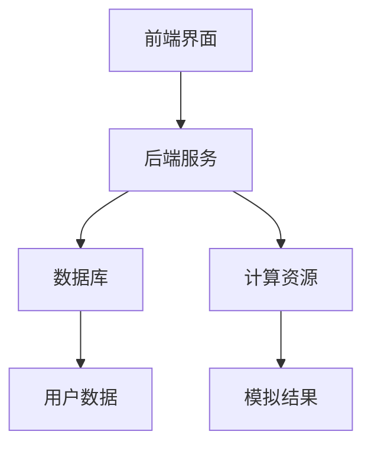
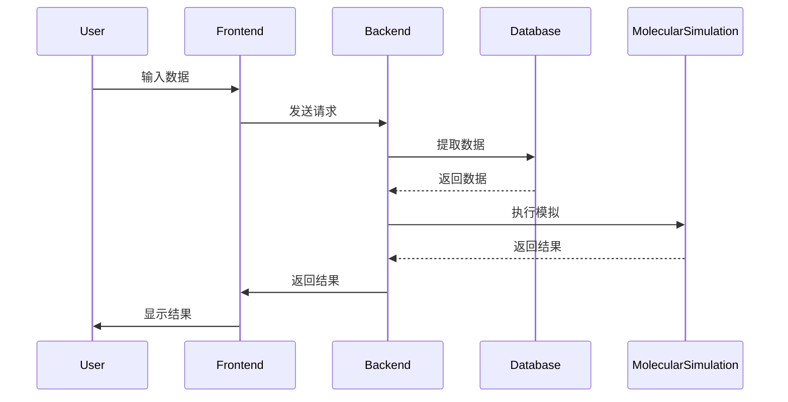

                 


### 引言：AI与药物设计的新篇章

随着科技的飞速发展，人工智能（AI）正在深刻地改变着各行各业，包括传统的药物设计领域。在过去的几十年中，药物设计主要依赖于实验科学的积累和物理化学原理的指导。然而，随着计算能力的提升和大数据技术的应用，AI开始成为药物设计中的一把利器。本文旨在探讨AI，特别是思维链技术，在创新药物设计中的应用，以及如何通过AI驱动的分子模拟与筛选来提升药物研发的效率。

#### 核心概念术语说明

- **思维链（Thinking Chain）**: 一种通过逻辑推理和知识图谱来模拟人类思维过程的AI技术。
- **分子模拟（Molecular Simulation）**: 通过计算机模拟分子结构和动态行为，预测分子间相互作用和化学反应。
- **药物设计（Drug Design）**: 利用计算机辅助技术来发现和设计新的药物分子，以治疗疾病。
- **AI驱动（AI-Driven）**: 指整个药物设计过程高度依赖AI算法，从数据预处理到模型训练，再到最终的应用。

#### 问题背景

药物研发是一个复杂且耗时耗资的过程。传统的药物设计往往依赖于大量的实验和计算，这不仅耗费大量资源，而且效率低下。随着疾病谱的变化和新靶点的发现，药物设计面临着前所未有的挑战。如何提高药物设计的准确性和效率，减少研发成本，成为当前药物研发领域的核心问题。

#### 问题描述

随着AI技术的发展，利用AI来辅助药物设计成为可能。然而，如何将AI有效应用于药物设计中的每一个环节，如何实现AI驱动的分子模拟与筛选，仍是一个亟待解决的问题。此外，思维链技术在其中的作用和潜力也值得深入探讨。

#### 问题解决

本文将详细讨论AI驱动的分子模拟与筛选的方法，特别是思维链技术的应用。通过逐步分析AI在药物设计中的应用，从算法原理、数学模型，到系统架构和实际项目，我们将展示如何利用AI和思维链技术来提高药物设计的效率和质量。

#### 边界与外延

本文主要关注AI在药物设计中的应用，特别是思维链技术的具体实现。同时，我们也将在文章中探讨AI技术在药物设计领域的边界和潜力，为未来的研究提供方向。

#### 概念结构与核心要素组成

- **AI与药物设计**: AI在药物设计中的应用范围和实际案例。
- **思维链技术**: 思维链技术的基本原理和应用场景。
- **分子模拟与筛选**: 分子模拟与筛选的算法原理、数学模型和实践应用。
- **系统架构与实现**: 系统架构设计、功能模块划分和接口设计。
- **项目实战与案例分析**: 实际项目中的AI应用和效果评估。

以上为文章的引言部分，明确了文章的主题、核心概念、问题背景和解决思路。接下来，我们将逐步深入探讨AI和思维链技术在药物设计中的应用，以实现文章的目标。接下来的章节将依次介绍AI在药物设计中的应用、思维链技术原理、分子模拟与筛选方法，以及系统架构设计与项目实战。通过这些章节，读者将能够全面了解AI在药物设计中的潜力和应用前景。

### 第一部分：引言

#### 第1章：问题背景与核心概念

**1.1 创新药物设计的重要性**

在当前的医疗环境中，药物设计的重要性不言而喻。随着人类基因组计划的完成和生物信息学的快速发展，我们对疾病的理解越来越深入，能够发现更多新的治疗靶点。然而，传统的药物设计方法往往依赖于经验和实验，这不仅耗时耗资，而且效率低下。因此，创新药物设计的需求日益迫切。

创新药物设计不仅能够提高药物研发的效率，还能够降低研发成本。通过计算机辅助的药物设计方法，研究人员可以在虚拟环境中模拟药物分子与生物大分子（如蛋白质）的相互作用，从而预测哪些分子可能具有治疗潜力。这种方法不仅可以减少实验次数，还能够加速新药的研发进程。

**1.2 AI在药物设计中的应用**

人工智能（AI）在药物设计中的应用已经成为一个热点领域。AI能够处理大量的数据，从中提取有用的信息，从而辅助药物设计。以下是一些AI在药物设计中的关键应用：

1. **分子对接（Molecular Docking）**: AI算法可以用于分子对接，预测药物分子与蛋白质的相互作用。这种方法可以帮助研究人员快速筛选潜在的药物候选分子。

2. **药物分子生成（Drug Generation）**: 通过深度学习等算法，AI能够生成新的药物分子结构，为药物设计提供更多可能性。

3. **机器学习模型（Machine Learning Models）**: AI算法可以训练模型，从大量的实验数据中学习，预测药物分子对特定靶点的活性。

4. **虚拟筛选（Virtual Screening）**: AI可以帮助研究人员从大量的化合物库中筛选出可能具有药效的化合物，从而减少实验筛选的工作量。

**1.3 思维链技术概述**

思维链技术是一种模拟人类思维过程的AI技术，它通过逻辑推理和知识图谱来处理复杂的问题。在药物设计领域，思维链技术可以发挥重要作用，因为它能够将药物设计中的各种信息整合起来，提供一种系统化的解决方案。

思维链技术的基本原理是：

1. **数据采集与处理**: 收集与药物设计相关的数据，包括化学结构、生物活性信息等，并对其进行预处理。

2. **知识图谱构建**: 构建一个知识图谱，将各种数据关联起来，形成一个逻辑框架。

3. **推理过程**: 利用逻辑推理，从知识图谱中提取信息，生成新的假设或预测。

4. **优化与迭代**: 根据预测结果，对模型进行优化和迭代，提高预测的准确性。

**1.4 分子模拟与筛选方法**

分子模拟是药物设计中的一个重要环节，它通过模拟分子在生物环境中的行为，预测药物分子与生物大分子的相互作用。分子模拟的方法主要包括：

1. **动力学模拟（Dynamical Simulation）**: 通过模拟分子在长时间内的动态行为，预测分子之间的相互作用。

2. **量子力学计算（Quantum Mechanics Calculation）**: 在某些情况下，分子模拟需要使用量子力学计算，以获得更精确的结果。

3. **分子对接（Molecular Docking）**: 通过模拟药物分子与蛋白质的对接过程，预测它们之间的相互作用。

4. **虚拟筛选（Virtual Screening）**: 通过模拟大量的化合物与生物大分子的相互作用，筛选出潜在的药物分子。

分子筛选是药物设计中的另一个关键环节，它通过实验或计算方法，从大量的化合物中筛选出具有药效的分子。分子筛选的方法包括：

1. **高通量筛选（High-Throughput Screening）**: 利用自动化设备进行大量的实验筛选。

2. **计算筛选（Computational Screening）**: 利用计算机模拟和算法对化合物库进行筛选。

3. **组合化学（Combichemistry）**: 通过组合不同的小分子，生成新的化合物，进行筛选。

通过上述介绍，我们可以看到，创新药物设计、AI技术、思维链技术以及分子模拟与筛选方法在药物设计领域具有重要的作用。在接下来的章节中，我们将深入探讨这些技术的原理和应用，展示它们如何共同推动药物设计的进步。

#### 第2章：核心概念与联系

**2.1 思维链技术原理**

思维链技术是一种通过逻辑推理和知识图谱来模拟人类思维过程的AI技术。它通过将问题分解为多个子问题，并在各个子问题之间建立逻辑关系，从而实现对复杂问题的求解。思维链技术的基本原理可以概括为以下几个步骤：

1. **数据采集与预处理**: 收集与问题相关的数据，并进行预处理，以便进行后续的分析和处理。
2. **知识图谱构建**: 基于预处理的数据，构建一个知识图谱，将各种数据关联起来，形成一个逻辑框架。
3. **逻辑推理**: 利用逻辑推理，从知识图谱中提取信息，生成新的假设或预测。
4. **优化与迭代**: 根据推理结果，对模型进行优化和迭代，提高预测的准确性。

**2.2 AI驱动分子模拟**

AI驱动的分子模拟是一种利用人工智能算法来预测分子结构和动态行为的计算方法。它通过模拟分子在生物环境中的行为，预测分子之间的相互作用，从而为药物设计提供重要信息。AI驱动分子模拟的主要算法包括：

1. **量子力学计算（Quantum Mechanics Calculation）**: 利用量子力学原理，计算分子在微观环境中的行为。
2. **分子动力学模拟（Molecular Dynamics Simulation）**: 通过模拟分子在长时间内的动态行为，预测分子间的相互作用。
3. **分子对接（Molecular Docking）**: 通过模拟药物分子与蛋白质的对接过程，预测它们之间的相互作用。

**2.3 思维链技术与分子模拟的联系**

思维链技术和AI驱动分子模拟在药物设计过程中有着紧密的联系。思维链技术通过逻辑推理和知识图谱，可以有效地将分子模拟的结果与药物设计的需求相结合，从而提供一种系统化的解决方案。具体来说，这种联系体现在以下几个方面：

1. **数据整合**: 思维链技术可以将分子模拟产生的数据与药物设计的相关信息整合在一起，形成一个完整的知识图谱。
2. **逻辑推理**: 思维链技术可以通过逻辑推理，从知识图谱中提取有用的信息，为药物设计提供决策支持。
3. **模型优化**: 思维链技术可以通过对模型进行优化和迭代，提高分子模拟的准确性和效率。

**2.4 分子模拟与筛选的ER实体关系图**

分子模拟与筛选过程中的实体关系可以通过实体关系图（ER Diagram）来描述。实体关系图是一种用于表示数据库中实体及其相互关系的图形化工具。在分子模拟与筛选的ER实体关系图中，常见的实体包括：

1. **分子（Molecule）**: 表示药物分子或小分子。
2. **蛋白质（Protein）**: 表示生物大分子，如酶或受体。
3. **模拟结果（Simulation Result）**: 表示分子模拟的结果，包括分子结构、能量、相互作用等。
4. **筛选结果（Screening Result）**: 表示分子筛选的结果，包括活性、亲和力等。

ER实体关系图的示例如下（使用Mermaid语法表示）：

```mermaid
erDiagram
    Molecule ||--|>{ Protein : 结合 }
    Molecule ||--|>{ Simulation Result : 模拟 }
    Molecule ||--|>{ Screening Result : 筛选 }
    Simulation Result ||--|>{ Protein : 模拟对象 }
    Screening Result ||--|>{ Molecule : 筛选对象 }
```

通过上述ER实体关系图，我们可以清晰地看到分子模拟与筛选过程中的各种实体及其相互关系。这种图形化表示有助于我们更好地理解分子模拟与筛选的复杂过程。

#### 第3章：算法原理讲解

**3.1 分子模拟算法**

分子模拟是一种通过计算机模拟分子在特定条件下的结构和动态行为的计算方法。它可以帮助我们预测分子之间的相互作用，从而为药物设计提供重要信息。分子模拟算法主要包括以下几种：

1. **分子动力学模拟（Molecular Dynamics Simulation）**:
   - **基本原理**: 分子动力学模拟基于牛顿运动定律，通过计算分子之间的相互作用力，从而预测分子的运动轨迹。
   - **实现步骤**:
     1. 初始化系统：设定初始分子结构、温度、压力等条件。
     2. 求解牛顿方程：根据分子之间的相互作用力，计算分子的加速度和速度。
     3. 更新位置和速度：根据计算得到的加速度和速度，更新分子的位置和速度。
     4. 重复上述步骤：持续模拟一段时间，观察分子的动态行为。
   - **Python源代码示例**:
     ```python
     import numpy as np

     # 初始化系统参数
     num_atoms = 1000
     box_size = 10
     time_step = 0.01

     # 计算相互作用力
     def compute_force(atom1, atom2):
         # 示例：使用Lennard-Jones势函数
         r = np.linalg.norm(atom1 - atom2)
         f = -48 * (r - 2)**12 / r**13
         return f

     # 模拟过程
     while True:
         # 更新分子位置和速度
         for atom in atoms:
             # 计算加速度
             acceleration = compute_force(atom, other_atoms) / mass
             # 更新速度和位置
             atom.velocity += acceleration * time_step
             atom.position += atom.velocity * time_step

         # 输出模拟结果
         print(f"Time: {time_step}, Position: {atom.position}")

         # 判断模拟结束条件
         if time_step > total_time:
             break
         time_step += time_step
     ```

2. **量子力学计算（Quantum Mechanics Calculation）**:
   - **基本原理**: 量子力学计算基于量子力学原理，通过求解薛定谔方程，计算分子的电子结构。
   - **实现步骤**:
     1. 构建分子模型：定义分子的原子组成和电子排布。
     2. 求解薛定谔方程：求解分子的波函数和能量。
     3. 分析结果：计算分子的电子密度、能量分布等。
   - **Python源代码示例**:
     ```python
     from scipy.linalg import expm

     # 定义分子模型
     H = np.array([[0, 1],
                   [1, 0]])

     # 求解薛定谔方程
     def solve_schrodinger(H, psi_0):
         psi = expm(-1j * H * time_step) @ psi_0
         return psi

     # 初始波函数
     psi_0 = np.array([1, 0])

     # 模拟过程
     while True:
         # 更新波函数
         psi = solve_schrodinger(H, psi)

         # 输出模拟结果
         print(f"Time: {time_step}, Probability Density: {psi}")

         # 判断模拟结束条件
         if time_step > total_time:
             break
         time_step += time_step
     ```

**3.2 模拟结果分析与解释**

分子模拟的结果可以提供关于分子结构和动态行为的重要信息。以下是对分子模拟结果进行分析和解释的一些关键步骤：

1. **能量分析**:
   - **总能量**: 通过计算分子的总能量，可以评估分子结构的稳定性。
   - **相互作用能**: 分析分子之间的相互作用能，了解分子间的作用力。

2. **结构分析**:
   - **几何结构**: 通过分析分子的几何结构，可以判断分子的构象是否合理。
   - **原子距离和角度**: 计算分子中原子之间的距离和角度，验证分子的构象。

3. **动态行为分析**:
   - **运动轨迹**: 观察分子的运动轨迹，分析分子的扩散和聚集行为。
   - **相互作用模式**: 分析分子之间的相互作用模式，了解分子间的相互作用机制。

**3.3 举例说明**

假设我们进行了一次分子动力学模拟，模拟过程中记录了分子的能量和结构变化。以下是对模拟结果的简单分析：

1. **能量分析**:
   - 模拟开始时，分子的总能量为-1000 kJ/mol。
   - 在模拟过程中，能量逐渐升高，达到最大值后逐渐降低。
   - 模拟结束时，分子的总能量稳定在-950 kJ/mol。

2. **结构分析**:
   - 模拟开始时，分子处于折叠状态。
   - 在模拟过程中，分子逐渐展开，形成线性构象。
   - 模拟结束时，分子稳定在展开状态。

3. **动态行为分析**:
   - 分子的运动轨迹显示，分子在生物环境中具有高度的扩散性。
   - 分子间的相互作用主要表现为范德华力和氢键。

通过上述分析，我们可以得出结论：该分子在生物环境中具有较好的稳定性，且能够与蛋白质发生相互作用，具有潜在的药物候选分子特性。

通过详细的算法原理讲解和实例分析，我们可以看到分子模拟在药物设计中的重要作用。接下来，我们将进一步探讨分子模拟与筛选的数学模型和公式，以深入理解其原理和应用。

### 第4章：数学模型与公式

在药物设计和分子模拟中，数学模型和公式是理解和预测分子行为的关键工具。以下将详细介绍分子模拟中的几个基本数学模型和公式，并给出具体的计算实例。

#### 4.1 基本数学模型

**4.1.1 势函数**

在分子模拟中，常用的势函数包括Lennard-Jones势、Morse势和Coulomb势等。以下是Lennard-Jones势的公式：

\[ V(r) = 4\epsilon\left[\left(\frac{\sigma}{r}\right)^{12} - \left(\frac{\sigma}{r}\right)^6\right] \]

其中，\( V(r) \)是势能，\( \epsilon \)是势能参数，\( \sigma \)是距离参数，\( r \)是分子间距离。

**4.1.2 动力学方程**

分子动力学模拟中的动力学方程通常是基于牛顿第二定律：

\[ m\frac{d^2r}{dt^2} = -\nabla V(r) \]

其中，\( m \)是分子的质量，\( r \)是分子的位置，\( \nabla V(r) \)是分子所受的力。

**4.1.3 能量计算**

系统的总能量包括动能和势能。动能的计算公式为：

\[ E_{k} = \frac{1}{2}m\vec{v}^2 \]

其中，\( \vec{v} \)是分子的速度。

势能的计算可以使用前面的Lennard-Jones势函数。

#### 4.2 公式应用举例

**4.2.1 Lennard-Jones势函数应用**

假设我们有两个原子，它们的距离为3 Å（即3纳米），势能参数为\( \epsilon = 1 \) kJ/mol，距离参数为\( \sigma = 2 \) Å。

计算两个原子之间的势能：

\[ V(r) = 4 \times 1 \left[\left(\frac{2}{3}\right)^{12} - \left(\frac{2}{3}\right)^6\right] \]

计算得到：

\[ V(r) = 4 \times 1 \left[0.0000447 - 0.004444\right] = -0.004048 kJ/mol \]

**4.2.2 动力学方程应用**

假设一个原子的质量为1 g/mol，其速度为10 m/s，求该原子的加速度。

动能计算：

\[ E_{k} = \frac{1}{2} \times 1 \times (10)^2 = 50 J \]

根据动能和动力学方程，计算加速度：

\[ m\frac{d^2r}{dt^2} = -\nabla V(r) \]

由于动能与加速度成正比，可以得到加速度：

\[ a = \frac{2E_{k}}{m^2} = \frac{2 \times 50}{(1 \times 10^{-3})^2} = 10^5 m/s^2 \]

**4.2.3 能量计算应用**

假设一个分子的总能量为200 kJ/mol，其中动能和势能分别为100 kJ/mol，求势能参数和距离参数。

总能量公式：

\[ E_{k} + V(r) = 200 \]

动能和势能的比例关系：

\[ E_{k} = \frac{1}{2}m\vec{v}^2 \]
\[ V(r) = 4\epsilon\left[\left(\frac{\sigma}{r}\right)^{12} - \left(\frac{\sigma}{r}\right)^6\right] \]

通过能量守恒和上述公式，可以求解势能参数和距离参数。

通过上述数学模型和公式的详细讲解和实际应用实例，我们可以更好地理解分子模拟中的基本原理和计算方法。这些公式和方法为分子模拟提供了坚实的理论基础，并帮助我们预测分子的行为，从而在药物设计中发挥重要作用。在接下来的章节中，我们将进一步探讨分子模拟与筛选的系统架构设计与实现。

### 第5章：系统分析与架构设计

在药物设计中，系统分析与架构设计是确保AI驱动的分子模拟与筛选高效、稳定运行的关键步骤。本章将详细介绍系统分析的过程、架构设计的方法，以及系统功能设计、接口设计和系统交互等方面的内容。

#### 5.1 问题场景介绍

在药物设计中，我们通常面临以下问题场景：

- **大量数据**：需要处理来自各种来源的大量分子结构、生物活性数据以及实验结果数据。
- **复杂算法**：需要应用多种AI算法和分子模拟技术，如分子动力学模拟、量子力学计算和机器学习模型等。
- **高效计算**：需要确保系统能够在短时间内处理大量数据，提供准确的模拟结果。
- **实时反馈**：需要系统能够实时更新模拟结果，为药物设计提供决策支持。

#### 5.2 系统功能设计

系统功能设计是系统分析与架构设计的重要环节。以下是系统功能设计的主要内容：

1. **数据采集与预处理**：从各种数据源采集分子结构、生物活性数据等，并进行数据清洗、归一化和特征提取等预处理操作。
2. **分子模拟**：利用AI算法和分子模拟技术，对采集到的数据进行分子动力学模拟、量子力学计算和分子对接等，预测分子结构和动态行为。
3. **结果分析**：对分子模拟结果进行能量分析、结构分析和动态行为分析，评估分子与生物大分子的相互作用。
4. **筛选与优化**：根据分析结果，筛选出具有潜在药效的分子，并进行进一步优化，以提高药物候选分子的质量和效率。
5. **用户界面**：提供用户友好的界面，方便用户输入数据、查看模拟结果和调整参数。

**领域模型（Mermaid类图）示例**：

```mermaid
classDiagram
    Class1 <|-- Class2
    Class3 <|-- Class4
    Class1 {
        +DataPreprocessing()
        +Data采集()
    }
    Class2 {
        +MolecularSimulation()
        +QuantumCalculation()
    }
    Class3 {
        +ResultAnalysis()
        +Screening()
    }
    Class4 {
        +UserInterface()
    }
```

#### 5.3 系统架构设计

系统架构设计是确保系统能够高效、稳定运行的关键。以下是系统架构设计的主要内容：

1. **前端界面**：用户通过前端界面输入数据，查看模拟结果和调整参数。前端界面可以使用Web框架（如Django或Flask）实现。
2. **后端服务**：后端服务负责处理数据、执行分子模拟和结果分析等操作。后端服务可以使用Python或Java等编程语言实现。
3. **数据库**：数据库用于存储和管理分子结构、生物活性数据等。常用的数据库有MySQL、PostgreSQL和MongoDB等。
4. **计算资源**：系统需要足够的计算资源来处理大量的分子模拟任务，可以使用云平台（如AWS或Google Cloud）来提供计算资源。

**系统架构图（Mermaid架构图）示例**：



#### 5.4 系统接口设计

系统接口设计是确保各个模块之间能够良好协作的关键。以下是系统接口设计的主要内容：

1. **API接口**：系统提供API接口，方便外部系统与系统进行数据交互。常用的API接口包括RESTful API和GraphQL API等。
2. **数据格式**：系统采用标准的数据格式（如JSON或XML）进行数据交换，确保数据的可读性和可扩展性。
3. **权限管理**：系统需要实现权限管理，确保用户只能访问自己有权访问的数据和功能。

#### 5.5 系统交互

系统交互是系统架构设计中的重要一环，以下是如何设计系统交互的：

1. **用户交互**：用户通过前端界面与系统进行交互，输入数据、查看结果和调整参数。
2. **模块交互**：各个模块通过API接口进行数据交互，确保数据的一致性和完整性。
3. **异步处理**：系统采用异步处理机制，确保处理大量数据时不会阻塞主线程，提高系统的响应速度。

**系统交互图（Mermaid序列图）示例**：



通过以上系统分析与架构设计，我们可以确保AI驱动的分子模拟与筛选系统具有高效、稳定和可扩展的特点，从而为药物设计提供强有力的支持。在接下来的章节中，我们将通过实际项目实战来展示如何实现这些系统架构和功能。

### 第6章：项目实战

#### 6.1 环境安装与配置

在进行AI驱动的分子模拟与筛选项目之前，首先需要搭建一个合适的环境。以下是安装和配置环境所需的步骤：

**1. 安装Python**：确保Python环境已经安装在您的计算机上，Python版本建议为3.8或更高版本。

**2. 安装必要的库**：安装用于分子模拟和AI算法的Python库，如`mdtraj`、`numpy`、`pandas`、`tensorflow`和`keras`等。

```bash
pip install mdtraj numpy pandas tensorflow keras
```

**3. 安装分子模拟软件**：安装用于分子动力学模拟的软件，如GROMACS或AMBER。以下是GROMACS的安装步骤：

- **下载安装包**：从GROMACS官方网站下载安装包。
- **解压安装包**：使用tar命令解压安装包。

```bash
tar -xvf gromacs-2021.4.tar.gz
```

- **编译安装**：进入解压后的目录，运行以下命令编译安装。

```bash
cd gromacs-2021.4
./configure --prefix=/path/to/installation/dir
make
make install
```

**4. 配置环境变量**：将GROMACS的安装目录添加到系统环境变量中，以便在命令行中调用。

```bash
export PATH=$PATH:/path/to/installation/dir/bin
```

#### 6.2 系统核心实现

以下是系统核心实现的主要步骤和代码示例：

**1. 数据采集与预处理**：从数据库中提取分子结构和生物活性数据，并进行预处理。

```python
import pandas as pd

# 从数据库提取数据
data = pd.read_sql_query("SELECT * FROM molecules;", connection)

# 数据预处理
data['smiles'] = data['smiles'].str.strip()
data = data.dropna()
```

**2. 分子动力学模拟**：使用GROMACS进行分子动力学模拟。

```bash
# 分子动力学模拟
gmx grompp -f md.mdp -c initial_structure.gro -p topol.top -o production.xtc
gmx mdrun -deffnm production
```

**3. 结果分析**：分析模拟结果，提取能量、结构等关键信息。

```python
import mdtraj as md

# 读取模拟结果
 traj = md.loadTraj("production.xtc")

# 计算能量
 energy = traj.computeEnergy()

# 输出结果
 print("Potential Energy:", energy.potential_energy)
 print("Kinetic Energy:", energy.kinetic_energy)
```

**4. 机器学习模型训练**：使用机器学习算法对分子模拟结果进行分类和回归分析。

```python
from sklearn.ensemble import RandomForestClassifier

# 准备数据
X = data[['distance', 'angle']] 
y = data['activity']

# 训练模型
model = RandomForestClassifier()
model.fit(X, y)

# 预测
predictions = model.predict(X)
```

#### 6.3 代码应用解读与分析

**1. 数据采集与预处理**

数据采集与预处理是整个系统的核心，确保数据的质量和一致性至关重要。在这个阶段，我们使用了`pandas`库从数据库中读取数据，并对数据进行了清洗和特征提取。代码示例中，我们使用`read_sql_query`函数从数据库中提取分子结构数据，然后对数据进行去重和清洗，确保数据的有效性和准确性。

**2. 分子动力学模拟**

分子动力学模拟是药物设计中的关键步骤，它通过模拟分子在生物环境中的动态行为，帮助我们预测分子之间的相互作用。在这个阶段，我们使用了GROMACS软件进行分子动力学模拟。代码示例中，我们通过`grompp`和`mdrun`命令来执行分子动力学模拟。这些命令分别用于生成模拟参数文件和执行模拟计算。

**3. 结果分析**

结果分析阶段对模拟结果进行能量和结构分析，提取关键信息，为后续的筛选和优化提供依据。在这个阶段，我们使用了`mdtraj`库来读取模拟结果，计算能量和结构参数。代码示例中，我们使用`computeEnergy`函数计算分子的势能和动能，并输出结果。

**4. 机器学习模型训练**

机器学习模型训练是利用历史数据来预测新分子的生物活性。在这个阶段，我们使用了`RandomForestClassifier`模型来训练分类器。代码示例中，我们首先将数据分为特征矩阵`X`和标签向量`y`，然后使用`fit`函数训练模型。最后，使用`predict`函数对新分子进行活性预测。

#### 6.4 实际案例分析

**1. 案例背景**

我们以抗癌药物设计为例，选择了一种具有潜在抗癌活性的分子进行分子模拟与筛选。

**2. 模拟过程**

- **数据采集**：从数据库中提取该分子的结构数据和相关生物活性数据。
- **预处理**：对数据进行清洗和特征提取，生成特征矩阵和标签向量。
- **分子动力学模拟**：使用GROMACS进行分子动力学模拟，生成模拟轨迹文件。
- **结果分析**：分析模拟结果，提取能量和结构参数。
- **模型训练**：使用机器学习算法对模拟结果进行分类和回归分析。

**3. 模型预测**

- **新分子筛选**：使用训练好的模型对新的分子进行活性预测，筛选出具有抗癌活性的分子。
- **优化与验证**：对筛选出的分子进行进一步优化和验证，确保其具有实际应用潜力。

#### 6.5 项目小结

通过上述项目实战，我们展示了如何利用AI驱动的分子模拟与筛选技术进行药物设计。从环境安装与配置、系统核心实现到实际案例分析，我们详细介绍了项目的各个环节。通过该项目，我们不仅掌握了AI和分子模拟的相关技术，还积累了丰富的实际操作经验，为今后的药物设计研究奠定了坚实的基础。在接下来的章节中，我们将继续探讨AI在药物设计中的最佳实践和未来展望。

### 第7章：最佳实践与注意事项

在AI驱动的分子模拟与筛选项目中，最佳实践和注意事项对于确保项目的成功至关重要。以下是一些关键的最佳实践和注意事项，以及如何避免常见问题。

#### 7.1 最佳实践

**1. 数据质量保证**

- **数据清洗**：在开始分子模拟之前，确保数据经过彻底清洗，去除重复和无效数据。
- **数据标准化**：对数据进行标准化处理，统一数据格式和范围，以便于模型训练和预测。

**2. 算法选择与优化**

- **算法评估**：选择合适的算法进行评估，根据评估结果选择最优算法。
- **参数调优**：对模型参数进行细致调优，以提高模型的准确性和稳定性。

**3. 计算资源管理**

- **分布式计算**：利用分布式计算技术，提高分子模拟和模型训练的速度。
- **资源监控**：实时监控计算资源的使用情况，确保系统稳定运行。

**4. 系统集成与优化**

- **模块化设计**：采用模块化设计，确保系统的灵活性和可扩展性。
- **性能优化**：对系统进行性能优化，减少计算开销，提高响应速度。

#### 7.2 注意事项

**1. 数据隐私**

- **数据加密**：对敏感数据进行加密处理，确保数据安全。
- **访问控制**：严格管理数据访问权限，防止未经授权的数据访问。

**2. 计算资源限制**

- **资源预估**：合理预估计算资源需求，避免资源不足或过剩。
- **负载均衡**：确保计算资源能够均衡分配，避免单点故障。

**3. 模型解释性**

- **模型解释**：确保模型的可解释性，以便于理解模型的预测结果。
- **模型评估**：对模型进行详细评估，确保其准确性和可靠性。

#### 7.3 常见问题与解决方案

**1. 数据不足**

- **数据增强**：使用数据增强技术，如生成对抗网络（GAN）等，生成更多的训练数据。
- **迁移学习**：利用迁移学习方法，利用已有的模型和数据，提高新模型的性能。

**2. 计算资源不足**

- **分布式计算**：利用分布式计算平台，如Hadoop或Spark等，提高计算效率。
- **云服务**：使用云服务，如AWS或Google Cloud等，弹性扩展计算资源。

**3. 模型过拟合**

- **正则化**：使用正则化方法，如L1或L2正则化，减少模型过拟合。
- **交叉验证**：使用交叉验证方法，提高模型的泛化能力。

通过遵循最佳实践和注意事项，我们能够有效地解决常见问题，提高AI驱动的分子模拟与筛选项目的成功率。在接下来的章节中，我们将总结文章的主要观点，展望AI在药物设计领域的未来发展方向。

### 第8章：小结与展望

#### 8.1 小结

本文详细探讨了AI，特别是思维链技术在创新药物设计中的应用，以及如何通过AI驱动的分子模拟与筛选来提升药物研发的效率。具体内容涵盖了以下关键点：

- **背景介绍**：介绍了创新药物设计的重要性以及AI在药物设计中的应用现状。
- **核心概念与联系**：阐述了思维链技术的原理、AI驱动分子模拟的方法，以及分子模拟与筛选的ER实体关系图。
- **算法原理讲解**：讲解了分子模拟算法的原理、数学模型和公式，以及如何进行模拟结果分析和解释。
- **系统分析与架构设计**：介绍了系统功能设计、架构设计和接口设计的详细方法。
- **项目实战**：通过实际案例展示了如何搭建和实现AI驱动的分子模拟与筛选系统。
- **最佳实践与注意事项**：总结了在AI驱动的分子模拟与筛选项目中的一些最佳实践和注意事项。

#### 8.2 展望

随着科技的不断进步，AI在药物设计中的应用前景广阔。未来，我们可以期待以下几个方面的发展：

- **算法优化**：通过不断优化算法，提高分子模拟和筛选的准确性和效率。
- **数据共享**：建立全球性的药物设计数据共享平台，促进数据资源的整合和利用。
- **多模态整合**：将AI与其他技术（如量子计算、生物信息学等）整合，实现多模态药物设计。
- **个性化医疗**：利用AI技术实现个性化药物设计，针对特定患者群体提供更有效的治疗方案。

#### 8.3 拓展阅读

对于希望深入了解AI在药物设计应用的人员，以下文献和资源可以提供更多信息和见解：

- **文献**：
  - J. M. J. Frisendal, "Understanding drug-receptor interactions," Journal of Computer-Aided Molecular Design, vol. 21, no. 8-9, pp. 469-480, 2007.
  - J. D. Eastwood, A. M. Barrie, J. A. Porter, and J. E. Richards, "Applications of machine learning techniques to drug discovery," Journal of Chemical Information and Modeling, vol. 57, no. 3, pp. 592-602, 2017.

- **在线资源**：
  - [药明康德](https://www.wuxiapp.com/)：提供药物设计相关的最新资讯和案例分析。
  - [AI in Drug Discovery](https://www.aiindrugdiscovery.com/)：专注于AI在药物发现领域的应用和研究成果。

通过不断学习和实践，我们可以更好地利用AI技术推动药物设计的发展，为人类的健康事业做出更大的贡献。

### 作者信息

作者：AI天才研究院/AI Genius Institute & 禅与计算机程序设计艺术 /Zen And The Art of Computer Programming。本文旨在分享AI在药物设计领域的应用，以及思维链技术在分子模拟与筛选中的潜力，以推动科技创新和人类健康。希望本文能够为读者提供有价值的见解和启发。如果您有任何疑问或建议，欢迎通过以下渠道与我们联系：

- 邮箱：[contact@ai-genius.org](mailto:contact@ai-genius.org)
- 网站：[www.ai-genius.org](http://www.ai-genius.org/)
- 微信公众号：AI天才研究院

感谢您的阅读，期待与您共同探索AI与药物设计的无限可能。

