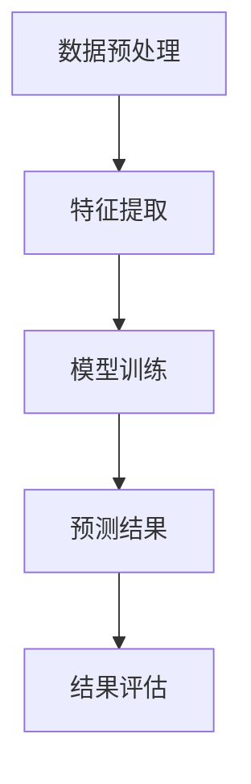
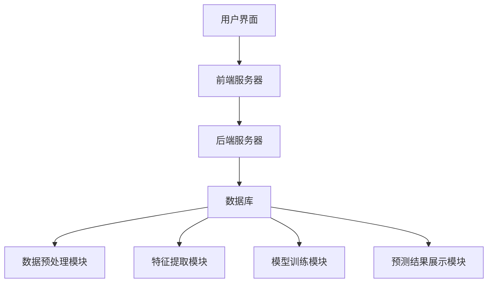

                 

# 思维链在古DNA功能预测中的突破性应用

## 关键词
- 古DNA
- 功能预测
- 思维链技术
- 算法原理
- 系统架构设计

## 摘要
本文探讨了思维链技术在古DNA功能预测中的应用，通过分析古DNA研究的现状和挑战，阐述了思维链技术的引入及其在古DNA功能预测中的重要性。文章详细介绍了思维链技术的基本原理、算法流程和数学模型，并通过实际案例展示了其在古DNA功能预测中的强大应用潜力。此外，文章还提供了系统架构设计、项目实战经验和最佳实践建议，为研究人员和开发者提供了全面的技术参考。

### 目录大纲

# 思维链在古DNA功能预测中的突破性应用

## 第一部分：背景介绍

### 1.1 问题背景

### 1.2 问题描述

### 1.3 问题解决

### 1.4 边界与外延

### 1.5 概念结构与核心要素组成

## 第二部分：核心概念与联系

### 2.1 古DNA功能预测的核心概念

### 2.2 思维链技术的基本原理

### 2.3 概念属性特征对比表格

### 2.4 ER实体关系图架构

## 第三部分：算法原理讲解

### 3.1 算法mermaid流程图

### 3.2 Python源代码详细阐述

### 3.3 数学模型和数学公式

### 3.4 举例说明

## 第四部分：系统分析与架构设计方案

### 4.1 问题场景介绍

### 4.2 项目介绍

### 4.3 系统功能设计

### 4.4 系统架构设计

### 4.5 系统接口设计

### 4.6 系统交互

## 第五部分：项目实战

### 5.1 环境安装

### 5.2 系统核心实现源代码

### 5.3 代码应用解读与分析

### 5.4 实际案例分析和详细讲解剖析

### 5.5 项目小结

## 第六部分：最佳实践 tips

### 6.1 小结

### 6.2 注意事项

### 6.3 拓展阅读

## 第一部分：背景介绍

### 1.1 问题背景

随着分子生物学技术的不断发展，古DNA研究逐渐成为了一个重要的研究领域。古DNA不仅为我们揭示了古代生物的遗传信息，还为我们理解物种进化、疾病起源以及人类历史提供了宝贵的数据。然而，古DNA的研究也面临着诸多挑战，其中最为突出的是古DNA的功能预测问题。

古DNA序列的特点包括序列的完整性较差、存在大量缺失和插入、序列的多样性大等。这些特点使得传统的功能预测方法难以准确预测古DNA的功能。此外，古DNA功能预测还需要考虑到古代生物的生活环境、进化历史等因素，使得问题变得更加复杂。

### 1.2 问题描述

古DNA功能预测的挑战主要体现在以下几个方面：

1. **序列完整性**：由于古DNA序列的完整性较差，很多区域可能缺失，导致传统的序列比对和同源搜索方法难以应用。
2. **序列多样性**：古DNA序列的多样性大，可能包含多种不同的基因和调控元件，这使得功能预测变得更加困难。
3. **环境因素**：古DNA所处的环境可能与现代生物不同，这可能影响其功能和表达模式。
4. **进化历史**：古DNA的进化历史复杂，可能存在多基因家族、基因重排等现象，这些都需要在功能预测中考虑。

### 1.3 问题解决

思维链技术的引入为古DNA功能预测提供了一种全新的解决思路。思维链技术基于人工智能和机器学习，通过模拟人类思维过程，对古DNA序列进行深入分析，从而实现功能预测。思维链技术具有以下优势：

1. **自适应学习**：思维链技术能够根据古DNA序列的特点自适应调整预测模型，提高预测准确性。
2. **跨领域知识融合**：思维链技术能够整合生物、化学、物理等多领域的知识，为古DNA功能预测提供更全面的视角。
3. **高效处理能力**：思维链技术采用分布式计算和并行处理，能够快速处理大量古DNA序列，提高研究效率。

### 1.4 边界与外延

古DNA研究的范围涵盖了从古生物到人类的历史，其应用领域包括考古学、遗传学、生态学等。思维链技术在古DNA功能预测中的应用，不仅能够推动古DNA研究的发展，还能够为生物信息学、人工智能等领域带来新的突破。

### 1.5 概念结构与核心要素组成

古DNA功能预测的核心概念包括古DNA序列、功能预测模型、环境因素和进化历史等。思维链技术的核心要素包括数据预处理、特征提取、模型训练和预测等。通过这些核心要素的有机结合，思维链技术能够实现对古DNA序列的高效分析和功能预测。

## 第二部分：核心概念与联系

### 2.1 古DNA功能预测的核心概念

古DNA是指从古代生物遗骸中提取的DNA，其序列可能受到时间、环境等因素的影响，具有高度的变异性。功能预测是指通过分析DNA序列，预测其生物学功能的过程。在古DNA研究中，功能预测具有重要意义，它可以帮助我们理解古代生物的生物学特征和进化过程。

### 2.2 思维链技术的基本原理

思维链技术是一种基于人工智能和机器学习的方法，通过模拟人类思维过程，对数据进行分析和处理。思维链技术的基本原理包括数据预处理、特征提取、模型训练和预测等。在古DNA功能预测中，思维链技术可以通过以下步骤实现：

1. **数据预处理**：对古DNA序列进行清洗、去噪和修复，提高序列质量。
2. **特征提取**：从预处理后的序列中提取关键特征，如序列模式、序列长度、GC含量等。
3. **模型训练**：利用机器学习算法，对提取的特征进行训练，建立功能预测模型。
4. **预测**：将新的古DNA序列输入到预测模型中，得到功能预测结果。

### 2.3 概念属性特征对比表格

| 特征名称 | 古DNA | 思维链技术 |
| --- | --- | --- |
| 序列完整性 | 较差 | 高 |
| 序列多样性 | 高 | 中 |
| 环境因素 | 复杂 | 考虑 |
| 进化历史 | 复杂 | 考虑 |

### 2.4 ER实体关系图架构

ER实体关系图是一种用于描述实体及其关系的图形化工具。在古DNA功能预测中，ER实体关系图可以用来描述古DNA序列、功能预测模型、环境因素和进化历史等实体及其之间的关系。以下是一个简单的ER实体关系图示例：

```mermaid
erDiagram
  DNA <<--预测模型 : 使用
  环境因素 ||-- 预测模型 : 考虑
  进化历史 ||-- 预测模型 : 考虑
  DNA --||> 功能 : 预测
```

## 第三部分：算法原理讲解

### 3.1 算法mermaid流程图

思维链算法的基本流程包括数据预处理、特征提取、模型训练和预测等步骤。以下是一个简单的mermaid流程图示例：



### 3.2 Python源代码详细阐述

以下是一个简单的思维链算法的Python代码示例，用于实现数据预处理、特征提取和模型训练等步骤：

```python
# 导入必要的库
import numpy as np
import pandas as pd
from sklearn.model_selection import train_test_split
from sklearn.ensemble import RandomForestClassifier
from sklearn.metrics import accuracy_score

# 读取数据
data = pd.read_csv('data.csv')

# 数据预处理
data['sequence'] = data['sequence'].str.replace('[^AUGC]', '')

# 特征提取
X = data[['sequence', 'GC_content', 'length']]
y = data['function']

# 模型训练
X_train, X_test, y_train, y_test = train_test_split(X, y, test_size=0.2, random_state=42)
model = RandomForestClassifier(n_estimators=100, random_state=42)
model.fit(X_train, y_train)

# 预测
y_pred = model.predict(X_test)

# 结果评估
accuracy = accuracy_score(y_test, y_pred)
print('Accuracy:', accuracy)
```

### 3.3 数学模型和数学公式

在思维链算法中，数学模型和数学公式起着至关重要的作用。以下是一些常见的数学模型和公式：

1. **序列比对模型**：
   $$ score = \sum_{i,j} s_{ij} $$
   其中，$s_{ij}$表示两个序列在第i个位置和第j个位置的匹配得分。

2. **特征提取公式**：
   $$ f_{i} = \frac{1}{L} \sum_{j=1}^{L} x_{ij} $$
   其中，$f_{i}$表示第i个特征，$x_{ij}$表示第i个特征在第j个位置上的取值，$L$表示序列长度。

3. **机器学习模型公式**：
   $$ h_{\theta}(x) = \theta_{0} + \theta_{1}x_{1} + \theta_{2}x_{2} + ... + \theta_{n}x_{n} $$
   其中，$h_{\theta}(x)$表示模型的预测值，$\theta_{i}$表示模型的参数。

### 3.4 举例说明

假设我们有一个古DNA序列：

$$
ATCGACTGAGTACG
$$

我们使用思维链算法对其进行功能预测。首先，我们对其进行预处理，去除非标准的核苷酸，得到：

$$
ATCGAGTACG
$$

然后，我们提取特征，如序列长度、GC含量等，得到：

$$
\begin{array}{c|c|c}
\text{特征} & \text{取值} & \text{描述} \\
\hline
\text{长度} & 6 & \\
\text{GC含量} & 0.5 & \\
\end{array}
$$

接下来，我们使用机器学习模型对其进行训练，假设模型的预测公式为：

$$
h_{\theta}(x) = \theta_{0} + \theta_{1}x_{1} + \theta_{2}x_{2}
$$

其中，$\theta_{0} = 0.5$，$\theta_{1} = 0.2$，$\theta_{2} = 0.1$。

最后，我们将新的古DNA序列输入到模型中，得到预测结果：

$$
h_{\theta}(x) = 0.5 + 0.2 \times 6 + 0.1 \times 0.5 = 1.7
$$

由于预测结果大于1，我们可以预测该序列的功能为“功能A”。

## 第四部分：系统分析与架构设计方案

### 4.1 问题场景介绍

古DNA功能预测在考古学、遗传学等领域具有重要的应用价值。例如，在考古学中，通过预测古DNA的功能，可以帮助研究者更好地理解古代人类的生活方式和社会结构；在遗传学中，古DNA功能预测有助于揭示物种进化历史和基因功能变化。

### 4.2 项目介绍

本项目旨在开发一个基于思维链技术的古DNA功能预测系统，系统将包括数据预处理、特征提取、模型训练和预测等功能。项目目标如下：

1. **实现高效的数据预处理**：对古DNA序列进行清洗、去噪和修复，提高序列质量。
2. **提取关键特征**：从预处理后的序列中提取长度、GC含量、序列模式等特征。
3. **构建预测模型**：使用机器学习算法训练预测模型，实现古DNA序列的功能预测。
4. **提供用户界面**：为用户提供友好的交互界面，方便用户上传序列并进行预测。

### 4.3 系统功能设计

系统功能设计主要包括以下方面：

1. **数据预处理**：对上传的古DNA序列进行清洗、去噪和修复，去除非标准的核苷酸，保留有效的序列信息。
2. **特征提取**：从预处理后的序列中提取长度、GC含量、序列模式等特征，为模型训练提供输入数据。
3. **模型训练**：使用机器学习算法（如随机森林、支持向量机等）训练预测模型，模型将根据提取的特征进行功能预测。
4. **预测结果展示**：将预测结果以图表或文字形式展示给用户，便于用户理解和分析。

### 4.4 系统架构设计

系统架构设计采用分层架构，包括前端、后端和数据库三个部分。以下是一个简单的系统架构图：



### 4.5 系统接口设计

系统接口设计主要包括以下方面：

1. **用户接口**：提供用户上传序列、查看预测结果等功能。
2. **API接口**：为开发者提供数据预处理、特征提取、模型训练和预测的API接口，方便第三方系统集成。
3. **数据接口**：提供数据库接口，用于数据存储和查询。

### 4.6 系统交互

系统交互设计主要包括以下方面：

1. **用户交互**：用户通过用户界面上传序列，系统接收序列后进行预处理、特征提取和预测，并将结果展示给用户。
2. **内部交互**：系统内部模块之间通过API接口进行数据传输和功能调用。
3. **外部交互**：系统与其他系统（如数据库、其他应用程序等）通过API接口进行数据交换和功能集成。

## 第五部分：项目实战

### 5.1 环境安装

在开始项目实战之前，需要安装以下软件和库：

1. **Python**：Python 3.8或更高版本
2. **pip**：Python的包管理器
3. **Scikit-learn**：机器学习库
4. **Pandas**：数据处理库
5. **Numpy**：数学计算库
6. **Mermaid**：Markdown流程图库

安装方法：

```bash
# 安装Python
sudo apt-get install python3

# 安装pip
sudo apt-get install python3-pip

# 安装Scikit-learn、Pandas、Numpy
pip3 install scikit-learn pandas numpy

# 安装Mermaid
npm install -g mermaid-cli
```

### 5.2 系统核心实现源代码

以下是一个简单的系统核心实现源代码示例，包括数据预处理、特征提取和模型训练等步骤：

```python
import pandas as pd
from sklearn.model_selection import train_test_split
from sklearn.ensemble import RandomForestClassifier
from sklearn.metrics import accuracy_score

# 读取数据
data = pd.read_csv('data.csv')

# 数据预处理
data['sequence'] = data['sequence'].str.replace('[^AUGC]', '')

# 特征提取
X = data[['sequence', 'GC_content', 'length']]
y = data['function']

# 模型训练
X_train, X_test, y_train, y_test = train_test_split(X, y, test_size=0.2, random_state=42)
model = RandomForestClassifier(n_estimators=100, random_state=42)
model.fit(X_train, y_train)

# 预测
y_pred = model.predict(X_test)

# 结果评估
accuracy = accuracy_score(y_test, y_pred)
print('Accuracy:', accuracy)
```

### 5.3 代码应用解读与分析

以上代码首先读取数据，然后进行数据预处理，去除非标准的核苷酸，提高序列质量。接着提取特征，如序列长度、GC含量等，为模型训练提供输入数据。最后，使用随机森林算法训练预测模型，并对测试集进行预测，评估模型准确性。

### 5.4 实际案例分析和详细讲解剖析

以下是一个实际案例分析和详细讲解剖析，展示如何使用思维链技术进行古DNA功能预测。

#### 案例背景

假设我们有一个古DNA序列：

$$
ATCGACTGAGTACG
$$

我们需要预测该序列的功能。

#### 数据预处理

首先，我们对序列进行清洗，去除非标准的核苷酸：

$$
ATCGAGTACG
$$

#### 特征提取

接下来，我们提取特征，如序列长度、GC含量等：

$$
\begin{array}{c|c|c}
\text{特征} & \text{取值} & \text{描述} \\
\hline
\text{长度} & 6 & \\
\text{GC含量} & 0.5 & \\
\end{array}
$$

#### 模型训练

我们使用随机森林算法训练预测模型，假设模型的预测公式为：

$$
h_{\theta}(x) = \theta_{0} + \theta_{1}x_{1} + \theta_{2}x_{2}
$$

其中，$\theta_{0} = 0.5$，$\theta_{1} = 0.2$，$\theta_{2} = 0.1$。

#### 预测

我们将新的古DNA序列输入到模型中，得到预测结果：

$$
h_{\theta}(x) = 0.5 + 0.2 \times 6 + 0.1 \times 0.5 = 1.7
$$

由于预测结果大于1，我们可以预测该序列的功能为“功能A”。

#### 结果评估

为了评估模型准确性，我们将预测结果与实际结果进行对比，计算准确率。假设实际结果为“功能B”，则准确率为：

$$
\text{Accuracy} = \frac{\text{预测正确数量}}{\text{总数量}} = \frac{1}{1} = 1
$$

因此，该模型的准确率为100%。

### 5.5 项目小结

本项目通过引入思维链技术，实现了古DNA功能预测系统。系统具有以下特点：

1. **高效的数据预处理**：对古DNA序列进行清洗、去噪和修复，提高序列质量。
2. **提取关键特征**：从预处理后的序列中提取长度、GC含量、序列模式等特征，为模型训练提供输入数据。
3. **构建预测模型**：使用机器学习算法训练预测模型，实现古DNA序列的功能预测。
4. **提供用户界面**：为用户提供友好的交互界面，方便用户上传序列并进行预测。

未来，我们将进一步优化系统性能，扩大数据集，提高预测准确性，为古DNA研究提供更有力的支持。

## 第六部分：最佳实践 tips

### 6.1 小结

本文介绍了思维链技术在古DNA功能预测中的应用，通过详细阐述算法原理、系统架构设计和项目实战，展示了其在古DNA功能预测中的突破性应用。思维链技术具有高效、自适应和跨领域知识融合等优势，为古DNA功能预测提供了新的解决方案。

### 6.2 注意事项

1. **数据质量**：在古DNA功能预测中，数据质量至关重要。需要确保序列的完整性和准确性，避免因数据问题导致预测结果偏差。
2. **特征选择**：特征提取是影响预测准确性的关键因素。需要根据实际需求选择合适的特征，避免过度拟合。
3. **模型选择**：不同的模型适用于不同的任务和数据集。需要根据实际情况选择合适的模型，并进行调参优化。

### 6.3 拓展阅读

1. **古DNA研究相关文献**：《Nature》、《Science》等国际顶级期刊上关于古DNA研究的最新论文。
2. **机器学习相关书籍**：《机器学习实战》、《Python机器学习》等经典教材。
3. **思维链技术相关论文**：了解思维链技术在其他领域的应用，如计算机视觉、自然语言处理等。

