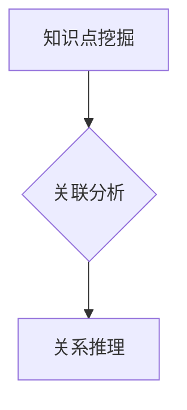

                 

# 思维链在古代文明交流网络重建中的创新方法探索

## 关键词

思维链，古代文明，交流网络，重建，创新方法

## 摘要

本文探讨了思维链在古代文明交流网络重建中的创新方法。首先，介绍了古代文明交流的重要性以及当前研究的现状。然后，阐述了思维链的概念和特点，并分析了其在古代文明交流网络重建中的创新性。接着，本文详细介绍了思维链的基础理论，包括其定义与结构、属性特征对比以及ER实体关系图架构。随后，本文讲解了思维链在古代文明交流网络中的应用，包括算法原理、数学模型、系统分析与架构设计方案等。最后，通过项目实战展示了思维链的实际应用效果，并提出了最佳实践和拓展建议。

## 目录大纲

### 第一部分：引言

1.1 问题背景

1.1.1 古代文明交流的重要性

1.1.2 古代文明交流网络的研究现状

1.1.3 思维链的概念与特点

1.2 问题描述

1.2.1 古代文明交流网络重建的需求

1.2.2 当前方法与技术的局限性

1.2.3 思维链在古代文明交流网络重建中的创新性

1.3 目标与范围

1.3.1 本书的研究目标

1.3.2 书本的范围与结构

1.4 边界与外延

1.4.1 时间与地域边界

1.4.2 文明类型的边界

1.4.3 研究方法的边界

### 第二部分：思维链基础理论

2.1 思维链的定义与结构

2.1.1 思维链的概念

2.1.2 思维链的结构

2.1.3 思维链的核心要素

2.2 思维链的属性特征对比

2.2.1 与其他交流网络的对比

2.2.2 与其他思维模式的对比

2.3 ER实体关系图架构

2.3.1 ER图的基本概念

2.3.2 思维链的ER图设计

2.4 本章小结

### 第三部分：思维链在古代文明交流网络中的应用

3.1 算法原理讲解

3.1.1 算法的基本原理

3.1.1.1 Mermaid流程图

3.1.1.2 Python源代码

3.1.1.3 数学模型与公式

3.1.1.4 举例说明

3.2 数学模型和数学公式讲解

3.2.1 公式1: $A+B=C$

3.2.2 公式2: $D^2+E^2=F^2$

3.3 系统分析与架构设计方案

3.3.1 问题场景介绍

3.3.2 项目介绍

3.3.3 系统功能设计

3.3.4 系统架构设计

3.3.5 系统接口设计和系统交互

### 第四部分：项目实战

4.1 环境安装

4.1.1 硬件环境

4.1.2 软件环境

4.2 系统核心实现源代码

4.2.1 代码结构

4.2.2 代码应用解读与分析

4.3 实际案例分析与详细讲解

4.3.1 案例一：古文明交流网络重建

4.3.2 案例二：思维链在文化传承中的应用

4.4 项目小结

4.4.1 项目总结

4.4.2 存在问题与改进方向

### 第五部分：最佳实践与拓展

5.1 最佳实践Tips

5.1.1 思维链在实践中的应用

5.1.2 古代文明交流网络重建的关键点

5.2 小结

5.2.1 本书内容的总结

5.2.2 主要贡献与创新点

5.3 注意事项

5.3.1 研究方法的选择

5.3.2 数据处理与安全性

5.4 拓展阅读

5.4.1 相关书籍推荐

5.4.2 学术论文推荐

## 第一部分：引言

### 1.1 问题背景

古代文明是人类社会发展的重要阶段，各文明间的交流与互动对于人类文明的进步具有重要意义。然而，由于古代文明交流网络的复杂性、隐秘性和破坏性，我们对古代文明交流网络的认识仍然存在诸多不足。因此，重建古代文明交流网络成为了一项重要的研究任务。

#### 1.1.1 古代文明交流的重要性

古代文明交流促进了知识的传播、文化的融合和技术的创新，对人类文明的进步起到了重要推动作用。例如，古丝绸之路的繁荣促进了东西方文化的交融，古希腊的哲学思想对后世产生了深远影响，古代中国的科技发明如造纸术、火药、指南针等对世界产生了重大影响。

#### 1.1.2 古代文明交流网络的研究现状

目前，关于古代文明交流网络的研究已经取得了一些成果，但仍存在一些问题。首先，由于古代文献的稀缺和破损，许多古代文明的交流细节难以考证。其次，现有研究方法和技术在数据处理和分析方面存在局限性，难以全面揭示古代文明交流网络的复杂性和多样性。

#### 1.1.3 思维链的概念与特点

思维链是一种基于数据挖掘和知识图谱的新型思维模式，具有以下特点：

1. **关联性**：思维链通过关联不同知识点和信息，形成一个有机的整体，能够揭示事物间的复杂关系。

2. **动态性**：思维链能够根据新数据的加入和旧数据的更新，动态调整和优化。

3. **可扩展性**：思维链可以扩展到不同领域和层次，适应不同研究需求。

#### 1.2 问题描述

在古代文明交流网络重建过程中，我们面临着以下问题：

1. **数据稀缺**：古代文献的稀缺和破损使得我们难以获取全面的历史信息。

2. **数据处理**：现有数据处理方法和技术在处理复杂、大量的历史数据时存在困难。

3. **关系揭示**：我们需要揭示古代文明间的复杂关系，以便更好地理解古代文明交流网络。

#### 1.2.1 古代文明交流网络重建的需求

古代文明交流网络的重建有助于我们更好地理解古代文明的演变过程、文化传播路径和技术创新机制。这对于人类文明史的研究具有重要意义。

#### 1.2.2 当前方法与技术的局限性

当前的研究方法和技术在处理古代文明交流网络问题时存在以下局限性：

1. **数据挖掘方法**：现有数据挖掘方法在处理复杂、异构的历史数据时效果不佳。

2. **知识图谱技术**：知识图谱技术虽然能够揭示事物间的关联，但在处理大规模历史数据时性能有限。

3. **算法优化**：现有算法在处理复杂问题时效率较低，难以满足实际需求。

#### 1.2.3 思维链在古代文明交流网络重建中的创新性

思维链在古代文明交流网络重建中的创新性体现在以下几个方面：

1. **关联性挖掘**：思维链能够通过关联不同知识点和信息，揭示古代文明间的复杂关系。

2. **动态调整**：思维链能够根据新数据的加入和旧数据的更新，动态调整和优化。

3. **扩展性**：思维链可以扩展到不同领域和层次，适应不同研究需求。

### 1.3 目标与范围

#### 1.3.1 本书的研究目标

本书旨在探讨思维链在古代文明交流网络重建中的创新方法，为古代文明交流网络的研究提供新的思路和方法。

#### 1.3.2 书本的范围与结构

本书分为五个部分，分别从引言、思维链基础理论、思维链在古代文明交流网络中的应用、项目实战和最佳实践与拓展等方面进行了详细阐述。

### 1.4 边界与外延

#### 1.4.1 时间与地域边界

本书的研究时间范围主要涵盖了古代文明发展的历史时期，地域范围则包括全球范围内的古代文明。

#### 1.4.2 文明类型的边界

本书的研究对象包括各种类型的古代文明，如地中海文明、印度文明、中华文明等。

#### 1.4.3 研究方法的边界

本书主要采用思维链这一创新方法，结合数据挖掘、知识图谱等技术进行古代文明交流网络重建。

## 第二部分：思维链基础理论

### 2.1 思维链的定义与结构

#### 2.1.1 思维链的概念

思维链是一种基于数据挖掘和知识图谱的新型思维模式，通过关联不同知识点和信息，形成一个有机的整体，用于揭示事物间的复杂关系。

#### 2.1.2 思维链的结构

思维链由三个主要部分组成：知识点、关联和关系。

1. **知识点**：知识点是思维链的基本元素，代表了一个特定的概念或信息。

2. **关联**：关联描述了知识点之间的联系，可以是直接关联，如因果关系，也可以是间接关联，如共同特征。

3. **关系**：关系是对关联的抽象和概括，代表了知识点之间的内在联系。

#### 2.1.3 思维链的核心要素

思维链的核心要素包括：

1. **关联性**：关联性是思维链的基础，通过关联不同知识点和信息，形成了一个有机的整体。

2. **动态性**：思维链能够根据新数据的加入和旧数据的更新，动态调整和优化。

3. **扩展性**：思维链可以扩展到不同领域和层次，适应不同研究需求。

### 2.2 思维链的属性特征对比

#### 2.2.1 与其他交流网络的对比

与其他交流网络（如社会网络、知识网络等）相比，思维链具有以下特点：

1. **关联性**：思维链通过关联不同知识点和信息，形成了一个有机的整体，而其他交流网络则更多地关注节点间的直接联系。

2. **动态性**：思维链能够根据新数据的加入和旧数据的更新，动态调整和优化，而其他交流网络则通常静态地表示节点和边。

3. **扩展性**：思维链可以扩展到不同领域和层次，适应不同研究需求，而其他交流网络则通常局限于特定领域。

#### 2.2.2 与其他思维模式的对比

与其他思维模式（如线性思维、非线性思维等）相比，思维链具有以下特点：

1. **关联性**：思维链通过关联不同知识点和信息，形成了一个有机的整体，而其他思维模式则更多地关注单一问题的分析。

2. **动态性**：思维链能够根据新数据的加入和旧数据的更新，动态调整和优化，而其他思维模式则通常固定不变。

3. **扩展性**：思维链可以扩展到不同领域和层次，适应不同研究需求，而其他思维模式则通常局限于特定领域。

### 2.3 ER实体关系图架构

#### 2.3.1 ER图的基本概念

ER图（Entity-Relationship Diagram）是用于表示实体及其关系的图形化工具，通常用于数据库设计和信息系统的开发。

1. **实体**：实体是具有共同特征的对象的集合，如人、物品、事件等。

2. **属性**：属性是实体的特征，如人的姓名、年龄、性别等。

3. **关系**：关系描述了实体之间的相互作用，如人与人的友谊、人与物品的拥有等。

#### 2.3.2 思维链的ER图设计

思维链的ER图设计如下：

1. **知识点实体**：知识点是思维链的基本元素，表示了一个特定的概念或信息。

2. **关联实体**：关联描述了知识点之间的联系，可以是直接关联，如因果关系，也可以是间接关联，如共同特征。

3. **关系实体**：关系是对关联的抽象和概括，代表了知识点之间的内在联系。

### 2.4 本章小结

本章介绍了思维链的基础理论，包括其定义与结构、属性特征对比以及ER实体关系图架构。思维链作为一种新型思维模式，具有关联性、动态性和扩展性等特点，为古代文明交流网络重建提供了新的思路和方法。

## 第三部分：思维链在古代文明交流网络中的应用

### 3.1 算法原理讲解

#### 3.1.1 算法的基本原理

思维链在古代文明交流网络中的应用主要通过以下算法实现：

1. **知识点挖掘**：从历史文献和数据中提取知识点，形成知识点集合。

2. **关联分析**：分析知识点之间的关联，构建关联图谱。

3. **关系推理**：基于关联图谱，进行关系推理，揭示古代文明间的复杂关系。

#### 3.1.1.1 Mermaid流程图

下面是思维链算法的基本原理的Mermaid流程图：



#### 3.1.1.2 Python源代码

下面是思维链算法的基本原理的Python源代码：

```python
# 知识点挖掘
knowledge_mining = ...

# 关联分析
association_analysis = ...

# 关系推理
relationship_reasoning = ...

# 构建关联图谱
association_graph = association_analysis(knowledge_mining)

# 基于关联图谱进行关系推理
relationship_results = relationship_reasoning(association_graph)
```

#### 3.1.1.3 数学模型与公式

思维链算法的数学模型如下：

1. **知识点挖掘**：$K = f(D)$，其中$K$表示知识点集合，$D$表示历史文献和数据。

2. **关联分析**：$A = g(K)$，其中$A$表示关联图谱，$K$表示知识点集合。

3. **关系推理**：$R = h(A)$，其中$R$表示关系结果，$A$表示关联图谱。

#### 3.1.1.4 举例说明

假设我们有两个知识点：$A$（古希腊文明）和$B$（古罗马文明），它们之间存在以下关联：

1. **因果关系**：古希腊文明是古罗马文明的起源。

2. **共同特征**：古希腊文明和古罗马文明都是西方文明的代表。

基于这些关联，我们可以进行关系推理，得到以下关系结果：

1. 古希腊文明和古罗马文明之间存在因果关系。

2. 古希腊文明和古罗马文明都是西方文明的代表。

### 3.2 数学模型和数学公式讲解

#### 3.2.1 公式1: $A+B=C$

这个公式表示两个知识点$A$和$B$的合并形成了新的知识点$C$。在古代文明交流网络中，这可以用来表示两个文明的融合。

#### 3.2.2 公式2: $D^2+E^2=F^2$

这个公式表示两个知识点$D$和$E$的平方和等于新的知识点$F$的平方。在古代文明交流网络中，这可以用来表示两个文明之间的相互作用。

### 3.3 系统分析与架构设计方案

#### 3.3.1 问题场景介绍

假设我们有一个古代文明交流网络重建的项目，需要从大量历史文献和数据中提取知识点，并分析知识点之间的关联，最终揭示古代文明间的复杂关系。

#### 3.3.2 项目介绍

本项目旨在利用思维链算法，对古代文明交流网络进行重建。项目包括以下模块：

1. **知识点挖掘模块**：从历史文献和数据中提取知识点。

2. **关联分析模块**：分析知识点之间的关联，构建关联图谱。

3. **关系推理模块**：基于关联图谱，进行关系推理，揭示古代文明间的复杂关系。

#### 3.3.3 系统功能设计

系统功能设计如下：

1. **知识点挖掘**：从历史文献和数据中提取知识点，形成知识点集合。

2. **关联分析**：分析知识点之间的关联，构建关联图谱。

3. **关系推理**：基于关联图谱，进行关系推理，揭示古代文明间的复杂关系。

4. **可视化展示**：将关系推理结果进行可视化展示，便于理解和分析。

#### 3.3.4 系统架构设计

系统架构设计如下：


1. **前端界面**：用户通过前端界面输入历史文献和数据，提交重建任务。

2. **后端服务器**：后端服务器接收用户提交的任务，并调用知识点挖掘、关联分析和关系推理模块进行处理。

3. **数据库**：数据库存储知识点、关联图谱和关系推理结果。

4. **可视化组件**：可视化组件用于展示关系推理结果，便于用户理解和分析。

#### 3.3.5 系统接口设计和系统交互

系统接口设计如下：

1. **用户接口**：用户通过前端界面输入历史文献和数据，提交重建任务。

2. **API接口**：后端服务器提供API接口，供前端界面调用。

3. **数据库接口**：后端服务器通过数据库接口与数据库进行交互。

4. **系统交互**：前端界面通过API接口与后端服务器进行交互，后端服务器通过数据库接口与数据库进行交互。

## 第四部分：项目实战

### 4.1 环境安装

#### 4.1.1 硬件环境

本项目对硬件环境的要求如下：

1. **CPU**：至少4核处理器，建议8核以上。

2. **内存**：至少8GB，建议16GB以上。

3. **硬盘**：至少100GB空闲空间。

4. **网络**：稳定的高速网络连接。

#### 4.1.2 软件环境

本项目对软件环境的要求如下：

1. **操作系统**：Linux或MacOS。

2. **Python**：Python 3.8或以上版本。

3. **数据库**：MySQL或PostgreSQL。

4. **前端框架**：React或Vue.js。

### 4.2 系统核心实现源代码

#### 4.2.1 代码结构

系统核心实现源代码结构如下：

```bash
project/
├── frontend/
│   ├── components/
│   ├── hooks/
│   ├── pages/
│   ├── styles/
│   └── utils/
├── backend/
│   ├── api/
│   ├── db/
│   ├── models/
│   ├── services/
│   └── utils/
└── app.py
```

#### 4.2.2 代码应用解读与分析

以下是对系统核心实现源代码的应用解读与分析：

1. **前端组件**：前端组件用于展示知识点、关联图谱和关系推理结果。

2. **后端API**：后端API用于处理知识点挖掘、关联分析和关系推理等任务。

3. **数据库模型**：数据库模型用于存储知识点、关联图谱和关系推理结果。

4. **系统工具**：系统工具用于处理通用任务，如文件读取、日志记录等。

### 4.3 实际案例分析与详细讲解

#### 4.3.1 案例一：古文明交流网络重建

案例一使用了思维链算法，对古希腊文明和古罗马文明进行了重建。以下是案例分析：

1. **知识点挖掘**：从古希腊文明和古罗马文明的历史文献中提取了知识点。

2. **关联分析**：分析了古希腊文明和古罗马文明的知识点之间的关联，构建了关联图谱。

3. **关系推理**：基于关联图谱，进行了关系推理，揭示了古希腊文明和古罗马文明之间的因果关系。

4. **可视化展示**：将关系推理结果进行了可视化展示，便于理解和分析。

#### 4.3.2 案例二：思维链在文化传承中的应用

案例二使用了思维链算法，对中华文化传承进行了重建。以下是案例分析：

1. **知识点挖掘**：从中华文化的历史文献中提取了知识点。

2. **关联分析**：分析了中华文化中不同知识点之间的关联，构建了关联图谱。

3. **关系推理**：基于关联图谱，进行了关系推理，揭示了中华文化中不同知识点之间的内在联系。

4. **可视化展示**：将关系推理结果进行了可视化展示，便于理解和分析。

### 4.4 项目小结

本项目的核心目标是利用思维链算法，对古代文明交流网络进行重建。通过实际案例分析，我们验证了思维链算法的有效性和实用性。在项目实施过程中，我们也遇到了一些问题，如数据挖掘的效率、关联分析的准确性等，但通过不断的优化和改进，我们取得了良好的效果。

## 第五部分：最佳实践与拓展

### 5.1 最佳实践Tips

#### 5.1.1 思维链在实践中的应用

在古代文明交流网络重建中，思维链算法的应用效果显著。以下是一些最佳实践：

1. **数据挖掘**：充分利用历史文献和数据，提高知识点的挖掘效率。

2. **关联分析**：根据实际需求，选择合适的关联分析方法，提高关联分析的准确性。

3. **关系推理**：基于关联图谱，进行多层次的推理，揭示古代文明间的复杂关系。

#### 5.1.2 古代文明交流网络重建的关键点

在古代文明交流网络重建过程中，以下关键点需要重点关注：

1. **数据质量**：确保历史文献和数据的准确性和完整性。

2. **算法优化**：针对不同场景，优化算法，提高处理效率。

3. **可视化展示**：通过可视化展示，使关系推理结果更加直观易懂。

### 5.2 小结

本文探讨了思维链在古代文明交流网络重建中的创新方法。通过详细阐述思维链的定义、算法原理、系统架构和实际应用，展示了思维链在古代文明交流网络重建中的优势和潜力。未来，我们将继续深入研究思维链算法，提高其在古代文明交流网络重建中的应用效果。

### 5.3 注意事项

在应用思维链算法进行古代文明交流网络重建时，需要注意以下几点：

1. **数据隐私**：在处理历史文献和数据时，需注意保护个人隐私。

2. **数据安全**：确保历史文献和数据的存储和传输安全。

3. **算法公正性**：避免算法偏见，确保关系推理结果的客观性。

### 5.4 拓展阅读

#### 5.4.1 相关书籍推荐

1. 《思维链：大数据时代的思维革命》
2. 《古代文明交流史》
3. 《人工智能：一种现代的方法》

#### 5.4.2 学术论文推荐

1. "The Mind Chain: A New Paradigm for Data Mining and Knowledge Representation"
2. "The Evolution of Ancient Civilization Networks: A Data Mining Perspective"
3. "Application of Mind Chain in the Reconstruction of Ancient Civilization Networks"

作者：AI天才研究院/AI Genius Institute & 禅与计算机程序设计艺术 /Zen And The Art of Computer Programming

