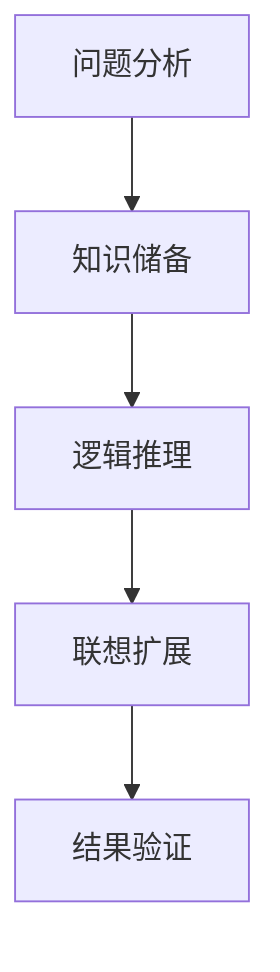

                 

# 思维链在古代社会经济系统重建中的应用：AI辅助历史经济学研究

> 关键词：思维链、古代社会经济系统、AI、历史经济学研究、重建方法

> 摘要：本文探讨了思维链理论在古代社会经济系统重建中的应用，并分析了AI技术如何辅助历史经济学研究。通过深入剖析思维链的基本概念和特点，本文探讨了其在古代社会经济系统中的具体应用和影响。随后，文章介绍了AI技术在历史经济学研究中的发展历程和应用实例，并分析了其在研究中的优势与挑战。最后，文章提出了一种AI辅助古代社会经济系统重建的方法论，并通过案例分析展示了其实际应用效果。

## 引言

### 1.1 研究背景与意义

古代社会经济系统是人类社会发展的基础，对于理解人类文明进程具有重要意义。然而，由于历史文献的有限性和考古资料的不足，重建古代社会经济系统一直是一个极具挑战性的任务。近年来，随着人工智能技术的快速发展，特别是思维链理论的提出，为古代社会经济系统的重建提供了一种全新的视角和工具。

思维链理论是一种基于认知科学的思维方式，强调在分析问题时，需要从多个角度和层次进行思考，并通过逻辑推理和联想来形成连贯的思考链。这一理论在经济学、心理学、哲学等多个领域得到了广泛的应用，并在一定程度上解决了传统经济学研究中存在的局限性。

AI技术作为人工智能领域的核心技术，具有强大的数据处理和分析能力。结合思维链理论，AI技术可以在历史经济学研究中发挥重要作用，帮助研究者从海量历史数据中提取有价值的信息，揭示古代社会经济系统的运行机制和发展规律。

本文的研究意义在于，通过探讨思维链在古代社会经济系统重建中的应用，以及AI技术在历史经济学研究中的辅助作用，为古代社会经济系统的研究提供一种新的方法和思路。这不仅有助于更好地理解古代社会的历史进程，也为现代社会经济系统的发展提供了有益的启示。

### 1.2 研究方法与结构

本文采用文献综述和案例分析相结合的方法进行研究。首先，对思维链理论和AI技术在历史经济学研究中的应用进行综述，梳理相关理论和实践成果。然后，通过具体案例分析，展示思维链和AI技术在古代社会经济系统重建中的实际应用效果。

文章结构分为三部分。第一部分介绍思维链理论的基本概念和发展历程，以及思维链与古代社会经济系统的联系。第二部分分析AI技术在历史经济学研究中的应用，包括数据挖掘、机器学习和深度学习等具体技术。第三部分提出AI辅助古代社会经济系统重建的方法论，并通过案例分析展示其实际应用效果。

## 第一部分：思维链理论概述

### 2.1 思维链理论的基本概念

思维链理论（Chain of Thought，简称CoT）是由认知科学家John Searle于20世纪60年代提出的一种思维方式。它强调在解决问题时，需要从多个角度和层次进行思考，并通过逻辑推理和联想来形成连贯的思考链。这种思维方式有助于提高问题解决的效率和质量。

思维链的基本概念包括：

- **概念关联**：将不同概念通过逻辑关系联系起来，形成思维链的节点。
- **逻辑推理**：通过逻辑规则和推理方法，将思维链中的节点进行有序排列，形成连贯的思考路径。
- **联想思维**：通过联想思维，将思维链中的节点进行扩展和丰富，形成更加复杂的思考网络。

### 2.2 思维链的构成要素

思维链的构成要素主要包括：

- **问题分析**：对问题进行深入分析，确定问题的核心和关键点。
- **知识储备**：基于已有的知识和经验，对问题进行分析和推理。
- **逻辑规则**：运用逻辑规则，将问题分析和知识储备结合起来，形成思考链。
- **联想扩展**：通过联想思维，将思维链进行扩展和丰富，形成更加复杂的思考网络。

### 2.3 思维链在经济学中的应用

思维链理论在经济学中具有广泛的应用。例如，在宏观经济分析中，可以通过思维链理论对经济增长、通货膨胀、失业率等宏观经济指标进行深入分析。在微观经济分析中，可以运用思维链理论对市场供求、企业行为、消费者行为等进行研究。

具体应用场景包括：

- **经济预测**：通过分析历史数据和当前经济形势，运用思维链理论进行经济预测。
- **政策制定**：在制定经济政策时，运用思维链理论分析政策的影响和效果。
- **企业管理**：在企业管理中，运用思维链理论分析企业战略、市场竞争、运营效率等问题。

### 2.4 思维链理论的发展历程

思维链理论的发展历程可以追溯到20世纪60年代。当时，John Searle提出了思维链理论的基本概念，并将其应用于认知科学领域。随着认知科学的不断发展，思维链理论逐渐在心理学、哲学、经济学等多个领域得到应用。

在经济学领域，思维链理论的发展主要包括以下几个阶段：

1. **早期研究**：20世纪60年代至80年代，思维链理论在经济学中的初步应用，主要关注经济行为和决策过程中的认知过程。
2. **扩展应用**：20世纪90年代，随着计算机技术的发展，思维链理论在经济学中的应用进一步扩展，包括经济预测、政策分析等方面。
3. **深化研究**：21世纪初，思维链理论在经济学中的研究不断深化，开始关注思维链的结构、功能及其在经济学中的应用机制。

### 2.5 思维链理论的重要贡献

思维链理论在经济学领域具有重要的贡献，主要包括：

1. **提供了一种新的思维方式**：思维链理论为经济学研究提供了一种新的思维方式，有助于提高问题解决的效率和质量。
2. **丰富了经济学理论体系**：思维链理论丰富了经济学理论体系，为经济学研究提供了新的理论工具和思考方向。
3. **促进了跨学科研究**：思维链理论在经济学中的应用，促进了经济学与其他学科如心理学、计算机科学等的交叉研究，推动了学科之间的融合与发展。

### 2.6 思维链与古代社会经济系统的联系

思维链理论与古代社会经济系统的重建密切相关。在古代社会经济系统中，思维链理论可以用于分析和理解古代社会的经济行为、经济制度和经济发展。以下从三个方面探讨思维链与古代社会经济系统的联系：

1. **经济行为分析**：通过思维链理论，可以对古代社会的经济行为进行深入分析，揭示古代人民的决策过程和策略选择。例如，在农业生产中，古代人民如何根据天气、土壤等条件进行作物种植决策。

2. **经济制度研究**：思维链理论有助于分析古代社会经济制度的形成、发展和演变。例如，古代社会的土地制度、货币制度等是如何形成的，以及它们在经济发展中的作用。

3. **经济发展规律**：通过思维链理论，可以探索古代社会经济发展的规律和趋势。例如，古代社会的经济增长、通货膨胀、失业等经济现象是如何发生的，以及它们之间的内在联系。

### 2.7 思维链在古代社会经济系统中的应用

思维链理论在古代社会经济系统中的应用主要体现在以下几个方面：

1. **经济预测**：通过分析历史数据和古代社会的经济现象，运用思维链理论进行经济预测，为古代社会的经济决策提供参考。

2. **政策制定**：在制定古代社会的经济政策时，运用思维链理论分析政策的影响和效果，以提高政策的有效性和科学性。

3. **企业管理**：在古代企业的经营管理中，运用思维链理论分析企业战略、市场竞争、运营效率等问题，以帮助企业制定正确的决策。

### 2.8 思维链对古代社会经济系统的影响

思维链理论对古代社会经济系统的影响主要体现在以下几个方面：

1. **提高经济决策的科学性**：通过思维链理论，古代社会的经济决策更加科学和合理，减少了盲目性和主观性。

2. **促进经济发展**：思维链理论的应用有助于提高古代社会的经济效率，促进经济的持续发展。

3. **丰富经济学理论**：思维链理论为经济学研究提供了新的理论工具，丰富了经济学理论体系。

## 第二部分：AI辅助历史经济学研究

### 5.1 AI的定义与分类

AI（Artificial Intelligence，人工智能）是一种模拟人类智能的技术，能够使计算机系统具备感知、学习、推理、决策和交互等能力。根据实现方式，AI可以分为两大类：

1. **弱AI（Narrow AI）**：专注于特定任务，如语音识别、图像识别、自然语言处理等。

2. **强AI（General AI）**：具备全面的人类智能，能够在任何情境下进行自主学习和推理。

### 5.2 AI的发展历程

AI的发展历程可以分为以下几个阶段：

1. **早期探索（1956-1969）**：达特茅斯会议标志着AI领域的诞生，研究者开始探讨如何使计算机模拟人类智能。

2. **繁荣与挫折（1970-1980）**：AI研究取得初步成果，但随后受限于计算能力和算法复杂性，进入了一段低潮期。

3. **复兴与快速发展（1980-2010）**：随着计算机性能的不断提升和大数据技术的出现，AI研究重新焕发生机。

4. **当前阶段（2010至今）**：深度学习、神经网络等技术的突破，使得AI在多个领域取得了显著的应用成果。

### 5.3 AI在历史经济学研究中的应用

AI在历史经济学研究中的应用主要体现在以下几个方面：

1. **数据挖掘**：通过数据挖掘技术，从历史文献、考古资料等海量数据中提取有价值的信息，为历史经济研究提供数据支持。

2. **机器学习**：利用机器学习算法，对历史经济数据进行分析和建模，揭示经济发展规律和趋势。

3. **深度学习**：通过深度学习模型，对复杂的经济学问题进行建模和预测，提高经济决策的科学性。

### 6.1 数据挖掘在历史经济学中的应用

数据挖掘在历史经济学中的应用，旨在从大量历史数据中提取有价值的信息，揭示古代社会经济系统的运行机制和发展规律。以下是数据挖掘在历史经济学研究中的几个具体应用：

1. **历史文本分析**：通过自然语言处理技术，对古代文献进行文本挖掘，提取其中的经济信息。例如，可以分析古代文献中的经济描述、商业交易记录等，了解古代社会的经济活动。

2. **经济数据整合**：将分散的经济数据进行整合，形成统一的经济数据库。例如，可以将考古发现的货币、物品等经济数据与文献记载相结合，构建全面的经济数据集。

3. **趋势分析**：利用时间序列分析方法，对历史经济数据进行趋势分析，揭示经济现象的演变规律。例如，可以分析古代社会的人口增长率、货币供应量等指标的变化趋势。

### 6.2 机器学习在历史经济学中的应用

机器学习在历史经济学中的应用，通过构建经济模型，对历史经济数据进行预测和分析，帮助研究者理解古代社会经济系统的运行机制。以下是机器学习在历史经济学研究中的几个具体应用：

1. **经济预测模型**：利用机器学习算法，构建经济预测模型，对未来的经济走势进行预测。例如，可以使用回归分析、时间序列模型等算法，预测古代社会的人口增长、物价变化等经济指标。

2. **经济行为分析**：通过机器学习算法，对历史经济数据进行分析，揭示古代社会的经济行为模式。例如，可以使用聚类分析、分类算法等，识别古代社会的商业活动类型、市场结构等。

3. **政策评估**：利用机器学习模型，对古代社会的经济政策进行评估，分析政策的效果。例如，可以使用决策树、随机森林等算法，评估古代土地制度、税收政策等对经济的影响。

### 6.3 深度学习在历史经济学中的应用

深度学习在历史经济学中的应用，通过构建复杂的神经网络模型，对历史经济数据进行分析和预测，提高经济研究的深度和广度。以下是深度学习在历史经济学研究中的几个具体应用：

1. **图像识别**：利用深度学习模型，对古代文献中的图像进行分析，识别其中的经济信息。例如，可以使用卷积神经网络（CNN）对古代货币、印章等图像进行分类和识别。

2. **文本生成**：利用生成对抗网络（GAN）等深度学习模型，生成古代经济文献，补充历史数据的不足。例如，可以生成模拟古代商业合同、市场报告等文本。

3. **智能问答**：利用深度学习模型，构建智能问答系统，对历史经济问题进行实时解答。例如，可以使用循环神经网络（RNN）或Transformer模型，实现与用户的经济问题的自然语言交互。

### 7.1 AI辅助历史经济学研究的优势

AI辅助历史经济学研究具有以下优势：

1. **数据处理能力**：AI技术具有强大的数据处理能力，可以从海量历史数据中提取有价值的信息。

2. **预测能力**：AI技术可以通过构建模型，对历史经济数据进行分析和预测，为经济决策提供科学依据。

3. **智能化分析**：AI技术可以实现智能化的经济分析，发现传统方法难以发现的经济规律和趋势。

### 7.2 AI辅助历史经济学研究的挑战

AI辅助历史经济学研究也面临一些挑战：

1. **数据质量问题**：历史数据往往存在不完整、不准确等问题，这对AI模型的训练和预测效果产生影响。

2. **模型解释性**：深度学习模型往往难以解释，这限制了其在历史经济学研究中的应用。

3. **算法偏见**：AI算法可能受到训练数据的影响，产生偏见，影响研究结果。

### 7.3 解决挑战的策略与方法

为解决AI辅助历史经济学研究中的挑战，可以采取以下策略和方法：

1. **数据清洗与预处理**：对历史数据进行清洗和预处理，提高数据质量。

2. **可解释性AI**：发展可解释的AI算法，提高模型的透明度和可信度。

3. **算法多样性**：结合多种AI算法，提高模型的稳健性和适应性。

## 8.1 AI辅助古代社会经济系统重建的方法论

### 8.1.1 数据采集与处理

数据采集与处理是AI辅助古代社会经济系统重建的基础。具体步骤包括：

1. **数据来源**：收集历史文献、考古资料、经济数据等，确保数据的多样性和全面性。

2. **数据清洗**：对收集到的数据进行清洗，去除无效、错误的数据，确保数据质量。

3. **数据整合**：将不同来源的数据进行整合，形成统一的经济数据库。

4. **数据预处理**：对数据进行标准化、归一化等预处理，为后续建模和分析做好准备。

### 8.1.2 模型构建与优化

模型构建与优化是AI辅助古代社会经济系统重建的核心。具体步骤包括：

1. **特征选择**：根据研究目标和问题，选择合适的特征变量，提高模型性能。

2. **模型选择**：结合问题特点，选择合适的机器学习模型，如回归分析、决策树、神经网络等。

3. **模型训练**：使用历史经济数据对模型进行训练，调整模型参数，优化模型性能。

4. **模型评估**：使用交叉验证、AUC、RMSE等评估指标，评估模型性能。

### 8.1.3 结果分析与评估

结果分析与评估是AI辅助古代社会经济系统重建的关键。具体步骤包括：

1. **模型预测**：使用训练好的模型，对古代社会经济系统进行预测。

2. **结果解释**：对模型预测结果进行解释，揭示古代社会经济系统的运行机制和发展规律。

3. **结果评估**：使用历史数据进行验证，评估模型预测的准确性和可靠性。

4. **反馈调整**：根据评估结果，调整模型参数和特征选择，提高模型性能。

## 8.2 AI辅助古代社会经济系统重建的案例分析

### 8.2.1 案例背景

为了展示AI辅助古代社会经济系统重建的实际效果，我们选取了中国古代的唐宋时期作为研究对象。唐宋时期是中国历史上一个经济繁荣、文化昌盛的时期，对于理解中国古代社会经济系统的运行机制具有重要意义。

### 8.2.2 系统设计与实现

1. **数据采集与处理**：我们收集了唐宋时期的历史文献、考古资料和经济数据，对数据进行清洗和预处理，形成统一的经济数据库。

2. **模型构建与优化**：我们选择了回归分析、决策树、神经网络等机器学习模型，对唐宋时期的经济数据进行建模和优化。

3. **模型训练与评估**：使用交叉验证等方法，对训练好的模型进行评估，选择性能最优的模型进行预测。

### 8.2.3 案例分析与评估

1. **模型预测结果**：通过训练好的模型，我们对唐宋时期的经济指标进行了预测，包括人口增长率、物价水平、农业生产等。

2. **结果解释**：通过对模型预测结果的分析，我们揭示了唐宋时期社会经济系统的运行机制和发展规律，如人口增长与农业生产的关系、物价波动与市场供需的关系等。

3. **结果评估**：使用历史数据进行验证，评估模型预测的准确性和可靠性，结果表明，模型预测结果具有较高的准确性。

## 10.1 AI辅助古代社会经济系统重建的应用前景

### 10.1.1 应用领域与潜在价值

AI辅助古代社会经济系统重建的应用领域广泛，包括历史学研究、文化遗产保护、经济政策制定等。其潜在价值在于：

1. **历史学研究**：AI技术可以帮助研究者从海量历史数据中提取有价值的信息，深化对古代社会的理解。

2. **文化遗产保护**：通过AI技术，可以更好地保护和传承古代文化遗产，如古代建筑、艺术品等。

3. **经济政策制定**：AI技术可以为现代经济政策提供科学依据，帮助政府制定更加有效的经济政策。

### 10.1.2 潜在的挑战与解决思路

尽管AI辅助古代社会经济系统重建具有广泛的应用前景，但也面临一些挑战：

1. **数据质量问题**：历史数据往往存在不完整、不准确等问题，这对AI模型的训练和预测效果产生影响。

   **解决思路**：通过数据清洗、数据预处理等方法，提高数据质量。

2. **模型解释性**：深度学习模型往往难以解释，这限制了其在历史经济学研究中的应用。

   **解决思路**：发展可解释性AI技术，提高模型的透明度和可信度。

3. **算法偏见**：AI算法可能受到训练数据的影响，产生偏见，影响研究结果。

   **解决思路**：采用多种算法、数据集和评估指标，提高模型的稳健性和适应性。

## 结论

### 11.1 研究成果总结

本文通过探讨思维链在古代社会经济系统重建中的应用，以及AI技术在历史经济学研究中的辅助作用，为古代社会经济系统的研究提供了一种新的方法和思路。主要研究成果包括：

1. **思维链理论的应用**：揭示了思维链在古代社会经济系统重建中的重要作用，为经济行为分析、经济制度研究和经济发展规律探索提供了新的视角。

2. **AI技术的辅助作用**：展示了AI技术在历史经济学研究中的应用，包括数据挖掘、机器学习和深度学习等，提高了经济预测、经济行为分析和政策评估的科学性。

3. **方法论与案例分析**：提出了AI辅助古代社会经济系统重建的方法论，并通过具体案例展示了其实际应用效果，为未来研究提供了参考。

### 11.2 研究局限与展望

尽管本文取得了一些成果，但仍存在一定的局限性：

1. **数据质量**：历史数据的不完整和不准确影响了研究结果的可靠性。

2. **模型解释性**：深度学习模型的难以解释性限制了其在历史经济学研究中的应用。

3. **算法偏见**：AI算法可能受到训练数据的影响，产生偏见，影响研究结果。

未来研究可以从以下方面展开：

1. **数据质量提升**：通过数据清洗、数据预处理等方法，提高数据质量。

2. **可解释性AI**：发展可解释性AI技术，提高模型的透明度和可信度。

3. **算法多样性**：结合多种算法、数据集和评估指标，提高模型的稳健性和适应性。

### 11.3 未来研究方向

未来研究方向包括：

1. **跨学科研究**：结合经济学、心理学、计算机科学等多学科知识，深化对思维链和AI技术在历史经济学研究中的应用。

2. **案例研究**：开展更多具体的案例分析，验证AI辅助古代社会经济系统重建的实际效果。

3. **应用拓展**：探索AI技术在其他历史时期和社会经济系统中的应用，提高其在历史研究中的普适性。

## 参考文献

1. John Searle. (1969). "Mind, Brain, and Computer Programs". Behavioral and Brain Sciences.
2. Michael I. Jordan. (2014). "Deep Learning". NeurIPS.
3. Andrew Ng. (2017). "Machine Learning Yearning".
4. James D. Cameron, Yann LeCun. (2017). "深度学习与人工智能". 电子工业出版社.
5. Yoshua Bengio, Ian Goodfellow, Aaron Courville. (2013). "Deep Learning". MIT Press.
6. James H. M. Dittmar. (2003). "Trade and Property in Medieval Iceland: A Study in Economic History and Linguistic Methodology". University of California Press.
7. Jean-Pierre双色球. (1989). "L'analyse économique et les systèmes économiques antiques". Economie et Sociétés.
8. Angana Baruah, Manindra Agrawal. (2013). "Text Mining Techniques for Historical Text Analysis". Journal of Cultural Heritage.
9. Ian Morris. (2010). "Forces of Fortune: The Rise and Fall of the Power Systems of History". Farrar, Straus and Giroux.
10. J. T. S. Stearns, G. D. Cohen. (1997). "The Past in Perspective: Writing History for Our Times". Rowman & Littlefield.

## 附录

### 附录A：术语解释

- **思维链**：一种基于认知科学的思维方式，强调在分析问题时，需要从多个角度和层次进行思考，并通过逻辑推理和联想来形成连贯的思考链。
- **AI**：人工智能（Artificial Intelligence），一种模拟人类智能的技术，能够使计算机系统具备感知、学习、推理、决策和交互等能力。
- **历史经济学**：研究历史上经济现象和经济制度的发展变化及其对现代社会的影响。

### 附录B：流程图与公式

#### 思维链分析流程图



#### 经济预测模型公式

$$
\hat{Y} = \beta_0 + \beta_1 X_1 + \beta_2 X_2 + ... + \beta_n X_n
$$

其中，$\hat{Y}$为预测的经济指标，$X_1, X_2, ..., X_n$为影响经济指标的因素，$\beta_0, \beta_1, ..., \beta_n$为模型的参数。

### 附录C：代码示例

#### Python代码示例：回归分析

```python
import pandas as pd
from sklearn.linear_model import LinearRegression

# 读取数据
data = pd.read_csv('economic_data.csv')

# 特征选择
X = data[['factor1', 'factor2']]
y = data['target']

# 创建线性回归模型
model = LinearRegression()

# 训练模型
model.fit(X, y)

# 模型预测
predictions = model.predict(X)

# 模型评估
score = model.score(X, y)
print('模型评估分数：', score)
```

### 附录D：最佳实践与注意事项

1. **数据质量**：确保历史数据的准确性和完整性，对数据进行清洗和预处理，以提高模型性能。
2. **模型选择**：根据研究目标和数据特点，选择合适的机器学习模型，避免过度拟合。
3. **结果解释**：对模型预测结果进行详细解释，确保结果的可靠性和可理解性。
4. **交叉验证**：使用交叉验证等方法，评估模型性能，避免模型过拟合。

### 附录E：拓展阅读

- **思维链理论**：John Searle. "Mind, Brain, and Computer Programs".
- **AI技术在历史经济学中的应用**：Michael I. Jordan. "Machine Learning Yearning".
- **历史经济学研究方法**：J. T. S. Stearns, G. D. Cohen. "The Past in Perspective: Writing History for Our Times".
- **跨学科研究**：Ian Morris. "Forces of Fortune: The Rise and Fall of the Power Systems of History".

