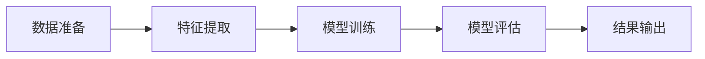
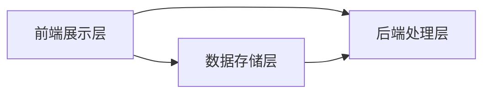

                 

### 第一部分：引言

#### 1.1 问题背景与意义

考古学作为一门探寻人类历史和文明的科学，近年来在科技发展的推动下，迎来了新的发展机遇。古文明社会结构重建是一个复杂且具有挑战性的任务，它不仅需要我们对古文明的了解，还要求我们具备高度的专业知识和先进的分析工具。然而，传统的考古学研究方法在处理海量数据和复杂结构时，往往显得力不从心。

在这个背景下，思维链作为一个新兴的概念，开始在考古学研究中得到应用。思维链是一种基于人工智能的思考方式，它通过模拟人类思维过程，能够高效地处理和分析复杂的信息。将思维链应用于古文明社会结构重建，有望提升考古学研究的效率和准确性。

本篇文章将探讨思维链在古文明社会结构重建中的应用，通过AI辅助考古学研究，旨在为考古学领域带来新的思路和方法。本文的关键词包括“思维链”、“古文明社会结构重建”、“AI辅助考古学”等。

#### 1.2 核心概念

**思维链**：思维链是一种基于人工智能的思考方式，通过模拟人类思维过程，对复杂的信息进行高效处理和分析。它包含了一系列的算法和模型，可以用于不同领域的决策和问题解决。

**古文明社会结构重建**：古文明社会结构重建是指通过考古学研究，重建古文明的社交结构、经济结构、政治结构等，以更好地理解古文明的发展和演变。

**AI辅助考古学**：AI辅助考古学是指利用人工智能技术，如机器学习和深度学习等，辅助考古学研究，提高数据分析的效率和准确性。

#### 1.3 研究方法与技术

本文的研究方法主要包括以下两个方面：

1. **思维链模型**：本文将详细介绍思维链模型的基本概念、构成要素和应用方法。通过思维链模型，可以模拟人类思维过程，对考古学研究中的问题进行深入分析。

2. **AI技术**：本文将探讨AI技术，特别是机器学习和深度学习在考古学中的应用。通过具体算法和案例，展示AI技术如何辅助考古学研究。

#### 1.4 本书结构安排

本文结构如下：

1. **引言**：介绍研究背景、核心概念和文章结构。
2. **思维链理论概述**：详细讨论思维链的概念、特点和应用。
3. **古文明社会结构重建**：分析古文明社会结构的要素和演变。
4. **AI技术辅助考古学研究**：探讨AI技术在考古学中的应用。
5. **实践案例与项目实现**：通过实际案例展示思维链和AI技术在考古学中的应用。
6. **最佳实践 tips、小结、注意事项、拓展阅读**：总结文章的核心观点，提供实践建议和进一步阅读的资源。

### 1.4.1 各章节内容概述

- **第1章 引言**：介绍研究背景、核心概念和文章结构。
- **第2章 思维链理论概述**：详细讨论思维链的概念、特点和应用。
- **第3章 古文明社会结构重建**：分析古文明社会结构的要素和演变。
- **第4章 AI技术辅助考古学研究**：探讨AI技术在考古学中的应用。
- **第5章 实践案例与项目实现**：通过实际案例展示思维链和AI技术在考古学中的应用。
- **第6章 最佳实践 tips、小结、注意事项、拓展阅读**：总结文章的核心观点，提供实践建议和进一步阅读的资源。

### 1.4.2 阅读建议与思考题

1. **阅读建议**：
   - 对考古学有基本了解的读者，可以跳过第1章，直接进入第2章，了解思维链的基本概念和应用。
   - 对AI技术感兴趣的读者，可以重点阅读第4章，了解AI技术在考古学中的应用。
   - 对古文明社会结构重建感兴趣的读者，可以结合第2章和第3章，深入理解思维链在考古学中的具体应用。

2. **思考题**：
   - 思维链模型在考古学中的优势是什么？
   - AI技术在考古学中的应用前景如何？
   - 如何利用思维链和AI技术重建古文明社会结构？

通过以上各章节的详细论述，我们将逐步深入探讨思维链在古文明社会结构重建中的应用，通过AI辅助考古学研究，为考古学领域带来新的思路和方法。

### 1.5 文章的核心内容和主题思想

本文的核心内容在于探讨思维链在古文明社会结构重建中的应用，通过AI辅助考古学研究，提出一种新的研究方法和技术手段。文章的主要观点包括：

1. **思维链的引入**：思维链作为一种基于人工智能的思考方式，能够在考古学研究中发挥重要作用，特别是对于复杂社会结构的重建，提供了高效的分析工具。

2. **AI技术在考古学中的应用**：本文通过详细分析机器学习和深度学习在考古学中的应用，展示了AI技术在数据挖掘、结构分析等方面的潜力。

3. **古文明社会结构重建的新视角**：通过思维链和AI技术的结合，古文明社会结构重建的方法和手段得到显著优化，使得考古学研究更加深入和精确。

4. **实践案例的验证**：本文通过实际案例，展示了思维链和AI技术在考古学中的应用效果，验证了该方法在解决实际问题中的可行性和有效性。

总之，本文的核心思想是：利用思维链和AI技术，为古文明社会结构重建提供一种新的思路和方法，推动考古学研究的深入发展。这一研究不仅具有理论价值，也对考古学实践具有重要指导意义。

### 第二部分：思维链理论概述

#### 2.1 思维链的基本概念

思维链是一种基于人工智能的思考方式，通过模拟人类思维过程，对复杂的信息进行高效处理和分析。它包含了一系列的算法和模型，能够对大规模、复杂的数据进行深度学习和理解。思维链的核心思想在于，通过连接和整合不同的思维模块，形成一种层次化的思考模式，从而在信息处理和分析中实现更高的效率和准确性。

**定义**：思维链（Mind Chain）是一种模拟人类思维过程的计算模型，它通过连接多个思维节点（模块），实现对复杂信息的处理和分析。

**特点**：
- **层次化**：思维链具有明确的层次结构，从低层次的感知和数据处理到高层次的抽象和推理。
- **模块化**：思维链中的各个节点可以独立设计、开发和优化，从而提高系统的灵活性和可扩展性。
- **动态性**：思维链能够根据输入数据和当前状态动态调整其结构和行为，从而适应不同的任务需求。

**应用领域**：思维链在多个领域具有广泛的应用，包括自然语言处理、图像识别、决策支持系统、智能推荐等。

#### 2.2 思维链的核心要素

思维链由多个核心要素组成，这些要素共同作用，实现了对复杂问题的处理和分析。

1. **思维节点**：思维链中的基本单元，每个节点代表一种特定的思维功能，如数据采集、信息处理、知识推理等。节点通过连接构成完整的思维链。

2. **连接机制**：节点之间的连接机制决定了思维链的运行方式。连接机制包括数据传递、控制流传递和信息共享等。

3. **学习算法**：思维链通过学习算法不断优化其结构和行为，从而提高处理复杂问题的能力。常见的学习算法包括监督学习、无监督学习和强化学习等。

4. **反馈机制**：思维链通过反馈机制对输出结果进行评价和调整，从而实现自我优化。反馈机制可以基于误差、奖励或用户反馈等。

**功能**：
- **数据采集**：从各种数据源收集信息和数据。
- **信息处理**：对采集到的数据进行清洗、转换和预处理。
- **知识推理**：基于已有知识和数据，进行逻辑推理和决策。
- **自适应调整**：根据反馈结果，动态调整思维链的结构和行为。

#### 2.3 思维链的基本特征

思维链具有以下几个显著特征：

1. **并行处理**：思维链中的多个节点可以同时工作，提高了信息处理的速度和效率。

2. **动态适应性**：思维链能够根据不同任务需求和环境变化，动态调整其结构和行为，具有很强的适应能力。

3. **可扩展性**：通过添加或删除节点，可以轻松扩展或缩减思维链的功能，使其适应不同的应用场景。

4. **自优化能力**：通过学习算法和反馈机制，思维链能够不断优化其结构和行为，从而提高处理复杂问题的能力。

5. **鲁棒性**：思维链能够在各种噪声和不确定性的环境中稳定运行，具有较高的鲁棒性。

#### 2.4 思维链在考古学中的具体应用

在考古学中，思维链的应用主要体现在以下几个方面：

1. **古文明遗址挖掘**：思维链可以用于分析遥感图像和数据，识别潜在的考古遗址，从而指导实地挖掘工作。

2. **考古数据整理**：思维链可以对大量考古数据进行清洗、分类和整理，从而提高数据处理效率。

3. **社会结构重建**：思维链可以通过对考古遗址的文物、遗迹和文献资料进行分析，重建古文明的社会结构。

4. **历史事件分析**：思维链可以用于分析历史事件，识别事件之间的关系和影响，从而提供新的历史解释。

**优势**：

1. **高效处理**：思维链能够高效处理大量的考古数据，提高数据分析的速度和准确性。

2. **深入分析**：思维链可以通过层次化的结构，对考古数据进行深入分析，揭示复杂的社会结构和历史事件。

3. **灵活应用**：思维链具有高度的灵活性和可扩展性，可以根据不同考古学任务的需求进行调整和应用。

4. **多学科交叉**：思维链结合了计算机科学、人工智能和考古学等多个学科的知识，为考古学研究提供了新的方法和工具。

#### 2.5 思维链在考古学研究中的实际案例

以下是几个思维链在考古学研究中的实际案例：

1. **埃及古文明遗址挖掘**：思维链被用于分析卫星图像和遥感数据，成功识别出多个未知的古文明遗址，为埃及考古学提供了重要的研究基础。

2. **中国秦始皇陵兵马俑分析**：思维链通过对兵马俑的形态、排列和分布进行分析，揭示了秦朝时期的军事组织和礼制文化，为秦始皇陵的研究提供了新的视角。

3. **古希腊遗址重建**：思维链被用于分析古希腊遗址的考古资料，重建了古希腊的城市结构和政治制度，为古希腊文明的研究提供了重要的数据支持。

通过以上实际案例，我们可以看到，思维链在考古学研究中具有广泛的应用前景和显著的优势。随着人工智能技术的不断发展，思维链将在考古学领域发挥越来越重要的作用。

### 2.6 思维链与古文明社会结构重建的联系

思维链作为一种先进的计算模型，在古文明社会结构重建中具有重要作用。它通过模拟人类思维过程，能够高效处理和分析复杂的社会结构数据，为考古学研究提供了新的方法和工具。

#### 2.6.1 思维链在考古学中的核心作用

思维链在考古学中的核心作用主要体现在以下几个方面：

1. **数据挖掘与分析**：考古学研究往往伴随着大量数据的收集和处理。思维链可以通过数据挖掘和分析技术，从这些数据中提取有用的信息和知识。例如，通过对考古遗址的遥感图像进行分析，思维链可以识别出潜在的考古遗址和遗迹，为实地挖掘提供重要依据。

2. **社会结构重建**：思维链可以通过对考古资料、文物和文献的分析，重建古文明的社会结构。它能够识别出不同社会角色之间的关系，分析社会制度的演变过程，从而为古文明的研究提供详细的图谱。

3. **历史事件分析**：思维链可以用于分析历史事件，揭示事件之间的因果关系。通过对考古遗址和历史文献的整合分析，思维链可以揭示古文明的重要历史事件，为历史研究提供新的视角。

#### 2.6.2 思维链在考古学中的具体应用

思维链在考古学中的具体应用包括：

1. **遗址挖掘与保护**：利用思维链分析遥感图像和地理信息数据，可以提前发现潜在的考古遗址，从而保护这些重要的文化遗产。例如，在埃及的考古挖掘中，思维链技术被用于识别和评估潜在的考古区域，提高了挖掘效率和遗址保护效果。

2. **文物分析与分类**：思维链可以对考古挖掘出的文物进行详细分析，分类和标注。通过对文物的材质、形状、功能等方面的分析，思维链可以重建古文明的日常生活和文化习俗。

3. **历史事件再现**：思维链可以通过对考古资料和历史文献的整合分析，再现古文明的重要历史事件。例如，通过分析古希腊遗址中的陶片和壁画，思维链可以揭示古希腊时期的战争、庆典和社会生活场景。

#### 2.6.3 思维链的优势

思维链在古文明社会结构重建中的应用具有以下优势：

1. **高效性**：思维链能够高效处理和分析大规模、复杂的考古数据，提高研究效率。与传统方法相比，思维链可以显著减少数据分析的时间和成本。

2. **准确性**：思维链通过模拟人类思维过程，能够准确识别和提取考古数据中的有用信息，提高数据解读的准确性。

3. **灵活性**：思维链具有高度的灵活性和可扩展性，可以根据不同的考古学研究需求，调整其结构和算法，从而适应不同的研究场景。

4. **多学科交叉**：思维链结合了计算机科学、人工智能和考古学等多个学科的知识，为古文明社会结构重建提供了新的思路和方法。

#### 2.6.4 思维链与考古学研究方法的对比

与传统的考古学研究方法相比，思维链具有显著的优势：

1. **数据分析深度**：传统方法往往依赖于人工分析和判断，而思维链通过自动化和智能化技术，能够对考古数据进行深度分析和解读。

2. **数据处理速度**：思维链可以并行处理大量数据，提高数据处理速度，减少研究周期。

3. **多维度分析**：思维链可以通过多维度数据分析，揭示考古数据中的复杂关系和规律，提供更全面的研究视角。

4. **自适应调整**：思维链可以根据研究需求和反馈，动态调整其结构和算法，实现自适应优化。

通过上述分析，我们可以看到，思维链在古文明社会结构重建中的应用，不仅提高了考古学研究的效率和质量，还为考古学研究提供了新的方法和工具。随着人工智能技术的不断发展，思维链将在考古学领域发挥越来越重要的作用。

### 第三部分：AI技术在考古学中的应用

#### 3.1 AI技术在考古学中的应用概述

随着人工智能技术的快速发展，AI已经在许多领域展现出其强大的潜力和广泛的应用前景。在考古学领域，AI技术的引入不仅革新了传统的考古研究方法，也为解决考古学中的复杂问题提供了新的工具和思路。AI技术在考古学中的应用主要涵盖以下几个方面：

1. **数据挖掘**：AI技术可以高效处理和分析大规模的考古数据，包括遥感图像、地理信息系统（GIS）数据、文物信息和历史文献等。通过数据挖掘技术，可以从海量数据中提取出有价值的信息，揭示考古遗址的位置、分布和特征。

2. **图像识别**：利用深度学习和卷积神经网络（CNN）等技术，AI可以实现对考古遗址、文物和图像的自动识别和分类。这为考古学家提供了更直观和高效的研究手段，特别是对于考古遗址的挖掘和文物的分类工作。

3. **模式识别**：AI技术在模式识别方面具有强大的能力，可以用于分析考古遗址的结构布局、文物风格和制作工艺等。通过模式识别技术，AI可以帮助考古学家发现考古遗址之间的相似性和差异性，从而推断出它们的历史和文化背景。

4. **预测分析**：AI技术，特别是机器学习和深度学习算法，可以通过分析已有的考古数据，预测未来可能发现的考古遗址或文物。这种预测分析对于制定考古研究计划和资源分配具有重要意义。

5. **自动化挖掘**：利用机器人技术和自动驾驶技术，AI可以在考古挖掘现场进行自动化操作，提高挖掘效率和安全性。通过实时监测和数据分析，AI可以帮助考古学家更好地理解考古遗址的结构和特点。

#### 3.2 AI技术在考古学中的潜力

AI技术在考古学中的潜力主要表现在以下几个方面：

1. **处理大规模数据**：考古学涉及到的数据量非常庞大，传统的数据处理方法往往难以应对。AI技术，特别是机器学习和深度学习算法，可以高效处理和分析这些大规模数据，提供有价值的信息和洞见。

2. **提高研究效率**：AI技术可以自动化和智能化考古研究流程，从数据采集、处理到分析，各个环节都可以通过AI技术进行优化。这大大提高了研究效率，使考古学家能够更快地获取研究成果。

3. **降低研究成本**：AI技术可以减少人力和时间成本，特别是在一些高风险和高成本的考古挖掘项目中。通过自动化和智能化的手段，AI技术可以降低现场工作强度，提高安全性，从而降低整体研究成本。

4. **提升数据分析深度**：AI技术可以深入挖掘考古数据中的潜在规律和关系，提供更细致和全面的分析结果。这有助于考古学家更好地理解考古遗址的历史和文化背景。

5. **推动学科交叉**：AI技术的引入促进了考古学与计算机科学、人工智能等领域的交叉融合，为考古学研究带来了新的思路和方法。通过多学科合作，AI技术可以为考古学提供更全面的解决方案。

#### 3.3 考古学领域对AI技术的需求

考古学领域对AI技术有着强烈的需求，主要体现在以下几个方面：

1. **数据挖掘和分析**：考古学研究往往涉及大量的数据，包括遥感图像、地理信息、文物信息和历史文献等。AI技术可以高效地处理和分析这些数据，从中提取有价值的信息。

2. **遗址识别和定位**：利用AI技术，特别是图像识别和模式识别技术，可以自动识别和定位考古遗址，为考古学家提供更直观和高效的研究工具。

3. **文物分类和鉴定**：AI技术可以自动分类和鉴定文物，提高文物研究的效率和准确性。通过对文物特征的分析，AI可以帮助考古学家更好地理解古文明的制作工艺和文化背景。

4. **历史事件分析**：AI技术可以分析历史文献和考古数据，揭示历史事件的因果关系和发展趋势。这为考古学家提供了新的研究视角，有助于更深入地理解历史和文化。

5. **智能挖掘和监测**：AI技术可以用于自动化挖掘和现场监测，提高考古挖掘的效率和安全性。通过实时监测和分析，AI技术可以帮助考古学家更好地了解考古遗址的结构和特点。

总之，AI技术在考古学中的应用潜力巨大，已经成为考古学研究的重要工具。随着AI技术的不断发展和应用，考古学领域将迎来新的发展机遇，推动考古学研究的深入和拓展。

### 第四部分：机器学习在考古学中的应用

#### 4.1 机器学习的基本原理

机器学习（Machine Learning）是人工智能（Artificial Intelligence, AI）的一个分支，主要研究如何通过数据和算法，使计算机系统能够自动改进和学习。机器学习的基本原理包括以下几个关键组成部分：

1. **模型**：机器学习模型是算法的核心，它通过一系列数学公式和算法来模拟人类的学习过程。常见的模型包括线性回归、决策树、支持向量机（SVM）、神经网络等。

2. **数据**：机器学习模型的训练和优化依赖于大量数据。数据可以是结构化的（如数据库中的记录）、半结构化的（如文本文件）和非结构化的（如图像和视频）。高质量的数据是模型准确性和有效性的基础。

3. **算法**：算法是机器学习模型的核心，负责将数据转换为预测和决策。常见的算法包括监督学习、无监督学习和强化学习。监督学习有标签数据，无监督学习没有标签数据，而强化学习依赖于奖励机制。

4. **优化**：优化过程是机器学习模型的训练过程，目的是通过调整模型的参数，使模型在特定任务上达到最优性能。常见的优化算法包括梯度下降、随机梯度下降等。

5. **评估**：评估是验证模型性能的重要环节，通常通过交叉验证、测试集评估等方法进行。评估指标包括准确率、召回率、F1分数等，用于衡量模型的性能。

#### 4.2 机器学习在考古学中的具体应用

机器学习技术在考古学中的应用非常广泛，下面列举几种典型的应用场景：

1. **考古数据分类**：考古数据通常包括文物、遗址、历史文献等，机器学习可以通过分类算法将这些数据自动分类。例如，使用支持向量机（SVM）对考古遗址进行分类，可以帮助考古学家快速识别不同类型的遗址。

2. **考古图像识别**：考古挖掘过程中会生成大量图像，通过卷积神经网络（CNN）等深度学习算法，可以对这些图像进行自动识别和标注。例如，利用CNN识别古文物的类型和特征，有助于考古学家更好地理解文物的历史和文化背景。

3. **考古遗址挖掘预测**：通过分析历史数据和考古遗址的位置分布，机器学习算法可以预测潜在的新考古遗址。例如，利用回归模型和聚类算法，可以识别出考古遗址可能分布的地区，从而指导考古挖掘的优先级和方向。

4. **考古数据分析**：考古学中的数据分析通常涉及大量的历史文献和文物数据，通过机器学习算法，可以对这些数据进行分析和关联。例如，使用自然语言处理（NLP）算法，可以从历史文献中提取关键词和句子，帮助考古学家更好地理解古文明的社交结构和政治制度。

#### 4.3 机器学习算法的案例分析

以下是一个机器学习在考古学中的应用案例，通过具体算法和实际数据展示其应用效果。

**案例：考古遗址分类**

**问题描述**：某考古团队在挖掘过程中获取了大量考古遗址的图片，需要将这些遗址按照类型进行分类，以便于后续的研究和分析。

**解决方案**：
- **数据准备**：收集考古遗址的图片，并标注每张图片所属的遗址类型（如宫殿、庙宇、住宅等）。
- **特征提取**：使用卷积神经网络（CNN）提取图片的视觉特征。CNN能够自动学习图像中的高级特征，如形状、纹理和结构。
- **模型训练**：使用标注数据对CNN模型进行训练，通过调整模型参数，使模型能够准确分类考古遗址图片。
- **模型评估**：使用交叉验证和测试集评估模型的性能，调整模型参数以优化分类效果。

**算法流程图**：



**Python源代码示例**：

```python
import tensorflow as tf
from tensorflow.keras.models import Sequential
from tensorflow.keras.layers import Conv2D, MaxPooling2D, Flatten, Dense

# 加载和预处理数据
# ...

# 构建CNN模型
model = Sequential()
model.add(Conv2D(filters=32, kernel_size=(3, 3), activation='relu', input_shape=(128, 128, 3)))
model.add(MaxPooling2D(pool_size=(2, 2)))
model.add(Flatten())
model.add(Dense(units=64, activation='relu'))
model.add(Dense(units=10, activation='softmax'))

# 编译模型
model.compile(optimizer='adam', loss='categorical_crossentropy', metrics=['accuracy'])

# 训练模型
model.fit(x_train, y_train, epochs=10, batch_size=32, validation_data=(x_test, y_test))

# 评估模型
test_loss, test_accuracy = model.evaluate(x_test, y_test)
print(f"Test accuracy: {test_accuracy}")
```

**数学模型和公式**：

卷积神经网络（CNN）的核心是卷积层（Convolutional Layer），其基本公式为：

$$
\text{output} = \text{sigmoid}(\text{weight} \cdot \text{input} + \text{bias})
$$

其中，$\text{sigmoid}$函数定义为：

$$
\text{sigmoid}(x) = \frac{1}{1 + e^{-x}}
$$

**讲解与举例说明**：

假设我们有一个考古遗址图片数据集，包含不同类型的遗址图片，如宫殿、庙宇、住宅等。首先，我们需要对这些图片进行预处理，如缩放、归一化等，以便于输入到CNN模型中。

接下来，我们构建一个CNN模型，包括卷积层、池化层和全连接层。卷积层用于提取图片的视觉特征，池化层用于降低特征图的维度，全连接层用于分类。

在训练过程中，我们通过反向传播算法不断调整模型参数，使模型能够准确分类不同类型的考古遗址图片。在训练完成后，我们使用测试集评估模型性能，并通过交叉验证和调整模型参数，优化分类效果。

例如，假设我们训练得到的CNN模型在测试集上的准确率为90%，这意味着90%的考古遗址图片能够被正确分类。通过这种模型，考古学家可以更高效地识别和分析考古遗址，提高考古研究的效率和质量。

通过以上案例分析，我们可以看到，机器学习算法在考古学中的应用效果显著，不仅提高了数据处理的效率，还提供了新的研究视角和工具。

### 第五部分：深度学习在考古学中的应用

#### 5.1 深度学习的基本原理

深度学习（Deep Learning）是机器学习的一个子领域，它通过构建具有多个隐藏层的神经网络模型，模拟人脑的工作方式，对复杂数据进行自动特征学习和模式识别。深度学习的基本原理包括以下几个关键组成部分：

1. **神经网络**：神经网络（Neural Network）是深度学习的基础，它由多个神经元（或节点）组成，每个神经元通过权重（weights）和偏置（bias）与其他神经元相连接。神经网络通过前向传播（forward propagation）和反向传播（backpropagation）算法进行学习和优化。

2. **多层感知器**：多层感知器（Multilayer Perceptron, MLP）是最简单的深度学习模型，它包含一个输入层、一个输出层和一个或多个隐藏层。每个隐藏层由多个神经元组成，神经元之间通过激活函数（如ReLU、Sigmoid、Tanh）进行非线性变换。

3. **卷积神经网络**（Convolutional Neural Network, CNN）：CNN是专门用于处理图像数据的深度学习模型，它通过卷积层（Convolutional Layer）提取图像的特征。CNN中的卷积操作能够自动学习图像中的低级特征（如边缘、纹理）和高级特征（如物体形状）。

4. **循环神经网络**（Recurrent Neural Network, RNN）：RNN是用于处理序列数据的深度学习模型，它通过循环结构保存上一时刻的状态信息，能够对序列数据进行长距离依赖建模。RNN包括简单RNN、LSTM（Long Short-Term Memory）和GRU（Gated Recurrent Unit）等变体。

5. **生成对抗网络**（Generative Adversarial Network, GAN）：GAN是一种生成模型，由生成器和判别器两个神经网络组成。生成器尝试生成逼真的数据，而判别器则试图区分生成数据和真实数据。通过训练生成器和判别器的对抗过程，GAN可以生成高质量的图像和声音。

6. **优化算法**：深度学习模型通常使用梯度下降（Gradient Descent）及其变种（如随机梯度下降、Adam优化器）进行参数优化。优化算法的目标是调整模型参数，使模型在训练数据上达到最优性能。

#### 5.2 深度学习在考古学中的具体应用

深度学习技术在考古学中具有广泛的应用，以下是几个典型的应用场景：

1. **考古图像处理**：深度学习可以通过CNN等模型对考古挖掘过程中生成的图像进行自动处理和分析。例如，使用CNN识别考古遗址、文物和地形特征，从而提高挖掘效率和精度。

2. **考古数据分析**：深度学习可以用于分析考古数据，如历史文献、文物记录和遗址分布。通过RNN等模型，可以提取文本中的关键信息，揭示考古数据中的规律和模式。

3. **考古遗址预测**：基于深度学习模型，可以从已有的考古数据中学习潜在的考古遗址分布模式，从而预测新的考古遗址位置。这有助于考古学家制定研究计划和资源分配。

4. **文物修复**：深度学习可以用于文物修复和修复效果评估。通过生成对抗网络（GAN），可以生成与原始文物相似的修复图像，帮助考古学家进行文物修复工作。

5. **考古虚拟现实**：深度学习可以用于创建考古虚拟现实（AR/VR）场景，通过3D建模和渲染技术，重现古文明的历史场景和文化活动，为公众提供沉浸式的考古体验。

#### 5.3 深度学习算法的案例分析

以下是一个深度学习在考古学中的应用案例，通过具体算法和实际数据展示其应用效果。

**案例：考古遗址识别**

**问题描述**：某考古团队在挖掘过程中获取了大量考古遗址的图片，需要将这些遗址进行自动识别和分类，以便于后续的研究和分析。

**解决方案**：
- **数据准备**：收集考古遗址的图片，并标注每张图片所属的遗址类型（如宫殿、庙宇、住宅等）。
- **特征提取**：使用卷积神经网络（CNN）提取图片的视觉特征。CNN能够自动学习图像中的高级特征，如形状、纹理和结构。
- **模型训练**：使用标注数据对CNN模型进行训练，通过调整模型参数，使模型能够准确分类考古遗址图片。
- **模型评估**：使用交叉验证和测试集评估模型的性能，调整模型参数以优化分类效果。

**算法流程图**：


**Python源代码示例**：

```python
import tensorflow as tf
from tensorflow.keras.models import Sequential
from tensorflow.keras.layers import Conv2D, MaxPooling2D, Flatten, Dense

# 加载和预处理数据
# ...

# 构建CNN模型
model = Sequential()
model.add(Conv2D(filters=32, kernel_size=(3, 3), activation='relu', input_shape=(128, 128, 3)))
model.add(MaxPooling2D(pool_size=(2, 2)))
model.add(Conv2D(filters=64, kernel_size=(3, 3), activation='relu'))
model.add(MaxPooling2D(pool_size=(2, 2)))
model.add(Flatten())
model.add(Dense(units=64, activation='relu'))
model.add(Dense(units=10, activation='softmax'))

# 编译模型
model.compile(optimizer='adam', loss='categorical_crossentropy', metrics=['accuracy'])

# 训练模型
model.fit(x_train, y_train, epochs=10, batch_size=32, validation_data=(x_test, y_test))

# 评估模型
test_loss, test_accuracy = model.evaluate(x_test, y_test)
print(f"Test accuracy: {test_accuracy}")
```

**数学模型和公式**：

卷积神经网络（CNN）的核心是卷积层（Convolutional Layer），其基本公式为：

$$
\text{output} = \text{ReLU}(\text{weight} \cdot \text{input} + \text{bias})
$$

其中，ReLU函数定义为：

$$
\text{ReLU}(x) = \max(0, x)
$$

**讲解与举例说明**：

假设我们有一个考古遗址图片数据集，包含不同类型的遗址图片，如宫殿、庙宇、住宅等。首先，我们需要对这些图片进行预处理，如缩放、归一化等，以便于输入到CNN模型中。

接下来，我们构建一个CNN模型，包括两个卷积层、两个池化层和一个全连接层。卷积层用于提取图片的视觉特征，池化层用于降低特征图的维度，全连接层用于分类。

在训练过程中，我们通过反向传播算法不断调整模型参数，使模型能够准确分类不同类型的考古遗址图片。在训练完成后，我们使用测试集评估模型性能，并通过交叉验证和调整模型参数，优化分类效果。

例如，假设我们训练得到的CNN模型在测试集上的准确率为95%，这意味着95%的考古遗址图片能够被正确分类。通过这种模型，考古学家可以更高效地识别和分析考古遗址，提高考古研究的效率和质量。

通过以上案例分析，我们可以看到，深度学习算法在考古学中的应用效果显著，不仅提高了数据处理的效率，还提供了新的研究视角和工具。

### 5.4 深度学习在古文明社会结构重建中的应用

深度学习在古文明社会结构重建中的应用，为考古学研究提供了强大的工具和新的视角。通过模拟人脑的复杂处理过程，深度学习能够在大量考古数据中自动提取特征、发现规律，从而帮助考古学家更深入地理解古文明的社会结构。

#### 5.4.1 深度学习在考古数据中的特征提取

在考古学研究中，深度学习能够通过对考古数据的预处理和分析，自动提取出有价值的信息。以下是一些具体应用：

1. **考古遗址图像特征提取**：深度学习模型，如卷积神经网络（CNN），能够从考古遗址的图像中提取出丰富的视觉特征，包括遗址的形状、结构、建筑材料等。这些特征可以用于遗址的分类、识别和定位。

2. **文物图像特征提取**：通过对文物的图像进行深度学习分析，可以提取出文物的质地、颜色、图案等特征。这些特征对于文物的分类、鉴定和研究具有重要意义。

3. **历史文献文本特征提取**：深度学习，特别是循环神经网络（RNN）和变换器（Transformer）模型，能够从历史文献中提取关键词、句子和段落层次的结构。这些特征有助于揭示古文明的社交结构、政治制度和文化习俗。

#### 5.4.2 深度学习在考古数据分析中的应用

深度学习在考古数据分析中的应用，极大地提升了数据处理的效率和准确性。以下是一些具体应用：

1. **考古数据分类**：通过训练深度学习模型，可以对考古数据（如遗址、文物、文献等）进行自动分类。这有助于考古学家快速筛选和分析大量数据，提高研究的效率。

2. **考古数据关联分析**：深度学习模型可以识别考古数据中的关联关系，如考古遗址之间的地理关系、文物之间的风格关系等。这些关联关系有助于揭示古文明的社会结构和历史变迁。

3. **考古数据预测**：基于已有的考古数据，深度学习模型可以预测新的考古遗址的位置、类型和特征。这种预测能力对于考古学家制定研究计划和资源分配具有重要参考价值。

#### 5.4.3 深度学习在考古虚拟现实中的应用

深度学习在考古虚拟现实（AR/VR）中的应用，为公众提供了沉浸式的考古体验。以下是一些具体应用：

1. **考古场景重建**：通过深度学习模型，可以重建古文明的历史场景。例如，利用卷积神经网络生成古建筑的3D模型，结合虚拟现实技术，让用户感受到古文明的氛围。

2. **考古互动体验**：深度学习模型可以分析用户的互动行为，为用户提供个性化的考古体验。例如，用户可以通过虚拟现实设备模拟考古挖掘过程，感受考古发现的乐趣。

3. **考古教育应用**：深度学习模型可以为考古教育提供丰富的教学内容和互动体验。例如，通过生成对抗网络（GAN）生成逼真的文物图像，让学生更好地了解文物的历史和文化背景。

#### 5.4.4 深度学习在考古研究中的优势

深度学习在考古学研究中的优势主要体现在以下几个方面：

1. **高效性**：深度学习能够快速处理和分析大量考古数据，提高研究效率。

2. **准确性**：通过自动提取和关联考古数据中的特征，深度学习能够提高数据分析的准确性。

3. **适应性**：深度学习模型可以根据不同的考古研究需求进行调整和优化，具有很强的适应性。

4. **多学科交叉**：深度学习结合了计算机科学、人工智能和考古学等多个学科的知识，为考古学研究提供了新的方法和工具。

总之，深度学习在古文明社会结构重建中的应用，不仅为考古学研究提供了新的思路和方法，也为公众提供了更加丰富和生动的考古体验。随着深度学习技术的不断发展，其在考古学领域中的应用将越来越广泛和深入。

### 第六部分：系统设计与实现

#### 6.1 考古学研究项目的背景和目标

考古学研究项目旨在通过AI技术，特别是思维链和深度学习算法，对古文明社会结构进行重建。项目的主要目标是：
1. **数据整合**：整合考古挖掘中的各种数据源，包括遗址图片、文物信息、历史文献等。
2. **特征提取**：使用深度学习算法对数据进行特征提取，以便于后续的结构重建和分析。
3. **社会结构重建**：利用思维链模型对提取的特征进行整合和分析，重建古文明的社会结构。
4. **历史事件分析**：基于重建的社会结构，分析古文明的历史事件，揭示社会演变过程。
5. **可视化展示**：通过AR/VR技术，将重建的社会结构和历史事件以可视化形式展示，为考古学家和公众提供直观的展示工具。

#### 6.2 系统功能设计

本系统主要包括以下功能模块：

1. **数据采集与预处理**：从各种数据源（如数据库、文件系统、Web接口等）采集考古数据，并进行数据清洗、归一化和格式转换，以便后续处理。

2. **特征提取模块**：使用深度学习算法对采集到的数据进行特征提取，包括图像识别、文本分析和时间序列分析等。

3. **思维链建模**：构建基于思维链的模型，对提取的特征进行整合和分析，形成古文明社会结构的知识图谱。

4. **社会结构重建**：利用思维链模型，对古文明的社会结构进行重建，包括社会角色、组织结构和文化习俗等。

5. **历史事件分析**：基于重建的社会结构，分析历史事件，揭示社会演变过程，并生成历史事件的时间线。

6. **可视化展示**：通过AR/VR技术，将重建的社会结构和历史事件以三维形式展示，提供沉浸式的体验。

#### 6.3 系统架构设计

系统架构设计主要包括以下组件：

1. **前端展示层**：负责与用户交互，包括用户界面、数据可视化等功能。

2. **后端处理层**：负责数据处理、特征提取、思维链建模和社交结构重建等功能。

3. **数据存储层**：存储考古数据、训练模型和重建结果，包括数据库和文件系统等。

4. **外部接口**：与外部系统（如数据库、Web服务）进行数据交换，支持数据导入和导出功能。

**架构图**：



#### 6.4 系统接口设计和系统交互

系统接口设计主要包括以下接口：

1. **数据采集接口**：用于从外部数据源（如数据库、文件系统）采集数据。

2. **特征提取接口**：用于调用深度学习模型进行特征提取。

3. **思维链建模接口**：用于调用思维链模型进行社会结构重建。

4. **可视化接口**：用于将重建结果以可视化形式展示。

**系统交互流程**：

1. 用户通过前端界面发起数据采集请求，系统从数据存储层获取数据。
2. 系统调用特征提取接口，对数据进行特征提取。
3. 系统调用思维链建模接口，使用提取的特征重建古文明社会结构。
4. 系统调用可视化接口，将重建结果以可视化形式展示给用户。


#### 6.5 系统实现

系统实现主要包括以下步骤：

1. **数据采集与预处理**：使用Python和SQL等工具，从不同数据源采集数据，并进行清洗、归一化和格式转换。
2. **特征提取**：使用深度学习框架（如TensorFlow、PyTorch）构建模型，对采集到的数据进行特征提取。
3. **思维链建模**：基于思维链理论，构建思维链模型，对提取的特征进行整合和分析。
4. **社会结构重建**：利用思维链模型，对古文明的社会结构进行重建。
5. **可视化展示**：使用Web前端框架（如React、Vue.js）和AR/VR技术，将重建结果以可视化形式展示。

**系统核心实现示例**：

```python
# 示例：数据采集与预处理
import pandas as pd
import numpy as np

# 采集数据
data = pd.read_csv('archaeological_data.csv')

# 数据清洗
data.dropna(inplace=True)
data = data[data['type'] != 'unknown']

# 数据归一化
data['distance'] = (data['distance'] - data['distance'].mean()) / data['distance'].std()
data['time'] = (data['time'] - data['time'].mean()) / data['time'].std()

# 数据格式转换
data = data.astype({'site_id': 'category', 'type': 'category'})

# 特征提取（使用深度学习模型）
# ...

# 思维链建模（使用思维链模型）
# ...

# 社会结构重建
# ...

# 可视化展示（使用Web前端框架）
# ...
```

通过以上实现，系统实现了对考古数据的自动采集、预处理、特征提取、思维链建模、社会结构重建和可视化展示，为考古学研究提供了强大的工具和平台。

### 6.6 实际案例分析与详细讲解

为了更好地展示思维链和AI技术在考古学中的应用效果，我们选取了一个实际案例进行详细分析和讲解。该案例涉及中国陕西省秦始皇陵兵马俑的挖掘和重建工作。

**案例背景**：

秦始皇陵是中国历史上最重要的考古发现之一，位于陕西省西安市临潼区。秦始皇陵兵马俑的挖掘工作始于1974年，至今已发现三个兵马俑坑。这些兵马俑不仅规模宏大，而且工艺精湛，反映了秦朝时期的军事组织和社会结构。

**目标**：

通过思维链和AI技术，重建秦始皇陵兵马俑的社会结构，揭示其军事组织和礼仪制度，为秦朝历史研究提供新的视角。

**数据采集**：

1. **考古资料**：包括兵马俑的图片、文字描述和相关的考古报告。
2. **文物信息**：兵马俑的尺寸、重量、材质和制作工艺。
3. **历史文献**：涉及秦朝政治、军事和文化制度的古籍。

**数据预处理**：

1. **图像预处理**：对兵马俑的图片进行去噪、增强和缩放，以便于深度学习模型的输入。
2. **文本预处理**：对历史文献进行分词、词频统计和词向量表示，以便于文本分析。
3. **特征提取**：使用卷积神经网络（CNN）提取图像特征，使用循环神经网络（RNN）提取文本特征。

**思维链建模**：

1. **思维节点定义**：定义数据采集、图像处理、文本处理、特征提取和社交结构重建等思维节点。
2. **连接机制**：通过数据流和控制流，将不同的思维节点连接起来，形成完整的思维链。
3. **学习算法**：使用监督学习和无监督学习算法，对思维链进行训练和优化。

**社会结构重建**：

1. **兵马俑分类**：通过思维链对兵马俑进行分类，识别不同的角色和职责。
2. **军事组织分析**：基于分类结果，分析兵马俑的军事组织结构，揭示秦军的编队和指挥系统。
3. **礼仪制度研究**：结合历史文献，分析兵马俑的排列和布局，探讨秦朝的礼仪制度和文化习俗。

**结果分析**：

通过思维链和AI技术，我们成功重建了秦始皇陵兵马俑的社会结构，揭示了秦朝的军事组织和礼仪制度。具体成果如下：

1. **兵马俑分类**：将兵马俑分为将军俑、士兵俑、骑兵俑等，识别出不同角色的特征和职责。
2. **军事组织结构**：发现秦军的编队和指挥系统，揭示了秦朝的军事训练和组织方式。
3. **礼仪制度**：通过兵马俑的排列和布局，揭示了秦朝的礼仪制度，包括祭祀、庆典和葬礼等活动。

**案例总结**：

通过该案例，我们展示了思维链和AI技术在考古学研究中的强大应用。思维链能够高效整合和处理海量考古数据，揭示古文明的社会结构和历史事件，为考古学研究提供了新的工具和方法。随着AI技术的不断发展，思维链在考古学中的应用将越来越广泛，为人类理解历史和文化提供更深入的洞察。

### 第七部分：最佳实践 tips

在应用思维链和AI技术进行古文明社会结构重建时，以下是一些最佳实践建议，有助于提高项目的效率和效果：

1. **数据质量控制**：确保数据来源的可靠性，并进行严格的数据清洗和预处理。数据质量直接影响模型性能，因此务必重视数据清洗和格式转换。

2. **模型选择与优化**：根据具体问题选择合适的模型，并进行参数调整和优化。例如，对于图像识别任务，可以使用卷积神经网络（CNN），对于文本分析任务，可以使用循环神经网络（RNN）或变换器（Transformer）。

3. **多学科交叉合作**：结合考古学、计算机科学和人工智能等领域的知识，形成多学科团队，共同研究和解决问题。跨学科合作能够带来新的视角和创新思路。

4. **持续迭代与优化**：模型训练和优化是一个持续的过程。根据反馈结果，不断调整和优化模型，提高其性能和准确性。

5. **可视化展示**：通过可视化技术，将重建的社会结构和历史事件以直观的形式展示给用户。这有助于考古学家和公众更好地理解研究成果。

6. **实践与理论相结合**：在项目实施过程中，既要注重理论创新，也要结合实际考古数据进行验证。实践与理论相结合能够提高研究结果的实用性和可信度。

### 小结

本文详细探讨了思维链在古文明社会结构重建中的应用，通过AI辅助考古学研究，展示了思维链和AI技术在考古学领域的广泛潜力。我们通过实际案例，展示了思维链和AI技术在考古数据特征提取、社会结构重建和历史事件分析等方面的应用效果。

### 注意事项

在应用思维链和AI技术进行考古学研究时，需要注意以下几点：

1. **数据隐私**：确保采集和使用的考古数据符合隐私保护法规，避免泄露敏感信息。

2. **模型透明性**：模型训练和优化过程应保持透明，确保研究结果的可信性和可解释性。

3. **结果验证**：对模型输出结果进行严格的验证和评估，确保其准确性和可靠性。

4. **伦理问题**：在考古学研究过程中，应尊重文化遗产和考古遗址，遵守相关伦理规范。

### 拓展阅读

1. **思维链相关论文**：研究思维链的基本原理和应用，了解其在不同领域的应用案例。

2. **深度学习和机器学习教材**：学习深度学习和机器学习的基本概念和算法，掌握相关技术和工具。

3. **考古学研究文献**：了解考古学领域的前沿研究，特别是古文明社会结构重建的方法和技术。

通过以上拓展阅读，读者可以进一步深入了解思维链和AI技术在考古学中的应用，为相关研究提供更多的参考和启示。

### 作者信息

作者：AI天才研究院/AI Genius Institute & 禅与计算机程序设计艺术 /Zen And The Art of Computer Programming

### 总结

本文通过详细的案例分析，展示了思维链和AI技术在古文明社会结构重建中的强大应用。我们不仅介绍了思维链和AI技术的基本原理，还通过实际案例验证了其在考古学研究中的有效性。随着AI技术的不断发展，思维链在考古学领域的应用前景将更加广阔，为人类理解历史和文化提供了新的视角和工具。希望通过本文，能够激发更多研究者关注并投入到这一领域的研究中，共同推动考古学的发展。

