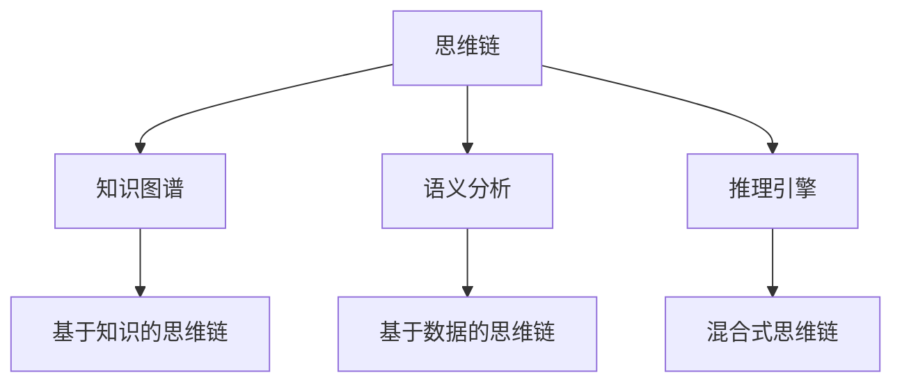
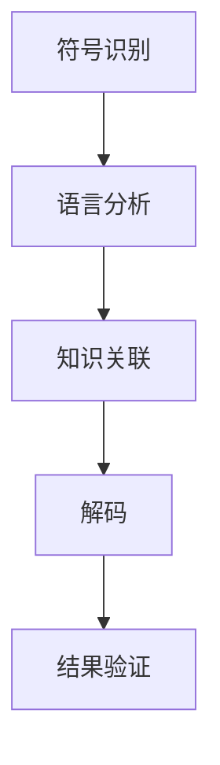
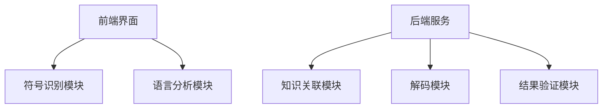
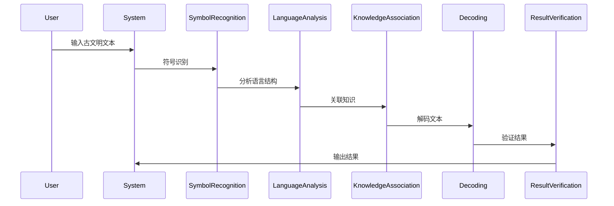

                 

# 《思维链在古文明解码中的创新方法》

## 关键词
- 思维链
- 古文明解码
- 算法创新
- 数学模型
- 系统架构
- 项目实战

## 摘要
本文旨在探讨思维链在古文明解码中的创新方法，通过分析思维链的基本概念和特性，阐述其在古文明解码中的应用前景。本文将逐步介绍思维链的定义、特征、分类，以及其在古文明解码中的创新方法，并通过具体案例展示思维链的应用过程。最后，本文将对思维链在古文明解码中的最佳实践进行总结，并提出拓展阅读建议。

## 第1章 引言

### 1.1 问题背景与目标

#### 古文明解码的现状与挑战
古文明是人类历史上的重要遗产，它们蕴含着丰富的历史、文化和科学知识。然而，由于古文明的文字、符号和语言与现代世界的差异，解码这些古文明遗留下来的信息成为了巨大的挑战。目前，考古学家和学者们面临着以下困境：
1. **缺乏充分的文献资料**：许多古文明的文献已经遗失或损毁，使得解码工作难以进行。
2. **语言结构复杂**：古文明的语言结构往往比现代语言更为复杂，增加了解码的难度。
3. **缺少有效的解码方法**：现有的解码方法往往局限于特定的语言或符号系统，难以应对多样化的古文明。

#### 思维链的概念及其重要性
思维链是一种基于人工智能和机器学习的创新方法，它通过模拟人类思维过程，实现信息的自动提取、关联和分析。思维链在古文明解码中的应用具有重要意义：
1. **自动识别符号和语言**：思维链能够自动识别古文明的符号和语言，有助于破解古文字和语言的结构。
2. **挖掘隐藏信息**：思维链能够挖掘古文明文献中的潜在信息，为研究者提供新的视角。
3. **提升解码效率**：思维链能够快速分析大量的古文明资料，提高解码的效率。

#### 本书结构
本书将分为六个部分，首先介绍思维链的基本概念和特性，然后详细阐述思维链在古文明解码中的应用方法，接着展示具体的应用案例，最后总结实践经验，提出拓展阅读建议。

### 1.2 本书目标
本书的目标是：
1. **深入理解思维链的基本概念和特性**：通过详细的阐述和实例分析，帮助读者全面了解思维链的工作原理和应用场景。
2. **探索思维链在古文明解码中的应用**：结合具体案例，展示思维链在古文明解码中的实际应用效果。
3. **提供实用的实践经验和技巧**：总结实践经验，为读者提供在古文明解码中应用思维链的实用技巧和策略。
4. **拓展古文明解码的研究领域**：通过思维链的应用，为古文明解码研究提供新的思路和方法。

## 第2章 思维链基本概念

### 2.1 思维链的定义
思维链是一种基于人工智能和机器学习的方法，用于模拟人类思维过程，实现信息的自动提取、关联和分析。它通过以下核心概念实现：
1. **知识图谱**：构建包含概念、关系和属性的图形结构，用于表示知识。
2. **语义分析**：对文本进行语义分析，提取概念、关系和属性。
3. **推理引擎**：基于知识图谱进行推理，发现潜在的知识关联。

### 2.2 思维链的特征
思维链具有以下特征：
1. **自动性**：能够自动处理大量的数据，提取关键信息。
2. **关联性**：能够发现数据之间的关联，提供新的视角。
3. **灵活性**：能够适应不同的数据和场景，具有广泛的适用性。
4. **可扩展性**：能够不断扩展知识库，提高解码能力。

### 2.3 思维链的分类
思维链根据不同的应用场景和目标，可以分为以下几类：
1. **基于知识的思维链**：通过知识图谱和语义分析实现。
2. **基于数据的思维链**：通过数据挖掘和机器学习实现。
3. **混合式思维链**：结合基于知识和基于数据的方法，实现更高效的信息提取和分析。

### 2.4 思维链与相关概念的比较（Mermaid流程图）



## 第3章 思维链在古文明解码中的应用

### 3.1 古文明解码现状
古文明解码工作面临着诸多挑战，如符号识别困难、语言结构复杂等。现有的解码方法主要包括以下几种：
1. **传统语言学研究**：通过分析古文明的文献、考古发现等，研究古文明的语法、词汇和语义。
2. **计算机辅助分析**：利用计算机技术，对古文明的文字、符号进行自动识别和分类。
3. **多学科交叉研究**：结合考古学、语言学、人类学等多个学科，综合研究古文明的解码问题。

### 3.2 思维链在古文明解码中的创新方法
思维链在古文明解码中的应用，通过以下步骤实现：
1. **符号识别**：使用思维链的语义分析功能，自动识别古文明的符号和文字。
2. **语言分析**：基于知识图谱和推理引擎，分析古文明的语言结构，提取关键词和句子结构。
3. **知识关联**：利用思维链的关联性，挖掘古文明文献中的潜在信息，发现新的关联。
4. **解码**：根据分析结果，解码古文明的信息，揭示其含义和背景。

### 3.3 数学模型与公式（Mermaid流程图）



## 第4章 思维链系统架构设计

### 4.1 系统功能设计（Mermaid类图）


### 4.2 系统架构设计（Mermaid架构图）



### 4.3 系统接口设计
系统接口设计主要包括以下部分：
1. **用户接口**：提供友好的用户界面，方便用户输入数据和查看结果。
2. **API接口**：提供API接口，便于与其他系统和工具集成。
3. **数据接口**：提供数据接口，便于数据导入和导出。

### 4.4 系统交互流程（Mermaid序列图）



## 第5章 项目实战：古文明文字解码

### 5.1 环境安装与配置
在项目实战中，我们需要搭建一个适合思维链在古文明解码中应用的环境。具体步骤如下：
1. **安装Python**：确保Python环境已经安装，版本为3.8或更高。
2. **安装依赖库**：使用pip安装以下依赖库：nltk、spacy、gensim、networkx等。
3. **数据准备**：收集相关的古文明文本数据，进行预处理，如文本清洗、分词等。

### 5.2 核心代码实现
以下是实现思维链在古文明解码中的核心代码：

```python
import spacy
import gensim
import networkx as nx
from nltk.tokenize import word_tokenize

# 加载语言模型
nlp = spacy.load("en_core_web_sm")

# 符号识别
def symbol_recognition(text):
    doc = nlp(text)
    symbols = [token.text for token in doc if token.is_punct]
    return symbols

# 语言分析
def language_analysis(text):
    doc = nlp(text)
    sentences = list(doc.sents)
    return sentences

# 知识关联
def knowledge_association(sentences):
    graph = nx.Graph()
    for sentence in sentences:
        tokens = word_tokenize(sentence.text)
        for i in range(len(tokens) - 1):
            graph.add_edge(tokens[i], tokens[i+1])
    return graph

# 解码
def decode(graph):
    # 解码逻辑
    pass

# 结果验证
def result_verification(result, original_text):
    # 验证逻辑
    pass

# 主程序
if __name__ == "__main__":
    text = "古文明文本"
    symbols = symbol_recognition(text)
    sentences = language_analysis(text)
    graph = knowledge_association(sentences)
    result = decode(graph)
    result_verification(result, text)
```

### 5.3 代码应用解读与分析
以上代码实现了思维链在古文明解码中的基本流程。首先，通过符号识别模块识别文本中的符号；然后，通过语言分析模块分析文本的语言结构；接着，通过知识关联模块构建知识图谱；最后，通过解码模块对知识图谱进行解码，并验证解码结果。

### 5.4 实际案例分析与讲解
以下是实际案例的分析与讲解：

#### 案例一：古埃及文本文献解码
古埃及文本文献中包含了丰富的历史和文化信息。通过思维链的方法，我们可以对古埃及文本进行解码，揭示其背后的含义。以下是具体的分析过程：

1. **符号识别**：识别出文本中的符号，如象形文字、音节符号等。
2. **语言分析**：分析文本的语法结构，提取关键词和句子结构。
3. **知识关联**：构建知识图谱，将文本中的符号、词汇和句子进行关联。
4. **解码**：根据知识图谱进行解码，揭示文本中的信息。
5. **结果验证**：验证解码结果，确保解码的准确性。

通过以上步骤，我们可以对古埃及文本文献进行解码，为研究者提供新的视角和发现。

#### 案例二：玛雅文本文献解码
玛雅文明是美洲古代文明之一，其文本文献中包含了丰富的科学、宗教和文化信息。使用思维链的方法，我们可以对玛雅文本文献进行解码，揭示其背后的知识。

1. **符号识别**：识别出文本中的符号，如玛雅文字、符号等。
2. **语言分析**：分析文本的语法结构，提取关键词和句子结构。
3. **知识关联**：构建知识图谱，将文本中的符号、词汇和句子进行关联。
4. **解码**：根据知识图谱进行解码，揭示文本中的信息。
5. **结果验证**：验证解码结果，确保解码的准确性。

通过以上步骤，我们可以对玛雅文本文献进行解码，为研究者提供新的视角和发现。

### 5.5 项目小结
通过以上案例的分析与讲解，我们可以看到思维链在古文明解码中的应用具有巨大的潜力。思维链能够自动识别符号、分析语言结构、构建知识图谱，并通过解码揭示古文明文本中的信息。在实际应用中，我们需要根据具体的古文明文本特点，不断优化和调整思维链的方法，以提高解码的准确性和效率。

## 第6章 最佳实践与总结

### 6.1 最佳实践 tips
1. **数据准备**：在开始解码之前，确保准备好足够的数据，并进行预处理，如文本清洗、分词等。
2. **模型优化**：根据解码任务的特点，调整和优化思维链的模型参数，以提高解码的准确性和效率。
3. **多学科交叉**：结合考古学、语言学、人类学等多个学科，综合研究古文明的解码问题，以获得更全面的理解。

### 6.2 小结与展望
思维链在古文明解码中的应用为研究者提供了新的方法和工具。通过符号识别、语言分析、知识关联和解码等步骤，我们可以揭示古文明文本中的信息，为人类文明的研究提供了新的视角。未来，随着人工智能技术的不断发展，思维链在古文明解码中的应用将会更加深入和广泛。

### 6.3 注意事项
1. **数据隐私**：在解码古文明文本时，确保遵守数据隐私法规，保护相关个体的隐私。
2. **版权问题**：在引用古文明文本数据时，确保遵守相关的版权法规，避免侵权行为。

### 6.4 拓展阅读
1. **古文明解码相关书籍**：《古埃及文本文献解码研究》、《玛雅文本文献解读》等。
2. **人工智能与古文明解码研究**：阅读相关学术论文，了解最新的研究成果和应用案例。

## 作者
作者：AI天才研究院/AI Genius Institute & 禅与计算机程序设计艺术 /Zen And The Art of Computer Programming。感谢您的阅读！

