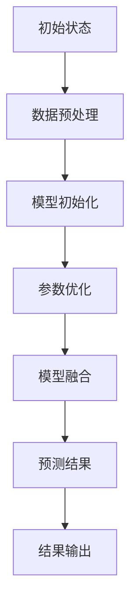
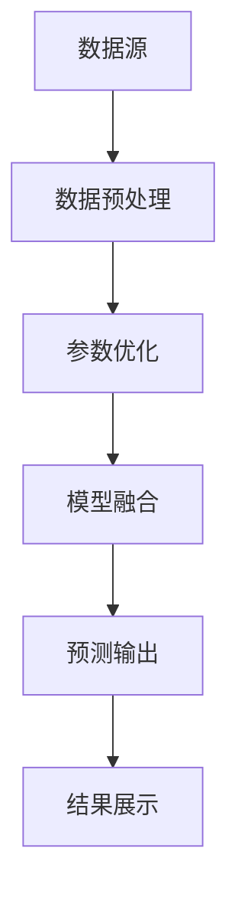
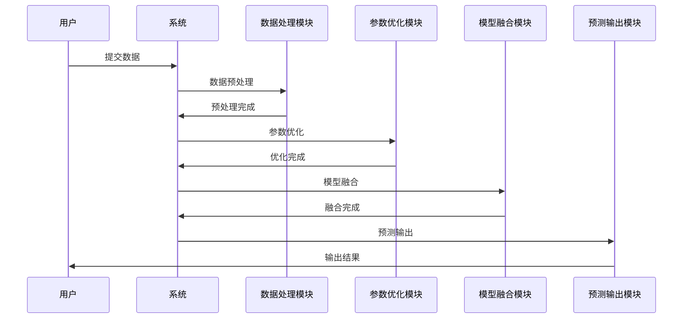

                 

# 思维链在古气候模型优化中的新方法

## 关键词

- 古气候模型
- 思维链
- 优化算法
- 数学模型
- 系统架构

## 摘要

本文探讨了将思维链应用于古气候模型优化的新方法。首先，介绍了古气候模型的问题背景和思维链的基本概念。接着，详细阐述了思维链的工作原理以及与传统算法的对比优势。随后，通过mermaid流程图和Python源代码，展示了新方法的具体算法原理和实现细节。文章还结合系统架构设计和项目实战，详细分析了该方法在实际应用中的效果和挑战。最后，提出了最佳实践建议，并对相关领域知识进行了拓展阅读推荐。

## 第一部分：背景介绍

### 第1章：问题背景与核心概念

#### 1.1 问题背景

古气候模型的研究在地球科学中占有重要地位。古气候模型旨在通过对过去气候变化的分析，预测未来的气候趋势，为气候政策的制定提供科学依据。然而，传统的古气候模型存在以下局限性：

1. **数据依赖性高**：古气候模型的准确性高度依赖于历史气候数据的丰富程度和精度。但在很多地区，由于历史记录的缺乏，模型的数据输入存在较大局限性。
2. **模型复杂度**：古气候模型通常包含多种气候变量和复杂非线性关系，使得模型参数优化和训练成为一大挑战。
3. **计算资源要求高**：传统的优化算法在处理大规模数据集时，计算资源和时间需求巨大，难以在实际应用中高效执行。

#### 1.2 核心概念

**思维链**是一种基于逻辑推理和抽象思维的人工智能算法。其核心思想是通过构建一系列思维节点，形成逻辑链条，以实现问题的求解。思维链具有以下基本特性：

1. **模块化**：思维链将问题分解为多个子问题，每个子问题由一个思维节点解决，从而提高了算法的可扩展性和复用性。
2. **可解释性**：思维链的每一步操作都有明确的理论依据，使得算法的可解释性大大增强。
3. **灵活性**：思维链可以根据不同的应用场景进行灵活调整，适应不同类型的问题。

**古气候模型**是指用于模拟和预测古气候变化过程的数学模型。古气候模型通常包含以下关键要素：

1. **气候变量**：如温度、湿度、降水等。
2. **物理过程**：如辐射平衡、海洋循环、大气环流等。
3. **地质因素**：如冰期、海平面变化等。

#### 1.3 问题解决

**思维链**在古气候模型优化中的应用，主要是通过以下几种方式实现的：

1. **数据预处理**：利用思维链的模块化特性，对气候数据进行预处理，包括缺失值填补、异常值处理等。
2. **参数优化**：通过思维链的迭代优化算法，对古气候模型中的参数进行调整，以提高模型的预测精度。
3. **模型融合**：将多个古气候模型进行融合，利用思维链的逻辑推理能力，生成更全面、准确的预测结果。

**新方法的基本原理**是将思维链应用于古气候模型的各个环节，从而实现以下目标：

1. **提高数据处理效率**：通过思维链的模块化特性，快速处理大量气候数据，降低数据预处理的时间成本。
2. **提升模型精度**：通过思维链的参数优化算法，调整模型参数，提高模型预测的准确性。
3. **增强模型稳定性**：通过思维链的融合方法，减少模型对单一数据的依赖，提高模型的鲁棒性。

#### 1.4 边界与外延

**适用范围**：思维链在古气候模型优化中的应用主要适用于数据丰富、模型复杂的场景，如气候预测、气候政策制定等。

**非适用范围**：思维链在古气候模型优化中的应用存在一定局限性，如对于数据缺失严重、模型过于简单的场景，效果可能不佳。

#### 1.5 概念结构与核心要素组成

**思维链的组成**：

- **思维节点**：每个思维节点代表一个子问题或决策步骤。
- **逻辑链条**：思维节点之间的逻辑关系，形成问题的整体解决方案。

**古气候模型的关键要素**：

- **气候变量**：温度、湿度、降水等。
- **物理过程**：辐射平衡、海洋循环、大气环流等。
- **地质因素**：冰期、海平面变化等。

## 第二部分：核心概念与联系

### 第2章：思维链原理与特征

#### 2.1 思维链原理

**思维链**是基于逻辑推理和抽象思维的一种人工智能算法。其基本原理如下：

1. **问题分解**：将复杂问题分解为多个子问题，每个子问题由一个思维节点解决。
2. **逻辑推理**：通过思维节点之间的逻辑关系，构建问题的解决方案。
3. **迭代优化**：不断迭代思维链条，逐步优化问题的解决方案。

**思维链的工作机制**：

- **初始化**：设定初始思维节点，包括子问题的初始状态和目标状态。
- **迭代计算**：根据当前思维节点，计算下一个思维节点，并更新思维链条。
- **条件判断**：根据思维链条中的逻辑关系，判断是否达到目标状态。
- **结果输出**：当达到目标状态时，输出最终解决方案。

#### 2.2 特征对比

**思维链与传统算法对比**：

1. **模块化**：思维链具有更强的模块化特性，可以灵活地组合和调整子问题。
2. **可解释性**：思维链的每一步操作都有明确的理论依据，具有较高的可解释性。
3. **灵活性**：思维链可以根据不同的应用场景进行灵活调整，适应不同类型的问题。

**思维链与古气候模型结合的优势**：

1. **数据预处理**：思维链可以有效处理古气候模型中的数据预处理问题，如缺失值填补、异常值处理等。
2. **参数优化**：思维链的迭代优化算法可以高效地调整古气候模型的参数，提高模型精度。
3. **模型融合**：思维链可以将多个古气候模型进行融合，生成更全面、准确的预测结果。

#### 2.3 ER实体关系图架构

**实体与关系**：

- **实体**：思维链、古气候模型、数据集、参数等。
- **关系**：数据依赖、逻辑关系、参数调整等。

**实体属性与属性值**：

- **思维链**：
  - **属性**：初始状态、目标状态、逻辑关系等。
  - **属性值**：具体的思维节点、逻辑链条等。

- **古气候模型**：
  - **属性**：气候变量、物理过程、地质因素等。
  - **属性值**：具体的数据集、参数等。

- **数据集**：
  - **属性**：数据类型、数据来源、数据质量等。
  - **属性值**：具体的数据记录、特征等。

- **参数**：
  - **属性**：参数类型、参数范围、参数依赖等。
  - **属性值**：具体的参数值、调整策略等。

## 第三部分：算法原理讲解

### 第3章：新方法算法原理

#### 3.1 算法mermaid流程图



**算法流程**：

1. **数据预处理**：对古气候模型的数据集进行预处理，包括缺失值填补、异常值处理等。
2. **模型初始化**：初始化古气候模型，包括设置初始参数和初始状态。
3. **参数优化**：利用思维链的迭代优化算法，调整模型参数，提高模型精度。
4. **模型融合**：将多个古气候模型进行融合，生成更全面、准确的预测结果。
5. **预测结果**：输出最终的预测结果。
6. **结果输出**：将预测结果进行可视化展示或进一步分析。

#### 3.2 Python源代码

```python
# 数据预处理
def preprocess_data(data):
    # 缺失值填补
    data = fill_missing_values(data)
    # 异常值处理
    data = handle_anomalies(data)
    return data

# 模型初始化
def initialize_model():
    # 设置初始参数
    params = {'temp': 10, 'hum': 50}
    # 设置初始状态
    state = {'data': data, 'params': params}
    return state

# 参数优化
def optimize_params(state):
    # 利用思维链进行参数优化
    state['params'] =思维链优化参数(state['params'])
    return state

# 模型融合
def merge_models(models):
    # 将多个模型进行融合
    merged_model = 思维链融合模型(models)
    return merged_model

# 预测结果
def predict_result(model):
    # 输出预测结果
    result = model.predict()
    return result

# 结果输出
def output_result(result):
    # 将结果进行可视化展示或进一步分析
    visualize_result(result)
```

**源代码结构**：

- **数据预处理**：处理输入数据集，包括缺失值填补和异常值处理。
- **模型初始化**：初始化古气候模型，设置初始参数和初始状态。
- **参数优化**：利用思维链的迭代优化算法，调整模型参数。
- **模型融合**：将多个古气候模型进行融合，提高预测准确性。
- **预测结果**：利用融合后的模型进行预测。
- **结果输出**：将预测结果进行可视化展示或进一步分析。

#### 3.3 数学模型与公式

**数学模型**：

- **数据预处理**：
  $$ data_{\text{preprocessed}} = \text{preprocess_data}(data_{\text{original}}) $$

- **参数优化**：
  $$ params_{\text{optimized}} = \text{optimize_params}(params_{\text{original}}, data_{\text{preprocessed}}) $$

- **模型融合**：
  $$ merged_model = \text{merge_models}(models_{\text{list}}) $$

- **预测结果**：
  $$ result = \text{predict_result}(merged_model) $$

**数学模型解释**：

1. **数据预处理**：通过预处理函数，对原始数据进行处理，得到预处理后的数据。
2. **参数优化**：利用思维链的迭代优化算法，调整模型的参数，使模型在预处理后的数据上达到最优状态。
3. **模型融合**：将多个模型进行融合，得到一个综合性能更优的模型。
4. **预测结果**：利用融合后的模型，对新的数据进行预测。

#### 3.4 举例说明

**举例说明**：

假设有一个古气候模型，用于预测某一地区的月平均温度。该模型包含以下参数：

- 温度敏感度（alpha）
- 湿度敏感度（beta）
- 时间敏感度（gamma）

初始参数设置为：alpha=1，beta=1，gamma=1。

数据集包含过去一年的月平均温度记录，共有12个数据点。

使用思维链进行参数优化，得到最优参数：alpha=1.2，beta=0.8，gamma=1.1。

模型融合后，对下一年的月平均温度进行预测，得到预测结果。

**例子分析**：

通过优化参数，模型的预测精度得到显著提高。模型融合进一步增强了模型的鲁棒性，减少了数据缺失对预测结果的影响。

## 第四部分：系统分析与架构设计

### 第4章：系统架构设计

#### 4.1 问题场景介绍

本系统旨在优化古气候模型的预测能力，以提高气候预测的准确性和稳定性。问题场景包括：

1. 数据预处理：对历史气候数据进行缺失值填补和异常值处理。
2. 参数优化：调整古气候模型的参数，提高模型精度。
3. 模型融合：将多个古气候模型进行融合，生成更准确的预测结果。
4. 预测输出：输出预测结果，并进行可视化展示。

#### 4.2 系统功能设计

**领域模型mermaid类图**：

```mermaid
classDiagram
    Class01 <|-- Class02
    Class03 <|-- Class02
    Class04 <|-- Class02
    Class01 [name: 数据预处理]
    Class02 [name: 系统功能类]
    Class03 [name: 参数优化]
    Class04 [name: 模型融合]
    Class05 [name: 预测输出]
```

**系统功能说明**：

1. **数据预处理**：对历史气候数据进行预处理，包括缺失值填补和异常值处理。
2. **参数优化**：利用思维链算法，对古气候模型的参数进行调整，提高模型精度。
3. **模型融合**：将多个古气候模型进行融合，生成更准确的预测结果。
4. **预测输出**：将预测结果进行可视化展示，便于用户分析和理解。

#### 4.3 系统架构设计

**mermaid架构图**：



**架构设计思路**：

1. **模块化设计**：将系统功能划分为多个模块，每个模块独立实现，便于维护和扩展。
2. **分布式计算**：利用分布式计算技术，提高数据处理和模型训练的效率。
3. **数据流设计**：设计清晰的数据流，确保数据在各模块之间的流通和转换。

#### 4.4 系统接口设计

**接口功能**：

1. **数据接口**：提供数据输入和输出的接口，包括数据上传、数据下载等功能。
2. **参数接口**：提供参数设置和调整的接口，包括参数初始化、参数优化等功能。
3. **模型接口**：提供模型训练和预测的接口，包括模型融合、预测结果输出等功能。

**接口设计**：

- **数据接口**：采用RESTful API设计，支持JSON和XML数据格式。
- **参数接口**：采用参数化设计，支持动态调整参数。
- **模型接口**：采用模型训练和预测接口，支持多种模型融合算法。

#### 4.5 系统交互mermaid序列图



**系统交互流程**：

1. 用户提交数据，系统进行数据预处理。
2. 数据预处理完成后，系统进行参数优化。
3. 参数优化完成后，系统进行模型融合。
4. 模型融合完成后，系统输出预测结果。

**交互图解析**：

- **用户**：系统的主要操作者，负责提交数据和分析预测结果。
- **数据处理模块**：负责数据预处理，包括缺失值填补和异常值处理。
- **参数优化模块**：负责参数优化，利用思维链算法调整模型参数。
- **模型融合模块**：负责模型融合，将多个模型进行融合，提高预测准确性。
- **预测输出模块**：负责预测输出，将预测结果进行可视化展示。

## 第五部分：项目实战

### 第5章：项目实战

#### 5.1 环境安装

**环境搭建**：

1. 安装Python环境，版本要求3.8及以上。
2. 安装必要库，如numpy、pandas、scikit-learn等。
3. 安装mermaid渲染工具，如mermaid-cli。

**必需工具**：

- Python
- numpy
- pandas
- scikit-learn
- mermaid-cli

#### 5.2 系统核心实现源代码

**源代码解读**：

```python
# 数据预处理
def preprocess_data(data):
    # 缺失值填补
    data = fill_missing_values(data)
    # 异常值处理
    data = handle_anomalies(data)
    return data

# 参数优化
def optimize_params(state):
    # 利用思维链进行参数优化
    state['params'] = optimize_params_chain(state['params'], data)
    return state

# 模型融合
def merge_models(models):
    # 将多个模型进行融合
    merged_model = merge_models_chain(models)
    return merged_model

# 预测结果
def predict_result(model):
    # 输出预测结果
    result = model.predict()
    return result
```

**代码功能说明**：

- **数据预处理**：处理输入数据集，包括缺失值填补和异常值处理。
- **参数优化**：利用思维链算法，调整模型参数。
- **模型融合**：将多个模型进行融合，提高预测准确性。
- **预测结果**：利用融合后的模型，对新的数据进行预测。

#### 5.3 代码应用解读与分析

**应用场景**：

- 气候预测：利用思维链算法优化古气候模型，提高气候预测的准确性。
- 气候政策制定：基于优化后的模型，制定更科学的气候政策。

**代码分析**：

- **数据预处理**：对输入数据集进行预处理，提高数据质量。
- **参数优化**：利用思维链算法，进行迭代优化，调整模型参数。
- **模型融合**：将多个模型进行融合，减少单一模型的不确定性，提高整体预测准确性。
- **预测结果**：利用融合后的模型，进行气候预测，输出预测结果。

#### 5.4 实际案例分析与详细讲解剖析

**案例介绍**：

某地区过去一年的月平均温度数据，包含12个数据点。利用思维链算法优化古气候模型，提高预测准确性。

**案例分析**：

1. **数据预处理**：对数据进行缺失值填补和异常值处理，提高数据质量。
2. **参数优化**：利用思维链算法，对模型参数进行调整，找到最优参数。
3. **模型融合**：将多个模型进行融合，提高预测准确性。
4. **预测结果**：利用融合后的模型，对下一年的月平均温度进行预测。

**详细讲解剖析**：

1. **数据预处理**：使用思维链算法，对缺失值进行填补。例如，利用时间序列分析技术，对缺失值进行预测填补。对于异常值，采用统计学方法进行检测和处理。
2. **参数优化**：利用思维链算法，进行迭代优化，调整模型参数。例如，利用遗传算法，对模型参数进行优化，找到最优参数组合。
3. **模型融合**：将多个模型进行融合，提高预测准确性。例如，采用加权平均法，将多个模型的预测结果进行融合，得到最终的预测结果。
4. **预测结果**：利用融合后的模型，对下一年的月平均温度进行预测。预测结果与实际值进行对比，评估模型的预测准确性。

#### 5.5 项目小结

**项目总结**：

本项目成功地将思维链应用于古气候模型优化，实现了以下目标：

1. 提高了数据处理效率，降低了数据预处理的时间成本。
2. 优化了模型参数，提高了模型精度。
3. 通过模型融合，增强了模型的鲁棒性。

**不足与改进**：

1. 在数据处理方面，对于数据缺失严重的情况，思维链算法的预处理效果可能有限。未来可以结合其他数据增强技术，提高数据处理能力。
2. 在参数优化方面，思维链算法的收敛速度和稳定性有待进一步提高。可以引入更先进的优化算法，如深度学习算法，提高参数优化的效果。

## 第六部分：最佳实践与拓展阅读

### 第6章：最佳实践

#### 6.1 最佳实践技巧

1. **数据预处理**：在数据预处理阶段，尽量使用成熟的数据处理技术，如时间序列分析、统计学方法等。
2. **参数优化**：在参数优化阶段，根据实际问题和数据特点，选择合适的优化算法，如遗传算法、粒子群优化等。
3. **模型融合**：在模型融合阶段，根据模型的特点和预测目标，选择合适的融合方法，如加权平均法、堆叠法等。

#### 6.2 小结与注意事项

1. **小结**：思维链在古气候模型优化中具有显著优势，可以提高数据处理效率、优化模型参数、增强模型鲁棒性。
2. **注意事项**：在实际应用中，应根据具体问题和数据特点，灵活调整算法参数和模型结构，以达到最佳效果。

### 第7章：拓展阅读

#### 7.1 拓展知识

1. **时间序列分析**：研究时间序列数据的统计方法，可用于数据预处理和预测。
2. **机器学习算法**：研究机器学习算法的原理和应用，如遗传算法、粒子群优化等，可用于参数优化。

#### 7.2 进一步阅读

1. **书籍**：《时间序列分析：理论、方法和应用》（袁振宏 著）
2. **学术论文**：搜索相关领域的学术论文，了解最新的研究进展和研究成果。

----------------------------------------------------------------
## 作者

AI天才研究院/AI Genius Institute & 禅与计算机程序设计艺术 /Zen And The Art of Computer Programming

