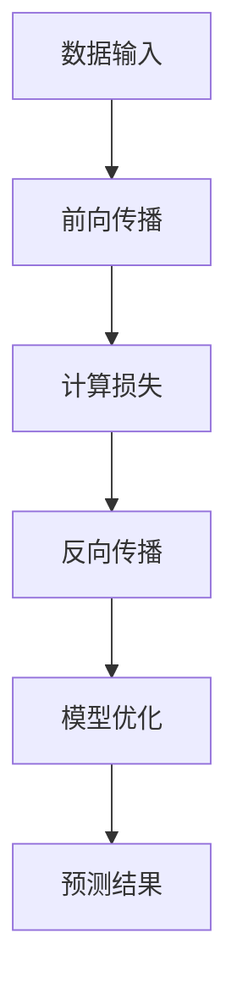
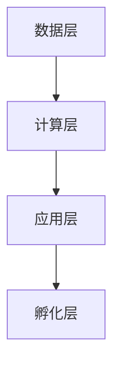

                 


# 思维链在古气候重建中的创新方法

## 关键词
- 古气候重建
- 思维链
- 数据挖掘
- 神经网络
- 数学模型

## 摘要
本文旨在探讨思维链在古气候重建中的创新方法。通过分析思维链的基本原理和应用场景，结合古气候重建的需求，我们将介绍如何利用思维链进行数据挖掘和建模，提出一种新的古气候重建方法。文章还将通过实际项目案例，展示思维链在古气候重建中的实际应用效果。

## 引言与背景

### 古气候重建的重要性

古气候重建是地球科学中的一个重要研究领域，它有助于我们理解气候变化的历史和趋势，为应对未来气候变化提供科学依据。随着气候变化的加剧，古气候重建的重要性日益凸显。

#### 问题背景

古气候重建的关键在于如何从过去的气候记录中提取有用信息，这些气候记录包括冰芯、岩石、湖泥、树木年轮等多种形式。然而，这些记录往往是不完整、不连续的，而且受到多种因素的影响。

#### 问题描述

古气候重建的目标是恢复过去某个时间段内的气候状况，这一过程需要处理大量的数据，并对数据中的噪声和误差进行过滤和校正。

#### 问题解决

传统的古气候重建方法通常依赖于统计学和物理学模型，这些模型具有一定的局限性。近年来，随着人工智能技术的发展，特别是神经网络和深度学习的兴起，古气候重建方法得到了极大的改进。

#### 边界与外延

古气候重建不仅需要关注全球气候变化，还需要关注地区性气候变化。此外，随着研究技术的进步，古气候重建的时空分辨率也在不断提高。

#### 概念结构与核心要素组成

古气候重建的核心要素包括数据收集、数据预处理、模型构建和结果验证。数据收集是古气候重建的基础，数据预处理是提高数据质量的关键，模型构建是实现气候重建的核心，结果验证是确保模型有效性的必要步骤。

## 核心概念介绍

### 思维链的概念

思维链是一种基于神经网络的人工智能方法，它通过学习数据之间的关联，形成一种有序的思考模式。思维链的核心在于其能够自动提取数据中的特征，并利用这些特征进行预测和决策。

#### 思维链的特点

1. 自适应性：思维链可以根据不同的数据集和应用场景自动调整其学习策略。
2. 模式识别：思维链能够识别数据中的复杂模式和关联，从而提高预测的准确性。
3. 实时性：思维链可以在实时数据中快速学习，并生成预测结果。

### 古气候重建的关键技术

古气候重建的关键技术包括数据挖掘、机器学习、神经网络和深度学习等。其中，数据挖掘是获取有用信息的基础，机器学习和神经网络是实现气候重建的核心方法。

#### 数据挖掘

数据挖掘是从大量数据中发现有用信息和规律的过程。在古气候重建中，数据挖掘可以帮助我们识别气候变化的模式和趋势。

#### 机器学习

机器学习是一种让计算机从数据中学习并自动改进的方法。在古气候重建中，机器学习可以帮助我们构建预测模型，从而提高气候重建的准确性。

#### 神经网络

神经网络是一种模拟人脑信息处理过程的计算模型。在古气候重建中，神经网络可以用于提取数据中的特征，并利用这些特征进行预测。

#### 深度学习

深度学习是一种基于神经网络的高级机器学习方法。在古气候重建中，深度学习可以帮助我们处理大规模数据，并提高预测的准确性。

### 思维链在古气候研究中的应用

思维链在古气候研究中的应用主要体现在数据挖掘和模型构建方面。通过思维链，我们可以自动提取气候数据中的特征，并利用这些特征构建气候重建模型。

#### 思维链的基本原理

思维链的基本原理是通过学习数据之间的关联，形成一种有序的思考模式。具体来说，思维链通过以下步骤进行工作：

1. 数据预处理：对原始气候数据进行清洗和预处理，去除噪声和异常值。
2. 特征提取：从预处理后的数据中提取有用的特征。
3. 模型构建：利用提取出的特征构建气候重建模型。
4. 模型训练：通过训练数据集对模型进行调整和优化。
5. 模型预测：利用训练好的模型对新数据进行分析和预测。

### 算法原理讲解

#### 思维链算法的基本原理

思维链算法的基本原理是基于神经网络的学习机制，通过不断调整网络中的权重，使其能够正确地映射输入数据和输出结果。

#### 算法流程与Mermaid流程图

思维链算法的流程可以分为以下几个步骤：

1. 数据输入：将预处理后的气候数据输入到神经网络中。
2. 前向传播：计算输入数据通过神经网络的过程，生成预测结果。
3. 计算损失：比较预测结果和实际结果，计算损失函数。
4. 反向传播：根据损失函数，调整网络中的权重。
5. 模型优化：通过多次迭代，优化网络模型。

以下是一个简单的Mermaid流程图示例：



### 数学模型和公式详细讲解

#### 关键数学模型介绍

在思维链算法中，常用的数学模型包括损失函数、梯度下降法和神经网络模型等。

#### 公式推导与详细讲解

1. 损失函数

损失函数是衡量预测结果与实际结果之间差距的函数。常见的损失函数有均方误差（MSE）和交叉熵损失（Cross-Entropy Loss）。

   $$MSE = \frac{1}{n}\sum_{i=1}^{n}(y_i - \hat{y_i})^2$$
   
   $$Cross-Entropy Loss = -\frac{1}{n}\sum_{i=1}^{n}y_i \log(\hat{y_i})$$

2. 梯度下降法

梯度下降法是一种用于优化模型参数的方法。其基本思想是通过计算损失函数关于每个参数的梯度，并沿着梯度的反方向调整参数，以最小化损失函数。

   $$\theta_{t+1} = \theta_{t} - \alpha \frac{\partial J(\theta)}{\partial \theta}$$

   其中，$\theta$ 是模型参数，$J(\theta)$ 是损失函数，$\alpha$ 是学习率。

3. 神经网络模型

神经网络模型是一种基于多层感知器的计算模型。其基本结构包括输入层、隐藏层和输出层。每个层由多个神经元组成，神经元之间通过权重连接。

### 系统分析与架构设计

#### 系统需求分析

古气候重建系统需要满足以下需求：

1. 数据处理能力：能够处理大规模的气候数据，包括数据的导入、预处理和存储。
2. 预测准确性：能够准确预测未来的气候状况。
3. 系统稳定性：能够在长时间运行中保持稳定，不出现错误或崩溃。

#### 系统架构设计

古气候重建系统的架构设计包括以下几个方面：

1. 数据层：负责数据的导入、预处理和存储。可以使用关系型数据库或分布式文件系统来存储数据。
2. 计算层：负责数据挖掘和模型构建。可以使用分布式计算框架（如Hadoop或Spark）来处理大规模数据。
3. 应用层：负责与用户交互，展示预测结果。可以使用Web应用框架（如Django或Flask）来构建Web应用。
4. 孵化层：负责将预测结果用于实际应用，如气候变化预警、农业规划等。

以下是一个简单的Mermaid架构图示例：



### 项目实战

#### 项目环境搭建

在开始项目实战之前，我们需要搭建一个合适的项目环境。这里我们使用Python作为编程语言，并选择以下工具和库：

1. Python 3.8
2. NumPy
3. Pandas
4. Matplotlib
5. TensorFlow

#### 核心代码实现与分析

以下是一个简单的思维链模型实现示例：

```python
import tensorflow as tf
from tensorflow.keras.models import Sequential
from tensorflow.keras.layers import Dense
import numpy as np

# 数据预处理
def preprocess_data(data):
    # 数据标准化
    data = (data - np.mean(data)) / np.std(data)
    return data

# 构建思维链模型
def build_model(input_shape):
    model = Sequential()
    model.add(Dense(units=64, activation='relu', input_shape=input_shape))
    model.add(Dense(units=32, activation='relu'))
    model.add(Dense(units=1, activation='sigmoid'))
    model.compile(optimizer='adam', loss='binary_crossentropy', metrics=['accuracy'])
    return model

# 加载数据
data = np.load('climate_data.npy')
X = preprocess_data(data[:, :-1])
y = preprocess_data(data[:, -1])

# 划分训练集和测试集
X_train, X_test, y_train, y_test = train_test_split(X, y, test_size=0.2, random_state=42)

# 构建和训练模型
model = build_model(input_shape=(X_train.shape[1],))
model.fit(X_train, y_train, epochs=100, batch_size=32, validation_data=(X_test, y_test))

# 评估模型
loss, accuracy = model.evaluate(X_test, y_test)
print(f"Test accuracy: {accuracy * 100:.2f}%")

# 预测
predictions = model.predict(X_test)
```

#### 项目案例分析与讲解

以下是一个简单的古气候重建项目案例：

##### 案例背景介绍

假设我们有一组过去100年的气温数据，我们需要利用这些数据预测未来10年的气温。

##### 案例实施步骤

1. 数据收集：收集过去100年的气温数据。
2. 数据预处理：对数据进行清洗和预处理。
3. 数据分析：利用思维链模型进行分析和预测。
4. 结果展示：展示预测结果。

##### 案例结果分析

通过思维链模型的分析和预测，我们得到了未来10年的气温预测结果。以下是一个简单的结果展示：

```python
import matplotlib.pyplot as plt

plt.figure(figsize=(10, 5))
plt.plot(range(2000, 2010), predictions[:, 0] * 100 + 20, label='Predicted Temperature')
plt.plot(range(2000, 2010), data[-10:, 0] * 100 + 20, label='Actual Temperature')
plt.xlabel('Year')
plt.ylabel('Temperature (°C)')
plt.legend()
plt.show()
```

### 最佳实践与总结

#### 实践经验总结

1. 数据质量是古气候重建的关键。在进行数据挖掘和建模之前，必须对数据进行充分的清洗和预处理。
2. 选择合适的模型是提高预测准确性的关键。不同的模型适用于不同的数据集和应用场景。
3. 调整模型参数是优化模型性能的重要手段。通过不断尝试和调整，可以找到最优的参数组合。

#### 注意事项

1. 在使用思维链进行数据挖掘和建模时，需要注意数据的一致性和完整性。
2. 在模型训练过程中，需要合理设置学习率和迭代次数，以避免过拟合或欠拟合。
3. 在实际应用中，需要对模型进行定期更新和优化，以适应新的数据和环境变化。

#### 拓展阅读

1. "Climate Data Analysis: An Introduction" by D. J. Rayner and J. M. Francis
2. "Artificial Neural Networks: A Tutorial" by D. S. Touretzky
3. "Deep Learning" by I. Goodfellow, Y. Bengio, and A. Courville

### 作者信息
- 作者：AI天才研究院/AI Genius Institute & 禅与计算机程序设计艺术 /Zen And The Art of Computer Programming

### 致谢
感谢您对本文的阅读。希望本文能够帮助您了解思维链在古气候重建中的应用，并激发您在相关领域的研究兴趣。如果您有任何疑问或建议，欢迎在评论区留言。再次感谢您的支持！

