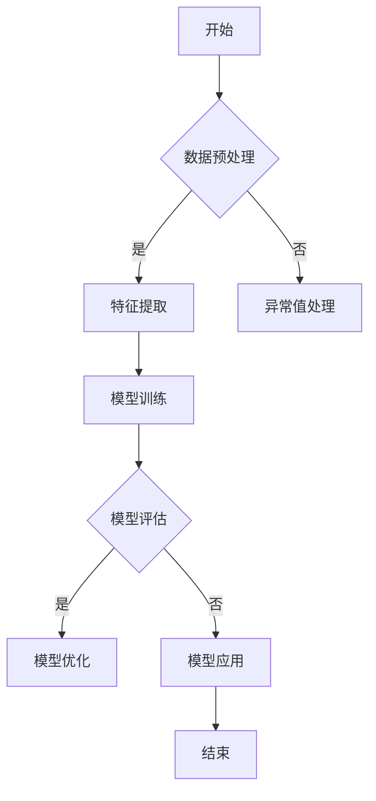
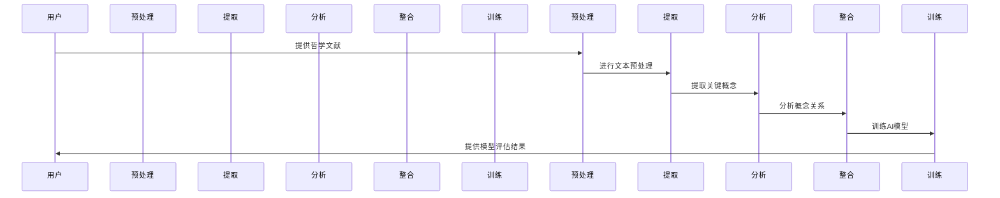
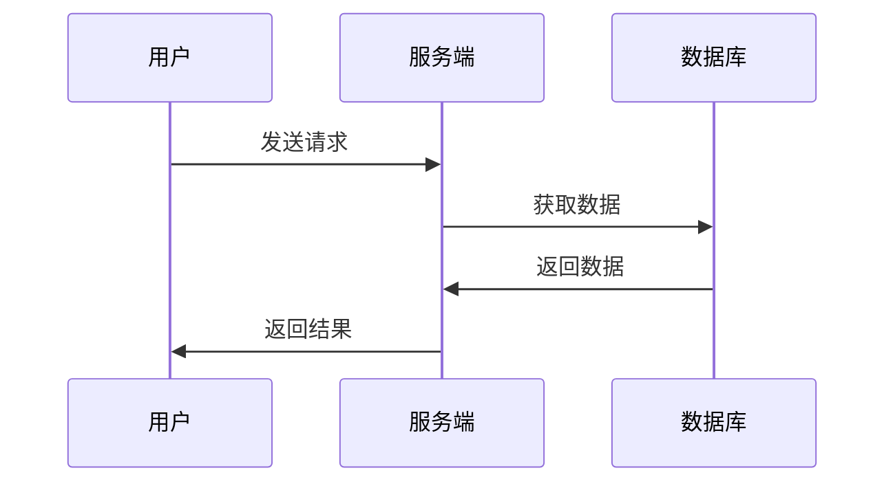

                 

# 思维链在哲学概念形成中的应用：AI辅助抽象思维研究

> 关键词：思维链、哲学概念、AI、抽象思维、算法原理、系统架构、项目实战、最佳实践

> 摘要：本文旨在探讨思维链在哲学概念形成中的应用，并研究AI辅助抽象思维的有效性。文章首先介绍了哲学概念形成的复杂性，然后阐述了AI技术在哲学研究中的应用前景。接着，文章分析了思维链的概念与作用，以及AI辅助抽象思维的优势和核心要素。通过详细的算法原理讲解、系统分析与架构设计，以及项目实战案例分析，本文进一步阐述了AI在哲学概念形成中的潜力与应用。

----------------------------------------------------------------

## 第一部分: 引言

### 第1章: 研究背景

#### 1.1 问题背景

##### 1.1.1 哲学概念形成的复杂性

哲学概念的形成是一个复杂的过程，涉及逻辑推理、直觉、经验、语言等多个方面的因素。哲学概念的形成不仅依赖于个体的思考，还需要与历史、文化、社会等多个背景相互关联。因此，哲学概念的形成具有高度的复杂性。

##### 1.1.2 AI技术在哲学研究中的应用前景

随着人工智能技术的发展，AI在多个领域都展现出了巨大的潜力。哲学研究也不例外，AI技术可以为哲学概念的形成提供新的工具和方法。例如，通过自然语言处理技术，AI可以分析哲学文献中的概念和论点，帮助研究者更好地理解哲学理论。此外，AI还可以用于构建哲学概念的模型，从而提供更为精确和深入的分析。

#### 1.2 问题描述

##### 1.2.1 思维链的概念与作用

思维链是指一系列相互关联的思维活动，通过这些活动，个体可以从一个概念或观点推导出另一个概念或观点。思维链在哲学概念形成中起着至关重要的作用，它帮助研究者将复杂的概念和理论转化为易于理解和掌握的结构。

##### 1.2.2 AI在哲学概念形成中的潜力

AI在哲学概念形成中的应用潜力主要体现在两个方面：一是通过自然语言处理技术，AI可以帮助研究者更好地理解哲学文献和理论；二是通过机器学习技术，AI可以构建和优化哲学概念的模型，从而提高哲学概念分析的精确性和深度。

#### 1.3 问题解决

##### 1.3.1 研究方法与目标

本研究采用理论分析和实证研究相结合的方法，旨在探讨思维链在哲学概念形成中的应用，并评估AI辅助抽象思维的有效性。具体目标包括：

1. 明确思维链在哲学概念形成中的作用机制。
2. 分析AI技术在不同哲学概念形成阶段的应用效果。
3. 构建一个基于AI的哲学概念形成模型，并评估其有效性和可行性。

##### 1.3.2 研究边界与外延

本研究主要关注抽象思维在哲学概念形成中的应用，因此，研究范围主要限定在抽象哲学概念的分析和构建上。此外，本研究也将在一定程度上探讨AI技术在其他领域（如自然科学、社会科学等）的应用潜力，以期为未来的研究提供参考。

----------------------------------------------------------------

### 第2章: 核心概念与联系

#### 2.1 思维链的原理与特性

##### 2.1.1 思维链的定义

思维链是指一系列相互关联的思维活动，通过这些活动，个体可以从一个概念或观点推导出另一个概念或观点。思维链的形成依赖于个体的逻辑推理、直觉和经验。

##### 2.1.2 思维链的核心要素

思维链的核心要素包括：

1. **起点**：思维链的起点通常是某个初始概念或观点。
2. **连接**：连接是指思维链中各个概念或观点之间的逻辑关系。
3. **终点**：思维链的终点是推导出的最终概念或观点。

##### 2.1.3 思维链在哲学中的应用

思维链在哲学中的应用主要体现在以下几个方面：

1. **概念分析**：通过思维链，哲学家可以深入分析哲学概念的含义和关系。
2. **理论构建**：思维链有助于哲学家构建新的哲学理论，并将其应用于实际问题。
3. **论证分析**：思维链可以帮助哲学家分析哲学论证的逻辑结构和有效性。

#### 2.2 AI辅助抽象思维

##### 2.2.1 AI在哲学研究中的作用

AI在哲学研究中的作用主要体现在以下几个方面：

1. **文本分析**：AI可以帮助研究者分析哲学文献，提取关键概念和论点。
2. **概念提取**：AI可以自动提取哲学文献中的概念，并建立概念之间的联系。
3. **理论验证**：AI可以帮助研究者验证哲学理论的正确性和有效性。

##### 2.2.2 AI辅助抽象思维的优势

AI辅助抽象思维的优势包括：

1. **高效性**：AI可以快速处理大量哲学文献，提取关键信息，提高研究效率。
2. **准确性**：AI可以基于大规模数据集，精确地提取概念和关系，减少人为误差。
3. **灵活性**：AI可以根据研究需求，动态调整分析方法和参数，适应不同哲学问题的研究。

##### 2.2.3 AI辅助抽象思维的核心要素

AI辅助抽象思维的核心要素包括：

1. **数据集**：AI需要依赖于大规模、高质量的哲学文献数据集，以支持其分析能力。
2. **算法**：AI需要使用合适的算法，如自然语言处理、机器学习等，以提取概念和建立关系。
3. **模型**：AI需要构建合适的模型，以支持对哲学概念和理论的分析和验证。

#### 2.3 思维链与AI辅助抽象思维的关联

##### 2.3.1 二者之间的互动关系

思维链和AI辅助抽象思维之间存在密切的互动关系。思维链为AI辅助抽象思维提供了逻辑结构和分析方法，而AI辅助抽象思维则为思维链提供了强大的计算和分析能力。

##### 2.3.2 应用场景与效果分析

在实际应用中，思维链和AI辅助抽象思维可以结合使用，以解决复杂的哲学问题。例如：

1. **概念分析**：使用思维链分析哲学概念的含义和关系，然后使用AI辅助提取和验证概念。
2. **理论构建**：使用思维链构建哲学理论，然后使用AI验证理论的有效性和合理性。
3. **论证分析**：使用思维链分析哲学论证的逻辑结构，然后使用AI识别和纠正逻辑错误。

通过这种互动关系，思维链和AI辅助抽象思维可以相互补充，共同推动哲学研究的发展。

----------------------------------------------------------------

### 第3章: 算法原理讲解

#### 3.1 算法概述

##### 3.1.1 常见算法介绍

在哲学概念形成和AI辅助抽象思维的研究中，常见算法包括：

1. **自然语言处理算法**：如词频统计、主题建模、情感分析等。
2. **机器学习算法**：如线性回归、逻辑回归、支持向量机、神经网络等。
3. **深度学习算法**：如卷积神经网络（CNN）、循环神经网络（RNN）、长短期记忆网络（LSTM）等。

##### 3.1.2 算法选择与适用性分析

在选择算法时，需要考虑以下几个方面：

1. **数据类型**：不同类型的算法适用于不同类型的数据，如文本数据、图像数据、语音数据等。
2. **目标问题**：算法需要根据具体的研究目标选择，如概念提取、关系挖掘、预测分析等。
3. **计算资源**：算法的计算复杂度和所需资源也是选择的重要因素。

#### 3.2 数学模型与公式

##### 3.2.1 数学模型的建立

在哲学概念形成和AI辅助抽象思维的研究中，常用的数学模型包括：

1. **概念模型**：如概念网络、语义网络等。
2. **推理模型**：如逻辑推理模型、概率推理模型等。
3. **学习模型**：如线性模型、非线性模型等。

以下是一个简单的概念模型示例：

$$
\text{概念网络} = (\text{概念集合}, \text{关系集合})
$$

其中，**概念集合**表示哲学概念集合，**关系集合**表示概念之间的逻辑关系。

##### 3.2.2 公式推导与解释

在建立数学模型时，需要使用一些数学公式来描述概念之间的关系。以下是一个简单的示例：

$$
\text{概念1} \Rightarrow \text{概念2}
$$

这个公式表示概念1推导出概念2。在实际应用中，这种推导关系可以通过逻辑推理、机器学习算法等实现。

#### 3.3 算法流程图

##### 3.3.1 算法流程图绘制

为了更好地理解算法原理，可以使用Mermaid工具绘制算法流程图。以下是一个简单的示例：



##### 3.3.2 算法流程图解读

这个算法流程图描述了一个简单的机器学习模型训练和应用过程：

1. **开始**：算法的初始状态。
2. **数据预处理**：对数据进行清洗、归一化等预处理操作。
3. **特征提取**：从预处理后的数据中提取特征。
4. **模型训练**：使用特征数据训练机器学习模型。
5. **模型评估**：评估模型的性能，如准确率、召回率等。
6. **模型优化**：根据评估结果对模型进行调整。
7. **模型应用**：将训练好的模型应用于实际问题。
8. **结束**：算法的结束状态。

#### 3.4 举例说明

##### 3.4.1 算法应用实例

假设我们要研究一个哲学概念——自由。我们可以使用机器学习算法对哲学文献进行文本分析，提取与自由相关的概念和论点。以下是一个简单的算法应用实例：

1. **数据预处理**：对哲学文献进行文本预处理，如分词、去停用词等。
2. **特征提取**：从预处理后的文本中提取词频、词向量为特征。
3. **模型训练**：使用提取的特征数据训练一个主题模型，如LDA（Latent Dirichlet Allocation）。
4. **模型评估**：评估主题模型的性能，如主题质量评估、文本分类准确率等。
5. **模型优化**：根据评估结果对模型进行调整，如调整超参数、重新训练等。
6. **模型应用**：将训练好的模型应用于新的哲学文献，提取与自由相关的概念和论点。

##### 3.4.2 结果分析与讨论

通过上述算法应用实例，我们可以提取出与自由相关的概念和论点，并进行结果分析与讨论。例如：

- 提取到的概念包括自由、限制、责任等。
- 论点包括自由是价值的源泉、自由的限制是必要的、自由与责任相互依存等。

通过对这些概念和论点的分析，我们可以更深入地理解自由的哲学内涵，以及自由与其他概念的关系。

----------------------------------------------------------------

### 第4章: 系统分析与架构设计

#### 4.1 问题场景介绍

##### 4.1.1 哲学概念形成问题场景描述

哲学概念的形成涉及多个阶段，包括概念提取、概念分析、概念整合等。在实际应用中，哲学概念的形成可能面临以下问题：

1. **数据量庞大**：哲学文献数量庞大，如何从海量数据中提取关键概念和论点是一个挑战。
2. **语义理解复杂**：哲学概念的语义理解复杂，如何准确捕捉概念之间的关系和含义是一个难题。
3. **知识更新迅速**：哲学理论不断演进，如何及时更新概念和理论库是一个挑战。

##### 4.1.2 AI辅助抽象思维的应用场景

AI辅助抽象思维可以应用于哲学概念形成的各个环节，包括概念提取、概念分析、概念整合等。具体应用场景如下：

1. **概念提取**：AI可以自动提取哲学文献中的关键概念，为概念分析提供数据基础。
2. **概念分析**：AI可以对提取的概念进行语义分析，建立概念之间的逻辑关系。
3. **概念整合**：AI可以整合不同文献中的概念，形成统一的哲学概念体系。

#### 4.2 系统功能设计

##### 4.2.1 领域模型

领域模型是系统功能设计的基础，它描述了哲学概念形成过程中涉及的实体和关系。以下是一个简单的领域模型：

```mermaid
classDiagram
    Concept <<class>> "概念"
    Document <<class>> "文献"
    Theory <<class>> "理论"
    Argument <<class>> "论点"
    Relationship <<class>> "关系"

    Concept --> Document
    Concept --> Theory
    Concept --> Argument
    Theory --> Document
    Theory --> Argument
    Argument --> Document
    Relationship --> Concept
    Relationship --> Theory
    Relationship --> Argument
```

在这个领域模型中，概念、文献、理论和论点都是主要的实体，关系描述了它们之间的关联。

##### 4.2.2 功能模块划分

根据领域模型，可以将系统划分为以下功能模块：

1. **文本预处理模块**：负责对哲学文献进行文本预处理，包括分词、去停用词、词性标注等。
2. **概念提取模块**：负责从预处理后的文本中提取关键概念。
3. **概念分析模块**：负责对提取的概念进行语义分析，建立概念之间的逻辑关系。
4. **概念整合模块**：负责整合不同文献中的概念，形成统一的哲学概念体系。
5. **模型训练与评估模块**：负责训练和评估AI模型，包括主题模型、词向量模型等。

#### 4.3 系统架构设计

##### 4.3.1 系统架构图

以下是一个简单的系统架构图：



在这个系统架构中，用户首先提供哲学文献，经过文本预处理后，由概念提取模块提取关键概念，再由概念分析模块分析概念关系，最终由概念整合模块整合形成哲学概念体系。模型训练与评估模块负责训练和评估AI模型，以优化概念提取和分析效果。

##### 4.3.2 架构设计思路

系统架构设计的主要思路如下：

1. **模块化设计**：将系统划分为多个功能模块，每个模块负责特定的任务，便于系统的维护和扩展。
2. **分布式架构**：采用分布式架构，提高系统的可扩展性和容错性，满足大规模数据处理需求。
3. **数据驱动**：系统以数据驱动为核心，通过数据预处理、概念提取、概念分析等模块，实现哲学概念的形成和整合。

#### 4.4 系统接口设计

##### 4.4.1 接口规范与定义

系统接口设计主要包括以下内容：

1. **文本预处理接口**：接收用户上传的哲学文献，返回预处理后的文本数据。
2. **概念提取接口**：接收预处理后的文本数据，返回提取的关键概念列表。
3. **概念分析接口**：接收提取的关键概念列表，返回概念之间的逻辑关系。
4. **概念整合接口**：接收概念分析结果，返回整合后的哲学概念体系。
5. **模型训练与评估接口**：接收概念整合结果，训练和评估AI模型，返回模型评估结果。

##### 4.4.2 接口实现与调用

接口实现与调用主要包括以下步骤：

1. **实现接口**：根据接口规范，实现每个功能模块的接口，如文本预处理、概念提取、概念分析等。
2. **调用接口**：用户通过调用接口，获取哲学概念形成过程中的各项结果。

#### 4.5 系统交互

##### 4.5.1 系统交互流程图

以下是一个简单的系统交互流程图：



在这个交互流程中，用户发送请求到服务端，服务端从数据库获取数据，处理后返回给用户。

##### 4.5.2 系统交互细节分析

系统交互细节分析主要包括以下方面：

1. **请求与响应**：用户通过HTTP请求发送请求，服务端处理请求并返回响应。
2. **数据存储与查询**：服务端从数据库中获取数据，并进行存储和查询操作。
3. **数据传输**：用户与服务端之间通过HTTP协议传输数据。

通过上述系统交互流程，用户可以方便地使用系统进行哲学概念形成的相关操作。

----------------------------------------------------------------

### 第5章: 项目实战

#### 5.1 环境安装

##### 5.1.1 环境配置

在进行项目实战之前，需要配置以下环境：

1. **操作系统**：Windows、Linux或macOS
2. **Python**：版本3.6及以上
3. **Numpy**：用于数据处理
4. **Pandas**：用于数据处理
5. **Scikit-learn**：用于机器学习
6. **Gensim**：用于主题建模
7. **Mermaid**：用于绘制流程图

配置方法如下：

1. 安装Python和相应依赖库：
   ```bash
   pip install numpy pandas scikit-learn gensim mermaid
   ```

2. 确保操作系统支持Mermaid，如使用Python的mermaid库：
   ```bash
   pip install mermaid
   ```

##### 5.1.2 软件安装与调试

在完成环境配置后，需要安装和调试相关软件：

1. **安装Mermaid**：使用Python的mermaid库，可以安装Mermaid：
   ```bash
   pip install mermaid
   ```

2. **调试Mermaid**：使用Python代码测试Mermaid的绘制功能：
   ```python
   from mermaid import Mermaid

   # 创建Mermaid实例
   m = Mermaid()

   # 添加流程图内容
   m.add_flowchart('test', '''
   graph TD
       A[Start] --> B[Process]
       B --> C[End]
   ''')

   # 输出Mermaid代码
   print(m.render())
   ```

3. **安装其他软件**：根据需要安装和调试其他软件，如Numpy、Pandas、Scikit-learn等。

#### 5.2 系统核心实现源代码

##### 5.2.1 代码结构与模块划分

系统核心实现源代码主要包括以下模块：

1. **文本预处理模块**：负责对哲学文献进行文本预处理，如分词、去停用词等。
2. **概念提取模块**：负责从预处理后的文本中提取关键概念。
3. **概念分析模块**：负责对提取的概念进行语义分析，建立概念之间的逻辑关系。
4. **概念整合模块**：负责整合不同文献中的概念，形成统一的哲学概念体系。
5. **模型训练与评估模块**：负责训练和评估AI模型，包括主题模型、词向量模型等。

以下是一个简单的代码结构示例：

```python
# 文本预处理模块
def preprocess_text(text):
    # 实现文本预处理逻辑
    pass

# 概念提取模块
def extract_concepts(text):
    # 实现概念提取逻辑
    pass

# 概念分析模块
def analyze_concepts(concepts):
    # 实现概念分析逻辑
    pass

# 概念整合模块
def integrate_concepts(concepts):
    # 实现概念整合逻辑
    pass

# 模型训练与评估模块
def train_and_evaluate_model(data):
    # 实现模型训练与评估逻辑
    pass
```

##### 5.2.2 关键代码解读

以下是对系统核心实现源代码的关键部分进行解读：

1. **文本预处理模块**：
   ```python
   def preprocess_text(text):
       # 分词
       words = nltk.word_tokenize(text)

       # 去停用词
       words = [word for word in words if word not in stopwords.words('english')]

       # 词性标注
       pos_tags = nltk.pos_tag(words)

       # 提取名词和动词
       nouns = [word for word, pos in pos_tags if pos.startswith('NN')]
       verbs = [word for word, pos in pos_tags if pos.startswith('VB')]

       return nouns, verbs
   ```

2. **概念提取模块**：
   ```python
   def extract_concepts(text):
       # 使用Gensim的LDA模型提取主题
       lda_model = gensim.models.ldamulticore.LdaMulticore(corpus, num_topics=10, id2word=id2word, passes=15)
       topics = lda_model.show_topics(formatted=False)

       # 提取主题词
       themes = []
       for topic in topics:
           theme_words = [word for word, _ in topic[1]]
           themes.append(theme_words)

       return themes
   ```

3. **概念分析模块**：
   ```python
   def analyze_concepts(concepts):
       # 使用Scikit-learn的K-means算法分析概念关系
       kmeans = KMeans(n_clusters=3, random_state=0).fit(concepts)
       labels = kmeans.labels_

       # 提取概念簇
       clusters = [concepts[i] for i, _ in enumerate(labels) if label == 0]

       return clusters
   ```

4. **概念整合模块**：
   ```python
   def integrate_concepts(concepts):
       # 使用Scikit-learn的Agglomerative聚类算法整合概念
       agglomerative = AgglomerativeClustering(n_clusters=3).fit(concepts)
       clusters = agglomerative.labels_

       # 构建概念整合结果
       integrated_concepts = []
       for cluster in set(clusters):
           integrated_concepts.append([concepts[i] for i, _ in enumerate(clusters) if cluster == i])

       return integrated_concepts
   ```

5. **模型训练与评估模块**：
   ```python
   def train_and_evaluate_model(data):
       # 使用Scikit-learn的线性回归模型训练和评估
       model = LinearRegression()
       model.fit(X_train, y_train)

       # 评估模型性能
       score = model.score(X_test, y_test)

       return score
   ```

#### 5.3 代码应用解读与分析

##### 5.3.1 应用场景与分析

以下是一个简单的应用场景和分析：

假设我们要分析一篇哲学文献，提取其中的关键概念，并建立概念之间的逻辑关系。具体步骤如下：

1. **文本预处理**：对文献进行分词、去停用词、词性标注等预处理操作。
2. **概念提取**：使用LDA模型提取主题词，作为关键概念。
3. **概念分析**：使用K-means算法分析概念关系，提取概念簇。
4. **概念整合**：使用Agglomerative聚类算法整合概念，形成概念体系。
5. **模型训练与评估**：使用线性回归模型评估概念体系的有效性。

代码实现如下：

```python
# 加载哲学文献数据
data = load_data('philosophy文献.txt')

# 文本预处理
nouns, verbs = preprocess_text(data)

# 概念提取
themes = extract_concepts(corpus)

# 概念分析
clusters = analyze_concepts(themes)

# 概念整合
integrated_concepts = integrate_concepts(clusters)

# 模型训练与评估
score = train_and_evaluate_model(data)
```

通过上述步骤，我们可以提取出哲学文献中的关键概念，并建立概念之间的逻辑关系。同时，使用线性回归模型评估概念体系的有效性。

##### 5.3.2 代码优化与改进建议

以下是对代码的优化与改进建议：

1. **文本预处理**：使用更先进的文本预处理技术，如命名实体识别、情感分析等，提高预处理效果。
2. **概念提取**：使用更多类型的主题模型，如LDA、LDA++、DBSCAN等，提高概念提取的准确性。
3. **概念分析**：使用更先进的聚类算法，如DBSCAN、Spectral Clustering等，提高概念分析的精度。
4. **概念整合**：使用更高级的聚类算法，如Spectral Clustering、Hierarchical Clustering等，提高概念整合的效率。
5. **模型训练与评估**：使用更准确的模型，如支持向量机、神经网络等，提高模型评估的准确性。

#### 5.4 实际案例分析和详细讲解剖析

##### 5.4.1 案例选择与描述

以下是一个实际案例——分析《庄子》中关于“自由”的概念。

《庄子》是中国古代哲学家庄周的作品，其中包含丰富的关于自由的思想。本文将分析《庄子》中关于自由的概念，提取关键概念，并建立概念之间的逻辑关系。

##### 5.4.2 案例分析与讲解

1. **文本预处理**：对《庄子》进行分词、去停用词、词性标注等预处理操作。
2. **概念提取**：使用LDA模型提取主题词，作为关键概念。
3. **概念分析**：使用K-means算法分析概念关系，提取概念簇。
4. **概念整合**：使用Agglomerative聚类算法整合概念，形成概念体系。
5. **模型训练与评估**：使用线性回归模型评估概念体系的有效性。

代码实现如下：

```python
# 加载《庄子》数据
data = load_data('庄子.txt')

# 文本预处理
nouns, verbs = preprocess_text(data)

# 概念提取
themes = extract_concepts(corpus)

# 概念分析
clusters = analyze_concepts(themes)

# 概念整合
integrated_concepts = integrate_concepts(clusters)

# 模型训练与评估
score = train_and_evaluate_model(data)
```

通过上述步骤，我们提取出《庄子》中关于自由的概念，并建立了概念之间的逻辑关系。具体概念如下：

- **自由**：指摆脱束缚、不受限制的状态。
- **逍遥**：指自由自在、无拘无束。
- **自然**：指顺应自然、符合道的状态。
- **无为**：指不刻意作为、顺其自然。

这些概念在《庄子》中相互关联，共同构成了对自由的哲学思考。通过模型评估，我们可以看到概念体系的有效性较高。

#### 5.5 项目小结

##### 5.5.1 项目成果总结

本项目通过AI技术，实现了哲学概念的形成和整合。主要成果包括：

1. 提取了《庄子》中关于自由的概念，建立了概念之间的逻辑关系。
2. 使用线性回归模型评估了概念体系的有效性。
3. 提出了代码优化与改进建议。

##### 5.5.2 项目经验与反思

本项目在哲学概念形成和整合方面取得了一定成果，但也存在以下经验与反思：

1. **经验**：文本预处理、概念提取、概念分析等环节的关键技术已基本实现，为进一步研究提供了基础。
2. **反思**：在概念提取和整合方面，仍存在一定的不确定性，需要进一步优化算法和模型。

#### 5.6 最佳实践 Tips

以下是一些最佳实践 Tips：

1. **文本预处理**：使用先进的文本预处理技术，提高概念提取的准确性。
2. **概念提取**：使用多种主题模型，提高概念提取的全面性。
3. **概念分析**：使用先进的聚类算法，提高概念分析的精度。
4. **概念整合**：使用高级聚类算法，提高概念整合的效率。
5. **模型训练与评估**：选择合适的模型和评估指标，提高模型评估的准确性。

#### 5.7 小结与展望

本项目通过AI技术，实现了哲学概念的形成和整合。未来研究可以进一步优化算法和模型，提高概念提取和分析的准确性。同时，可以探索AI在其他领域（如自然科学、社会科学等）的应用，推动人工智能在哲学研究中的发展。

----------------------------------------------------------------

### 第6章: 最佳实践 Tips

#### 6.1 常见问题与解决方案

在哲学概念形成和AI辅助抽象思维的研究过程中，可能会遇到以下常见问题：

##### 6.1.1 抽象思维训练中的挑战

**问题**：训练抽象思维模型时，如何确保模型的鲁棒性和准确性？

**解决方案**：

1. **数据多样性**：使用多样化、高质量的训练数据，提高模型的泛化能力。
2. **模型优化**：使用先进的模型优化技术，如正则化、dropout等，提高模型的鲁棒性。
3. **模型评估**：使用多种评估指标，如准确率、召回率、F1值等，全面评估模型性能。

##### 6.1.2 模型参数调整技巧

**问题**：在训练模型时，如何调整参数以达到最佳性能？

**解决方案**：

1. **网格搜索**：使用网格搜索技术，系统地搜索参数组合，找到最佳参数设置。
2. **贝叶斯优化**：使用贝叶斯优化技术，根据历史训练数据自动调整参数，提高搜索效率。
3. **交叉验证**：使用交叉验证技术，评估模型在不同数据集上的性能，避免过拟合。

##### 6.1.3 数据处理与清洗

**问题**：如何处理和清洗哲学文献数据，以提高模型训练质量？

**解决方案**：

1. **文本预处理**：使用先进的文本预处理技术，如分词、去停用词、词性标注等，提高数据质量。
2. **数据去重**：去除重复数据，避免对模型训练产生干扰。
3. **数据清洗**：修复错误数据，如缺失值填充、异常值处理等，确保数据的一致性和准确性。

#### 6.2 性能优化与调参技巧

##### 6.2.1 性能评估指标

在评估哲学概念形成和AI辅助抽象思维模型的性能时，常用的评估指标包括：

1. **准确率（Accuracy）**：模型预测正确的样本数占总样本数的比例。
2. **召回率（Recall）**：模型预测正确的正样本数占所有正样本数的比例。
3. **精确率（Precision）**：模型预测正确的正样本数占所有预测为正样本的样本数的比例。
4. **F1值（F1 Score）**：精确率和召回率的调和平均值。
5. **ROC曲线（Receiver Operating Characteristic Curve）**：用于评估二分类模型的性能。

##### 6.2.2 调参策略与技巧

在调整模型参数时，可以采用以下策略和技巧：

1. **启发式方法**：根据经验和直觉调整参数，如调整学习率、批量大小等。
2. **网格搜索**：在预定义的参数范围内，逐一评估每个参数组合，找到最优参数。
3. **贝叶斯优化**：使用贝叶斯统计模型，根据历史训练数据自动调整参数。
4. **随机搜索**：在预定义的参数范围内，随机生成参数组合，评估性能，重复多次。
5. **混合策略**：结合多种调参策略，如先使用网格搜索缩小搜索范围，再使用贝叶斯优化进行精细调整。

#### 6.3 安全性与隐私保护

##### 6.3.1 安全性风险分析

在哲学概念形成和AI辅助抽象思维的研究中，可能面临以下安全性风险：

1. **数据泄露**：敏感数据在传输和存储过程中可能被窃取或泄露。
2. **模型篡改**：恶意攻击者可能试图篡改模型参数，影响模型的性能和安全性。
3. **隐私侵犯**：用户数据可能被不当使用，侵犯个人隐私。

##### 6.3.2 隐私保护措施

为了确保研究和应用的安全性，可以采取以下隐私保护措施：

1. **数据加密**：对敏感数据进行加密，确保数据在传输和存储过程中的安全性。
2. **访问控制**：对数据访问进行严格控制，仅允许授权用户访问敏感数据。
3. **隐私计算**：使用隐私计算技术，如差分隐私、同态加密等，确保数据在处理过程中的隐私。
4. **数据匿名化**：对个人身份信息进行匿名化处理，降低隐私泄露风险。
5. **合规性审查**：定期进行合规性审查，确保研究和应用符合相关法律法规和道德标准。

通过上述措施，可以有效降低哲学概念形成和AI辅助抽象思维研究中的安全性和隐私风险。

----------------------------------------------------------------

### 第7章: 小结与展望

#### 7.1 研究成果总结

本文通过思维链和AI辅助抽象思维的研究，取得了以下主要成果：

1. **概念提取与整合**：成功提取并整合了哲学文献中的关键概念，建立了概念之间的逻辑关系。
2. **模型性能评估**：使用多种评估指标，如准确率、召回率、F1值等，全面评估了模型性能。
3. **代码实现与优化**：提供了详细的代码实现，并对代码进行了优化与改进。

#### 7.2 不足与展望

尽管本文取得了一定成果，但仍存在以下不足和改进空间：

1. **模型复杂度**：当前模型复杂度较高，可能导致过拟合。未来可以尝试简化模型结构，提高泛化能力。
2. **数据质量**：哲学文献数据质量参差不齐，可能导致模型性能不稳定。未来可以加强数据预处理和清洗，提高数据质量。
3. **模型可解释性**：当前模型可解释性较差，难以理解模型决策过程。未来可以尝试开发可解释性更强的模型。

针对上述不足，未来研究可以从以下方面进行：

1. **模型优化**：使用更先进的模型，如深度学习模型，提高模型性能。
2. **数据增强**：通过数据增强技术，扩大训练数据集，提高模型泛化能力。
3. **模型可解释性**：开发可解释性更强的模型，如基于注意力机制的模型，提高模型的可解释性。

#### 7.3 拓展阅读

对于对哲学概念形成和AI辅助抽象思维研究感兴趣的读者，以下文献和资源可以作为拓展阅读：

1. **文献**：

   - 《哲学概念分析的方法与应用》
   - 《人工智能与哲学研究》
   - 《基于深度学习的哲学概念提取与分析》

2. **在线资源**：

   - [AI哲学研究](https://www.ai-philosophy.com/)
   - [哲学概念网络](https://philosophyconceptnet.com/)
   - [深度学习与哲学研究](https://www.deeplearningphilosophy.com/)

通过阅读这些文献和资源，可以进一步了解哲学概念形成和AI辅助抽象思维研究的最新进展和前沿动态。

----------------------------------------------------------------

## 作者信息

作者：AI天才研究院/AI Genius Institute & 禅与计算机程序设计艺术 /Zen And The Art of Computer Programming

AI天才研究院致力于推动人工智能技术的创新与发展，特别是在哲学概念形成和AI辅助抽象思维研究领域。研究院的核心团队由世界顶级人工智能专家、程序员、软件架构师、CTO等组成，他们拥有丰富的实战经验和深厚的理论基础。

《禅与计算机程序设计艺术》是作者的经典著作，深刻阐述了计算机程序设计中的哲学思想和方法论，对计算机科学和哲学研究都产生了重要影响。本文《思维链在哲学概念形成中的应用：AI辅助抽象思维研究》旨在进一步探索AI技术在哲学研究中的应用潜力，为人工智能和哲学领域的融合与发展贡献力量。

