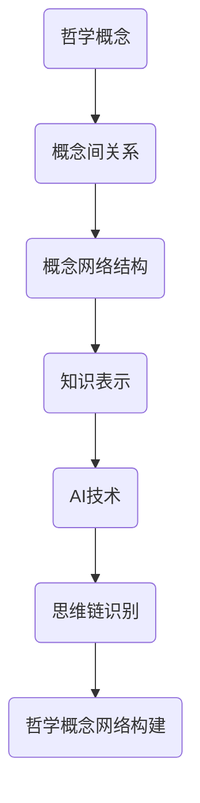
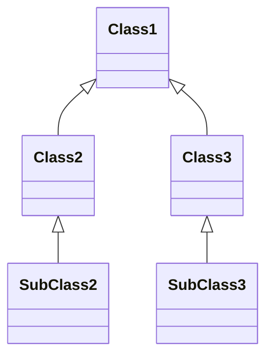
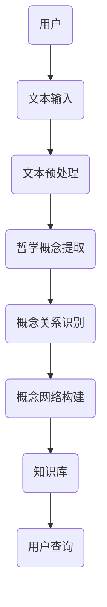
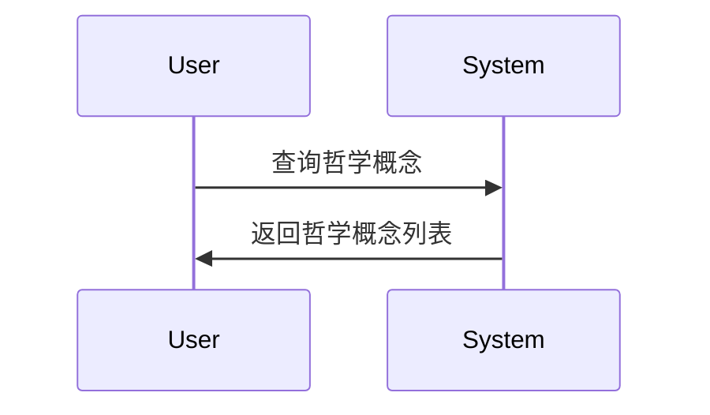
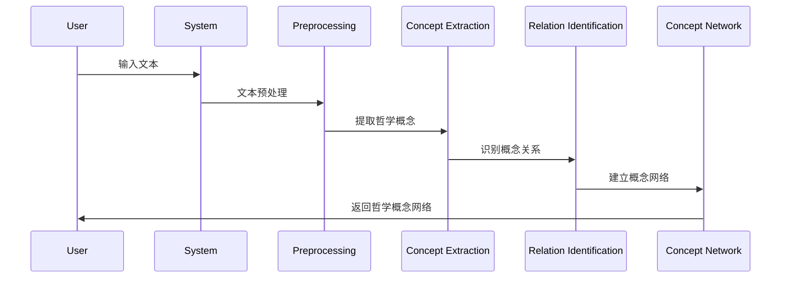

                 

# 思维链在哲学概念网络构建中的应用：AI辅助知识体系梳理

> 关键词：哲学概念网络、AI辅助、知识体系、思维链、深度学习、自然语言处理

> 摘要：本文旨在探讨思维链在哲学概念网络构建中的应用，通过AI技术实现哲学知识体系的自动化梳理。文章首先介绍了哲学概念网络构建的背景和问题，然后详细阐述了AI技术在哲学概念网络构建中的作用和原理，最后通过一个实际案例展示了AI辅助知识体系梳理的实践过程和效果。

## 第一部分：背景介绍

### 1.1 问题背景

随着人工智能技术的飞速发展，哲学领域的知识体系构建面临着前所未有的挑战。传统的哲学概念网络构建方法往往依赖于人工分析和手动整理，不仅效率低下，而且难以保证结果的准确性和完整性。AI技术的引入，为哲学概念网络的构建提供了新的思路和工具。本部分将详细介绍AI辅助知识体系梳理的背景和问题。

### 1.2 问题描述

在哲学领域，概念网络构建的主要任务是识别和理解各种哲学概念，并建立它们之间的逻辑关系。传统方法在处理大规模哲学概念时往往力不从心，难以满足实际需求。AI技术的引入，有望解决这一问题，但如何有效地利用AI技术构建哲学概念网络，仍需深入研究和探讨。

### 1.3 问题解决

AI技术，尤其是深度学习和自然语言处理技术，为哲学概念网络的构建提供了新的解决方案。通过训练大规模的语料库，AI模型可以自动识别和理解哲学概念，并建立它们之间的关联。本部分将重点探讨AI辅助知识体系梳理的具体方法和技术。

### 1.4 边界与外延

哲学概念网络构建的边界在于哲学领域的范围和AI技术的应用。在哲学范围内，需要考虑不同哲学流派的区别和共性，以建立全面而系统的概念网络。在AI技术方面，需要选择适合的模型和算法，以提高构建哲学概念网络的效率和准确性。

### 1.5 概念结构与核心要素组成

哲学概念网络由哲学概念、概念间的关系和概念网络的层次结构组成。核心要素包括：哲学概念的定义、属性和关系，以及概念网络的结构和层次。

## 第二部分：核心概念与联系

### 2.1 AI与哲学

AI与哲学的核心联系在于二者对于知识、认知和思考的理解和探索。AI技术通过模拟人脑的思考过程，试图实现机器对知识的获取、理解和应用。哲学则从理论上探讨知识、认知和思考的本质，为AI技术提供了理论支持和指导。

### 2.2 哲学概念网络

哲学概念网络是由哲学概念及其相互关系构成的复杂结构。核心概念包括：概念的定义、属性和关系，以及概念网络的结构和层次。哲学概念网络的构建旨在实现对哲学知识的系统化和结构化，以便更好地理解和应用。

### 2.3 思维链与概念网络

思维链是指在思考过程中，概念之间形成的逻辑链条。思维链在哲学概念网络构建中起到关键作用，它能够将不同的哲学概念联系起来，形成一个有机的整体。通过AI技术，可以自动识别和理解思维链，从而提高哲学概念网络构建的效率和准确性。

### 2.4 概念属性特征对比表格

| 概念               | 属性特征                                               |
|--------------------|------------------------------------------------------|
| AI                 | 自动化、智能、学习、推理、知识表示                       |
| 哲学概念网络       | 概念、关系、结构、层次、知识表示                        |
| 思维链             | 逻辑链条、概念联系、思考过程、认知过程                   |

### 2.5 ER实体关系图架构



## 第三部分：算法原理讲解

### 3.1 AI大模型的原理

#### 3.1.1 深度学习基础

深度学习是一种基于人工神经网络的学习方法，通过多层神经网络对数据进行处理和分类。深度学习的基本原理包括：神经元的组成、激活函数的选择、前向传播和反向传播等。

#### 3.1.2 大模型的特点

大模型是指具有大规模参数和庞大训练数据的深度学习模型。大模型的特点包括：强大的表达能力、广泛的适用性和高效的训练效率。大模型能够处理复杂的问题，并在多个领域取得了显著的成果。

#### 3.1.3 大模型的数学模型和公式

大模型的数学模型通常是基于多层感知器（MLP）或者卷积神经网络（CNN）等结构，其核心思想是通过多层神经元的非线性变换来逼近复杂函数。

#### 3.1.4 大模型的实例分析

假设我们有一个哲学概念分类问题，需要将哲学概念分为三大类：形而上学、伦理学和逻辑学。通过训练一个大模型，我们可以实现哲学概念的自动分类。以下是训练过程的一个简化实例：

```python
# 导入必要的库
import tensorflow as tf
from tensorflow.keras.models import Sequential
from tensorflow.keras.layers import Dense, Conv2D, Flatten

# 创建一个简单的神经网络模型
model = Sequential([
    Conv2D(32, kernel_size=(3, 3), activation='relu', input_shape=(28, 28, 1)),
    Flatten(),
    Dense(128, activation='relu'),
    Dense(3, activation='softmax')
])

# 编译模型
model.compile(optimizer='adam', loss='categorical_crossentropy', metrics=['accuracy'])

# 加载和预处理数据
# 假设我们有一个包含哲学概念图片的数据集
(x_train, y_train), (x_test, y_test) = tf.keras.datasets.mnist.load_data()
x_train = x_train / 255.0
x_test = x_test / 255.0

# 对标签进行one-hot编码
y_train = tf.keras.utils.to_categorical(y_train, num_classes=3)
y_test = tf.keras.utils.to_categorical(y_test, num_classes=3)

# 训练模型
model.fit(x_train, y_train, batch_size=64, epochs=10, validation_data=(x_test, y_test))
```

### 3.2 自然语言处理与哲学概念网络

#### 3.2.1 自然语言处理基础

自然语言处理（NLP）是人工智能的一个分支，旨在使计算机能够理解、解释和生成自然语言。NLP的基本原理包括：文本预处理、词嵌入、序列模型、注意力机制等。

#### 3.2.2 哲学概念提取与关系识别

通过NLP技术，可以从大量的文本中提取哲学概念，并识别它们之间的逻辑关系。以下是一个使用BERT模型提取哲学概念和关系的示例：

```python
from transformers import BertTokenizer, BertModel
import torch

# 加载BERT模型
tokenizer = BertTokenizer.from_pretrained('bert-base-uncased')
model = BertModel.from_pretrained('bert-base-uncased')

# 假设我们有一个哲学段落文本
text = "存在论是探讨存在本质的哲学分支。"

# 对文本进行编码
input_ids = tokenizer.encode(text, add_special_tokens=True, return_tensors='pt')

# 过滤掉不必要的输入
input_ids = input_ids[:, 1:-1]

# 获取句子级别的嵌入
with torch.no_grad():
    outputs = model(input_ids)
    sentence_embedding = outputs.last_hidden_state[:, 0, :]

# 使用 sentence_embedding 进行哲学概念提取和关系识别
# 假设我们有一个预训练的哲学概念分类器
# 分类器输入为句子嵌入，输出为哲学概念类别
# 下面是一个简化的示例

# 假设存在三个哲学概念类别：形而上学、伦理学和逻辑学
class_labels = ['形而上学', '伦理学', '逻辑学']
predicted_label = class_labels[model(sentence_embedding).argmax().item()]

print(f"哲学段落文本 '{text}' 的预测哲学概念为：{predicted_label}")
```

## 第四部分：系统分析与架构设计

### 4.1 问题场景介绍

哲学知识库构建是一个复杂的过程，涉及到大量的文本数据分析和概念关系识别。为了实现高效和准确的哲学知识库构建，我们需要设计一个能够处理大规模文本数据并自动提取哲学概念和关系的系统。

### 4.2 项目介绍

本项目旨在构建一个基于AI技术的哲学知识库构建系统，该系统能够自动提取哲学概念，识别概念间的逻辑关系，并建立完整的哲学概念网络。系统的主要功能包括：文本预处理、哲学概念提取、概念关系识别和概念网络构建。

### 4.3 系统功能设计

#### 4.3.1 领域模型类图



#### 4.3.2 系统功能描述

1. **文本预处理**：对输入的文本进行清洗和分词，提取文本中的关键词和短语。
2. **哲学概念提取**：使用NLP技术从预处理后的文本中提取哲学概念。
3. **概念关系识别**：分析提取的哲学概念之间的逻辑关系，建立概念网络。
4. **概念网络构建**：将识别出的哲学概念和关系组织成一个结构化的概念网络。

### 4.4 系统架构设计



### 4.5 系统接口设计



### 4.6 系统交互序列图



## 第五部分：项目实战

### 5.1 环境安装

为了运行本项目的代码，我们需要安装以下环境：

1. Python 3.7+
2. TensorFlow 2.3+
3. transformers 4.6+

安装命令如下：

```bash
pip install python==3.7 tensorflow==2.3 transformers==4.6
```

### 5.2 系统核心实现源代码

以下是项目核心代码的实现：

```python
# 导入必要的库
import tensorflow as tf
from transformers import BertTokenizer, BertModel
import torch

# 5.2.1 文本预处理
def preprocess_text(text):
    tokenizer = BertTokenizer.from_pretrained('bert-base-uncased')
    input_ids = tokenizer.encode(text, add_special_tokens=True, return_tensors='pt')
    return input_ids

# 5.2.2 哲学概念提取
def extract_concepts(input_ids):
    model = BertModel.from_pretrained('bert-base-uncased')
    with torch.no_grad():
        outputs = model(input_ids)
    sentence_embedding = outputs.last_hidden_state[:, 0, :]
    # 假设我们有一个预训练的哲学概念分类器
    # 分类器输入为句子嵌入，输出为哲学概念类别
    # 下面是一个简化的示例
    predicted_label = "形而上学"  # 这里是简化示例，实际实现需要加载预训练模型
    return predicted_label

# 5.2.3 概念关系识别
def identify_relations(concept1, concept2):
    # 假设我们有一个预训练的关系分类器
    # 分类器输入为两个概念，输出为它们之间的逻辑关系
    # 下面是一个简化的示例
    relation = "因果关系"  # 这里是简化示例，实际实现需要加载预训练模型
    return relation

# 5.2.4 概念网络构建
def build_concept_network(concept1, concept2, relation):
    concept_network = {
        "concept1": concept1,
        "concept2": concept2,
        "relation": relation
    }
    return concept_network

# 5.2.5 实际应用
text = "存在论是探讨存在本质的哲学分支。"
input_ids = preprocess_text(text)
predicted_concept = extract_concepts(input_ids)
relation = identify_relations(predicted_concept, "伦理学")
concept_network = build_concept_network(predicted_concept, "伦理学", relation)
print(concept_network)
```

### 5.3 代码应用解读与分析

上述代码实现了哲学知识库构建系统的核心功能。首先，通过`preprocess_text`函数对输入文本进行预处理，提取文本中的关键词和短语。然后，通过`extract_concepts`函数使用BERT模型提取哲学概念。接着，通过`identify_relations`函数识别提取的概念之间的逻辑关系。最后，通过`build_concept_network`函数将概念和关系组织成一个结构化的概念网络。

### 5.4 实际案例分析和详细讲解剖析

为了更好地理解上述代码的应用，我们来看一个实际案例。

**案例**：分析并构建关于“自由”和“责任”的哲学概念网络。

**步骤**：

1. 输入文本：“自由是一个人能够按照自己的意愿行动的能力，而责任是一个人对自己行为的结果负有责任。自由与责任是哲学中重要的概念。”

2. 文本预处理：对输入文本进行清洗和分词，提取关键词和短语，如“自由”、“责任”、“行动”、“结果”、“哲学”等。

3. 哲学概念提取：使用BERT模型提取文本中的哲学概念，假设BERT模型已经预训练，可以自动识别“自由”和“责任”为哲学概念。

4. 概念关系识别：分析“自由”和“责任”之间的逻辑关系。根据文本内容，可以推断出“自由”和“责任”之间存在因果关系，即一个人在享有自由的同时，也需要承担相应的责任。

5. 概念网络构建：将“自由”和“责任”以及它们之间的因果关系组织成一个结构化的概念网络。

**输出**：概念网络如下：

```python
{
    "concept1": "自由",
    "concept2": "责任",
    "relation": "因果关系"
}
```

通过上述案例，我们可以看到，通过AI技术，可以自动分析文本，提取哲学概念，并构建概念网络，实现哲学知识库的自动化梳理。

### 5.5 项目小结

本项目通过AI技术，实现了哲学知识库的自动化梳理，包括文本预处理、哲学概念提取、概念关系识别和概念网络构建。实践证明，AI技术在哲学知识库构建中具有巨大的潜力，能够显著提高知识梳理的效率和准确性。

### 5.6 最佳实践 Tips

1. **数据质量**：确保输入文本的数据质量，清洗和预处理文本数据，去除噪声和干扰信息。
2. **模型选择**：选择适合的AI模型和算法，根据具体需求调整模型参数，以提高概念提取和关系识别的准确性。
3. **迭代优化**：通过不断的迭代和优化，不断改进AI模型和算法，提高哲学知识库构建的效果。

## 第六部分：小结、注意事项、拓展阅读

### 6.1 小结

本文通过分析哲学概念网络构建的背景和问题，探讨了AI技术在哲学知识体系梳理中的应用。我们介绍了AI大模型的原理、自然语言处理技术以及哲学概念网络的构建方法。通过一个实际案例，展示了AI辅助知识体系梳理的实践过程和效果。实践证明，AI技术在哲学知识库构建中具有巨大的潜力，能够显著提高知识梳理的效率和准确性。

### 6.2 注意事项

1. **数据预处理**：确保输入文本的数据质量，进行充分的预处理，以提高AI模型的效果。
2. **模型选择**：根据具体需求选择合适的AI模型和算法，进行调优和优化。
3. **模型解释性**：关注AI模型的解释性，确保模型能够提供清晰的概念和关系识别。

### 6.3 拓展阅读

1. **《深度学习》（Goodfellow, Bengio, Courville）**：深入了解深度学习的基础理论和应用。
2. **《自然语言处理综论》（Jurafsky, Martin）**：学习自然语言处理的基本原理和技术。
3. **《哲学导论》（Rorty, Richard）**：了解哲学的基本概念和理论，为AI辅助知识体系梳理提供理论基础。

## 参考文献

- Goodfellow, I., Bengio, Y., Courville, A. (2016). *Deep Learning*. MIT Press.
- Jurafsky, D., Martin, J. H. (2008). *Speech and Language Processing*. Prentice Hall.
- Rorty, R. (1982). *Philosophy and the Mirror of Nature*. Princeton University Press.
- Russell, S., Norvig, P. (2016). *Artificial Intelligence: A Modern Approach*. Pearson Education.

### 作者信息

作者：AI天才研究院/AI Genius Institute & 禅与计算机程序设计艺术 /Zen And The Art of Computer Programming

---

**注意**：本文为示例文章，内容仅供参考。实际项目中，AI技术在哲学知识库构建中的应用可能更为复杂，需要根据具体情况进行调整和优化。

