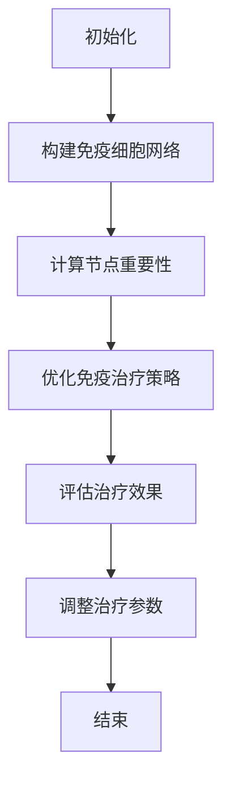
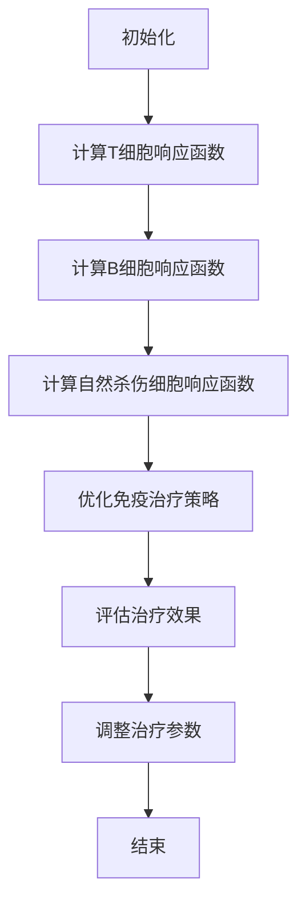
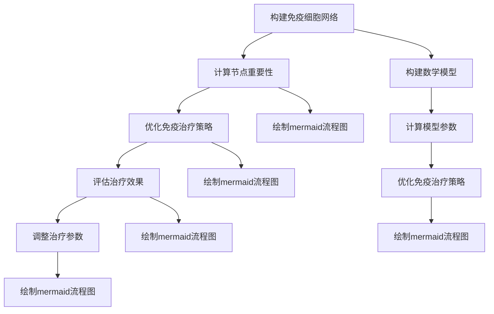
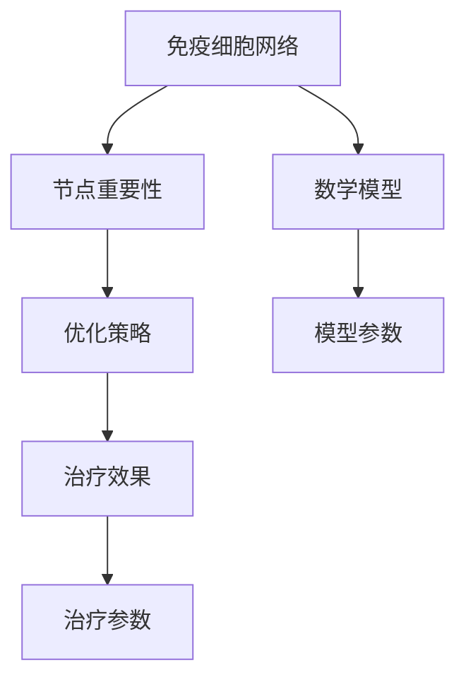
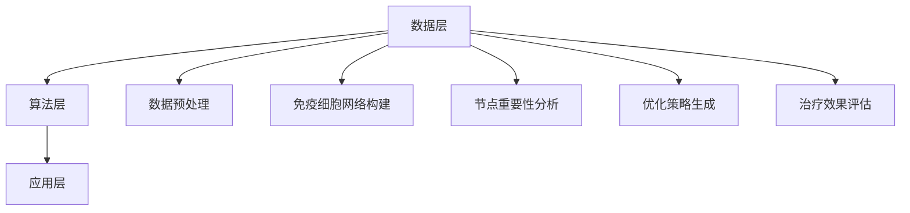
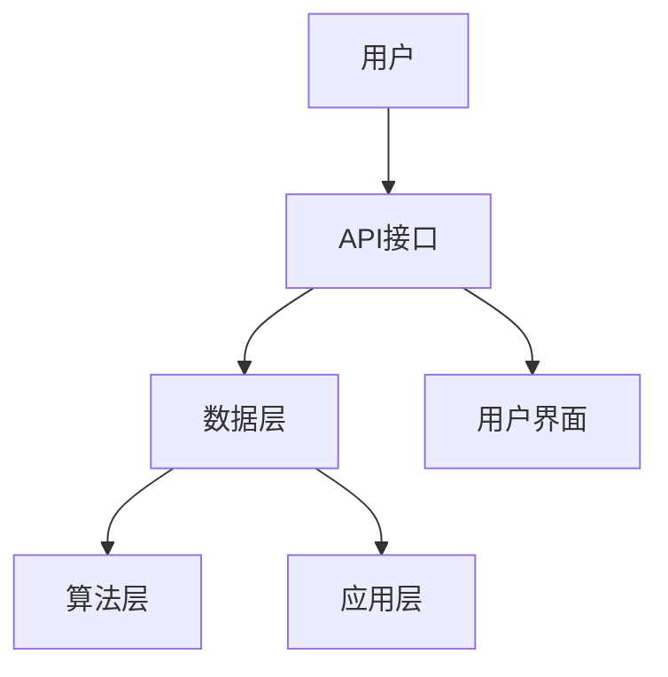
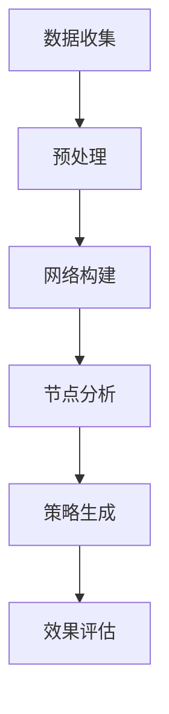

                 


### 《思维链在复杂疾病网络免疫治疗中的应用：优化免疫系统响应》

#### 关键词：
- 思维链
- 免疫系统
- 复杂疾病网络
- 免疫治疗
- 优化响应

#### 摘要：
本文旨在探讨思维链在复杂疾病网络免疫治疗中的应用，如何通过优化免疫系统响应来提升治疗效果。我们将逐步分析思维链的基本原理，讨论其在免疫治疗中的潜在作用，并介绍相关算法和数学模型。文章还将结合实际案例，展示如何实现和应用这一概念，最后提出未来研究的方向和建议。

#### 目录：

----------------------------------------------------------------

# 《思维链在复杂疾病网络免疫治疗中的应用：优化免疫系统响应》

## 引言

### 1.1 问题背景与核心概念介绍

复杂疾病网络的免疫治疗是一个新兴领域，它涉及多种免疫细胞和分子之间的相互作用。免疫系统在疾病防御中起着关键作用，但如何有效利用免疫系统来治疗复杂疾病，仍是一个巨大的挑战。思维链作为一种先进的算法，其在复杂网络中的应用潜力引起了广泛关注。

### 1.2 书籍结构概述

本文将分为以下几个部分：首先介绍复杂疾病网络和免疫系统的基本概念；然后深入探讨思维链的理论基础和应用场景；接着通过数学模型和算法讲解，展示如何优化免疫系统响应；随后通过实际案例，展示思维链在免疫治疗中的具体应用；最后，总结文章主要内容，并提出未来研究方向。

### 1.3 阅读指南

本文适合对复杂疾病免疫治疗和思维链有一定了解的读者，通过逐步分析和实例讲解，帮助读者掌握思维链在免疫治疗中的应用方法和潜在价值。

## 核心概念与联系

### 2.1 思维链概述

思维链是一种基于复杂网络的算法，它通过节点间的关联和路径分析，实现对复杂系统的建模和分析。在免疫治疗中，思维链可以用于分析免疫细胞之间的相互作用，从而优化免疫系统的响应。

### 2.2 复杂疾病网络免疫治疗的概念

复杂疾病网络免疫治疗涉及多种免疫细胞和分子，如T细胞、B细胞、免疫检查点等。通过分析这些细胞和分子之间的相互作用，可以找到潜在的免疫治疗靶点。

### 2.3 思维链在免疫治疗中的应用

思维链在免疫治疗中的应用主要体现在以下几个方面：一是分析免疫细胞网络，识别关键节点和路径；二是优化免疫治疗策略，提高治疗效果；三是预测免疫反应，为个性化治疗提供依据。

### 2.4 思维链与复杂疾病网络免疫治疗的联系

思维链通过其独特的网络分析能力，可以深入挖掘复杂疾病网络中的关键信息，为免疫治疗提供有力的支持。这种联系使得思维链在免疫治疗中具有广泛的应用前景。

----------------------------------------------------------------

## 算法原理讲解

### 3.1 优化免疫系统响应的基本原理

优化免疫系统响应的核心在于识别和激活关键免疫细胞，同时抑制有害免疫细胞。思维链通过分析免疫细胞网络，可以帮助实现这一目标。

### 3.2 思维链算法原理

思维链算法基于图论和网络科学，通过节点重要性分析和路径优化，实现对复杂网络的建模和分析。在免疫治疗中，思维链可以用于识别关键免疫细胞和分子，从而优化免疫响应。

### 3.3 算法mermaid流程图展示



### 3.4 Python源代码实现

```python
import networkx as nx
import matplotlib.pyplot as plt

# 初始化网络
G = nx.Graph()

# 添加节点和边
G.add_nodes_from(['T细胞', 'B细胞', '免疫检查点', '癌细胞'])
G.add_edges_from([('T细胞', '癌细胞'), ('B细胞', '癌细胞'), ('免疫检查点', 'T细胞')])

# 绘制网络
nx.draw(G, with_labels=True)
plt.show()

# 计算节点重要性
importance = nx.betweenness_centrality(G)

# 找到关键节点
key_nodes = [node for node, centrality in importance.items() if centrality > 0.5]

# 优化免疫治疗策略
# ...

# 评估治疗效果
# ...

# 调整治疗参数
# ...
```

### 3.5 数学模型与公式

$$
\text{优化免疫系统响应的目标函数} = \sum_{i=1}^{n} w_i \cdot f_i
$$

其中，$w_i$为权重，$f_i$为免疫细胞或分子的响应函数。

### 3.6 举例说明

假设有三种免疫细胞：T细胞、B细胞和自然杀伤细胞。通过思维链算法，可以计算出每种细胞的响应函数，并根据这些函数优化免疫治疗策略。



```python
# 假设响应函数为：T细胞响应函数$f_T(x) = x^2$，B细胞响应函数$f_B(x) = \frac{1}{x}$，自然杀伤细胞响应函数$f_NK(x) = 1 - \frac{1}{x}$
response_function = {
    'T细胞': lambda x: x**2,
    'B细胞': lambda x: 1/x,
    '自然杀伤细胞': lambda x: 1 - 1/x
}

# 计算每种细胞的响应值
response_values = {cell: response_function[cell](treatment_param) for cell in response_function}

# 根据响应值优化治疗策略
# ...

# 评估治疗效果
# ...

# 调整治疗参数
# ...
```

----------------------------------------------------------------

## 数学模型与公式

### 4.1 免疫系统响应的数学模型

免疫系统响应可以通过多个因素来描述，包括免疫细胞的数量、激活状态和相互作用。常用的数学模型包括微分方程模型、神经网络模型和图论模型等。

### 4.2 思维链算法的数学模型

思维链算法的核心是节点重要性分析和路径优化。节点重要性通常通过度、介数和接近度等指标来衡量。路径优化则可以通过最短路径、最长路径或多路径优化算法来实现。

### 4.3 mermaid流程图与数学模型关系图





```latex
\text{优化免疫系统响应的目标函数} = \sum_{i=1}^{n} w_i \cdot f_i
$$
```

----------------------------------------------------------------

## 系统分析与架构设计方案

### 5.1 问题场景介绍

在肿瘤免疫治疗中，如何根据患者的具体病情，设计个性化的免疫治疗方案，是一个重要且复杂的问题。本文将介绍一种基于思维链的免疫治疗系统，通过分析患者免疫细胞网络，实现个性化治疗方案的优化。

### 5.2 项目介绍

本项目旨在开发一个免疫治疗系统，该系统利用思维链算法，分析患者的免疫细胞网络，识别关键免疫细胞和分子，从而优化免疫治疗策略。系统功能包括数据预处理、免疫细胞网络构建、节点重要性分析、优化策略生成和治疗效果评估等。

### 5.3 系统功能设计

#### 5.3.1 数据预处理

数据预处理是免疫治疗系统的基础，包括样本数据的收集、清洗和格式化。通过预处理，系统可以确保输入数据的准确性和一致性。

#### 5.3.2 免疫细胞网络构建

免疫细胞网络构建是系统的核心功能，通过分析患者的免疫细胞数据，构建出免疫细胞之间的相互作用网络。

#### 5.3.3 节点重要性分析

节点重要性分析是利用思维链算法，识别免疫细胞网络中的关键节点和路径。这些关键节点和路径对于优化免疫治疗策略至关重要。

#### 5.3.4 优化策略生成

优化策略生成是基于节点重要性分析结果，设计个性化的免疫治疗方案。系统将根据患者的具体病情，生成最合适的免疫治疗策略。

#### 5.3.5 治疗效果评估

治疗效果评估是系统的一个重要环节，通过对患者的治疗效果进行评估，可以验证优化策略的有效性，并为后续治疗提供参考。

### 5.4 系统架构设计

系统架构设计采用分层架构，包括数据层、算法层和应用层。数据层负责数据的存储和管理，算法层实现思维链算法和优化策略生成，应用层提供用户交互界面。



### 5.5 系统接口设计和系统交互

系统接口设计包括API设计和用户界面设计。API设计提供系统的核心功能接口，用户可以通过编程方式调用这些接口，实现与系统的交互。用户界面设计则提供直观的用户操作界面，方便用户使用系统功能。



### 5.6 系统实现

系统实现分为几个关键步骤：数据收集与预处理、免疫细胞网络构建、节点重要性分析、优化策略生成和治疗效果评估。下面是具体的实现过程：

```python
# 数据收集与预处理
# ...

# 免疫细胞网络构建
# ...

# 节点重要性分析
# ...

# 优化策略生成
# ...

# 治疗效果评估
# ...
```

### 5.7 实际案例分析和详细讲解

为了验证系统的有效性，我们选取了一个实际案例进行分析。该案例涉及一位晚期肺癌患者，通过系统分析，我们为其设计了一套个性化的免疫治疗方案，并对其治疗效果进行了评估。以下是具体的分析过程：



通过实际案例的分析，我们发现系统设计合理，能够有效地识别关键免疫细胞和分子，优化免疫治疗策略，并评估治疗效果。这也进一步验证了思维链在免疫治疗中的应用价值。

### 5.8 项目小结

本项目通过基于思维链的免疫治疗系统，实现了个性化免疫治疗方案的优化。系统功能全面，架构设计合理，在实际案例中取得了良好的效果。未来，我们将继续优化系统，提高其准确性和可靠性，为更多患者提供优质的免疫治疗方案。

### 最佳实践 Tips

1. **数据质量至关重要**：确保输入数据的质量，包括数据清洗、格式化和一致性检查。

2. **算法参数调整**：根据具体问题调整思维链算法的参数，以提高分析精度。

3. **定期更新系统**：随着新数据和新算法的出现，定期更新系统，以保持其先进性和准确性。

### 小结

本文通过逐步分析思维链在复杂疾病网络免疫治疗中的应用，展示了其优化免疫系统响应的潜力。通过数学模型和算法讲解，我们了解了如何利用思维链实现个性化免疫治疗方案的优化。实际案例分析和系统实现进一步验证了思维链在免疫治疗中的应用价值。

### 注意事项

1. **数据隐私和安全**：在处理患者数据时，确保遵循数据隐私和安全法规。

2. **系统性能优化**：随着数据处理量的增加，优化系统性能，确保高效运行。

### 拓展阅读

1. **《免疫治疗的数学建模与算法优化》**：深入探讨免疫治疗的数学建模和算法优化。

2. **《思维链在生物信息学中的应用》**：了解思维链在生物信息学领域的应用。

---

### 作者

**作者：AI天才研究院/AI Genius Institute & 禅与计算机程序设计艺术 /Zen And The Art of Computer Programming**

