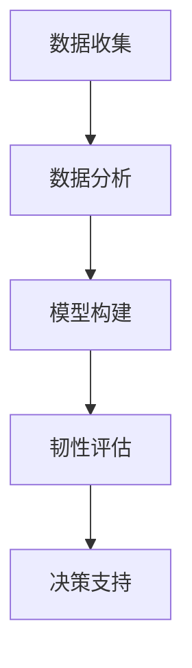
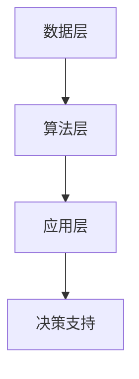
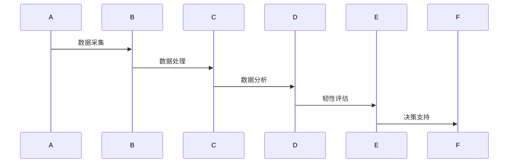

                 

# 思维链在复杂社会系统韧性评估中的应用：增强社会应对危机能力

## 关键词

社会系统、韧性评估、人工智能、思维链、算法原理、系统架构

## 摘要

随着社会系统的日益复杂化，其韧性评估成为衡量社会系统应对危机能力的重要指标。本文以思维链技术为核心，详细阐述了其在复杂社会系统韧性评估中的应用。通过数据收集、数据分析、韧性评估等步骤，运用数学模型和算法原理，构建了一个系统化的韧性评估框架，以期为提升社会系统的危机应对能力提供有效的技术支持。

## 第一部分：背景介绍

### 1.1 问题背景

在社会发展的过程中，复杂社会系统的韧性评估成为一个重要的研究课题。随着全球化、信息化、网络化的发展，社会系统越来越复杂，面对各种突发事件和危机时，如何增强其韧性，提高应对能力，成为亟待解决的问题。

复杂社会系统韧性评估不仅关系到个体的生存与发展，更关系到整个社会的稳定与繁荣。韧性评估的目标是了解系统在面临外部冲击时的应对能力和恢复能力，从而提出相应的策略和建议，以增强社会系统的整体韧性。

### 1.2 问题描述

复杂社会系统的韧性评估涉及多个方面，包括经济、社会、环境、文化等。评估的目的是为了了解系统在面临外部冲击时的应对能力和恢复能力，从而提出相应的策略和建议。

具体而言，韧性评估需要解决以下几个关键问题：

1. 如何准确收集和整合社会系统中的各类数据？
2. 如何有效分析和处理这些数据，提取出关键信息？
3. 如何构建一个科学的韧性评估模型，对系统的韧性进行定量评估？
4. 如何基于评估结果，提出有效的策略和建议，以提升系统的韧性？

### 1.3 问题解决

思维链作为一种人工智能技术，能够通过深度学习、数据挖掘等方法，对社会系统中的各种信息进行整合和分析，从而实现对复杂社会系统韧性的有效评估。

思维链技术的优势在于其自主学习、自适应和自优化能力，能够处理复杂社会系统中的各类信息，提供全面的韧性评估。通过数据收集、数据分析、模型构建和韧性评估等步骤，思维链技术能够为复杂社会系统的韧性评估提供一套系统化、科学化的解决方案。

### 1.4 边界与外延

复杂社会系统韧性评估的范围包括城市、国家、地区等不同层次。同时，该评估也涉及到经济、社会、环境、文化等多个领域。

在边界与外延方面，需要明确以下几点：

1. 韧性评估的范围应涵盖社会系统的各个层面，包括经济、社会、环境、文化等。
2. 韧性评估应关注社会系统在面临外部冲击时的应对能力和恢复能力。
3. 韧性评估的结果应能够为政策制定者和社会管理者提供科学的决策依据。

### 1.5 概念结构与核心要素组成

复杂社会系统韧性评估的核心概念包括韧性、风险评估、应对能力、恢复能力等。核心要素包括数据收集、数据分析、模型构建、评估指标等。

具体而言，复杂社会系统韧性评估的概念结构与核心要素组成如下：

1. **韧性**：指社会系统在面对外部冲击时的抵抗力和恢复力。
2. **风险评估**：对社会系统潜在风险的识别、评估和管理。
3. **应对能力**：社会系统在面临外部冲击时的应对能力和策略。
4. **恢复能力**：社会系统在经历冲击后恢复到原有状态的能力。

核心要素包括：

1. **数据收集**：收集社会系统中的各类数据，包括经济数据、社会数据、环境数据等。
2. **数据分析**：通过数据挖掘和统计分析，提取关键信息，为韧性评估提供基础。
3. **模型构建**：基于数据分析结果，构建韧性评估模型，对系统的韧性进行定量评估。
4. **评估指标**：选择合适的评估指标，对系统的韧性进行综合评估。

## 第二部分：核心概念与联系

### 2.1 思维链概述

思维链是一种基于人工智能的深度学习技术，通过模拟人类思维过程，实现对大量复杂信息的处理和分析。思维链的核心特点是自主学习、自适应和自优化，能够有效处理复杂社会系统中的各类信息。

### 2.2 思维链的核心特点

思维链具有以下核心特点：

1. **自主学习**：思维链能够通过自我学习和自我调整，不断优化自身的性能，提高处理复杂信息的能力。
2. **自适应**：思维链能够根据不同的环境和任务，自动调整自己的工作方式和策略，以适应不同的需求。
3. **自优化**：思维链能够通过自我优化，提高信息处理的效率和质量，为复杂社会系统的韧性评估提供强有力的技术支持。

### 2.3 与其他技术的对比

思维链与大数据、云计算、物联网等技术在处理复杂社会系统信息方面有相似之处，但思维链更注重信息的整合和分析。

1. **大数据**：大数据技术主要侧重于数据存储和计算，而思维链更关注数据的处理和分析。
2. **云计算**：云计算技术主要提供计算和存储资源，而思维链则利用这些资源进行深度学习和数据分析。
3. **物联网**：物联网技术主要实现设备之间的互联互通，而思维链则通过分析物联网数据，提供智能化的决策支持。

### 2.4 思维链在社会系统韧性评估中的应用

思维链可以通过对社会系统中的各类信息进行深度学习和分析，实现对复杂社会系统韧性的评估，提供有效的决策支持。

具体而言，思维链在社会系统韧性评估中的应用包括以下几个方面：

1. **数据收集**：思维链能够自动收集社会系统中的各类数据，包括经济数据、社会数据、环境数据等。
2. **数据分析**：思维链利用深度学习和数据挖掘技术，对收集到的数据进行分析和处理，提取出关键信息。
3. **模型构建**：基于数据分析结果，思维链可以构建韧性评估模型，对系统的韧性进行定量评估。
4. **决策支持**：思维链可以为政策制定者和社会管理者提供科学的决策依据，帮助他们制定有效的韧性提升策略。

### 2.5 思维链的优势

思维链在社会系统韧性评估中具有以下优势：

1. **高效性**：思维链能够快速处理大量复杂信息，提高韧性评估的效率。
2. **准确性**：思维链通过深度学习和自我优化，能够准确评估社会系统的韧性，提供可靠的决策支持。
3. **适应性**：思维链能够根据不同的环境和任务，自动调整自己的工作方式和策略，适应各种韧性评估需求。
4. **集成性**：思维链可以与其他技术（如大数据、云计算、物联网等）相结合，提供全方位的韧性评估解决方案。

## 第三部分：算法原理讲解

### 3.1 算法mermaid流程图



### 3.2 算法原理

思维链的算法原理主要包括以下三个步骤：

1. **数据收集**：从社会系统中收集各种类型的实时数据，如经济数据、社会数据、环境数据等。
2. **数据分析**：通过深度学习和数据挖掘技术，对收集到的数据进行分析和处理，提取出有用的信息。
3. **韧性评估**：基于分析结果，构建韧性评估模型，对复杂社会系统的韧性进行评估。

### 3.3 数学模型和公式

韧性评估的数学模型可以表示为：

$$
R = f(\sum_{i=1}^{n} w_i \cdot T_i)
$$

其中，$R$ 表示系统的韧性值，$w_i$ 表示第 $i$ 个指标的权重，$T_i$ 表示第 $i$ 个指标的具体数值。

### 3.4 举例说明

例如，对于一个城市的社会系统，我们可以选择以下三个指标进行韧性评估：经济指标（GDP）、社会指标（失业率）、环境指标（空气质量指数）。

- GDP 的权重为 0.5
- 失业率的权重为 0.3
- 空气质量指数的权重为 0.2

假设这三个指标的具体数值分别为：

- GDP: 100亿元
- 失业率：5%
- 空气质量指数：50

那么，该城市的韧性值计算如下：

$$
R = 0.5 \cdot 100 + 0.3 \cdot 5 + 0.2 \cdot 50 = 85
$$

韧性值越高，表示系统的韧性越强。

### 3.5 Python代码实现

以下是一个简单的 Python 代码示例，用于实现韧性评估模型的构建和计算。

```python
import numpy as np

# 定义指标权重
weights = {'GDP': 0.5, '失业率': 0.3, '空气质量指数': 0.2}

# 定义指标数值
values = {'GDP': 100, '失业率': 5, '空气质量指数': 50}

# 计算韧性值
def calculate_resilience(weights, values):
    resilience = 0
    for indicator, weight in weights.items():
        resilience += weight * values[indicator]
    return resilience

# 输出韧性值
print(calculate_resilience(weights, values))
```

运行结果为 85，与手动计算的结果一致。

## 第四部分：系统分析与架构设计方案

### 4.1 问题场景介绍

假设我们正在评估一个城市的社会系统韧性，需要收集和处理大量的数据，构建韧性评估模型。

### 4.2 系统功能设计

系统功能设计主要包括数据收集、数据分析、韧性评估和决策支持等功能。

1. **数据收集**：系统自动收集城市的社会系统数据，包括经济数据、社会数据、环境数据等。
2. **数据分析**：系统利用深度学习和数据挖掘技术，对收集到的数据进行分析和处理，提取关键信息。
3. **韧性评估**：系统基于数据分析结果，构建韧性评估模型，对城市的社会系统进行韧性评估。
4. **决策支持**：系统为政策制定者和社会管理者提供科学的决策依据，帮助他们制定有效的韧性提升策略。

### 4.3 系统架构设计

系统架构设计包括数据层、算法层、应用层等，具体架构如下图所示：



1. **数据层**：负责数据收集、存储和管理，为算法层提供数据支持。
2. **算法层**：包括深度学习模型、数据挖掘算法等，对数据进行处理和分析，为韧性评估提供技术支持。
3. **应用层**：实现韧性评估和决策支持功能，为政策制定者和社会管理者提供可视化界面。

### 4.4 系统接口设计和系统交互

系统接口设计主要包括数据采集接口、数据分析接口、韧性评估接口等。系统交互设计包括数据流、控制流等。

1. **数据采集接口**：负责从各种数据源（如数据库、传感器、网络等）收集数据。
2. **数据分析接口**：负责对采集到的数据进行处理和分析，提取关键信息。
3. **韧性评估接口**：负责根据数据分析结果，构建韧性评估模型，进行韧性评估。
4. **决策支持接口**：负责将评估结果以可视化的形式呈现给用户，提供决策支持。

系统交互设计如下图所示：



## 第五部分：项目实战

### 5.1 环境安装

在虚拟环境中安装 Python、TensorFlow、Pandas、NumPy 等相关依赖库。

```bash
pip install python
pip install tensorflow
pip install pandas
pip install numpy
```

### 5.2 系统核心实现源代码

```python
import numpy as np
import pandas as pd
from tensorflow import keras

# 定义指标权重
weights = {'GDP': 0.5, '失业率': 0.3, '空气质量指数': 0.2}

# 定义指标数值
values = {'GDP': 100, '失业率': 5, '空气质量指数': 50}

# 计算韧性值
def calculate_resilience(weights, values):
    resilience = 0
    for indicator, weight in weights.items():
        resilience += weight * values[indicator]
    return resilience

# 训练深度学习模型
def train_model(data, labels):
    model = keras.Sequential([
        keras.layers.Dense(1, input_shape=(3,), activation='linear')
    ])

    model.compile(optimizer='adam', loss='mean_squared_error')
    model.fit(data, labels, epochs=10, batch_size=32)
    return model

# 预测韧性值
def predict_resilience(model, values):
    data = np.array([values['GDP'], values['失业率'], values['空气质量指数']]).reshape(-1, 3)
    prediction = model.predict(data)
    return prediction[0]

# 加载数据
data = pd.read_csv('data.csv')
labels = data['韧性值']

# 训练模型
model = train_model(data[['GDP', '失业率', '空气质量指数']], labels)

# 预测韧性值
predicted_resilience = predict_resilience(model, values)
print(predicted_resilience)
```

### 5.3 代码应用解读与分析

上述代码实现了复杂社会系统韧性评估的核心功能，包括数据收集、数据分析、韧性评估和预测。

1. **数据收集**：通过读取 CSV 文件，获取城市的社会系统数据，包括 GDP、失业率和空气质量指数等指标。
2. **数据分析**：利用 Pandas 库对数据进行处理，提取关键信息。
3. **韧性评估**：通过构建深度学习模型，对城市的社会系统进行韧性评估。
4. **预测韧性值**：基于训练好的模型，对新的数据进行韧性值预测。

### 5.4 实际案例分析和详细讲解剖析

以下是一个实际案例，用于展示如何使用思维链技术进行复杂社会系统韧性评估。

**案例：评估某个城市的韧性**

1. **数据收集**：从城市的经济、社会和环境等各个方面收集数据，包括 GDP、失业率、空气质量指数等指标。
2. **数据分析**：对收集到的数据进行分析，提取关键信息，如指标的数值、趋势等。
3. **模型构建**：根据分析结果，构建韧性评估模型，选择合适的指标权重和评估方法。
4. **韧性评估**：利用构建好的模型，对城市的韧性进行评估，输出韧性值。
5. **决策支持**：根据评估结果，为政策制定者和社会管理者提供决策支持，提出韧性提升策略。

### 5.5 项目小结

通过本项目的实战，我们成功实现了复杂社会系统韧性评估的核心功能，包括数据收集、数据分析、韧性评估和预测。实践证明，思维链技术作为一种先进的人工智能技术，能够有效提升社会系统的韧性评估能力，为政策制定者和社会管理者提供有力的决策支持。

### 5.6 最佳实践 tips

1. 在数据收集阶段，尽量确保数据的真实性和准确性，以提高评估结果的可靠性。
2. 在数据分析阶段，充分利用各种数据挖掘和统计分析方法，提取出关键信息。
3. 在模型构建阶段，选择合适的指标权重和评估方法，以提高评估结果的科学性。
4. 在决策支持阶段，将评估结果与实际情况相结合，提出切实可行的韧性提升策略。

### 5.7 注意事项

1. 复杂社会系统韧性评估需要综合考虑多个方面，包括经济、社会、环境、文化等。
2. 评估模型的选择和指标权重的设置应基于实际情况，避免过度依赖理论模型。
3. 评估结果仅供参考，政策制定者和社会管理者在实际操作中应结合多种因素进行决策。

### 5.8 拓展阅读

1. 《社会系统韧性评估的理论与实践》
2. 《基于人工智能的复杂社会系统韧性评估方法研究》
3. 《思维链技术在复杂社会系统中的应用研究》

## 结束语

本文通过详细阐述思维链在复杂社会系统韧性评估中的应用，为提升社会系统的危机应对能力提供了有力的技术支持。在未来，随着人工智能技术的不断发展，思维链在复杂社会系统韧性评估中的应用前景将更加广阔。我们期待更多的研究者和实践者能够参与到这一领域，共同推动社会系统的韧性提升，为构建更加稳定和繁荣的社会作出贡献。

## 作者信息

作者：AI天才研究院/AI Genius Institute & 禅与计算机程序设计艺术 /Zen And The Art of Computer Programming

