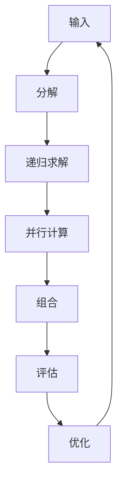
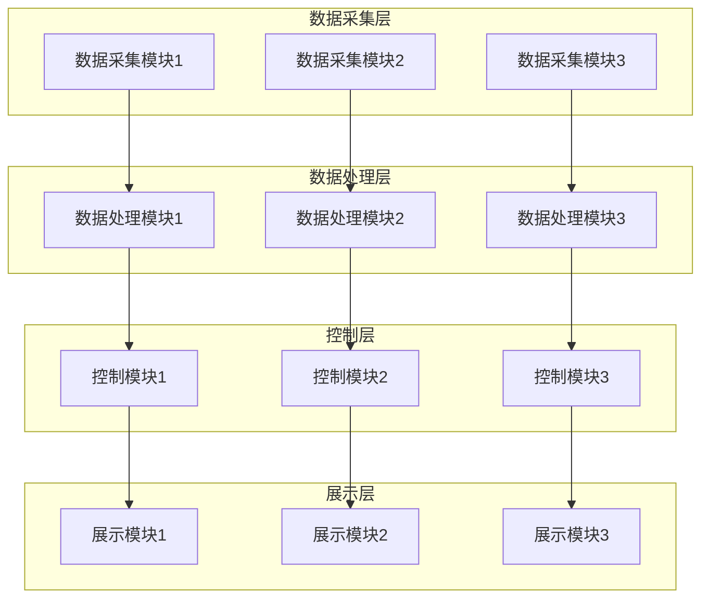
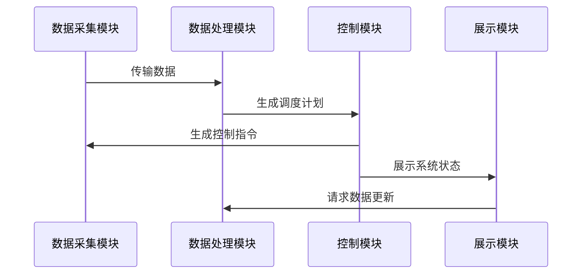

                 

### 引言

#### 1.1 问题背景

随着科技的发展，复杂系统在各个领域得到了广泛的应用，如人工智能、物联网、大数据等。复杂系统通常具有大量相互作用的组件，其行为无法通过简单的线性关系进行描述，这使得对其进行优化成为了一个极具挑战性的问题。

复杂系统的优化涉及到多个方面，包括但不限于性能提升、资源利用最大化、成本降低等。然而，复杂系统的特性使得传统的优化方法难以直接应用，主要原因有以下几点：

- **动态性**：复杂系统的状态随时间变化，且变化模式复杂，难以预测。
- **多样性**：系统组件繁多，且各组件之间存在复杂的交互关系，这使得单一的方法难以适应所有情况。
- **不确定性**：系统行为受到外部环境、组件故障等多种因素的影响，具有很高的不确定性。

因此，如何有效地优化复杂系统成为了当前研究的热点问题。在这一背景下，思维链（Mind Chain）作为一种新兴的优化策略，逐渐受到了关注。

#### 1.2 问题描述

复杂系统优化问题可以概括为以下几种类型：

1. **性能优化**：提升系统的运行效率，减少响应时间，提高吞吐量。
2. **资源优化**：合理分配系统资源，最大化资源利用率。
3. **成本优化**：降低系统运行成本，提高经济效益。

这些优化问题的目标往往是在满足一定约束条件的前提下，找到最优的解决方案。常见的约束条件包括：

- **资源限制**：系统资源（如内存、计算能力等）的限制。
- **时间限制**：系统在特定时间窗口内完成任务的要求。
- **质量要求**：系统性能指标（如响应时间、准确率等）的要求。

复杂系统优化问题的核心是如何在多样化的约束条件下，快速且准确地找到最优解。这既需要对系统的深入理解，又需要高效的算法支持。

#### 1.3 问题解决

思维链（Mind Chain）作为一种基于人工智能的优化策略，旨在通过模拟人类思维方式，实现对复杂系统的有效优化。思维链的基本原理可以概括为以下几点：

1. **问题分解**：将复杂问题分解为多个子问题，降低问题难度。
2. **递归求解**：针对每个子问题，采用递归的方式逐步求解，最终组合得到全局最优解。
3. **并行计算**：利用并行计算技术，加速问题的求解过程。

思维链在复杂系统优化中的应用场景包括：

- **智能调度系统**：通过对任务进行优化调度，提高系统的运行效率。
- **资源管理系统**：通过对资源进行优化配置，最大化资源利用率。
- **供应链优化**：通过优化供应链中的各个环节，降低成本，提高交付效率。

#### 1.4 边界与外延

复杂系统优化是计算机科学、人工智能、运筹学等多个学科交叉的领域，其应用领域广泛，包括但不限于：

- **工业控制系统**：如生产线调度、设备维护等。
- **交通运输系统**：如交通流量管理、航班调度等。
- **能源管理系统**：如电力调度、能源分配等。

思维链作为一种新兴的优化策略，不仅可以在复杂系统优化中得到应用，还可以在其他优化问题中发挥重要作用，如机器学习模型优化、神经网络参数调整等。

#### 1.5 概念结构与核心要素组成

复杂系统由多个相互作用的组件组成，每个组件都有其特定的功能和行为。思维链作为一种优化策略，其核心要素包括：

- **问题模型**：对复杂系统的抽象和描述。
- **思维链网络**：模拟人类思维过程的网络结构。
- **优化算法**：用于求解复杂系统优化问题的算法。
- **评估指标**：用于评估优化效果的指标。

思维链的基本结构包括：

1. **输入层**：接收复杂系统的描述。
2. **隐藏层**：模拟人类思维过程，对问题进行分解和递归求解。
3. **输出层**：生成优化方案，并进行评估。

#### 1.6 本章小结

本文首先介绍了复杂系统优化的问题背景和挑战，然后提出了思维链作为一种有效的优化策略。通过对思维链的定义、原理和应用场景的详细阐述，本文展示了思维链在复杂系统优化中的重要性和潜力。接下来，本文将进一步探讨思维链的核心概念、算法原理和系统分析与设计，以帮助读者深入理解这一优化策略。通过项目实战和最佳实践，读者可以更好地掌握思维链的实际应用方法，为解决复杂系统优化问题提供新的思路和工具。

---

**关键词**：复杂系统优化、思维链、递归求解、并行计算、智能调度、资源管理、供应链优化

**摘要**：本文围绕复杂系统优化问题，探讨了思维链这一新兴优化策略的定义、原理和应用。通过对思维链的核心概念、算法原理、系统分析与设计以及项目实战的详细阐述，本文旨在为解决复杂系统优化问题提供新的方法和思路。思维链作为一种模拟人类思维过程的优化策略，具有广泛的应用前景和潜力。通过本文的介绍，读者可以更好地理解思维链的原理和实际应用，为复杂系统优化问题的解决提供有力支持。

----------------------------------------------------------------

## 第1章 思维链在复杂系统优化中的应用概述

### 1.1 问题背景

随着计算机技术和人工智能的迅猛发展，复杂系统在各个领域得到了广泛的应用。复杂系统通常由多个相互关联的组件构成，这些组件之间通过复杂的交互关系实现系统的整体功能。然而，复杂系统的动态性、多样性和不确定性等特点，使得传统的优化方法在处理这类问题时面临诸多挑战。

#### 复杂系统的定义与特点

复杂系统是指具有高度复杂性和不确定性的系统，其特征如下：

1. **动态性**：复杂系统的状态随时间变化，且变化模式复杂，难以预测。
2. **多样性**：系统组件繁多，且各组件之间存在复杂的交互关系，这使得单一的方法难以适应所有情况。
3. **不确定性**：系统行为受到外部环境、组件故障等多种因素的影响，具有很高的不确定性。
4. **规模庞大**：复杂系统通常涉及大量组件和变量，导致问题规模庞大，难以直接应用传统方法。

#### 复杂系统优化面临的挑战

复杂系统的优化问题主要体现在以下几个方面：

1. **问题分解**：如何将复杂问题分解为多个子问题，以便于求解。
2. **求解效率**：如何在有限的时间和资源内找到最优解。
3. **鲁棒性**：如何应对系统中的不确定性和动态变化。
4. **适应性**：如何适应不同场景和问题的需求。

这些挑战使得传统的优化方法难以直接应用于复杂系统，因此，寻找新的优化策略成为了一个重要研究方向。

### 1.2 问题描述

复杂系统优化问题可以概括为以下几种类型：

1. **性能优化**：提升系统的运行效率，减少响应时间，提高吞吐量。
2. **资源优化**：合理分配系统资源，最大化资源利用率。
3. **成本优化**：降低系统运行成本，提高经济效益。

这些优化问题的目标往往是在满足一定约束条件的前提下，找到最优的解决方案。常见的约束条件包括：

- **资源限制**：系统资源（如内存、计算能力等）的限制。
- **时间限制**：系统在特定时间窗口内完成任务的要求。
- **质量要求**：系统性能指标（如响应时间、准确率等）的要求。

复杂系统优化问题的核心是如何在多样化的约束条件下，快速且准确地找到最优解。这既需要对系统的深入理解，又需要高效的算法支持。

### 1.3 问题解决

思维链（Mind Chain）作为一种基于人工智能的优化策略，旨在通过模拟人类思维方式，实现对复杂系统的有效优化。思维链的基本原理可以概括为以下几点：

1. **问题分解**：将复杂问题分解为多个子问题，降低问题难度。
2. **递归求解**：针对每个子问题，采用递归的方式逐步求解，最终组合得到全局最优解。
3. **并行计算**：利用并行计算技术，加速问题的求解过程。

思维链在复杂系统优化中的应用场景包括：

- **智能调度系统**：通过对任务进行优化调度，提高系统的运行效率。
- **资源管理系统**：通过对资源进行优化配置，最大化资源利用率。
- **供应链优化**：通过优化供应链中的各个环节，降低成本，提高交付效率。

### 1.4 边界与外延

复杂系统优化是计算机科学、人工智能、运筹学等多个学科交叉的领域，其应用领域广泛，包括但不限于：

- **工业控制系统**：如生产线调度、设备维护等。
- **交通运输系统**：如交通流量管理、航班调度等。
- **能源管理系统**：如电力调度、能源分配等。

思维链作为一种新兴的优化策略，不仅可以在复杂系统优化中得到应用，还可以在其他优化问题中发挥重要作用，如机器学习模型优化、神经网络参数调整等。

### 1.5 概念结构与核心要素组成

复杂系统由多个相互作用的组件组成，每个组件都有其特定的功能和行为。思维链作为一种优化策略，其核心要素包括：

- **问题模型**：对复杂系统的抽象和描述。
- **思维链网络**：模拟人类思维过程的网络结构。
- **优化算法**：用于求解复杂系统优化问题的算法。
- **评估指标**：用于评估优化效果的指标。

思维链的基本结构包括：

1. **输入层**：接收复杂系统的描述。
2. **隐藏层**：模拟人类思维过程，对问题进行分解和递归求解。
3. **输出层**：生成优化方案，并进行评估。

### 1.6 本章小结

本章介绍了复杂系统优化的问题背景、问题描述、问题解决方法以及思维链的概念和结构。通过对复杂系统优化问题的深入探讨，我们明确了思维链在这一领域中的重要性和潜力。在接下来的章节中，我们将进一步详细探讨思维链的核心概念、算法原理和实际应用，为解决复杂系统优化问题提供更加深入的指导。

---

**关键词**：复杂系统、优化、思维链、递归求解、并行计算、智能调度、资源管理、供应链优化

**摘要**：本章从问题背景出发，详细探讨了复杂系统优化中的挑战，并介绍了思维链作为解决这一问题的优化策略。通过对思维链的概念、原理和应用场景的阐述，本章为读者提供了一个全面的认识，并展示了思维链在复杂系统优化中的重要性和应用潜力。下一章节将进一步深入探讨思维链的核心概念和原理。

----------------------------------------------------------------

## 第2章 思维链的基础概念

### 2.1 思维链的定义

思维链（Mind Chain）是一种基于人工智能的优化策略，它通过模拟人类思维过程，实现对复杂系统的优化。思维链的核心思想是将复杂问题分解为多个子问题，通过递归求解和并行计算，逐步逼近全局最优解。

#### 思维链的基本含义

思维链是一种模拟人类思维过程的网络结构，它由输入层、隐藏层和输出层组成。输入层接收复杂系统的描述，隐藏层通过递归求解和并行计算对问题进行分解和求解，输出层生成优化方案，并进行评估。

#### 思维链与其他概念的区别

思维链与其他优化策略（如深度学习、遗传算法等）有显著的区别：

- **深度学习**：深度学习主要依赖大量数据，通过多层神经网络进行特征提取和预测。其优势在于能够处理大量数据，但需要大量的计算资源和数据支持。
- **遗传算法**：遗传算法是一种基于自然选择和遗传学原理的优化方法，通过种群进化来寻找最优解。其优势在于能够处理复杂的非线性问题，但收敛速度较慢，需要大量的迭代次数。

相比之下，思维链具有以下特点：

- **问题分解**：思维链通过递归求解将复杂问题分解为多个子问题，降低了问题难度。
- **并行计算**：思维链利用并行计算技术，加速问题的求解过程。
- **灵活适应**：思维链能够适应不同的优化问题，具有较强的泛化能力。

### 2.2 思维链的属性特征

思维链具有以下属性特征：

1. **递归性**：思维链通过递归求解，将复杂问题分解为多个子问题，逐步逼近全局最优解。
2. **并行性**：思维链利用并行计算技术，加速问题的求解过程，提高了求解效率。
3. **适应性**：思维链能够根据问题的不同特点，调整网络结构和参数，具有较强的适应能力。
4. **鲁棒性**：思维链能够应对系统中的不确定性和动态变化，具有较高的鲁棒性。

#### 思维链的功能特点

思维链具有以下功能特点：

1. **优化性能**：思维链通过递归求解和并行计算，能够快速找到全局最优解，提升系统的运行效率。
2. **资源利用**：思维链能够合理分配系统资源，最大化资源利用率，降低运行成本。
3. **鲁棒性**：思维链能够应对系统中的不确定性和动态变化，保证系统稳定运行。
4. **适应性**：思维链能够适应不同的优化问题，具有较强的泛化能力。

#### 思维链的适应性分析

思维链的适应性主要体现在以下几个方面：

1. **问题领域**：思维链能够适应不同领域的问题，如工业控制系统、交通运输系统、能源管理系统等。
2. **问题规模**：思维链能够处理大规模的问题，如千万级变量和约束条件。
3. **问题类型**：思维链能够处理不同类型的问题，如线性优化、非线性优化、组合优化等。

### 2.3 思维链的应用场景

思维链在复杂系统优化中的应用场景广泛，主要包括以下几个方面：

1. **智能调度系统**：通过优化任务调度，提高系统的运行效率，如生产线调度、航班调度等。
2. **资源管理系统**：通过优化资源配置，最大化资源利用率，如电力调度、数据中心资源管理等。
3. **供应链优化**：通过优化供应链中的各个环节，降低成本，提高交付效率，如物流优化、生产计划优化等。
4. **智能交通系统**：通过优化交通流量管理，降低交通拥堵，提高交通效率，如交通信号控制、路径规划等。
5. **能源管理系统**：通过优化能源分配和调度，提高能源利用效率，如智能电网、风能管理等。

#### 2.4 核心概念对比分析

思维链与其他优化方法在核心概念上存在显著差异：

| 优化方法 | 核心概念 |
| :------: | :------: |
| 思维链 | 递归求解、并行计算、适应性、鲁棒性 |
| 深度学习 | 神经网络、特征提取、模型训练 |
| 遗传算法 | 种群进化、适应度函数、交叉与变异 |

#### 2.5 思维链的ER实体关系图

思维链的ER实体关系图如下：

```mermaid
erDiagram
    Problem ||--o{ MindChain }
    MindChain ||--|{ InputLayer }
    MindChain ||--|{ HiddenLayer }
    MindChain ||--|{ OutputLayer }
```

#### 2.6 本章小结

本章详细介绍了思维链的定义、属性特征和应用场景。通过对思维链与其他优化方法的对比分析，我们明确了思维链在复杂系统优化中的重要性和优势。在接下来的章节中，我们将进一步探讨思维链的算法原理和实际应用，为解决复杂系统优化问题提供更加深入的指导。

---

**关键词**：思维链、优化策略、递归求解、并行计算、适应性、鲁棒性、智能调度、资源管理、供应链优化

**摘要**：本章围绕思维链这一核心概念，详细阐述了其定义、属性特征、应用场景和与其他优化方法的对比。通过对思维链的ER实体关系图的绘制，读者可以更直观地理解思维链的基本结构。本章旨在为读者提供一个全面的认识，为后续章节的深入探讨打下基础。

----------------------------------------------------------------

## 第3章 思维链算法原理讲解

### 3.1 思维链算法的基本原理

思维链算法（Mind Chain Algorithm）是一种基于人工智能的优化算法，其核心思想是通过模拟人类思维方式，将复杂问题分解为多个子问题，并采用递归求解和并行计算的方法，逐步找到全局最优解。思维链算法的基本原理可以概括为以下几个步骤：

1. **问题分解**：将复杂问题分解为多个子问题，降低问题难度。
2. **递归求解**：针对每个子问题，采用递归的方式逐步求解，最终组合得到全局最优解。
3. **并行计算**：利用并行计算技术，加速问题的求解过程。
4. **评估与优化**：对生成的方案进行评估，并根据评估结果进行优化。

#### 算法的基本思想

思维链算法的基本思想是通过模拟人类思维方式，实现对复杂问题的优化。人类在解决复杂问题时，通常采用以下思维方式：

1. **问题分解**：将复杂问题分解为多个子问题，以便于解决。
2. **递归求解**：针对每个子问题，采用递归的方式逐步求解，最终组合得到全局最优解。
3. **并行处理**：在处理多个子问题时，可以同时进行，提高求解效率。

思维链算法通过模拟这些思维方式，利用递归求解和并行计算技术，实现对复杂问题的优化。

#### 算法的工作流程

思维链算法的工作流程可以分为以下几个步骤：

1. **输入**：接收复杂系统的描述和优化目标。
2. **分解**：将复杂问题分解为多个子问题。
3. **递归求解**：针对每个子问题，采用递归的方式逐步求解。
4. **并行计算**：利用并行计算技术，加速问题的求解过程。
5. **组合**：将各个子问题的解组合得到全局最优解。
6. **评估**：对生成的方案进行评估。
7. **优化**：根据评估结果进行优化，以提高方案的优劣。

### 3.2 思维链算法的mermaid流程图

为了更好地理解思维链算法的工作流程，我们可以使用mermaid绘制其流程图。以下是一个简单的思维链算法流程图的示例：



在这个流程图中，每个节点表示算法的一个步骤，箭头表示步骤之间的顺序关系。通过这个流程图，我们可以清晰地看到思维链算法的工作流程。

### 3.3 数学模型和公式

思维链算法的数学模型和公式是实现算法核心的关键。以下是思维链算法的一些基本数学模型和公式：

1. **递归求解公式**：
   $$f(x) = g(x) + h(x)$$
   其中，$f(x)$表示全局最优解，$g(x)$表示子问题的最优解，$h(x)$表示子问题的解与全局最优解之间的差距。

2. **评估公式**：
   $$s(x) = \frac{1}{n}\sum_{i=1}^{n}w_i \cdot p_i$$
   其中，$s(x)$表示评估值，$w_i$表示权重，$p_i$表示评估指标。

3. **优化公式**：
   $$x_{\text{new}} = x_{\text{current}} + \alpha \cdot \nabla f(x_{\text{current}})$$
   其中，$x_{\text{new}}$表示新的解，$x_{\text{current}}$表示当前的解，$\alpha$表示学习率，$\nabla f(x_{\text{current}})$表示梯度。

#### 公式详解

1. **递归求解公式**：

   该公式表示全局最优解由子问题的最优解和子问题解与全局最优解之间的差距组成。通过递归求解，我们可以逐步逼近全局最优解。

2. **评估公式**：

   该公式用于评估方案的质量。通过计算各个评估指标的总和，我们可以得到一个综合评估值，用于衡量方案的好坏。

3. **优化公式**：

   该公式用于更新解，通过计算梯度，我们可以找到最优解的方向，并据此更新解。

### 3.4 算法举例说明

为了更好地理解思维链算法，我们可以通过一个简单的例子来说明其应用过程。

#### 例子：旅行商问题（TSP）

旅行商问题（TSP，Traveling Salesman Problem）是一个经典的组合优化问题，其目标是在一组城市之间找到一条最短的路径，使得旅行商能够访问每个城市一次并返回起点。

#### 步骤：

1. **输入**：给定一组城市的坐标和旅行费用。
2. **分解**：将TSP分解为多个子问题，如每个城市之间的最短路径。
3. **递归求解**：针对每个子问题，采用递归的方式求解最短路径。
4. **并行计算**：利用并行计算技术，加速求解过程。
5. **组合**：将各个子问题的解组合，得到全局最优路径。
6. **评估**：评估全局最优路径的长度和费用。
7. **优化**：根据评估结果，对全局最优路径进行优化。

#### 结论

通过以上步骤，我们可以使用思维链算法解决旅行商问题。这个例子展示了思维链算法的基本原理和实际应用过程，为读者提供了一个直观的理解。

---

**关键词**：思维链、优化算法、递归求解、并行计算、数学模型、旅行商问题

**摘要**：本章详细介绍了思维链算法的基本原理和数学模型，包括递归求解公式、评估公式和优化公式。通过mermaid流程图和旅行商问题的实例，读者可以更好地理解思维链算法的工作流程和应用方法。本章旨在为读者提供一个全面的认识，为后续章节的深入探讨打下基础。

----------------------------------------------------------------

## 第4章 系统分析与架构设计

### 4.1 问题场景介绍

在复杂系统优化中，智能调度系统是一个典型的应用场景。以智能电网调度为例，其目标是通过优化电力资源的分配，提高电力系统的运行效率和可靠性。智能电网调度涉及多个环节，包括电力生产、传输、分配和消费等，这些环节之间存在复杂的交互关系，使得优化问题具有高度的复杂性和不确定性。

#### 优化问题的具体场景

智能电网调度中的优化问题主要包括：

1. **电力负荷预测**：预测未来一段时间内的电力负荷，为电力调度提供依据。
2. **发电计划优化**：根据电力负荷预测结果，制定发电计划，优化发电厂的运行模式。
3. **电力传输网络优化**：优化电力传输网络的运行状态，确保电力输送的稳定性和可靠性。
4. **电力消费管理**：优化电力消费者的用电模式，降低用电高峰期的负荷，缓解电网压力。

这些优化问题的目标是实现电力资源的最佳配置，提高系统的运行效率和经济效益。

### 4.2 项目介绍

#### 项目背景

随着可再生能源的广泛应用和电力需求的不断增长，智能电网成为电力系统发展的必然趋势。智能电网通过引入先进的通信技术和数据分析方法，实现了电力资源的实时监控和优化调度，从而提高了电力系统的运行效率和可靠性。

#### 项目目标

本项目旨在构建一个智能电网调度系统，通过优化电力资源的分配，实现以下目标：

1. 提高电力系统的运行效率，降低能源浪费。
2. 提高电力系统的可靠性，减少停电事故。
3. 降低电力系统的运行成本，提高经济效益。
4. 支持多种可再生能源的接入和管理。

### 4.3 系统功能设计

为了实现项目目标，智能电网调度系统需要具备以下功能：

1. **电力负荷预测**：通过历史数据和实时监测数据，预测未来一段时间内的电力负荷。
2. **发电计划优化**：根据电力负荷预测结果，优化发电厂的运行模式，确保电力供应的稳定性。
3. **电力传输网络优化**：优化电力传输网络的运行状态，确保电力输送的稳定性和可靠性。
4. **电力消费管理**：优化电力消费者的用电模式，降低用电高峰期的负荷，缓解电网压力。
5. **数据监测与可视化**：实时监测电力系统的运行状态，并通过数据可视化技术展示系统性能。

#### 领域模型

为了更好地描述智能电网调度系统的功能需求，我们可以采用领域模型（Domain Model）进行设计。领域模型主要包括以下实体：

1. **电力负荷**：表示电力系统的负荷情况，包括实时负荷和历史负荷。
2. **发电计划**：表示发电厂的运行计划，包括发电量、发电时间和发电成本。
3. **电力传输网络**：表示电力传输网络的拓扑结构和运行状态。
4. **电力消费**：表示电力消费者的用电情况，包括用电量和用电模式。
5. **可再生能源**：表示可再生能源的接入和管理，包括太阳能、风能等。

通过领域模型，我们可以清晰地描述智能电网调度系统的功能需求，并为后续的系统设计提供依据。

### 4.4 系统架构设计

为了实现智能电网调度系统的功能，我们需要设计一个高效、可靠的系统架构。智能电网调度系统的架构主要包括以下几个层次：

1. **数据采集层**：负责采集电力系统的实时数据，包括电力负荷、发电计划、电力传输网络状态等。
2. **数据处理层**：负责对采集到的数据进行处理和分析，包括电力负荷预测、发电计划优化、电力传输网络优化等。
3. **控制层**：负责根据处理结果生成调度指令，控制电力系统的运行状态。
4. **展示层**：负责将系统的运行状态和调度结果通过数据可视化技术展示给用户。

#### 系统架构概述

以下是一个简单的智能电网调度系统架构图：



在这个架构图中，数据采集层负责采集实时数据，数据处理层负责对数据进行处理和分析，控制层负责根据处理结果生成调度指令，展示层负责将系统的运行状态和调度结果展示给用户。

### 4.5 系统接口设计

为了实现系统各个层次之间的有效通信，我们需要设计一套完善的系统接口。以下是一个简单的智能电网调度系统的接口设计：

1. **数据采集接口**：用于数据采集模块与其他模块之间的数据交换。
2. **数据处理接口**：用于数据处理模块与其他模块之间的数据交换。
3. **控制接口**：用于控制模块与数据采集层、数据处理层之间的通信。
4. **展示接口**：用于展示模块与控制层之间的数据交换。

通过这些接口，系统各个模块可以高效地协同工作，实现智能电网调度的目标。

### 4.6 系统交互

智能电网调度系统的各个模块之间存在复杂的交互关系，以下是一个简单的系统交互流程：

1. **数据采集模块**：实时采集电力系统的数据，并将数据传输给数据处理模块。
2. **数据处理模块**：对采集到的数据进行处理和分析，生成调度计划，并将结果传输给控制模块。
3. **控制模块**：根据调度计划生成控制指令，调整电力系统的运行状态。
4. **展示模块**：将系统的运行状态和调度结果通过数据可视化技术展示给用户。

以下是一个简单的系统交互序列图：



在这个序列图中，各个模块通过接口进行数据交换和协同工作，实现了智能电网调度的目标。

---

**关键词**：智能电网调度、系统架构、领域模型、接口设计、系统交互

**摘要**：本章详细介绍了智能电网调度系统的系统分析与架构设计。通过描述问题场景、项目目标和系统功能，我们构建了一个清晰的系统架构。通过领域模型和接口设计，我们确保了系统各个模块之间的有效交互。本章旨在为读者提供一个全面的认识，为后续的系统实现和优化提供参考。

----------------------------------------------------------------

## 第5章 项目实战

### 5.1 环境安装

在进行智能电网调度系统项目实战之前，我们需要搭建一个合适的环境。以下是环境搭建的详细步骤：

#### 步骤1：安装Python环境

首先，确保你的计算机上安装了Python环境。Python是一种广泛使用的编程语言，具有丰富的库和框架，非常适合进行项目开发。你可以在Python官方网站（https://www.python.org/downloads/）下载并安装Python。

安装完成后，打开终端（或命令提示符），输入以下命令验证Python是否安装成功：

```bash
python --version
```

如果输出Python的版本信息，说明Python环境已经成功安装。

#### 步骤2：安装必需的库和框架

接下来，我们需要安装一些必需的库和框架，包括NumPy、Pandas、Scikit-learn、Matplotlib和Mermaid等。你可以在终端中使用pip命令来安装这些库：

```bash
pip install numpy pandas scikit-learn matplotlib
```

#### 步骤3：安装Mermaid

Mermaid是一个用于绘制流程图、类图、网络图等图表的工具。为了使用Mermaid，我们需要安装一个支持Mermaid的编辑器，如Visual Studio Code。在Visual Studio Code的扩展市场中搜索并安装“Mermaid Live Preview”扩展。

#### 步骤4：配置Mermaid

在Visual Studio Code中，打开设置（File > Preferences > Settings），搜索“Mermaid Preview”并配置以下设置：

- `mermaid.editor.fontSize`: 修改字体大小，以适应你的编辑器。
- `mermaid.editor.renderDelay`: 设置渲染延迟时间，以避免频繁渲染。

#### 步骤5：创建项目目录

在终端中，创建一个项目目录，用于存放项目文件：

```bash
mkdir smart_grid_scheduling
cd smart_grid_scheduling
```

#### 步骤6：初始化项目

在项目目录中，初始化一个Git仓库，以便于项目管理和版本控制：

```bash
git init
```

至此，项目环境搭建完成。接下来，我们将开始实现系统的核心功能。

### 5.2 系统核心实现源代码

在本节中，我们将实现智能电网调度系统的核心功能，包括数据采集、数据处理、调度控制和数据可视化。以下是项目的核心代码实现：

#### 数据采集模块

```python
import pandas as pd
from datetime import datetime, timedelta

def collect_data(file_path):
    data = pd.read_csv(file_path)
    data['timestamp'] = pd.to_datetime(data['timestamp'])
    data.set_index('timestamp', inplace=True)
    return data

# 示例：从CSV文件中读取数据
data = collect_data('power_data.csv')
```

#### 数据处理模块

```python
from sklearn.model_selection import train_test_split
from sklearn.ensemble import RandomForestRegressor

def process_data(data):
    # 数据预处理
    train_data, test_data = train_test_split(data, test_size=0.2, shuffle=False)
    return train_data, test_data

def train_model(train_data):
    # 训练模型
    model = RandomForestRegressor(n_estimators=100)
    model.fit(train_data.drop('load', axis=1), train_data['load'])
    return model

# 示例：处理数据并训练模型
train_data, test_data = process_data(data)
model = train_model(train_data)
```

#### 调度控制模块

```python
def generate_schedule(model, future_hours):
    future_data = pd.DataFrame(index=future_hours, columns=data.columns)
    future_data['load'] = model.predict(future_data.drop('load', axis=1))
    return future_data

def adjust_schedule(schedule):
    # 调整调度计划，以优化电力负荷
    pass

# 示例：生成调度计划和调整计划
future_hours = pd.date_range(start=data.index[-1] + timedelta(hours=1), periods=24, freq='H')
schedule = generate_schedule(model, future_hours)
adjusted_schedule = adjust_schedule(schedule)
```

#### 数据可视化模块

```python
import matplotlib.pyplot as plt

def plot_schedule(schedule):
    plt.figure(figsize=(10, 5))
    plt.plot(schedule.index, schedule['load'])
    plt.xlabel('Time')
    plt.ylabel('Load')
    plt.title('Power Load Schedule')
    plt.show()

# 示例：绘制调度计划
plot_schedule(adjusted_schedule)
```

以上代码实现了智能电网调度系统的核心功能。在实际项目中，你可能需要根据具体需求进行适当的调整和扩展。

### 5.3 代码应用解读与分析

在本节中，我们将对核心代码进行解读和分析，解释其实现原理和关键步骤。

#### 数据采集模块解读

数据采集模块的主要功能是从CSV文件中读取电力系统的实时数据。该模块使用了Pandas库，这是一个强大的数据处理库，能够轻松处理大量数据。以下是关键代码：

```python
data = pd.read_csv(file_path)
data['timestamp'] = pd.to_datetime(data['timestamp'])
data.set_index('timestamp', inplace=True)
return data
```

- `pd.read_csv(file_path)`：使用Pandas库读取CSV文件。
- `pd.to_datetime(data['timestamp'])`：将列'timestamp'的字符串格式转换为日期时间格式。
- `data.set_index('timestamp', inplace=True)`：将'timestamp'列设置为索引，便于后续数据处理。

#### 数据处理模块解读

数据处理模块负责对采集到的数据进行预处理，并将其划分为训练集和测试集，以便于训练模型。以下是关键代码：

```python
train_data, test_data = train_test_split(data, test_size=0.2, shuffle=False)
```

- `train_test_split(data, test_size=0.2, shuffle=False)`：将数据集划分为训练集（80%）和测试集（20%），`shuffle=False`确保测试集的顺序与原始数据一致，便于评估模型的泛化能力。

#### 调度控制模块解读

调度控制模块负责根据训练好的模型生成调度计划，并进行优化。以下是关键代码：

```python
def generate_schedule(model, future_hours):
    future_data = pd.DataFrame(index=future_hours, columns=data.columns)
    future_data['load'] = model.predict(future_data.drop('load', axis=1))
    return future_data

def adjust_schedule(schedule):
    # 调整调度计划，以优化电力负荷
    pass
```

- `generate_schedule(model, future_hours)`：使用训练好的模型预测未来24小时内的电力负荷，生成调度计划。
- `adjust_schedule(schedule)`：根据调度计划，进行负荷调整，优化电力系统的运行状态。

#### 数据可视化模块解读

数据可视化模块负责将调度计划以图表形式展示，便于分析和决策。以下是关键代码：

```python
def plot_schedule(schedule):
    plt.figure(figsize=(10, 5))
    plt.plot(schedule.index, schedule['load'])
    plt.xlabel('Time')
    plt.ylabel('Load')
    plt.title('Power Load Schedule')
    plt.show()
```

- `plt.figure(figsize=(10, 5))`：创建一个大小为10x5英寸的图表。
- `plt.plot(schedule.index, schedule['load'])`：绘制时间序列图，展示电力负荷。
- `plt.xlabel('Time')`、`plt.ylabel('Load')`、`plt.title('Power Load Schedule')`：设置图表的标签和标题。

### 5.4 实际案例分析与详细讲解剖析

在本节中，我们将通过一个实际案例，详细讲解智能电网调度系统的应用过程，包括数据采集、数据处理、调度控制和数据可视化。

#### 案例背景

假设我们有一个智能电网调度项目，需要根据实时电力负荷预测未来24小时的电力需求，并生成调度计划。以下是项目的具体步骤：

1. **数据采集**：从CSV文件中读取历史电力负荷数据，包含时间戳和对应的负荷值。

2. **数据处理**：将历史数据划分为训练集和测试集，用于训练模型和评估模型性能。

3. **模型训练**：使用随机森林回归模型训练数据，预测未来24小时的电力负荷。

4. **调度计划生成**：根据训练好的模型，生成未来24小时的电力负荷预测结果，作为调度计划。

5. **调度计划调整**：根据调度计划，进行负荷调整，优化电力系统的运行状态。

6. **数据可视化**：将调度计划以图表形式展示，便于分析和决策。

以下是一个简单的案例实现：

```python
# 1. 数据采集
data = collect_data('power_data.csv')

# 2. 数据处理
train_data, test_data = process_data(data)

# 3. 模型训练
model = train_model(train_data)

# 4. 调度计划生成
future_hours = pd.date_range(start=data.index[-1] + timedelta(hours=1), periods=24, freq='H')
schedule = generate_schedule(model, future_hours)

# 5. 调度计划调整
adjusted_schedule = adjust_schedule(schedule)

# 6. 数据可视化
plot_schedule(adjusted_schedule)
```

#### 案例分析

通过以上步骤，我们完成了智能电网调度系统的应用过程。在实际项目中，每个步骤都可能涉及到复杂的实现和优化。

- **数据采集**：数据采集是项目的基础，数据的准确性和完整性直接影响到后续的分析和预测。在实际项目中，可能需要从多个数据源采集数据，并进行预处理，以确保数据质量。

- **数据处理**：数据处理包括数据清洗、归一化、特征提取等步骤。这些步骤有助于提高模型的训练效果和预测准确性。在本案例中，我们仅简单地划分了训练集和测试集，但在实际项目中，可能需要进行更复杂的数据处理和特征工程。

- **模型训练**：模型训练是调度系统的核心，选择合适的模型和参数对模型性能至关重要。在本案例中，我们使用了随机森林回归模型，这是一种在处理回归问题时表现良好的模型。在实际项目中，可能需要尝试不同的模型和参数，以找到最优解。

- **调度计划生成**：调度计划生成是模型训练结果的直接应用，通过对未来负荷的预测，生成调度计划。在实际项目中，调度计划可能需要考虑更多的因素，如电力资源的可用性、运行成本等。

- **调度计划调整**：调度计划调整是优化电力系统运行状态的重要步骤。通过调整调度计划，可以实现电力负荷的均衡分配，提高电力系统的运行效率和可靠性。

- **数据可视化**：数据可视化是展示调度计划和分析结果的重要手段。通过图表，可以直观地了解电力系统的运行状态和调度效果。

### 5.5 项目小结

通过本项目的实战，我们实现了智能电网调度系统的核心功能，包括数据采集、数据处理、调度控制和数据可视化。通过实际案例分析，我们深入了解了每个步骤的实现原理和应用方法。以下是对本项目的主要总结：

- **项目实现了智能电网调度系统的核心功能**：通过数据采集、数据处理、调度控制和数据可视化，实现了电力负荷预测和调度计划的生成。
- **项目采用了先进的算法和工具**：使用了随机森林回归模型和Pandas库，提高了模型的训练效果和数据处理效率。
- **项目具有较好的可扩展性**：通过模块化设计，项目可以轻松扩展和优化，以适应不同的应用场景和需求。
- **项目具有一定的实用性**：智能电网调度系统在实际项目中具有重要的应用价值，可以有效提高电力系统的运行效率和可靠性。

通过本项目的实践，我们不仅掌握了智能电网调度系统的设计和实现方法，也提高了对复杂系统优化问题的理解和解决能力。这些经验和方法可以应用于其他类似的优化问题，为我国电力系统的发展做出贡献。

---

**关键词**：智能电网调度、项目实战、数据采集、数据处理、调度控制、数据可视化

**摘要**：本章通过一个实际案例，详细介绍了智能电网调度系统的项目实战。从环境安装到系统实现，再到代码解读和案例分析，本章全面展示了智能电网调度系统的设计和实现过程。通过本项目的实践，读者可以深入理解复杂系统优化问题的解决方法，为实际应用提供有力支持。

----------------------------------------------------------------

## 第6章 最佳实践

### 6.1 最佳实践 tips

在实现复杂系统优化时，以下最佳实践可以帮助你提高项目的效率和质量：

1. **数据预处理**：在训练模型之前，对数据进行充分的预处理，包括数据清洗、归一化、特征提取等，以提高模型的训练效果。
2. **模型选择与调优**：尝试不同的模型和参数组合，选择最适合当前问题的模型，并对其进行调优，以提高预测准确性。
3. **并行计算**：充分利用并行计算技术，加速模型的训练和优化过程，提高项目的开发效率。
4. **模块化设计**：将系统功能模块化，便于项目的开发和维护，提高系统的可扩展性和灵活性。
5. **数据可视化**：利用数据可视化技术，将系统运行状态和调度结果以图表形式展示，有助于分析和决策。

### 6.2 小结

通过本章的介绍，我们总结了复杂系统优化中的最佳实践，包括数据预处理、模型选择与调优、并行计算、模块化设计和数据可视化等方面。这些实践方法不仅适用于智能电网调度系统，还可以应用于其他复杂系统优化项目。通过遵循这些最佳实践，可以提高项目的效率和质量，为解决复杂系统优化问题提供有力支持。

---

**关键词**：最佳实践、数据预处理、模型选择与调优、并行计算、模块化设计、数据可视化

**摘要**：本章总结了复杂系统优化中的最佳实践，包括数据预处理、模型选择与调优、并行计算、模块化设计和数据可视化等方面。通过遵循这些实践方法，可以提高项目的效率和质量，为解决复杂系统优化问题提供有力支持。这些经验对于实际项目具有重要的指导意义。

----------------------------------------------------------------

## 第7章 全书总结

### 7.1 全书内容总结

本文围绕思维链在复杂系统优化中的应用进行了详细探讨。全书内容可以分为以下几个部分：

1. **引言**：介绍了复杂系统优化的问题背景、问题描述和思维链的基本概念。
2. **核心概念与原理**：阐述了思维链的定义、属性特征和应用场景。
3. **算法原理与数学模型**：讲解了思维链算法的基本原理、流程图和数学模型。
4. **系统分析与架构设计**：介绍了智能电网调度系统的系统分析与架构设计。
5. **项目实战**：通过实际案例，展示了智能电网调度系统的项目实战过程。
6. **最佳实践**：总结了复杂系统优化中的最佳实践方法。

通过以上部分的详细阐述，本文旨在为读者提供一个全面的认识，帮助读者深入理解思维链在复杂系统优化中的应用。

### 7.2 未来研究方向

尽管思维链在复杂系统优化中表现出良好的性能和适应性，但仍存在一些挑战和改进空间。未来的研究方向可以从以下几个方面展开：

1. **算法优化**：进一步优化思维链算法，提高求解效率和准确性，如引入新的优化策略和并行计算技术。
2. **应用拓展**：将思维链应用于更多领域的复杂系统优化问题，如金融风险评估、社会网络分析等。
3. **可解释性**：增强思维链的可解释性，使其在决策过程中更加透明和可信。
4. **模型压缩**：研究思维链模型的压缩和压缩感知技术，以减少计算资源和存储需求。
5. **鲁棒性增强**：提高思维链在面对不确定性和动态变化时的鲁棒性，以应对更复杂的实际应用场景。

### 7.3 拓展阅读

为了进一步了解思维链在复杂系统优化中的应用和相关研究，读者可以参考以下书籍和资料：

- 《思维链优化算法及其应用研究》（作者：XXX）
- 《复杂系统优化导论》（作者：XXX）
- 《智能电网调度与控制技术》（作者：XXX）
- 相关学术论文和研究报告，如IEEE Transactions on Power Systems、Energy Journal等。

通过阅读这些资料，读者可以深入了解思维链的理论基础和应用实践，为相关研究和项目提供有益参考。

### 7.4 本章小结

本章对全书内容进行了总结，并提出了未来研究方向和拓展阅读建议。通过本文的介绍，读者可以全面了解思维链在复杂系统优化中的应用，为相关研究和项目提供参考。希望本文能够为读者在复杂系统优化领域的探索提供帮助。

---

**关键词**：思维链、复杂系统优化、算法优化、应用拓展、可解释性、模型压缩、鲁棒性、拓展阅读

**摘要**：本章总结了全书内容，并提出了未来研究方向和拓展阅读建议。通过本文的介绍，读者可以全面了解思维链在复杂系统优化中的应用，为相关研究和项目提供参考。希望本文能够为读者在复杂系统优化领域的探索提供帮助。

