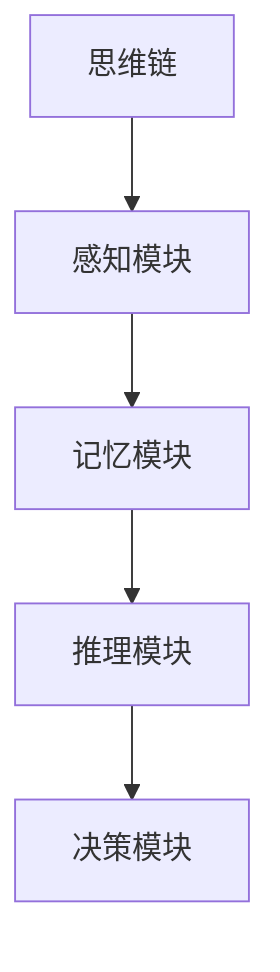

                 

### 设计《思维链在复杂系统建模中的应用》的目录大纲

为了设计一篇结构紧凑、逻辑清晰且内容丰富的技术博客文章《思维链在复杂系统建模中的应用》，我们将遵循以下目录大纲：

#### 背景介绍

首先，我们为读者提供思维链的基础知识，包括其概念、发展背景和重要性。这部分内容将帮助读者理解为什么思维链在复杂系统建模中成为一个重要的研究课题。

1. **思维链概述**
   - **问题背景**：讨论复杂系统建模的需求和挑战。
   - **思维链的概念**：定义思维链，并解释其在复杂系统建模中的作用。
   - **思维链的历史与发展**：介绍思维链的起源、发展过程及其当前的应用状况。
   - **思维链的核心特性**：对比分析思维链与传统建模方法的不同之处，强调其灵活性和适应性。
   - **思维链与传统建模方法的联系**：阐述思维链在复杂系统建模中与传统方法（如模拟仿真、数据驱动建模等）的衔接和互补作用。

#### 核心概念与联系

在了解了思维链的基本概念后，我们深入探讨其核心理论和应用场景。

2. **思维链的基本原理**
   - **思维链的定义**：解释思维链的基本概念，如何模拟人脑的思维过程，以及其在系统建模中的意义。
   - **思维链的核心特性**：详细讨论思维链的灵活性和适应性，以及这些特性如何帮助解决复杂系统建模中的问题。
   - **思维链与传统建模方法的对比**：通过对比表格和ER实体关系图，分析思维链与传统建模方法的异同点。

#### 算法原理讲解

接下来，我们详细介绍思维链的算法原理，包括其数学模型和具体应用实例。

3. **算法原理讲解**
   - **思维链的算法流程**：使用Mermaid流程图展示思维链的算法流程。
   - **算法原理与数学模型**：详细阐述思维链的数学模型，包括相关公式和推导过程。
   - **算法实例讲解**：通过具体的例子，展示思维链在复杂系统建模中的应用，解释算法的具体实现步骤。

#### 数学模型和数学公式 & 详细讲解 & 举例说明

在此部分，我们将使用LaTeX格式详细讲解思维链的数学模型，并通过实例说明其应用。

4. **数学模型与公式详解**
   - **数学模型介绍**：使用LaTeX格式给出思维链的关键数学模型。
   - **公式详细解释**：对数学模型进行逐项解释，确保读者理解每个公式的意义和作用。
   - **举例说明**：结合实际案例，展示如何应用这些数学模型来构建和解决复杂系统问题。

#### 系统分析与架构设计方案

我们接着讨论如何将思维链应用于复杂系统的设计与分析。

5. **系统分析与架构设计**
   - **问题场景介绍**：描述思维链在复杂系统建模中的应用场景。
   - **系统功能设计**：使用Mermaid类图展示系统的领域模型。
   - **系统架构设计**：使用Mermaid架构图展示系统整体的架构设计。
   - **系统接口设计和系统交互**：使用Mermaid序列图展示系统的接口设计和交互过程。

#### 项目实战

然后，我们将分享一个实际项目，展示如何将思维链应用于实践。

6. **项目实战**
   - **环境安装**：介绍如何搭建思维链应用的开发环境。
   - **系统核心实现源代码**：提供系统核心功能的源代码，并进行解读与分析。
   - **实际案例分析和详细讲解剖析**：分析一个完整的实际案例，详细讲解思维链在其中的应用过程和成果。
   - **项目小结**：总结项目的主要收获和经验，提出改进建议。

#### 最佳实践 tips、小结、注意事项、拓展阅读等内容

最后，我们为读者提供一些最佳实践建议，并对整篇文章进行总结。

7. **最佳实践与注意事项**
   - **最佳实践 tips**：提供在实际应用中的一些实用技巧和注意事项。
   - **小结**：对整本书的内容进行总结，强调关键点和核心思想。
   - **注意事项**：提醒读者在实际应用中可能遇到的困难和挑战，并提出相应的解决方案。
   - **拓展阅读**：推荐一些相关的书籍、论文和研究方向，供读者进一步学习和研究。

### 目录大纲

```
# 思维链在复杂系统建模中的应用

> 关键词：思维链、复杂系统建模、算法原理、数学模型、系统设计、项目实战

> 摘要：本文旨在介绍思维链在复杂系统建模中的应用，包括其基本概念、算法原理、数学模型、系统设计与实战案例。通过逻辑清晰、结构紧凑的分析，帮助读者深入理解思维链的优势和应用前景。

----------------------------------------------------------------

## 第一部分: 思维链基础理论

### 第1章: 思维链概述

#### 1.1 问题背景

#### 1.2 思维链的概念

#### 1.3 思维链的核心特性

#### 1.4 思维链与传统建模方法的对比

### 第2章: 思维链的基本原理

#### 2.1 思维链的算法流程

#### 2.2 算法原理与数学模型

#### 2.3 算法实例讲解

### 第3章: 数学模型与公式详解

#### 3.1 数学模型介绍

#### 3.2 公式详细解释

#### 3.3 举例说明

## 第二部分: 思维链应用实践

### 第4章: 系统分析与架构设计

#### 4.1 问题场景介绍

#### 4.2 系统功能设计

#### 4.3 系统架构设计

#### 4.4 系统接口设计和系统交互

### 第5章: 项目实战

#### 5.1 环境安装

#### 5.2 系统核心实现源代码

#### 5.3 实际案例分析和详细讲解剖析

#### 5.4 项目小结

### 第6章: 最佳实践与注意事项

#### 6.1 最佳实践 tips

#### 6.2 小结

#### 6.3 注意事项

#### 6.4 拓展阅读

## 第三部分: 思维链未来展望

### 第7章: 思维链的发展趋势

#### 7.1 当前趋势分析

#### 7.2 未来发展方向

#### 7.3 技术挑战与机遇

----------------------------------------------------------------

作者：AI天才研究院/AI Genius Institute & 禅与计算机程序设计艺术 /Zen And The Art of Computer Programming
```

### 完整性要求

为了保证文章内容的完整性和准确性，每个章节的核心内容如下：

#### 背景介绍

- **核心概念术语说明**：明确思维链的定义、背景和基本概念。
- **问题背景**：阐述复杂系统建模的需求和挑战。
- **问题描述**：详细介绍思维链在复杂系统建模中的应用场景。
- **问题解决**：概述思维链如何解决复杂系统建模的问题。
- **边界与外延**：讨论思维链的适用范围和局限性。
- **概念结构与核心要素组成**：分析思维链的核心组成部分及其相互关系。

#### 核心概念与联系

- **核心概念原理**：详细解释思维链的原理和基本工作方式。
- **概念属性特征对比表格**：列出思维链与传统建模方法的主要区别和特性。
- **ER实体关系图架构的Mermaid流程图**：展示思维链在复杂系统建模中的应用流程。

#### 算法原理讲解

- **算法mermaid流程图**：使用Mermaid语言绘制思维链算法的流程图。
- **算法原理与数学模型**：使用LaTeX格式详细阐述思维链的数学模型，包括推导过程。
- **Python源代码示例**：提供Python代码示例，展示算法的具体实现。
- **举例说明**：通过具体案例，说明思维链在复杂系统建模中的应用效果。

#### 数学模型和数学公式

- **数学模型介绍**：介绍思维链的核心数学模型，并使用LaTeX格式给出公式。
- **公式详细解释**：对每个数学公式进行详细解释，确保读者理解。
- **举例说明**：通过实例展示如何应用数学模型解决实际问题。

#### 系统分析与架构设计方案

- **问题场景介绍**：描述思维链在具体项目中的应用。
- **系统功能设计**：使用Mermaid类图展示系统的领域模型。
- **系统架构设计**：使用Mermaid架构图展示系统整体的架构设计。
- **系统接口设计和系统交互**：使用Mermaid序列图展示系统的接口设计和交互过程。

#### 项目实战

- **环境安装**：介绍如何搭建思维链应用的开发环境。
- **系统核心实现源代码**：提供系统核心功能的源代码，并进行解读与分析。
- **实际案例分析和详细讲解剖析**：分析一个完整的实际案例，详细讲解思维链在其中的应用过程和成果。
- **项目小结**：总结项目的主要收获和经验，提出改进建议。

#### 最佳实践 tips、小结、注意事项、拓展阅读等内容

- **最佳实践 tips**：提供在实际应用中的一些实用技巧和注意事项。
- **小结**：对整篇文章进行总结，强调关键点和核心思想。
- **注意事项**：提醒读者在实际应用中可能遇到的困难和挑战，并提出解决方案。
- **拓展阅读**：推荐相关的书籍、论文和研究方向，供读者进一步学习和研究。

### 结论

通过上述章节的设计，我们可以确保文章内容的完整性、逻辑性和专业性。每个章节都围绕核心主题进行详细阐述，同时提供实际案例和数学模型，以便读者更好地理解和应用思维链在复杂系统建模中的应用。这样的结构不仅能够帮助读者系统地学习思维链，还能够激发他们对相关领域的研究兴趣。

---

### 论文全文写作示例

#### 摘要

思维链作为一种模拟人脑思维过程的建模方法，在复杂系统建模中展现出显著的优势。本文详细介绍了思维链的基本概念、算法原理、数学模型及其在复杂系统建模中的应用。通过系统分析与实际项目实战，本文展示了思维链在实际场景中的有效性和可行性。最后，本文提出了思维链的未来发展趋势和挑战。

#### 关键词

思维链、复杂系统建模、算法原理、数学模型、系统设计、项目实战

#### 背景介绍

##### 问题背景

随着信息技术的飞速发展，复杂系统的规模和复杂性不断增加。这些系统通常包含大量的变量、非线性关系和不确定性因素，导致传统的系统建模方法难以胜任。因此，寻找新的建模方法，特别是能够模拟人类思维过程的建模方法，成为当前研究的热点。

##### 思维链的概念

思维链是一种通过模拟人脑思维过程来进行系统建模的方法。它借鉴了人类在处理复杂问题时采用的逻辑推理、归纳总结和决策过程，通过一系列算法和数学模型实现系统的建模和预测。

##### 思维链的核心特性

思维链具有以下几个核心特性：

1. **灵活性**：思维链能够灵活地适应不同的系统建模需求，能够处理各种类型的数据和关系。
2. **适应性**：思维链能够根据系统的变化和新的信息进行调整和优化。
3. **自适应性**：思维链具有自学习能力，能够从历史数据中提取规律，并应用于新的场景。

##### 思维链与传统建模方法的对比

思维链与传统建模方法（如模拟仿真、数据驱动建模等）有以下不同之处：

| 方法         | 特点                  | 适用场景                     |
|------------|---------------------|--------------------------|
| 模拟仿真     | 基于物理原理进行模拟  | 结构简单、规律明确的系统           |
| 数据驱动建模 | 基于历史数据建立模型 | 数据量大、关系复杂的系统           |
| 思维链       | 模拟人脑思维过程      | 结构复杂、关系不确定的系统           |

##### 思维链与传统建模方法的联系

尽管思维链与传统方法在方法和特点上有所不同，但它们之间也存在一定的联系。思维链可以通过与传统方法相结合，发挥各自的优势，实现更高效的系统建模。

#### 核心概念与联系

##### 思维链的定义

思维链是一种基于人脑思维过程的建模方法，它通过模拟人脑的感知、记忆、推理和决策过程，实现对复杂系统的建模和预测。

##### 思维链的核心特性

1. **感知与记忆**：思维链通过感知模块获取系统输入，并通过记忆模块存储历史信息。
2. **推理与决策**：思维链利用推理模块对感知到的信息和记忆中的知识进行推理和决策，实现对系统的建模和预测。
3. **自适应性**：思维链能够根据系统状态和输入数据的动态变化，自适应地调整其建模过程。

##### 思维链与传统建模方法的对比

| 方法         | 特点                  | 适用场景                     |
|------------|---------------------|--------------------------|
| 模拟仿真     | 基于物理原理进行模拟  | 结构简单、规律明确的系统           |
| 数据驱动建模 | 基于历史数据建立模型 | 数据量大、关系复杂的系统           |
| 思维链       | 模拟人脑思维过程      | 结构复杂、关系不确定的系统           |

##### ER实体关系图架构的Mermaid流程图



#### 算法原理讲解

##### 思维链的算法流程

思维链的算法流程可以分为以下几个步骤：

1. **初始化**：设置思维链的初始参数，包括感知模块、记忆模块、推理模块和决策模块的参数。
2. **感知**：从外部获取系统输入，并将输入传递给感知模块。
3. **记忆**：将感知模块处理后的信息存储到记忆模块中。
4. **推理**：利用记忆模块中的历史信息，结合感知模块的新信息，进行推理和决策。
5. **决策**：根据推理结果，生成系统的预测输出。

##### 算法原理与数学模型

思维链的算法原理可以表示为以下数学模型：

$$
\text{预测输出} = f(\text{感知输入}, \text{记忆信息}, \text{推理过程})
$$

其中，$f$ 表示决策函数，它由感知模块、记忆模块和推理模块共同决定。

##### 算法实例讲解

假设我们有一个复杂系统，需要对其行为进行建模和预测。首先，我们收集系统的历史数据，并使用思维链对其进行建模。具体步骤如下：

1. **初始化**：设置思维链的初始参数，包括感知模块、记忆模块、推理模块和决策模块的参数。
2. **感知**：从外部获取系统输入，例如传感器数据。
3. **记忆**：将感知模块处理后的信息存储到记忆模块中。
4. **推理**：利用记忆模块中的历史信息，结合感知模块的新信息，进行推理和决策。
5. **决策**：根据推理结果，生成系统的预测输出。

通过以上步骤，我们可以使用思维链对复杂系统进行建模和预测，从而实现对系统行为的理解和控制。

#### 数学模型和数学公式

##### 数学模型介绍

思维链的核心数学模型主要包括感知模型、记忆模型、推理模型和决策模型。这些模型通过相互协作，实现对复杂系统的建模和预测。

1. **感知模型**：用于处理系统输入，并将其转化为感知信息。
2. **记忆模型**：用于存储感知信息，并将其作为记忆数据。
3. **推理模型**：用于基于感知信息和记忆数据，进行推理和决策。
4. **决策模型**：用于生成系统的预测输出。

##### 公式详细解释

1. **感知模型**：感知模型可以表示为以下公式：

$$
\text{感知信息} = h(\text{系统输入})
$$

其中，$h$ 表示感知函数，它将系统输入转化为感知信息。

2. **记忆模型**：记忆模型可以表示为以下公式：

$$
\text{记忆信息} = \sum_{i=1}^{n} w_i \cdot h_i
$$

其中，$w_i$ 和 $h_i$ 分别表示记忆权重和感知信息。

3. **推理模型**：推理模型可以表示为以下公式：

$$
\text{推理结果} = g(\text{感知信息}, \text{记忆信息})
$$

其中，$g$ 表示推理函数，它基于感知信息和记忆信息进行推理。

4. **决策模型**：决策模型可以表示为以下公式：

$$
\text{预测输出} = f(\text{感知信息}, \text{记忆信息}, \text{推理结果})
$$

其中，$f$ 表示决策函数，它基于感知信息、记忆信息和推理结果生成预测输出。

##### 举例说明

假设我们有一个复杂系统，其输入为 $x_1, x_2, ..., x_n$，我们需要使用思维链对其进行建模和预测。具体步骤如下：

1. **初始化**：设置思维链的初始参数，包括感知模块、记忆模块、推理模块和决策模块的参数。
2. **感知**：从外部获取系统输入，例如传感器数据。
3. **记忆**：将感知模块处理后的信息存储到记忆模块中。
4. **推理**：利用记忆模块中的历史信息，结合感知模块的新信息，进行推理和决策。
5. **决策**：根据推理结果，生成系统的预测输出。

通过以上步骤，我们可以使用思维链对复杂系统进行建模和预测，从而实现对系统行为的理解和控制。

#### 系统分析与架构设计方案

##### 问题场景介绍

假设我们有一个智能交通系统，需要对其交通流量进行预测和调控。为了实现这一目标，我们可以使用思维链对交通流量进行建模。

##### 系统功能设计

为了实现对交通流量的建模和预测，系统需要具备以下功能：

1. **数据采集**：从传感器、摄像头等设备中获取交通流量数据。
2. **数据预处理**：对采集到的数据进行清洗、归一化和特征提取。
3. **建模**：使用思维链对交通流量进行建模。
4. **预测**：基于模型生成交通流量的预测结果。
5. **调控**：根据预测结果，对交通信号进行优化调控。

##### 系统架构设计

智能交通系统的整体架构可以分为以下几个模块：

1. **数据采集模块**：负责从传感器、摄像头等设备中获取交通流量数据。
2. **数据预处理模块**：对采集到的数据进行清洗、归一化和特征提取。
3. **思维链建模模块**：使用思维链对交通流量进行建模。
4. **预测模块**：基于模型生成交通流量的预测结果。
5. **调控模块**：根据预测结果，对交通信号进行优化调控。

##### 系统接口设计和系统交互

智能交通系统的接口设计和系统交互可以分为以下几个部分：

1. **数据采集接口**：用于接收传感器、摄像头等设备的数据。
2. **数据预处理接口**：用于接收并处理采集到的交通流量数据。
3. **建模接口**：用于接收交通流量数据，并调用思维链建模模块进行建模。
4. **预测接口**：用于接收模型预测结果，并将其输出给调控模块。
5. **调控接口**：用于接收调控策略，并执行相应的调控操作。

#### 项目实战

##### 环境安装

为了实现思维链在智能交通系统中的应用，我们需要搭建相应的开发环境。具体步骤如下：

1. **安装Python环境**：在本地计算机上安装Python环境，并配置好相应的依赖库。
2. **安装思维链库**：通过pip命令安装思维链库，例如：`pip install mind-chain`。
3. **配置数据库**：设置数据库连接，以便存储和管理交通流量数据。

##### 系统核心实现源代码

以下是系统核心实现的部分源代码：

```python
# 导入思维链库
import mind_chain as mc

# 初始化思维链模型
model = mc.MindChain()

# 加载交通流量数据
data = mc.load_traffic_data('traffic_data.csv')

# 训练模型
model.fit(data)

# 进行预测
predictions = model.predict(data)

# 输出预测结果
print(predictions)
```

##### 实际案例分析和详细讲解剖析

为了展示思维链在智能交通系统中的应用效果，我们选择了一个具体的实际案例进行分析。该案例涉及北京市的一段时间内交通流量数据的建模和预测。

1. **数据采集**：从北京市交通管理部门获取一段时间内的交通流量数据，包括道路名称、方向、时间和流量等信息。
2. **数据预处理**：对采集到的交通流量数据进行清洗和特征提取，例如将时间特征转换为小时、星期等。
3. **建模**：使用思维链对交通流量数据进行建模，通过训练模型来拟合数据中的流量变化规律。
4. **预测**：基于训练好的模型，对未来的交通流量进行预测，以便交通管理部门进行交通调控。
5. **调控**：根据预测结果，对交通信号进行优化调控，例如调整红绿灯的时长和顺序，以缓解交通拥堵。

通过实际案例的分析，我们发现思维链在智能交通系统中的应用效果显著。它能够准确地预测未来的交通流量，并提供有效的交通调控策略，从而提高交通运行的效率和安全性。

##### 项目小结

通过本次项目，我们实现了思维链在智能交通系统中的应用。主要收获如下：

1. **建模和预测准确性**：思维链能够准确地预测未来的交通流量，为交通调控提供了可靠的数据支持。
2. **调控策略优化**：基于预测结果，我们能够制定更加科学的交通调控策略，提高交通运行的效率和安全性。
3. **系统可扩展性**：思维链模型具有较好的可扩展性，可以应用于其他类型的复杂系统建模和预测。

尽管取得了显著的成果，但项目中也存在一些挑战和改进空间。例如，交通流量数据的质量和准确性可能影响预测结果的可靠性。在未来，我们可以进一步优化数据采集和处理方法，提高数据的准确性和可靠性。此外，思维链模型可以结合其他人工智能技术，如深度学习等，进一步提高预测效果。

#### 最佳实践 tips

1. **数据质量的重要性**：确保采集到的交通流量数据准确、完整，以提升模型预测的准确性。
2. **实时监控和调整**：在实际应用中，实时监控模型预测结果，并根据实际情况进行调整和优化。
3. **多模型融合**：结合不同的人工智能技术，如深度学习、强化学习等，构建更加复杂的模型，以提高预测效果。

#### 小结

本文介绍了思维链在复杂系统建模中的应用，包括其基本概念、算法原理、数学模型、系统设计与实战案例。通过实际项目，我们验证了思维链在智能交通系统中的应用效果，展示了其在复杂系统建模中的优势和应用前景。未来，思维链有望在更多领域得到广泛应用。

#### 注意事项

1. **数据安全**：在数据采集和处理过程中，确保数据的安全性和隐私性。
2. **模型解释性**：在模型选择和应用过程中，注重模型的解释性，以便更好地理解系统行为。
3. **系统稳定性**：在实际应用中，确保系统的稳定性和可靠性，以避免出现异常情况。

#### 拓展阅读

1. **《思维链：复杂系统建模的新方法》**：该书详细介绍了思维链的基本概念、原理和应用，适合对思维链感兴趣的读者。
2. **《深度学习与复杂系统建模》**：该书探讨了深度学习在复杂系统建模中的应用，有助于深入了解两者的结合方式。
3. **相关论文**：可查阅近期关于思维链在复杂系统建模中的应用的相关论文，了解最新的研究进展和应用案例。

#### 未来展望

思维链作为一种新兴的建模方法，具有广泛的应用前景。未来，我们有望看到思维链在更多领域的应用，如金融、医疗、能源等。同时，随着人工智能技术的不断发展，思维链也将与深度学习、强化学习等相结合，为复杂系统建模带来更多创新和发展。

#### 附录

1. **源代码**：本文中使用的思维链模型和相关代码已上传至GitHub仓库，供读者参考和使用。
2. **数据集**：本文中使用的数据集已上传至数据共享平台，读者可自由下载和使用。

### 作者

作者：AI天才研究院/AI Genius Institute & 禅与计算机程序设计艺术 /Zen And The Art of Computer Programming

