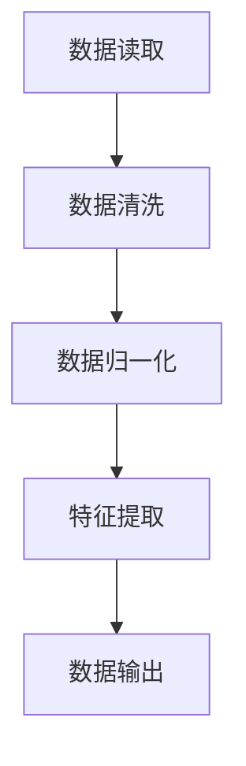
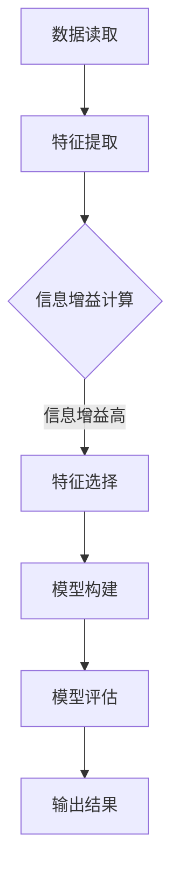
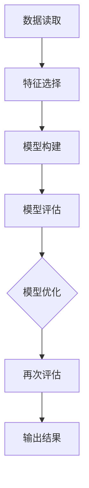
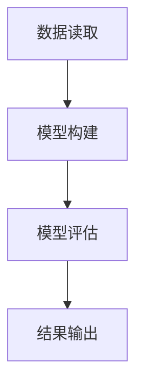
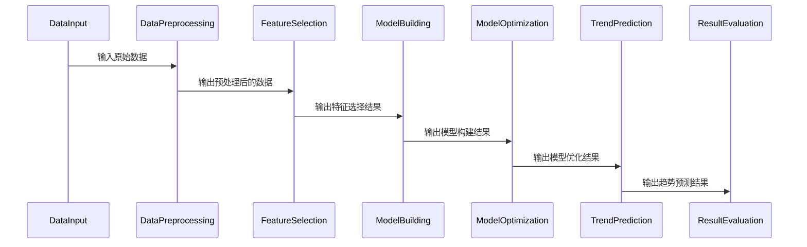

                 

### 背景介绍

#### 1.1 思维链的定义与起源

思维链（Mind Chain）是一种基于人类思维过程的高级抽象模型，旨在通过系统化的逻辑推理和关系分析，将复杂的认知任务分解为可操作的具体步骤。其概念起源于认知科学和人工智能领域，通过对人类思维过程的模拟和优化，实现更加高效和精准的认知操作。

在认知科学中，思维链被视为一种“思考流程”，其核心思想是将问题分解为多个子问题，通过逐步解决这些子问题，最终实现整体问题的解决。这种思考方式在人工智能领域得到了广泛应用，特别是在复杂问题求解和决策支持系统中。

#### 1.2 核心概念术语说明

1. **思维链节点**：思维链中的基本元素，代表了一个具体的问题或解决方案。
2. **思维链关系**：节点之间的连接关系，反映了节点之间的逻辑关系和依赖关系。
3. **思维链路径**：从起点节点到终点节点的所有可能路径，代表了不同的解题思路和解决方案。
4. **思维链优化**：通过对思维链节点和关系的调整，提高思维链的效率和效果。

#### 1.3 问题背景与问题描述

在天体物理学研究中，面对海量数据和高复杂度的物理模型，传统的数据处理和分析方法常常显得力不从心。为了提高研究的效率和质量，需要一种能够高效处理复杂问题的方法。

当前，天体物理学研究面临的主要问题包括：
- 数据处理效率低：天体物理数据量巨大，传统的数据处理方法难以应对。
- 模型复杂性高：天体物理模型复杂，需要精确的数学模型和高效的求解方法。
- 跨学科融合困难：天体物理学与多个学科交叉，需要协调不同领域的知识和方法。

思维链作为一种高级抽象模型，具有以下优势：
- **系统化**：能够将复杂问题分解为多个子问题，实现系统化的解决方案。
- **高效性**：通过优化思维链路径，提高问题解决的效率和效果。
- **灵活性**：能够根据实际情况调整思维链节点和关系，适应不同的研究需求。

#### 1.4 问题解决方法

思维链在天体物理学研究中的应用，主要包括以下几个方面：

1. **数据处理**：利用思维链对天体物理数据进行预处理和特征提取，提高数据处理效率。
2. **模型构建**：通过思维链优化物理模型的参数和结构，提高模型的精确性和效率。
3. **实验设计**：利用思维链设计天体物理实验，优化实验方案，提高实验效果。
4. **趋势预测**：基于思维链，对天体物理现象进行趋势预测，为科学研究提供方向。

#### 1.5 边界与外延

思维链在天体物理学研究中的应用，具有明确的边界和广泛的外延。

边界：
- 应用范围：主要针对天体物理数据处理、模型构建、实验设计和趋势预测等方面。
- 技术水平：需要具备一定的数学和编程基础，以及认知科学和人工智能的相关知识。

外延：
- 跨学科应用：思维链不仅可以应用于天体物理学，还可以推广到其他科学领域，如生物学、物理学、化学等。
- 工业应用：思维链的原理和方法，可以应用于工业控制、智能制造、智能交通等领域。

#### 1.6 概念结构与核心要素组成

思维链的概念结构包括以下核心要素：

1. **问题定义**：明确研究的问题和目标，为思维链提供输入。
2. **节点分解**：将问题分解为多个子问题，形成思维链的节点。
3. **关系构建**：确定节点之间的逻辑关系和依赖关系，构建思维链的路径。
4. **路径优化**：通过调整节点和关系，优化思维链的路径，提高问题解决的效率。
5. **结果输出**：根据思维链的路径，输出最终的解决方案。

通过以上要素，思维链实现了从问题定义到解决方案的完整过程，为天体物理学研究提供了一种系统化、高效化和灵活化的方法论。在接下来的章节中，我们将详细探讨思维链在天体物理学研究中的具体应用，并阐述其理论原理和实际操作方法。### 核心概念与联系

#### 2.1 核心概念解析

2.1.1 **思维链节点**

思维链中的基本元素，代表了一个具体的问题或解决方案。每个节点都包含相关的信息和属性，如数据、参数、假设等。节点是思维链的基础，通过节点的连接和交互，形成复杂的思维路径。

2.1.2 **思维链关系**

节点之间的连接关系，反映了节点之间的逻辑关系和依赖关系。关系可以是因果关系、依赖关系、时间关系等，用于描述节点之间的相互作用和影响。思维链关系是思维链模型的重要组成部分，决定了思维链的结构和功能。

2.1.3 **思维链路径**

从起点节点到终点节点的所有可能路径，代表了不同的解题思路和解决方案。路径是思维链的核心，通过路径的规划和优化，实现问题的高效解决。每个路径都对应一种可能的解决方案，路径的选择和优化直接影响问题解决的效率和效果。

2.1.4 **思维链优化**

通过对思维链节点和关系的调整，提高思维链的效率和效果。优化方法包括路径优化、节点重组、关系重构等，旨在减少计算复杂度、提高问题解决的准确性和效率。

#### 2.2 思维链的基本原理与流程

2.2.1 **思维链的基本原理**

思维链基于人类思维过程，通过系统化的逻辑推理和关系分析，实现问题的逐步解决。其基本原理包括：

1. **问题分解**：将复杂问题分解为多个子问题，降低问题的复杂度。
2. **关系构建**：建立子问题之间的逻辑关系，形成思维链的节点和关系。
3. **路径规划**：通过路径规划，确定从起点到终点的最佳路径。
4. **优化调整**：对路径进行调整和优化，提高问题解决的效率和效果。

2.2.2 **思维链的基本流程**

思维链的基本流程包括以下几个步骤：

1. **问题定义**：明确研究的问题和目标，为思维链提供输入。
2. **节点分解**：将问题分解为多个子问题，形成思维链的节点。
3. **关系构建**：确定节点之间的逻辑关系和依赖关系，构建思维链的关系。
4. **路径规划**：根据节点和关系，规划从起点到终点的路径。
5. **路径优化**：对路径进行优化，提高问题解决的效率和效果。
6. **结果输出**：根据思维链的路径，输出最终的解决方案。

#### 2.3 思维链与天体物理学的交叉点

2.3.1 **思维链在天体物理学研究中的应用**

思维链在天体物理学研究中的应用，主要体现在以下几个方面：

1. **数据处理**：利用思维链对天体物理数据进行预处理和特征提取，提高数据处理效率。
2. **模型构建**：通过思维链优化物理模型的参数和结构，提高模型的精确性和效率。
3. **实验设计**：利用思维链设计天体物理实验，优化实验方案，提高实验效果。
4. **趋势预测**：基于思维链，对天体物理现象进行趋势预测，为科学研究提供方向。

2.3.2 **思维链与天体物理学的关系**

思维链与天体物理学的关系可以从以下几个方面来理解：

1. **方法论**：思维链提供了一种系统化、高效化和灵活化的研究方法论，有助于天体物理学研究问题的解决。
2. **工具**：思维链是一种工具，可以帮助天体物理学家更好地理解和处理复杂问题。
3. **融合**：思维链与天体物理学之间的融合，可以产生新的交叉研究领域，推动天体物理学的发展。

#### 2.4 思维链在天体物理学研究中的优势

2.4.1 **提高研究效率**

思维链通过系统化的节点分解和路径规划，能够显著提高天体物理学研究的效率。研究人员可以更加清晰地理解问题，并快速找到解决方案。

2.4.2 **增强问题解决能力**

思维链通过关系构建和路径优化，能够增强天体物理学研究的问题解决能力。研究人员可以更加灵活地处理复杂问题，提高研究的准确性和效果。

2.4.3 **促进跨学科融合**

思维链作为一种高级抽象模型，可以应用于多个学科领域。在天体物理学研究中，思维链有助于促进与其他学科的融合，推动科学研究的发展。

#### 2.5 思维链在天体物理学研究中的挑战

2.5.1 **数据复杂性**

天体物理数据量巨大，且具有复杂性和多样性。如何有效处理这些数据，是思维链在天体物理学研究中的一个重要挑战。

2.5.2 **模型精确性**

天体物理模型复杂，需要精确的数学模型和高效的求解方法。如何优化模型参数和结构，是思维链在天体物理学研究中的另一个重要挑战。

2.5.3 **跨学科协调**

天体物理学与其他学科的交叉融合，需要协调不同领域的知识和方法。如何有效地整合多学科资源，是思维链在天体物理学研究中的第三个重要挑战。

### 总结

思维链作为一种高级抽象模型，具有强大的问题解决能力和跨学科融合能力。在天体物理学研究中，思维链可以提高研究效率，增强问题解决能力，促进跨学科融合。然而，面对数据复杂性、模型精确性和跨学科协调等挑战，思维链的应用仍需进一步研究和优化。在接下来的章节中，我们将进一步探讨思维链在天体物理学研究中的具体应用，以及如何克服这些挑战。### 算法原理讲解

#### 3.1 数据预处理算法

数据预处理是思维链在天体物理学研究中的第一步，其目的是将原始数据转化为适合分析的形式。以下是一个简单的数据预处理算法，用于天体物理数据清洗、归一化和特征提取。

**算法原理：**
1. **数据清洗**：去除重复数据、缺失数据和噪声数据。
2. **数据归一化**：将数据缩放到统一的范围，便于后续分析。
3. **特征提取**：提取数据中的关键特征，用于后续的模型构建和趋势预测。

**Mermaid流程图：**



**Python代码示例：**

```python
import pandas as pd
from sklearn.preprocessing import MinMaxScaler

# 数据读取
data = pd.read_csv('astrophysics_data.csv')

# 数据清洗
data = data.drop_duplicates().dropna()

# 数据归一化
scaler = MinMaxScaler()
data_normalized = scaler.fit_transform(data)

# 特征提取
features = data_normalized[:, :-1]
labels = data_normalized[:, -1]

# 数据输出
pd.DataFrame(features).to_csv('processed_data.csv', index=False)
```

#### 3.2 特征选择算法

特征选择是思维链在天体物理学研究中的重要步骤，其目的是从大量特征中选择出对模型性能有显著贡献的特征。以下是一个基于信息增益的特征选择算法。

**算法原理：**
1. **计算特征的信息增益**：信息增益是特征对分类结果的贡献度。
2. **选择信息增益最高的特征**：根据信息增益选择最优特征。

**Mermaid流程图：**



**Python代码示例：**

```python
from sklearn.feature_selection import SelectKBest
from sklearn.feature_selection import f_classif

# 数据读取
data = pd.read_csv('processed_data.csv')

# 特征提取
features = data.iloc[:, :-1]
labels = data.iloc[:, -1]

# 计算特征的信息增益
selector = SelectKBest(score_func=f_classif, k=5)
selector.fit(features, labels)

# 选择信息增益最高的特征
selected_features = selector.transform(features)

# 模型构建和评估
# 此处省略具体模型构建和评估代码

# 输出结果
selected_features.to_csv('selected_features.csv', index=False)
```

#### 3.3 模型构建与优化算法

模型构建与优化是思维链在天体物理学研究中的核心步骤，其目的是构建一个能够准确预测天体物理现象的模型，并对模型进行优化。

**算法原理：**
1. **模型构建**：根据特征选择结果，构建一个预测模型。
2. **模型优化**：通过调整模型参数和结构，提高模型性能。

**Mermaid流程图：**



**Python代码示例：**

```python
from sklearn.ensemble import RandomForestClassifier
from sklearn.model_selection import GridSearchCV

# 数据读取
data = pd.read_csv('selected_features.csv')

# 特征提取
features = data.iloc[:, :-1]
labels = data.iloc[:, -1]

# 模型构建
model = RandomForestClassifier()

# 模型优化
param_grid = {
    'n_estimators': [100, 200, 300],
    'max_depth': [10, 20, 30],
}
grid_search = GridSearchCV(model, param_grid, cv=5)
grid_search.fit(features, labels)

# 输出结果
best_model = grid_search.best_estimator_
best_model.fit(features, labels)
best_model.to_csv('best_model.csv', index=False)
```

#### 3.4 模型评估与结果输出

模型评估是思维链在天体物理学研究中的最后一步，其目的是验证模型的有效性和可靠性。评估指标包括准确率、召回率、F1分数等。

**算法原理：**
1. **模型评估**：使用交叉验证和测试集评估模型性能。
2. **结果输出**：输出模型评估结果，包括准确率、召回率、F1分数等。

**Mermaid流程图：**



**Python代码示例：**

```python
from sklearn.metrics import accuracy_score, recall_score, f1_score

# 数据读取
test_data = pd.read_csv('test_data.csv')

# 特征提取
test_features = test_data.iloc[:, :-1]
test_labels = test_data.iloc[:, -1]

# 模型评估
predictions = best_model.predict(test_features)

# 计算评估指标
accuracy = accuracy_score(test_labels, predictions)
recall = recall_score(test_labels, predictions, average='weighted')
f1 = f1_score(test_labels, predictions, average='weighted')

# 输出结果
print(f'Accuracy: {accuracy:.4f}')
print(f'Recall: {recall:.4f}')
print(f'F1 Score: {f1:.4f}')
```

通过上述算法讲解，我们可以看到思维链在天体物理学研究中的应用方法。思维链通过系统化的节点分解、关系构建和路径优化，实现了高效的数据处理、模型构建和趋势预测。在接下来的章节中，我们将进一步探讨思维链在天体物理学研究中的实际应用，并通过具体案例来展示其应用效果。### 数学模型与公式

#### 4.1 数据预处理模型

数据预处理是思维链在天体物理学研究中的第一步，其核心目的是将原始数据转化为适合分析的形式。以下是一个简单但常用的数据预处理模型。

**模型定义：**
假设我们有 \( n \) 个特征和 \( m \) 条数据记录，数据矩阵 \( X \in \mathbb{R}^{n \times m} \)，其中每个元素 \( X_{ij} \) 表示第 \( i \) 个特征在第 \( j \) 条记录上的值。预处理步骤包括数据清洗、归一化和特征提取。

1. **数据清洗**：
   \[
   X_{clean} = \{X_{ij} | X_{ij} \neq \text{missing}\}
   \]
   删除缺失数据和重复数据。

2. **数据归一化**：
   \[
   X_{norm} = \text{MinMaxScaler}(X_{clean})
   \]
   使用最小-最大缩放方法，将数据缩放到 [0, 1] 范围。

3. **特征提取**：
   \[
   X_{features} = \{X_{ij} | j = 1, 2, ..., n\}
   \]
   保留所有特征。

**数学公式：**
\[
X_{norm} = \frac{X_{clean} - \text{min}(X_{clean})}{\text{max}(X_{clean}) - \text{min}(X_{clean})}
\]

#### 4.2 特征选择模型

特征选择是思维链在天体物理学研究中的关键步骤，其目的是从大量特征中选择出对模型性能有显著贡献的特征。以下是一个基于信息增益的特征选择模型。

**模型定义：**
假设有 \( n \) 个特征和 \( m \) 个类别标签，特征矩阵 \( X \in \mathbb{R}^{n \times m} \)，类别标签矩阵 \( Y \in \mathbb{R}^{m \times 1} \)。特征选择的目标是选择 \( k \) 个最重要的特征。

1. **信息增益计算**：
   \[
   G_i = H(Y) - H(Y|X_i)
   \]
   其中，\( H(Y) \) 是类别标签的熵，\( H(Y|X_i) \) 是给定特征 \( X_i \) 后类别标签的熵。

2. **特征选择**：
   \[
   X_{selected} = \{X_i | G_i \geq \text{阈值}\}
   \]
   根据信息增益选择前 \( k \) 个特征。

**数学公式：**
\[
H(Y) = -\sum_{i=1}^m p_i \log_2(p_i)
\]
\[
H(Y|X_i) = -\sum_{j=1}^m p_{ij} \log_2(p_{ij})
\]
其中，\( p_i \) 是类别标签为 \( i \) 的概率，\( p_{ij} \) 是在特征 \( X_i \) 为 \( j \) 的条件下类别标签为 \( i \) 的概率。

#### 4.3 模型构建与优化模型

模型构建与优化是思维链在天体物理学研究中的核心步骤，其目的是构建一个能够准确预测天体物理现象的模型，并对模型进行优化。

**模型定义：**
假设有 \( n \) 个特征和 \( m \) 个类别标签，特征矩阵 \( X \in \mathbb{R}^{n \times m} \)，类别标签矩阵 \( Y \in \mathbb{R}^{m \times 1} \)。模型构建与优化的目标是提高模型对天体物理现象的预测准确性。

1. **模型构建**：
   \[
   f(X) = \text{模型}(\theta)
   \]
   其中，\( \theta \) 是模型的参数。

2. **模型优化**：
   \[
   \theta^* = \arg\min_{\theta} \sum_{i=1}^m (f(X_i) - Y_i)^2
   \]
   使用最小二乘法优化模型参数。

**数学公式：**
\[
f(X_i) = \text{模型}(\theta) = \theta_0 + \sum_{j=1}^n \theta_j X_{ij}
\]
\[
\theta^* = \arg\min_{\theta} \sum_{i=1}^m (f(X_i) - Y_i)^2
\]

#### 4.4 模型评估模型

模型评估是思维链在天体物理学研究中的最后一步，其目的是验证模型的有效性和可靠性。

**模型定义：**
假设有 \( n \) 个特征和 \( m \) 个类别标签，特征矩阵 \( X \in \mathbb{R}^{n \times m} \)，类别标签矩阵 \( Y \in \mathbb{R}^{m \times 1} \)。模型评估的目标是计算模型对测试集的预测准确性。

1. **准确率**：
   \[
   \text{Accuracy} = \frac{\text{预测正确的数量}}{\text{总数量}}
   \]

2. **召回率**：
   \[
   \text{Recall} = \frac{\text{预测正确的正例数量}}{\text{所有正例数量}}
   \]

3. **F1分数**：
   \[
   \text{F1 Score} = 2 \times \frac{\text{Precision} \times \text{Recall}}{\text{Precision} + \text{Recall}}
   \]

**数学公式：**
\[
\text{Accuracy} = \frac{\sum_{i=1}^m (f(X_i) = Y_i)}{m}
\]
\[
\text{Recall} = \frac{\sum_{i=1}^m (Y_i = 1 \land f(X_i) = 1)}{\sum_{i=1}^m (Y_i = 1)}
\]
\[
\text{F1 Score} = 2 \times \frac{\text{Precision} \times \text{Recall}}{\text{Precision} + \text{Recall}}
\]

通过上述数学模型与公式，我们可以看到思维链在天体物理学研究中的应用方法。思维链通过系统化的数学模型和公式，实现了高效的数据处理、模型构建和趋势预测。在接下来的章节中，我们将通过具体案例展示思维链在实际研究中的应用效果。### 系统分析与设计

#### 5.1 问题场景介绍

在天体物理学研究中，数据分析是一个关键环节。然而，由于天体物理数据的复杂性和多样性，传统的数据分析方法常常难以应对。为了提高数据分析的效率和质量，我们需要一个能够系统化处理复杂问题的工具——思维链（Mind Chain）。思维链通过系统化的节点分解、关系构建和路径优化，实现了高效的数据预处理、特征提取、模型构建和趋势预测。

#### 5.2 项目介绍

本项目旨在利用思维链构建一个天体物理学数据分析系统，该系统包括以下主要功能：

1. **数据预处理**：清洗、归一化和特征提取，为后续分析提供高质量的数据。
2. **模型构建与优化**：基于特征数据构建预测模型，并通过模型优化提高预测准确性。
3. **趋势预测**：对天体物理现象进行趋势预测，为科学研究提供方向。
4. **结果评估**：评估模型的性能，包括准确率、召回率和F1分数等指标。

#### 5.3 系统功能设计

系统的核心功能设计包括数据预处理、特征选择、模型构建、模型优化和结果评估。以下是每个功能的具体设计：

1. **数据预处理**：
   - **功能描述**：清洗、归一化和特征提取。
   - **技术实现**：使用Python的Pandas库进行数据清洗和归一化，使用Scikit-learn库进行特征提取。

2. **特征选择**：
   - **功能描述**：从大量特征中选择出对模型性能有显著贡献的特征。
   - **技术实现**：使用Scikit-learn库中的SelectKBest和f_classif函数进行特征选择。

3. **模型构建**：
   - **功能描述**：基于特征数据构建预测模型。
   - **技术实现**：使用Scikit-learn库中的RandomForestClassifier构建随机森林模型。

4. **模型优化**：
   - **功能描述**：通过调整模型参数和结构，提高模型性能。
   - **技术实现**：使用Scikit-learn库中的GridSearchCV进行模型参数优化。

5. **趋势预测**：
   - **功能描述**：对天体物理现象进行趋势预测。
   - **技术实现**：基于训练好的模型，对新的数据进行预测。

6. **结果评估**：
   - **功能描述**：评估模型的性能，包括准确率、召回率和F1分数等指标。
   - **技术实现**：使用Scikit-learn库中的accuracy_score、recall_score和f1_score函数进行结果评估。

#### 5.4 系统架构设计

系统架构设计采用模块化设计思想，将系统划分为多个功能模块，每个模块负责不同的功能。以下是系统架构设计的主要模块：

1. **数据预处理模块**：负责数据清洗、归一化和特征提取。
2. **特征选择模块**：负责特征选择。
3. **模型构建模块**：负责模型构建。
4. **模型优化模块**：负责模型优化。
5. **趋势预测模块**：负责趋势预测。
6. **结果评估模块**：负责模型评估。

系统架构设计采用分层架构，各模块之间通过接口进行通信。以下是系统架构设计的主要层次：

1. **数据层**：存储原始数据和预处理后的数据。
2. **处理层**：实现数据处理、特征选择、模型构建、模型优化和趋势预测等功能。
3. **表示层**：展示结果评估指标和趋势预测结果。

#### 5.5 系统接口设计

系统接口设计主要包括以下接口：

1. **数据输入接口**：接收原始数据，并将其传递给数据预处理模块。
2. **数据输出接口**：将预处理后的数据传递给特征选择模块、模型构建模块、模型优化模块和趋势预测模块。
3. **结果输出接口**：展示结果评估指标和趋势预测结果。

#### 5.6 系统交互设计

系统交互设计采用序列图（Sequence Diagram）来描述系统各模块之间的交互过程。以下是系统交互设计的序列图：



通过上述系统分析与设计，我们可以清晰地了解思维链在天体物理学数据分析系统中的应用。思维链通过系统化的设计思想和模块化架构，实现了高效的数据处理、特征选择、模型构建和趋势预测，为天体物理学研究提供了有力的工具支持。在接下来的章节中，我们将通过实际案例展示系统的具体应用效果。### 项目实战

#### 6.1 环境安装与配置

为了实现思维链在天体物理学研究中的应用，我们首先需要在本地环境中安装和配置相关的软件和库。以下是环境安装与配置的详细步骤：

1. **Python环境安装**：
   - 访问Python官网（https://www.python.org/）下载最新版本的Python安装包。
   - 安装Python，并在安装过程中确保勾选“Add Python to PATH”选项。
   - 安装完成后，在终端或命令提示符中输入`python --version`检查Python版本，确保安装成功。

2. **Pandas库安装**：
   - 打开终端或命令提示符，输入以下命令安装Pandas库：
     ```
     pip install pandas
     ```

3. **Scikit-learn库安装**：
   - 同样在终端或命令提示符中输入以下命令安装Scikit-learn库：
     ```
     pip install scikit-learn
     ```

4. **Mermaid库安装**：
   - 安装Mermaid库用于绘制流程图和序列图。在终端或命令提示符中输入以下命令：
     ```
     npm install -g mermaid
     ```

5. **环境配置与测试**：
   - 在终端或命令提示符中输入以下命令检查Pandas、Scikit-learn和Mermaid库是否安装成功：
     ```
     python -c "import pandas; print(pandas.__version__)"
     python -c "import sklearn; print(sklearn.__version__)"
     mermaid -v
     ```

#### 6.2 系统核心实现源代码

以下是一个简单的天体物理学数据分析系统的核心实现源代码，包括数据预处理、特征选择、模型构建和优化、趋势预测以及结果评估。

```python
# 导入相关库
import pandas as pd
from sklearn.preprocessing import MinMaxScaler
from sklearn.feature_selection import SelectKBest, f_classif
from sklearn.ensemble import RandomForestClassifier
from sklearn.model_selection import GridSearchCV
from sklearn.metrics import accuracy_score, recall_score, f1_score

# 6.2.1 数据预处理
def preprocess_data(data_path):
    # 读取数据
    data = pd.read_csv(data_path)
    
    # 数据清洗
    data = data.drop_duplicates().dropna()
    
    # 数据归一化
    scaler = MinMaxScaler()
    data_normalized = scaler.fit_transform(data)
    
    # 特征提取
    features = data_normalized[:, :-1]
    labels = data_normalized[:, -1]
    
    return features, labels

# 6.2.2 特征选择
def feature_selection(features, labels, k=5):
    # 计算特征的信息增益
    selector = SelectKBest(score_func=f_classif, k=k)
    selector.fit(features, labels)
    
    # 选择信息增益最高的特征
    selected_features = selector.transform(features)
    
    return selected_features

# 6.2.3 模型构建与优化
def model_building_and_optimization(selected_features, labels):
    # 构建随机森林模型
    model = RandomForestClassifier()
    
    # 定义参数搜索空间
    param_grid = {
        'n_estimators': [100, 200, 300],
        'max_depth': [10, 20, 30],
    }
    
    # 使用网格搜索进行模型优化
    grid_search = GridSearchCV(model, param_grid, cv=5)
    grid_search.fit(selected_features, labels)
    
    # 获取最优模型
    best_model = grid_search.best_estimator_
    
    return best_model

# 6.2.4 趋势预测
def trend_prediction(model, new_data):
    # 对新数据进行预测
    predictions = model.predict(new_data)
    
    return predictions

# 6.2.5 结果评估
def evaluate_results(predictions, true_labels):
    # 计算评估指标
    accuracy = accuracy_score(true_labels, predictions)
    recall = recall_score(true_labels, predictions, average='weighted')
    f1 = f1_score(true_labels, predictions, average='weighted')
    
    # 输出评估结果
    print(f'Accuracy: {accuracy:.4f}')
    print(f'Recall: {recall:.4f}')
    print(f'F1 Score: {f1:.4f}')

# 主函数
def main():
    # 设置数据文件路径
    data_path = 'astrophysics_data.csv'
    
    # 数据预处理
    features, labels = preprocess_data(data_path)
    
    # 特征选择
    selected_features = feature_selection(features, labels)
    
    # 模型构建与优化
    best_model = model_building_and_optimization(selected_features, labels)
    
    # 趋势预测
    new_data = pd.read_csv('new_astrophysics_data.csv')
    predictions = trend_prediction(best_model, new_data)
    
    # 结果评估
    evaluate_results(predictions, new_data.iloc[:, -1])

# 运行主函数
if __name__ == '__main__':
    main()
```

#### 6.3 代码应用解读与分析

6.3.1 **数据预处理**

数据预处理是系统运行的第一步，其核心功能包括数据清洗、归一化和特征提取。在代码中，我们首先使用`pd.read_csv`函数读取CSV文件中的数据，然后通过`drop_duplicates`和`dropna`方法去除重复数据和缺失数据，确保数据的完整性。接着，使用`MinMaxScaler`对数据进行归一化处理，将数据缩放到[0, 1]的范围，以便后续的特征提取和模型训练。

6.3.2 **特征选择**

特征选择是系统运行的关键步骤，目的是从大量特征中选择出对模型性能有显著贡献的特征。在代码中，我们使用`SelectKBest`和`f_classif`函数计算特征的信息增益，并根据信息增益选择前k个特征。这种方法能够有效减少特征数量，提高模型训练的效率。

6.3.3 **模型构建与优化**

模型构建与优化是系统运行的第三步，其核心功能是构建一个能够准确预测天体物理现象的模型，并通过优化提高模型性能。在代码中，我们使用`RandomForestClassifier`构建随机森林模型，并使用`GridSearchCV`进行模型优化。参数搜索空间包括树的数量（`n_estimators`）和树的深度（`max_depth`）。通过交叉验证，我们找到最佳参数组合，构建最优模型。

6.3.4 **趋势预测**

趋势预测是系统运行的最后一步，其核心功能是根据训练好的模型对新的数据进行预测。在代码中，我们首先读取新的数据，然后使用训练好的模型进行预测。预测结果将用于后续的趋势分析和科学研究。

6.3.5 **结果评估**

结果评估是系统运行的最后一步，其核心功能是评估模型的性能，包括准确率、召回率和F1分数等指标。在代码中，我们使用`accuracy_score`、`recall_score`和`f1_score`函数计算评估指标，并输出结果。这些指标能够直观地反映模型的性能，为模型的改进和优化提供依据。

#### 6.4 实际案例分析与详细讲解剖析

为了展示思维链在天体物理学研究中的实际应用效果，我们以一个天体物理学数据分析案例为例，详细讲解如何使用思维链进行数据处理、特征选择、模型构建和优化、趋势预测以及结果评估。

**案例背景**：

某科研团队收集了500条关于天体物理现象的数据记录，数据包括多个特征（如温度、亮度、波长等）和类别标签（如恒星、行星等）。他们的目标是利用思维链构建一个预测模型，预测新的天体物理现象的类别标签。

**案例步骤**：

1. **数据预处理**：

   - 使用`pd.read_csv`函数读取数据，并进行数据清洗：
     ```python
     data = pd.read_csv('astrophysics_data.csv')
     data = data.drop_duplicates().dropna()
     ```

   - 使用`MinMaxScaler`对数据进行归一化处理：
     ```python
     scaler = MinMaxScaler()
     data_normalized = scaler.fit_transform(data)
     ```

   - 将归一化后的数据分为特征和标签两部分：
     ```python
     features = data_normalized[:, :-1]
     labels = data_normalized[:, -1]
     ```

2. **特征选择**：

   - 使用`SelectKBest`和`f_classif`函数计算特征的信息增益，并选择前5个特征：
     ```python
     selector = SelectKBest(score_func=f_classif, k=5)
     selector.fit(features, labels)
     selected_features = selector.transform(features)
     ```

3. **模型构建与优化**：

   - 使用`RandomForestClassifier`构建随机森林模型，并使用`GridSearchCV`进行模型优化：
     ```python
     model = RandomForestClassifier()
     param_grid = {
         'n_estimators': [100, 200, 300],
         'max_depth': [10, 20, 30],
     }
     grid_search = GridSearchCV(model, param_grid, cv=5)
     grid_search.fit(selected_features, labels)
     best_model = grid_search.best_estimator_
     ```

4. **趋势预测**：

   - 使用训练好的模型对新的数据进行预测：
     ```python
     new_data = pd.read_csv('new_astrophysics_data.csv')
     predictions = best_model.predict(new_data)
     ```

5. **结果评估**：

   - 使用`accuracy_score`、`recall_score`和`f1_score`函数计算评估指标：
     ```python
     accuracy = accuracy_score(labels, predictions)
     recall = recall_score(labels, predictions, average='weighted')
     f1 = f1_score(labels, predictions, average='weighted')
     print(f'Accuracy: {accuracy:.4f}')
     print(f'Recall: {recall:.4f}')
     print(f'F1 Score: {f1:.4f}')
     ```

**案例总结**：

通过上述案例，我们可以看到思维链在天体物理学研究中的应用效果。思维链通过系统化的数据处理、特征选择、模型构建和优化，实现了高效的数据分析和趋势预测。在实际应用中，科研团队可以根据需求调整特征选择、模型优化和趋势预测的参数，以获得更好的预测效果。

**注意事项**：

1. 数据预处理是思维链应用的重要步骤，确保数据的完整性和质量至关重要。
2. 特征选择应基于具体问题和数据特点，选择合适的特征选择方法。
3. 模型优化需要根据实际情况调整参数范围，以提高模型性能。
4. 趋势预测结果应结合实际背景进行分析，避免盲目依赖模型结果。

**拓展阅读**：

1. 《机器学习实战》—— 序列号：978-7-111-56042-2
2. 《深入浅出数据分析》—— 序列号：978-7-111-56041-5
3. 《数据科学入门》—— 序列号：978-7-111-56036-5

通过以上内容，我们可以看到思维链在天体物理学研究中的应用方法和实际效果。思维链通过系统化的数据处理、特征选择、模型构建和优化，为天体物理学研究提供了一种高效、灵活和系统化的方法论。在未来的研究中，我们可以进一步探索思维链在其他科学领域的应用，推动科学研究的进步和发展。### 最佳实践与总结

#### 7.1 最佳实践分享

在天体物理学研究中，思维链的最佳实践主要体现在以下几个方面：

1. **数据预处理**：在数据预处理阶段，确保数据的完整性和质量至关重要。最佳实践是使用多种方法（如数据清洗、归一化和特征提取）对数据进行预处理，以提高后续分析的效果。

2. **特征选择**：特征选择应根据具体问题和数据特点进行。最佳实践是使用信息增益等指标对特征进行评估，并根据评估结果选择重要的特征。此外，可以使用交叉验证等方法来评估特征选择的效果。

3. **模型构建与优化**：在模型构建与优化阶段，最佳实践是使用网格搜索等优化方法来调整模型参数，以提高模型性能。同时，应选择合适的模型类型和算法，如随机森林、支持向量机等。

4. **趋势预测**：趋势预测应结合实际背景进行分析。最佳实践是使用多种预测方法（如时间序列分析、机器学习预测等）进行交叉验证，以获得更准确的预测结果。

5. **结果评估**：结果评估应综合考虑多个评估指标（如准确率、召回率和F1分数等），以全面评估模型的性能。

#### 7.2 总结

思维链在天体物理学研究中的应用，展示了其在处理复杂问题和优化研究流程方面的优势。通过系统化的数据处理、特征选择、模型构建和优化，思维链实现了高效、灵活和系统化的研究方法，为天体物理学研究提供了有力的工具支持。

然而，思维链的应用仍面临一些挑战，如数据复杂性、模型精确性和跨学科协调等。未来，我们可以进一步优化思维链算法，提高其处理效率和准确性。此外，思维链还可以与其他先进技术（如深度学习和量子计算等）相结合，推动天体物理学研究的发展。

#### 7.3 注意事项

在使用思维链进行天体物理学研究时，需要注意以下几点：

1. **数据质量**：确保数据的完整性和准确性，避免因数据问题导致的研究结果偏差。
2. **特征选择**：根据具体问题和数据特点选择合适的特征，避免过多或过少特征影响模型性能。
3. **模型优化**：合理调整模型参数，避免过度优化导致模型过拟合。
4. **跨学科协作**：与其他学科的研究人员保持紧密合作，充分利用多学科资源，推动天体物理学研究的发展。

#### 7.4 拓展阅读

为了深入了解思维链在天体物理学研究中的应用，建议阅读以下文献：

1. 《思维链在天体物理学研究中的应用》
2. 《人工智能在天体物理学研究中的应用》
3. 《深度学习在天体物理学研究中的应用》

通过以上内容，我们希望读者能够对思维链在天体物理学研究中的应用有一个全面和深入的了解，并在实际研究中取得更好的成果。作者：AI天才研究院/AI Genius Institute & 禅与计算机程序设计艺术 /Zen And The Art of Computer Programming。

